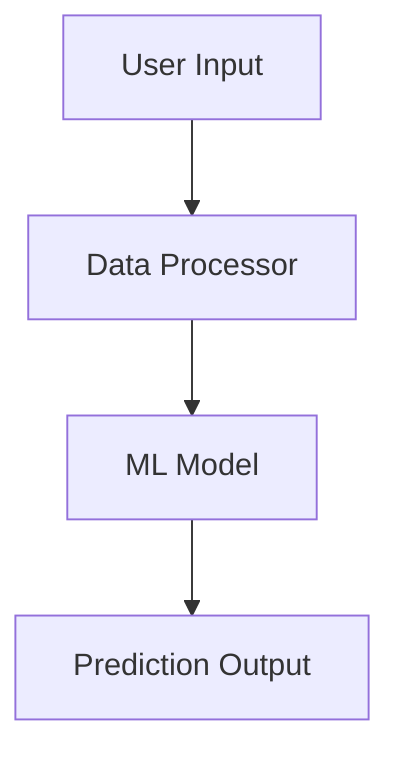

# CLAUDE.md

This file provides guidance to Claude Code (claude.ai/code) when working with code in this repository.

## Repository Overview

This is an **investment open-source analysis repository** that systematically analyzes major financial/investment domain open-source projects through git submodules. The primary purpose is to learn best practices in financial data processing, AI-based investment strategies, and automated trading systems, while extracting reusable components.

**Key Architecture**: This is a meta-analysis repository containing:
- **Source Projects** (`source/`): 4 git submodules with different investment-related open-source projects
- **Analysis Reports** (`report/`): Comprehensive technical documentation generated by various AI models analyzing each submodule
- **No executable code**: This repository itself contains only documentation and analysis, not runnable applications

## Repository Structure

```
investment-open-source-analysis/
├── source/                           # Git submodules (read-only analysis targets)
│   ├── Finance/                     # Financial data analysis toolkit
│   ├── ChatGPT-Micro-Cap-Experiment/ # LLM-based trading bot
│   ├── cluefin/                     # Python investment toolkit
│   └── Kronos/                      # Financial K-line foundation model
│
└── report/                          # AI-generated analysis reports
    ├── Kronos/                      # Multiple reports from different AI models
    │   ├── report-claude-code-sonnet.md     # Claude analysis (English)
    │   ├── report-claude-code-sonnet-ko.md  # Claude analysis (Korean)
    │   ├── report-copilot-*.md              # GitHub Copilot analyses
    │   ├── report-codex.md                  # Codex analysis
    │   └── report-*.md                      # Other AI model analyses
    │
    └── cluefin/                     # Similar structure for Cluefin
        ├── report-claude-code-glm.md
        ├── report-claude-code-glm-ko.md
        └── ...
```

## Submodule Projects

### 1. Finance
- **Focus**: Financial data collection/processing pipelines, technical indicators, data visualization
- **Tech**: Python-based data analysis tools

### 2. ChatGPT-Micro-Cap-Experiment
- **Focus**: LLM-based market analysis, NLP for investment decisions, prompt engineering strategies
- **Tech**: ChatGPT integration for trading automation

### 3. Cluefin
- **Focus**: Modular investment tool architecture, backtesting systems, API integration
- **Tech**: Python toolkit for financial decision-making

### 4. Kronos
- **Focus**: Time-series ML models, large-scale financial dataset processing, model training/inference
- **Tech**: Foundation model for financial candlestick data (45+ exchanges)

## Working with Submodules

### Initialization
```bash
# Clone with submodules
git clone --recursive <repo-url>

# Or initialize after cloning
git submodule update --init --recursive
```

### Updating Submodules
```bash
# Update all submodules to latest
git submodule update --remote

# Update specific submodule
cd source/Kronos
git pull origin main
cd ../..
git add source/Kronos
git commit -m "Update Kronos submodule"
```

### Analyzing New Submodule
```bash
# Navigate to submodule
cd source/[project-name]

# Explore structure
ls -la
find . -name "*.py" -o -name "*.md" | head -20

# Read key documentation
cat README.md
```

## Report Generation Workflow

### Analysis Process
When analyzing a submodule project (e.g., Kronos):

1. **Explore Directory Structure**
   ```bash
   cd source/Kronos
   tree -L 2  # or use find/ls
   ```

2. **Read Core Documentation**
   - README.md
   - LICENSE
   - Configuration files (requirements.txt, package.json, etc.)

3. **Analyze Source Code**
   - Identify main entry points
   - Review core modules and their interactions
   - Examine architecture patterns (class diagrams, data flows)

4. **Create Architecture Diagrams**
   - Use Mermaid for all visualizations
   - Include: system architecture, data flows, component interactions
   - Generate 8-10 comprehensive diagrams per report

5. **Generate Report**
   - Location: `report/[project-name]/report-[ai-model-name].md`
   - Structure: Follow the comprehensive template (see existing reports)
   - Language: Create both English and Korean versions (`-ko.md` suffix)

### Report Structure Template

Based on existing reports (e.g., `report/Kronos/report-claude-code-sonnet.md`), comprehensive analysis reports should include:

1. **Executive Summary** - Project highlights and key takeaways
2. **Project Overview** - Problem definition, solution approach, core features, target users
3. **Technical Architecture** - System diagrams, tech stack, design patterns (with Mermaid)
4. **Project Structure** - Directory layout, file organization rationale
5. **Installation & Setup** - Prerequisites, step-by-step guide, troubleshooting
6. **Usage Guide** - Basic examples, API reference, data format requirements
7. **Development Guidelines** - Environment setup, code style, testing strategy
8. **Deep Dive Sections** - Architecture internals, algorithms, data pipelines
9. **Performance Considerations** - Speed, memory, scalability trade-offs
10. **Security & License** - Security practices, license information
11. **Additional Resources** - Links, related projects, community support
12. **Conclusion** - Summary, limitations, recommendations

### Report Naming Convention

```
report/[project-name]/report-[ai-model]-[language].md

Examples:
- report-claude-code-sonnet.md      # Claude analysis (English)
- report-claude-code-sonnet-ko.md   # Claude analysis (Korean)
- report-copilot-haiku.md           # Copilot with Haiku model
- report-glm.md                     # GLM model analysis
```

## Key Commands for Report Creation

### Reading Source Code
```bash
# Find Python files in submodule
find source/[project] -name "*.py" -type f | head -20

# Read main module
cat source/[project]/main.py

# Search for specific patterns
grep -r "class.*Model" source/[project]/

# View dependencies
cat source/[project]/requirements.txt
cat source/[project]/package.json
```

### Creating Diagrams
Use Mermaid syntax in markdown:

```markdown

```

### Report Generation
```bash
# Create report directory if needed
mkdir -p report/[project-name]

# Create comprehensive markdown report
# Use the Read tool to analyze source files
# Use the Write tool to create report
```

## Analysis Focus Areas

When analyzing each submodule, focus on:

### Technical Analysis
- Programming languages and frameworks
- Architecture patterns and code structure
- Dependency management and external services

### Functional Analysis
- Data sources (financial APIs, data providers)
- Analysis algorithms and signal generation logic
- Automation level (manual/semi-auto/full-auto trading)

### Comparative Evaluation
- Code quality (test coverage, documentation, maintainability)
- Extensibility (adding strategies, multi-asset support, customization)
- Practicality (production readiness, risk management features)

## Important Notes

### What This Repository Is
- A collection of submodules for analysis
- A knowledge base with comprehensive technical reports
- A reference for investment automation best practices

### What This Repository Is NOT
- Not a runnable application (no main.py or entry point in root)
- Not a library to be installed via pip/npm
- Not deployment-ready code (each submodule may be, but not this repo)

### Submodule Licenses
Each submodule follows its original repository's license:
- Finance: Check source/Finance/LICENSE
- ChatGPT-Micro-Cap-Experiment: Check source/ChatGPT-Micro-Cap-Experiment/LICENSE
- cluefin: Check source/cluefin/LICENSE
- Kronos: MIT License (source/Kronos/LICENSE)

### Report Language Policy
- Generate both English and Korean versions for comprehensive reports
- English: Standard filename (e.g., `report-claude-code-sonnet.md`)
- Korean: Add `-ko` suffix (e.g., `report-claude-code-sonnet-ko.md`)
- Maintain identical structure and Mermaid diagrams in both versions
- Translate technical terms accurately while keeping code/commands in original form

## Expected Deliverables

When analyzing a new submodule or improving existing analysis:

1. **Comprehensive Technical Report**
   - 10+ sections covering all aspects
   - 8-10 Mermaid diagrams
   - Both English and Korean versions
   - Code examples and usage patterns

2. **Reusable Component Identification**
   - Extract patterns applicable to other projects
   - Document architectural decisions
   - Highlight best practices

3. **Comparative Insights**
   - How this project compares to others in the repository
   - Unique features and approaches
   - Integration opportunities

## Working with Existing Reports

### Reading Reports
```bash
# View table of contents
head -100 report/Kronos/report-claude-code-sonnet.md

# Search for specific topics
grep -n "## " report/Kronos/report-claude-code-sonnet.md

# Compare different AI analyses
diff report/Kronos/report-claude-code-sonnet.md report/Kronos/report-codex.md
```

### Updating Reports
When improving existing reports:
1. Read the current version thoroughly
2. Identify gaps or outdated information
3. Check if submodule has been updated (`git submodule update --remote`)
4. Regenerate affected sections
5. Maintain consistency with existing structure
6. Update both language versions if applicable

## Git Workflow

### Committing New Reports
```bash
# After generating a new report
git add report/[project-name]/report-*.md
git commit -m "Add [AI-model] analysis report for [project-name]"
git push
```

### Updating Submodules
```bash
# Update to latest submodule version
git submodule update --remote source/[project-name]
git add source/[project-name]
git commit -m "Update [project-name] submodule to latest"
git push
```

## Tips for Effective Analysis

1. **Start with README**: Always read the submodule's README first
2. **Identify Entry Points**: Find main.py, app.py, or similar entry files
3. **Map Dependencies**: Understand external libraries and services used
4. **Visualize Architecture**: Create diagrams before diving deep into code
5. **Test Examples**: If the submodule has examples, understand what they demonstrate
6. **Check Issues/PRs**: Review the original repository's issues for known limitations
7. **License Compliance**: Always note and respect the original project's license
8. **Version Awareness**: Document which version/commit of the submodule was analyzed

## Future Analysis Targets

The repository structure supports adding new submodules. When adding:

1. Add as git submodule: `git submodule add <url> source/[name]`
2. Update `.gitmodules` and README.md
3. Create `report/[name]/` directory
4. Generate comprehensive analysis following the template
5. Update this CLAUDE.md if new patterns emerge
