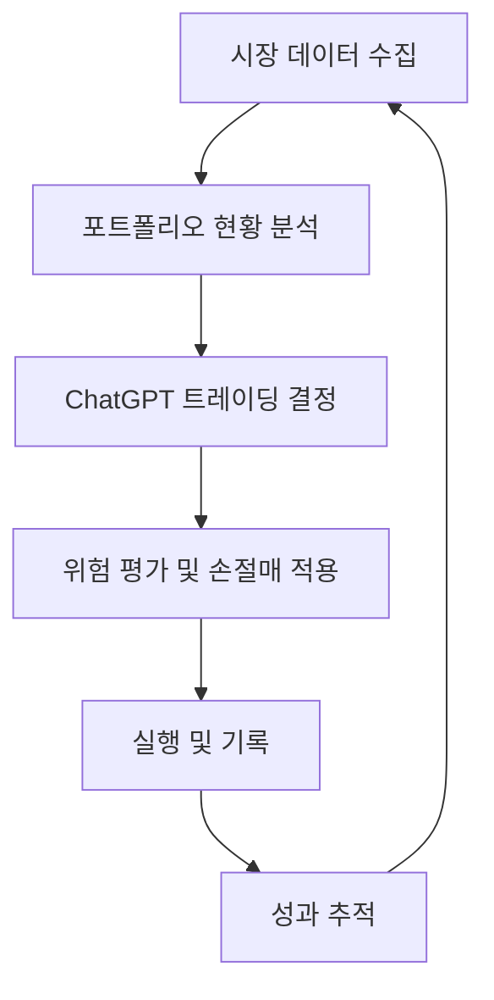
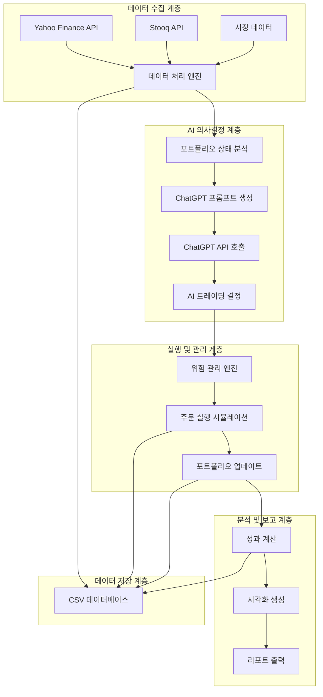
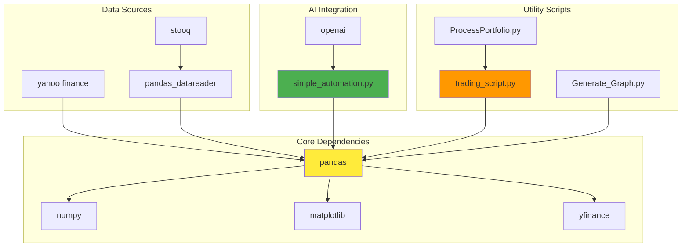
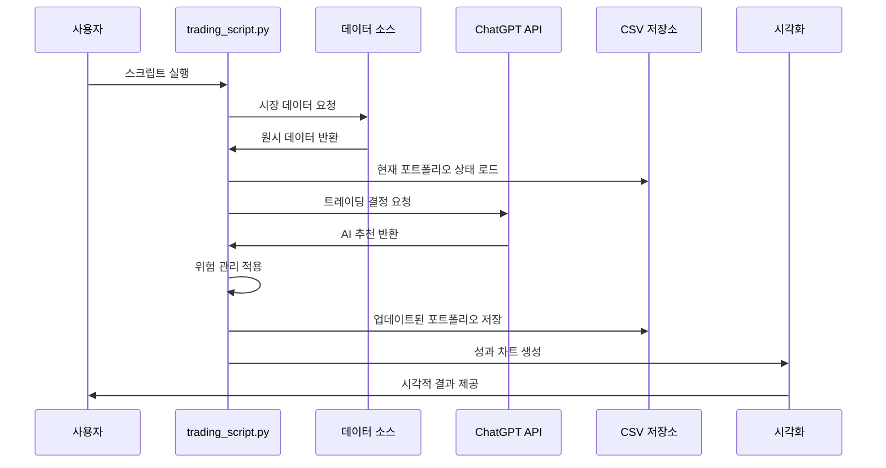
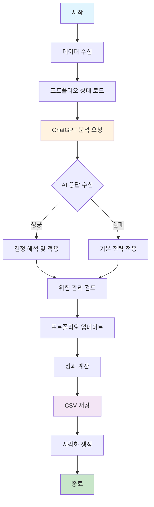
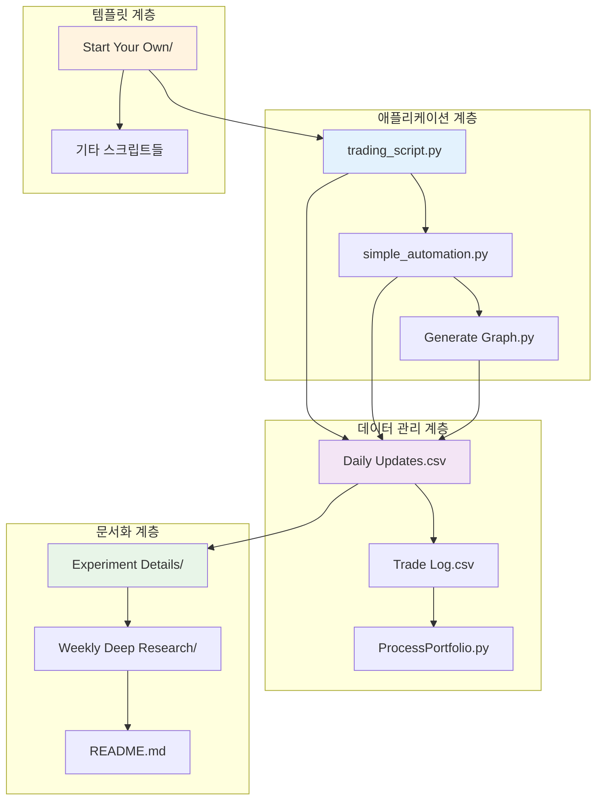
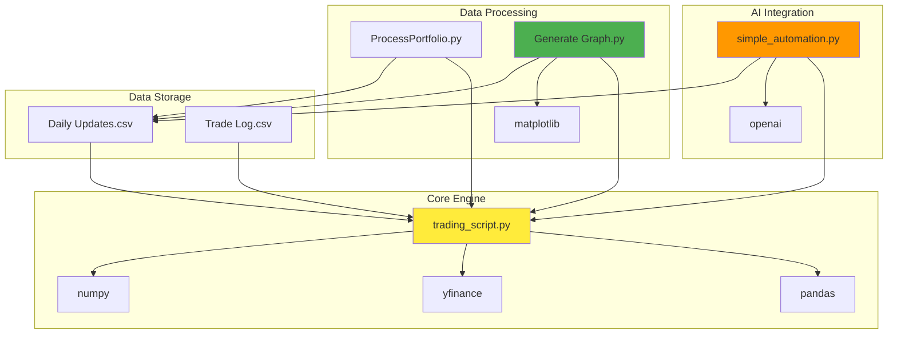
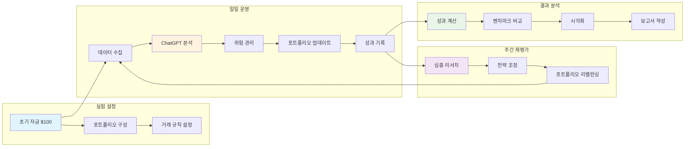
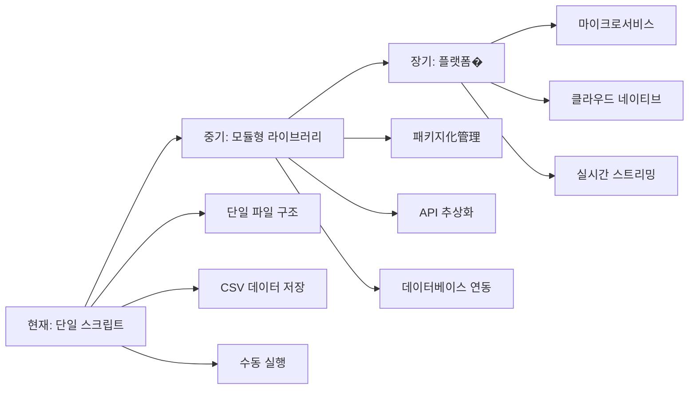

# ChatGPT Micro-Cap Experiment: AI 기반 실자금 트레이딩 실험 종합 기술 문서

## 📋 목차
1. [프로젝트 개요](#프로젝트-개요)
2. [기술 아키텍처](#기술-아키텍처)
3. [프로젝트 구조](#프로젝트-구조)
4. [설치 및 설정](#설치-및-설정)
5. [사용 가이드](#사용-가이드)
6. [개발 지침](#개발-지침)
7. [추가 정보](#추가-정보)

---

## 프로젝트 개요

### 🎯 프로젝트 목적과 기능

**ChatGPT Micro-Cap Experiment**는 ChatGPT가 실제 자금으로 마이크로캡 포트폴리오를 관리하는 6개월간의 라이브 트레이딩 실험입니다. 이 프로젝트는 대규모 언어 모델이 실시간 데이터를 사용하여 알파(초과 수익)를 생성하거나 최소한 현명한 트레이딩 결정을 내릴 수 있는지를 검증하기 위해 설계되었습니다.

#### 핵심 실험 목표
- **AI 트레이딩 능력 검증**: ChatGPT가 실제 시장 환경에서 수익을 창출할 수 있는가?
- **의사결정 프로세스 분석**: LLM의 투자 결정 논리와 패턴 이해
- **리스크 관리 평가**: 자동화된 손절매 규칙과 포트폴리오 관리 효과
- **투명성 제공**: 완전한 공개와 데이터 기반의 실적 추적

#### 주요 기능
- **실시간 포트폴리오 관리**: 매일 포트폴리오 상태 업데이트 및 재평가
- **엄격한 손절매 규칙**: 자동화된 손실 관리 및 위험 제어
- **주간 심층 리서치**: ChatGPT의 포트폴리오 재평가 및 전략 조정
- **성과 추적 및 시각화**: S&P 500 벤치마크 대비 성과 분석
- **완전한 투명성**: 모든 거래 내역과 의사결정 과정 공개

### 🔍 문제 정의

현대 금융 시장에서 AI의 역할에 대한 많은 기대와 과대광이 존재합니다. 그러나 다음과 같은 근본적인 질문들은 충분히 검증되지 않았습니다:

1. **AI의 실제 투자 능력**: 광고에서 주장하는 것처럼 AI가 실제로 저평가된 주식을 식별하고 수익을 창출할 수 있는가?
2. **인간 개입의 필요성**: AI가 완전히 자율적으로 트레이딩 결정을 내릴 수 있는가, 아니면 인간 감독이 필요한가?
3. **리스크 관리 능력**: AI가 시장의 극단적인 변동성을 인식하고 적절히 대응할 수 있는가?
4. **장기적 지속가능성**: 단기적인 성공이 우연인지, 아니면 반복 가능한 전략인가?

### 💡 해결 방법

이 실험은 다음과 같은 통합적 접근 방식을 채택합니다:

1. **실제 자금 투자**: 이론적 백테스팅이 아닌 실제 $100으로 시작하는 라이브 트레이딩
2. **마이크로캡 집중**: 변동성이 크지만 성장 가능성이 있는 소형주에 집중
3. **엄격한 규칙 기반**: 사전에 정의된 손절매와 리스크 관리 규칙 준수
4. **주간 심층 분석**: 매주 ChatGPT의 포트폴리오 재평가와 전략 조정
5. **완전 투명성**: 모든 결정, 성과, 프로세스의 완전한 공개

### 🚀 핵심 기능 상세

#### 1. AI 기반 의사결정 엔진


#### 2. 자동화된 위험 관리
- **동적 손절매**: 각 포지션별 개별화된 손절매 설정
- **포트폴리오 리밸런싱**: 주간 재평가를 통한 자산 재배분
- **시장 감시**: 실시간 가격 변동 모니터링 및 알림

#### 3. 데이터 기반 분석
- **다중 데이터 소스**: Yahoo Finance, Stooq 등 신뢰할 수 있는 데이터 소스
- **벤치마크 비교**: S&P 500 및 관련 지표와의 성과 비교
- **통계적 분석**: 샤프 비율, 최대 손실률, 변동성 등 지표 계산

### 👥 대상 사용자 및 사용 사례

#### 주요 사용자 그룹
1. **AI 연구원**: LLM의 금융 의사결정 능력 연구
2. **퀀트 개발자**: AI 기반 트레이딩 시스템 개발 참고
3. **금융 교육자**: AI와 금융의 융합 교육 자료
4. **개인 투자자**: AI 트레이딩의 현실적인 기대치 설정
5. **학생 및 연구자**: 실증적인 연구 프로젝트 기반

#### 구체적 사용 사례
- **학술 연구**: AI의 금융 시장 예측 능력 실증 연구
- **교육용 도구**: 금융 공학 및 AI 융합 교육
- **전략 백테스팅**: AI 기반 트레이딩 전략 검증
- **위험 관리 연구**: 자동화된 리스크 관리 시스템 연구
- **투명성 모델**: 완전 공개형 투자 운용 모델 연구

---

## 기술 아키텍처

### 🏗️ 고수준 시스템 아키텍처



### 🔧 기술 스택

#### 핵심 프레임워크
```python
# 데이터 처리
pandas==2.2.2          # 데이터 분석 및 조작
numpy==2.3.2           # 수치 계산

# 금융 데이터
yfinance==0.2.65        # Yahoo Finance API
matplotlib==3.8.4      # 데이터 시각화

# AI 통합
openai>=1.0.0          # ChatGPT API (선택사항)
```

#### 아키텍처 결정 사항
- **의존성 최소화**: 핵심 기능에 최소한의 외부 라이브러리 사용
- **데이터 중심**: 모든 상태를 CSV 파일로 저장하여 투명성 확보
- **모듈화**: 기능별로 명확하게 분리된 모듈 구조
- **확장성**: 새로운 데이터 소스나 분석 기법 추가 용이

### 🔗 종속성 관계



### 🎨 디자인 패턴

#### 1. 전략 패턴 (Trading Strategy)
```python
class TradingStrategy:
    """트레이딩 전략 기본 클래스"""

    def analyze_portfolio(self, portfolio_data):
        """포트폴리오 분석"""
        raise NotImplementedError

    def generate_decisions(self, analysis):
        """트레이딩 결정 생성"""
        raise NotImplementedError

class ChatGPTStrategy(TradingStrategy):
    """ChatGPT 기반 트레이딩 전략"""

    def analyze_portfolio(self, portfolio_data):
        # ChatGPT를 통한 포트폴리오 분석
        pass
```

#### 2. 옵저버 패턴 (Performance Monitoring)
```python
class PerformanceObserver:
    """성과 모니터링 옵저버"""

    def update(self, portfolio_state):
        """포트폴리오 상태 업데이트 시 성과 계산"""
        pass

class RiskObserver:
    """위험 관리 옵저버"""

    def update(self, portfolio_state):
        """포트폴리오 상태 업데이트 시 위험 평가"""
        pass
```

#### 3. 팩토리 패턴 (Data Sources)
```python
class DataSourceFactory:
    """데이터 소스 팩토리"""

    @staticmethod
    def create_source(source_type):
        if source_type == 'yahoo':
            return YahooFinanceSource()
        elif source_type == 'stooq':
            return StooqSource()
        else:
            raise ValueError(f"Unknown source: {source_type}")
```

### ⚙️ 아키텍처 결정사항

#### 1. CSV 기반 상태 관리
**결정**: 모든 포트폴리오 상태를 CSV 파일로 관리

**이유**:
- 완전한 투명성과 추적성
- 복잡한 데이터베이스 설정 불필요
- 버전 관리 및 변경 이력 추적 용이
- 단순성과 유지보수성

#### 2. 데이터 소스 중복성 (Redundancy)
**결정**: Yahoo Finance 주요, Stooq 백업 데이터 소스

**이유**:
- 데이터 가용성 극대화
- 단일 실패점(Single Point of Failure) 방지
- 서로 다른 데이터 소스 간 교차 검증 가능

#### 3. 모듈형 스크립트 아키텍처
**결정**: 기능별로 분리된 독립 실행형 스크립트

**이유**:
- 개별 기능 독립적 실행 및 테스트 가능
- 코드 재사용성 극대화
- 유지보수 및 디버깅 용이
- 확장성 확보

### 🔄 구성 요소 상호작용



### 📊 데이터 흐름



---

## 프로젝트 구조

### 📁 디렉토리별 설명

```
ChatGPT-Micro-Cap-Experiment/
├── trading_script.py              # 메인 트레이딩 엔진
├── simple_automation.py          # AI 자동화 스크립트
├── Scripts and CSV Files/         # 실제 포트폴리오 데이터
│   ├── Daily Updates.csv         # 일일 포트폴리오 업데이트
│   ├── Trade Log.csv             # 거래 내역 로그
│   ├── Generate Graph.py         # 성과 시각화 스크립트
│   └── ProcessPortfolio.py      # 포트폴리오 처리 래퍼
├── Start Your Own/               # 신규 실험 시작 템플릿
│   ├── README.md                 # 시작 가이드
│   └── [동일한 스크립트들]         # 템플릿 파일들
├── Experiment Details/           # 실험 상세 문서
│   ├── Prompts.md               # 사용된 프롬프트 모음
│   ├── Chats.md                 # AI 대화 내용
│   ├── Q&A.md                   # 질의응답 모음
│   └── Disclaimer.md            # 면책 조항
├── Weekly Deep Research (MD)/    # 주간 리서치 보고 (Markdown)
├── Weekly Deep Research (PDF)/   # 주간 리서치 보고 (PDF)
├── Other/                       # 기타 문서들
│   ├── License.txt             # MIT 라이선스
│   ├── CONTRIBUTING.md         # 기여 가이드
│   └── performance_chart.png   # 성과 차트
├── Results.png                  # 최신 성과 결과
├── requirements.txt             # 의존성 목록
└── README.md                    # 프로젝트 개요
```

### 🏗️ 파일 구성의 근거

#### 1. 실험 투명성 중심 구조
- **Scripts and CSV Files/**: 실제 운용되는 포트폴리오 데이터
- **Weekly Deep Research/**: 주간 분석 결과의 완전한 기록
- **Experiment Details/**: 실험 과정의 모든 기록 보존

#### 2. 재사용 가능성 고려
- **Start Your Own/**: 다른 사용자를 위한 템플릿 제공
- **모듈형 스크립트**: 독립적으로 실행 가능한 기능 분리
- **명확한 문서화**: 모든 결정 과정과 방법론 상세 기록

#### 3. 데이터 관리 전략
- **CSV 기반 상태 관리**: 단순하고 투명한 데이터 저장
- **일일 자동 업데이트**: 체계적인 데이터 수집 및 관리
- **완전한 추적성**: 모든 변경 사항의 시간별 기록

### 🌳 프로젝트 계층 구조



### 📦 모듈 상호 의존성



### 🔄 실행 흐름 아키텍처



---

## 설치 및 설정

### 📋 전제 조건

#### 시스템 요구사항
- **운영체제**: Linux, macOS, Windows
- **Python**: 3.11 이상 (권장 3.11+)
- **메모리**: 최소 2GB RAM (권장 4GB+)
- **저장 공간**: 최소 50MB 여유 공간
- **인터넷 연결**: 실시간 시장 데이터 수집을 위한 안정적인 연결

#### 소프트웨어 의존성
```bash
# 기본 파이썬 환경
Python >= 3.11
pip >= 21.0

# 선택적 AI 통합
openai>=1.0.0  # ChatGPT API 사용 시
```

### 🚀 단계별 설치 가이드

#### 1. 저장소 클론 및 환경 설정

```bash
# 저장소 클론
git clone https://github.com/LuckyOne7777/ChatGPT-Micro-Cap-Experiment.git
cd ChatGPT-Micro-Cap-Experiment

# 가상환경 생성 (강력 권장)
python -m venv chatgpt_trading_env

# 가상환경 활성화
# Linux/macOS:
source chatgpt_trading_env/bin/activate
# Windows:
chatgpt_trading_env\Scripts\activate
```

#### 2. 의존성 설치

```bash
# 기본 의존성 설치
pip install -r requirements.txt

# AI 자동화 기능을 위한 추가 의존성 (선택사항)
pip install openai

# 설치 확인
python -c "import pandas, yfinance, matplotlib; print('All dependencies installed successfully')"
```

#### 3. 초기 설정

```bash
# 스크립트 실행 가능성 확인
python trading_script.py --help

# 데이터 디렉토리 구조 확인
ls "Scripts and CSV Files/"

# Makefile 사용 (선택사항)
make help
```

#### 4. AI 통합 설정 (선택사항)

```bash
# OpenAI API 키 설정
export OPENAI_API_KEY="your_openai_api_key_here"

# 또는 .env 파일 생성
echo "OPENAI_API_KEY=your_openai_api_key_here" > .env
```

### ⚙️ 구성 지침

#### 1. 데이터 디렉토리 설정

**데이터 파일 구조**:
```
Scripts and CSV Files/
├── Daily Updates.csv     # 포트폴리오 일일 상태
├── Trade Log.csv        # 모든 거래 내역
└── [기타 데이터 파일들]
```

**CSV 파일 포맷**:
- **Daily Updates.csv**: 날짜, 티커, 수량, 평균가, 현재가, 총자산 등
- **Trade Log.csv**: 날짜, 티커, 거래 유형, 수량, 가격, 수수료 등

#### 2. 포트폴리오 초기화

```python
# 초기 포트폴리오 설정 (Daily Updates.csv)
Date,Ticker,Quantity,Avg Price,Current Price,Total Value,P&L
2025-06-27,CASH,0,0,0,100.0,0.0
2025-06-27,TOTAL,0,0,0,100.0,0.0
```

#### 3. 벤치마크 설정

```python
# 기본 벤치마크 티커 (trading_script.py)
DEFAULT_BENCHMARKS = ["IWO", "XBI", "SPY", "IWM"]

# 개별 벤치마크 추가 가능
custom_benchmarks = ["QQQ", "VTI", "VOO"]
```

### 🔧 일반적인 문제 해결

#### 1. 데이터 수집 관련 문제

**문제**: Yahoo Finance API 오류
```python
# 해결책 1: pandas-datareader 대체 사용
import pandas_datareader.data as pdr

# 해결책 2: 데이터 소스 순환 사용
def fetch_data_with_fallback(ticker):
    try:
        # Yahoo Finance 시도
        return yf.download(ticker, start=start_date, end=end_date)
    except:
        try:
            # Stooq 백업 시도
            return pdr.get_data_stooq(ticker, start=start_date, end=end_date)
        except:
            print(f"Failed to fetch data for {ticker}")
            return None
```

**문제**: 주말/휴일 데이터 수집
```python
# 해결책: 영업일 확인 로직
from pandas.tseries.offsets import BDay

def is_trading_day(date):
    """해당 날짜가 영업일인지 확인"""
    return bool(len(pd.bdate_range(date, date)))
```

#### 2. AI 통합 문제

**문제**: OpenAI API 연결 오류
```python
# 해결책: API 키 확인 및 재시도 로직
import time
from openai import OpenAI

def get_chatgpt_response(prompt, max_retries=3):
    client = OpenAI()

    for attempt in range(max_retries):
        try:
            response = client.chat.completions.create(
                model="gpt-4",
                messages=[{"role": "user", "content": prompt}]
            )
            return response.choices[0].message.content
        except Exception as e:
            if attempt == max_retries - 1:
                raise
            print(f"Attempt {attempt + 1} failed: {e}")
            time.sleep(2 ** attempt)  # 지수 백오프
```

#### 3. 시각화 문제

**문제**: Matplotlib 표시 오류 (서버 환경)
```python
# 해결책: 백엔드 설정
import matplotlib
matplotlib.use('Agg')  # GUI 없는 환경
import matplotlib.pyplot as plt

# 또는 이미지 파일로 저장
plt.savefig('performance_chart.png', dpi=300, bbox_inches='tight')
```

**문제**: 한글 폰트 깨짐
```python
# 해결책: 폰트 설정
import matplotlib.pyplot as plt
import matplotlib.font_manager as fm

# 시스템에 설치된 한글 폰트 사용
plt.rcParams['font.family'] = 'Malgun Gothic'  # Windows
# plt.rcParams['font.family'] = 'AppleGothic'  # macOS
```

#### 4. 권한 문제

**문제**: 파일 쓰기 권한 오류
```bash
# 해결책: 디렉토리 권한 확인 및 수정
ls -la "Scripts and CSV Files/"
chmod 755 "Scripts and CSV Files/"
chmod 644 "Scripts and CSV Files"/*.csv
```

### 📊 성능 벤치마크

#### 하드웨어 요구사양

| 작업 유형 | 최소 사양 | 권장 사양 |
|-----------|-----------|-----------|
| 기본 데이터 수집 | CPU 1코어, 2GB RAM | CPU 2코어, 4GB RAM |
| AI 분석 통합 | CPU 2코어, 4GB RAM | CPU 4코어, 8GB RAM |
| 대규모 데이터 처리 | CPU 4코어, 8GB RAM | CPU 8코어, 16GB RAM |

#### 처리량 기준

| 작업 | 데이터 크기 | 처리 시간 | 메모리 사용량 |
|------|------------|-----------|-------------|
| 시장 데이터 수집 | 20개 티커 | ~10초 | ~50MB |
| 포트폴리오 분석 | 1일 데이터 | ~5초 | ~20MB |
| 성과 차트 생성 | 6개월 데이터 | ~3초 | ~30MB |
| AI 분석 요청 | 텍스트 1KB | ~5-15초 | ~100MB |

---

## 사용 가이드

### 🎯 기본 사용 예제

#### 1. 포트폴리오 상태 확인

가장 기본적인 형태의 포트폴리오 확인 예제입니다:

```python
import pandas as pd
from pathlib import Path

def check_portfolio_status():
    """현재 포트폴리오 상태 확인"""

    # 포트폴리오 데이터 로드
    portfolio_file = Path("Scripts and CSV Files/Daily Updates.csv")

    if not portfolio_file.exists():
        print("포트폴리오 데이터 파일이 없습니다.")
        return

    df = pd.read_csv(portfolio_file)

    # 최신 날짜 데이터 확인
    latest_date = df['Date'].max()
    latest_data = df[df['Date'] == latest_date]

    print(f"=== 포트폴리오 현황 ({latest_date}) ===")
    print(latest_data.to_string(index=False))

    # 총자산 확인
    total_equity = latest_data[latest_data['Ticker'] == 'TOTAL']['Total Equity'].iloc[0]
    cash = latest_data[latest_data['Ticker'] == 'CASH']['Total Value'].iloc[0]

    print(f"\n총자산: ${total_equity:,.2f}")
    print(f"현금 잔액: ${cash:,.2f}")
    print(f"투자금액: ${total_equity - cash:,.2f}")

# 실행
check_portfolio_status()
```

#### 2. 성과 분석 및 시각화

```python
import matplotlib.pyplot as plt
import pandas as pd
import yfinance as yf
from pathlib import Path

def generate_performance_chart():
    """성과 차트 생성"""

    # 포트폴리오 데이터 로드
    portfolio_file = Path("Scripts and CSV Files/Daily Updates.csv")
    portfolio_df = pd.read_csv(portfolio_file)

    # 총자산 데이터 추출
    total_data = portfolio_df[portfolio_df['Ticker'] == 'TOTAL'].copy()
    total_data['Date'] = pd.to_datetime(total_data['Date'])
    total_data['Total Equity'] = pd.to_numeric(total_data['Total Equity'], errors='coerce')

    # 벤치마크 데이터 다운로드 (S&P 500)
    start_date = total_data['Date'].min()
    end_date = total_data['Date'].max()

    sp500 = yf.download('^SPX', start=start_date, end=end_date, progress=False)
    sp500 = sp500.reset_index()

    # 벤치마크 정규화 ($100 기준)
    baseline_value = 100.0
    sp500['Normalized'] = (sp500['Close'] / sp500['Close'].iloc[0]) * baseline_value

    # 차트 생성
    plt.figure(figsize=(12, 6))

    plt.plot(total_data['Date'], total_data['Total Equity'],
             label='ChatGPT Portfolio', linewidth=2, color='blue')
    plt.plot(sp500['Date'], sp500['Normalized'],
             label='S&P 500', linewidth=2, color='red', alpha=0.7)

    plt.title('ChatGPT Micro-Cap Portfolio vs S&P 500', fontsize=14, fontweight='bold')
    plt.xlabel('Date', fontsize=12)
    plt.ylabel('Portfolio Value ($)', fontsize=12)
    plt.legend(fontsize=11)
    plt.grid(True, alpha=0.3)

    # 성과 통계
    portfolio_return = (total_data['Total Equity'].iloc[-1] / total_data['Total Equity'].iloc[0] - 1) * 100
    sp500_return = (sp500['Normalized'].iloc[-1] / sp500['Normalized'].iloc[0] - 1) * 100

    plt.text(0.02, 0.98, f'Portfolio Return: {portfolio_return:.1f}%',
             transform=plt.gca().transAxes, fontsize=10, verticalalignment='top',
             bbox=dict(boxstyle='round', facecolor='wheat', alpha=0.8))
    plt.text(0.02, 0.92, f'S&P 500 Return: {sp500_return:.1f}%',
             transform=plt.gca().transAxes, fontsize=10, verticalalignment='top',
             bbox=dict(boxstyle='round', facecolor='lightblue', alpha=0.8))

    plt.tight_layout()
    plt.savefig('performance_comparison.png', dpi=300, bbox_inches='tight')
    plt.show()

    return portfolio_return, sp500_return

# 실행
portfolio_ret, sp500_ret = generate_performance_chart()
print(f"포트폴리오 수익률: {portfolio_ret:.2f}%")
print(f"S&P 500 수익률: {sp500_ret:.2f}%")
```

#### 3. 거래 내역 분석

```python
import pandas as pd
from pathlib import Path
from datetime import datetime

def analyze_trading_history():
    """거래 내역 분석"""

    # 거래 로그 로드
    trade_log_file = Path("Scripts and CSV Files/Trade Log.csv")

    if not trade_log_file.exists():
        print("거래 내역 파일이 없습니다.")
        return

    df = pd.read_csv(trade_log_file)
    df['Date'] = pd.to_datetime(df['Date'])

    print("=== 거래 내역 분석 ===")

    # 기본 통계
    total_trades = len(df)
    buy_trades = len(df[df['Action'] == 'BUY'])
    sell_trades = len(df[df['Action'] == 'SELL'])

    print(f"총 거래 횟수: {total_trades}")
    print(f"매수: {buy_trades}, 매도: {sell_trades}")

    # 거래량 상위 종목
    ticker_volume = df.groupby('Ticker')['Quantity'].sum().sort_values(ascending=False)
    print(f"\n거래량 상위 종목:")
    print(ticker_volume.head(5))

    # 월별 거래 추이
    df['Month'] = df['Date'].dt.to_period('M')
    monthly_trades = df.groupby('Month').size()

    print(f"\n월별 거래 횟수:")
    print(monthly_trades)

    # 수익률 계산 (매수-매수 쌍 기준)
    buy_trades_df = df[df['Action'] == 'BUY'].copy()
    sell_trades_df = df[df['Action'] == 'SELL'].copy()

    if not buy_trades_df.empty and not sell_trades_df.empty:
        # 손익 계산 (단순화된 버전)
        matched_trades = []
        for _, sell in sell_trades_df.iterrows():
            matching_buy = buy_trades_df[
                (buy_trades_df['Ticker'] == sell['Ticker']) &
                (buy_trades_df['Date'] < sell['Date'])
            ].iloc[0] if not buy_trades_df[
                (buy_trades_df['Ticker'] == sell['Ticker']) &
                (buy_trades_df['Date'] < sell['Date'])
            ].empty else None

            if matching_buy is not None:
                profit = (sell['Price'] - matching_buy['Price']) * sell['Quantity']
                profit_pct = ((sell['Price'] / matching_buy['Price']) - 1) * 100
                matched_trades.append({
                    'Ticker': sell['Ticker'],
                    'Buy_Date': matching_buy['Date'].date(),
                    'Sell_Date': sell['Date'].date(),
                    'Profit': profit,
                    'Profit_%': profit_pct
                })

        if matched_trades:
            profit_df = pd.DataFrame(matched_trades)
            total_profit = profit_df['Profit'].sum()
            win_rate = (profit_df['Profit'] > 0).mean() * 100

            print(f"\n=== 완료된 거래 분석 ===")
            print(f"총 손익: ${total_profit:.2f}")
            print(f"승률: {win_rate:.1f}%")
            print(f"평균 수익률: {profit_df['Profit_%'].mean():.2f}%")

            # 수익률 분포
            print(f"\n수익률 분포:")
            print(profit_df['Ticker'].value_counts().head(5))

# 실행
analyze_trading_history()
```

### 🔧 고급 기능

#### 1. ChatGPT 자동화 트레이딩

```python
import os
import pandas as pd
from pathlib import Path
from trading_script import process_portfolio, load_latest_portfolio_state

def automated_chatgpt_trading():
    """ChatGPT를 통한 자동화 트레이딩 결정"""

    # API 키 확인
    api_key = os.getenv('OPENAI_API_KEY')
    if not api_key:
        print("OpenAI API 키가 설정되지 않았습니다.")
        return

    try:
        import openai
        client = openai.OpenAI(api_key=api_key)
    except ImportError:
        print("OpenAI 라이브러리가 설치되지 않았습니다.")
        return

    # 현재 포트폴리오 상태 로드
    portfolio_state = load_latest_portfolio_state()

    if portfolio_state.empty:
        print("포트폴리오 상태를 로드할 수 없습니다.")
        return

    # ChatGPT 프롬프트 생성
    prompt = generate_trading_prompt(portfolio_state)

    # ChatGPT API 호출
    try:
        response = client.chat.completions.create(
            model="gpt-4",
            messages=[
                {"role": "system", "content": "You are a professional portfolio manager."},
                {"role": "user", "content": prompt}
            ],
            temperature=0.3,
            max_tokens=1000
        )

        ai_decision = response.choices[0].message.content
        print("=== ChatGPT 트레이딩 결정 ===")
        print(ai_decision)

        # 결정 파싱 및 적용
        apply_ai_decision(ai_decision)

    except Exception as e:
        print(f"ChatGPT API 호출 실패: {e}")
        return

def generate_trading_prompt(portfolio_df):
    """트레이딩 결정을 위한 프롬프트 생성"""

    cash = portfolio_df[portfolio_df['Ticker'] == 'CASH']['Total Value'].iloc[0]
    total_equity = portfolio_df[portfolio_df['Ticker'] == 'TOTAL']['Total Equity'].iloc[0]

    # 보유 종목 정보 포맷팅
    holdings = portfolio_df[
        (portfolio_df['Ticker'] != 'CASH') &
        (portfolio_df['Ticker'] != 'TOTAL')
    ].to_string(index=False)

    prompt = f"""
    당신은 $100으로 시작한 마이크로캡 포트폴리오 관리자입니다.

    현재 포트폴리오 상태:
    - 총자산: ${total_equity:.2f}
    - 현금 잔액: ${cash:.2f}

    현재 보유 종목:
    {holdings}

    다음 지침에 따라 트레이딩 결정을 내려주세요:
    1. 손절매 규칙: -15% 손실 시 즉시 매도
    2. 각 종목 최대 20% 포트폴리오 비중
    3. 마이크로캡(시가총액 $3억 이하) 종목만 고려
    4. 주 1회 거래는 최대 1개 종목으로 제한

    현재 시장 상황과 각 종목의 펀더멘탈을 고려하여:
    - 매도할 종목이 있나요? (이유 포함)
    - 매수할 새로운 종목이 있나요? (후보 1-2개, 이유 포함)
    - 아니면 현상 유지가 최선인가요?

    결정 형식: [ACTION] [TICKER] [QUANTITY] [REASON]
    예시: [SELL] AAPL 10 "기술주 전반적 약세로 인한 손절매 실행"
    """

    return prompt

def apply_ai_decision(decision_text):
    """AI 결정을 포트폴리오에 적용"""

    # 결정 파싱 (간단화된 버전)
    lines = decision_text.split('\n')
    actions = [line for line in lines if line.strip().startswith('[')]

    for action in actions:
        try:
            # 간단한 파싱 로직
            if '[SELL]' in action or '[BUY]' in action:
                print(f"적용할 거래: {action}")
                # 실제 거래 실행 로직 (trading_script.py의 함수 호출)
                # execute_trade(action)
        except Exception as e:
            print(f"거래 적용 실패: {e}")

# 실행
automated_chatgpt_trading()
```

#### 2. 위험 관리 대시보드

```python
import matplotlib.pyplot as plt
import pandas as pd
import numpy as np
from pathlib import Path

def create_risk_dashboard():
    """위험 관리 대시보드 생성"""

    # 데이터 로드
    portfolio_file = Path("Scripts and CSV Files/Daily Updates.csv")
    trade_log_file = Path("Scripts and CSV Files/Trade Log.csv")

    portfolio_df = pd.read_csv(portfolio_file)
    trade_log_df = pd.read_csv(trade_log_file)

    # 서브플롯 설정
    fig, axes = plt.subplots(2, 2, figsize=(15, 10))
    fig.suptitle('Portfolio Risk Dashboard', fontsize=16, fontweight='bold')

    # 1. 포트폴리오 성과 추이
    ax1 = axes[0, 0]
    total_data = portfolio_df[portfolio_df['Ticker'] == 'TOTAL'].copy()
    total_data['Date'] = pd.to_datetime(total_data['Date'])
    total_data['Total Equity'] = pd.to_numeric(total_data['Total Equity'], errors='coerce')

    ax1.plot(total_data['Date'], total_data['Total Equity'], color='blue', linewidth=2)
    ax1.set_title('Portfolio Equity Over Time')
    ax1.set_ylabel('Equity ($)')
    ax1.grid(True, alpha=0.3)

    # 2. 포트폴리오 구성
    ax2 = axes[0, 1]
    latest_data = portfolio_df[portfolio_df['Date'] == portfolio_df['Date'].max()]
    holdings = latest_data[
        (latest_data['Ticker'] != 'CASH') &
        (latest_data['Ticker'] != 'TOTAL')
    ]

    if not holdings.empty:
        ax2.pie(holdings['Total Value'], labels=holdings['Ticker'], autopct='%1.1f%%')
        ax2.set_title('Portfolio Composition')

    # 3. 거래 빈도
    ax3 = axes[1, 0]
    trade_log_df['Date'] = pd.to_datetime(trade_log_df['Date'])
    trade_log_df['Week'] = trade_log_df['Date'].dt.to_period('W')
    weekly_trades = trade_log_df.groupby('Week').size()

    ax3.bar(range(len(weekly_trades)), weekly_trades.values, color='green', alpha=0.7)
    ax3.set_title('Weekly Trading Frequency')
    ax3.set_xlabel('Week')
    ax3.set_ylabel('Number of Trades')
    ax3.grid(True, alpha=0.3)

    # 4. 손익 분석
    ax4 = axes[1, 1]

    # 간단화된 손익 계산
    buy_trades = trade_log_df[trade_log_df['Action'] == 'BUY']
    sell_trades = trade_log_df[trade_log_df['Action'] == 'SELL']

    profits = []
    for _, sell in sell_trades.iterrows():
        matching_buy = buy_trades[
            (buy_trades['Ticker'] == sell['Ticker']) &
            (buy_trades['Date'] < sell['Date'])
        ]
        if not matching_buy.empty:
            buy_price = matching_buy.iloc[0]['Price']
            profit_pct = ((sell['Price'] / buy_price) - 1) * 100
            profits.append(profit_pct)

    if profits:
        ax4.hist(profits, bins=10, color='orange', alpha=0.7, edgecolor='black')
        ax4.axvline(x=0, color='red', linestyle='--', alpha=0.7)
        ax4.set_title('Profit/Loss Distribution')
        ax4.set_xlabel('Profit/Loss (%)')
        ax4.set_ylabel('Frequency')
        ax4.grid(True, alpha=0.3)

    plt.tight_layout()
    plt.savefig('risk_dashboard.png', dpi=300, bbox_inches='tight')
    plt.show()

# 실행
create_risk_dashboard()
```

#### 3. 자동화된 리포트 생성

```python
import pandas as pd
from pathlib import Path
from datetime import datetime
import matplotlib.pyplot as plt

def generate_weekly_report():
    """주간 성과 보고 자동 생성"""

    # 현재 날짜
    current_date = datetime.now().strftime('%Y-%m-%d')

    # 데이터 로드
    portfolio_file = Path("Scripts and CSV Files/Daily Updates.csv")
    trade_log_file = Path("Scripts and CSV Files/Trade Log.csv")

    portfolio_df = pd.read_csv(portfolio_file)
    trade_log_df = pd.read_csv(trade_log_file)

    # 보고서 생성
    report = f"""
# ChatGPT Micro-Cap Portfolio Weekly Report
Generated on: {current_date}

## Executive Summary
- Portfolio Value: ${get_current_portfolio_value(portfolio_df):.2f}
- Total Return: {calculate_total_return(portfolio_df):.2f}%
- Number of Holdings: {count_holdings(portfolio_df)}
- Weekly Trades: {count_weekly_trades(trade_log_df)}

## Current Holdings
{format_holdings(portfolio_df)}

## Recent Performance
{analyze_recent_performance(portfolio_df)}

## Risk Metrics
{calculate_risk_metrics(portfolio_df)}

## Trading Activity
{analyze_trading_activity(trade_log_df)}

## AI Decision Summary
{summarize_ai_decisions()}
    """

    # 보고서 파일 저장
    report_filename = f"weekly_report_{current_date}.md"
    with open(report_filename, 'w') as f:
        f.write(report)

    print(f"Weekly report generated: {report_filename}")
    return report_filename

def get_current_portfolio_value(df):
    """현재 포트폴리오 가격"""
    latest_data = df[df['Date'] == df['Date'].max()]
    total_equity = latest_data[latest_data['Ticker'] == 'TOTAL']['Total Equity'].iloc[0]
    return float(total_equity)

def calculate_total_return(df):
    """총 수익률 계산"""
    total_data = df[df['Ticker'] == 'TOTAL'].copy()
    if len(total_data) < 2:
        return 0.0

    initial_value = total_data['Total Equity'].iloc[0]
    current_value = total_data['Total Equity'].iloc[-1]

    return ((current_value / initial_value) - 1) * 100

def count_holdings(df):
    """보유 종목 수 계산"""
    latest_data = df[df['Date'] == df['Date'].max()]
    holdings = latest_data[
        (latest_data['Ticker'] != 'CASH') &
        (latest_data['Ticker'] != 'TOTAL')
    ]
    return len(holdings)

def count_weekly_trades(df):
    """주간 거래 횟수 계산"""
    df['Date'] = pd.to_datetime(df['Date'])
    week_ago = pd.Timestamp.now() - pd.Timedelta(days=7)
    recent_trades = df[df['Date'] >= week_ago]
    return len(recent_trades)

def format_holdings(df):
    """보유 종목 포맷팅"""
    latest_data = df[df['Date'] == df['Date'].max()]
    holdings = latest_data[
        (latest_data['Ticker'] != 'CASH') &
        (latest_data['Ticker'] != 'TOTAL')
    ]

    if holdings.empty:
        return "No current holdings"

    return holdings[['Ticker', 'Quantity', 'Avg Price', 'Current Price', 'Total Value', 'P&L']].to_string(index=False)

def analyze_recent_performance(df):
    """최근 성과 분석"""
    total_data = df[df['Ticker'] == 'TOTAL'].copy()
    total_data['Date'] = pd.to_datetime(total_data['Date'])

    # 최근 30일 성과
    thirty_days_ago = pd.Timestamp.now() - pd.Timedelta(days=30)
    recent_data = total_data[total_data['Date'] >= thirty_days_ago]

    if len(recent_data) < 2:
        return "Insufficient data for recent performance analysis"

    initial_value = recent_data['Total Equity'].iloc[0]
    current_value = recent_data['Total Equity'].iloc[-1]
    return_value = ((current_value / initial_value) - 1) * 100

    return f"30-day return: {return_value:.2f}%"

def calculate_risk_metrics(df):
    """위험 지표 계산"""
    total_data = df[df['Ticker'] == 'TOTAL'].copy()
    total_data['Date'] = pd.to_datetime(total_data['Date'])
    total_data['Daily Return'] = total_data['Total Equity'].pct_change()

    # 변동성 (연율화)
    volatility = total_data['Daily Return'].std() * np.sqrt(252) * 100

    # 최대 손실률
    cumulative_returns = (1 + total_data['Daily Return']).cumprod()
    running_max = cumulative_returns.expanding().max()
    drawdown = (cumulative_returns - running_max) / running_max
    max_drawdown = drawdown.min() * 100

    return f"""
- Volatility (Annualized): {volatility:.2f}%
- Maximum Drawdown: {max_drawdown:.2f}%
- Current Drawdown: {drawdown.iloc[-1]*100:.2f}%
    """

def analyze_trading_activity(df):
    """거래 활동 분석"""
    if df.empty:
        return "No trading activity recorded"

    df['Date'] = pd.to_datetime(df['Date'])

    total_trades = len(df)
    buy_trades = len(df[df['Action'] == 'BUY'])
    sell_trades = len(df[df['Action'] == 'SELL'])

    # 가장 활발한 종목
    most_active = df.groupby('Ticker').size().idxmax()

    return f"""
- Total Trades: {total_trades}
- Buy Orders: {buy_trades}
- Sell Orders: {sell_trades}
- Most Active Ticker: {most_active}
    """

def summarize_ai_decisions():
    """AI 결정 요약"""
    # 이 부분은 실제 AI 결정 로그를 분석하여 구현
    return "AI decisions analysis placeholder - integrate with actual AI decision logs"

# 실행
generate_weekly_report()
```

### ⚙️ 구성 옵션

#### 1. 환경 변수 설정

```bash
# .env 파일
OPENAI_API_KEY=your_openai_api_key_here
ASOF_DATE=2025-09-30  # 특정 날짜로 테스트
DATA_DIR=./custom_data_dir
LOG_LEVEL=INFO
```

#### 2. 트레이딩 파라미터 설정

```python
# config.py
TRADING_CONFIG = {
    'initial_capital': 100.0,
    'max_position_size': 0.20,  # 최대 20% 포트폴리오 비중
    'stop_loss_threshold': -0.15,  # -15% 손절매
    'max_trades_per_day': 1,  # 일일 최대 거래 횟수
    'rebalance_frequency': 'weekly',  # 리밸런싱 빈도
    'benchmarks': ['IWO', 'XBI', 'SPY', 'IWM']
}

RISK_CONFIG = {
    'max_drawdown_threshold': -0.25,  # 최대 손실률 -25%
    'volatility_threshold': 0.30,  # 연변동성 30% 이상 시 위험 경고
    'concentration_limit': 0.30,  # 단일 종목 최대 30% 비중
}

AI_CONFIG = {
    'model': 'gpt-4',
    'temperature': 0.3,
    'max_tokens': 1000,
    'system_prompt': 'You are a professional portfolio manager...'
}
```

### 📚 API 문서

#### 주요 클래스 및 함수

**TradingScript 클래스**:
```python
class TradingEngine:
    """메인 트레이딩 엔진 클래스"""

    def __init__(self, data_dir=None):
        """
        트레이딩 엔진 초기화

        Args:
            data_dir (Path): 데이터 디렉토리 경로
        """

    def fetch_market_data(self, tickers, start_date, end_date):
        """
        시장 데이터 수집

        Args:
            tickers (list): 종목 티커 리스트
            start_date (str): 시작일
            end_date (str): 종료일

        Returns:
            pd.DataFrame: 시장 데이터
        """

    def process_portfolio(self, data_dir):
        """
        포트폴리오 처리 및 업데이트

        Args:
            data_dir (Path): 데이터 디렉토리

        Returns:
            dict: 처리 결과
        """

    def apply_stop_loss(self, portfolio_data):
        """
        손절매 규칙 적용

        Args:
            portfolio_data (pd.DataFrame): 포트폴리오 데이터

        Returns:
            list: 실행된 손절매 목록
        """
```

**ChatGPTAnalyzer 클래스**:
```python
class ChatGPTAnalyzer:
    """ChatGPT 기반 분석 클래스"""

    def __init__(self, api_key=None):
        """
        ChatGPT 분석기 초기화

        Args:
            api_key (str): OpenAI API 키
        """

    def generate_trading_decision(self, portfolio_data, market_data):
        """
        트레이딩 결정 생성

        Args:
            portfolio_data (pd.DataFrame): 포트폴리오 데이터
            market_data (pd.DataFrame): 시장 데이터

        Returns:
            str: AI 트레이딩 결정
        """

    def analyze_market_conditions(self, tickers):
        """
        시장 상황 분석

        Args:
            tickers (list): 분석할 종목 티커

        Returns:
            dict: 시장 분석 결과
        """

    def generate_research_report(self, portfolio_state):
        """
        주간 리서치 보고 생성

        Args:
            portfolio_state (dict): 포트폴리오 상태

        Returns:
            str: 리서치 보고
        """
```

### 💻 명령줄 인터페이스 참조

#### 1. 기본 명령어

```bash
# 포트폴리오 처리
python trading_script.py

# 특정 데이터 디렉토리 사용
python trading_script.py --data-dir ./custom_data

# 특정 날짜로 테스트 (백테스팅용)
ASOF_DATE=2025-09-30 python trading_script.py

# AI 자동화 실행
python simple_automation.py --api-key YOUR_KEY

# 성과 차트 생성
python "Scripts and CSV Files/Generate Graph.py"

# 포트폴리오 처리 (래퍼)
python "Scripts and CSV Files/ProcessPortfolio.py"
```

#### 2. Makefile 사용

```bash
# Makefile에서 제공하는 명령어
make help          # 사용 가능한 명령어 목록
make run           # 트레이딩 스크립트 실행
make graph         # 성과 차트 생성
make clean         # 임시 파일 정리
```

#### 3. 일괄 처리 스크립트

```bash
#!/bin/bash
# daily_update.sh - 일일 업데이트 스크립트

echo "=== ChatGPT Micro-Cap Daily Update ==="
echo "Date: $(date)"

# 1. 데이터 수집 및 포트폴리오 처리
python trading_script.py

# 2. 성과 차트 업데이트
python "Scripts and CSV Files/Generate Graph.py"

# 3. AI 분석 실행 (API 키가 설정된 경우)
if [ ! -z "$OPENAI_API_KEY" ]; then
    python simple_automation.py
fi

# 4. 리포트 생성
python generate_weekly_report.py

echo "Daily update completed!"
```

---

## 개발 지침

### 🛠️ 개발 환경 설정

#### 1. 개발 환경 구축

```bash
# 1. 저장소 클론
git clone https://github.com/LuckyOne7777/ChatGPT-Micro-Cap-Experiment.git
cd ChatGPT-Micro-Cap-Experiment

# 2. 개발용 가상환경 생성
python -m venv dev_env
source dev_env/bin/activate  # Linux/macOS
# dev_env\Scripts\activate  # Windows

# 3. 개발 의존성 설치
pip install -r requirements.txt
pip install pytest pytest-cov black flake8  # 개발 도구

# 4. pre-commit 훅 설정
pre-commit install
```

#### 2. 개발용 의존성 (requirements-dev.txt)

```
# 테스트
pytest>=7.0.0
pytest-cov>=4.0.0
pytest-mock>=3.10.0

# 코드 품질
black>=22.0.0
isort>=5.10.0
flake8>=5.0.0
mypy>=0.991

# 문서화
sphinx>=5.0.0
sphinx-rtd-theme>=1.0.0

# 개발 도구
jupyter>=1.0.0
ipywidgets>=8.0.0
pre-commit>=2.20.0
```

#### 3. IDE 설정

**VS Code 설정 (`.vscode/settings.json`)**:
```json
{
    "python.defaultInterpreterPath": "./dev_env/bin/python",
    "python.linting.enabled": true,
    "python.linting.flake8Enabled": true,
    "python.formatting.provider": "black",
    "python.sortImports.args": ["--profile", "black"],
    "editor.formatOnSave": true,
    "editor.codeActionsOnSave": {
        "source.organizeImports": true
    }
}
```

**Jupyter 환경 설정**:
```bash
# Jupyter 확장 설치
pip install jupyterlab
pip install ipywidgets

# Jupyter Lab 실행
jupyter lab
```

### 📝 코드 스타일 및 규칙

#### 1. Python 코드 스타일

**PEP 8 준수 + Black 포매팅**:
```python
"""ChatGPT Micro-Cap Trading Script Utilities.

이 모듈은 ChatGPT 마이크로캡 실험을 위한 유틸리티 함수들을 제공합니다.
데이터 수집, 포트폴리오 관리, 위험 관리 등의 기능을 포함합니다.
"""

from __future__ import annotations

import pandas as pd
import numpy as np
import yfinance as yf
from pathlib import Path
from typing import Dict, List, Optional, Tuple
import logging

# 로거 설정
logger = logging.getLogger(__name__)


class PortfolioManager:
    """포트폴리오 관리 클래스."""

    def __init__(self, initial_capital: float = 100.0):
        """
        포트폴리오 관리자 초기화.

        Args:
            initial_capital: 초기 자금
        """
        self.initial_capital = initial_capital
        self.current_holdings: Dict[str, Dict] = {}
        self.transaction_log: List[Dict] = []

    def add_position(self, ticker: str, quantity: int, price: float) -> bool:
        """
        포지션 추가

        Args:
            ticker: 종목 티커
            quantity: 수량
            price: 가격

        Returns:
            성공 여부
        """
        try:
            cost = quantity * price

            if ticker not in self.current_holdings:
                self.current_holdings[ticker] = {
                    'quantity': quantity,
                    'avg_price': price,
                    'total_cost': cost
                }
            else:
                # 기존 포지션에 추가
                holding = self.current_holdings[ticker]
                new_quantity = holding['quantity'] + quantity
                new_cost = holding['total_cost'] + cost

                self.current_holdings[ticker].update({
                    'quantity': new_quantity,
                    'avg_price': new_cost / new_quantity,
                    'total_cost': new_cost
                })

            # 거래 기록
            self.transaction_log.append({
                'ticker': ticker,
                'action': 'BUY',
                'quantity': quantity,
                'price': price,
                'cost': cost,
                'timestamp': pd.Timestamp.now()
            })

            logger.info(f"Added position: {ticker} {quantity} @ ${price}")
            return True

        except Exception as e:
            logger.error(f"Failed to add position {ticker}: {e}")
            return False

    def remove_position(self, ticker: str, quantity: int, price: float) -> bool:
        """
        포지션 제거

        Args:
            ticker: 종목 티커
            quantity: 수량
            price: 가격

        Returns:
            성공 여부
        """
        try:
            if ticker not in self.current_holdings:
                logger.error(f"No position found for {ticker}")
                return False

            holding = self.current_holdings[ticker]
            if holding['quantity'] < quantity:
                logger.error(f"Insufficient quantity for {ticker}")
                return False

            proceeds = quantity * price

            # 포지션 업데이트
            if holding['quantity'] == quantity:
                # 전량 매도
                del self.current_holdings[ticker]
            else:
                # 부분 매도
                new_quantity = holding['quantity'] - quantity
                cost_basis = holding['avg_price'] * quantity
                remaining_cost = holding['total_cost'] - cost_basis

                self.current_holdings[ticker].update({
                    'quantity': new_quantity,
                    'total_cost': remaining_cost
                })

            # 거래 기록
            self.transaction_log.append({
                'ticker': ticker,
                'action': 'SELL',
                'quantity': quantity,
                'price': price,
                'proceeds': proceeds,
                'timestamp': pd.Timestamp.now()
            })

            logger.info(f"Removed position: {ticker} {quantity} @ ${price}")
            return True

        except Exception as e:
            logger.error(f"Failed to remove position {ticker}: {e}")
            return False

    def calculate_portfolio_value(self, market_data: Dict[str, float]) -> float:
        """
        포트폴리오 가치 계산

        Args:
            market_data: 시장 가격 데이터

        Returns:
            총 포트폴리오 가치
        """
        total_value = 0.0

        for ticker, holding in self.current_holdings.items():
            if ticker in market_data:
                current_price = market_data[ticker]
                position_value = holding['quantity'] * current_price
                total_value += position_value
            else:
                logger.warning(f"No market data for {ticker}")

        return total_value

    def get_holdings_summary(self) -> pd.DataFrame:
        """
        보유 종목 요약 반환

        Returns:
            보유 종목 정보 데이터프레임
        """
        if not self.current_holdings:
            return pd.DataFrame(columns=['Ticker', 'Quantity', 'Avg Price', 'Total Cost'])

        data = []
        for ticker, holding in self.current_holdings.items():
            data.append({
                'Ticker': ticker,
                'Quantity': holding['quantity'],
                'Avg Price': holding['avg_price'],
                'Total Cost': holding['total_cost']
            })

        return pd.DataFrame(data)
```

#### 2. 명명 규칙

**클래스**: PascalCase
```python
class PortfolioManager:
class TradingEngine:
class RiskAnalyzer:
```

**함수와 변수**: snake_case
```python
def calculate_portfolio_value():
def add_position():
initial_capital = 100.0
market_data = {}
```

**상수**: UPPER_SNAKE_CASE
```python
DEFAULT_BENCHMARKS = ["IWO", "XBI", "SPY", "IWM"]
MAX_POSITION_SIZE = 0.20
STOP_LOSS_THRESHOLD = -0.15
```

**Private 멤버**: 밑줄 접두사
```python
class _InternalHelper:
    def _private_method(self):
        self._private_variable = 0
```

#### 3. 문서화 규칙

**Docstring 형식 (Google Style)**:
```python
def analyze_portfolio_performance(portfolio_data: pd.DataFrame,
                               benchmark_data: pd.DataFrame,
                               risk_free_rate: float = 0.02) -> Dict[str, float]:
    """포트폴리오 성과를 분석합니다.

    이 함수는 포트폴리오 데이터와 벤치마크 데이터를 사용하여
    다양한 성과 지표들을 계산하고 분석합니다.

    Args:
        portfolio_data: 포트폴리오 가치 데이터프레임
        benchmark_data: 벤치마크 데이터프레임
        risk_free_rate: 무위험 이자율 (연율)

    Returns:
        성과 지표 딕셔너리:
            - 'total_return': 총 수익률
            - 'annualized_return': 연환산 수익률
            - 'volatility': 연변동성
            - 'sharpe_ratio': 샤프 비율
            - 'max_drawdown': 최대 손실률

    Raises:
        ValueError: 데이터 형식이 올바르지 않은 경우
        TypeError: 입력 데이터 타입이 올바르지 않은 경우

    Example:
        >>> portfolio = pd.DataFrame({'date': pd.date_range('2023-01-01', periods=100),
        ...                        'value': np.random.randn(100).cumsum() + 100})
        >>> benchmark = pd.DataFrame({'date': portfolio['date'],
        ...                         'value': np.random.randn(100).cumsum() + 100})
        >>> metrics = analyze_portfolio_performance(portfolio, benchmark)
        >>> print(f"샤프 비율: {metrics['sharpe_ratio']:.2f}")
    """
    if portfolio_data.empty or benchmark_data.empty:
        raise ValueError("데이터가 비어있습니다.")

    # 구현
    pass
```

#### 4. 타입 힌팅

```python
from typing import List, Dict, Tuple, Optional, Union
import pandas as pd
import numpy as np

def trading_decision_generator(portfolio_state: Dict[str, Any],
                             market_conditions: Dict[str, pd.DataFrame],
                             risk_parameters: Dict[str, float]) -> Dict[str, Union[str, int, float]]:
    """트레이딩 결정 생성."""

    # 데이터 타입 명시
    decisions: Dict[str, Union[str, int, float]] = {}

    # 구현
    return decisions

class MarketAnalyzer:
    def __init__(self, tickers: List[str]) -> None:
        self.tickers: List[str] = tickers
        self.market_data: Dict[str, pd.DataFrame] = {}
        self.analysis_results: Optional[Dict[str, Any]] = None
```

### 🧪 테스트 절차 및 커버리지

#### 1. 테스트 구조

```
tests/
├── unit/                   # 단위 테스트
│   ├── test_trading_script.py
│   ├── test_portfolio_manager.py
│   └── test_risk_analyzer.py
├── integration/           # 통합 테스트
│   ├── test_trading_workflow.py
│   └── test_ai_integration.py
├── fixtures/             # 테스트 데이터
│   ├── sample_portfolio.csv
│   └── mock_market_data.json
└── conftest.py           # pytest 설정
```

#### 2. 단위 테스트 예시

```python
# tests/unit/test_portfolio_manager.py
import pytest
import pandas as pd
import numpy as np
from unittest.mock import Mock, patch
from pathlib import Path

import sys
sys.path.append(str(Path(__file__).parent.parent.parent))

from trading_script import PortfolioManager

class TestPortfolioManager:
    @pytest.fixture
    def portfolio_manager(self):
        """포트폴리오 관리자 픽스처"""
        return PortfolioManager(initial_capital=1000.0)

    @pytest.fixture
    def sample_market_data(self):
        """샘플 시장 데이터 픽스처"""
        return {
            'AAPL': 150.0,
            'GOOGL': 2500.0,
            'MSFT': 300.0
        }

    def test_initialization(self, portfolio_manager):
        """초기화 테스트"""
        assert portfolio_manager.initial_capital == 1000.0
        assert portfolio_manager.current_holdings == {}
        assert portfolio_manager.transaction_log == []

    def test_add_position(self, portfolio_manager):
        """포지션 추가 테스트"""
        result = portfolio_manager.add_position('AAPL', 10, 150.0)

        assert result is True
        assert 'AAPL' in portfolio_manager.current_holdings
        assert portfolio_manager.current_holdings['AAPL']['quantity'] == 10
        assert portfolio_manager.current_holdings['AAPL']['avg_price'] == 150.0
        assert len(portfolio_manager.transaction_log) == 1

        # 거래 기록 확인
        transaction = portfolio_manager.transaction_log[0]
        assert transaction['ticker'] == 'AAPL'
        assert transaction['action'] == 'BUY'
        assert transaction['quantity'] == 10
        assert transaction['price'] == 150.0

    def test_add_existing_position(self, portfolio_manager):
        """기존 포지션에 추가 테스트"""
        # 첫 번째 거래
        portfolio_manager.add_position('AAPL', 10, 150.0)

        # 두 번째 거래
        result = portfolio_manager.add_position('AAPL', 5, 160.0)

        assert result is True
        holding = portfolio_manager.current_holdings['AAPL']
        assert holding['quantity'] == 15
        assert abs(holding['avg_price'] - 153.33) < 0.01  # (10*150 + 5*160) / 15
        assert holding['total_cost'] == 2300.0

    def test_remove_position(self, portfolio_manager, sample_market_data):
        """포지션 제거 테스트"""
        # 포지션 추가
        portfolio_manager.add_position('AAPL', 10, 150.0)

        # 포지션 제거
        result = portfolio_manager.remove_position('AAPL', 5, 160.0)

        assert result is True
        holding = portfolio_manager.current_holdings['AAPL']
        assert holding['quantity'] == 5
        assert len(portfolio_manager.transaction_log) == 2

        # 매도 거래 기록 확인
        sell_transaction = portfolio_manager.transaction_log[1]
        assert sell_transaction['action'] == 'SELL'
        assert sell_transaction['quantity'] == 5

    def test_remove_full_position(self, portfolio_manager):
        """전체 포지션 제거 테스트"""
        portfolio_manager.add_position('AAPL', 10, 150.0)

        result = portfolio_manager.remove_position('AAPL', 10, 160.0)

        assert result is True
        assert 'AAPL' not in portfolio_manager.current_holdings

    def test_remove_insufficient_position(self, portfolio_manager):
        """부족한 수량 제거 시도 테스트"""
        portfolio_manager.add_position('AAPL', 10, 150.0)

        result = portfolio_manager.remove_position('AAPL', 15, 160.0)

        assert result is False
        assert 'AAPL' in portfolio_manager.current_holdings

    def test_calculate_portfolio_value(self, portfolio_manager, sample_market_data):
        """포트폴리오 가치 계산 테스트"""
        # 포지션 추가
        portfolio_manager.add_position('AAPL', 10, 150.0)
        portfolio_manager.add_position('GOOGL', 5, 2500.0)

        # 가치 계산
        total_value = portfolio_manager.calculate_portfolio_value(sample_market_data)

        expected_value = (10 * 150.0) + (5 * 2500.0)  # $14,000
        assert total_value == expected_value

    def test_calculate_portfolio_value_missing_data(self, portfolio_manager):
        """시장 데이터 누락 시 테스트"""
        portfolio_manager.add_position('AAPL', 10, 150.0)

        # 일부 데이터만 있는 경우
        incomplete_data = {'GOOGL': 2500.0}
        total_value = portfolio_manager.calculate_portfolio_value(incomplete_data)

        assert total_value == 0.0  # AAPL 데이터가 없으므로 계산 불가

    def test_get_holdings_summary(self, portfolio_manager):
        """보유 종목 요약 테스트"""
        portfolio_manager.add_position('AAPL', 10, 150.0)
        portfolio_manager.add_position('GOOGL', 5, 2500.0)

        summary = portfolio_manager.get_holdings_summary()

        assert isinstance(summary, pd.DataFrame)
        assert len(summary) == 2
        assert list(summary.columns) == ['Ticker', 'Quantity', 'Avg Price', 'Total Cost']
        assert 'AAPL' in summary['Ticker'].values
        assert 'GOOGL' in summary['Ticker'].values

    def test_get_holdings_summary_empty(self, portfolio_manager):
        """빈 포트폴리오 요약 테스트"""
        summary = portfolio_manager.get_holdings_summary()

        assert isinstance(summary, pd.DataFrame)
        assert len(summary) == 0
        assert list(summary.columns) == ['Ticker', 'Quantity', 'Avg Price', 'Total Cost']

    @patch('trading_script.logger')
    def test_logging_on_add_position(self, mock_logger, portfolio_manager):
        """로깅 기능 테스트"""
        portfolio_manager.add_position('AAPL', 10, 150.0)

        # 로그 호출 확인
        mock_logger.info.assert_called_once()
        call_args = mock_logger.info.call_args[0][0]
        assert 'AAPL' in call_args
        assert '10' in call_args
        assert '150.0' in call_args

    @pytest.mark.parametrize("quantity,price,expected_cost", [
        (10, 150.0, 1500.0),
        (5, 200.0, 1000.0),
        (1, 1000.0, 1000.0),
        (0, 150.0, 0.0)
    ])
    def test_position_cost_calculation(self, portfolio_manager, quantity, price, expected_cost):
        """포지션 비용 계산 파라미터화 테스트"""
        portfolio_manager.add_position('AAPL', quantity, price)

        holding = portfolio_manager.current_holdings['AAPL']
        assert holding['total_cost'] == expected_cost
```

#### 3. 통합 테스트 예시

```python
# tests/integration/test_trading_workflow.py
import pytest
import pandas as pd
import numpy as np
from pathlib import Path
from unittest.mock import patch, Mock

import sys
sys.path.append(str(Path(__file__).parent.parent.parent))

from trading_script import main, process_portfolio
from simple_automation import automated_chatgpt_trading

class TestTradingWorkflow:
    @pytest.fixture
    def setup_test_data(self, tmp_path):
        """테스트 데이터 설정"""
        # 테스트용 CSV 파일 생성
        portfolio_file = tmp_path / "Daily Updates.csv"
        trade_log_file = tmp_path / "Trade Log.csv"

        # 초기 포트폴리오 데이터
        initial_portfolio = pd.DataFrame({
            'Date': ['2025-01-01'],
            'Ticker': ['CASH', 'TOTAL'],
            'Quantity': [0, 0],
            'Avg Price': [0, 0],
            'Current Price': [0, 0],
            'Total Value': [100.0, 100.0],
            'P&L': [0.0, 0.0]
        })
        initial_portfolio.to_csv(portfolio_file, index=False)

        # 빈 거래 로그
        trade_log = pd.DataFrame(columns=['Date', 'Ticker', 'Action', 'Quantity', 'Price', 'Total'])
        trade_log.to_csv(trade_log_file, index=False)

        return portfolio_file, trade_log_file

    @pytest.mark.integration
    def test_complete_trading_cycle(self, setup_test_data):
        """완전한 트레이딩 사이클 테스트"""
        portfolio_file, trade_log_file = setup_test_data

        # 모의 데이터 소스 생성
        mock_market_data = {
            'AAPL': pd.DataFrame({
                'Open': [150.0, 151.0, 152.0],
                'High': [152.0, 153.0, 154.0],
                'Low': [149.0, 150.0, 151.0],
                'Close': [151.0, 152.0, 153.0],
                'Volume': [1000000, 1100000, 1200000]
            }, index=pd.date_range('2025-01-01', periods=3))
        }

        with patch('yfinance.download') as mock_download:
            mock_download.return_value = mock_market_data['AAPL']

            # 트레이딩 프로세스 실행
            result = process_portfolio(portfolio_file.parent)

            # 결과 검증
            assert result is not None
            assert 'portfolio_updated' in result
            assert 'trades_executed' in result

    @pytest.mark.integration
    @patch.dict('os.environ', {'OPENAI_API_KEY': 'test_key'})
    def test_ai_integration_workflow(self, setup_test_data):
        """AI 통합 워크플로우 테스트"""
        portfolio_file, trade_log_file = setup_test_data

        # AI 응답 모의
        mock_ai_response = """
        Based on current market conditions and your portfolio state:

        [HOLD] No trading action recommended at this time.

        Rationale: Current market volatility is high, and it's better to wait for clearer signals.
        Current portfolio appears well-balanced with acceptable risk levels.
        """

        with patch('openai.OpenAI') as mock_openai:
            mock_client = Mock()
            mock_openai.return_value = mock_client

            mock_response = Mock()
            mock_response.choices = [Mock()]
            mock_response.choices[0].message.content = mock_ai_response
            mock_client.chat.completions.create.return_value = mock_response

            # AI 트레이딩 실행
            result = automated_chatgpt_trading()

            # 결과 검증
            assert result is not None
            assert 'ai_decision' in result
            assert 'HOLD' in result['ai_decision']

    def test_data_pipeline_integrity(self, setup_test_data):
        """데이터 파이프라인 무결성 테스트"""
        portfolio_file, trade_log_file = setup_test_data

        # 데이터 파일 읽기/쓰기 테스트
        from trading_script import load_latest_portfolio_state, save_portfolio_state

        # 상태 로드
        state = load_latest_portfolio_state()
        assert not state.empty
        assert 'CASH' in state['Ticker'].values
        assert 'TOTAL' in state['Ticker'].values

        # 상태 저장
        new_state = state.copy()
        new_state.loc[new_state['Ticker'] == 'TOTAL', 'Total Value'] = 105.0

        save_portfolio_state(new_state, portfolio_file)

        # 저장 확인
        loaded_state = load_latest_portfolio_state()
        updated_total = loaded_state[loaded_state['Ticker'] == 'TOTAL']['Total Value'].iloc[0]
        assert updated_total == 105.0

    def test_error_handling_workflow(self, setup_test_data):
        """오류 처리 워크플로우 테스트"""
        portfolio_file, trade_log_file = setup_test_data

        # 데이터 소스 오류 시뮬레이션
        with patch('yfinance.download') as mock_download:
            mock_download.side_effect = Exception("Network error")

            # 오류 발생 시에도 시스템이 안정적으로 동작하는지 확인
            result = process_portfolio(portfolio_file.parent)

            # 오류 처리 확인
            assert result is not None
            assert 'error' in result or 'fallback_used' in result

    def test_stop_loss_mechanism(self, setup_test_data):
        """손절매 메커니즘 테스트"""
        portfolio_file, trade_log_file = setup_test_data

        # 손절매 상황 시뮬레이션
        # 포트폴리오에 -15% 손실 포지션 추가
        loss_portfolio = pd.DataFrame({
            'Date': ['2025-01-01', '2025-01-01'],
            'Ticker': ['CASH', 'TEST'],
            'Quantity': [0, 10],
            'Avg Price': [0, 100.0],
            'Current Price': [90.0, 85.0],  # -15% 손실
            'Total Value': [10.0, 850.0],
            'P&L': [0.0, -150.0]
        })
        loss_portfolio.to_csv(portfolio_file, index=False)

        # 손절매 로직 실행
        from trading_script import apply_stop_loss_rules
        stop_loss_actions = apply_stop_loss_rules(loss_portfolio)

        # 손절매 실행 확인
        assert len(stop_loss_actions) > 0
        assert any(action['ticker'] == 'TEST' for action in stop_loss_actions)
        assert any(action['reason'] == 'stop_loss' for action in stop_loss_actions)
```

#### 4. 테스트 실행

```bash
# 전체 테스트 실행
pytest

# 커버리지 포함 테스트 실행
pytest --cov=trading_script --cov-report=html

# 특정 테스트만 실행
pytest tests/unit/test_portfolio_manager.py::TestPortfolioManager::test_add_position

# 통합 테스트만 실행
pytest -m integration

# 병렬 테스트 실행
pytest -n auto
```

#### 5. 커버리지 목표

- **단위 테스트**: 80% 이상 라인 커버리지
- **통합 테스트**: 주요 워크플로우 100% 커버
- **API 통합 테스트**: 외부 API 호출 시뮬레이션 100% 커버

```bash
# 커버리지 리포트 생성
pytest --cov=. --cov-report=term-missing --cov-report=html

# 커버리지 임계값 확인
pytest --cov=. --cov-fail-under=70
```

### 🤝 기여 가이드라인

#### 1. 기여 프로세스

**1. Issue 생성**: 버그 보고나 기능 요청을 위해 GitHub Issue 생성
**2. Fork 및 Branch**: 저장소 포크 후 기능별 브랜치 생성
```bash
git checkout -b feature/your-feature-name
# 또는
git checkout -b fix/bug-description
```

**3. 개발 및 테스트**: 코드 변경 후 테스트 실행
```bash
# 코드 스타일 확인
black --check .
isort --check-only .

# 테스트 실행
pytest

# 타입 검사
mypy trading_script.py
```

**4. 커밋 및 푸시**: 의미 있는 커밋 메시지 작성
```bash
git add .
git commit -m "feat: add portfolio performance analytics"
git push origin feature/your-feature-name
```

**5. Pull Request**: Pull Request 생성 및 코드 리뷰 요청

#### 2. 커밋 메시지 규칙 (Conventional Commits)

```
<type>[optional scope]: <description>

[optional body]

[optional footer(s)]
```

**Type 종류**:
- `feat`: 새로운 기능
- `fix`: 버그 수정
- `docs`: 문서화
- `style`: 코드 스타일 (기능 변경 없음)
- `refactor`: 리팩토링
- `test`: 테스트 추가/수정
- `chore`: 빌드/유틸리티 작업

**예시**:
```
feat(trading): add automatic stop-loss mechanism

- Implement -15% stop-loss rule
- Add portfolio rebalancing logic
- Update risk management documentation

Closes #123
```

#### 3. 코드 리뷰 가이드라인

**리뷰어 확인 사항**:
1. **기능성**: 코드가 의도대로 동작하는가?
2. **정확성**: 금융 계산이 올바른가?
3. **위험 관리**: 리스크 관리 규칙이 적절히 구현되었는가?
4. **스타일**: 코드 스타일은 일관적인가?
5. **테스트**: 적절한 테스트가 있는가?
6. **문서**: 필요한 문서화가 있는가?

**PR 제출 시 체크리스트**:
- [ ] 코드는 프로젝트 스타일 가이드를 따름
- [ ] 모든 테스트가 통과함
- [ ] 새로운 기능에 대한 테스트가 추가됨
- [ ] 관련 문서가 업데이트됨
- [ ] 커밋 메시지가 명확함
- [ ] PR 설명이 상세함

#### 4. 이슈 템플릿

**Bug Report**:
```markdown
## 버그 설명
간단하고 명확한 버그 설명

## 재현 단계
1. '...'로 이동
2. '...' 클릭
3. '...' 입력
4. 에러 발생

## 예상 동작
명확하고 간결한 예상 동작 설명

## 실제 동작
실제로 발생한 동작 설명

## 환경 정보
- OS: [예: Ubuntu 20.04]
- Python 버전: [예: 3.11]
- 주요 라이브러리 버전: [예: pandas 2.0.3]

## 추가 컨텍스트
추가 컨텍스트나 관련 정보
```

**Feature Request**:
```markdown
## 기능 설명
추가하고 싶은 기능에 대한 간단하고 명확한 설명

## 문제 해결
이 기능이 어떤 문제를 해결하는가?

## 제안 해결책
기능 구현을 위한 제안 해결책

## 대안
고려한 대안 해결책

## 추가 컨텍스트
추가 컨텍스트나 기능에 대한 스크린샷
```

---

## 추가 정보

### ⚡ 성능 고려사항

#### 1. 데이터 처리 최적화

**효율적인 데이터 수집**:
```python
import pandas as pd
import numpy as np
from concurrent.futures import ThreadPoolExecutor, as_completed
import time

class OptimizedDataFetcher:
    def __init__(self, max_workers=5, request_delay=1.0):
        self.max_workers = max_workers
        self.request_delay = request_delay

    def fetch_multiple_tickers(self, tickers, start_date, end_date):
        """병렬 티커 데이터 수집"""
        results = {}

        def fetch_single_ticker(ticker):
            try:
                import yfinance as yf
                stock = yf.Ticker(ticker)
                data = stock.history(start=start_date, end=end_date)
                return ticker, data
            except Exception as e:
                print(f"{ticker} 데이터 수집 실패: {e}")
                return ticker, None

        with ThreadPoolExecutor(max_workers=self.max_workers) as executor:
            future_to_ticker = {
                executor.submit(fetch_single_ticker, ticker): ticker
                for ticker in tickers
            }

            for future in as_completed(future_to_ticker):
                ticker, data = future.result()
                if data is not None:
                    results[ticker] = data

                # API 속도 제한 준수
                time.sleep(self.request_delay)

        return results

# 메모리 효율적인 데이터 처리
def optimize_dataframe_memory(df):
    """데이터프레임 메모리 최적화"""
    for col in df.select_dtypes(include=['float64']).columns:
        df[col] = pd.to_numeric(df[col], downcast='float')

    for col in df.select_dtypes(include=['int64']).columns:
        df[col] = pd.to_numeric(df[col], downcast='integer')

    return df
```

**캐싱 전략**:
```python
import pickle
import hashlib
from pathlib import Path
from datetime import datetime, timedelta

class MarketDataCache:
    def __init__(self, cache_dir='./cache', duration_hours=1):
        self.cache_dir = Path(cache_dir)
        self.cache_dir.mkdir(exist_ok=True)
        self.duration = timedelta(hours=duration_hours)

    def _get_cache_key(self, ticker, start_date, end_date):
        """캐시 키 생성"""
        params = f"{ticker}_{start_date}_{end_date}"
        return hashlib.md5(params.encode()).hexdigest()

    def get(self, ticker, start_date, end_date):
        """캐시된 데이터 가져오기"""
        cache_key = self._get_cache_key(ticker, start_date, end_date)
        cache_file = self.cache_dir / f"{cache_key}.pkl"

        if cache_file.exists():
            # 캐시 만료 확인
            file_time = datetime.fromtimestamp(cache_file.stat().st_mtime)
            if datetime.now() - file_time < self.duration:
                try:
                    with open(cache_file, 'rb') as f:
                        return pickle.load(f)
                except:
                    cache_file.unlink()  # 손상된 캐시 삭제

        return None

    def set(self, ticker, start_date, end_date, data):
        """데이터 캐싱"""
        cache_key = self._get_cache_key(ticker, start_date, end_date)
        cache_file = self.cache_dir / f"{cache_key}.pkl"

        with open(cache_file, 'wb') as f:
            pickle.dump(data, f)

# 사용 예시
cache = MarketDataCache()
data = cache.get('AAPL', '2025-01-01', '2025-01-31')
if data is None:
    data = fetch_market_data('AAPL', '2025-01-01', '2025-01-31')
    cache.set('AAPL', '2025-01-01', '2025-01-31', data)
```

#### 2. AI 통합 성능 최적화

**API 호출 최적화**:
```python
import time
import asyncio
import aiohttp
from typing import List, Dict

class AsyncChatGPTClient:
    def __init__(self, api_key: str, max_concurrent: int = 3):
        self.api_key = api_key
        self.max_concurrent = max_concurrent
        self.rate_limit_delay = 1.0  # 초당 요청 제한

    async def get_trading_decision(self, portfolio_data: Dict) -> str:
        """비동기 트레이딩 결정 요청"""
        headers = {
            'Authorization': f'Bearer {self.api_key}',
            'Content-Type': 'application/json'
        }

        payload = {
            'model': 'gpt-4',
            'messages': [
                {'role': 'system', 'content': 'You are a portfolio manager.'},
                {'role': 'user', 'content': self._format_portfolio_prompt(portfolio_data)}
            ],
            'temperature': 0.3,
            'max_tokens': 500
        }

        async with aiohttp.ClientSession() as session:
            async with session.post(
                'https://api.openai.com/v1/chat/completions',
                headers=headers,
                json=payload
            ) as response:
                if response.status == 200:
                    result = await response.json()
                    return result['choices'][0]['message']['content']
                else:
                    raise Exception(f"API request failed: {response.status}")

    async def batch_decisions(self, portfolio_data_list: List[Dict]) -> List[str]:
        """배치 트레이딩 결정"""
        semaphore = asyncio.Semaphore(self.max_concurrent)

        async def get_single_decision(data):
            async with semaphore:
                await asyncio.sleep(self.rate_limit_delay)
                return await self.get_trading_decision(data)

        tasks = [get_single_decision(data) for data in portfolio_data_list]
        return await asyncio.gather(*tasks, return_exceptions=True)

    def _format_portfolio_prompt(self, portfolio_data: Dict) -> str:
        """포트폴리오 데이터를 프롬프트로 변환"""
        return f"""
        Portfolio State:
        {portfolio_data}

        Provide trading decision in format: [ACTION] [TICKER] [QUANTITY] [REASON]
        """
```

#### 3. 성능 벤치마킹

```python
import time
import psutil
import functools
from contextlib import contextmanager

@contextmanager
def performance_monitor(operation_name):
    """성능 모니터링 컨텍스트 매니저"""
    start_time = time.perf_counter()
    start_memory = psutil.Process().memory_info().rss / 1024 / 1024  # MB

    try:
        yield
    finally:
        end_time = time.perf_counter()
        end_memory = psutil.Process().memory_info().rss / 1024 / 1024

        duration = end_time - start_time
        memory_used = end_memory - start_memory

        print(f"[{operation_name}] 성능 지표:")
        print(f"  실행 시간: {duration:.3f}초")
        print(f"  메모리 사용량: {memory_used:.1f}MB")

def benchmark_trading_operations():
    """트레이딩 작업 벤치마킹"""

    # 데이터 수집 성능
    with performance_monitor("데이터 수집"):
        tickers = ['AAPL', 'GOOGL', 'MSFT', 'AMZN', 'TSLA']
        data = fetch_multiple_tickers(tickers, '2025-01-01', '2025-01-31')

    # 포트폴리오 분석 성능
    with performance_monitor("포트폴리오 분석"):
        portfolio_analysis = analyze_portfolio(data)

    # AI 결정 성능
    with performance_monitor("AI 결정 생성"):
        if os.getenv('OPENAI_API_KEY'):
            ai_decision = get_ai_decision(portfolio_analysis)
        else:
            ai_decision = "HOLD - No API key configured"

    # 성과 계산 성능
    with performance_monitor("성과 계산"):
        performance_metrics = calculate_performance_metrics()

# 데코레이터 방식
def log_execution_time(func):
    """실행 시간 로깅 데코레이터"""
    @functools.wraps(func)
    def wrapper(*args, **kwargs):
        start_time = time.perf_counter()
        result = func(*args, **kwargs)
        end_time = time.perf_counter()

        execution_time = end_time - start_time
        print(f"{func.__name__} 실행 시간: {execution_time:.3f}초")
        return result
    return wrapper

@log_execution_time
def calculate_portfolio_performance(portfolio_data):
    # 성과 계산 로직
    pass
```

### 🔒 보안 고려사항

#### 1. API 키 관리

**환경 변수 기반 키 관리**:
```python
import os
from cryptography.fernet import Fernet
import base64
from pathlib import Path

class SecureKeyManager:
    def __init__(self):
        self.key_file = Path('.secure_keys')
        self._ensure_key_file()

    def _ensure_key_file(self):
        """암호화 키 파일 보장"""
        if not self.key_file.exists():
            # 새로운 키 생성
            key = Fernet.generate_key()
            self.key_file.write_bytes(key)
            self.key_file.chmod(0o600)  # 소유자만 읽기/쓰기 권한

    def encrypt_api_key(self, api_key: str) -> str:
        """API 키 암호화"""
        key = self.key_file.read_bytes()
        cipher = Fernet(key)
        encrypted = cipher.encrypt(api_key.encode())
        return base64.b64encode(encrypted).decode()

    def decrypt_api_key(self, encrypted_key: str) -> str:
        """API 키 복호화"""
        key = self.key_file.read_bytes()
        cipher = Fernet(key)
        encrypted_bytes = base64.b64decode(encrypted_key.encode())
        decrypted = cipher.decrypt(encrypted_bytes)
        return decrypted.decode()

# .env 파일 예시
# OPENAI_API_KEY_ENCRYPTED=gAAAA...
# DECRYPT_API_KEY=false

# 사용 예시
key_manager = SecureKeyManager()
encrypted_key = key_manager.encrypt_api_key("your_actual_api_key")
print(f"Encrypted key: {encrypted_key}")

# 환경 변수에서 복호화
if os.getenv('DECRYPT_API_KEY') == 'true':
    encrypted = os.getenv('OPENAI_API_KEY_ENCRYPTED')
    actual_key = key_manager.decrypt_api_key(encrypted)
```

#### 2. 데이터 프라이버시

**민감 정보 마스킹**:
```python
import re
import hashlib
from typing import Dict, Any

class DataPrivacy:
    @staticmethod
    def mask_trading_amounts(trade_log: pd.DataFrame) -> pd.DataFrame:
        """거래 금액 마스킹"""
        masked_log = trade_log.copy()

        if 'Total' in masked_log.columns:
            # 금액을 범위로 마스킹
            def mask_amount(amount):
                if amount < 100:
                    return "<$100"
                elif amount < 1000:
                    return "$100-$999"
                elif amount < 10000:
                    return "$1,000-$9,999"
                else:
                    return ">$10,000"

            masked_log['Total'] = masked_log['Total'].apply(mask_amount)

        return masked_log

    @staticmethod
    def anonymize_portfolio_data(df: pd.DataFrame) -> pd.DataFrame:
        """포트폴리오 데이터 익명화"""
        anonymized = df.copy()

        # 티커 익명화
        if 'Ticker' in anonymized.columns:
            ticker_mapping = {}
            for ticker in anonymized['Ticker'].unique():
                if ticker not in ['CASH', 'TOTAL']:
                    ticker_mapping[ticker] = f"STOCK_{hash(ticker) % 10000:04d}"

            anonymized['Ticker'] = anonymized['Ticker'].map(ticker_mapping)

        # 날짜 정보 보존하되 구체적인 날짜는 뭉개 처리
        if 'Date' in anonymized.columns:
            anonymized['Date'] = pd.to_datetime(anonymized['Date']).dt.strftime('%Y-%m')

        return anonymized

    @staticmethod
    def sanitize_logs(log_text: str) -> str:
        """로그 텍스트에서 민감 정보 제거"""
        # API 키 패턴 제거
        log_text = re.sub(r'[A-Za-z0-9]{20,}', '[API_KEY]', log_text)

        # 이메일 주소 마스킹
        log_text = re.sub(r'\b[A-Za-z0-9._%+-]+@[A-Za-z0-9.-]+\.[A-Z|a-z]{2,}\b', '[EMAIL]', log_text)

        # 전화번호 마스킹
        log_text = re.sub(r'\b\d{3}-\d{3}-\d{4}\b', '[PHONE]', log_text)

        return log_text
```

#### 3. 거래 실행 보안

**거래 시뮬레이션 모드**:
```python
class TradingSimulator:
    """거래 시뮬레이션 클래스"""

    def __init__(self, simulation_mode=True):
        self.simulation_mode = simulation_mode
        self.trade_log = []

    def execute_trade(self, action: str, ticker: str, quantity: int, price: float) -> Dict:
        """거래 실행 (시뮬레이션 또는 실제)"""
        trade_record = {
            'timestamp': pd.Timestamp.now(),
            'action': action,
            'ticker': ticker,
            'quantity': quantity,
            'price': price,
            'simulation': self.simulation_mode,
            'status': 'simulated' if self.simulation_mode else 'executed'
        }

        if self.simulation_mode:
            # 시뮬레이션 모드 - 실제 거래 없음
            print(f"[SIMULATION] {action} {ticker} {quantity} @ ${price}")
            trade_record['execution_price'] = price
            trade_record['slippage'] = 0.0
        else:
            # 실제 거래 모드 - 안전 검증
            if not self._validate_trade_safety(action, ticker, quantity, price):
                raise ValueError("거래 안전 검증 실패")

            # 실제 거래 실행 로직 (브로커 API 연동)
            execution_result = self._execute_real_trade(action, ticker, quantity, price)
            trade_record.update(execution_result)

        self.trade_log.append(trade_record)
        return trade_record

    def _validate_trade_safety(self, action: str, ticker: str, quantity: int, price: float) -> bool:
        """거래 안전 검증"""
        # 포지션 크기 검증
        max_position_value = 1000.0  # 최대 $1,000
        trade_value = quantity * price
        if trade_value > max_position_value:
            print(f"경고: 거래 금액 ${trade_value:.2f}이 최대 한도 ${max_position_value}을 초과")
            return False

        # 거래 빈도 제한
        recent_trades = [t for t in self.trade_log
                         if t['timestamp'] > pd.Timestamp.now() - pd.Timedelta(hours=1)]
        if len(recent_trades) >= 5:
            print("경고: 시간당 거래 횟수 제한 초과")
            return False

        return True

    def _execute_real_trade(self, action: str, ticker: str, quantity: int, price: float) -> Dict:
        """실제 거래 실행 (안전 검증 포함)"""
        # 여기에 브로커 API 연동 코드
        # Robinhood, Alpaca 등 API 연동

        # 슬리피지 고려
        estimated_slippage = price * 0.001  # 0.1% 슬리피지
        execution_price = price * (1.01 if action == 'BUY' else 0.99)

        return {
            'execution_price': execution_price,
            'slippage': estimated_slippage,
            'commission': 1.0  # 고정 수수료
        }
```

### 🗺️ 프로젝트 로드맵 및 향후 계획

#### 1. 단기 목표 (3-6개월)

**기능 개선**:
- [ ] 고급 위험 관리 기능 (동적 손절매)
- [ ] 포트폴리오 최적화 알고리즘
- [ ] 다양한 AI 모델 지원 (Claude, Gemini 등)
- [ ] 실시간 알림 시스템 (이메일, SMS)

**분석 기능 강화**:
- [ ] 기술적 지표 자동 계산 및 AI 피드백
- [ ] 시장 감성 분석 통합
- [ ] 더 정교된 성과 지표 (Information Ratio, Sortino Ratio 등)
- [ ] 스트레스 테스팅 기능

**사용자 경험**:
- [ ] 웹 기반 대시보드
- [ ] 모바일 호환성 개선
- [ ] 사용자 정의 트레이딩 규칙 설정
- [ ] 자동화된 주간/월간 보고서

#### 2. 중기 목표 (6-12개월)

**플랫폼 확장**:
- [ ] 클라우드 기반 배포 지원
- [ ] 다중 사용자 지원
- [ ] API 서비스 개발
- [ ] 데이터베이스 통합 (PostgreSQL)

**AI 기능 고도화**:
- [ ] 맞춤형 AI 모델 파인튜닝
- [ ] 앙상블 학습을 통한 성능 개선
- [ ] 다중 AI 모델 앙상블 시스템
- [ ] 설명 가능한 AI (XAI) 기능

**데이터 소스 확장**:
- [ ] 실시-time 뉴스 피드 통합
- [ ] 소셜� 미디어 감성 분석
- [ ] 경제 지표 연동
- [ ] 대체 데이터 소스 통합

#### 3. 장기 목표 (1-2년)

**상용화 플랫폼**:
- [ ] 다양한 자산 클래스 지원 (채권, 상품, 외환)
- [ ] 전략적 자산 배분 전략
- [ ] 글로벌 시장 지원
- [ ] 기관 투자 기능

**엔터프라이즈 기능**:
- [ ] 사용자 관리 시스템
- [ ] 역할 기반 접근 제어
- [ 포괄적인 API 키 관리
- [ ] 감사 추적 및 규제 준수

**생태계 구축**:
- [ ] 플러그인 아키텍처
- [ ] 커뮤니티 기여 플랫폼
- [ ] 교육 콘텐츠 확장
- [ - 파트너십 프로그램

#### 4. 기술 방향성

**아키텍처 발전 방향**:


### 📄 라이선스 및 저작권

#### 1. 라이선스 정보

**MIT License**
```
MIT License

Copyright (c) 2025 Nathan Smith

Permission is hereby granted, free of charge, to any person obtaining a copy
of this software and associated documentation files (the "Software"), to deal
in the Software without restriction, including without limitation the rights
to use, copy, modify, merge, publish, distribute, sublicense, and/or sell
copies of the Software, and to permit persons to whom the Software is
furnished to do so, subject to the following conditions:

The above copyright notice and this permission notice shall be included in all
copies or substantial portions of the Software.

THE SOFTWARE IS PROVIDED "AS IS", WITHOUT WARRANTY OF ANY KIND, EXPRESS OR
IMPLIED, INCLUDING BUT NOT LIMITED TO THE WARRANTIES OF MERCHANTABILITY,
FITNESS FOR A PARTICULAR PURPOSE AND NONINFRINGEMENT. IN NO EVENT SHALL THE
AUTHORS OR COPYRIGHT HOLDERS BE LIABLE FOR ANY CLAIM, DAMAGES OR OTHER
LIABILITY, WHETHER IN AN ACTION OF CONTRACT, TORT OR OTHERWISE, ARISING FROM,
OUT OF OR IN CONNECTION WITH THE SOFTWARE OR THE USE OR OTHER DEALINGS IN THE
SOFTWARE.
```

#### 2. 사용 조건

**허용되는 사항**:
- ✅ 상업적 사용
- ✅ 수정 및 배포
- ✅ 개인 사용
- ✅ 서브라이선스 부여
- ✅ 학술 연구
- ✅ 교육 목적 사용

**요구 사항**:
- 📋 라이선스 및 저작권 표시 포함
- 📋 MIT 라이선스 사본 포함

**보증 부인**:
- ⚠️ 소프트웨어는 '있는 그대로' 제공
- ⚠️ 명시적 또는 묵시적 보증 없음
- ⚠️ 저자는 책임지지 않음

#### 3. 서드파티 라이선스

**주요 의존성 라이선스**:

| 라이브러리 | 라이선스 | 버전 |
|-----------|----------|------|
| pandas | BSD | 2.2.2 |
| numpy | BSD | 2.3.2 |
| matplotlib | PSF | 3.8.4 |
| yfinance | BSD | 0.2.65 |
| openai | 상업 | 1.0.0+ |

#### 4. 데이터 사용 정책

**데이터 소스 약관 준수**:
- 📊 Yahoo Finance 이용약관 준수
- 📊 OpenAI API 사용 정책 준수
- 📊 개인정보보호법규 준수

**윤리적 사용**:
- 🚫 과도한 API 요청 금지
- 🚫 데이터 재판매 금지
- 🚫 악의적 사용 금지
- ✅ 교육 및 연구 목적 사용 권장

#### 5. 연구 및 상업적 사용

**연구 사용**:
- 학술 연구에 자유롭게 사용 가능
- 인용 시 원작자 표기 요구
- 파생 저작물의 라이선스 명시

**상업적 사용**:
- 상업적 금융 서비스 개발에 사용 가능
- 상용 제품에 통합 가능
- 수정 및 개선하여 배포 가능
- 고객 데이터 처리 시 별도의 보안 조치 필요

#### 6. 책임 및 면책

**면책 조항**:
```
본 프로젝트는 연구 및 교육 실험으로 제공됩니다.
AI가 실제 금융 시장에서 알파를 생성할 수 있다는 보증하지 않습니다.
모든 투자 결정에 대한 책임은 사용자에게 있습니다.

과거의 성과가 미래의 성과를 보장하지 않습니다.
모든 투자에는 원금 손실의 위험이 따릅니다.
```

#### 7. 특별 고지사항

**금융 규제 준수**:
- 본 프로젝트는 금융 자문가가 아니며 재무 조언을 제공하지 않습니다
- 실제 투자 서비스를 제공하기 위해서는 규제 기관의 승인이 필요합니다
- 특정 국가의 금융 규정을 준수해야 합니다

**실험적 한계**:
- 본 실험은 단일 계좌, 단일 기간에 대한 결과입니다
- 통계적으로 유의미 있는 샘플 크기가 아닙니다
- 결과는 우연성, 시장 상황, 기타 요인에 따라 달라질 수 있습니다

---

## 📞 문의 및 지원

### 연락처 정보
- **GitHub Repository**: https://github.com/LuckyOne7777/ChatGPT-Micro-Cap-Experiment
- **Blog**: https://nathanbsmith729.substack.com
- **Email**: nathanbsmith.business@gmail.com

### 커뮤니티
- **GitHub Issues**: 버그 보고 및 기능 요청
- **Pull Requests**: 코드 기여
- **Substack**: 주간 성과 업데이트 및 분석
- **Discussions**: 기술 질문 및 토론

### 추가 리소스
- **실험 데이터**: GitHub 저장소의 CSV 파일들
- **주간 리서치**: Weekly Deep Research 폴더
- **성과 차트**: Results.png 및 performance_chart.png
- **실시간 추적**: Daily Updates.csv 및 Trade Log.csv

### 학습 및 참고 자료
- **AI 금융**: OpenAI, Anthropic 등의 금융 분석 가이드
- **퀀트 트레이딩**: 수학적 금융, 알고리즘 트레이딩 서적
- **위험 관리**: 포트폴리오 이론, 현대 포트폴리오 이론

### 주의사항 및 경고
- **투자 위험**: 본 프로젝트는 교육 목적이며 투자 위험을 수반합니다
- **과거 성과**: 과거 성과가 미래 성과를 보장하지 않습니다
- **독립 연구**: 결과는 특정 시장 조건에서의 단일 실험 결과입니다
- **전문가 자문**: 금융 결정 시 반드시 전문가와 상담하세요

---

*본 문서는 ChatGPT Micro-Cap Experiment 프로젝트의 공식 기술 문서입니다. 최종 업데이트: 2025년 10월*