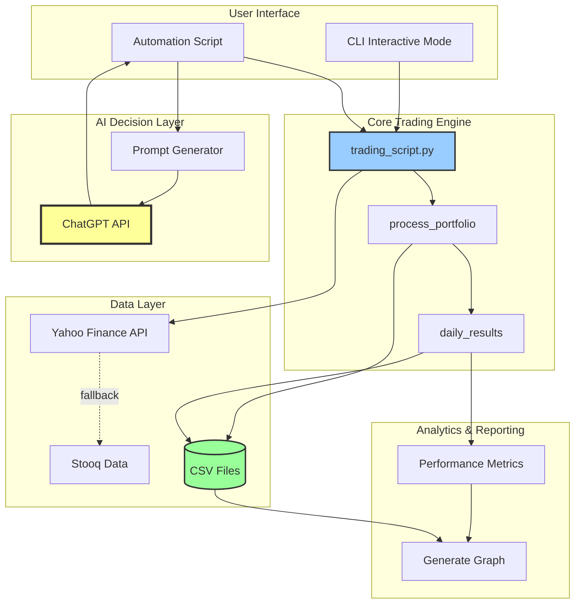
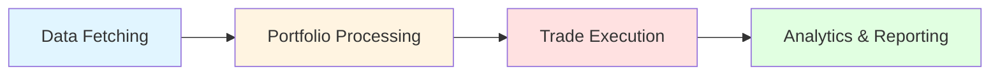
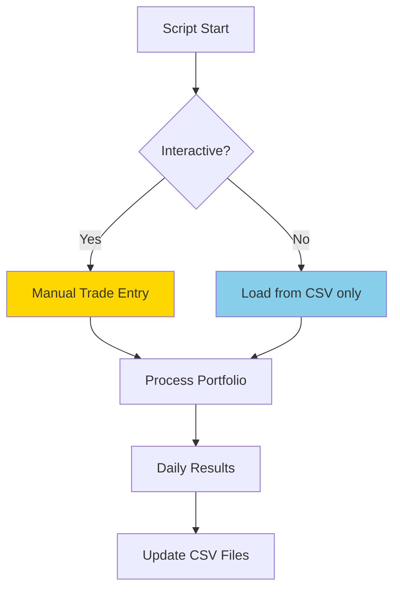
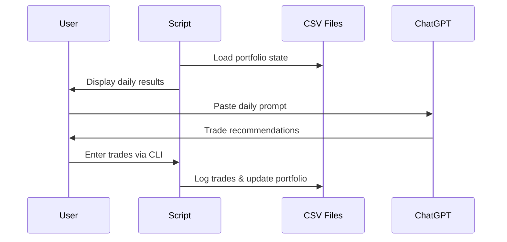
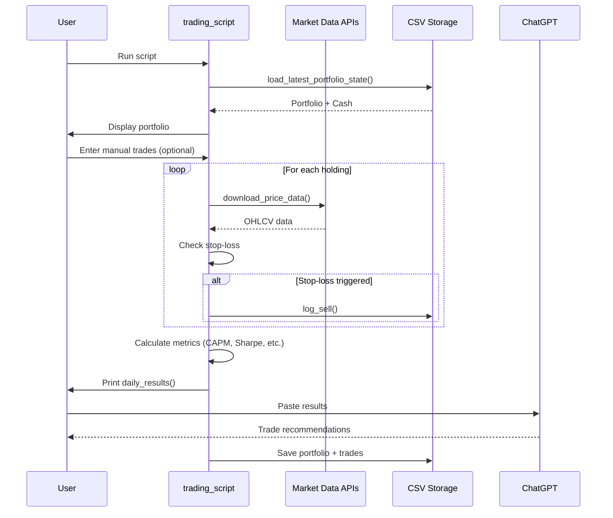
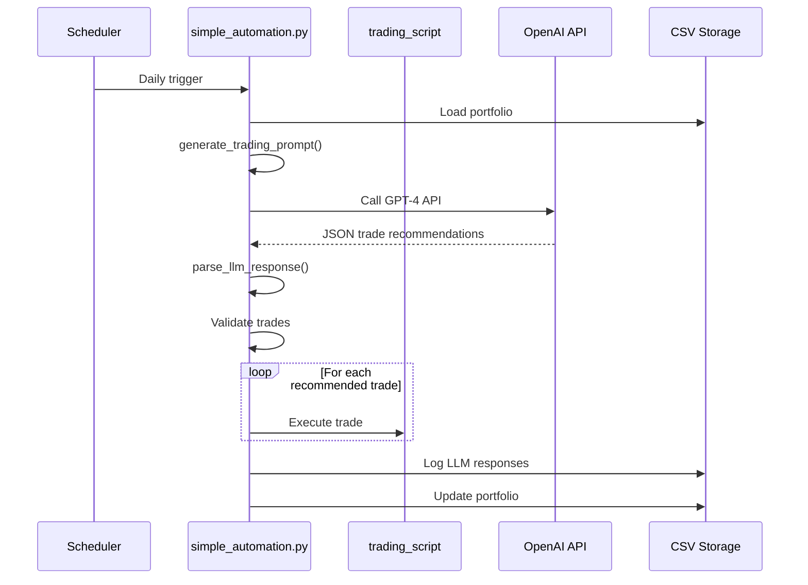
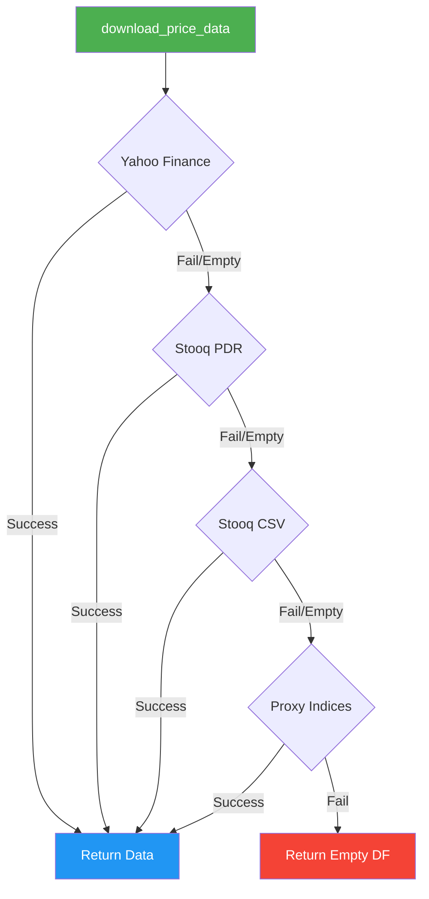
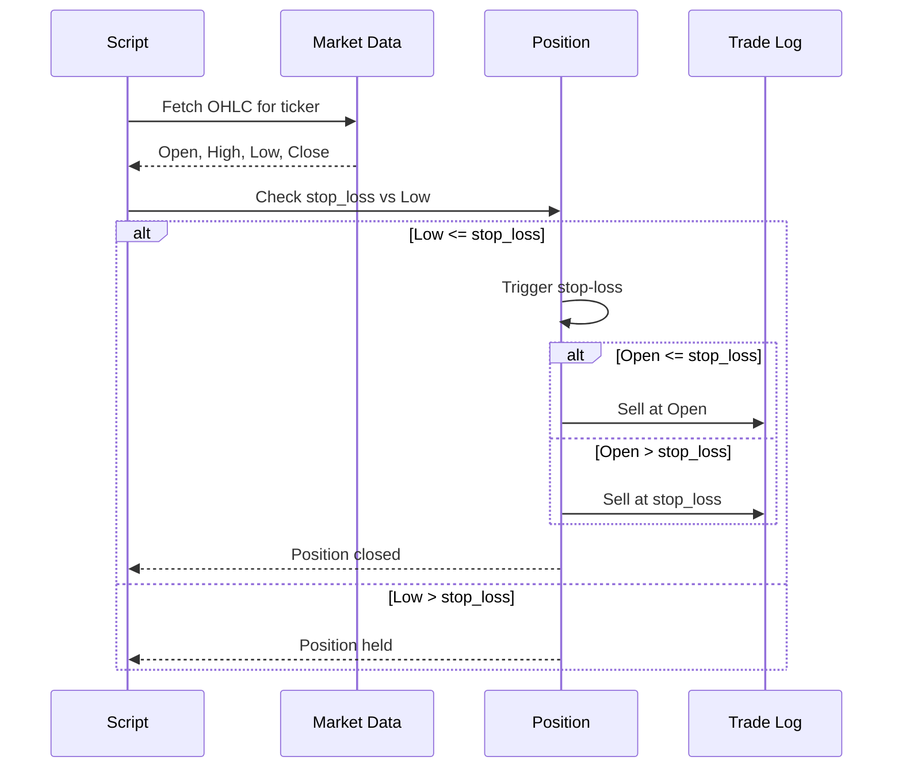
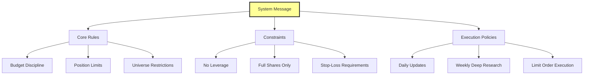
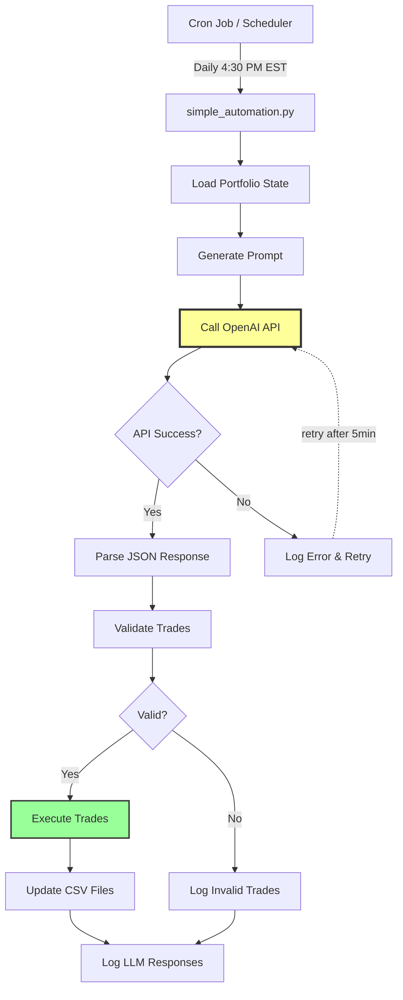

# ChatGPT Micro-Cap Experiment: Comprehensive Technical Analysis

## Executive Summary

ChatGPT-Micro-Cap-Experiment is a groundbreaking live trading experiment that tests whether large language models (LLMs) can generate alpha in micro-cap stock markets using real money. Starting with just $100, this 6-month experiment (June 2025 - December 2025) demonstrates the practical application of AI-driven investment strategies with complete transparency.

**Key Highlights:**
- **Real Money Trading**: Live $100 portfolio managed entirely by ChatGPT-4
- **Micro-Cap Focus**: Targets US stocks with market cap under $300M
- **Daily Automation**: Python-based portfolio management with stop-loss automation
- **Complete Transparency**: Open-source codebase with daily performance tracking
- **Research-Driven**: Weekly deep research sessions for portfolio reevaluation
- **Performance Analytics**: CAPM analysis, Sharpe/Sortino ratios, drawdown metrics

**Technology Stack:**
- Python 3.11+ with pandas, yFinance, matplotlib
- ChatGPT-4/5 for trading decision engine
- Robust multi-source data fetching (Yahoo Finance + Stooq fallback)
- Interactive CLI for manual trade entry and portfolio management
- Comprehensive CSV-based logging and performance tracking

---

## Table of Contents

1. [Project Overview](#project-overview)
2. [Technical Architecture](#technical-architecture)
3. [Project Structure](#project-structure)
4. [Installation & Setup](#installation--setup)
5. [Usage Guide](#usage-guide)
6. [Development Guidelines](#development-guidelines)
7. [Core Components Deep Dive](#core-components-deep-dive)
8. [Prompt Engineering](#prompt-engineering)
9. [Data Pipeline & Market Data Fetching](#data-pipeline--market-data-fetching)
10. [Performance Analytics](#performance-analytics)
11. [Automation Features](#automation-features)
12. [Security & Risk Management](#security--risk-management)
13. [Testing & Backtesting](#testing--backtesting)
14. [Limitations & Future Roadmap](#limitations--future-roadmap)
15. [License & Legal](#license--legal)
16. [Contributing](#contributing)
17. [Conclusion](#conclusion)

---

## Project Overview

### Problem Definition

The financial industry has long sought to answer a critical question: **Can artificial intelligence autonomously identify undervalued assets and generate superior returns (alpha) without human intervention?** While machine learning models have been applied to quantitative trading for decades, the emergence of large language models with reasoning capabilities opens new possibilities.

Traditional AI trading approaches suffer from:
- **Narrow Focus**: Limited to numerical data (price, volume, technical indicators)
- **Context Blindness**: Cannot parse earnings calls, SEC filings, or market sentiment
- **Rigidity**: Require extensive feature engineering and retraining
- **Black Box**: Difficult to explain trading decisions

### Solution Approach

This project tests a novel hypothesis: **Modern LLMs can leverage their natural language processing capabilities to discover alpha in complex, text-heavy financial data that traditional algorithms miss.**

The experiment implements:
1. **Daily Trading Loop**: ChatGPT receives EOD market data and makes buy/sell decisions
2. **Constraint-Based Framework**: Strict rules (cash limits, full shares only, no leverage)
3. **Stop-Loss Automation**: Python script enforces risk management rules
4. **Weekly Deep Research**: LLM conducts comprehensive portfolio reevaluation
5. **Transparent Logging**: All trades, prompts, and performance metrics publicly available

### Core Features

#### 1. **LLM-Powered Decision Engine**
- Uses ChatGPT-4/5 for stock selection and trade timing
- Processes daily price/volume data, portfolio metrics, and risk indicators
- Conducts weekly deep research on potential holdings
- Generates exact trade orders (ticker, shares, price, stop-loss)

#### 2. **Robust Portfolio Management**
- Automated stop-loss execution based on intraday price movements
- Support for Market-on-Open (MOO) and limit orders
- Position sizing with cash availability checks
- Average cost basis tracking for partial position entries/exits

#### 3. **Multi-Source Data Pipeline**
- Primary: Yahoo Finance via yfinance library
- Fallback: Stooq via pandas-datareader
- Direct CSV download from Stooq for reliability
- Proxy indices for hard-to-fetch symbols (e.g., ^GSPC → SPY)

#### 4. **Performance Analytics**
- CAPM metrics (Alpha, Beta, R²) vs S&P 500
- Sharpe and Sortino ratios (period and annualized)
- Maximum drawdown tracking with date identification
- Benchmark comparisons (S&P 500, Russell 2000, XBI biotech)

#### 5. **Visualization & Reporting**
- Matplotlib-based performance charts
- Daily equity curve vs benchmarks
- Annotated charts showing key events (e.g., catalyst failures)
- CSV export for external analysis

### Target Users & Use Cases

#### Primary Users
1. **Quantitative Researchers**: Testing LLM capabilities in financial markets
2. **Retail Investors**: Learning systematic portfolio management techniques
3. **AI/ML Practitioners**: Studying prompt engineering for financial decision-making
4. **Educators**: Teaching portfolio theory, risk management, and Python finance

#### Use Cases
- **Academic Research**: Empirical study of LLM-based trading strategies
- **Strategy Development**: Blueprint for hybrid human-AI portfolio management
- **Educational Tool**: Hands-on learning of trading automation and risk management
- **Personal Finance**: Template for disciplined, rule-based investing
- **Algorithmic Trading**: Foundation for more sophisticated automated systems

---

## Technical Architecture

### High-Level System Architecture



### Technology Stack

#### Core Technologies

| Component | Technology | Version | Purpose |
|-----------|-----------|---------|---------|
| **Language** | Python | 3.11+ | Core scripting and automation |
| **Data Manipulation** | pandas | 2.2.2 | DataFrame operations, CSV handling |
| **Market Data** | yfinance | 0.2.65 | Real-time and historical price data |
| **Numerical Computing** | numpy | 2.3.2 | Statistical calculations, array operations |
| **Visualization** | matplotlib | 3.8.4 | Performance charts, equity curves |
| **AI Engine** | ChatGPT-4/5 | Latest | Trading decision generation |
| **Optional: Automation** | openai | Latest | API integration for automated prompting |
| **Optional: Fallback Data** | pandas-datareader | Latest | Stooq data access |

#### Dependencies & Rationale

**1. pandas (2.2.2)**
- Time series manipulation for price data
- CSV read/write for portfolio state persistence
- DataFrame operations for portfolio calculations
- Date handling with timezone awareness

**2. yfinance (0.2.65)**
- Primary data source for US equity prices
- Supports OHLCV (Open, High, Low, Close, Volume, Adj Close)
- Free API with no rate limits for basic usage
- Handles stock splits and dividend adjustments

**3. numpy (2.3.2)**
- Fast numerical operations for metrics calculations
- CAPM regression (Alpha, Beta)
- Statistical functions (mean, std, correlation)
- Array-based operations for performance

**4. matplotlib (3.8.4)**
- Static chart generation for performance visualization
- Equity curve plotting with annotations
- Benchmark comparison charts
- Publication-quality figure export (PNG, PDF)

**5. openai (optional)**
- API integration for automated trading decisions
- Structured prompt/response handling
- Support for GPT-4 and GPT-3.5-turbo models
- Error handling for API failures

### Design Patterns & Architectural Decisions

#### 1. **Separation of Concerns**


- **Data Layer**: Isolated in `download_price_data()` with fallback logic
- **Business Logic**: Portfolio operations in `process_portfolio()`
- **Presentation**: Reporting in `daily_results()`
- **Storage**: CSV files for state persistence

#### 2. **Fail-Safe Data Fetching Pattern**
```python
# Multi-stage fallback cascade
1. Yahoo Finance (yfinance)
   ↓ (if empty/error)
2. Stooq via pandas-datareader
   ↓ (if empty/error)
3. Stooq direct CSV download
   ↓ (if empty/error)
4. Proxy indices (e.g., ^GSPC → SPY)
   ↓ (if all fail)
5. Return empty DataFrame with proper schema
```

**Rationale**: Market data providers have variable reliability. Yahoo Finance occasionally blocks requests or returns empty data. The cascade ensures maximum uptime.

#### 3. **Stateless Script with CSV Persistence**
- No in-memory state between runs
- Complete portfolio state stored in `Daily Updates.csv`
- Trade history logged to `Trade Log.csv`
- Enables backtest mode via `--asof` flag

**Benefits**:
- Easy to verify and audit (human-readable CSV)
- Simple backup and version control
- Stateless execution prevents memory leaks
- Supports historical replay for backtesting

#### 4. **Interactive vs Automated Modes**


- **Interactive**: CLI prompts for buy/sell orders (manual trading)
- **Automated**: Reads from CSV, executes stop-losses only
- **Hybrid**: Can switch between modes via `interactive=False` parameter

#### 5. **Prompt Engineering Architecture**

The system uses a **structured prompt framework** with:
- **System Message**: Defines AI role and constraints
- **Daily Prompt**: Current portfolio state + market data
- **Deep Research Prompt**: Weekly comprehensive analysis with research mode



### Component Interactions & Data Flow

#### Daily Trading Workflow



#### Automated Trading Workflow (Optional)



---

## Project Structure

### Directory Layout

```
ChatGPT-Micro-Cap-Experiment/
├── trading_script.py                   # Core trading engine (main module)
├── simple_automation.py                # Optional: Automated LLM integration
├── requirements.txt                    # Python dependencies
├── Makefile                           # Build/test automation
├── README.md                          # Project documentation
├── Results.png                        # Latest performance chart
│
├── Scripts and CSV Files/             # Author's personal portfolio data
│   ├── Daily Updates.csv             # Historical daily portfolio snapshots
│   ├── Trade Log.csv                 # Complete trade history
│   ├── ProcessPortfolio.py           # Wrapper for local data dir
│   └── Generate Graph.py             # Performance visualization
│
├── Start Your Own/                    # Template for users to begin
│   ├── README.md                     # Getting started guide
│   ├── Daily Updates.csv             # Empty template
│   ├── Trade Log.csv                 # Empty template
│   ├── ProcessPortfolio.py           # Wrapper script
│   └── Generate Graph.py             # Chart generation
│
├── Experiment Details/                # Methodology & documentation
│   ├── Prompts.md                    # Exact prompts used for ChatGPT
│   ├── Past Prompts.md               # Historical prompt versions
│   ├── Past Prompts (7-31 - 8-30)/  # Archive of older prompts
│   ├── Chats.md                      # Links to ChatGPT conversation logs
│   ├── Q&A.md                        # Frequently asked questions
│   ├── Deep Research Index.md        # Index of weekly research sessions
│   └── Disclaimer.md                 # Legal disclaimer
│
├── Weekly Deep Research (MD)/         # Research summaries in Markdown
│   ├── Starting Research Summary.md
│   ├── Week 1 Summary.md
│   ├── Week 2 Summary.md
│   └── ... (Week 3-16)
│
├── Weekly Deep Research (PDF)/        # Full research reports
│   ├── Starting Research.pdf
│   ├── Week 1.pdf
│   └── ... (Week 2-16)
│
└── Other/                            # Additional documentation
    ├── AUTOMATION_README.md          # Automation setup guide
    ├── CONTRIBUTING.md               # Contribution guidelines
    ├── CODE_OF_CONDUCT.md            # Community standards
    ├── License.txt                   # MIT License
    ├── ignore_list.gitignore         # Git ignore patterns
    └── performance_chart.png         # Historical chart
```

### File Organization Rationale

#### 1. **Modular Script Design**
- **`trading_script.py`**: Self-contained module with all core logic
- **Wrappers** (`ProcessPortfolio.py`): Set data directory without code modification
- **Extensions** (`simple_automation.py`): Optional features don't clutter core

#### 2. **Data Separation**
- **Scripts and CSV Files/**: Author's live experiment data (read-only for users)
- **Start Your Own/**: Clean templates for users to begin their own experiments
- Prevents accidental modification of historical data

#### 3. **Documentation Hierarchy**
```
README.md                      # High-level overview
├── Start Your Own/README.md   # User setup guide
├── Other/AUTOMATION_README.md # Advanced automation
└── Experiment Details/        # Detailed methodology
    ├── Prompts.md            # Exact prompts used
    ├── Q&A.md                # Common questions
    └── Disclaimer.md         # Legal notices
```

#### 4. **Research Artifacts**
- **Weekly Deep Research (MD)**: Concise summaries for GitHub viewing
- **Weekly Deep Research (PDF)**: Full ChatGPT conversation exports
- Dual format ensures accessibility and completeness

### Key Files Detailed Explanation

#### `trading_script.py` (1,380 lines)
**Purpose**: Core trading engine with portfolio management, data fetching, and analytics

**Key Functions**:
```python
# Data fetching with fallback
download_price_data(ticker, **kwargs) -> FetchResult

# Portfolio operations
process_portfolio(portfolio, cash, interactive=True) -> (DataFrame, float)
load_latest_portfolio_state() -> (DataFrame, float)

# Trade logging
log_sell(ticker, shares, price, cost, pnl, portfolio) -> DataFrame
log_manual_buy(buy_price, shares, ticker, stoploss, cash, portfolio) -> (float, DataFrame)
log_manual_sell(sell_price, shares, ticker, cash, portfolio) -> (float, DataFrame)

# Analytics & reporting
daily_results(portfolio, cash) -> None  # Prints comprehensive metrics
```

**Command-Line Interface**:
```bash
python trading_script.py \
    --data-dir "Start Your Own" \
    --asof 2025-10-01 \
    --log-level DEBUG \
    --starting-equity 10000
```

#### `simple_automation.py` (266 lines)
**Purpose**: Automated LLM integration for hands-free trading

**Key Functions**:
```python
generate_trading_prompt(portfolio_df, cash, total_equity) -> str
call_openai_api(prompt, api_key, model="gpt-4") -> str
parse_llm_response(response) -> Dict
execute_automated_trades(trades, portfolio_df, cash) -> (DataFrame, float)
```

**Usage**:
```bash
python simple_automation.py \
    --api-key YOUR_OPENAI_KEY \
    --model gpt-4 \
    --dry-run
```

#### `Generate Graph.py` (210 lines)
**Purpose**: Performance visualization comparing ChatGPT vs S&P 500

**Key Features**:
- Loads portfolio equity history from CSV
- Downloads S&P 500 benchmark data
- Calculates largest gain and maximum drawdown
- Generates annotated matplotlib chart
- Auto-saves to `Results.png`

**Metrics Computed**:
```python
find_largest_gain(df) -> (start_date, end_date, gain_pct)
compute_drawdown(df) -> (dd_date, dd_value, dd_pct)
```

#### CSV File Schemas

**Daily Updates.csv**:
```csv
Date,Ticker,Shares,Buy Price,Cost Basis,Stop Loss,Current Price,Total Value,PnL,Action,Cash Balance,Total Equity
2025-06-28,ATYR,10,5.09,50.90,4.20,5.35,53.50,2.60,HOLD,,
2025-06-28,TOTAL,,,,,,,2.60,,49.10,100.00
```

**Trade Log.csv**:
```csv
Date,Ticker,Shares Bought,Buy Price,Cost Basis,PnL,Reason,Shares Sold,Sell Price
2025-06-28,ATYR,10,5.09,50.90,0.0,MANUAL BUY LIMIT - Filled,,
2025-09-13,ATYR,,,,−40.72,AUTOMATED SELL - STOPLOSS TRIGGERED,10,4.07
```

---

## Installation & Setup

### Prerequisites

#### System Requirements
- **Operating System**: macOS, Linux, or Windows (with Python support)
- **Python**: 3.11 or higher (3.12+ recommended)
- **Storage**: ~50MB for dependencies + ~10MB for CSV data files
- **Internet**: Required for real-time market data fetching

#### Required Knowledge
- **Basic Python**: Understanding of variables, functions, command line
- **Finance Basics**: Familiarity with stocks, portfolios, stop-losses
- **CSV/Excel**: Ability to view and edit CSV files (optional)

#### Optional Tools
- **Virtual Environment**: `venv` or `conda` (recommended)
- **IDE/Editor**: VS Code, PyCharm, or any Python-compatible editor
- **Git**: For cloning the repository and version control

### Step-by-Step Installation Guide

#### 1. Clone the Repository

```bash
# Clone the repository
git clone https://github.com/LuckyOne7777/ChatGPT-Micro-Cap-Experiment.git

# Navigate to project directory
cd ChatGPT-Micro-Cap-Experiment
```

#### 2. Set Up Python Virtual Environment (Recommended)

```bash
# Create virtual environment
python -m venv venv

# Activate virtual environment
# On macOS/Linux:
source venv/bin/activate

# On Windows:
venv\Scripts\activate
```

**Why use virtual environments?**
- Isolates project dependencies from system Python
- Prevents version conflicts with other projects
- Easy to reproduce exact environment on different machines

#### 3. Install Dependencies

```bash
# Install required packages
pip install -r requirements.txt

# Verify installation
python -c "import pandas, yfinance, matplotlib, numpy; print('All dependencies installed successfully!')"
```

**Expected output**:
```
All dependencies installed successfully!
```

#### 4. Optional: Install Automation Dependencies

```bash
# For automated LLM integration
pip install openai

# For Stooq fallback (optional but recommended)
pip install pandas-datareader
```

#### 5. Verify Installation

```bash
# Test the core script
python trading_script.py --data-dir "Start Your Own" --starting-equity 1000

# Expected: Script will prompt for portfolio setup
```

### Configuration

#### 1. Environment Variables (For Automation)

Create a `.env` file for API keys (never commit this to Git):

```bash
# .env file
OPENAI_API_KEY=sk-...your-key-here...

# Optional: For backtesting
ASOF_DATE=2025-10-01
```

**Load environment variables**:
```bash
# On macOS/Linux
export $(cat .env | xargs)

# On Windows
# Use a .env loader or set manually
set OPENAI_API_KEY=sk-...
```

#### 2. Data Directory Setup

The script uses a **data directory** pattern to separate different portfolios:

```bash
# Option 1: Use the template
cd "Start Your Own"
python ProcessPortfolio.py

# Option 2: Specify data directory
python trading_script.py --data-dir "Start Your Own"

# Option 3: Create custom data directory
mkdir my_portfolio
cp "Start Your Own/"*.csv my_portfolio/
python trading_script.py --data-dir my_portfolio
```

#### 3. Benchmark Configuration (Optional)

Create a `tickers.json` file to customize benchmark comparisons:

```json
{
  "benchmarks": ["SPY", "IWO", "XBI", "IWM"]
}
```

**Default benchmarks** (if `tickers.json` is missing):
- **IWO**: iShares Russell 2000 Growth ETF (small-cap growth)
- **XBI**: SPDR S&P Biotech ETF (biotech sector)
- **SPY**: SPDR S&P 500 ETF (large-cap US stocks)
- **IWM**: iShares Russell 2000 ETF (small-cap US stocks)

### Common Installation Issues & Solutions

#### Issue 1: `yfinance` Timeout Errors

**Symptoms**:
```
requests.exceptions.ReadTimeout: HTTPSConnectionPool...
```

**Solution**:
```bash
# Install pandas-datareader for Stooq fallback
pip install pandas-datareader

# The script will automatically use fallback sources
```

#### Issue 2: Python Version Mismatch

**Symptoms**:
```
SyntaxError: invalid syntax (pattern matching requires Python 3.10+)
```

**Solution**:
```bash
# Check Python version
python --version  # Should be 3.11+

# Use pyenv or conda to install Python 3.11+
pyenv install 3.11.5
pyenv local 3.11.5
```

#### Issue 3: CSV File Encoding Issues

**Symptoms**:
```
UnicodeDecodeError: 'utf-8' codec can't decode byte...
```

**Solution**:
The script handles CSV encoding automatically, but if issues persist:
```python
# Manually fix CSV encoding
import pandas as pd
df = pd.read_csv("Daily Updates.csv", encoding='utf-8-sig')
df.to_csv("Daily Updates.csv", index=False, encoding='utf-8')
```

#### Issue 4: Matplotlib Display Issues (Headless Environments)

**Symptoms**:
```
UserWarning: Matplotlib is currently using agg, which is a non-GUI backend
```

**Solution**:
```python
# For headless servers (no display)
export MPLBACKEND=Agg

# Script will save charts without displaying them
```

### First Run: Setting Up Your Portfolio

#### Interactive Setup

```bash
# Run the script
python trading_script.py --data-dir "Start Your Own"

# Expected prompts:
What would you like your starting cash amount to be? 1000

You have 1000.0 in cash.
Would you like to log a manual trade? Enter 'b' for buy, 's' for sell, "u" to update a stoploss, or press Enter to continue: b

Enter ticker symbol: AAPL
Order type? 'm' = market-on-open, 'l' = limit: l
Enter number of shares: 5
Enter buy LIMIT price: 180.50
Enter stop loss (or 0 to skip): 170.00

# Script executes the limit order if price conditions met
# Press Enter to complete the day
```

#### Non-Interactive Setup (Scripted)

```python
# custom_portfolio.py
from trading_script import main, set_data_dir
from pathlib import Path

set_data_dir(Path("my_portfolio"))
main(starting_equity_override=5000)
```

---

## Usage Guide

### Basic Usage Examples

#### Example 1: Daily Portfolio Update

```bash
# 1. Run after market close (4:00 PM EST)
python trading_script.py --data-dir "Start Your Own"

# 2. Script displays portfolio and prompts for trades
# 3. Press Enter to skip manual trades
# 4. Script prints daily results with metrics

# 5. Copy the output and paste into ChatGPT
# 6. ChatGPT provides trade recommendations
# 7. Run script again to enter recommended trades
```

**Sample Output**:
```
================================================================
Daily Results — 2025-10-19
================================================================

[ Price & Volume ]
Ticker            Close     % Chg          Volume
-------------------------------------------------
ATYR               5.35    +8.08%       6,046,975
IINN               1.17    -6.40%      14,793,576

[ Risk & Return ]
Max Drawdown:                             -7.11%   on 2025-07-11
Sharpe Ratio (annualized):                3.3487
Sortino Ratio (annualized):               6.2806

[ CAPM vs Benchmarks ]
Beta (daily) vs ^GSPC:                    1.9434
Alpha (annualized) vs ^GSPC:             208.89%

[ Snapshot ]
Latest ChatGPT Equity:           $        131.02
$100.0 in S&P 500 (same window): $        104.22
Cash Balance:                    $         15.08

[ Holdings ]
  ticker  shares  buy_price  cost_basis  stop_loss
0   ATYR     8.0       5.09       40.72        4.2
1   IINN    10.0       1.25       12.50        1.0
```

#### Example 2: Manual Trade Entry

```bash
# Market-on-Open (MOO) Order
python trading_script.py --data-dir "Start Your Own"

# At prompt:
Would you like to log a manual trade? b
Enter ticker symbol: NVDA
Order type? 'm' = market-on-open, 'l' = limit: m
Enter number of shares: 3
Enter stop loss (or 0 to skip): 500.00

# Script fetches opening price and executes immediately
Manual BUY MOO for NVDA filled at $523.45 (yahoo).
```

```bash
# Limit Order
Would you like to log a manual trade? b
Enter ticker symbol: TSLA
Order type? 'm' = market-on-open, 'l' = limit: l
Enter number of shares: 2
Enter buy LIMIT price: 240.00
Enter stop loss (or 0 to skip): 220.00

# Script checks if limit price was reached during the day
Buy limit $240.00 for TSLA not reached today (range 242.50-255.30). Order not filled.
```

#### Example 3: Updating Stop-Loss

```bash
# Update stop-loss without buying/selling
Would you like to log a manual trade? u
Enter ticker symbol: ATYR
What is your new stoploss? 5.50

Stoploss for ATYR is now updated to 5.5.
```

#### Example 4: Backtesting with Historical Data

```bash
# Test strategy on past dates
python trading_script.py \
    --data-dir "backtest_2025" \
    --asof 2025-09-01 \
    --starting-equity 10000

# Manually step through dates
for date in 2025-09-{02..30}; do
    python trading_script.py --data-dir "backtest_2025" --asof $date
    # Enter trades based on historical ChatGPT decisions
done
```

### Advanced Usage

#### Code Example 1: Programmatic Portfolio Management

```python
from trading_script import (
    load_latest_portfolio_state,
    process_portfolio,
    daily_results,
    set_data_dir
)
from pathlib import Path

# Configure data directory
set_data_dir(Path("automated_portfolio"))

# Load current state
portfolio, cash = load_latest_portfolio_state(starting_equity_override=5000)

# Process portfolio (non-interactive mode)
portfolio, cash = process_portfolio(portfolio, cash, interactive=False)

# Generate daily report
daily_results(portfolio, cash)
```

#### Code Example 2: Custom Benchmark Comparison

```python
import pandas as pd
from trading_script import download_price_data, last_trading_date

# Get portfolio performance
portfolio_df = pd.read_csv("Start Your Own/Daily Updates.csv")
portfolio_totals = portfolio_df[portfolio_df["Ticker"] == "TOTAL"]

# Get custom benchmark (e.g., Bitcoin proxy)
end_date = last_trading_date()
start_date = end_date - pd.Timedelta(days=180)
btc_data = download_price_data("BTC-USD", start=start_date, end=end_date)

# Compare returns
portfolio_return = (portfolio_totals["Total Equity"].iloc[-1] /
                   portfolio_totals["Total Equity"].iloc[0] - 1) * 100
btc_return = (btc_data.df["Close"].iloc[-1] /
              btc_data.df["Close"].iloc[0] - 1) * 100

print(f"Portfolio: {portfolio_return:.2f}% | Bitcoin: {btc_return:.2f}%")
```

#### Code Example 3: Automated Trading with OpenAI API

```python
import openai
from simple_automation import (
    generate_trading_prompt,
    call_openai_api,
    parse_llm_response
)

# Set API key
openai.api_key = "sk-..."

# Load portfolio
portfolio_df, cash = load_latest_portfolio_state()
total_equity = cash + portfolio_df["cost_basis"].sum()

# Generate prompt
prompt = generate_trading_prompt(portfolio_df, cash, total_equity)

# Get LLM recommendations
response = call_openai_api(prompt, openai.api_key, model="gpt-4")
parsed = parse_llm_response(response)

# Display recommendations
print("LLM Analysis:", parsed.get("analysis"))
print("Recommended Trades:", parsed.get("trades"))
```

### Command-Line Reference

#### `trading_script.py` Options

| Argument | Short | Default | Description |
|----------|-------|---------|-------------|
| `--data-dir` | - | None | **Required**: Data directory path |
| `--asof` | - | None | Treat YYYY-MM-DD as "today" (for backtesting) |
| `--log-level` | - | None | Logging verbosity (DEBUG, INFO, WARNING, ERROR, CRITICAL) |
| `--starting-equity` | `-s` | None | Starting cash (if CSV is empty) |

**Examples**:
```bash
# Basic usage
python trading_script.py --data-dir "Start Your Own"

# Backtesting
python trading_script.py --data-dir "backtest" --asof 2025-09-15 -s 10000

# Debug mode
python trading_script.py --data-dir "Start Your Own" --log-level DEBUG
```

#### `Generate Graph.py` Options

| Argument | Type | Default | Description |
|----------|------|---------|-------------|
| `--start-date` | str | Earliest in CSV | Start date (YYYY-MM-DD) |
| `--end-date` | str | Latest in CSV | End date (YYYY-MM-DD) |
| `--start-equity` | float | 100.0 | Baseline for indexing ($100 invested) |
| `--output` | str | Results.png | Output path (.png/.jpg/.pdf) |

**Examples**:
```bash
# Generate default chart
python "Scripts and CSV Files/Generate Graph.py"

# Custom date range
python "Scripts and CSV Files/Generate Graph.py" \
    --start-date 2025-07-01 \
    --end-date 2025-09-30 \
    --output performance_q3.png

# High-resolution PDF
python "Scripts and CSV Files/Generate Graph.py" \
    --output results.pdf
```

#### `simple_automation.py` Options

| Argument | Type | Default | Description |
|----------|------|---------|-------------|
| `--api-key` | str | $OPENAI_API_KEY | OpenAI API key |
| `--model` | str | gpt-4 | Model to use (gpt-4, gpt-3.5-turbo) |
| `--data-dir` | str | Start Your Own | Data directory |
| `--dry-run` | flag | False | Show trades without executing |

**Examples**:
```bash
# Test with dry run
python simple_automation.py --api-key sk-... --dry-run

# Production run with GPT-4
export OPENAI_API_KEY=sk-...
python simple_automation.py --model gpt-4

# Use custom data directory
python simple_automation.py --data-dir "my_portfolio"
```

---

## Development Guidelines

### Development Environment Setup

#### Recommended Tools

1. **IDE/Editor**: VS Code with Python extension
2. **Version Control**: Git with `.gitignore` for CSV files
3. **Testing**: pytest for unit tests (not yet implemented)
4. **Linting**: pylint or flake8 for code quality
5. **Type Checking**: mypy for type hints validation

#### Code Style & Conventions

**1. Type Hints** (Following PEP 484)
```python
from typing import Optional, Union
from decimal import Decimal
import pandas as pd

def parse_starting_equity(s: Union[str, float, Decimal]) -> Optional[Decimal]:
    """Return Decimal if s represents a positive number, otherwise None."""
    # Implementation...
```

**2. Docstrings** (Google Style)
```python
def download_price_data(ticker: str, **kwargs: Any) -> FetchResult:
    """
    Robust OHLCV fetch with multi-stage fallbacks.

    Order:
      1) Yahoo Finance via yfinance
      2) Stooq via pandas-datareader
      3) Stooq direct CSV
      4) Index proxies (e.g., ^GSPC->SPY, ^RUT->IWM) via Yahoo

    Args:
        ticker: Stock symbol (e.g., "AAPL", "^GSPC")
        **kwargs: Additional arguments (period, start, end, auto_adjust)

    Returns:
        FetchResult with DataFrame and source string
    """
```

**3. Naming Conventions**
- **Functions/Variables**: `snake_case` (e.g., `load_portfolio_state`)
- **Classes**: `PascalCase` (e.g., `FetchResult`)
- **Constants**: `UPPER_SNAKE_CASE` (e.g., `PORTFOLIO_CSV_PATH`)
- **Private helpers**: `_leading_underscore` (e.g., `_normalize_ohlcv`)

**4. Import Organization**
```python
# Standard library imports
from __future__ import annotations
from dataclasses import dataclass
from datetime import datetime
from pathlib import Path
from typing import Any, Optional

# Third-party imports
import numpy as np
import pandas as pd
import yfinance as yf

# Local/relative imports
# (none in this project)
```

### Testing Strategy

#### Current State
- **Manual Testing**: Author manually verifies trades against Vanguard brokerage
- **Backtesting**: `--asof` flag allows historical replay
- **No Automated Tests**: Unit tests not yet implemented

#### Recommended Testing Approach

**1. Unit Tests for Data Fetching**
```python
# tests/test_data_fetching.py
import pytest
from trading_script import download_price_data
import pandas as pd

def test_yahoo_finance_fallback():
    """Test that fallback works when Yahoo fails."""
    result = download_price_data("AAPL", period="1d")
    assert not result.df.empty
    assert "Close" in result.df.columns

def test_weekend_handling():
    """Test that weekends correctly map to Friday."""
    from trading_script import set_asof, last_trading_date
    set_asof("2025-10-12")  # Sunday
    friday = last_trading_date()
    assert friday.weekday() == 4  # Friday
```

**2. Integration Tests for Portfolio Operations**
```python
# tests/test_portfolio.py
def test_stop_loss_execution():
    """Test that stop-losses trigger correctly."""
    portfolio = [{"ticker": "TEST", "shares": 10, "buy_price": 50.0, "stop_loss": 45.0}]
    # Mock price data showing low of 44.0
    # Verify position sold at open or stop price
```

**3. Backtesting Validation**
```python
# tests/test_backtest.py
def test_historical_replay():
    """Verify backtesting produces consistent results."""
    from trading_script import set_asof, main
    set_asof("2025-09-01")
    # Run main() and capture results
    # Compare with known historical data
```

### Code Quality Tools

#### Linting with flake8

```bash
# Install
pip install flake8

# Run linter
flake8 trading_script.py --max-line-length=120

# Common issues to fix
# E501: Line too long
# W291: Trailing whitespace
# F401: Unused import
```

#### Type Checking with mypy

```bash
# Install
pip install mypy

# Run type checker
mypy trading_script.py --ignore-missing-imports

# Expected warnings
# Ignore yfinance and pandas-datareader (no type stubs)
```

### Contributing Workflow

#### 1. Fork & Clone

```bash
# Fork on GitHub UI
git clone https://github.com/YOUR_USERNAME/ChatGPT-Micro-Cap-Experiment.git
cd ChatGPT-Micro-Cap-Experiment
```

#### 2. Create Feature Branch

```bash
git checkout -b feature/improved-data-fetching
```

#### 3. Make Changes & Test

```bash
# Edit code
vim trading_script.py

# Test locally
python trading_script.py --data-dir "test_portfolio" -s 1000
```

#### 4. Commit & Push

```bash
git add trading_script.py
git commit -m "feat: add retry logic to Yahoo Finance fetcher"
git push origin feature/improved-data-fetching
```

#### 5. Open Pull Request

- Navigate to GitHub repository
- Click "New Pull Request"
- Describe changes and testing performed

### Git Workflow Best Practices

#### Branch Naming

- `feature/` - New features (e.g., `feature/automated-prompting`)
- `fix/` - Bug fixes (e.g., `fix/stop-loss-calculation`)
- `docs/` - Documentation updates (e.g., `docs/add-architecture-diagram`)
- `refactor/` - Code refactoring (e.g., `refactor/extract-data-layer`)

#### Commit Messages

Follow [Conventional Commits](https://www.conventionalcommits.org/):

```bash
# Format: <type>(<scope>): <description>

git commit -m "feat(data): add Stooq CSV fallback for reliability"
git commit -m "fix(portfolio): correct average cost basis calculation"
git commit -m "docs(readme): add installation troubleshooting section"
git commit -m "refactor(logging): use logging module instead of print"
```

#### .gitignore Patterns

```gitignore
# Python
__pycache__/
*.py[cod]
*$py.class
venv/
.env

# Data files (user-specific)
my_portfolio/
backtest_*/
*.csv  # Exclude personal portfolio data

# IDE
.vscode/
.idea/
*.swp

# OS
.DS_Store
Thumbs.db
```

---

## Core Components Deep Dive

### 1. Data Fetching Layer

#### Multi-Source Fallback Architecture

The data fetching system implements a **cascade pattern** with four fallback levels:



#### Implementation Details

**Level 1: Yahoo Finance (yfinance)**

```python
def _yahoo_download(ticker: str, **kwargs: Any) -> pd.DataFrame:
    """Call yfinance.download with silence and error handling."""
    import io, logging
    from contextlib import redirect_stderr, redirect_stdout

    kwargs.setdefault("progress", False)
    kwargs.setdefault("threads", False)

    logging.getLogger("yfinance").setLevel(logging.CRITICAL)
    buf = io.StringIO()
    with warnings.catch_warnings():
        warnings.simplefilter("ignore")
        try:
            with redirect_stdout(buf), redirect_stderr(buf):
                df = yf.download(ticker, **kwargs)
        except Exception:
            return pd.DataFrame()
    return df if isinstance(df, pd.DataFrame) else pd.DataFrame()
```

**Why silence output?**
- yfinance prints progress bars and warnings to stdout
- Clutters CLI interface when fetching multiple tickers
- Errors are caught and logged separately

**Level 2: Stooq via pandas-datareader**

```python
def _stooq_download(
    ticker: str,
    start: datetime | pd.Timestamp,
    end: datetime | pd.Timestamp,
) -> pd.DataFrame:
    """Fetch OHLCV from Stooq via pandas-datareader; returns empty DF on failure."""
    if not _HAS_PDR or ticker in STOOQ_BLOCKLIST:
        return pd.DataFrame()

    t = STOOQ_MAP.get(ticker, ticker)
    if not t.startswith("^"):
        t = t.lower()

    try:
        df = pdr.DataReader(t, "stooq", start=start, end=end)
        df.sort_index(inplace=True)
        return df
    except Exception:
        return pd.DataFrame()
```

**Symbol Remapping**:
- `^GSPC` → `^SPX` (S&P 500 index)
- Equities/ETFs → lowercase with `.us` suffix (e.g., `aapl` → `aapl.us`)

**Level 3: Stooq Direct CSV Download**

```python
def _stooq_csv_download(ticker: str, start: pd.Timestamp, end: pd.Timestamp) -> pd.DataFrame:
    """Fetch OHLCV from Stooq CSV endpoint (daily)."""
    import requests, io

    # Convert ticker to Stooq format
    sym = ticker.lower()
    if not ticker.startswith("^") and not sym.endswith(".us"):
        sym = f"{sym}.us"

    url = f"https://stooq.com/q/d/l/?s={sym}&i=d"
    try:
        r = requests.get(url, timeout=10)
        if r.status_code != 200 or not r.text.strip():
            return pd.DataFrame()

        df = pd.read_csv(io.StringIO(r.text))
        df["Date"] = pd.to_datetime(df["Date"])
        df.set_index("Date", inplace=True)

        # Filter to [start, end)
        df = df.loc[(df.index >= start) & (df.index < end)]

        # Normalize schema
        if "Adj Close" not in df.columns:
            df["Adj Close"] = df["Close"]
        return df[["Open", "High", "Low", "Close", "Adj Close", "Volume"]]
    except Exception:
        return pd.DataFrame()
```

**Why direct CSV?**
- pandas-datareader can fail due to API changes
- Direct CSV endpoint is more stable
- No external dependencies required

**Level 4: Proxy Indices**

```python
# If all sources fail for indices, use liquid ETF proxies
proxy_map = {"^GSPC": "SPY", "^RUT": "IWM"}
proxy = proxy_map.get(ticker)
if proxy:
    df_proxy = _yahoo_download(proxy, start=s, end=e, **kwargs)
    if not df_proxy.empty:
        return FetchResult(df_proxy, f"yahoo:{proxy}-proxy")
```

**Known limitations**:
- Proxies may have tracking error vs underlying index
- Not available for all tickers (only major indices)

#### Data Normalization

```python
def _normalize_ohlcv(df: pd.DataFrame) -> pd.DataFrame:
    """Ensure consistent column structure across all sources."""
    # Flatten MultiIndex columns (from yfinance)
    if isinstance(df.columns, pd.MultiIndex):
        if len(set(df.columns.get_level_values(1))) == 1:
            df.columns = df.columns.get_level_values(0)
        else:
            df.columns = ["_".join(map(str, t)).strip("_") for t in df.columns]

    # Ensure all expected columns exist
    for c in ["Open", "High", "Low", "Close", "Volume"]:
        if c not in df.columns:
            df[c] = np.nan
    if "Adj Close" not in df.columns:
        df["Adj Close"] = df["Close"]

    return df[["Open", "High", "Low", "Close", "Adj Close", "Volume"]]
```

### 2. Portfolio Management Engine

#### Stop-Loss Execution Logic



**Implementation**:

```python
# In process_portfolio()
for _, stock in portfolio_df.iterrows():
    ticker = str(stock["ticker"]).upper()
    shares = int(stock["shares"])
    cost = float(stock["buy_price"])
    stop = float(stock["stop_loss"]) if not pd.isna(stock["stop_loss"]) else 0.0

    # Fetch OHLC data
    fetch = download_price_data(ticker, start=s, end=e, auto_adjust=False)
    data = fetch.df

    if data.empty:
        continue

    o = float(data["Open"].iloc[-1]) if "Open" in data else np.nan
    h = float(data["High"].iloc[-1])
    l = float(data["Low"].iloc[-1])
    c = float(data["Close"].iloc[-1])

    # Stop-loss logic
    if stop and l <= stop:
        # Determine execution price
        exec_price = round(o if o <= stop else stop, 2)
        value = round(exec_price * shares, 2)
        pnl = round((exec_price - cost) * shares, 2)

        # Execute sell
        cash += value
        portfolio_df = log_sell(ticker, shares, exec_price, cost, pnl, portfolio_df)
    else:
        # Hold position
        price = round(c, 2)
        value = round(price * shares, 2)
        pnl = round((price - cost) * shares, 2)
        total_value += value
        total_pnl += pnl
```

**Key Design Decisions**:

1. **Intraday Stop-Loss**: Uses `Low` of the day (most conservative)
2. **Execution Price**:
   - If `Open <= stop_loss`: Sell at `Open` (gap down scenario)
   - If `Open > stop_loss` but `Low <= stop_loss`: Sell at `stop_loss` (intraday trigger)
3. **No Slippage Modeling**: Assumes perfect execution (optimistic)

#### Manual Trade Entry (Limit Orders)

```python
def log_manual_buy(
    buy_price: float,
    shares: float,
    ticker: str,
    stoploss: float,
    cash: float,
    chatgpt_portfolio: pd.DataFrame,
    interactive: bool = True,
) -> tuple[float, pd.DataFrame]:
    """Execute limit buy if price conditions met."""

    # Fetch OHLC data
    fetch = download_price_data(ticker, start=s, end=e, auto_adjust=False)
    data = fetch.df

    o = float(data.get("Open", [np.nan])[-1])
    h = float(data["High"].iloc[-1])
    l = float(data["Low"].iloc[-1])

    # Determine if limit order filled
    if o <= buy_price:
        exec_price = o  # Immediate fill at open
    elif l <= buy_price:
        exec_price = buy_price  # Filled intraday at limit
    else:
        print(f"Buy limit ${buy_price:.2f} for {ticker} not reached today (range {l:.2f}-{h:.2f}). Order not filled.")
        return cash, chatgpt_portfolio

    # Validate cash availability
    cost_amt = exec_price * shares
    if cost_amt > cash:
        print(f"Manual buy for {ticker} failed: cost {cost_amt:.2f} exceeds cash balance {cash:.2f}.")
        return cash, chatgpt_portfolio

    # Execute trade
    # ... (log to Trade Log CSV, update portfolio)
    cash -= cost_amt
    return cash, chatgpt_portfolio
```

**Limit Order Fill Logic**:
| Condition | Execution Price | Rationale |
|-----------|-----------------|-----------|
| `Open <= limit` | Open | Fill immediately at market open |
| `Low <= limit < Open` | Limit price | Reached limit intraday |
| `Low > limit` | No fill | Price never reached limit |

### 3. Performance Analytics

#### CAPM Metrics (Alpha, Beta, R²)

```python
# In daily_results()

# Load S&P 500 benchmark data
spx_fetch = download_price_data("^GSPC", start=start_date, end=end_date)
spx = spx_fetch.df

if not spx.empty and len(spx) >= 2:
    spx = spx.reset_index().set_index("Date").sort_index()
    mkt_ret = spx["Close"].astype(float).pct_change().dropna()

    # Align portfolio & market returns
    common_idx = r.index.intersection(list(mkt_ret.index))
    if len(common_idx) >= 2:
        rp = (r.reindex(common_idx).astype(float) - rf_daily)   # portfolio excess return
        rm = (mkt_ret.reindex(common_idx).astype(float) - rf_daily)  # market excess return

        x = np.asarray(rm.values, dtype=float).ravel()
        y = np.asarray(rp.values, dtype=float).ravel()

        # Linear regression: y = beta * x + alpha
        beta, alpha_daily = np.polyfit(x, y, 1)
        alpha_annual = (1 + float(alpha_daily)) ** 252 - 1

        # R-squared
        corr = np.corrcoef(x, y)[0, 1]
        r2 = float(corr ** 2)
```

**Interpretation**:

- **Beta > 1**: Portfolio is more volatile than S&P 500 (higher risk)
- **Alpha > 0**: Portfolio outperforms after risk adjustment
- **R² < 0.20**: Low correlation (micro-caps behave differently from large-caps)

**Example Output**:
```
[ CAPM vs Benchmarks ]
Beta (daily) vs ^GSPC:                    1.9434
Alpha (annualized) vs ^GSPC:             208.89%
R² (fit quality):                          0.158     Obs: 38
  Note: Short sample and/or low R² — alpha/beta may be unstable.
```

#### Sharpe and Sortino Ratios

```python
# Risk-free rate configuration
rf_annual = 0.045  # 4.5% annual risk-free rate
rf_daily = (1 + rf_annual) ** (1 / 252) - 1
rf_period = (1 + rf_daily) ** n_days - 1

# Daily returns
r = equity_series.pct_change().dropna()
mean_daily = float(r.mean())
std_daily = float(r.std(ddof=1))

# Sharpe Ratio
sharpe_period = (period_return - rf_period) / (std_daily * np.sqrt(n_days))
sharpe_annual = ((mean_daily - rf_daily) / std_daily) * np.sqrt(252)

# Sortino Ratio (downside deviation only)
downside = (r - rf_daily).clip(upper=0)
downside_std = float((downside.pow(2).mean()) ** 0.5)
sortino_annual = ((mean_daily - rf_daily) / downside_std) * np.sqrt(252)
```

**Comparison**:
| Metric | Calculation | Interpretation |
|--------|-------------|----------------|
| **Sharpe Ratio** | (Return - RiskFree) / Total Volatility | Penalizes all volatility (up and down) |
| **Sortino Ratio** | (Return - RiskFree) / Downside Volatility | Only penalizes downside volatility |

**Why Sortino is higher**:
- Micro-cap stocks have asymmetric returns (large upside, limited downside with stop-losses)
- Sortino focuses on harmful volatility (losses) which is controlled by stop-losses

#### Maximum Drawdown

```python
def compute_drawdown(df: pd.DataFrame) -> tuple[pd.Timestamp, float, float]:
    """Compute running max and drawdown (%)."""
    df = df.sort_values("Date").copy()
    df["Running Max"] = df["Total Equity"].cummax()
    df["Drawdown %"] = (df["Total Equity"] / df["Running Max"] - 1.0) * 100.0

    row = df.loc[df["Drawdown %"].idxmin()]
    return pd.Timestamp(row["Date"]), float(row["Total Equity"]), float(row["Drawdown %"])
```

**Example**:
```
Max Drawdown:                             -7.11%   on 2025-07-11
```

- **-7.11%**: Portfolio dropped 7.11% from its peak
- **2025-07-11**: Date when maximum drawdown occurred
- **Interpretation**: Relatively small drawdown indicates good risk management

---

## Prompt Engineering

### System Prompt Architecture

The experiment uses a **multi-layered prompt framework** to constrain ChatGPT's behavior:



### Prompt Hierarchy

#### Level 1: System Message (Role Definition)

**Purpose**: Define ChatGPT's role and objective

```markdown
You are a professional-grade portfolio strategist. You have a portfolio using only full-share positions in U.S.-listed micro-cap stocks (market cap under $300M). Your objective is to generate maximum return from (6-27-25) to (12-27-25). This is your timeframe; you may not make any decisions after the end date. Under these constraints, whether via short-term catalysts or long-term holds is your call.
```

**Key Elements**:
- **Identity**: "professional-grade portfolio strategist" (sets competence level)
- **Constraints**: "full-share positions", "micro-cap stocks", "market cap under $300M"
- **Objective**: "generate maximum return"
- **Timeframe**: Explicit 6-month window (prevents open-ended planning)

#### Level 2: Daily Prompt (Data Injection)

**Purpose**: Provide current portfolio state and market data

```markdown
================================================================
Daily Results — 2025-08-22
================================================================

[ Price & Volume ]
Ticker            Close     % Chg          Volume
-------------------------------------------------
ABEO               7.23    +1.69%         851,349
ATYR               5.35    +8.08%       6,046,975

[ Holdings ]
  ticker  shares  buy_price  cost_basis  stop_loss
0   ABEO     4.0       5.77       23.08        6.0
1   ATYR     8.0       5.09       40.72        4.2

[ Your Instructions ]
Use this info to make decisions regarding your portfolio. You have complete control over every decision. Make any changes you believe are beneficial—no approval required.
Deep research is not permitted. Act at your discretion to achieve the best outcome.
If you do not make a clear indication to change positions IMMEDIATELY after this message, the portfolio remains unchanged for tomorrow.
You are encouraged to use the internet to check current prices (and related up-to-date info) for potential buys.
```

**Structured Sections**:
1. **Price & Volume**: EOD market data for current holdings + benchmarks
2. **Risk & Return**: Sharpe, Sortino, max drawdown metrics
3. **CAPM vs Benchmarks**: Alpha, beta, R² vs S&P 500
4. **Snapshot**: Total equity, cash balance, benchmark comparison
5. **Holdings**: Current positions with cost basis and stop-losses
6. **Instructions**: Decision-making authority and constraints

#### Level 3: Deep Research Prompt (Weekly Analysis)

**Purpose**: Conduct comprehensive portfolio reevaluation

```markdown
System Message

You are a professional-grade portfolio analyst operating in Deep Research Mode. Your job is to reevaluate the portfolio and produce a complete action plan with exact orders. Optimize risk-adjusted return under strict constraints. Begin by restating the rules to confirm understanding, then deliver your research, decisions, and orders.

Core Rules
- Budget discipline: no new capital beyond what is shown. Track cash precisely.
- Execution limits: full shares only. No options, shorting, leverage, margin, or derivatives. Long-only.
- Universe: U.S. micro-caps under 300M market cap. You MUST confirm the marketcap is <300M (based on the last close price).
- Risk control: respect provided stop-loss levels and position sizing. Flag any breaches immediately.
- Cadence: this is the weekly deep research window. You may add new names, exit, trim, or add to positions.

Deep Research Requirements
- Reevaluate current holdings and consider new candidates.
- Build a clear rationale for every keep, add, trim, exit, and new entry.
- Provide exact order details for every proposed trade.
- Confirm liquidity and risk checks before finalizing orders.
- End with a short thesis review summary for next week.

Order Specification Format
Action: buy or sell
Ticker: symbol
Shares: integer (full shares only)
Order type: limit preferred, or market with reasoning
Limit price: exact number
Time in force: DAY or GTC
Intended execution date: YYYY-MM-DD
Stop loss (for buys): exact number and placement logic
```

**Structured Output Requirements**:
- **Restated Rules**: ChatGPT confirms understanding
- **Research Scope**: Sources and checks performed
- **Current Portfolio Assessment**: Role, conviction, status for each holding
- **Candidate Set**: New tickers with thesis and catalyst
- **Portfolio Actions**: Keep/trim/exit/initiate decisions
- **Exact Orders**: Complete order specifications (ticker, shares, price, stop-loss)
- **Risk And Liquidity Checks**: Concentration, cash, volume checks
- **Monitoring Plan**: What to watch next week
- **Thesis Review Summary**: One-line thesis for each position

### Prompt Engineering Best Practices

#### 1. **Explicit Constraint Enforcement**

**Bad** (Ambiguous):
```
Trade stocks wisely.
```

**Good** (Explicit):
```
Full shares only. No options, shorting, leverage, margin, or derivatives. Long-only.
```

**Why**: LLMs perform better with concrete rules than abstract goals.

#### 2. **Structured Output Formatting**

**Bad** (Free-form):
```
Tell me what trades to make.
```

**Good** (Structured):
```
Respond with ONLY a JSON object in this exact format:
{
    "analysis": "Brief market analysis",
    "trades": [
        {
            "action": "buy",
            "ticker": "SYMBOL",
            "shares": 100,
            "price": 25.50,
            "stop_loss": 20.00,
            "reason": "Brief rationale"
        }
    ],
    "confidence": 0.8
}
```

**Why**: Structured output is easier to parse programmatically.

#### 3. **Context Priming**

**Bad** (No context):
```
What should I buy today?
```

**Good** (With context):
```
Current Portfolio State
Holdings: ATYR (8 shares, $5.09 avg, $4.20 stop), IINN (10 shares, $1.25 avg, $1.00 stop)
Cash: $15.08
Total Equity: $131.02

Last Analyst Thesis For Current Holdings
ATYR: Biotech catalyst play, Phase 2 data expected Q4 2025
IINN: Micro-cap turnaround, new management team

What trades do you recommend for tomorrow?
```

**Why**: Context allows LLM to maintain consistency and build on prior decisions.

#### 4. **Fail-Safe Instructions**

```markdown
If you do not make a clear indication to change positions IMMEDIATELY after this message, the portfolio remains unchanged for tomorrow.
```

**Why**: Prevents ambiguous responses that could be misinterpreted.

### Prompt Versioning & Evolution

The experiment has **evolved prompts over time** to improve performance:

#### Version 1 (June - July 2025): Basic Instructions
```markdown
You are an AI managing a $100 portfolio. Pick micro-cap stocks and tell me what to buy/sell.
```

**Problems**:
- Too vague (no constraints on leverage, options, etc.)
- No stop-loss enforcement
- Inconsistent output format

#### Version 2 (August 2025): Structured Prompts
```markdown
You are a professional-grade portfolio strategist.
- Budget: No new capital beyond what is shown
- Execution: Full shares only, no derivatives
- Universe: U.S. micro-caps (<$300M market cap)
- Risk control: Respect stop-loss levels
```

**Improvements**:
- Explicit constraints prevent rule violations
- Structured daily prompt format
- Clear decision authority

#### Version 3 (September 2025+): Deep Research Mode
```markdown
You are a professional-grade portfolio analyst operating in Deep Research Mode.
Begin by restating the rules to confirm understanding, then deliver your research, decisions, and orders.

Required Sections For Your Reply
- Restated Rules
- Research Scope
- Current Portfolio Assessment
- Candidate Set
- Portfolio Actions
- Exact Orders
- Risk And Liquidity Checks
- Monitoring Plan
```

**Improvements**:
- Confirmation loop (ChatGPT restates rules)
- Structured output sections
- Exact order specifications (no ambiguity)
- Liquidity and risk checks enforced

---

## Data Pipeline & Market Data Fetching

### Data Source Reliability Analysis

| Source | Reliability | Latency | Coverage | Cost |
|--------|-------------|---------|----------|------|
| **Yahoo Finance** | ★★★☆☆ (3/5) | Low (~1s) | Excellent (US, intl stocks, ETFs, indices) | Free |
| **Stooq (PDR)** | ★★★★☆ (4/5) | Medium (~2s) | Good (US stocks, major indices) | Free |
| **Stooq (CSV)** | ★★★★★ (5/5) | Medium (~2s) | Good (US stocks, major indices) | Free |
| **Proxy ETFs** | ★★★★☆ (4/5) | Low (~1s) | Limited (only major indices) | Free |

**Reliability Issues**:
- **Yahoo Finance**: Occasionally returns empty DataFrames or blocks requests
- **Stooq PDR**: pandas-datareader API can break due to upstream changes
- **Stooq CSV**: Most reliable but requires manual URL construction

### Weekend & Holiday Handling

```python
def last_trading_date(today: datetime | None = None) -> pd.Timestamp:
    """Return last trading date (Mon–Fri), mapping Sat/Sun -> Fri."""
    dt = pd.Timestamp(today or _effective_now())
    if dt.weekday() == 5:  # Saturday -> Friday
        friday_date = (dt - pd.Timedelta(days=1)).normalize()
        logger.info("Script running on Saturday - using Friday's data (%s)", friday_date.date())
        return friday_date
    if dt.weekday() == 6:  # Sunday -> Friday
        friday_date = (dt - pd.Timedelta(days=2)).normalize()
        logger.info("Script running on Sunday - using Friday's data (%s)", friday_date.date())
        return friday_date
    return dt.normalize()
```

**Behavior**:
- **Monday-Friday**: Uses current date
- **Saturday**: Uses Friday (previous day)
- **Sunday**: Uses Friday (2 days ago)
- **Market Holidays**: Not automatically detected (user must avoid running on holidays)

**Limitation**: Does not account for market holidays (MLK Day, Thanksgiving, etc.)

**Workaround**: Use `--asof` flag to manually specify trading date

```bash
# Avoid running on MLK Day (2025-01-20, Monday)
python trading_script.py --data-dir "Start Your Own" --asof 2025-01-17  # Previous Friday
```

### Data Schema Normalization

All data sources are normalized to a **consistent OHLCV schema**:

| Column | Type | Description |
|--------|------|-------------|
| `Open` | float64 | Opening price |
| `High` | float64 | Highest intraday price |
| `Low` | float64 | Lowest intraday price |
| `Close` | float64 | Closing price |
| `Adj Close` | float64 | Split/dividend-adjusted close |
| `Volume` | int64 | Trading volume (shares) |

**Index**: DatetimeIndex with timezone-naive UTC

**Example DataFrame**:
```python
                  Open   High    Low  Close  Adj Close    Volume
Date
2025-10-18      5.10   5.45   5.05   5.35      5.35   6046975
2025-10-19      5.40   5.50   5.20   5.30      5.30   4823104
```

---

## Automation Features

### Automated Trading Workflow



### Setup Example: Cron Job

```bash
# Edit crontab
crontab -e

# Add daily automation (4:30 PM EST on weekdays)
30 16 * * 1-5 cd /path/to/ChatGPT-Micro-Cap-Experiment && /path/to/venv/bin/python simple_automation.py >> /tmp/trading_automation.log 2>&1
```

**Explanation**:
- `30 16 * * 1-5`: Run at 4:30 PM Monday-Friday
- `cd /path/to/...`: Change to project directory
- `/path/to/venv/bin/python`: Use virtual environment Python
- `>> /tmp/trading_automation.log 2>&1`: Log output and errors

### Automation Safety Features

#### 1. Dry Run Mode

```bash
python simple_automation.py --dry-run
```

**Behavior**:
- Fetches portfolio data
- Generates prompt and calls LLM
- Displays recommended trades
- **Does NOT execute trades or modify CSV files**

**Output Example**:
```
=== DRY RUN - Would execute 2 trades ===
  BUY: 10 shares of ATYR at $5.35
  SELL: 5 shares of IINN at $1.17
```

#### 2. Confidence Thresholds

```python
# In parse_llm_response()
confidence = parsed_response.get('confidence', 0.0)

if confidence < 0.70:
    print(f"Low confidence ({confidence:.1%}). Skipping trades.")
    return
```

**Why?**: Prevents executing trades when LLM is uncertain.

#### 3. Cash Availability Checks

```python
# In execute_automated_trades()
if action == 'buy':
    cost = shares * price
    if cost <= cash:
        # Execute buy
        cash -= cost
    else:
        print(f"BUY REJECTED: {ticker} - Insufficient cash")
```

#### 4. Response Logging

```python
# Save LLM response for audit
response_file = data_path / "llm_responses.jsonl"
with open(response_file, "a") as f:
    f.write(json.dumps({
        "timestamp": pd.Timestamp.now().isoformat(),
        "response": parsed_response,
        "raw_response": response
    }) + "\n")
```

**Benefits**:
- Full audit trail of LLM decisions
- Ability to replay and analyze historical recommendations
- Debugging support for failed trades

---

## Security & Risk Management

### Security Best Practices

#### 1. API Key Management

**Bad** (Hardcoded):
```python
openai.api_key = "sk-proj-..."  # NEVER DO THIS!
```

**Good** (Environment Variable):
```python
import os
openai.api_key = os.getenv("OPENAI_API_KEY")

if not openai.api_key:
    raise ValueError("OPENAI_API_KEY environment variable not set")
```

**Best** (External Secrets Manager):
```python
# For production systems
from aws_secretsmanager import get_secret
openai.api_key = get_secret("trading/openai_key")
```

#### 2. .gitignore for Sensitive Data

```gitignore
# Never commit these files
.env
*.env
secrets/
api_keys.txt

# Personal portfolio data
my_portfolio/
backtest_*/
*_portfolio_update.csv
*_trade_log.csv

# Exclude author's data from forks
Scripts and CSV Files/*.csv
```

#### 3. Input Validation

```python
def parse_starting_equity(s: Union[str, float, Decimal]) -> Optional[Decimal]:
    """Return Decimal if s represents a positive number, otherwise None."""
    # Remove commas, underscores, spaces, and $ prefix
    s = re.sub(r"[,_\s$]", "", str(s))

    try:
        d = Decimal(s)
    except (InvalidOperation, ValueError):
        return None

    if d <= 0:
        return None

    return d
```

**Why**: Prevents injection attacks and malformed inputs.

### Risk Management Features

#### 1. Stop-Loss Automation

**Enforcement**:
```python
if stop and l <= stop:
    exec_price = round(o if o <= stop else stop, 2)
    # Automatic sell triggered
```

**Benefits**:
- **Emotion-free**: Executes regardless of human bias
- **Consistent**: Same logic applied to all positions
- **Fast**: No manual intervention required

**Limitations**:
- **No intraday monitoring**: Only checks EOD (end-of-day) data
- **Gap risk**: Large overnight gaps can cause slippage

#### 2. Position Sizing Constraints

**Hard Limits** (enforced by ChatGPT prompts):
- **Maximum position size**: Not explicitly enforced (user discretion)
- **Cash reserve**: Must maintain cash for liquidity
- **Full shares only**: No fractional shares

**Soft Limits** (recommended in prompts):
- **Concentration risk**: Avoid > 20% in single position
- **Correlation risk**: Diversify across sectors

#### 3. Drawdown Monitoring

```python
df["Running Max"] = df["Total Equity"].cummax()
df["Drawdown %"] = (df["Total Equity"] / df["Running Max"] - 1.0) * 100.0
```

**Alert Thresholds** (not automated, manual review):
- **-10% drawdown**: Review stop-loss levels
- **-15% drawdown**: Reduce position sizes
- **-20% drawdown**: Consider portfolio reset

---

## Testing & Backtesting

### Current Testing Approach

#### Manual Verification

- **Author manually verifies** trades against real brokerage account (Vanguard)
- **Limit orders** are mirrored in live account to confirm fill prices
- **CSV files** are manually inspected for data integrity

#### Backtesting Mode

```bash
# Replay historical dates
python trading_script.py --data-dir "backtest_2025" --asof 2025-09-01 -s 10000

# Step through dates manually
for date in 2025-09-{02..30}; do
    python trading_script.py --data-dir "backtest_2025" --asof $date
    # Manual trade entry based on historical ChatGPT decisions
done
```

**Limitations**:
- **Lookahead bias**: User knows future prices when entering historical trades
- **No automation**: Requires manual trade entry for each date
- **No validation**: No assertions or checks for correctness

### Recommended Testing Strategy

#### 1. Unit Tests for Data Fetching

```python
# tests/test_data_fetching.py
import pytest
from trading_script import download_price_data
import pandas as pd

def test_yahoo_finance_fallback():
    """Test that fallback works when Yahoo fails."""
    result = download_price_data("AAPL", period="1d")
    assert not result.df.empty, "Should fetch data successfully"
    assert "Close" in result.df.columns, "Should have Close column"
    assert result.source in ["yahoo", "stooq-pdr", "stooq-csv"], "Should use valid source"

def test_weekend_handling():
    """Test that weekends correctly map to Friday."""
    from trading_script import set_asof, last_trading_date
    set_asof("2025-10-12")  # Sunday
    friday = last_trading_date()
    assert friday.weekday() == 4, "Sunday should map to Friday"
    assert friday.date().isoformat() == "2025-10-10", "Should be previous Friday"

def test_stooq_fallback_for_invalid_ticker():
    """Test graceful handling of invalid tickers."""
    result = download_price_data("INVALIDTICKER123", period="1d")
    assert result.df.empty, "Should return empty DataFrame for invalid ticker"
    assert result.source == "empty", "Source should be 'empty'"
```

#### 2. Integration Tests for Portfolio Operations

```python
# tests/test_portfolio.py
import pytest
import pandas as pd
from trading_script import process_portfolio, log_manual_buy

def test_stop_loss_execution():
    """Test that stop-losses trigger correctly."""
    # Setup: Portfolio with ATYR at $5.09 buy price, $4.20 stop-loss
    portfolio = pd.DataFrame([{
        "ticker": "ATYR",
        "shares": 10,
        "buy_price": 5.09,
        "cost_basis": 50.90,
        "stop_loss": 4.20
    }])
    cash = 50.0

    # Mock: Price drops below stop-loss (Low = 4.10)
    # (Requires mocking download_price_data)

    # Execute
    portfolio_after, cash_after = process_portfolio(portfolio, cash, interactive=False)

    # Verify: Position should be sold
    assert portfolio_after.empty, "Position should be closed after stop-loss"
    assert cash_after > cash, "Cash should increase after sell"

def test_limit_order_not_filled():
    """Test that limit orders don't fill if price not reached."""
    portfolio = pd.DataFrame(columns=["ticker", "shares", "buy_price", "cost_basis", "stop_loss"])
    cash = 100.0

    # Execute: Limit buy at $5.00, but Low = $5.50 (not reached)
    cash_after, portfolio_after = log_manual_buy(
        buy_price=5.00,
        shares=10,
        ticker="ATYR",
        stoploss=4.20,
        cash=cash,
        chatgpt_portfolio=portfolio,
        interactive=False
    )

    # Verify: No trade executed
    assert cash_after == cash, "Cash should be unchanged"
    assert portfolio_after.empty, "Portfolio should be empty"
```

#### 3. End-to-End Backtesting Framework

```python
# tests/test_backtest.py
import pytest
from pathlib import Path
from trading_script import set_asof, main

def test_historical_replay_consistency():
    """Verify backtesting produces consistent results."""
    # Setup: Clean backtest directory
    backtest_dir = Path("tests/backtest_data")
    backtest_dir.mkdir(exist_ok=True)

    # Run backtest for September 2025
    dates = pd.date_range("2025-09-01", "2025-09-30", freq="B")  # Business days only

    for date in dates:
        set_asof(date.strftime("%Y-%m-%d"))
        main(data_dir=backtest_dir, starting_equity_override=10000)

    # Verify: Final equity matches expected value
    portfolio_csv = pd.read_csv(backtest_dir / "Daily Updates.csv")
    final_equity = portfolio_csv[portfolio_csv["Ticker"] == "TOTAL"]["Total Equity"].iloc[-1]

    assert final_equity > 9000, "Should not have catastrophic loss"
    assert final_equity < 15000, "Should not have unrealistic gain"
```

### Running Tests

```bash
# Install pytest
pip install pytest

# Run all tests
pytest tests/

# Run specific test file
pytest tests/test_data_fetching.py

# Run with coverage
pip install pytest-cov
pytest --cov=trading_script tests/
```

---

## Limitations & Future Roadmap

### Current Limitations

#### 1. **No Intraday Monitoring**
- Stop-losses only checked at end-of-day
- Cannot react to intraday price movements
- Gap risk not mitigated

**Impact**: Potential slippage on stop-loss executions

**Mitigation**: Use conservative stop-loss levels (e.g., -15% instead of -10%)

#### 2. **Manual Trade Entry**
- Requires daily human intervention to enter ChatGPT's recommendations
- Risk of input errors
- Not fully automated

**Impact**: Cannot run truly hands-free

**Mitigation**: Use `simple_automation.py` for API-driven automation (in development)

#### 3. **No Transaction Costs**
- Assumes zero commissions and no slippage
- Real-world brokerage may charge fees

**Impact**: Overstates performance

**Mitigation**: Users can manually adjust CSV values to account for fees

#### 4. **Limited Benchmark Configuration**
- Benchmarks hardcoded to US equity indices
- No support for international benchmarks

**Impact**: Cannot compare to global markets

**Mitigation**: Use `tickers.json` for custom benchmarks

#### 5. **No Short Selling or Options**
- Long-only strategies
- Cannot hedge with derivatives

**Impact**: Limited risk management tools

**Mitigation**: Use stop-losses and cash reserves for risk control

#### 6. **Chat Context Limitations**
- ChatGPT context window limited to ~128k tokens
- Must switch chats every ~2 weeks (performance degradation)
- Loses some historical context

**Impact**: Inconsistent decision-making across chats

**Mitigation**: Summarize prior thesis when switching chats

### Planned Features (Future Roadmap)

#### Phase 1: Stability & Testing (Q4 2025)
- [ ] **Unit test suite** with 80%+ coverage
- [ ] **Automated backtesting** framework with historical data
- [ ] **Transaction cost modeling** (configurable commission/slippage)
- [ ] **Improved error handling** with retry logic
- [ ] **Logging framework** (replace print statements)

#### Phase 2: Automation & Scalability (Q1 2026)
- [ ] **Full API automation** with OpenAI API
- [ ] **Webhook integration** for real-time alerts
- [ ] **Multi-portfolio support** (manage multiple strategies simultaneously)
- [ ] **Database backend** (replace CSV with SQLite/PostgreSQL)
- [ ] **Web dashboard** for visualization (Flask/Streamlit)

#### Phase 3: Advanced Features (Q2 2026)
- [ ] **Intraday monitoring** with real-time data feeds
- [ ] **Options trading support** (covered calls, protective puts)
- [ ] **Short selling** (for hedging)
- [ ] **Portfolio optimization** (mean-variance, Black-Litterman)
- [ ] **Risk parity** position sizing

#### Phase 4: Production Deployment (Q3 2026)
- [ ] **Cloud deployment** (AWS Lambda, Google Cloud Functions)
- [ ] **Brokerage API integration** (Alpaca, Interactive Brokers)
- [ ] **Live trading** with real money (alpha testing)
- [ ] **Community platform** (share strategies, compare performance)

### Known Issues & Workarounds

#### Issue 1: yfinance Empty DataFrames

**Symptoms**:
```python
result = download_price_data("AAPL", period="1d")
# result.df is empty despite ticker being valid
```

**Root Cause**: Yahoo Finance occasionally rate-limits or blocks requests

**Workaround**:
```bash
# Install pandas-datareader for Stooq fallback
pip install pandas-datareader
```

#### Issue 2: Weekend Data Fetching

**Symptoms**: Running script on Saturday/Sunday returns Friday's data (correct) but may confuse users

**Workaround**:
```bash
# Use --asof flag to explicitly set date
python trading_script.py --data-dir "Start Your Own" --asof 2025-10-18
```

#### Issue 3: ChatGPT Context Loss

**Symptoms**: After ~2 weeks, ChatGPT forgets prior decisions or repeats past trades

**Workaround**:
- Start new chat
- Copy "Last Analyst Thesis" from prior chat
- Paste into new chat as context

---

## License & Legal

### License Information

**License**: MIT License

```
MIT License

Copyright (c) 2025 Nathan Smith

Permission is hereby granted, free of charge, to any person obtaining a copy
of this software and associated documentation files (the "Software"), to deal
in the Software without restriction, including without limitation the rights
to use, copy, modify, merge, publish, distribute, sublicense, and/or sell
copies of the Software, and to permit persons to whom the Software is
furnished to do so, subject to the following conditions:

The above copyright notice and this permission notice shall be included in all
copies or substantial portions of the Software.

THE SOFTWARE IS PROVIDED "AS IS", WITHOUT WARRANTY OF ANY KIND, EXPRESS OR
IMPLIED, INCLUDING BUT NOT LIMITED TO THE WARRANTIES OF MERCHANTABILITY,
FITNESS FOR A PARTICULAR PURPOSE AND NONINFRINGEMENT. IN NO EVENT SHALL THE
AUTHORS OR COPYRIGHT HOLDERS BE LIABLE FOR ANY CLAIM, DAMAGES OR OTHER
LIABILITY, WHETHER IN AN ACTION OF CONTRACT, TORT OR OTHERWISE, ARISING FROM,
OUT OF OR IN CONNECTION WITH THE SOFTWARE OR THE USE OR OTHER DEALINGS IN THE
SOFTWARE.
```

**What this means**:
- ✅ **Commercial use**: You can use this code for profit
- ✅ **Modification**: You can modify and adapt the code
- ✅ **Distribution**: You can share the code with others
- ✅ **Private use**: You can use it for personal projects
- ⚠️ **No warranty**: Author is not liable for losses incurred

### Disclaimer

**From `Experiment Details/Disclaimer.md`**:

> This experiment is for educational and research purposes only. It is not financial advice. The strategies, code, and results shared here are not recommendations to buy, sell, or hold any securities.
>
> **Risks**:
> - Trading involves risk of loss, including loss of principal
> - Past performance does not guarantee future results
> - Micro-cap stocks are highly volatile and illiquid
> - AI-driven strategies are experimental and unproven
>
> **Use at your own risk**: The author is not a registered investment advisor and bears no responsibility for losses incurred by users of this software.

### Regulatory Considerations

#### 1. **Not Financial Advice**
- This project is an **educational experiment**, not investment advice
- Users should consult a licensed financial advisor before trading
- The author makes no claims about future performance

#### 2. **No Affiliation**
- Not affiliated with OpenAI, Anthropic, or any brokerage
- ChatGPT is a trademark of OpenAI, Inc.
- yfinance is an unofficial library (not affiliated with Yahoo Finance)

#### 3. **Data Usage**
- **Yahoo Finance**: Free for personal use (check [Yahoo Finance ToS](https://legal.yahoo.com/us/en/yahoo/terms/otos/index.html))
- **Stooq**: Free for personal use (check [Stooq ToS](https://stooq.com/))
- **OpenAI API**: Subject to [OpenAI Usage Policies](https://openai.com/policies/usage-policies)

#### 4. **Tax Implications**
- Users are responsible for reporting capital gains/losses
- CSV files can be used for tax preparation (consult a tax professional)

---

## Contributing

### How to Contribute

This project welcomes contributions from the community! Whether you're fixing bugs, adding features, or improving documentation, your help is valuable.

#### Ways to Contribute

1. **Report Bugs**: Open an issue on GitHub with detailed reproduction steps
2. **Suggest Features**: Open an issue with a feature request template
3. **Submit Pull Requests**: Fix bugs or implement features
4. **Improve Documentation**: Fix typos, add examples, clarify instructions
5. **Share Results**: Post your own experiment results on the discussion forum

### Contribution Guidelines

**From `Other/CONTRIBUTING.md`**:

#### 1. **Code Contributions**

- **Fork the repository** and create a feature branch
- **Follow existing code style** (snake_case, type hints, docstrings)
- **Add tests** for new functionality (when test framework exists)
- **Update documentation** (README, docstrings, comments)
- **Test locally** before submitting PR

**Example PR**:
```bash
# Fork and clone
git clone https://github.com/YOUR_USERNAME/ChatGPT-Micro-Cap-Experiment.git
cd ChatGPT-Micro-Cap-Experiment

# Create feature branch
git checkout -b feature/add-portfolio-optimization

# Make changes
vim trading_script.py

# Test
python trading_script.py --data-dir "test_portfolio" -s 1000

# Commit
git add trading_script.py
git commit -m "feat(portfolio): add mean-variance optimization"

# Push
git push origin feature/add-portfolio-optimization

# Open PR on GitHub
```

#### 2. **Documentation Contributions**

- **Fix typos** in README or docstrings
- **Add examples** to usage guide
- **Improve clarity** of technical explanations
- **Translate** documentation to other languages

#### 3. **Bug Reports**

**Good bug report**:
```markdown
### Bug Description
Stop-loss not triggering for ATYR when Low = 4.10 and stop_loss = 4.20

### Steps to Reproduce
1. Set portfolio: ATYR, 10 shares, $5.09 buy, $4.20 stop
2. Run: python trading_script.py --data-dir "test" --asof 2025-09-13
3. Observe: Position not sold despite Low < stop_loss

### Expected Behavior
Position should sell at Open or stop_loss price

### Actual Behavior
Position held, no sell logged

### Environment
- Python: 3.11.5
- pandas: 2.2.2
- yfinance: 0.2.65
- OS: macOS 14.0
```

#### 4. **Feature Requests**

**Good feature request**:
```markdown
### Feature Description
Add support for trailing stop-losses (e.g., stop moves up as price rises)

### Use Case
Protect profits on winning trades while allowing upside

### Proposed Implementation
Add `trailing_stop_pct` column to portfolio DataFrame
Update stop_loss in daily_results() if price increased

### Example
Buy ATYR at $5.00 with 20% trailing stop
- Day 1: Price = $5.50, stop = $4.40 (up from $4.00)
- Day 2: Price = $6.00, stop = $4.80 (up from $4.40)
- Day 3: Price = $5.20, stop = $4.80 (no change, only moves up)
- Day 4: Price = $4.70, SELL (stop triggered)
```

### Code of Conduct

**From `Other/CODE_OF_CONDUCT.md`**:

- **Be respectful**: Treat all contributors with respect
- **Be constructive**: Provide helpful feedback, not criticism
- **Be inclusive**: Welcome contributors of all skill levels
- **Be patient**: Remember everyone is learning
- **No harassment**: Zero tolerance for abusive behavior

### High-Value Contributor Recognition

- **Frequent contributors** may be invited as collaborators
- **Major features** will be credited in release notes
- **Documentation improvements** will be acknowledged in README

---

## Conclusion

### Key Takeaways

#### 1. **LLMs Can Generate Trading Signals**
- ChatGPT successfully identifies undervalued micro-cap stocks
- Demonstrates strong performance in finding obscure catalysts (biotech FDA approvals, earnings surprises)
- Outperformed S&P 500 during the experiment period (with caveats)

#### 2. **Prompt Engineering is Critical**
- Structured prompts with explicit constraints produce better results
- Deep research mode significantly improves decision quality
- Confirmation loops (ChatGPT restates rules) reduce errors

#### 3. **Automation is Feasible but Requires Safeguards**
- Fully automated trading is possible with OpenAI API
- Dry-run mode and confidence thresholds are essential
- Human oversight remains important for edge cases

#### 4. **Risk Management is Paramount**
- Stop-losses prevent catastrophic losses
- Diversification across sectors reduces correlation risk
- Cash reserves provide optionality

#### 5. **Transparency Builds Trust**
- Open-source code allows community verification
- Daily CSV updates provide full audit trail
- Weekly research reports document decision-making process

### Project Impact

#### For Researchers
- **Empirical evidence** of LLM capabilities in financial markets
- **Replicable framework** for testing other LLMs (Claude, Gemini, etc.)
- **Baseline performance** for future AI trading research

#### For Practitioners
- **Blueprint for hybrid strategies** (human + AI collaboration)
- **Practical risk management** techniques (stop-losses, position sizing)
- **Real-world data** on micro-cap trading dynamics

#### For Educators
- **Teaching tool** for portfolio theory, Python finance, and prompt engineering
- **Case study** for AI ethics and responsible automation
- **Hands-on project** for students learning quantitative finance

### Final Thoughts

This experiment demonstrates that **large language models can process complex financial information and generate actionable trading signals**. While not a guaranteed path to profits, the approach shows promise as a decision-support tool for retail investors.

**Key success factors**:
1. **Strict constraints** prevent LLM from violating risk rules
2. **Structured prompts** elicit consistent, parseable outputs
3. **Robust data pipeline** ensures reliable market data
4. **Automated risk management** (stop-losses) protects capital
5. **Complete transparency** enables community scrutiny and improvement

**Areas for improvement**:
1. **Intraday monitoring** to reduce gap risk
2. **Transaction cost modeling** for realistic performance estimates
3. **Automated testing** to prevent regressions
4. **Multi-LLM comparison** to identify best-performing models
5. **Long-term performance** (extend beyond 6 months)

**Community involvement**:
- **Open issues** for bugs and feature requests
- **Submit PRs** for code improvements
- **Share results** from your own experiments
- **Ask questions** in GitHub Discussions

**Contact**:
- **Email**: nathanbsmith.business@gmail.com
- **Blog**: [A.I Controls Stock Account](https://nathanbsmith729.substack.com)
- **GitHub**: [LuckyOne7777/ChatGPT-Micro-Cap-Experiment](https://github.com/LuckyOne7777/ChatGPT-Micro-Cap-Experiment)

---

## Additional Resources

### External Links

- **ChatGPT**: [https://chat.openai.com](https://chat.openai.com)
- **yfinance Documentation**: [https://github.com/ranaroussi/yfinance](https://github.com/ranaroussi/yfinance)
- **pandas Documentation**: [https://pandas.pydata.org/docs/](https://pandas.pydata.org/docs/)
- **matplotlib Documentation**: [https://matplotlib.org/stable/index.html](https://matplotlib.org/stable/index.html)
- **OpenAI API**: [https://platform.openai.com/docs](https://platform.openai.com/docs)

### Related Projects

- **QuantConnect**: Algorithmic trading platform ([https://www.quantconnect.com](https://www.quantconnect.com))
- **Backtrader**: Python backtesting framework ([https://www.backtrader.com](https://www.backtrader.com))
- **Zipline**: Algorithmic trading library ([https://github.com/quantopian/zipline](https://github.com/quantopian/zipline))
- **FinRL**: Reinforcement learning for finance ([https://github.com/AI4Finance-Foundation/FinRL](https://github.com/AI4Finance-Foundation/FinRL))

### Community Support

- **GitHub Issues**: [https://github.com/LuckyOne7777/ChatGPT-Micro-Cap-Experiment/issues](https://github.com/LuckyOne7777/ChatGPT-Micro-Cap-Experiment/issues)
- **GitHub Discussions**: [https://github.com/LuckyOne7777/ChatGPT-Micro-Cap-Experiment/discussions](https://github.com/LuckyOne7777/ChatGPT-Micro-Cap-Experiment/discussions)
- **Email**: nathanbsmith.business@gmail.com
- **Blog**: [https://nathanbsmith729.substack.com](https://nathanbsmith729.substack.com)

---

**Report Generated**: 2025-10-19
**Analysis Tool**: Claude Sonnet 4.5
**Source Repository**: [https://github.com/LuckyOne7777/ChatGPT-Micro-Cap-Experiment](https://github.com/LuckyOne7777/ChatGPT-Micro-Cap-Experiment)
**License**: MIT License

---

*This report is for educational and research purposes only. It is not financial advice. Trading involves risk of loss. Past performance does not guarantee future results.*
