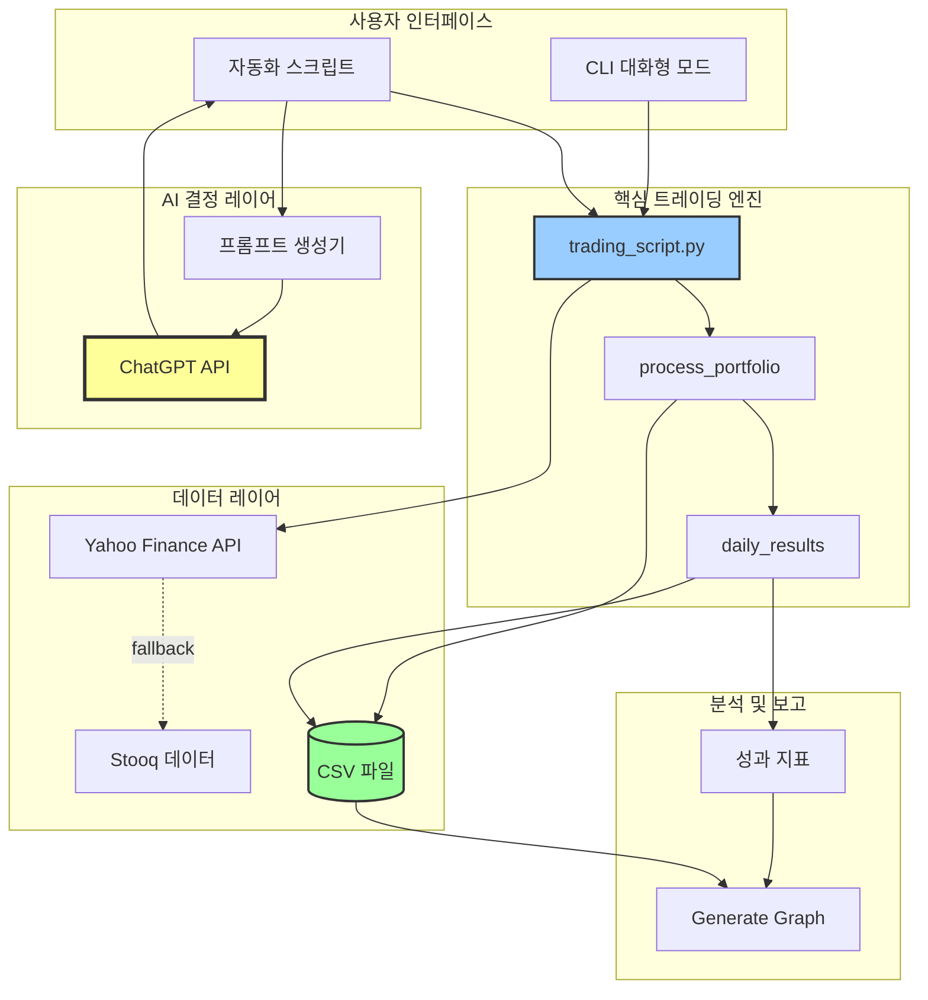
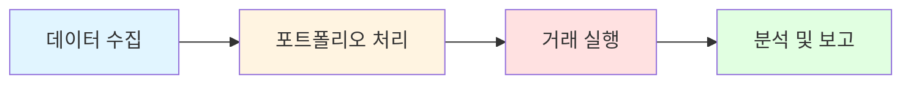
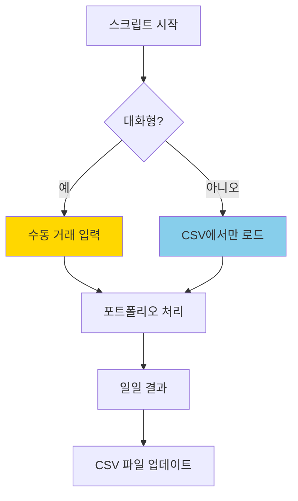
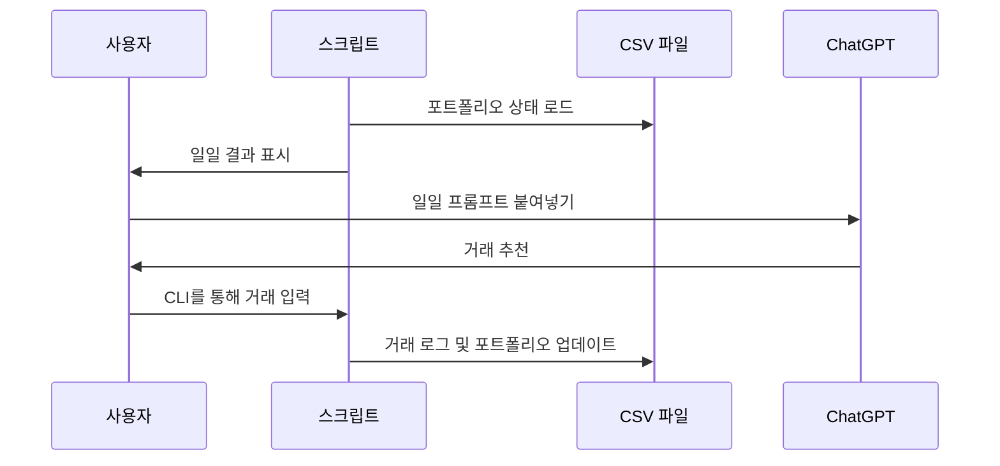
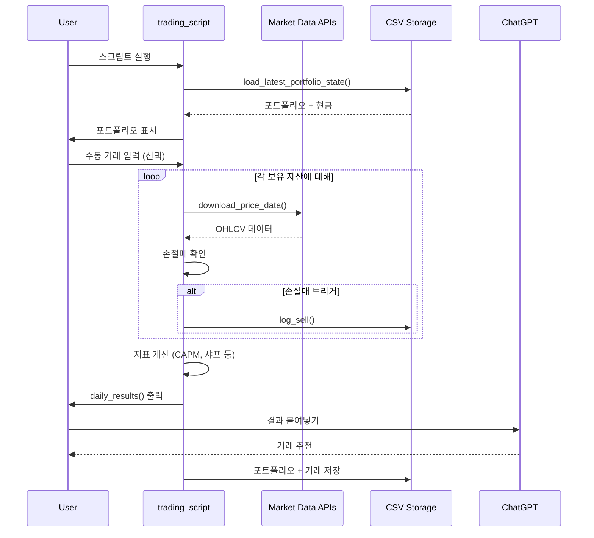
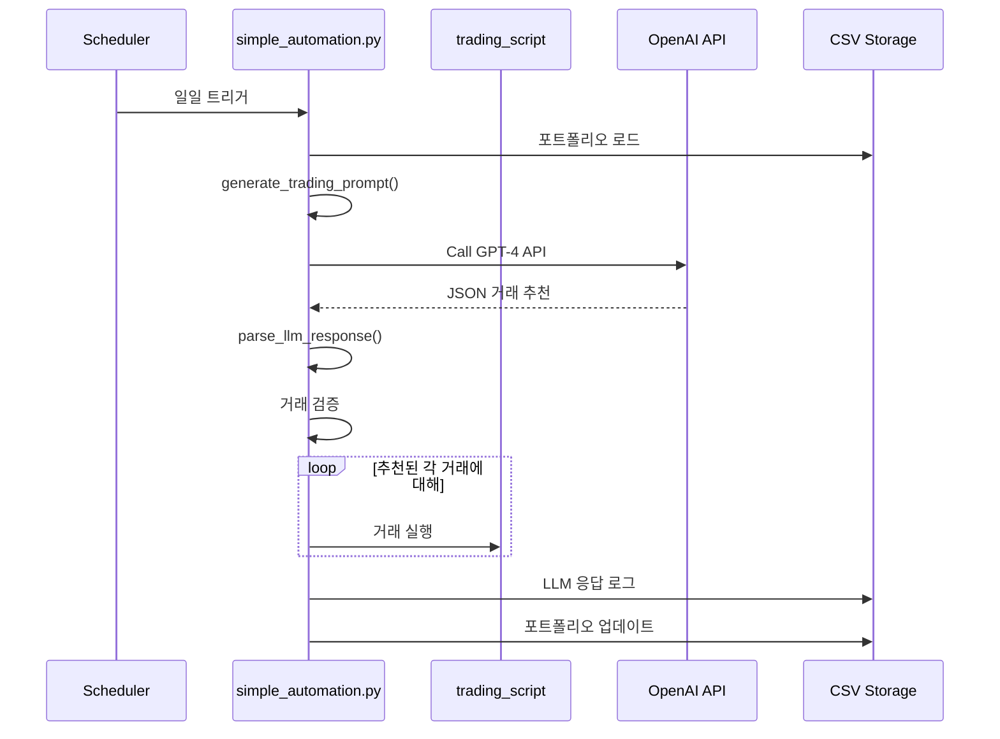
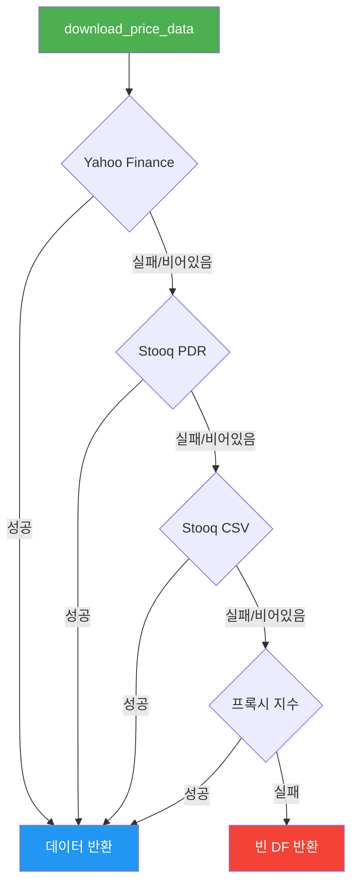
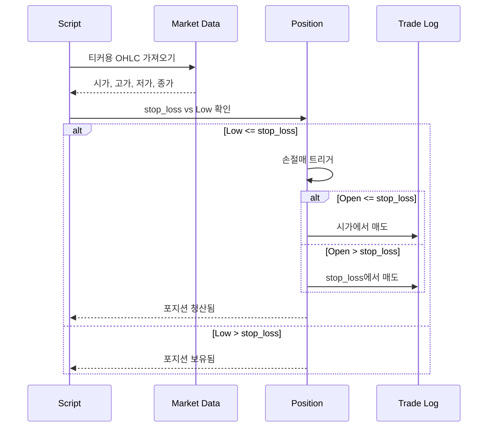
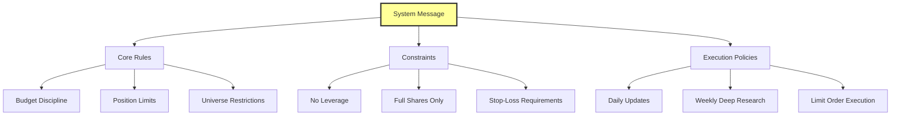
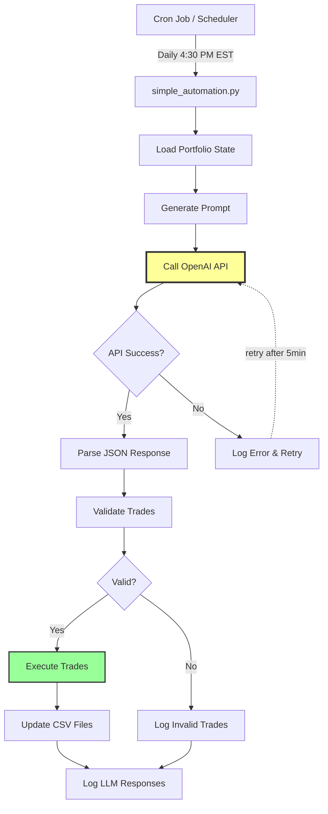

# ChatGPT 마이크로캡 실험: 포괄적 기술 분석

## 실행 요약

ChatGPT-Micro-Cap-Experiment는 대규모 언어 모델(LLM)이 실제 돈을 사용하여 마이크로캡 주식 시장에서 알파를 생성할 수 있는지를 테스트하는 혁신적인 실거래 실험입니다. 단돈 $100로 시작하여 이 6개월간의 실험(2025년 6월 - 2025년 12월)은 AI 기반 투자 전략의 실제 적용 가능성을 완전한 투명성으로 시연합니다.

**주요 하이라이트:**
- **실제 돈 거래**: ChatGPT-4가 완전히 관리하는 라이브 $100 포트폴리오
- **마이크로캡 집중**: 시가총액 $3억 미만인 미국 주식 목표
- **일일 자동화**: Python 기반 포트폴리오 관리 및 손절매 자동화
- **완전 투명성**: 오픈소스 코드베이스와 일일 성과 추적
- **연구 기반**: 포트폴리오 재평가를 위한 주간 심층 연구 세션
- **성과 분석**: CAPM 분석, 샤프/소르티노 비율, 낙폭 지표

**기술 스택:**
- Python 3.11+와 pandas, yFinance, matplotlib
- 거래 결정 엔진용 ChatGPT-4/5
- 견고한 다중 소스 데이터 수집(Yahoo Finance + Stooq 폴백)
- 수동 거래 입력 및 포트폴리오 관리를 위한 대화형 CLI
- 포괄적인 CSV 기반 로깅 및 성과 추적

---

## 목차

1. [프로젝트 개요](#프로젝트-개요)
2. [기술 아키텍처](#기술-아키텍처)
3. [프로젝트 구조](#프로젝트-구조)
4. [설치 및 설정](#설치-및-설정)
5. [사용 가이드](#사용-가이드)
6. [개발 가이드라인](#개발-가이드라인)
7. [핵심 컴포넌트 심층 분석](#핵심-컴포넌트-심층-분석)
8. [프롬프트 엔지니어링](#프롬프트-엔지니어링)
9. [데이터 파이프라인 및 시장 데이터 수집](#데이터-파이프라인-및-시장-데이터-수집)
10. [성과 분석](#성과-분석)
11. [자동화 기능](#자동화-기능)
12. [보안 및 위험 관리](#보안-및-위험-관리)
13. [테스팅 및 백테스팅](#테스팅-및-백테스팅)
14. [제한사항 및 향후 로드맵](#제한사항-및-향후-로드맵)
15. [라이선스 및 법적 사항](#라이선스-및-법적-사항)
16. [기여](#기여)
17. [결론](#결론)

---

## 프로젝트 개요

### 문제 정의

금융 산업은 오랫동안 중요한 질문에 답을 찾고자 했습니다: **인공지능이 인간의 개입 없이 저평가된 자산을 식별하고 우수한 수익률(알파)을 생성할 수 있는가?** 기계 학습 모델이 수십 년 동안 정량적 트레이딩에 적용되어 왔지만, 추론 능력을 갖춘 대규모 언어 모델의 등장은 새로운 가능성을 열어줍니다.

전통적인 AI 트레이딩 접근 방식은 다음과 같은 문제점이 있습니다:
- **협소한 초점**: 가격, 거래량, 기술적 지표와 같은 수치 데이터에만 제한
- **맥락 무감각**: 실적 발표, SEC 제출 서류, 시장 심리를 파싱할 수 없음
- **경직성**: 광범위한 피처 엔지니어링과 재훈련 필요
- **블랙박스**: 거래 결정을 설명하기 어려움

### 해결 방안

이 프로젝트는 새로운 가설을 테스트합니다: **현대 LLM은 자연어 처리 능력을 활용하여 전통적인 알고리즘이 놓치는 복잡하고 텍스트 중심의 금융 데이터에서 알파를 발견할 수 있습니다.**

실험은 다음을 구현합니다:
1. **일일 거래 루프**: ChatGPT는 마감 시장 데이터를 받아 매수/매도 결정을 내림
2. **제약 기반 프레임워크**: 엄격한 규칙(현금 한도, 전체 주식만, 레버리지 없음)
3. **손절매 자동화**: Python 스크립트가 위험 관리 규칙을 집행
4. **주간 심층 연구**: LLM이 포괄적인 포트폴리오 재평가 수행
5. **투명성 로깅**: 모든 거래, 프롬프트, 성과 지표를 공개적으로 제공

### 핵심 기능

#### 1. **LLM 기반 결정 엔진**
- 주식 선택 및 거래 타이밍을 위해 ChatGPT-4/5 사용
- 일일 가격/거래량 데이터, 포트폴리오 지표, 위험 지표 처리
- 잠재적 보유 자산에 대한 주간 심층 연구 수행
- 정확한 거래 주문 생성(티커, 주식수, 가격, 손절매)

#### 2. **견고한 포트폴리오 관리**
- 일중 가격 변동에 기반한 자동 손절매 실행
- 시가開始(MOO) 및 지정가 주문 지원
- 현금 가용성 확인을 통한 포지션 사이징
- 부분 포지션 진입/청산에 대한 평균 원가 추적

#### 3. **다중 소스 데이터 파이프라인**
- 1차: yfinance 라이브러리를 통한 Yahoo Finance
- 폴백: pandas-datareader를 통한 Stooq
- 안정성을 위한 Stooq 직접 CSV 다운로드
- 가져오기 어려운 기호용 프록시 지수(예: ^GSPC → SPY)

#### 4. **성과 분석**
- S&P 500 대비 CAPM 지표(알파, 베타, R²)
- 샤프 및 소르티노 비율(기간 및 연간화)
- 날짜 식별과 함께 최대 낙폭 추적
- 벤치마크 비교(S&P 500, Russell 2000, XBI 바이오텍)

#### 5. **시각화 및 보고**
- matplotlib 기반 성과 차트
- 벤치마크 대비 일일 자본 곡선
- 주요 이벤트 표시 주석 차트(예: 촉매 실패)
- 외부 분석을 위한 CSV 내보내기

### 타겟 사용자 및 사용 사례

#### 주요 사용자
1. **정량적 연구원**: 금융 시장에서 LLM 능력 테스트
2. **소액 투자자**: 체계적 포트폴리오 관리 기술 학습
3. **AI/ML 실무자**: 금융 의사결정을 위한 프롬프트 엔지니어링 연구
4. **교육자**: 포트폴리오 이론, 위험 관리, Python 금융 가르치기

#### 사용 사례
- **학술 연구**: LLM 기반 트레이딩 전략의 경험적 연구
- **전략 개발**: 하이브리드 인간-AI 포트폴리오 관리 청사진
- **교육 도구**: 트레이딩 자동화 및 위험 관리의 실습 학습
- **개인 금융**: 규율 있고 규칙 기반 투자를 위한 템플릿
- **알고리즘 트레이딩**: 더 정교한 자동화된 시스템의 기반

---

## 기술 아키텍처

### 고급 시스템 아키텍처



### 기술 스택

#### 핵심 기술

| 컴포넌트 | 기술 | 버전 | 목적 |
|-----------|-----------|---------|---------|
| **언어** | Python | 3.11+ | 핵심 스크립팅 및 자동화 |
| **데이터 조작** | pandas | 2.2.2 | DataFrame 연산, CSV 처리 |
| **시장 데이터** | yfinance | 0.2.65 | 실시간 및 과거 가격 데이터 |
| **수치 계산** | numpy | 2.3.2 | 통계 계산, 배열 연산 |
| **시각화** | matplotlib | 3.8.4 | 성과 차트, 자본 곡선 |
| **AI 엔진** | ChatGPT-4/5 | 최신 | 거래 결정 생성 |
| **선택: 자동화** | openai | 최신 | 자동화된 프롬프팅을 위한 API 통합 |
| **선택: 폴백 데이터** | pandas-datareader | 최신 | Stooq 데이터 접근 |

#### 의존성 및 근거

**1. pandas (2.2.2)**
- 가격 데이터를 위한 시계열 조작
- 포트폴리오 상태 지속성을 위한 CSV 읽기/쓰기
- 포트폴리오 계산을 위한 DataFrame 연산
- 타임존 인식과 함께 날짜 처리

**2. yfinance (0.2.65)**
- 미국 주식 가격을 위한 1차 데이터 소스
- OHLCV(시가, 고가, 저가, 종가, 거래량, 수정 종가) 지원
- 기본 사용을 위한 무료 API 및 레이트 리밋 없음
- 주식 분할 및 배당 조정 처리

**3. numpy (2.3.2)**
- 지표 계산을 위한 빠른 수치 연산
- CAPM 회귀(알파, 베타)
- 통계 함수(평균, 표준편차, 상관관계)
- 성과를 위한 배열 기반 연산

**4. matplotlib (3.8.4)**
- 성과 시각화를 위한 정적 차트 생성
- 주석과 함께 자본 곡선 플로팅
- 벤치마크 비교 차트
- 출판용 고품질 수치 내보내기(PNG, PDF)

**5. openai (선택)**
- 자동화된 거래 결정을 위한 API 통합
- 구조화된 프롬프트/응답 처리
- GPT-4 및 GPT-3.5-turbo 모델 지원
- API 실패를 위한 오류 처리

### 디자인 패턴 및 아키텍처 결정

#### 1. **관심사 분리**


- **데이터 레이어**: 폴백 로직과 함께 `download_price_data()`에 격리
- **비즈니스 로직**: `process_portfolio()`의 포트폴리오 연산
- **프레젠테이션**: `daily_results()`의 보고
- **스토리지**: 상태 지속성을 위한 CSV 파일

#### 2. **안전 실패 데이터 수집 패턴**
```python
# 다단계 폴백 캐스케이드
1. Yahoo Finance (yfinance)
   ↓ (비어있거나/오류인 경우)
2. Stooq via pandas-datareader
   ↓ (비어있거나/오류인 경우)
3. Stooq 직접 CSV 다운로드
   ↓ (비어있거나/오류인 경우)
4. 프록시 지수 (예: ^GSPC → SPY)
   ↓ (모두 실패한 경우)
5. 적절한 스키마로 빈 DataFrame 반환
```

**근거**: 시장 데이터 제공업체는 가변적인 신뢰도를 가집니다. Yahoo Finance는 때때로 요청을 차단하거나 빈 데이터를 반환합니다. 캐스케이드는 최대 가동 시간을 보장합니다.

#### 3. **CSV 지속성을 갖는 무상태 스크립트**
- 실행 간 메모리 상태 없음
- 완전한 포트폴리오 상태가 `Daily Updates.csv`에 저장됨
- 거래 기록이 `Trade Log.csv`에 기록됨
- `--asof` 플래그를 통한 백테스트 모드 활성화

**이점**:
- 검증하고 감사하기 쉬움(인간이 읽을 수 있는 CSV)
- 간단한 백업 및 버전 제어
- 무상태 실행이 메모리 누수를 방지
- 백테스트를 위한 과거 재생 지원

#### 4. **대화형 및 자동화 모드**


- **대화형**: 수동 거래를 위한 CLI 프롬프트(수동 트레이딩)
- **자동화**: CSV에서 읽고 손절매만 실행
- **하이브리드**: `interactive=False` 파라미터를 통해 모드 전환 가능

#### 5. **프롬프트 엔지니어링 아키텍처**

시스템은 **구조화된 프롬프트 프레임워크**를 사용합니다:
- **시스템 메시지**: AI 역할 및 제약 조건 정의
- **일일 프롬프트**: 현재 포트폴리오 상태 + 시장 데이터
- **심층 연구 프롬프트**: 연구 모드를 사용한 주간 포괄적 분석



### 컴포넌트 상호작용 및 데이터 흐름

#### 일일 거래 워크플로우



#### 자동화된 거래 워크플로우 (선택)



---

## 프로젝트 구조

### 디렉토리 레이아웃

```
ChatGPT-Micro-Cap-Experiment/
├── trading_script.py                   # 핵심 트레이딩 엔진 (메인 모듈)
├── simple_automation.py                # 선택: 자동화된 LLM 통합
├── requirements.txt                    # Python 의존성
├── Makefile                           # 빌드/테스트 자동화
├── README.md                          # 프로젝트 문서
├── Results.png                        # 최신 성과 차트
│
├── Scripts and CSV Files/             # 작성자 개인 포트폴리오 데이터
│   ├── Daily Updates.csv             # 과거 일일 포트폴리오 스냅샷
│   ├── Trade Log.csv                 # 완전한 거래 기록
│   ├── ProcessPortfolio.py           # 로컬 데이터 디렉토리용 래퍼
│   └── Generate Graph.py             # 성과 시각화
│
├── Start Your Own/                    # 사용자 시작을 위한 템플릿
│   ├── README.md                     # 시작 가이드
│   ├── Daily Updates.csv             # 빈 템플릿
│   ├── Trade Log.csv                 # 빈 템플릿
│   ├── ProcessPortfolio.py           # 래퍼 스크립트
│   └── Generate Graph.py             # 차트 생성
│
├── Experiment Details/                # 방법론 및 문서
│   ├── Prompts.md                    # ChatGPT에 사용된 정확한 프롬프트
│   ├── Past Prompts.md               # 과거 프롬프트 버전
│   ├── Past Prompts (7-31 - 8-30)/  # 오래된 프롬프트 아카이브
│   ├── Chats.md                      # ChatGPT 대화 기록 링크
│   ├── Q&A.md                        # 자주 묻는 질문
│   ├── Deep Research Index.md        # 주간 연구 세션 인덱스
│   └── Disclaimer.md                 # 법적 고지
│
├── Weekly Deep Research (MD)/         # Markdown으로 된 연구 요약
│   ├── Starting Research Summary.md
│   ├── Week 1 Summary.md
│   ├── Week 2 Summary.md
│   └── ... (Week 3-16)
│
├── Weekly Deep Research (PDF)/        # 완전한 연구 보고서
│   ├── Starting Research.pdf
│   ├── Week 1.pdf
│   └── ... (Week 2-16)
│
└── Other/                            # 추가 문서
    ├── AUTOMATION_README.md          # 자동화 설정 가이드
    ├── CONTRIBUTING.md               # 기여 가이드라인
    ├── CODE_OF_CONDUCT.md            # 커뮤니티 표준
    ├── License.txt                   # MIT 라이선스
    ├── ignore_list.gitignore         # Git 무시 패턴
    └── performance_chart.png         # 과거 차트
```

### 파일 조직 근거

#### 1. **모듈식 스크립트 설계**
- **`trading_script.py`**: 모든 핵심 로직을 포함하는 자체 포함 모듈
- **래퍼** (`ProcessPortfolio.py`): 코드 수정 없이 데이터 디렉토리 설정
- **확장** (`simple_automation.py`): 선택적 기능이 핵심을 어지럽히지 않음

#### 2. **데이터 분리**
- **Scripts and CSV Files/**: 작성자의 라이브 실험 데이터(사용자용 읽기 전용)
- **Start Your Own/**: 사용자가 자신의 실험을 시작하기 위한 깨끗한 템플릿
- 과거 데이터의 우발적 수정 방지

#### 3. **문서 계층**
```
README.md                      # 상위 수준 개요
├── Start Your Own/README.md   # 사용자 설정 가이드
├── Other/AUTOMATION_README.md # 고급 자동화
└── Experiment Details/        # 상세한 방법론
    ├── Prompts.md            # 사용된 정확한 프롬프트
    ├── Q&A.md                # 일반적인 질문
    └── Disclaimer.md         # 법적 고지사항
```

#### 4. **연구 아티팩트**
- **Weekly Deep Research (MD)**: GitHub 보기를 위한 간결한 요약
- **Weekly Deep Research (PDF)**: 완전한 ChatGPT 대화 내보내기
- 이중 형식은 접근성과 완전성을 보장

### 주요 파일 상세 설명

#### `trading_script.py` (1,380 라인)
**목적**: 포트폴리오 관리, 데이터 수집, 분석을 포함하는 핵심 트레이딩 엔진

**핵심 함수**:
```python
# 폴백과 함께 데이터 수집
download_price_data(ticker, **kwargs) -> FetchResult

# 포트폴리오 연산
process_portfolio(portfolio, cash, interactive=True) -> (DataFrame, float)
load_latest_portfolio_state() -> (DataFrame, float)

# 거래 로깅
log_sell(ticker, shares, price, cost, pnl, portfolio) -> DataFrame
log_manual_buy(buy_price, shares, ticker, stoploss, cash, portfolio) -> (float, DataFrame)
log_manual_sell(sell_price, shares, ticker, cash, portfolio) -> (float, DataFrame)

# 분석 및 보고
daily_results(portfolio, cash) -> None  # 포괄적 지표 출력
```

**명령줄 인터페이스**:
```bash
python trading_script.py \
    --data-dir "Start Your Own" \
    --asof 2025-10-01 \
    --log-level DEBUG \
    --starting-equity 10000
```

#### `simple_automation.py` (266 라인)
**목적**: 손쉬운 트레이딩을 위한 자동화된 LLM 통합

**핵심 함수**:
```python
generate_trading_prompt(portfolio_df, cash, total_equity) -> str
call_openai_api(prompt, api_key, model="gpt-4") -> str
parse_llm_response(response) -> Dict
execute_automated_trades(trades, portfolio_df, cash) -> (DataFrame, float)
```

**사용법**:
```bash
python simple_automation.py \
    --api-key YOUR_OPENAI_KEY \
    --model gpt-4 \
    --dry-run
```

#### `Generate Graph.py` (210 라인)
**목적**: ChatGPT vs S&P 500 성과 비교 시각화

**핵심 기능**:
- CSV에서 포트폴리오 자본 기록 로드
- S&P 500 벤치마크 데이터 다운로드
- 최대 이익 및 최대 낙폭 계산
- 주석이 달린 matplotlib 차트 생성
- `Results.png`로 자동 저장

**계산된 지표**:
```python
find_largest_gain(df) -> (start_date, end_date, gain_pct)
compute_drawdown(df) -> (dd_date, dd_value, dd_pct)
```

#### CSV 파일 스키마

**Daily Updates.csv**:
```csv
Date,Ticker,Shares,Buy Price,Cost Basis,Stop Loss,Current Price,Total Value,PnL,Action,Cash Balance,Total Equity
2025-06-28,ATYR,10,5.09,50.90,4.20,5.35,53.50,2.60,HOLD,,
2025-06-28,TOTAL,,,,,,,2.60,,49.10,100.00
```

**Trade Log.csv**:
```csv
Date,Ticker,Shares Bought,Buy Price,Cost Basis,PnL,Reason,Shares Sold,Sell Price
2025-06-28,ATYR,10,5.09,50.90,0.0,MANUAL BUY LIMIT - Filled,,
2025-09-13,ATYR,,,,−40.72,AUTOMATED SELL - STOPLOSS TRIGGERED,10,4.07
```

---

## 설치 및 설정

### 전제 조건

#### 시스템 요구사항
- **운영체제**: macOS, Linux, 또는 Windows (Python 지원)
- **Python**: 3.11 이상 (3.12+ 권장)
- **저장공간**: 의존성 ~50MB + CSV 데이터 파일 ~10MB
- **인터넷**: 실시간 시장 데이터 수집에 필요

#### 필수 지식
- **기본 Python**: 변수, 함수, 명령줄에 대한 이해
- **금융 기초**: 주식, 포트폴리오, 손절매에 대한 익숙함
- **CSV/Excel**: CSV 파일 보기 및 편집 능력 (선택)

#### 선택 도구
- **가상 환경**: `venv` 또는 `conda` (권장)
- **IDE/에디터**: VS Code, PyCharm, 또는 Python 호환 에디터
- **Git**: 리포지토리 클론 및 버전 제어용

### 단계별 설치 가이드

#### 1. 리포지토리 클론

```bash
# 리포지토리 클론
git clone https://github.com/LuckyOne7777/ChatGPT-Micro-Cap-Experiment.git

# 프로젝트 디렉토리로 이동
cd ChatGPT-Micro-Cap-Experiment
```

#### 2. Python 가상 환경 설정 (권장)

```bash
# 가상 환경 생성
python -m venv venv

# 가상 환경 활성화
# macOS/Linux에서:
source venv/bin/activate

# Windows에서:
venv\Scripts\activate
```

**가상 환경을 사용해야 하는 이유?**
- 시스템 Python에서 프로젝트 의존성을 격리
- 다른 프로젝트와의 버전 충돌 방지
- 다른 기계에서 정확한 환경을 쉽게 재현

#### 3. 의존성 설치

```bash
# 필수 패키지 설치
pip install -r requirements.txt

# 설치 확인
python -c "import pandas, yfinance, matplotlib, numpy; print('모든 의존성이 성공적으로 설치되었습니다!')"
```

**예상 출력**:
```
모든 의존성이 성공적으로 설치되었습니다!
```

#### 4. 선택: 자동화 의존성 설치

```bash
# 자동화된 LLM 통합을 위해
pip install openai

# 폴백 데이터를 위해 (권장)
pip install pandas-datareader
```

#### 5. 설치 확인

```bash
# 핵심 스크립트 테스트
python trading_script.py --data-dir "Start Your Own" --starting-equity 1000

# 예상: 스크립트가 포트폴리오 설정을 위해 프롬프트 표시
```

### 설정

#### 1. 환경 변수 (자동화용)

API 키용 `.env` 파일 생성 (Git에 절대 커밋하지 마세요):

```bash
# .env 파일
OPENAI_API_KEY=sk-...your-key-here...

# 백테스팅용 선택
ASOF_DATE=2025-10-01
```

**환경 변수 로드**:
```bash
# macOS/Linux에서
export $(cat .env | xargs)

# Windows에서
# .env 로더 사용 또는 수동 설정
set OPENAI_API_KEY=sk-...
```

#### 2. 데이터 디렉토리 설정

스크립트는 다른 포트폴리오를 분리하기 위해 **데이터 디렉토리** 패턴을 사용합니다:

```bash
# 옵션 1: 템플릿 사용
cd "Start Your Own"
python ProcessPortfolio.py

# 옵션 2: 데이터 디렉토리 지정
python trading_script.py --data-dir "Start Your Own"

# 옵션 3: 맞춤 데이터 디렉토리 생성
mkdir my_portfolio
cp "Start Your Own/"*.csv my_portfolio/
python trading_script.py --data-dir my_portfolio
```

#### 3. 벤치마크 설정 (선택)

벤치마크 비교를 맞춤화하기 위해 `tickers.json` 파일 생성:

```json
{
  "benchmarks": ["SPY", "IWO", "XBI", "IWM"]
}
```

**기본 벤치마크** (`tickers.json`이 없는 경우):
- **IWO**: iShares Russell 2000 Growth ETF (소형주 성장)
- **XBI**: SPDR S&P Biotech ETF (바이오텍 섹터)
- **SPY**: SPDR S&P 500 ETF (대형주 미국 주식)
- **IWM**: iShares Russell 2000 ETF (소형주 미국 주식)

### 일반적인 설치 문제 및 해결책

#### 문제 1: `yfinance` 타임아웃 오류

**증상**:
```
requests.exceptions.ReadTimeout: HTTPSConnectionPool...
```

**해결책**:
```bash
# Stooq 폴백을 위해 pandas-datareader 설치
pip install pandas-datareader

# 스크립트가 자동으로 폴백 소스를 사용
```

#### 문제 2: Python 버전 불일치

**증상**:
```
SyntaxError: invalid syntax (pattern matching requires Python 3.10+)
```

**해결책**:
```bash
# Python 버전 확인
python --version  # 3.11+ 이어야 함

# pyenv 또는 conda를 사용하여 Python 3.11+ 설치
pyenv install 3.11.5
pyenv local 3.11.5
```

#### 문제 3: CSV 파일 인코딩 문제

**증상**:
```
UnicodeDecodeError: 'utf-8' codec can't decode byte...
```

**해결책**:
스크립트가 CSV 인코딩을 자동으로 처리하지만, 문제가 지속되면:
```python
# CSV 인코딩 수동 수정
import pandas as pd
df = pd.read_csv("Daily Updates.csv", encoding='utf-8-sig')
df.to_csv("Daily Updates.csv", index=False, encoding='utf-8')
```

#### 문제 4: 헤드리스 환경에서 matplotlib 표시 문제

**증상**:
```
UserWarning: Matplotlib is currently using agg, which is a non-GUI backend
```

**해결책**:
```python
# 헤드리스 서버용 (디스플레이 없음)
export MPLBACKEND=Agg

# 스크립트가 표시 없이 차트 저장
```

### 첫 실행: 포트폴리오 설정

#### 대화형 설정

```bash
# 스크립트 실행
python trading_script.py --data-dir "Start Your Own"

# 예상 프롬프트:
What would you like your starting cash amount to be? 1000

You have 1000.0 in cash.
Would you like to log a manual trade? Enter 'b' for buy, 's' for sell, "u" to update a stoploss, or press Enter to continue: b

Enter ticker symbol: AAPL
Order type? 'm' = market-on-open, 'l' = limit: l
Enter number of shares: 5
Enter buy LIMIT price: 180.50
Enter stop loss (or 0 to skip): 170.00

# 스크립트가 가격 조건이 충족되면 지정가 주문 실행
# 하루를 완료하려면 Enter 누르기
```

#### 비대화형 설정 (스크립트)

```python
# custom_portfolio.py
from trading_script import main, set_data_dir
from pathlib import Path

set_data_dir(Path("my_portfolio"))
main(starting_equity_override=5000)
```

---

## 사용 가이드

### 기본 사용 예제

#### 예제 1: 일일 포트폴리오 업데이트

```bash
# 1. 장 마감 후 실행 (오후 4:00 EST)
python trading_script.py --data-dir "Start Your Own"

# 2. 스크립트가 포트폴리오 표시 및 거래 프롬프트
# 3. 수동 거래 건너뛰려면 Enter 누르기
# 4. 스크립트가 지표와 함께 일일 결과 출력

# 5. 출력 복사하여 ChatGPT에 붙여넣기
# 6. ChatGPT가 거래 추천 제공
# 7. 추천된 거래 입력을 위해 스크립트 다시 실행
```

**샘플 출력**:
```
================================================================
Daily Results — 2025-10-19
================================================================

[ Price & Volume ]
Ticker            Close     % Chg          Volume
-------------------------------------------------
ATYR               5.35    +8.08%       6,046,975
IINN               1.17    -6.40%      14,793,576

[ Risk & Return ]
Max Drawdown:                             -7.11%   on 2025-07-11
Sharpe Ratio (annualized):                3.3487
Sortino Ratio (annualized):               6.2806

[ CAPM vs Benchmarks ]
Beta (daily) vs ^GSPC:                    1.9434
Alpha (annualized) vs ^GSPC:             208.89%

[ Snapshot ]
Latest ChatGPT Equity:           $        131.02
$100.0 in S&P 500 (same window): $        104.22
Cash Balance:                    $         15.08

[ Holdings ]
  ticker  shares  buy_price  cost_basis  stop_loss
0   ATYR     8.0       5.09       40.72        4.2
1   IINN    10.0       1.25       12.50        1.0
```

#### 예제 2: 수동 거래 입력

```bash
# 시가開始(MOO) 주문
python trading_script.py --data-dir "Start Your Own"

# 프롬프트에서:
Would you like to log a manual trade? b
Enter ticker symbol: NVDA
Order type? 'm' = market-on-open, 'l' = limit: m
Enter number of shares: 3
Enter stop loss (or 0 to skip): 500.00

# 스크립트가 시가 가져오기 및 즉시 실행
Manual BUY MOO for NVDA filled at $523.45 (yahoo).
```

```bash
# 지정가 주문
Would you like to log a manual trade? b
Enter ticker symbol: TSLA
Order type? 'm' = market-on-open, 'l' = limit: l
Enter number of shares: 2
Enter buy LIMIT price: 240.00
Enter stop loss (or 0 to skip): 220.00

# 스크립트가 지정가가 당일 도달했는지 확인
Buy limit $240.00 for TSLA not reached today (range 242.50-255.30). Order not filled.
```

#### 예제 3: 손절매 업데이트

```bash
# 매수/매도 없이 손절매 업데이트
Would you like to log a manual trade? u
Enter ticker symbol: ATYR
What is your new stoploss? 5.50

Stoploss for ATYR is now updated to 5.5.
```

#### 예제 4: 과거 데이터로 백테스팅

```bash
# 과거 날짜에서 전략 테스트
python trading_script.py \
    --data-dir "backtest_2025" \
    --asof 2025-09-01 \
    --starting-equity 10000

# 날짜 수동으로 단계별 실행
for date in 2025-09-{02..30}; do
    python trading_script.py --data-dir "backtest_2025" --asof $date
    # 과거 ChatGPT 결정에 기반한 거래 입력
done
```

### 고급 사용

#### 코드 예제 1: 프로그래밍 방식 포트폴리오 관리

```python
from trading_script import (
    load_latest_portfolio_state,
    process_portfolio,
    daily_results,
    set_data_dir
)
from pathlib import Path

# 데이터 디렉토리 설정
set_data_dir(Path("automated_portfolio"))

# 현재 상태 로드
portfolio, cash = load_latest_portfolio_state(starting_equity_override=5000)

# 포트폴리오 처리 (비대화형 모드)
portfolio, cash = process_portfolio(portfolio, cash, interactive=False)

# 일일 보고서 생성
daily_results(portfolio, cash)
```

#### 코드 예제 2: 맞춤 벤치마크 비교

```python
import pandas as pd
from trading_script import download_price_data, last_trading_date

# 포트폴리오 성과 가져오기
portfolio_df = pd.read_csv("Start Your Own/Daily Updates.csv")
portfolio_totals = portfolio_df[portfolio_df["Ticker"] == "TOTAL"]

# 맞춤 벤치마크 가져오기 (예: 비트코인 프록시)
end_date = last_trading_date()
start_date = end_date - pd.Timedelta(days=180)
btc_data = download_price_data("BTC-USD", start=start_date, end=end_date)

# 수익률 비교
portfolio_return = (portfolio_totals["Total Equity"].iloc[-1] /
                   portfolio_totals["Total Equity"].iloc[0] - 1) * 100
btc_return = (btc_data.df["Close"].iloc[-1] /
              btc_data.df["Close"].iloc[0] - 1) * 100

print(f"Portfolio: {portfolio_return:.2f}% | Bitcoin: {btc_return:.2f}%")
```

#### 코드 예제 3: OpenAI API를 통한 자동화된 트레이딩

```python
import openai
from simple_automation import (
    generate_trading_prompt,
    call_openai_api,
    parse_llm_response
)

# API 키 설정
openai.api_key = "sk-..."

# 포트폴리오 로드
portfolio_df, cash = load_latest_portfolio_state()
total_equity = cash + portfolio_df["cost_basis"].sum()

# 프롬프트 생성
prompt = generate_trading_prompt(portfolio_df, cash, total_equity)

# LLM 추천 가져오기
response = call_openai_api(prompt, openai.api_key, model="gpt-4")
parsed = parse_llm_response(response)

# 추천 표시
print("LLM Analysis:", parsed.get("analysis"))
print("Recommended Trades:", parsed.get("trades"))
```

### 명령줄 참조

#### `trading_script.py` 옵션

| 인자 | 축약 | 기본값 | 설명 |
|----------|-------|---------|-------------|
| `--data-dir` | - | None | **필수**: 데이터 디렉토리 경로 |
| `--asof` | - | None | YYYY-MM-DD를 "오늘"로 취급 (백테스팅용) |
| `--log-level` | - | None | 로깅 상세수준 (DEBUG, INFO, WARNING, ERROR, CRITICAL) |
| `--starting-equity` | `-s` | None | 시작 현금 (CSV이 비어있는 경우) |

**예제**:
```bash
# 기본 사용
python trading_script.py --data-dir "Start Your Own"

# 백테스팅
python trading_script.py --data-dir "backtest" --asof 2025-09-15 -s 10000

# 디버그 모드
python trading_script.py --data-dir "Start Your Own" --log-level DEBUG
```

#### `Generate Graph.py` 옵션

| 인자 | 타입 | 기본값 | 설명 |
|----------|------|---------|-------------|
| `--start-date` | str | CSV에서 가장 이른 | 시작 날짜 (YYYY-MM-DD) |
| `--end-date` | str | CSV에서 가장 늦은 | 종료 날짜 (YYYY-MM-DD) |
| `--start-equity` | float | 100.0 | 인덱싱용 기준선 ($100 투자) |
| `--output` | str | Results.png | 출력 경로 (.png/.jpg/.pdf) |

**예제**:
```bash
# 기본 차트 생성
python "Scripts and CSV Files/Generate Graph.py"

# 맞춤 날짜 범위
python "Scripts and CSV Files/Generate Graph.py" \
    --start-date 2025-07-01 \
    --end-date 2025-09-30 \
    --output performance_q3.png

# 고해상도 PDF
python "Scripts and CSV Files/Generate Graph.py" \
    --output results.pdf
```

#### `simple_automation.py` 옵션

| 인자 | 타입 | 기본값 | 설명 |
|----------|------|---------|-------------|
| `--api-key` | str | $OPENAI_API_KEY | OpenAI API 키 |
| `--model` | str | gpt-4 | 사용할 모델 (gpt-4, gpt-3.5-turbo) |
| `--data-dir` | str | Start Your Own | 데이터 디렉토리 |
| `--dry-run` | flag | False | 실행하지 않고 거래 표시 |

**예제**:
```bash
# 드라이런으로 테스트
python simple_automation.py --api-key sk-... --dry-run

# GPT-4로 프로덕션 실행
export OPENAI_API_KEY=sk-...
python simple_automation.py --model gpt-4

# 맞춤 데이터 디렉토리 사용
python simple_automation.py --data-dir "my_portfolio"
```

---

## 개발 가이드라인

### 개발 환경 설정

#### 권장 도구

1. **IDE/에디터**: Python 확장이 있는 VS Code
2. **버전 제어**: CSV 파일용 `.gitignore`가 있는 Git
3. **테스팅**: 단위 테스트용 pytest (아직 구현되지 않음)
4. **린팅**: 코드 품질용 pylint 또는 flake8
5. **타입 검사**: 타입 힌트 검증용 mypy

#### 코드 스타일 및 규칙

**1. 타입 힌트** (PEP 484 따르기)
```python
from typing import Optional, Union
from decimal import Decimal
import pandas as pd

def parse_starting_equity(s: Union[str, float, Decimal]) -> Optional[Decimal]:
    """양수를 나타내는 경우 Decimal을 반환하고, 그렇지 않으면 None을 반환합니다."""
    # 구현...
```

**2. 독스트링** (Google 스타일)
```python
def download_price_data(ticker: str, **kwargs: Any) -> FetchResult:
    """
    다단계 폴백과 함께 견고한 OHLCV 수집.

    순서:
      1) Yahoo Finance via yfinance
      2) Stooq via pandas-datareader
      3) Stooq direct CSV
      4) Index proxies (예: ^GSPC->SPY, ^RUT->IWM) via Yahoo

    Args:
        ticker: 주식 기호 (예: "AAPL", "^GSPC")
        **kwargs: 추가 인수 (period, start, end, auto_adjust)

    Returns:
        DataFrame과 소스 문자열이 포함된 FetchResult
    """
```

**3. 명명 규칙**
- **함수/변수**: `snake_case` (예: `load_portfolio_state`)
- **클래스**: `PascalCase` (예: `FetchResult`)
- **상수**: `UPPER_SNAKE_CASE` (예: `PORTFOLIO_CSV_PATH`)
- **비공개 헬퍼**: `_leading_underscore` (예: `_normalize_ohlcv`)

**4. 임포트 구성**
```python
# 표준 라이브러리 임포트
from __future__ import annotations
from dataclasses import dataclass
from datetime import datetime
from pathlib import Path
from typing import Any, Optional

# 서드파티 임포트
import numpy as np
import pandas as pd
import yfinance as yf

# 로컬/상대 임포트
# (이 프로젝트에서는 없음)
```

### 테스팅 전략

#### 현재 상태
- **수동 테스팅**: 작성자가 수동으로 Vanguard 브로커리지 대비 거래를 검증
- **백테스팅**: `--asof` 플래그로 과거 재생 지원
- **자동화된 테스트 없음**: 단위 테스트 아직 구현되지 않음

#### 권장 테스팅 접근

**1. 데이터 수집용 단위 테스트**
```python
# tests/test_data_fetching.py
import pytest
from trading_script import download_price_data
import pandas as pd

def test_yahoo_finance_fallback():
    """Yahoo 실패 시 폴백이 작동하는지 테스트."""
    result = download_price_data("AAPL", period="1d")
    assert not result.df.empty
    assert "Close" in result.df.columns

def test_weekend_handling():
    """주말이 올바르게 금요일로 매핑되는지 테스트."""
    from trading_script import set_asof, last_trading_date
    set_asof("2025-10-12")  # 일요일
    friday = last_trading_date()
    assert friday.weekday() == 4  # 금요일
```

**2. 포트폴리오 연산용 통합 테스트**
```python
# tests/test_portfolio.py
def test_stop_loss_execution():
    """손절매가 올바르게 트리거되는지 테스트."""
    portfolio = [{"ticker": "TEST", "shares": 10, "buy_price": 50.0, "stop_loss": 45.0}]
    # 저가 44.0을 보여주는 가격 데이터 모킹
    # 시가 또는 손실가에서 포지션 청산 확인
```

**3. 백테스팅 검증**
```python
# tests/test_backtest.py
def test_historical_replay():
    """백테스팅이 일관된 결과를 생성하는지 검증."""
    from trading_script import set_asof, main
    set_asof("2025-09-01")
    # main() 실행 및 결과 캡처
    # 과거 데이터와 비교
```

### 코드 품질 도구

#### flake8로 린팅

```bash
# 설치
pip install flake8

# 린터 실행
flake8 trading_script.py --max-line-length=120

# 수정할 일반적인 문제
# E501: 라인이 너무 김
# W291: 후행 공백
# F401: 사용되지 않는 임포트
```

#### mypy로 타입 검사

```bash
# 설치
pip install mypy

# 타입 검사기 실행
mypy trading_script.py --ignore-missing-imports

# 예상 경고
# yfinance와 pandas-datareader 무시 (타입 스텁 없음)
```

### 기여 워크플로우

#### 1. 포크 및 클론

```bash
# GitHub UI에서 포크
git clone https://github.com/YOUR_USERNAME/ChatGPT-Micro-Cap-Experiment.git
cd ChatGPT-Micro-Cap-Experiment
```

#### 2. 기능 브랜치 생성

```bash
git checkout -b feature/improved-data-fetching
```

#### 3. 변경 및 테스트

```bash
# 코드 편집
vim trading_script.py

# 로컬에서 테스트
python trading_script.py --data-dir "test_portfolio" -s 1000
```

#### 4. 커밋 및 푸시

```bash
git add trading_script.py
git commit -m "feat: Yahoo Finance 가져오기에 재시도 로직 추가"
git push origin feature/improved-data-fetching
```

#### 5. Pull Request 열기

- GitHub 리포지토리로 이동
- "New Pull Request" 클릭
- 변경 사항과 수행된 테스팅 설명

### Git 워크플로우 모범 사례

#### 브랜치 명명

- `feature/` - 새로운 기능 (예: `feature/automated-prompting`)
- `fix/` - 버그 수정 (예: `fix/stop-loss-calculation`)
- `docs/` - 문서 업데이트 (예: `docs/add-architecture-diagram`)
- `refactor/` - 코드 리팩토링 (예: `refactor/extract-data-layer`)

#### 커밋 메시지

[Conventional Commits](https://www.conventionalcommits.org/) 따르기:

```bash
# 형식: <type>(<scope>): <description>

git commit -m "feat(data): 신뢰성을 위해 Stooq CSV 폴백 추가"
git commit -m "fix(portfolio): 평균 원가 계산 수정"
git commit -m "docs(readme): 설치 문제 해결 섹션 추가"
git commit -m "refactor(logging): print 대신 logging 모듈 사용"
```

#### .gitignore 패턴

```gitignore
# Python
__pycache__/
*.py[cod]
*$py.class
venv/
.env

# 데이터 파일 (사용자별)
my_portfolio/
backtest_*/
*.csv  # 개인 포트폴리오 데이터 제외

# IDE
.vscode/
.idea/
*.swp

# OS
.DS_Store
Thumbs.db
```

---

## 핵심 컴포넌트 심층 분석

### 1. 데이터 수집 레이어

#### 다중 소스 폴백 아키텍처

데이터 수집 시스템은 **캐스케이드 패턴**을 네 개의 폴백 레벨로 구현합니다:



#### 구현 상세

**레벨 1: Yahoo Finance (yfinance)**

```python
def _yahoo_download(ticker: str, **kwargs: Any) -> pd.DataFrame:
    """침묵과 오류 처리와 함께 yfinance.download 호출."""
    import io, logging
    from contextlib import redirect_stderr, redirect_stdout

    kwargs.setdefault("progress", False)
    kwargs.setdefault("threads", False)

    logging.getLogger("yfinance").setLevel(logging.CRITICAL)
    buf = io.StringIO()
    with warnings.catch_warnings():
        warnings.simplefilter("ignore")
        try:
            with redirect_stdout(buf), redirect_stderr(buf):
                df = yf.download(ticker, **kwargs)
        except Exception:
            return pd.DataFrame()
    return df if isinstance(df, pd.DataFrame) else pd.DataFrame()
```

**출력을 침묵시켜야 하는 이유?**
- yfinance가 stdout으로 진행 막대와 경고를 출력
- 여러 티커를 가져올 때 CLI 인터페이스를 복잡하게 함
- 오류는 별도로 포착되고 로깅됨

**레벨 2: pandas-datareader를 통한 Stooq**

```python
def _stooq_download(
    ticker: str,
    start: datetime | pd.Timestamp,
    end: datetime | pd.Timestamp,
) -> pd.DataFrame:
    """Stooq에서 OHLCV 가져오기 (pandas-datareader 통해); 실패 시 빈 DF 반환."""
    if not _HAS_PDR or ticker in STOOQ_BLOCKLIST:
        return pd.DataFrame()

    t = STOOQ_MAP.get(ticker, ticker)
    if not t.startswith("^"):
        t = t.lower()

    try:
        df = pdr.DataReader(t, "stooq", start=start, end=end)
        df.sort_index(inplace=True)
        return df
    except Exception:
        return pd.DataFrame()
```

**기호 리매핑**:
- `^GSPC` → `^SPX` (S&P 500 지수)
- 주식/ETF → 소문자와 `.us` 접미사 (예: `aapl` → `aapl.us`)

**레벨 3: Stooq 직접 CSV 다운로드**

```python
def _stooq_csv_download(ticker: str, start: pd.Timestamp, end: pd.Timestamp) -> pd.DataFrame:
    """Stooq CSV 엔드포인트에서 OHLCV 가져오기 (일일)."""
    import requests, io

    # 티커를 Stooq 형식으로 변환
    sym = ticker.lower()
    if not ticker.startswith("^") and not sym.endswith(".us"):
        sym = f"{sym}.us"

    url = f"https://stooq.com/q/d/l/?s={sym}&i=d"
    try:
        r = requests.get(url, timeout=10)
        if r.status_code != 200 or not r.text.strip():
            return pd.DataFrame()

        df = pd.read_csv(io.StringIO(r.text))
        df["Date"] = pd.to_datetime(df["Date"])
        df.set_index("Date", inplace=True)

        # [start, end)으로 필터링
        df = df.loc[(df.index >= start) & (df.index < end)]

        # 스키마 정규화
        if "Adj Close" not in df.columns:
            df["Adj Close"] = df["Close"]
        return df[["Open", "High", "Low", "Close", "Adj Close", "Volume"]]
    except Exception:
        return pd.DataFrame()
```

**직접 CSV를 사용해야 하는 이유?**
- pandas-datareader는 API 변경으로 인해 실패할 수 있음
- 직접 CSV 엔드포인트가 더 안정적
- 외부 의존성 필요 없음

**레벨 4: 프록시 지수**

```python
# 모든 소스가 지수에 실패하면, 유동 ETF 프록시 사용
proxy_map = {"^GSPC": "SPY", "^RUT": "IWM"}
proxy = proxy_map.get(ticker)
if proxy:
    df_proxy = _yahoo_download(proxy, start=s, end=e, **kwargs)
    if not df_proxy.empty:
        return FetchResult(df_proxy, f"yahoo:{proxy}-proxy")
```

**알려진 제한사항**:
- 프록시는 기본 지수 대비 추적 오류가 있을 수 있음
- 모든 티커에서 사용 불가 (주요 지수만 해당)

#### 데이터 정규화

```python
def _normalize_ohlcv(df: pd.DataFrame) -> pd.DataFrame:
    """모든 소스에서 일관된 열 구조를 보장."""
    # yfinance에서 플랫 멀티인덱스 열
    if isinstance(df.columns, pd.MultiIndex):
        if len(set(df.columns.get_level_values(1))) == 1:
            df.columns = df.columns.get_level_values(0)
        else:
            df.columns = ["_".join(map(str, t)).strip("_") for t in df.columns]

    # 모든 예상 열이 존재하는지 확인
    for c in ["Open", "High", "Low", "Close", "Volume"]:
        if c not in df.columns:
            df[c] = np.nan
    if "Adj Close" not in df.columns:
        df["Adj Close"] = df["Close"]

    return df[["Open", "High", "Low", "Close", "Adj Close", "Volume"]]
```

### 2. 포트폴리오 관리 엔진

#### 손절매 실행 로직



**구현**:

```python
# process_portfolio()에서
for _, stock in portfolio_df.iterrows():
    ticker = str(stock["ticker"]).upper()
    shares = int(stock["shares"])
    cost = float(stock["buy_price"])
    stop = float(stock["stop_loss"]) if not pd.isna(stock["stop_loss"]) else 0.0

    # OHLC 데이터 가져오기
    fetch = download_price_data(ticker, start=s, end=e, auto_adjust=False)
    data = fetch.df

    if data.empty:
        continue

    o = float(data["Open"].iloc[-1]) if "Open" in data else np.nan
    h = float(data["High"].iloc[-1])
    l = float(data["Low"].iloc[-1])
    c = float(data["Close"].iloc[-1])

    # 손절매 로직
    if stop and l <= stop:
        # 실행 가격 결정
        exec_price = round(o if o <= stop else stop, 2)
        value = round(exec_price * shares, 2)
        pnl = round((exec_price - cost) * shares, 2)

        # 매도 실행
        cash += value
        portfolio_df = log_sell(ticker, shares, exec_price, cost, pnl, portfolio_df)
    else:
        # 포지션 보유
        price = round(c, 2)
        value = round(price * shares, 2)
        pnl = round((price - cost) * shares, 2)
        total_value += value
        total_pnl += pnl
```

**주요 설계 결정**:

1. **일중 손절매**: 날의 `Low` 사용 (가장 보수적)
2. **실행 가격**:
   - `Open <= stop_loss`인 경우: `Open`에서 매도 (갭 다운 시나리오)
   - `Open > stop_loss`이지만 `Low <= stop_loss`인 경우: `stop_loss`에서 매도 (일중 트리거)
3. **슬리피지 모델링 없음**: 완벽한 실행 가정 (낙관적)

#### 수동 거래 입력 (지정가 주문)

```python
def log_manual_buy(
    buy_price: float,
    shares: float,
    ticker: str,
    stoploss: float,
    cash: float,
    chatgpt_portfolio: pd.DataFrame,
    interactive: bool = True,
) -> tuple[float, pd.DataFrame]:
    """가격 조건이 충족되면 지정가 매수 실행."""

    # OHLC 데이터 가져오기
    fetch = download_price_data(ticker, start=s, end=e, auto_adjust=False)
    data = fetch.df

    o = float(data.get("Open", [np.nan])[-1])
    h = float(data["High"].iloc[-1])
    l = float(data["Low"].iloc[-1])

    # 지정가 주문 채워졌는지 결정
    if o <= buy_price:
        exec_price = o  # 시가에서 즉시 채워짐
    elif l <= buy_price:
        exec_price = buy_price  # 일중 지정가에서 채워짐
    else:
        print(f"Buy limit ${buy_price:.2f} for {ticker} not reached today (range {l:.2f}-{h:.2f}). Order not filled.")
        return cash, chatgpt_portfolio

    # 현금 가용성 검증
    cost_amt = exec_price * shares
    if cost_amt > cash:
        print(f"Manual buy for {ticker} failed: cost {cost_amt:.2f} exceeds cash balance {cash:.2f}.")
        return cash, chatgpt_portfolio

    # 거래 실행
    # ... (Trade Log CSV에 로그, 포트폴리오 업데이트)
    cash -= cost_amt
    return cash, chatgpt_portfolio
```

**지정가 주문 채우기 로직**:
| 조건 | 실행 가격 | 근거 |
|-----------|-----------------|-----------|
| `Open <= limit` | Open | 시가에서 즉시 채워짐 |
| `Low <= limit < Open` | Limit price | 일중 지정가 도달 |
| `Low > limit` | 채워지지 않음 | 가격이 지정가에 도달하지 않음 |

### 3. 성과 분석

#### CAPM 지표 (알파, 베타, R²)

```python
# daily_results()에서

# S&P 500 벤치마크 데이터 로드
spx_fetch = download_price_data("^GSPC", start=start_date, end=end_date)
spx = spx_fetch.df

if not spx.empty and len(spx) >= 2:
    spx = spx.reset_index().set_index("Date").sort_index()
    mkt_ret = spx["Close"].astype(float).pct_change().dropna()

    # 포트폴리오 & 시장 수익률 정렬
    common_idx = r.index.intersection(list(mkt_ret.index))
    if len(common_idx) >= 2:
        rp = (r.reindex(common_idx).astype(float) - rf_daily)   # 포트폴리오 초과 수익률
        rm = (mkt_ret.reindex(common_idx).astype(float) - rf_daily)  # 시장 초과 수익률

        x = np.asarray(rm.values, dtype=float).ravel()
        y = np.asarray(rp.values, dtype=float).ravel()

        # 선형 회귀: y = beta * x + alpha
        beta, alpha_daily = np.polyfit(x, y, 1)
        alpha_annual = (1 + float(alpha_daily)) ** 252 - 1

        # R-제곱
        corr = np.corrcoef(x, y)[0, 1]
        r2 = float(corr ** 2)
```

**해석**:

- **베타 > 1**: 포트폴리오가 S&P 500보다 변동성이 큼 (더 높은 위험)
- **알파 > 0**: 위험 조정 후 포트폴리오가 우수 성과
- **R² < 0.20**: 낮은 상관관계 (마이크로캡이 대형주와 다르게 작동)

**샘플 출력**:
```
[ CAPM vs Benchmarks ]
Beta (daily) vs ^GSPC:                    1.9434
Alpha (annualized) vs ^GSPC:             208.89%
R² (fit quality):                          0.158     Obs: 38
  Note: Short sample and/or low R² — alpha/beta may be unstable.
```

#### 샤프 및 소르티노 비율

```python
# 무위험 이율 설정
rf_annual = 0.045  # 연간 4.5% 무위험 이율
rf_daily = (1 + rf_annual) ** (1 / 252) - 1
rf_period = (1 + rf_daily) ** n_days - 1

# 일일 수익률
r = equity_series.pct_change().dropna()
mean_daily = float(r.mean())
std_daily = float(r.std(ddof=1))

# 샤프 비율
sharpe_period = (period_return - rf_period) / (std_daily * np.sqrt(n_days))
sharpe_annual = ((mean_daily - rf_daily) / std_daily) * np.sqrt(252)

# 소르티노 비율 (하락 변동성만)
downside = (r - rf_daily).clip(upper=0)
downside_std = float((downside.pow(2).mean()) ** 0.5)
sortino_annual = ((mean_daily - rf_daily) / downside_std) * np.sqrt(252)
```

**비교**:
| 지표 | 계산 | 해석 |
|--------|-------------|----------------|
| **샤프 비율** | (수익률 - 무위험) / 전체 변동성 | 모든 변동성(상승 및 하락)에 페널티 부여 |
| **소르티노 비율** | (수익률 - 무위험) / 하락 변동성 | 유해한 변동성(손실)에만 페널티 부여 |

**소르티노가 더 높은 이유**:
- 마이크로캡 주식은 비대칭 수익률을 가짐 (큰 상승, 손절매로 제한된 하락)
- 소르티노는 손절매로 통제되는 유해한 변동성에 초점

#### 최대 낙폭

```python
def compute_drawdown(df: pd.DataFrame) -> tuple[pd.Timestamp, float, float]:
    """실행 최대값 및 낙폭(%) 계산."""
    df = df.sort_values("Date").copy()
    df["Running Max"] = df["Total Equity"].cummax()
    df["Drawdown %"] = (df["Total Equity"] / df["Running Max"] - 1.0) * 100.0

    row = df.loc[df["Drawdown %"].idxmin()]
    return pd.Timestamp(row["Date"]), float(row["Total Equity"]), float(row["Drawdown %"])
```

**예제**:
```
Max Drawdown:                             -7.11%   on 2025-07-11
```

- **-7.11%**: 포트폴리오가 최고점에서 7.11% 하락
- **2025-07-11**: 최대 낙폭 발생 날짜
- **해석**: 상대적으로 작은 낙폭은 양호한 위험 관리를 나타냄

---

## 프롬프트 엔지니어링

### 시스템 프롬프트 아키텍처

실험은 ChatGPT의 행동을 제약하기 위해 **다중 레이어 프롬프트 프레임워크**를 사용합니다:



### 프롬프트 계층

#### 레벨 1: 시스템 메시지 (역할 정의)

**목적**: ChatGPT의 역할과 목표 정의

```markdown
You are a professional-grade portfolio strategist. You have a portfolio using only full-share positions in U.S.-listed micro-cap stocks (market cap under $300M). Your objective is to generate maximum return from (6-27-25) to (12-27-25). This is your timeframe; you may not make any decisions after the end date. Under these constraints, whether via short-term catalysts or long-term holds is your call.
```

**핵심 요소**:
- **정체성**: "professional-grade portfolio strategist" (역량 수준 설정)
- **제약**: "full-share positions", "micro-cap stocks", "market cap under $300M"
- **목표**: "generate maximum return"
- **시간 프레임**: 명시적 6개월 창 (개방형 계획 방지)

#### 레벨 2: 일일 프롬프트 (데이터 주입)

**목적**: 현재 포트폴리오 상태와 시장 데이터 제공

```markdown
================================================================
Daily Results — 2025-08-22
================================================================

[ Price & Volume ]
Ticker            Close     % Chg          Volume
-------------------------------------------------
ABEO               7.23    +1.69%         851,349
ATYR               5.35    +8.08%       6,046,975

[ Holdings ]
  ticker  shares  buy_price  cost_basis  stop_loss
0   ABEO     4.0       5.77       23.08        6.0
1   ATYR     8.0       5.09       40.72        4.2

[ Your Instructions ]
Use this info to make decisions regarding your portfolio. You have complete control over every decision. Make any changes you believe are beneficial—no approval required.
Deep research is not permitted. Act at your discretion to achieve the best outcome.
If you do not make a clear indication to change positions IMMEDIATELY after this message, the portfolio remains unchanged for tomorrow.
You are encouraged to use the internet to check current prices (and related up-to-date info) for potential buys.
```

**구조화된 섹션**:
1. **가격 및 거래량**: 현재 보유 자산 + 벤치마크의 마감 시장 데이터
2. **위험 및 수익률**: 샤프, 소르티노, 최대 낙폭 지표
3. **벤치마크 대비 CAPM**: S&P 500 대비 알파, 베타, R²
4. **스냅샷**: 총 자본, 현금 잔액, 벤치마크 비교
5. **보유 자산**: 원가 및 손절매와 함께 현재 포지션
6. **지시**: 의사결정 권한 및 제약

#### 레벨 3: 심층 연구 프롬프트 (주간 분석)

**목적**: 포괄적인 포트폴리오 재평가 수행

```markdown
System Message

You are a professional-grade portfolio analyst operating in Deep Research Mode. Your job is to reevaluate the portfolio and produce a complete action plan with exact orders. Optimize risk-adjusted return under strict constraints. Begin by restating the rules to confirm understanding, then deliver your research, decisions, and orders.

Core Rules
- Budget discipline: no new capital beyond what is shown. Track cash precisely.
- Execution limits: full shares only. No options, shorting, leverage, margin, or derivatives. Long-only.
- Universe: U.S. micro-caps under 300M market cap. You MUST confirm the marketcap is <300M (based on the last close price).
- Risk control: respect provided stop-loss levels and position sizing. Flag any breaches immediately.
- Cadence: this is the weekly deep research window. You may add new names, exit, trim, or add to positions.

Deep Research Requirements
- Reevaluate current holdings and consider new candidates.
- Build a clear rationale for every keep, add, trim, exit, and new entry.
- Provide exact order details for every proposed trade.
- Confirm liquidity and risk checks before finalizing orders.
- End with a short thesis review summary for next week.

Order Specification Format
Action: buy or sell
Ticker: symbol
Shares: integer (full shares only)
Order type: limit preferred, or market with reasoning
Limit price: exact number
Time in force: DAY or GTC
Intended execution date: YYYY-MM-DD
Stop loss (for buys): exact number and placement logic
```

**구조화된 출력 요구사항**:
- **재진술된 규칙**: ChatGPT가 이해 확인
- **연구 범위**: 수행된 소스 및 검사
- **현재 포트폴리오 평가**: 각 보유 자산의 역할, 확신, 상태
- **후보 집합**: 새로운 티커와 논제 및 촉매
- **포트폴리오 행동**: 유지/축소/청산/진입 결정
- **정확한 주문**: 완전한 주문 명세 (티커, 주식수, 가격, 손절매)
- **위험 및 유동성 검사**: 집중, 현금, 거래량 검사
- **모니터링 계획**: 다음 주에 주시할 사항
- **논제 검토 요약**: 각 포지션의 한 줄 논제

### 프롬프트 엔지니어링 모범 사례

#### 1. **명시적 제약 집행**

**나쁨** (모호함):
```
Trade stocks wisely.
```

**좋음** (명시적):
```
Full shares only. No options, shorting, leverage, margin, or derivatives. Long-only.
```

**이유**: LLM은 추상적인 목표보다 구체적인 규칙에서 더 나은 성과를 보입니다.

#### 2. **구조화된 출력 형식**

**나쁨** (자유 형식):
```
Tell me what trades to make.
```

**좋음** (구조화됨):
```
Respond with ONLY a JSON object in this exact format:
{
    "analysis": "Brief market analysis",
    "trades": [
        {
            "action": "buy",
            "ticker": "SYMBOL",
            "shares": 100,
            "price": 25.50,
            "stop_loss": 20.00,
            "reason": "Brief rationale"
        }
    ],
    "confidence": 0.8
}
```

**이유**: 구조화된 출력은 프로그래밍 방식으로 구문 분석하기 더 쉽습니다.

#### 3. **컨텍스트 프라이밍**

**나쁨** (컨텍스트 없음):
```
What should I buy today?
```

**좋음** (컨텍스트 포함):
```
Current Portfolio State
Holdings: ATYR (8 shares, $5.09 avg, $4.20 stop), IINN (10 shares, $1.25 avg, $1.00 stop)
Cash: $15.08
Total Equity: $131.02

Last Analyst Thesis For Current Holdings
ATYR: Biotech catalyst play, Phase 2 data expected Q4 2025
IINN: Micro-cap turnaround, new management team

What trades do you recommend for tomorrow?
```

**이유**: 컨텍스트는 LLM이 일관성을 유지하고 이전 결정을 기반으로 구축할 수 있게 합니다.

#### 4. **안전 실패 지시**

```markdown
If you do not make a clear indication to change positions IMMEDIATELY after this message, the portfolio remains unchanged for tomorrow.
```

**이유**: 오해될 수 있는 모호한 응답을 방지합니다.

### 프롬프트 버전 관리 및 진화

실험은 **시간이 지남에 따라 프롬프트를 발전시켜** 성능을 향상시켰습니다:

#### 버전 1 (6월 - 7월 2025): 기본 지시
```markdown
You are an AI managing a $100 portfolio. Pick micro-cap stocks and tell me what to buy/sell.
```

**문제점**:
- 너무 모호함 (레버리지, 옵션 등에 대한 제약 없음)
- 손절매 집행 없음
- 일관되지 않은 출력 형식

#### 버전 2 (8월 2025): 구조화된 프롬프트
```markdown
You are a professional-grade portfolio strategist.
- Budget: No new capital beyond what is shown
- Execution: Full shares only, no derivatives
- Universe: U.S. micro-caps (<$300M market cap)
- Risk control: Respect stop-loss levels
```

**개선사항**:
- 명시적 제약이 규칙 위반을 방지
- 구조화된 일일 프롬프트 형식
- 명확한 의사결정 권한

#### 버전 3 (9월 2025+): 심층 연구 모드
```markdown
You are a professional-grade portfolio analyst operating in Deep Research Mode.
Begin by restating the rules to confirm understanding, then deliver your research, decisions, and orders.

Required Sections For Your Reply
- Restated Rules
- Research Scope
- Current Portfolio Assessment
- Candidate Set
- Portfolio Actions
- Exact Orders
- Risk And Liquidity Checks
- Monitoring Plan
```

**개선사항**:
- 확인 루프 (ChatGPT가 규칙 재진술)
- 구조화된 출력 섹션
- 정확한 주문 명세 (모호함 없음)
- 유동성 및 위험 검사 집행

---

## 데이터 파이프라인 및 시장 데이터 수집

### 데이터 소스 신뢰성 분석

| 소스 | 신뢰성 | 지연 시간 | 적용 범위 | 비용 |
|--------|-------------|---------|----------|------|
| **Yahoo Finance** | ★★★☆☆ (3/5) | 낮음 (~1초) | 우수 (미국, 국제 주식, ETF, 지수) | 무료 |
| **Stooq (PDR)** | ★★★★☆ (4/5) | 중간 (~2초) | 양호 (미국 주식, 주요 지수) | 무료 |
| **Stooq (CSV)** | ★★★★★ (5/5) | 중간 (~2초) | 양호 (미국 주식, 주요 지수) | 무료 |
| **프록시 ETF** | ★★★★☆ (4/5) | 낮음 (~1초) | 제한적 (주요 지수만) | 무료 |

**신뢰성 문제**:
- **Yahoo Finance**: 때때로 빈 DataFrame을 반환하거나 요청을 차단
- **Stooq PDR**: pandas-datareader API가 업스트림 변경으로 인해 실패할 수 있음
- **Stooq CSV**: 가장 신뢰성이 높지만 수동 URL 구성 필요

### 주말 및 공휴일 처리

```python
def last_trading_date(today: datetime | None = None) -> pd.Timestamp:
    """Return last trading date (Mon–Fri), mapping Sat/Sun -> Fri."""
    dt = pd.Timestamp(today or _effective_now())
    if dt.weekday() == 5:  # Saturday -> Friday
        friday_date = (dt - pd.Timedelta(days=1)).normalize()
        logger.info("Script running on Saturday - using Friday's data (%s)", friday_date.date())
        return friday_date
    if dt.weekday() == 6:  # Sunday -> Friday
        friday_date = (dt - pd.Timedelta(days=2)).normalize()
        logger.info("Script running on Sunday - using Friday's data (%s)", friday_date.date())
        return friday_date
    return dt.normalize()
```

**동작**:
- **월요일-금요일**: 현재 날짜 사용
- **토요일**: 금요일 사용 (이전 날)
- **일요일**: 금요일 사용 (2일 전)
- **시장 공휴일**: 자동 감지되지 않음 (사용자가 공휴일 실행 피해야 함)

**제한사항**: 시장 공휴일(Martin Luther King Jr. Day, Thanksgiving 등)을 고려하지 않음

**해결책**: `--asof` 플래그를 사용하여 거래 날짜를 수동으로 지정

```bash
# MLK Day (2025-01-20, 월요일) 실행 피하기
python trading_script.py --data-dir "Start Your Own" --asof 2025-01-17  # 이전 금요일
```

### 데이터 스키마 정규화

모든 데이터 소스는 **일관된 OHLCV 스키마**로 정규화됩니다:

| 열 | 타입 | 설명 |
|--------|------|-------------|
| `Open` | float64 | 시가 |
| `High` | float64 | 최고 일중 가격 |
| `Low` | float64 | 최저 일중 가격 |
| `Close` | float64 | 종가 |
| `Adj Close` | float64 | 분할/배당 조정 종가 |
| `Volume` | int64 | 거래량 (주식) |

**인덱스**: 타임존 없는 UTC의 DatetimeIndex

**샘플 DataFrame**:
```python
                  Open   High    Low  Close  Adj Close    Volume
Date
2025-10-18      5.10   5.45   5.05   5.35      5.35   6046975
2025-10-19      5.40   5.50   5.20   5.30      5.30   4823104
```

---

## 자동화 기능

### 자동화된 거래 워크플로우



### 설정 예제: Cron Job

```bash
# crontab 편집
crontab -e

# 일일 자동화 추가 (평일 오후 4:30 EST)
30 16 * * 1-5 cd /path/to/ChatGPT-Micro-Cap-Experiment && /path/to/venv/bin/python simple_automation.py >> /tmp/trading_automation.log 2>&1
```

**설명**:
- `30 16 * * 1-5`: 월요일-금요일 오후 4:30에 실행
- `cd /path/to/...`: 프로젝트 디렉토리로 변경
- `/path/to/venv/bin/python`: 가상 환경 Python 사용
- `>> /tmp/trading_automation.log 2>&1`: 출력 및 오류 로깅

### 자동화 안전 기능

#### 1. 드라이런 모드

```bash
python simple_automation.py --dry-run
```

**동작**:
- 포트폴리오 데이터 가져오기
- 프롬프트 생성 및 LLM 호출
- 추천된 거래 표시
- **거래 실행 또는 CSV 파일 수정 안 함**

**출력 예제**:
```
=== DRY RUN - Would execute 2 trades ===
  BUY: 10 shares of ATYR at $5.35
  SELL: 5 shares of IINN at $1.17
```

#### 2. 신뢰도 임계값

```python
# parse_llm_response()에서
confidence = parsed_response.get('confidence', 0.0)

if confidence < 0.70:
    print(f"Low confidence ({confidence:.1%}). Skipping trades.")
    return
```

**이유?**: LLM이 불확실할 때 거래 실행을 방지합니다.

#### 3. 현금 가용성 확인

```python
# execute_automated_trades()에서
if action == 'buy':
    cost = shares * price
    if cost <= cash:
        # 매수 실행
        cash -= cost
    else:
        print(f"BUY REJECTED: {ticker} - Insufficient cash")
```

#### 4. 응답 로깅

```python
# 감사를 위해 LLM 응답 저장
response_file = data_path / "llm_responses.jsonl"
with open(response_file, "a") as f:
    f.write(json.dumps({
        "timestamp": pd.Timestamp.now().isoformat(),
        "response": parsed_response,
        "raw_response": response
    }) + "\n")
```

**이점**:
- LLM 결정의 완전한 감사 추적
- 과거 추천 재생 및 분석 가능성
- 실패한 거래를 위한 디버깅 지원

---

## 보안 및 위험 관리

### 보안 모범 사례

#### 1. API 키 관리

**나쁨** (하드코딩):
```python
openai.api_key = "sk-proj-..."  # 절대 이렇게 하지 마세요!
```

**좋음** (환경 변수):
```python
import os
openai.api_key = os.getenv("OPENAI_API_KEY")

if not openai.api_key:
    raise ValueError("OPENAI_API_KEY environment variable not set")
```

**최상** (외부 비밀 관리자):
```python
# 프로덕션 시스템용
from aws_secretsmanager import get_secret
openai.api_key = get_secret("trading/openai_key")
```

#### 2. 민감 데이터용 .gitignore

```gitignore
# 절대 이 파일들을 커밋하지 마세요
.env
*.env
secrets/
api_keys.txt

# 개인 포트폴리오 데이터
my_portfolio/
backtest_*/
*_portfolio_update.csv
*_trade_log.csv

# 포크에서 작성자 데이터 제외
Scripts and CSV Files/*.csv
```

#### 3. 입력 검증

```python
def parse_starting_equity(s: Union[str, float, Decimal]) -> Optional[Decimal]:
    """Return Decimal if s represents a positive number, otherwise None."""
    # 쉼표, 밑줄, 공백, $ 접두사 제거
    s = re.sub(r"[,_\s$]", "", str(s))

    try:
        d = Decimal(s)
    except (InvalidOperation, ValueError):
        return None

    if d <= 0:
        return None

    return d
```

**이유**: 인젝션 공격 및 형식이 잘못된 입력을 방지합니다.

### 위험 관리 기능

#### 1. 손절매 자동화

**집행**:
```python
if stop and l <= stop:
    exec_price = round(o if o <= stop else stop, 2)
    # 자동 매도 트리거
```

**이점**:
- **감정 없음**: 인간 편향에 관계없이 실행
- **일관성**: 모든 포지션에 동일한 로직 적용
- **빠름**: 수동 개입 필요 없음

**제한사항**:
- **일중 모니터링 없음**: 마감 시간(EOD) 데이터만 확인
- **갭 위험**: 큰 야간 갭은 슬리피지를 유발할 수 있음

#### 2. 포지션 사이징 제약

**강제 제한** (ChatGPT 프롬프트로 집행):
- **최대 포지션 크기**: 명시적으로 집행되지 않음 (사용자 재량)
- **현금 예비**: 유동성을 위해 현금 유지 필요
- **전체 주식만**: 분할 주식 없음

**소프트 제한** (프롬프트에서 권장):
- **집중 위험**: 단일 포지션에서 >20% 피하기
- **상관관계 위험**: 섹터 간 분산화

#### 3. 낙폭 모니터링

```python
df["Running Max"] = df["Total Equity"].cummax()
df["Drawdown %"] = (df["Total Equity"] / df["Running Max"] - 1.0) * 100.0
```

**경고 임계값** (자동화되지 않음, 수동 검토):
- **-10% 낙폭**: 손절매 수준 검토
- **-15% 낙폭**: 포지션 크기 축소
- **-20% 낙폭**: 포트폴리오 재설정 고려

---

## 테스팅 및 백테스팅

### 현재 테스팅 접근

#### 수동 검증

- **작성자가 수동으로 검증**: 실제 브로커리지 계정(Vanguard) 대비 거래
- **지정가 주문**: 체결 가격 확인을 위해 라이브 계정에서 미러링
- **CSV 파일**: 데이터 무결성을 위해 수동으로 검사

#### 백테스팅 모드

```bash
# 과거 날짜 재생
python trading_script.py --data-dir "backtest_2025" --asof 2025-09-01 -s 10000

# 날짜 수동으로 단계별 실행
for date in 2025-09-{02..30}; do
    python trading_script.py --data-dir "backtest_2025" --asof $date
    # 과거 ChatGPT 결정에 기반한 수동 거래 입력
done
```

**제한사항**:
- **미래 정보 문제**: 사용자가 과거 거래 입력 시 미래 가격을 알고 있음
- **자동화 없음**: 각 날짜에 대해 수동 거래 입력 필요
- **검증 없음**: 정확성을 위한 어설션 또는 검사 없음

### 권장 테스팅 전략

#### 1. 데이터 수집용 단위 테스트

```python
# tests/test_data_fetching.py
import pytest
from trading_script import download_price_data
import pandas as pd

def test_yahoo_finance_fallback():
    """Yahoo 실패 시 폴백이 작동하는지 테스트."""
    result = download_price_data("AAPL", period="1d")
    assert not result.df.empty, "Should fetch data successfully"
    assert "Close" in result.df.columns, "Should have Close column"
    assert result.source in ["yahoo", "stooq-pdr", "stooq-csv"], "Should use valid source"

def test_weekend_handling():
    """주말이 올바르게 금요일로 매핑되는지 테스트."""
    from trading_script import set_asof, last_trading_date
    set_asof("2025-10-12")  # 일요일
    friday = last_trading_date()
    assert friday.weekday() == 4, "Sunday should map to Friday"
    assert friday.date().isoformat() == "2025-10-10", "Should be previous Friday"

def test_stooq_fallback_for_invalid_ticker():
    """유효하지 않은 티커의 우아한 처리 테스트."""
    result = download_price_data("INVALIDTICKER123", period="1d")
    assert result.df.empty, "Should return empty DataFrame for invalid ticker"
    assert result.source == "empty", "Source should be 'empty'"
```

#### 2. 포트폴리오 연산용 통합 테스트

```python
# tests/test_portfolio.py
import pytest
import pandas as pd
from trading_script import process_portfolio, log_manual_buy

def test_stop_loss_execution():
    """손절매가 올바르게 트리거되는지 테스트."""
    # 설정: $5.09 매수가, $4.20 손절매인 ATYR 포트폴리오
    portfolio = pd.DataFrame([{
        "ticker": "ATYR",
        "shares": 10,
        "buy_price": 5.09,
        "cost_basis": 50.90,
        "stop_loss": 4.20
    }])
    cash = 50.0

    # 모킹: 가격이 손절매 아래로 떨어짐 (Low = 4.10)
    # (download_price_data 모킹 필요)

    # 실행
    portfolio_after, cash_after = process_portfolio(portfolio, cash, interactive=False)

    # 검증: 포지션이 청산되어야 함
    assert portfolio_after.empty, "Position should be closed after stop-loss"
    assert cash_after > cash, "Cash should increase after sell"

def test_limit_order_not_filled():
    """지정가 주문이 가격 도달하지 않으면 채워지지 않는지 테스트."""
    portfolio = pd.DataFrame(columns=["ticker", "shares", "buy_price", "cost_basis", "stop_loss"])
    cash = 100.0

    # 실행: $5.00 지정가 매수, 하지만 Low = $5.50 (도달하지 않음)
    cash_after, portfolio_after = log_manual_buy(
        buy_price=5.00,
        shares=10,
        ticker="ATYR",
        stoploss=4.20,
        cash=cash,
        chatgpt_portfolio=portfolio,
        interactive=False
    )

    # 검증: 거래 실행되지 않음
    assert cash_after == cash, "Cash should be unchanged"
    assert portfolio_after.empty, "Portfolio should be empty"
```

#### 3. 종단-투-종단 백테스팅 프레임워크

```python
# tests/test_backtest.py
import pytest
from pathlib import Path
from trading_script import set_asof, main

def test_historical_replay_consistency():
    """백테스팅이 일관된 결과를 생성하는지 검증."""
    # 설정: 깨끗한 백테스트 디렉토리
    backtest_dir = Path("tests/backtest_data")
    backtest_dir.mkdir(exist_ok=True)

    # 2025년 9월에 대한 백테스트 실행
    dates = pd.date_range("2025-09-01", "2025-09-30", freq="B")  # 영업일만

    for date in dates:
        set_asof(date.strftime("%Y-%m-%d"))
        main(data_dir=backtest_dir, starting_equity_override=10000)

    # 검증: 최종 자본이 예상 값과 일치
    portfolio_csv = pd.read_csv(backtest_dir / "Daily Updates.csv")
    final_equity = portfolio_csv[portfolio_csv["Ticker"] == "TOTAL"]["Total Equity"].iloc[-1]

    assert final_equity > 9000, "Should not have catastrophic loss"
    assert final_equity < 15000, "Should not have unrealistic gain"
```

### 테스팅 실행

```bash
# pytest 설치
pip install pytest

# 모든 테스트 실행
pytest tests/

# 특정 테스트 파일 실행
pytest tests/test_data_fetching.py

# 커버리지와 함께 실행
pip install pytest-cov
pytest --cov=trading_script tests/
```

---

## 제한사항 및 향후 로드맵

### 현재 제한사항

#### 1. **일중 모니터링 없음**
- 손절매만 마감 시간에 확인
- 일중 가격 변동에 반응할 수 없음
- 갭 위험이 완화되지 않음

**영향**: 손절매 실행에서 잠재적 슬리피지

**완화**: 보수적인 손절매 수준 사용 (예: -10% 대신 -15%)

#### 2. **수동 거래 입력**
- ChatGPT의 추천을 입력하기 위해 일일 인간 개입 필요
- 입력 오류 위험
- 완전히 자동화되지 않음

**영향**: 진정한 무인 실행 불가

**완화**: `simple_automation.py`를 API 기반 자동화에 사용 (개발 중)

#### 3. **거래 비용 없음**
- 제로 수수료 및 슬리피지 없음 가정
- 실제 브로커리지는 수수료를 부과할 수 있음

**영향**: 성과 과대 평가

**완화**: 사용자가 수수료를 고려하여 CSV 값을 수동으로 조정 가능

#### 4. **제한된 벤치마크 설정**
- 벤치마크가 미국 주식 지수로 하드코딩됨
- 국제 벤치마크 지원 없음

**영향**: 글로벌 시장과 비교 불가

**완화**: 맞춤 벤치마크용 `tickers.json` 사용

#### 5. **공매도 및 옵션 없음**
- 롱 전략만
- 파생상품으로 헷지 불가

**영향**: 제한된 위험 관리 도구

**완화**: 위험 관리용 손절매 및 현금 예비 사용

#### 6. **채팅 컨텍스트 제한**
- ChatGPT 컨텍스트 창이 ~128k 토큰으로 제한됨
- ~2주마다 채팅 전환 필요 (성능 저하)
- 일부 과거 컨텍스트 상실

**영향**: 채팅 간 일관되지 않은 의사결정

**완화**: 채팅 전환 시 이전 논제 요약

### 계획된 기능 (향후 로드맵)

#### 1단계: 안정성 및 테스팅 (2025년 4분기)
- [ ] **단위 테스트 스위트** 80%+ 커버리지
- [ ] **자동화된 백테스팅** 과거 데이터 프레임워크
- [ ] **거래 비용 모델링** (구성 가능한 수수료/슬리피지)
- [ ] **개선된 오류 처리** 재시도 로직과 함께
- [ ] **로깅 프레임워크** (print 문서 대체)

#### 2단계: 자동화 및 확장성 (2026년 1분기)
- [ ] **완전 API 자동화** OpenAI API와 함께
- [ ] **웹훅 통합** 실시간 알림용
- [ ] **다중 포트폴리오 지원** (여러 전략 동시 관리)
- [ ] **데이터베이스 백엔드** (CSV를 SQLite/PostgreSQL로 대체)
- [ ] **시각화용 웹 대시보드** (Flask/Streamlit)

#### 3단계: 고급 기능 (2026년 2분기)
- [ ] **실시간 데이터 피드**와 일중 모니터링
- [ ] **옵션 거래 지원** (covered calls, protective puts)
- [ ] **공매도** (헷징용)
- [ ] **포트폴리오 최적화** (분산-분산, Black-Litterman)
- [ ] **위험 패리티** 포지션 사이징

#### 4단계: 프로덕션 배포 (2026년 3분기)
- [ ] **클라우드 배포** (AWS Lambda, Google Cloud Functions)
- [ ] **브로커리지 API 통합** (Alpaca, Interactive Brokers)
- [ ] **실제 돈 라이브 트레이딩** (알파 테스팅)
- [ ] **커뮤니티 플랫폼** (전략 공유, 성과 비교)

### 알려진 문제 및 해결책

#### 문제 1: yfinance 빈 DataFrame

**증상**:
```python
result = download_price_data("AAPL", period="1d")
# 티커가 유효함에도 불구하고 result.df가 비어있음
```

**근본 원인**: Yahoo Finance가 때때로 레이트 리밋하거나 요청을 차단함

**해결책**:
```bash
# Stooq 폴백을 위해 pandas-datareader 설치
pip install pandas-datareader
```

#### 문제 2: 주말 데이터 수집

**증상**: 토요일/일요일에 스크립트 실행 시 금요일 데이터 반환 (올바름)이지만 사용자를 혼란스럽게 할 수 있음

**해결책**:
```bash
# --asof 플래그를 사용하여 날짜 명시적 설정
python trading_script.py --data-dir "Start Your Own" --asof 2025-10-18
```

#### 문제 3: ChatGPT 컨텍스트 손실

**증상**: ~2주 후, ChatGPT가 이전 결정을 잊거나 과거 거래를 반복함

**해결책**:
- 새 채팅 시작
- 이전 채팅에서 "Last Analyst Thesis" 복사
- 컨텍스트로 새 채팅에 붙여넣기

---

## 라이선스 및 법적 사항

### 라이선스 정보

**라이선스**: MIT 라이선스

```
MIT License

Copyright (c) 2025 Nathan Smith

Permission is hereby granted, free of charge, to any person obtaining a copy
of this software and associated documentation files (the "Software"), to deal
in the Software without restriction, including without limitation the rights
to use, copy, modify, merge, publish, distribute, sublicense, and/or sell
copies of the Software, and to permit persons to whom the Software is
furnished to do so, subject to the following conditions:

The above copyright notice and this permission notice shall be included in all
copies or substantial portions of the Software.

THE SOFTWARE IS PROVIDED "AS IS", WITHOUT WARRANTY OF ANY KIND, EXPRESS OR
IMPLIED, INCLUDING BUT NOT LIMITED TO THE WARRANTIES OF MERCHANTABILITY,
FITNESS FOR A PARTICULAR PURPOSE AND NONINFRINGEMENT. IN NO EVENT SHALL THE
AUTHORS OR COPYRIGHT HOLDERS BE LIABLE FOR ANY CLAIM, DAMAGES OR OTHER
LIABILITY, WHETHER IN AN ACTION OF CONTRACT, TORT OR OTHERWISE, ARISING FROM,
OUT OF OR IN CONNECTION WITH THE SOFTWARE OR THE USE OR OTHER DEALINGS IN THE
SOFTWARE.
```

**의미**:
- ✅ **상업적 사용**: 이 코드를 수익을 위해 사용할 수 있음
- ✅ **수정**: 코드를 수정하고 적응할 수 있음
- ✅ **배포**: 다른 사람과 코드를 공유할 수 있음
- ✅ **개인적 사용**: 개인 프로젝트에 사용할 수 있음
- ⚠️ **보증 없음**: 작성자는 발생한 손실에 대해 책임지지 않음

### 고지

**`Experiment Details/Disclaimer.md`에서**:

> 이 실험은 교육 및 연구 목적만을 위한 것입니다. 금융 조언이 아닙니다. 여기에 공유된 전략, 코드, 결과는 증권을 매수, 매도 또는 보유할 것을 권장하는 것이 아닙니다.
>
> **위험**:
> - 거래는 원본 손실을 포함한 손실 위험을 수반합니다
> - 과거 성과가 미래 결과를 보장하지 않습니다
> - 마이크로캡 주식은 매우 변동성이 크고 유동성이 낮습니다
> - AI 기반 전략은 실험적이고 증명되지 않았습니다
>
> **자신의 책임하에 사용**: 작성자는 등록된 투자 자문가가 아니며 이 소프트웨어 사용자가 겪는 손실에 대해 책임지지 않습니다.

### 규제 고려사항

#### 1. **금융 조언 아님**
- 이 프로젝트는 **교육적 실험**이지 투자 조언이 아님
- 사용자는 거래 전에 라이선스가 있는 금융 자문가와 상담해야 함
- 작성자는 미래 성과에 대한 주장을 하지 않음

#### 2. **소속 없음**
- OpenAI, Anthropic, 또는 브로커리지와 소속되지 않음
- ChatGPT는 OpenAI, Inc.의 상표임
- yfinance는 비공식 라이브러리 (Yahoo Finance와 소속 없음)

#### 3. **데이터 사용**
- **Yahoo Finance**: 개인 사용 무료 ([Yahoo Finance ToS](https://legal.yahoo.com/us/en/yahoo/terms/otos/index.html) 확인)
- **Stooq**: 개인 사용 무료 ([Stooq ToS](https://stooq.com/))
- **OpenAI API**: [OpenAI Usage Policies](https://openai.com/policies/usage-policies) 적용

#### 4. **세금 영향**
- 사용자는 자본 손익을 보고할 책임이 있음
- CSV 파일은 세금 준비에 사용할 수 있음 (세금 전문가와 상담)

---

## 기여

### 기여 방법

이 프로젝트는 커뮤니티의 기여를 환영합니다! 버그 수정, 기능 추가, 문서 개선 등 여러분의 도움은 가치 있습니다.

#### 기여 방법

1. **버그 보고**: 재현 단계가 포함된 상세한 이슈를 GitHub에서 열기
2. **기능 제안**: 기능 요청 템플릿이 있는 이슈 열기
3. **Pull Request 제출**: 버그 수정 또는 기능 구현
4. **문서 개선**: 오타 수정, 예제 추가, 지시 명확화
5. **결과 공유**: 토론 포럼에서 자신의 실험 결과 게시

### 기여 가이드라인

**`Other/CONTRIBUTING.md`에서**:

#### 1. **코드 기여**

- **리포지토리 포크**하고 기능 브랜치 생성
- **기존 코드 스타일** 따르기 (snake_case, 타입 힌트, 독스트링)
- **테스트 추가** (테스트 프레임워크가 존재할 때)
- **문서 업데이트** (README, 독스트링, 주석)
- **PR 제출 전 로컬에서 테스트**

**예제 PR**:
```bash
# 포크 및 클론
git clone https://github.com/YOUR_USERNAME/ChatGPT-Micro-Cap-Experiment.git
cd ChatGPT-Micro-Cap-Experiment

# 기능 브랜치 생성
git checkout -b feature/add-portfolio-optimization

# 변경
vim trading_script.py

# 테스트
python trading_script.py --data-dir "test_portfolio" -s 1000

# 커밋
git add trading_script.py
git commit -m "feat(portfolio): add mean-variance optimization"

# 푸시
git push origin feature/add-portfolio-optimization

# GitHub에서 PR 열기
```

#### 2. **문서 기여**

- **오타 수정** README 또는 독스트링에서
- **예제 추가** 사용 가이드에
- **명확성 개선** 기술적 설명에서
- **번역** 다른 언어로 문서

#### 3. **버그 보고**

**좋은 버그 보고**:
```markdown
### 버그 설명
ATYR의 Low = 4.10이고 stop_loss = 4.20일 때 손절매가 트리거되지 않음

### 재현 단계
1. 포트폴리오 설정: ATYR, 10 주식, $5.09 매수, $4.20 손절매
2. 실행: python trading_script.py --data-dir "test" --asof 2025-09-13
3. 관찰: Low < stop_loss에도 불구하고 포지션이 매도되지 않음

### 예상 동작
포지션이 시가 또는 stop_loss 가격에서 매도되어야 함

### 실제 동작
포지션이 보유됨, 매도 로그 없음

### 환경
- Python: 3.11.5
- pandas: 2.2.2
- yfinance: 0.2.65
- OS: macOS 14.0
```

#### 4. **기능 요청**

**좋은 기능 요청**:
```markdown
### 기능 설명
추적 손절매 지원 추가 (예: 가격 상승 시 손절매 상승)

### 사용 사례
상승 추세에서 이익 보호하면서 상승 허용

### 제안된 구현
포트폴리오 DataFrame에 `trailing_stop_pct` 열 추가
가격이 상승했을 때 daily_results()에서 stop_loss 업데이트

### 예제
$5.00에서 20% 추적 손절매로 ATYR 매수
- 1일: 가격 = $5.50, 손절매 = $4.40 ($4.00에서 상승)
- 2일: 가격 = $6.00, 손절매 = $4.80 ($4.40에서 상승)
- 3일: 가격 = $5.20, 손절매 = $4.80 (변경 없음, 오직 상승만)
- 4일: 가격 = $4.70, 매도 (손절매 트리거)
```

### 행동 강령

**`Other/CODE_OF_CONDUCT.md`에서**:

- **존중**: 모든 기여자를 존중으로 대하기
- **건설적**: 비판이 아닌 도움이 되는 피드백 제공
- **포용**: 모든 기술 수준의 기여자 환영
- **인내**: 모두가 학습하고 있다는 점 기억하기
- **괴롭힘 없음**: 학대 행위에 대한 제로 톨러런스

### 고가치 기여자 인정

- **빈번한 기여자**는 협업자로 초대될 수 있음
- **주요 기능**은 릴리스 노트에서 인정됨
- **문서 개선**은 README에서 인정됨

---

## 결론

### 핵심 내용

#### 1. **LLM은 트레이딩 신호를 생성할 수 있음**
- ChatGPT가 성공적으로 저평가된 마이크로캡 주식을 식별
- 희귀한 촉매(바이오텍 FDA 승인, 수익 놀라움) 발견에서 강력한 성과 시연
- 실험 기간 동안 S&P 500을 초과하는 성과 (단서 포함)

#### 2. **프롬프트 엔지니어링이 중요함**
- 명시적 제약이 있는 구조화된 프롬프트가 더 나은 결과 생성
- 심층 연구 모드가 의사결정 품질을 현저히 향상
- 확인 루프(ChatGPT가 규칙 재진술)가 오류 감소

#### 3. **자동화는 가능하지만 안전장치 필요**
- OpenAI API로 완전 자동화된 트레이딩 가능
- 드라이런 모드와 신뢰도 임계값이 필수
- 엣지 케이스에 대한 인간 감독이 중요하게 남음

#### 4. **위험 관리가 최우선**
- 손절매가 재앙적 손실 방지
- 섹터 간 분산화가 상관관계 위험 감소
- 현금 예비가 선택성 제공

#### 5. **투명성이 신뢰 구축**
- 오픈소스 코드가 커뮤니티 검증 허용
- 일일 CSV 업데이트가 완전한 감사 추적 제공
- 주간 연구 보고서가 의사결정 과정 문서화

### 프로젝트 영향

#### 연구자를 위해
- 금융 시장에서 LLM 능력의 **경험적 증거**
- 다른 LLM(Claude, Gemini 등) 테스트를 위한 **재현 가능한 프레임워크**
- 미래 AI 트레이딩 연구를 위한 **기준선 성과**

#### 실무자를 위해
- **하이브리드 전략 청사진** (인간 + AI 협력)
- **실용적인 위험 관리** 기술 (손절매, 포지션 사이징)
- 마이크로캡 트레이딩 역학에 대한 **실제 데이터**

#### 교육자를 위해
- 포트폴리오 이론, Python 금융, 프롬프트 엔지니어링을 위한 **교육 도구**
- AI 윤리 및 책임 있는 자동화를 위한 **사례 연구**
- 정량적 금융 학습 학생을 위한 **실습 프로젝트**

### 최종 생각

이 실험은 **대규모 언어 모델이 복잡한 금융 정보를 처리하고 실행 가능한 트레이딩 신호를 생성할 수 있음**을 시연합니다. 이익을 보장하는 길은 아니지만, 접근 방식은 소액 투자자를 위한 의사결정 지원 도구로서 약속을 보여줍니다.

**핵심 성공 요인**:
1. **엄격한 제약**이 LLM이 위험 규칙을 위반하는 것을 방지
2. **구조화된 프롬프트**가 일관되고 구문 분석 가능한 출력을 유도
3. **견고한 데이터 파이프라인**이 신뢰할 수 있는 시장 데이터 보장
4. **자동화된 위험 관리**(손절매)가 자본 보호
5. **완전한 투명성**이 커뮤니티 검토 및 개선 가능

**개선 영역**:
1. **일중 모니터링**으로 갭 위험 감소
2. **거래 비용 모델링**으로 현실적인 성과 추정
3. **자동화된 테스팅**으로 회귀 방지
4. **다중 LLM 비교**로 최고 성능 모델 식별
5. **장기 성과** (6개월 이상 확장)

**커뮤니티 참여**:
- **이슈 열기** 버그 및 기능 요청용
- **PR 제출** 코드 개선용
- **결과 공유** 자신의 실험에서
- **질문** GitHub 토론에서

**연락처**:
- **이메일**: nathanbsmith.business@gmail.com
- **블로그**: [A.I Controls Stock Account](https://nathanbsmith729.substack.com)
- **GitHub**: [LuckyOne7777/ChatGPT-Micro-Cap-Experiment](https://github.com/LuckyOne7777/ChatGPT-Micro-Cap-Experiment)

---

## 추가 자료

### 외부 링크

- **ChatGPT**: [https://chat.openai.com](https://chat.openai.com)
- **yfinance 문서**: [https://github.com/ranaroussi/yfinance](https://github.com/ranaroussi/yfinance)
- **pandas 문서**: [https://pandas.pydata.org/docs/](https://pandas.pydata.org/docs/)
- **matplotlib 문서**: [https://matplotlib.org/stable/index.html](https://matplotlib.org/stable/index.html)
- **OpenAI API**: [https://platform.openai.com/docs](https://platform.openai.com/docs)

### 관련 프로젝트

- **QuantConnect**: 알고리즘 트레이딩 플랫폼 ([https://www.quantconnect.com](https://www.quantconnect.com))
- **Backtrader**: Python 백테스팅 프레임워크 ([https://www.backtrader.com](https://www.backtrader.com))
- **Zipline**: 알고리즘 트레이딩 라이브러리 ([https://github.com/quantopian/zipline](https://github.com/quantopian/zipline))
- **FinRL**: 금융용 강화 학습 ([https://github.com/AI4Finance-Foundation/FinRL](https://github.com/AI4Finance-Foundation/FinRL))

### 커뮤니티 지원

- **GitHub 이슈**: [https://github.com/LuckyOne7777/ChatGPT-Micro-Cap-Experiment/issues](https://github.com/LuckyOne7777/ChatGPT-Micro-Cap-Experiment/issues)
- **GitHub 토론**: [https://github.com/LuckyOne7777/ChatGPT-Micro-Cap-Experiment/discussions](https://github.com/LuckyOne7777/ChatGPT-Micro-Cap-Experiment/discussions)
- **이메일**: nathanbsmith.business@gmail.com
- **블로그**: [https://nathanbsmith729.substack.com](https://nathanbsmith729.substack.com)

---

**보고서 생성**: 2025-10-19
**분석 도구**: Claude Sonnet 4.5
**소스 리포지토리**: [https://github.com/LuckyOne7777/ChatGPT-Micro-Cap-Experiment](https://github.com/LuckyOne7777/ChatGPT-Micro-Cap-Experiment)
**라이선스**: MIT 라이선스

---

*이 보고서는 교육 및 연구 목적만을 위한 것입니다. 금융 조언이 아닙니다. 거래는 손실 위험을 수반합니다. 과거 성과가 미래 결과를 보장하지 않습니다.*