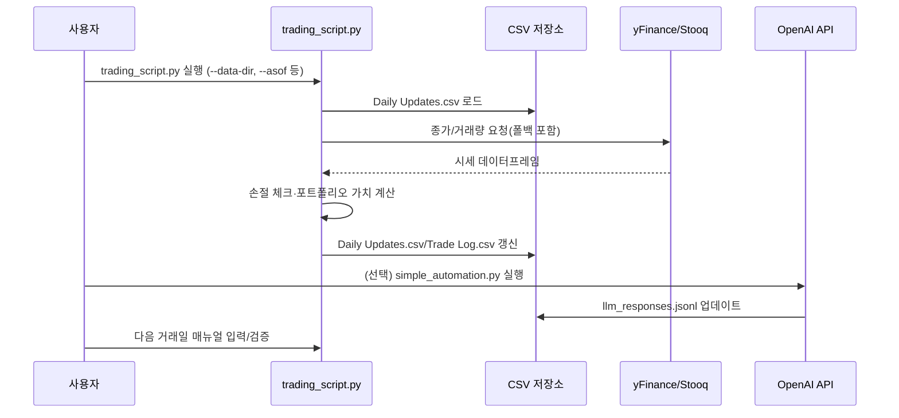

# ChatGPT Micro-Cap Experiment 기술 보고서 (Codex)

이 문서는 `source/ChatGPT-Micro-Cap-Experiment` 프로젝트를 기반으로 한 포괄적 기술 보고서이며, 기술/비기술 독자가 모두 이해할 수 있도록 상세한 분석과 실무 지침을 제공합니다.

## 1. 프로젝트 개요

### 1.1 프로젝트 목적
- 소형주(마이크로캡) 중심의 실거래 포트폴리오를 대형 언어 모델(LLM)로 운영하며, **AI가 실시간 데이터 기반으로 알파를 창출할 수 있는지** 검증합니다.
- 실제 일별 거래 데이터와 성과를 투명하게 공개하여 **데이터 중심의 실험 결과**를 공유합니다.

### 1.2 문제 정의 및 해결 전략
- **문제 정의**: 과대광고되는 AI 투자 솔루션과 달리, 공개·투명한 실험 데이터 없이 LLM 기반 운용 전략의 실효성을 검증하기 어렵습니다.
- **해결 전략**
  - `trading_script.py`를 통해 **일일 시세 수집·손절 매매·성과 집계**를 자동화.
  - `simple_automation.py`로 LLM에게 포트폴리오 현황을 전달하고 **구조화된 JSON 추천**을 받음.
  - `Generate Graph.py`로 ChatGPT 포트폴리오와 S&P 500을 비교 시각화하여 성과를 추적.

### 1.3 핵심 기능
| 기능 | 설명 |
| --- | --- |
| 시세 수집 파이프라인 | yFinance 1차, pandas-datareader·Stooq CSV 2차 → 실패 시 지수 프록시로 재시도하는 4단계 강건화 로직 |
| 자동 손절·현금 관리 | 종가·저가 데이터를 활용해 손절 조건을 평가하고 현금/포트폴리오 CSV 동기화 |
| LLM 기반 의사결정 | OpenAI API를 활용해 JSON 응답만 허용하는 프롬프트로 신뢰성 높은 의사결정 흐름 유지 |
| 실험 템플릿 제공 | `Start Your Own/` 디렉토리로 누구나 동일 실험을 복제 실행 가능 |
| 성과 모니터링 | `Daily Updates.csv`, `Trade Log.csv`와 Matplotlib 기반 성과 그래프 생성 |
| 문서화 에셋 | 주간 심층 리포트(MD/PDF), Q&A, 프롬프트 이력 등 레퍼런스 아카이브 |

### 1.4 대상 사용자 및 주요 사용 사례
- **개인 투자자**: 소형주 전략을 실험하거나 AI 트레이딩 워크플로를 학습하려는 사용자.
- **데이터 과학자/리서처**: LLM 기반 투자 워크플로를 분석해 모델 과적합·데이터 품질을 연구하려는 인원.
- **커뮤니티 기여자**: 자동화, 백테스트, 브로커 연동 등 고도화 기능을 개발하고 싶은 오픈소스 기여자.

## 2. 기술 아키텍처

### 2.1 고수준 시스템 다이어그램
```mermaid
graph TD
    subgraph Core Engine
        TS[trading_script.py]
        SA[simple_automation.py]
        PP[Start Your Own/ProcessPortfolio.py]
        GG[Scripts and CSV Files/Generate Graph.py]
    end

    subgraph Data Layer
        DU[Daily Updates.csv]
        TL[Trade Log.csv]
        TP[tickers.json (옵션)]
        LR[llm_responses.jsonl]
    end

    subgraph External Services
        YF[yFinance API]
        ST[Stooq API & CSV]
        OA[OpenAI API]
    end

    TS -->|일일 시세/성과| DU
    TS -->|거래 기록| TL
    TS -->|벤치마크 로드| TP
    TS -->|yfinance 요청| YF
    TS -->|Fallback| ST
    PP -->|데이터 디렉터리 설정| TS
    SA -->|포트폴리오 로드| DU
    SA -->|LLM 추천 저장| LR
    SA -->|프롬프트/응답| OA
    GG -->|성과 그래프| DU
```

### 2.2 기술 스택 및 주요 의존성
- **언어/런타임**: Python 3.11+
- **데이터 처리**: pandas 2.2.2, numpy 2.3.2
- **시장 데이터**: yfinance 0.2.65, pandas-datareader (선택), Stooq CSV
- **시각화**: matplotlib 3.8.4
- **LLM 연동**: openai (옵션)
- **자동화/유틸**: Makefile, 가상환경(venv)

### 2.3 주요 설계 패턴 및 아키텍처 결정
- **다단계 폴백 전략**: `download_price_data()`는 ① yFinance → ② pandas-datareader(Stooq) → ③ Stooq CSV → ④ 지수 프록시 순으로 시세를 확보해 빈 데이터프레임을 최소화합니다.
- **Stateful CSV 저장소**: 정형 데이터베이스 대신 CSV를 사용하여 버전 호환성과 사용자 접근성을 확보했습니다.
- **인터랙티브 CLI**: `process_portfolio()`는 사용자 입력 기반으로 매수/매도/스톱로스를 수동 조정할 수 있도록 설계되었습니다.
- **LLM 응답 검증**: JSON 포맷을 강제하고 `parse_llm_response()`로 구조화된 응답만 허용해 런타임 오류를 방지합니다.
- **AS-OF 날짜 재현성**: `ASOF_DATE` 전역 및 CLI 옵션을 통해 특정 거래일을 재연(백테스트)할 수 있게 했습니다.

### 2.4 구성 요소 상호작용 및 데이터 흐름


### 2.5 데이터 파이프라인 및 상호작용
- `Daily Updates.csv`: 일자별 포트폴리오 스냅샷(각 종목 행 + TOTAL 합산) 저장.
- `Trade Log.csv`: 자동 손절 및 수동 거래 내역 기록.
- `llm_responses.jsonl`: LLM 호출 이력, 원본 응답 보존.
- `Results.png`: `Generate Graph.py` 실행 시 ChatGPT vs S&P 500 비교 그래프를 프로젝트 루트에 저장.

## 3. 프로젝트 구조

### 3.1 디렉토리별 설명
| 경로 | 설명 |
| --- | --- |
| `Experiment Details/` | 프롬프트, Q&A, 딥 리서치 인덱스 등 실험 맥락 자료 보관 |
| `Scripts and CSV Files/` | 실거래에서 생성된 원본 CSV 및 헬퍼 스크립트(그래프, 래퍼) |
| `Start Your Own/` | 템플릿 CSV와 래퍼 스크립트로, 새로운 실험 인스턴스 구축용 |
| `Weekly Deep Research (MD|PDF)/` | 주간 심층 분석 리포트의 마크다운·PDF 버전 |
| `Other/` | 자동화 가이드, 기여 안내, 라이선스 등 운영 문서 |
| `trading_script.py` | 코어 트레이딩 엔진: 데이터 수집, 손절, 리포팅 |
| `simple_automation.py` | LLM 기반 자동 추천 생성 및 검증 스크립트 |
| `Makefile` | 가상환경, 의존성 설치, 주요 스크립트 실행 단축 명령 |

### 3.2 파일 구성 근거
- 운영 데이터(CSV)와 템플릿을 분리해 **원본 실험 기록**과 **신규 실험 템플릿**을 명확히 구분.
- `Other/`에 거버넌스 문서를 모아 커뮤니티 기여 접근성을 높임.
- 대용량 PDF 리포트를 별도 디렉토리에 둬 소스 코드와 실험 문서를 분리 보관.

### 3.3 프로젝트 계층 구조 다이어그램
```mermaid
graph TD
    root((ChatGPT Micro-Cap Experiment))
    root --> src[trading_script.py]
    root --> auto[simple_automation.py]
    root --> mfile[Makefile]
    root --> exp[Experiment Details/]
    root --> scripts[Scripts and CSV Files/]
    root --> start[Start Your Own/]
    root --> weekly_md[Weekly Deep Research (MD)/]
    root --> weekly_pdf[Weekly Deep Research (PDF)/]
    root --> other[Other/]
    scripts --> csv1[Daily Updates.csv]
    scripts --> csv2[Trade Log.csv]
    scripts --> helper1[ProcessPortfolio.py]
    scripts --> helper2[Generate Graph.py]
    start --> template_csv[Template CSV]
    start --> template_helper[README + Wrapper]
    other --> docs[CONTRIBUTING, CODE_OF_CONDUCT, License]
```

## 4. 설치 및 설정

### 4.1 전제 조건 및 시스템 요구사항
- Python 3.11 이상
- macOS/Linux/Windows (인터넷 연결 필요)
- SSH나 HTTPS를 통한 저장소 클론 권한
- 선택: OpenAI API Key, pandas-datareader 설치(자동 설치되지 않음)

### 4.2 단계별 설치 가이드
1. **저장소 클론**
   ```bash
   git clone https://github.com/.../ChatGPT-Micro-Cap-Experiment.git
   cd ChatGPT-Micro-Cap-Experiment
   ```
2. **가상환경 생성 및 활성화**
   ```bash
   python -m venv venv
   source venv/bin/activate  # Windows: venv\Scripts\activate
   ```
3. **필수 패키지 설치**
   ```bash
   pip install -r requirements.txt
   pip install openai pandas-datareader  # 필요 시
   ```
4. **(선택) Makefile 활용**
   ```bash
   make setup    # venv + requirements 설치
   make trade ARGS='--data-dir "Scripts and CSV Files"'
   ```

### 4.3 구성 지침
- `--data-dir`: `Scripts and CSV Files`(실험 데이터) 또는 `Start Your Own`(개인 실험) 중 하나 선택.
- `--starting-equity`: 최초 실행 시 초기 현금을 CLI 입력 대신 명령행으로 지정 가능.
- `ASOF_DATE` 환경 변수 또는 `--asof` CLI 인자 사용 시 특정 거래일로 재현 실행.
  ```bash
  ASOF_DATE=2025-09-30 python trading_script.py --data-dir "Start Your Own"
  ```
- `tickers.json`: 벤치마크 지수를 커스터마이징하려면 `{"benchmarks": ["IWO", ...]}` 형식으로 저장.
- `OPENAI_API_KEY`: 자동화 스크립트를 사용할 경우 반드시 환경 변수로 설정.

### 4.4 일반적인 문제 해결
| 상황 | 해결 방법 |
| --- | --- |
| `pandas_datareader` 미설치 | `pip install pandas-datareader` 후 재시도 |
| CSV 없음 오류 | `--data-dir` 경로가 올바른지 확인하고 `Start Your Own/ProcessPortfolio.py`로 초기 CSV 생성 |
| yFinance 응답이 빈 DataFrame | 자동으로 Stooq로 폴백, 그래도 실패하면 네트워크/티커 존재 여부 점검 |
| LLM 응답 JSON 파싱 실패 | 모델 온도 조정, 프롬프트 유지, `--dry-run`으로 원인 확인 후 재호출 |

## 5. 사용 가이드

### 5.1 기본 사용 예제
```bash
# 실험 원본 데이터로 거래일 처리
python trading_script.py --data-dir "Scripts and CSV Files"

# 템플릿 데이터로 개인 실험
python trading_script.py --data-dir "Start Your Own" --starting-equity 10000
```

실행 흐름:
1. 최근 거래일(주말엔 금요일) 기준 시세 수집.
2. 현재 포지션별 손절 조건 확인 후 자동 매도 기록.
3. CSV 최신화 및 일일 성과 요약 출력.

### 5.2 코드 스니펫 (프로그램 내 함수 활용)
```python
from trading_script import load_latest_portfolio_state, process_portfolio, daily_results

portfolio, cash = load_latest_portfolio_state(starting_equity_override=5000)
updated_portfolio, new_cash = process_portfolio(portfolio, cash, interactive=False)
daily_results(updated_portfolio, new_cash)
```

### 5.3 고급 기능
- **Manual Trade Logging**: CLI에서 `b/s/u` 입력으로 수동 매수·매도·스톱로스 변경.
- **LLM 자동화**: `simple_automation.py` 실행 시 현재 포트폴리오를 요약하여 JSON 추천을 생성.
- **성과 시각화**: `python "Scripts and CSV Files/Generate Graph.py"`로 ChatGPT vs S&P 500 그래프 자동 저장.
- **AS-OF 백테스트**: 특정 일자로 설정해 과거 데이터 재생산 가능.
- **벤치마크 커스터마이즈**: `tickers.json`으로 비교 지수 조정.

### 5.4 구성 옵션 요약
| 옵션 | 위치 | 설명 |
| --- | --- | --- |
| `--data-dir` | trading_script.py | 필수. CSV 위치 지정 |
| `--asof` | trading_script.py | 가상 기준일 (YYYY-MM-DD) |
| `--log-level` | trading_script.py | DEBUG~CRITICAL 로그 레벨 |
| `--starting-equity`, `-s` | trading_script.py | 초기 현금 |
| `ASOF_DATE` | 환경 변수 | 실행 시 전역 가상 날짜 |
| `OPENAI_API_KEY` | 환경 변수 | OpenAI 인증 키 |
| `--model` | simple_automation.py | LLM 모델 지정 (기본 `gpt-4`) |
| `--dry-run` | simple_automation.py | 추천 검증만 수행 |

### 5.5 API / 모듈 참조 (핵심 함수)
- `download_price_data(ticker, **kwargs)`: 가격 데이터프레임과 공급원 정보를 반환.
- `process_portfolio(portfolio_df, cash, interactive=True)`: 손절 평가·성과 집계 및 CSV 저장.
- `daily_results(portfolio_df, cash)`: 가격·수익률 테이블, Sharpe/Sortino, CAPM 메트릭 출력.
- `load_latest_portfolio_state(...)`: 최신 CSV 기반 포트폴리오/현금 상태 로드.
- `generate_trading_prompt(portfolio_df, cash, total_equity)`: LLM 프롬프트 텍스트 생성.

### 5.6 명령줄 인터페이스 참고
```text
usage: trading_script.py [--data-dir PATH] [--asof YYYY-MM-DD]
                         [--log-level LEVEL] [--starting-equity AMOUNT]
```
`Start Your Own/ProcessPortfolio.py`는 `--data-dir` 없이 실행해도 `Start Your Own/`을 자동 사용합니다.

## 6. 개발 지침

### 6.1 개발 환경 설정
- `venv` + `pip install -r requirements.txt`로 기본 환경 구축.
- 개발 편의를 위해 VS Code 또는 PyCharm에서 **인터프리터를 가상환경으로 지정**.
- 프로젝트 루트에서 `make setup`으로 한 번에 의존성 설치 가능.

### 6.2 코드 스타일 및 규칙
- PEP 8, 타입 힌트 사용(핵심 함수 다수에 타입 주석 적용).
- 로거(`logging`) 이용 시 `--log-level` 옵션으로 제어 가능.
- 숫자 파싱(`parse_starting_equity`) 등 사용자 입력은 방어적으로 처리되어야 하며, 동일 기준을 유지합니다.

### 6.3 테스트 절차 및 커버리지
- 현재 자동화된 테스트는 포함되어 있지 않습니다. 신규 기능 추가 시 다음을 권장합니다.
  - yFinance 호출을 `pytest` + `responses` 기반으로 모킹하여 폴백 로직 검증.
  - CSV 읽기/쓰기 로직을 임시 디렉토리에서 단위 테스트.
  - 시계열 메트릭 계산(Sharpe/Sortino, CAPM)을 고정 데이터셋으로 회귀 테스트.
- `Start Your Own/` 템플릿을 활용해 수동 시나리오 테스트를 병행하십시오.

### 6.4 기여 가이드라인
- `Other/CONTRIBUTING.md`와 `Other/CODE_OF_CONDUCT.md`를 준수합니다.
- 이슈 해결 시 PR 본문에 `Fixes #이슈번호`를 포함해 자동 클로즈를 유도합니다.
- 대규모 데이터 첨부나 민감 정보는 포함하지 않으며, API 키는 절대 커밋하지 않습니다.

## 7. 추가 정보

### 7.1 성능 고려사항
- 시세 다운로드는 네트워크 왕복 시간이 지배적이므로 **틱커 수를 최소화**하거나 캐싱 전략을 고려할 수 있습니다.
- Matplotlib 그래프 생성 시 대량 데이터에서는 렌더링 시간이 증가하므로 필요 시 리샘플링/다운샘플링을 적용하십시오.
- CSV 파일은 누적 크기가 증가하면 I/O가 느려질 수 있으므로 주기적으로 보관 정책을 검토합니다.

### 7.2 보안 고려사항
- API 키(OpenAI)는 환경 변수로만 관리하고, `.env` 파일 사용 시 `.gitignore`에 포함합니다.
- 외부 API 호출 실패 시 예외 메시지에 민감 정보(키, 경로)가 노출되지 않도록 로깅 레벨을 조정합니다.
- 자동 매매를 실제 브로커에 연동할 경우, 추가 인증(2FA) 및 주문 검증 계층을 별도로 설계해야 합니다.

### 7.3 프로젝트 로드맵 및 향후 계획 (제안)
1. **실거래 브로커 연동**: Alpaca, Interactive Brokers 등 API 브로커 지원.
2. **전략 백테스트 모듈**: `ASOF_DATE` 기반 시뮬레이션을 자동화하는 백테스트 래퍼 추가.
3. **모델 다변화**: OpenAI 외 Grok, Claude 등 LLM을 비교 평가할 수 있는 어댑터 구조 확장.
4. **자동화 고도화**: `simple_automation.py`에서 실제 `log_manual_buy/sell` 호출을 통합하여 완전 자동 실행 지원.

### 7.4 라이선스 및 저작권
- `Other/License.txt`에 명시된 바와 같이 **MIT License**를 따릅니다.
- (c) 2025 Nathan Smith. 사용자는 라이선스 조건 하에서 소프트웨어를 자유롭게 이용·복제·수정·배포할 수 있습니다.

---

본 보고서는 `source/ChatGPT-Micro-Cap-Experiment` 코드 및 문서를 기반으로 작성되었으며, 필요한 경우 합리적 추론을 통해 누락된 정보를 보완했습니다. 최신 변경 사항과 차이가 있을 수 있으므로, 운영 시점에 맞춰 스크립트와 데이터를 확인하시기 바랍니다.
