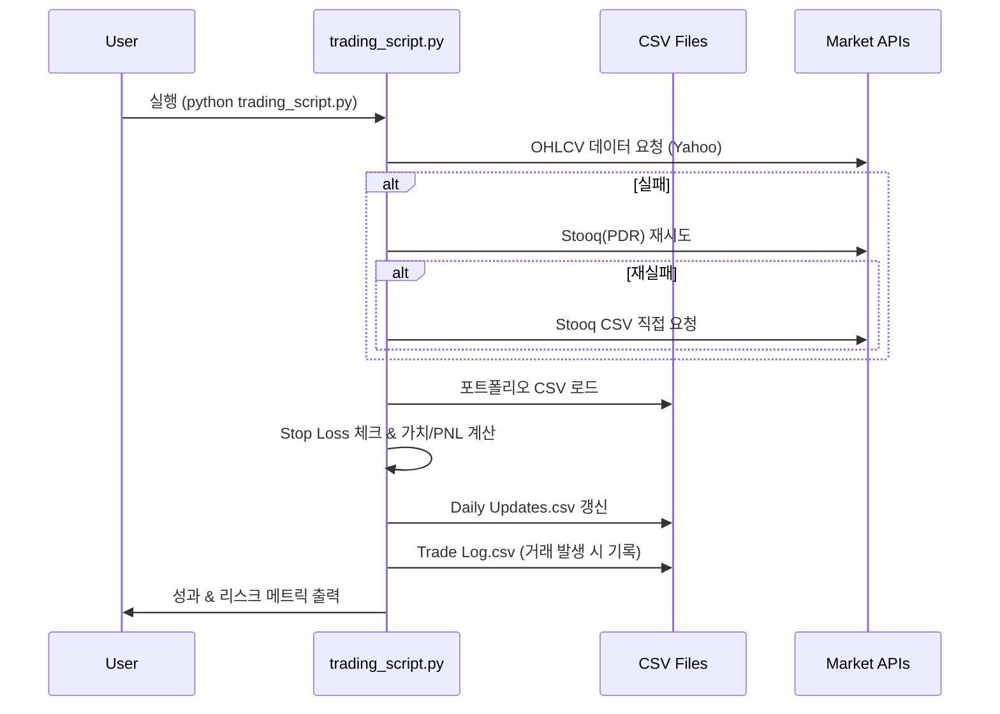
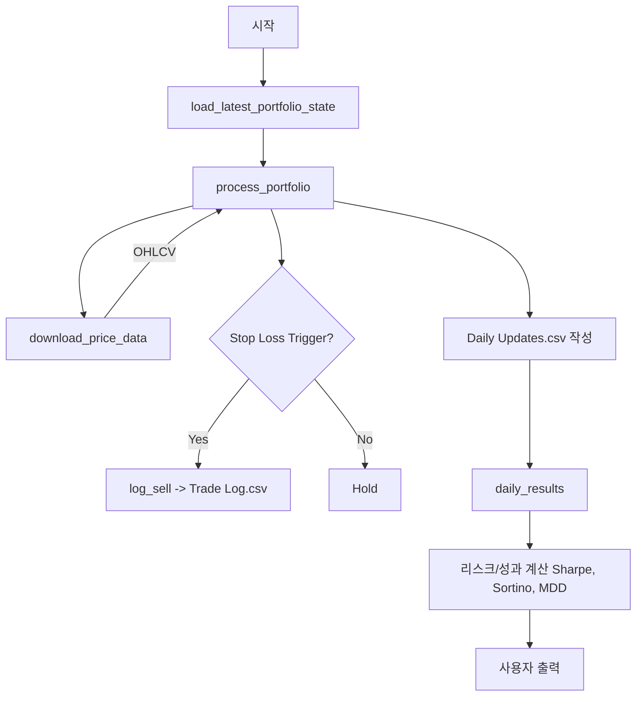
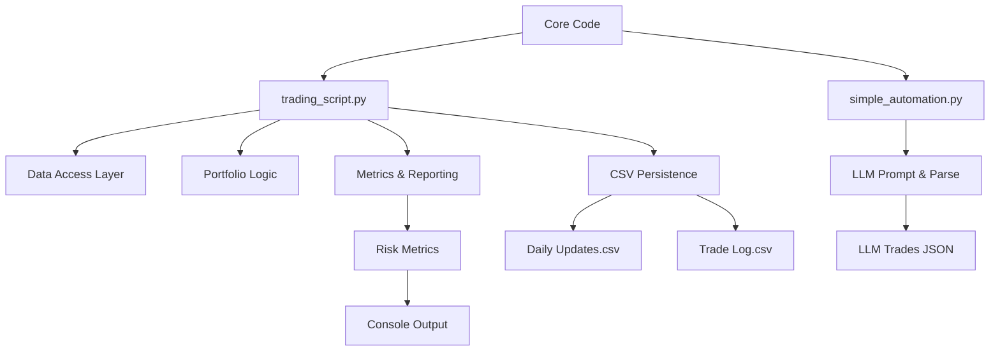
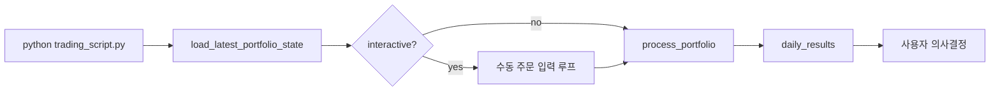

# ChatGPT Micro-Cap Experiment 포괄 문서 (Copilot GPT-5 Edition)

> 본 문서는 `source/ChatGPT-Micro-Cap-Experiment` 디렉토리의 코드와 자료를 분석하여 프로젝트 목적, 아키텍처, 구조, 설치, 사용, 개발 및 향후 계획을 종합적으로 정리한 기술/비기술 사용자 겸용 레퍼런스입니다.

---
## 1. 프로젝트 개요
### 1.1 목적
ChatGPT Micro-Cap Experiment는 **소형주(micro-cap) 실거래 포트폴리오를 LLM(ChatGPT) 의사결정으로 6개월간 운용**하여, 대형언어모델이 제한된 실시간/준실시간 정보와 룰 기반 리스크 관리 하에 실제 알파를 창출할 수 있는지 검증하는 공개 실험입니다.

### 1.2 문제 정의
- 기존 AI 주식 추천 서비스는 불투명성과 과장된 수익률을 내세우는 경우가 많음.
- LLM이 구조화되지 않은 텍스트/프롬프트 기반 의사결정으로 실계좌 운용에서 **일관된 리스크 관리·성과 개선**이 가능한지 검증 필요.
- 초저자본(예: $100 시작) + 공개 데이터 + 명확한 룰로 재현성과 투명성 확보.

### 1.3 해결 접근
- `trading_script.py` 중심의 **표준화된 데이터 수집 계층(Yahoo Finance → Stooq 다중 폴백)** 구축.
- 일별 포트폴리오 상태/거래 로그 CSV 기록으로 **감사 추적성(Auditability)** 확보.
- `simple_automation.py`가 LLM에게 현재 상태를 JSON 포맷으로 설명·요청하여 **구조화된 매수/매도/보유 의사결정**을 획득.
- Stop Loss 기반 자동 청산 및 수동/반자동 MOO(시장가 시가), LIMIT 주문 지원.

### 1.4 핵심 기능 요약
| 기능 | 설명 | 주요 구현 위치 |
|------|------|----------------|
| 다중 데이터 소스 폴백 | Yahoo 실패 시 Stooq(PDR→CSV) 시도 후 지수 Proxy | `download_price_data` |
| 주말 안전 날짜 처리 | 토/일 실행 시 최근 거래일(금요일)로 매핑 | `last_trading_date`, `trading_day_window` |
| 포트폴리오 처리 및 Stop Loss 실행 | 일일 평가/손절 체결 후 CSV 업데이트 | `process_portfolio` |
| 거래 로그 / 포트폴리오 히스토리 | `Trade Log.csv`, `Daily Updates.csv` 관리 | `log_manual_buy`, `log_manual_sell`, `log_sell` |
| LLM 자동화 프롬프트 생성 | 현 포트폴리오/현금 상태 → JSON 응답 기대 | `generate_trading_prompt` (in `simple_automation.py`) |
| LLM 응답 파싱 및 트레이드 시뮬레이션 | JSON 추출 실패 대비 정규식+예외 처리 | `parse_llm_response`, `execute_automated_trades` |
| 위험/성과 지표 산출 | Sharpe, Sortino, MDD, Beta, Alpha | `daily_results` |
| AS-OF 백테스트 모드 | 특정 날짜를 ‘오늘’로 처리 | `set_asof`, `ASOF_DATE` |

### 1.5 대상 사용자
- 개인 투자자 / 퀀트 입문자: LLM을 실거래 실험에 적용하는 프레임워크 학습.
- 연구자: LLM 기반 의사결정·리스크 통제 결합 사례.
- 오픈소스 기여자: 구조 개선, 추가 전략, 백테스트 모듈 확장.

### 1.6 사용 사례
1. 일일 포트폴리오 평가 및 손실 제한 자동화.
2. LLM이 제안하는 신규 매수 종목/포지션 비중 검토.
3. ASOF_DATE 지정 후 과거 특정 일자 상황 재현(간이 백테스트/리플레이).
4. 성과 지표(Sharpe, Sortino, Drawdown, Beta) 자동 집계 후 모델 개선 피드백.

---
## 2. 기술 아키텍처
### 2.1 고수준 시스템 다이어그램
```mermaid
flowchart LR
    subgraph User
        U1[수동 인터랙션 CLI]
        U2[LLM API Key]
    end

    subgraph Core[Core Engine]
        TS[trading_script.py]\n(데이터 수집+평가+손절)
        SA[simple_automation.py]\n(LLM 프롬프트/파싱)
    end

    subgraph Data[Data Layer]
        CSV1[Daily Updates.csv]
        CSV2[Trade Log.csv]
        CFG[tickers.json (옵션)]
    end

    subgraph External[외부 소스]
        YF[Yahoo Finance]
        STQ[Stooq]
        LLM[OpenAI ChatGPT]
    end

    U1 --> TS
    U1 --> SA
    SA --> LLM
    TS --> YF
    TS --> STQ
    TS --> CSV1
    TS --> CSV2
    SA --> CSV1
    SA --> CSV2
    CFG --> TS

    LLM --> SA
```

### 2.2 기술 스택
| 분류 | 사용 기술 |
|------|-----------|
| 언어 | Python 3.11+ |
| 데이터 처리 | pandas, numpy |
| 시계열/시장 데이터 | yfinance, pandas_datareader (Stooq) |
| 시각화 | matplotlib (성과 그래프) |
| LLM 연동 | openai (선택적) |
| 파일 저장 | CSV (포트폴리오/거래 로그) |

### 2.3 주요 종속성 및 역할
| 패키지 | 역할 |
|--------|------|
| yfinance | 기본 OHLCV 데이터 다운로드 |
| pandas_datareader | Stooq 대체 경로(2차 폴백) |
| requests | Stooq CSV 직접 요청(3차 폴백) |
| openai | LLM 호출 (자동 의사결정) |
| numpy/pandas | 계산, 데이터 프레임 처리 |
| logging | 실행 로깅 및 문제 추적 |

### 2.4 디자인 패턴 및 구조적 선택
- **레이어드 구조**: 데이터 접근(`download_price_data`) / 포트폴리오 로직(`process_portfolio`) / 리포팅(`daily_results`) 분리.
- **폴백 체인(Fallback Chain)**: Yahoo → Stooq(PDR) → Stooq(CSV) → Proxy 지수 (견고성 향상).
- **Idempotent CSV Append**: 동일 날짜 중복 제거 후 재기록.
- **함수형 유틸 + 최소 클래스**: `@dataclass FetchResult`만 사용하여 단순성 유지.

### 2.5 아키텍처 결정사항(ADR 요약)
| 결정 | 배경 | 대안 | 영향 |
|------|------|------|------|
| CSV 기반 상태 저장 | 쉬운 diff/버전관리, 투명성 | SQLite/Parquet | 단순하지만 대용량 비효율 가능 |
| 다중 데이터 폴백 구현 | 시장 API 불안정성 대응 | 단일 소스(yfinance) | 복잡도 증가 vs 신뢰성 향상 |
| LLM JSON 포맷 강제 | 파싱 안정성 | 자유 텍스트 후 후처리 | 실패율 감소, 엄격성 필요 |
| Stop Loss 내장 처리 | 리스크 자동화 | 외부 OMS 연동 | 간단한 규칙 기반, 슬리피지 미반영 |
| ASOF_DATE 지원 | 백테스트/리플레이 용이 | 별도 백테스터 구현 | 빠른 과거 상황 재현 가능 |

### 2.6 컴포넌트 상호작용 시퀀스 (일일 실행)


### 2.7 데이터 흐름


---
## 3. 프로젝트 구조
```text
source/ChatGPT-Micro-Cap-Experiment/
├── trading_script.py          # 핵심 엔진: 데이터 접근/평가/리포팅
├── simple_automation.py       # LLM 자동화 프롬프트 & 응답 처리
├── requirements.txt           # 최소 의존성
├── Makefile                   # (있다면) 실행 편의 (현재 미분석: 향후 확장)
├── Scripts and CSV Files/     # 실제 실험용 CSV 및 그래프 스크립트
├── Start Your Own/            # 템플릿 데이터/가이드 (개인 실험 시작용)
├── Experiment Details/        # 방법론, 프롬프트, 질의응답, 과거 대화 기록
├── Weekly Deep Research (MD|PDF)/  # 주간 심층 리서치 결과
├── Other/                     # 라이선스, 기여규칙, 자동화 README 등
└── Results.png                # 현 성과 시각화
```

### 3.1 디렉토리별 설명
| 디렉토리 | 역할 |
|----------|------|
| root | 메인 실행 스크립트 및 환경 의존성 선언 |
| Scripts and CSV Files | 실험 실시간 데이터 산출(운용 중) 원본 저장소 |
| Start Your Own | 재현 및 개인 실험 커스텀 시작 템플릿 제공 |
| Experiment Details | 프로젝트 메타 문서(Disclaimer, Prompts, Q&A 등) |
| Weekly Deep Research | LLM이 수행한 심층 분석 및 성과 요약 아카이브 |
| Other | 기여/라이선스/자동화 문서 및 부가 자산 |

### 3.2 구조 설계 근거
- 실행/자동화 코드와 데이터 산출물(CSV) 분리: 명확한 책임 경계.
- 템플릿(`Start Your Own`) 제공으로 온보딩 비용 최소화.
- 연구 산출물(Weekly Deep Research) 분리하여 의사결정 로그와 분석 아카이브 명확화.

### 3.3 프로젝트 계층 구조 다이어그램


---
## 4. 설치 및 설정
### 4.1 전제 조건
- Python 3.11 이상
- 인터넷 연결 (시세/LLM 호출)
- OpenAI API Key (자동화 기능 사용 시)

### 4.2 시스템 요구사항(대략)
| 항목 | 요구 |
|------|------|
| 디스크 | <50MB (CSV 누적에 따라 증가) |
| 메모리 | 기본 스크립트 0.5GB 미만 |
| 네트워크 | 안정적인 HTTPS (Yahoo/Stooq/OpenAI) |

### 4.3 설치 절차
```bash
# 1. 디렉토리 이동
cd source/ChatGPT-Micro-Cap-Experiment

# 2. 가상환경 권장
printf "python3 -m venv .venv\nsource .venv/bin/activate" > setup.sh
bash setup.sh

# 3. 의존성 설치
pip install -r requirements.txt
# openai 사용 시
pip install openai
```

### 4.4 구성 옵션
| 항목 | 방법 | 효과 |
|------|------|------|
| 데이터 디렉토리 | `--data-dir Start Your Own` | CSV 입출력 경로 변경 |
| ASOF_DATE | env `ASOF_DATE=YYYY-MM-DD` 또는 `--asof` | 과거 날짜 재현/백테스트 |
| 시작 자본 | `--starting-equity 1000` | 초기 Cash 설정 |
| 로그 레벨 | `--log-level INFO` | 실행 로깅 활성화 |

### 4.5 일반적 문제 해결(Troubleshooting)
| 증상 | 원인 | 해결 |
|------|------|------|
| 빈 데이터프레임 반환 | 해당 일자 휴장/티커 오류 | 티커 검증, 날짜 범위 조정 |
| Stooq 폴백 실패 | 패키지(pandas_datareader) 미설치 | `pip install pandas_datareader` 후 재실행 |
| OpenAI ImportError | openai 미설치 | `pip install openai` |
| JSON 파싱 실패 | LLM 출력 포맷 깨짐 | 프롬프트 재시도, `dry-run` 모드로 원문 검사 |
| Stop Loss 미작동 | CSV 형식 손상 | 백업 CSV 확인 후 구조 일치 재생성 |

### 4.6 업데이트 절차
1. 의존성 변경 시 `requirements.txt` 갱신
2. CSV 포맷 변경 시 기존 히스토리 변환 스크립트 추가 권장
3. 주요 함수 시그니처 변경 시 문서/LLM 프롬프트 동기화

---
## 5. 사용 가이드
### 5.1 기본 실행
```bash
python trading_script.py --data-dir "Scripts and CSV Files" --log-level INFO
```
실행 후 콘솔에 일일 가격/리스크/포트폴리오 스냅샷 출력 및 CSV 갱신.

### 5.2 수동 거래 (MOO/Limit)
실행 중 인터랙티브 프롬프트:
- b: 매수 (시장가 시가 또는 지정가)
- s: 매도
- u: Stop Loss 갱신

### 5.3 LLM 자동화
```bash
python simple_automation.py --api-key $OPENAI_API_KEY --model gpt-4 --dry-run
```
- `--dry-run` 제거 시 추천 트레이드 시뮬레이션 실행(현재 실제 체결 함수는 예시 수준).

### 5.4 ASOF 모드 (과거 날짜 재현)
```bash
ASOF_DATE=2025-07-15 python trading_script.py
# 또는
python trading_script.py --asof 2025-07-15
```

### 5.5 JSON 응답 예시 (LLM)
```json
{
  "analysis": "소형 기술주 모멘텀 완만. 변동성 확대 구간",
  "trades": [
    {"action": "buy", "ticker": "ABCD", "shares": 120, "price": 3.25, "stop_loss": 2.70, "reason": "매출 모멘텀 + 기술적 강세"}
  ],
  "confidence": 0.78
}
```

### 5.6 고급 기능
| 기능 | 설명 | 사용 |
|------|------|------|
| 다중 Benchmark 분석 | Alpha/Beta/R² 출력 | 자동 (`daily_results`) |
| Drawdown 추적 | 누적 최대/현재 낙폭 계산 | 자동 |
| 포트폴리오 리플레이 | ASOF_DATE로 재현 | `--asof` |
| 로그 확장 | INFO/DEBUG 설정 | `--log-level DEBUG` |

### 5.7 구성 옵션 상세
| 옵션 | 타입 | 기본 | 의미 |
|------|------|------|------|
| `--data-dir` | Path | script dir | CSV 위치 지정 |
| `--asof` | Date | None | 오늘 날짜 대체 |
| `--starting-equity` | 숫자 | 프롬프트 입력 | 초기 현금 |
| `--log-level` | Enum | None | 로깅 활성화 |
| `--dry-run` (automation) | Flag | False | 체결 시뮬레이션만 |

### 5.8 API 문서(스크립트 함수 주요 시그니처)
| 함수 | 입력 | 출력 | 설명 |
|------|------|------|------|
| `download_price_data(ticker, start, end, ...)` | 티커/날짜 | FetchResult(df, source) | 다중 폴백 OHLCV 다운로드 |
| `process_portfolio(portfolio_df, cash, interactive)` | DataFrame, float | (DataFrame, float) | Stop Loss 처리 + 평가 + CSV 기록 |
| `daily_results(portfolio_df, cash)` | DataFrame, float | None | 성과/리스크 요약 출력 |
| `generate_trading_prompt(portfolio_df, cash, equity)` | DF, 현금, 총자산 | str | LLM용 JSON 프롬프트 문자열 |
| `parse_llm_response(response)` | str | dict | JSON 파싱 + 오류 처리 |
| `execute_automated_trades(trades, portfolio_df, cash)` | list, DF, float | (DF, float) | LLM 추천 트레이드 시뮬레이션 |

### 5.9 CLI 흐름 다이어그램


---
## 6. 개발 지침
### 6.1 환경 설정
```bash
python -m venv .venv
source .venv/bin/activate
pip install -r requirements.txt
pip install openai pandas_datareader
```

### 6.2 코드 스타일 / 규칙
- PEP8 준수, 120 column 권장.
- 함수명은 동사+명사 (`download_price_data`).
- 사이드이펙트(파일쓰기)는 명확히 로깅.
- 예외 처리 시 사용자 친화적 메시지 + 로깅.

### 6.3 테스트 전략(제안)
| 범주 | 설명 |
|------|------|
| 단위 | 데이터 폴백 체인 / 날짜 계산 / JSON 파서 |
| 통합 | `process_portfolio` + CSV append 동작 |
| 회귀 | 성과 메트릭 계산(Sharpe 등) 변경 후 결과 비교 |
| 모킹 | yfinance/Stooq 네트워크 호출 모킹 |

샘플 pytest 스텁 제안:
```python
# tests/test_dates.py
from trading_script import last_trading_date
import datetime as dt

def test_weekend_mapping():
    sat = dt.datetime(2025, 10, 18)
    assert last_trading_date(sat).weekday() == 4  # Friday
```

### 6.4 기여 가이드라인 요약
- Issue 생성 → 논의 후 PR.
- 기능 추가 시 문서(README/보고서) 동기화.
- CSV 포맷 변경 시 마이그레이션 스크립트 포함.
- 로깅/에러 메시지 국제화 고려(한국어/영어 동시 지원 가능).

### 6.5 품질 체크리스트
- [ ] 데이터 폴백 정상 동작 여부
- [ ] Stop Loss 정확성 (저가 <= stop)
- [ ] CSV 중복 날짜 제거 확인
- [ ] LLM 파싱 실패시 우아한 오류 처리
- [ ] 성과 지표 NaN 발생 최소화

---
## 7. 추가 정보
### 7.1 성능 고려사항
- yfinance 호출 빈도 높을 경우 레이트리밋 가능 → 캐싱 계층(예: SQLite / Parquet) 고려.
- 폴백 체인 다단계 네트워크 요청 → 비동기화/병렬화 옵션 향후 확장.
- Drawdown/Sharpe 계산 시 대용량 CSV 처리 성능 → 컬럼 최소화 및 주기적 압축(Gzip).

### 7.2 보안 고려사항
| 항목 | 위험 | 완화 |
|------|------|------|
| API Key 노출 | 단순 CLI 인자/환경변수 | `.env` 사용 + gitignore |
| 외부 요청 실패 | 예외 미처리 -> 중단 | 3중 폴백 + empty DF 처리 |
| LLM 조작(prompt injection) | 악의적 JSON 변조 | 엄격한 정규식 JSON 추출 + 스키마 검증 확장 필요 |

### 7.3 로드맵 & 향후 계획 (제안)
| 단계 | 내용 |
|------|------|
| 단기 | 테스트 스위트 구축, OpenAI 응답 스키마 검증 추가 |
| 중기 | 백테스트 모듈(과거 범위 자동 반복), 전략 비교 리포트 생성 |
| 중장기 | 실시간 웹 대시보드(스트리밍), 다중 LLM 비교 실험 |
| 장기 | 강화학습/온체인 데이터 통합, 다중 자산 클래스 확장 |

### 7.4 라이선스 및 저작권
- 상위 원본 저장소 라이선스(MIT) 기반으로 보이며 `Other/License.txt`에 명시.
- 교육/실험 목적, 재사용 시 출처 표기 권장.

### 7.5 책임 한계(Disclaimer 요약)
- 투자 조언 아님. 실험적/교육적 목적.
- 실제 금전 손실 가능성 존재.

---
## 8. 결론
본 프레임워크는 **LLM 기반 정성적 의사결정**과 **정량적 리스크 관리(Stop Loss, 성과 메트릭)** 를 결합하여 투명한 소형주 실험을 가능하게 합니다. 구조화된 CSV 감사 기록, 다중 데이터 폴백, AS-OF 재현 기능을 통해 재현성과 견고성을 확보했으며 향후 백테스트/비동기화/스키마 검증 및 멀티 모델 비교 확장이 유망합니다.

---
## 9. 부록: 빠른 참조
| 작업 | 명령 |
|------|------|
| 기본 실행 | `python trading_script.py` |
| ASOF 재현 | `python trading_script.py --asof 2025-07-15` |
| 자동화 Dry-Run | `python simple_automation.py --api-key $OPENAI_API_KEY --dry-run` |
| 종속성 설치 | `pip install -r requirements.txt` |

---
문서 개선 제안이나 오류 발견 시 PR 또는 Issue 생성 바랍니다.
