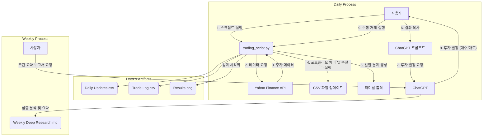
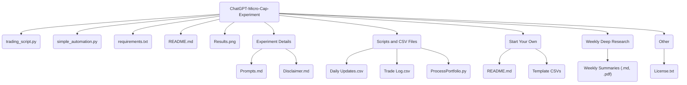

# ChatGPT Micro-Cap Experiment 분석 보고서

## 1. 프로젝트 개요

### 1.1. 프로젝트의 목적과 기능

이 프로젝트는 **ChatGPT와 같은 대규모 언어 모델(LLM)이 실제 돈으로 마이크로캡 주식 포트폴리오를 관리하여 시장 수익률을 초과(알파 생성)할 수 있는지**를 검증하기 위한 6개월간의 라이브 트레이딩 실험입니다. 100달러의 소액으로 시작하여, 매일 ChatGPT에 포트폴리오 현황과 시장 데이터를 제공하고, 그 결정에 따라 실제로 주식을 거래합니다. 프로젝트의 모든 과정, 데이터, 프롬프트, 결과는 투명하게 공개되어 커뮤니티가 실험을 검토하고 재현할 수 있도록 합니다.

### 1.2. 문제 정의 및 해결 방법

**문제 정의:** AI를 활용한 투자 광고는 많지만, 실제로 AI, 특히 ChatGPT와 같은 범용 LLM이 최소한의 인간 개입으로 유의미한 투자 성과를 낼 수 있는지에 대한 투명하고 검증 가능한 공개 실험은 드뭅니다.

**해결 방법:** 이 프로젝트는 다음과 같은 방법으로 이 문제를 해결합니다.
1.  **실제 자금 운용:** 모의 투자가 아닌 실제 100달러를 사용하여 실험의 현실성을 높입니다.
2.  **투명성:** 모든 거래 내역(`Trade Log.csv`), 일일 포트폴리오 현황(`Daily Updates.csv`), ChatGPT와의 대화 내용, 사용된 프롬프트(`Prompts.md`)를 GitHub에 공개합니다.
3.  **자동화 및 재현성:** 포트폴리오 처리, 성과 분석, 결과 시각화를 위한 Python 스크립트(`trading_script.py`, `ProcessPortfolio.py`)를 제공하여 누구나 동일한 방식으로 데이터를 분석하거나 자신만의 실험을 시작할 수 있도록 지원합니다.

### 1.3. 핵심 기능

*   **LLM 기반 의사결정:** ChatGPT가 포트폴리오 구성(매수, 매도, 보유)에 대한 모든 결정을 내립니다.
*   **자동화된 데이터 처리:** `trading_script.py`는 `yfinance`를 통해 최신 주가를 가져오고, 지정된 손절 라인(stop-loss)을 자동으로 실행하며, 일일 포트폴리오 상태를 CSV 파일에 기록합니다.
*   **성과 추적 및 분석:** 일일 수익률, 누적 수익률, 최대 낙폭(MDD), 샤프 지수, 소르티노 지수 등 다양한 성과 지표를 계산하고 S&P 500과 같은 벤치마크와 성과를 비교합니다.
*   **시각화:** `matplotlib`을 사용하여 포트폴리오의 누적 수익률을 벤치마크와 비교하는 그래프(`Results.png`)를 생성합니다.
*   **재현성:** `Start Your Own` 디렉토리에 템플릿 파일과 가이드를 제공하여 다른 사용자들이 자신만의 유사한 실험을 쉽게 시작할 수 있도록 합니다.

### 1.4. 대상 사용자 및 사용 사례

*   **금융 기술 연구자/학생:** LLM을 금융 시장에 적용하는 실제 사례를 연구하고 분석하고자 하는 사람들.
*   **개인 투자자 및 개발자:** AI 기반 트레이딩에 관심이 있고, 투명한 실험 과정을 통해 아이디어를 얻거나 직접 실험을 재현해보고 싶은 사람들.
*   **데이터 과학자:** 실제 금융 데이터를 바탕으로 포트폴리오 분석, 성과 측정, 자동화 스크립트 작성 기술을 학습하고 싶은 사람들.

**사용 사례:**

*   실험 결과를 추적하며 LLM의 투자 결정 패턴을 분석.
*   `Start Your Own` 템플릿을 사용하여 자신만의 AI 트레이딩 봇 실험 시작.
*   `trading_script.py`를 수정하여 자신만의 거래 규칙이나 데이터 소스를 추가.
*   `Experiment Details`의 프롬프트를 참고하여 LLM을 금융 작업에 활용하는 방법 연구.

## 2. 기술 아키텍처

### 2.1. 고수준 시스템 아키텍처 (실험 워크플로우)

이 프로젝트는 소프트웨어 시스템이라기보다는 인간과 AI, 그리고 자동화 스크립트가 결합된 **실험 워크플로우**에 가깝습니다.



**워크플로우 설명:**
1.  사용자가 매일 `trading_script.py`를 실행합니다.
2.  스크립트는 `yfinance`를 통해 포트폴리오에 포함된 주식과 벤치마크의 최신 가격 정보를 가져옵니다.
3.  스크립트는 미리 설정된 손절 라인을 확인하고, 가격이 도달했을 경우 자동으로 매도 거래를 기록합니다.
4.  모든 거래와 일일 포트폴리오 현황은 `Daily Updates.csv`와 `Trade Log.csv`에 기록됩니다.
5.  스크립트는 포트폴리오의 현재 상태, 성과 지표 등을 포함한 일일 리포트를 터미널에 출력합니다.
6.  사용자는 이 리포트를 복사하여 미리 정의된 프롬프트와 함께 ChatGPT에 입력합니다.
7.  ChatGPT는 제공된 정보를 바탕으로 새로운 매수/매도 주문 등 투자 결정을 내립니다.
8.  사용자는 ChatGPT의 결정을 `trading_script.py`의 대화형 인터페이스에 수동으로 입력하여 거래를 기록합니다.

### 2.2. 기술 스택 및 종속성

*   **프로그래밍 언어:** Python 3.11+
*   **핵심 라이브러리:**
    *   `pandas`: 데이터 조작 및 CSV 파일 처리
    *   `yfinance`: Yahoo Finance에서 주식 시장 데이터 수집
    *   `numpy`: 수치 계산
    *   `matplotlib`: 성과 그래프 시각화
*   **AI 모델:** ChatGPT (실험의 핵심 의사결정자)
*   **종속성 관리:** `requirements.txt`

### 2.3. 디자인 패턴 및 아키텍처 결정사항

*   **인간-루프(Human-in-the-Loop):** 전체 프로세스는 완전 자동화가 아닌, 사용자가 스크립트 실행, ChatGPT와의 상호작용, 거래 입력을 담당하는 인간-루프 시스템입니다. 이는 API 비용을 절감하고, LLM의 출력을 수동으로 검증하는 역할을 합니다. (`simple_automation.py`는 OpenAI API를 이용한 자동화 예시를 제공합니다.)
*   **파일 기반 데이터 저장:** 모든 거래 기록과 포트폴리오 상태는 복잡한 데이터베이스 대신 간단한 CSV 파일을 사용하여 저장됩니다. 이는 설정이 간편하고, 데이터를 쉽게 확인하고 수정할 수 있으며, 버전 관리가 용이하다는 장점이 있습니다.
*   **모듈식 스크립트:** 핵심 로직은 `trading_script.py`에 중앙화되어 있고, `ProcessPortfolio.py`와 같은 래퍼(wrapper) 스크립트를 통해 특정 디렉토리의 데이터로 실행될 수 있도록 구조화되어 있습니다. 이를 통해 `Scripts and CSV Files`의 실제 실험 데이터와 `Start Your Own`의 템플릿 데이터에 동일한 로직을 재사용할 수 있습니다.

## 3. 프로젝트 구조

### 3.1. 디렉토리별 설명

*   `/ (root)`: `README.md`, `trading_script.py` 등 핵심 파일과 스크립트가 위치합니다.
*   `Experiment Details/`: 실험 방법론, ChatGPT에 사용된 프롬프트, Q&A 등 실험의 설계와 관련된 문서들이 있습니다.
*   `Other/`: 라이선스, 기여 가이드 등 프로젝트의 보조적인 문서들이 있습니다.
*   `Scripts and CSV Files/`: 실제 운영 중인 실험의 일일 포트폴리오 데이터(`Daily Updates.csv`)와 거래 기록(`Trade Log.csv`)이 저장됩니다.
*   `Start Your Own/`: 사용자가 자신만의 실험을 시작할 수 있도록 템플릿 CSV 파일과 가이드(`README.md`)를 제공합니다.
*   `Weekly Deep Research (MD|PDF)/`: ChatGPT가 생성한 주간 심층 분석 리포트가 마크다운 및 PDF 형식으로 저장됩니다.

### 3.2. 프로젝트 계층 구조 다이어그램



## 4. 설치 및 설정

### 4.1. 전제 조건 및 시스템 요구사항

*   **Python:** 3.11 이상
*   **운영체제:** Windows, macOS, Linux
*   **저장 공간:** 약 10MB (CSV 데이터 파일용)
*   **인터넷 연결:** `yfinance`를 통해 시장 데이터를 다운로드하기 위해 필요합니다.

### 4.2. 단계별 설치 가이드

1.  **프로젝트 클론:**
    ```bash
    git clone https://github.com/LuckyOne7777/ChatGPT-Micro-Cap-Experiment.git
    cd ChatGPT-Micro-Cap-Experiment
    ```

2.  **가상 환경 생성 (권장):**
    ```bash
    python -m venv venv
    source venv/bin/activate  # macOS/Linux
    # venv\Scripts\activate    # Windows
    ```

3.  **종속성 설치:**
    ```bash
    pip install -r requirements.txt
    ```

4.  **자신만의 실험 시작하기 (선택 사항):**
    *   `Start Your Own` 디렉토리로 이동합니다.
    *   `Daily Updates.csv`와 `Trade Log.csv`를 초기화합니다.
    *   `ProcessPortfolio.py`를 실행하여 실험을 시작합니다.
    *   자세한 내용은 `Start Your Own/README.md`를 참조하세요.

## 5. 사용 가이드

### 5.1. 기본 사용 예제 (실험 데이터 분석)

이 프로젝트의 핵심 스크립트인 `trading_script.py`는 `Scripts and CSV Files` 디렉토리의 데이터를 사용하여 일일 포트폴리오를 처리합니다. `ProcessPortfolio.py`는 이 과정을 간편하게 실행하기 위한 래퍼입니다.

**실행 방법:**
```bash
# 프로젝트 루트 디렉토리에서 실행
python "Scripts and CSV Files/ProcessPortfolio.py"
```

**실행 결과:**
1.  `Scripts and CSV Files/Daily Updates.csv`에 저장된 최신 포트폴리오를 불러옵니다.
2.  포트폴리오 내 주식들의 최신 가격을 가져와 손절 라인을 확인하고, 필요시 매도 처리합니다.
3.  사용자에게 수동으로 매수/매도 거래를 입력할 수 있는 대화형 프롬프트를 제공합니다.
4.  모든 변경사항을 CSV 파일에 다시 저장합니다.
5.  최종적으로 업데이트된 포트폴리오 현황과 성과 지표를 터미널에 출력합니다. 이 출력을 복사하여 ChatGPT에 전달할 수 있습니다.

### 5.2. 자동화 스크립트 (`simple_automation.py`)

이 스크립트는 OpenAI API를 직접 호출하여 ChatGPT와의 상호작용을 자동화하는 예시입니다. 실제 실험에서는 사용되지 않았지만, 완전 자동화 시스템을 구축하려는 사용자에게 유용한 참고 자료가 될 수 있습니다.

**실행 방법:**
```bash
export OPENAI_API_KEY="YOUR_API_KEY"
python simple_automation.py
```

## 6. 개발 지침

### 6.1. 개발 환경 설정

"4. 설치 및 설정" 가이드에 따라 기본 환경을 설정합니다.

### 6.2. 코드 스타일 및 규칙

*   공식적인 코드 스타일 가이드는 없으나, 기존 코드는 **PEP 8**을 준수하려 노력합니다.
*   새로운 기능 추가나 버그 수정 시, 기존 코드의 스타일과 일관성을 유지하는 것이 좋습니다.
*   타입 힌트(Type Hint)가 적극적으로 사용되었으므로, 코드 변경 시 타입을 명시하는 것이 권장됩니다.

### 6.3. 테스트 절차

별도의 자동화된 테스트 스위트는 없습니다. 코드 변경 후에는 `ProcessPortfolio.py`를 실행하여 기존 CSV 데이터가 문제없이 처리되는지, 계산 결과가 예상과 일치하는지 수동으로 확인해야 합니다. `ASOF_DATE` 환경 변수를 사용하면 특정 과거 날짜를 기준으로 스크립트를 실행해볼 수 있어 디버깅에 유용합니다.

## 7. 추가 정보

### 7.1. 성능 고려사항

*   스크립트는 매일 소수의 티커에 대한 데이터를 요청하므로 성능상 큰 부담은 없습니다.
*   `yfinance` API의 응답 속도에 따라 실행 시간이 달라질 수 있습니다.

### 7.2. 보안 고려사항

*   `simple_automation.py` 사용 시, OpenAI API 키를 코드에 직접 하드코딩하지 말고 환경 변수를 통해 안전하게 관리해야 합니다.
*   이 프로젝트는 실제 금융 거래를 수행하는 기능은 없으며, 거래 기록을 관리할 뿐입니다. 실제 거래는 사용자가 별도의 증권사 플랫폼을 통해 직접 수행해야 합니다.

### 7.3. 프로젝트 로드맵 및 향후 계획

이 실험은 2025년 6월부터 12월까지 6개월간 진행될 예정입니다. 향후 계획은 다음과 같을 수 있습니다.

*   실험 종료 후 최종 결과에 대한 상세한 분석 리포트 작성.
*   다른 LLM(예: Claude, Gemini)을 사용한 비교 실험 진행.
*   커뮤니티의 기여를 통해 분석 스크립트의 기능 확장.

### 7.4. 라이선스

이 프로젝트는 **MIT 라이선스** 하에 배포됩니다. 자세한 내용은 `Other/License.txt` 파일을 참조하세요.

### 7.5. 면책 조항 (Disclaimer)

이 프로젝트는 교육 및 오락 목적으로만 제공되며, 전문적인 투자 조언으로 간주되어서는 안 됩니다. 모든 투자 결정에 대한 책임은 본인에게 있습니다.
