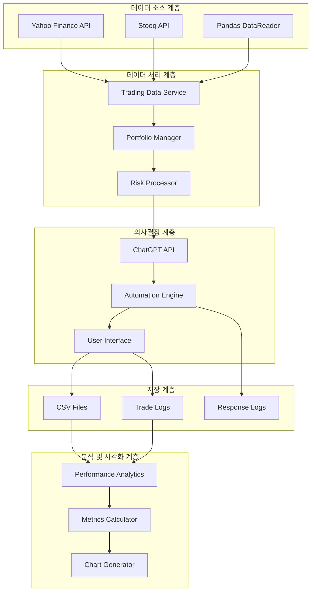
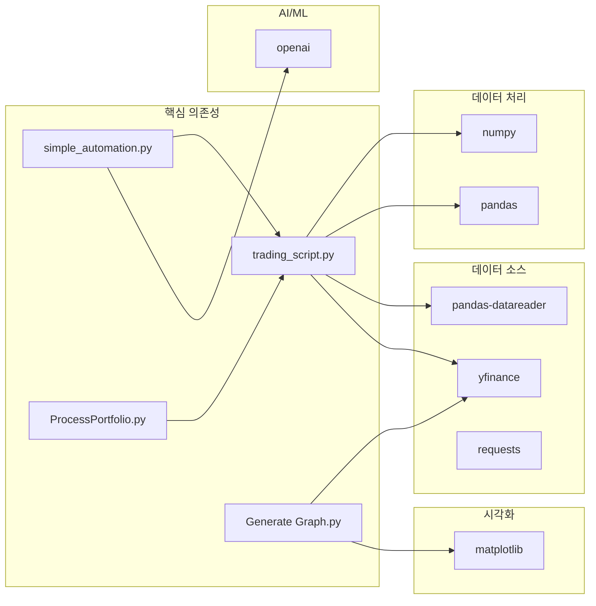
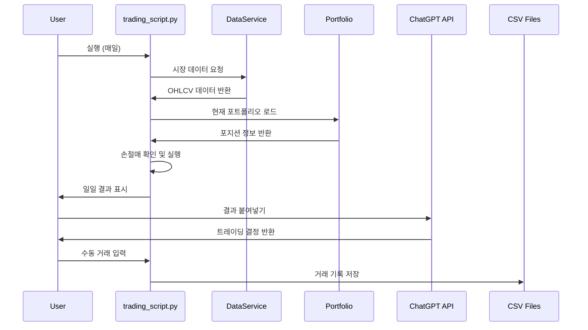
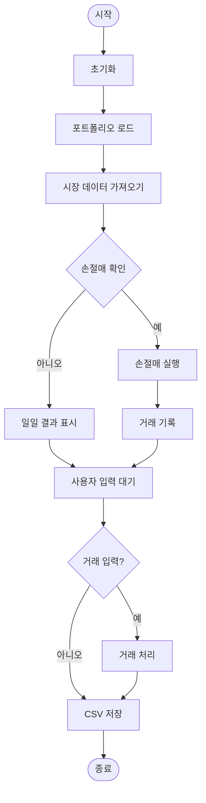
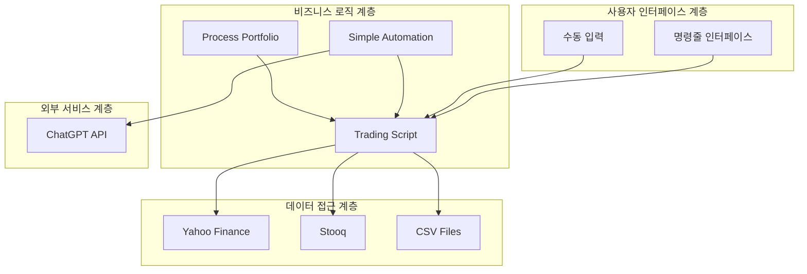

# ChatGPT Micro-Cap Experiment: 포괄적인 기술 분석 보고서

## 목차
1. [프로젝트 개요](#프로젝트-개요)
2. [기술 아키텍처](#기술-아키텍처)
3. [프로젝트 구조](#프로젝트-구조)
4. [설치 및 설정](#설치-및-설정)
5. [사용 가이드](#사용-가이드)
6. [개발 지침](#개발-지침)
7. [추가 정보](#추가-정보)

---

## 프로젝트 개요

### 목적과 기능
ChatGPT Micro-Cap Experiment는 대형 언어 모델(LLM)이 실제 자금으로 마이크로캡 주식 포트폴리오를 관리할 수 있는지를 검증하기 위한 6개월간의 라이브 트레이딩 실험 프로젝트입니다. 이 프로젝트는 $100의 소액 자본으로 시작하여 ChatGPT의 투자 결정 능력을 투명하게 문서화하고 평가하는 것을 목표로 합니다.

### 문제 정의
전통적인 금융 시장에서 개인 투자자들은 정보 비대칭성과 전문 지식 부족으로 인해 어려움을 겪습니다. 이 프로젝트는 다음과 같은 핵심 질문에 답하고자 합니다:
- ChatGPT와 같은 LLM이 실시간 데이터를 사용하여 알파(초과 수익률)를 생성할 수 있는가?
- AI 기반 트레이딩 결정이 인간의 결정보다 우월할 수 있는가?
- 마이크로캡 주식 시장에서 LLM의 활용 가능성은 무엇인가?

### 해결 방법
프로젝트는 다음과 같은 방법으로 문제에 접근합니다:
- 실제 자금을 사용한 라이브 트레이딩 실험
- 엄격한 규칙과 제약 조건 설정 (마이크로캡 <$300M, 완전 주식 거래, 손절매 규칙)
- 매일 포트폴리오 업데이트와 주간 심층 연구
- 완전한 투명성과 성과 추적

### 핵심 기능
- **자동화된 포트폴리오 관리**: [`trading_script.py`](source/ChatGPT-Micro-Cap-Experiment/trading_script.py:1)를 통한 일일 포트폴리오 업데이트 및 평가
- **다중 데이터 소스 지원**: Yahoo Finance와 Stooq를 통한 안정적인 시장 데이터 수집
- **위험 관리 시스템**: 자동화된 손절매 실행 및 포지션 크기 관리
- **성과 분석 도구**: CAPM 분석, 샤프/소르티노 비율, 최대 낙폭(MDD) 계산
- **시각화 도구**: [`Generate Graph.py`](source/ChatGPT-Micro-Cap-Experiment/Scripts and CSV Files/Generate Graph.py:1)를 통한 성과 차트 생성
- **LLM 자동화**: [`simple_automation.py`](source/ChatGPT-Micro-Cap-Experiment/simple_automation.py:1)를 통한 ChatGPT API 연동

### 대상 사용자 및 사용 사례
- **금융 연구자**: AI 기반 투자 전략의 실험적 연구
- **개인 투자자**: 마이크로캡 주식 투자 전략 학습
- **개발자**: 금융 자동화 시스템 구축 참고
- **학생 및 교육자**: 실제 금융 데이터를 활용한 프로젝트 학습

---

## 기술 아키텍처

### 고수준 시스템 아키텍처



### 기술 스택
- **프로그래밍 언어**: Python 3.11+
- **핵심 라이브러리**:
  - [`pandas`](source/ChatGPT-Micro-Cap-Experiment/requirements.txt:2): 데이터 처리 및 분석
  - [`numpy`](source/ChatGPT-Micro-Cap-Experiment/requirements.txt:1): 수치 계산
  - [`yfinance`](source/ChatGPT-Micro-Cap-Experiment/requirements.txt:3): 시장 데이터 수집
  - [`matplotlib`](source/ChatGPT-Micro-Cap-Experiment/requirements.txt:4): 데이터 시각화
- **외부 API**: OpenAI ChatGPT API
- **데이터 형식**: CSV

### 종속성 관계



### 디자인 패턴
- **전략 패턴**: 다양한 데이터 소스(Yahoo, Stooq)에 대한 통합 인터페이스
- **옵저버 패턴**: 포트폴리오 변경 시 자동 로깅
- **커맨드 패턴**: 거래 실행 명령의 캡슐화
- **팩토리 패턴**: 다양한 유형의 데이터 FetchResult 객체 생성

### 아키텍처 결정사항
1. **다중 데이터 소스 접근**: 단일 장애점을 피하기 위해 Yahoo Finance와 Stooq를 모두 지원
2. **CSV 기반 데이터 저장**: 단순성과 투명성을 위해 데이터베이스 대신 CSV 파일 사용
3. **모듈식 설계**: 핵심 기능을 분리하여 재사용성과 테스트 용이성 확보
4. **수동-자동 하이브리드**: 사용자 개입과 자동화를 균형있게 결합

### 구성 요소 상호작용



### 데이터 흐름



---

## 프로젝트 구조

### 디렉토리별 설명

```
ChatGPT-Micro-Cap-Experiment/
├── trading_script.py              # 핵심 트레이딩 엔진
├── simple_automation.py           # LLM 자동화 스크립트
├── requirements.txt               # Python 의존성
├── Makefile                       # 빌드 자동화
├── README.md                      # 프로젝트 개요
├── Results.png                    # 성과 차트
├── Scripts and CSV Files/         # 실제 포트폴리오 데이터
│   ├── Daily Updates.csv          # 일일 포트폴리오 업데이트
│   ├── Trade Log.csv              # 모든 거래 기록
│   ├── ProcessPortfolio.py        # 포트폴리오 처리 래퍼
│   └── Generate Graph.py          # 성과 차트 생성기
├── Start Your Own/                # 사용자 템플릿
│   ├── README.md                  # 시작 가이드
│   ├── Daily Updates.csv          # 빈 포트폴리오 템플릿
│   ├── Trade Log.csv              # 빈 거래 로그 템플릿
│   ├── ProcessPortfolio.py        # 포트폴리오 처리 스크립트
│   └── Generate Graph.py          # 차트 생성 스크립트
├── Experiment Details/            # 실험 문서
│   ├── Disclaimer.md              # 면책 조항
│   ├── Prompts.md                 # 사용된 프롬프트
│   ├── Q&A.md                     # 질문과 답변
│   ├── Deep Research Index.md     # 심층 연구 인덱스
│   └── Chats.md                   # 채팅 기록
├── Weekly Deep Research (MD)/     # 주간 연구 요약 (마크다운)
│   ├── Starting Research Summary.md
│   ├── Week 1 Summary.md
│   └── ... (Week 2-16)
├── Weekly Deep Research (PDF)/    # 주간 연구 요약 (PDF)
│   ├── Starting Research.pdf
│   ├── Week 1.pdf
│   └── ... (Week 2-16)
└── Other/                         # 추가 문서
    ├── AUTOMATION_README.md       # 자동화 가이드
    ├── CONTRIBUTING.md            # 기여 가이드
    ├── CODE_OF_CONDUCT.md         # 행동 강령
    └── License.txt                # 라이선스
```

### 파일 구성의 근거
- **핵심 스크립트 분리**: [`trading_script.py`](source/ChatGPT-Micro-Cap-Experiment/trading_script.py:1)는 핵심 로직을, [`simple_automation.py`](source/ChatGPT-Micro-Cap-Experiment/simple_automation.py:1)는 LLM 연동을 담당
- **데이터와 로직 분리**: CSV 파일은 별도 디렉토리에서 관리하여 데이터 무결성 보장
- **템플릿 제공**: "Start Your Own" 디렉토리를 통해 사용자가 자체 실험 시작 가능
- **문서 체계화**: 실험 관련 문서를 별도 디렉토리에서 체계적으로 관리

### 프로젝트 계층 구조



---

## 설치 및 설정

### 전제 조건
- Python 3.11 이상
- 인터넷 연결 (시장 데이터 수집을 위해)
- 약 10MB의 저장 공간 (CSV 데이터 파일용)

### 시스템 요구사항
- **운영체제**: Windows, macOS, Linux
- **메모리**: 최소 2GB RAM
- **저장 공간**: 최소 50MB 여유 공간
- **네트워크**: 안정적인 인터넷 연결

### 단계별 설치 가이드

#### 1. 리포지토리 복제
```bash
git clone https://github.com/LuckyOne7777/ChatGPT-Micro-Cap-Experiment.git
cd ChatGPT-Micro-Cap-Experiment
```

#### 2. 가상 환경 설정 (권장)
```bash
# 가상 환경 생성
python -m venv venv

# 가상 환경 활성화
# Windows:
venv\Scripts\activate
# macOS/Linux:
source venv/bin/activate
```

#### 3. 의존성 설치
```bash
pip install -r requirements.txt
```

또는 Makefile 사용:
```bash
make setup
```

#### 4. OpenAI API 설정 (자동화 기능 사용 시)
```bash
# 환경 변수 설정
export OPENAI_API_KEY="your-openai-api-key"
```

### 구성 지침

#### 데이터 디렉토리 설정
프로젝트는 두 가지 모드로 실행할 수 있습니다:

1. **기존 데이터 사용**:
   ```bash
   python trading_script.py --data-dir "Scripts and CSV Files"
   ```

2. **새 실험 시작**:
   ```bash
   python trading_script.py --data-dir "Start Your Own" --starting-equity 1000
   ```

#### 주요 설정 옵션
- `--data-dir`: 데이터 디렉토리 경로 지정
- `--asof`: 특정 날짜를 "오늘"로 처리 (YYYY-MM-DD 형식)
- `--log-level`: 로깅 레벨 설정 (DEBUG, INFO, WARNING, ERROR, CRITICAL)
- `--starting-equity`: 초기 자본 설정

### 일반적인 문제 해결

#### 1. 데이터 가져오기 오류
**문제**: Yahoo Finance 또는 Stooq에서 데이터를 가져오지 못하는 경우
**해결책**:
- 인터넷 연결 확인
- `--asof` 옵션으로 이전 날짜 시도
- 로그 레벨을 DEBUG로 설정하여 상세 오류 확인

#### 2. CSV 파일 오류
**문제**: CSV 파일을 읽거나 쓸 때 오류 발생
**해결책**:
- 파일 권한 확인
- 디렉토리 존재 여부 확인
- CSV 파일 형식 검증

#### 3. API 키 오류
**문제**: OpenAI API 호출 실패
**해결책**:
- API 키 유효성 확인
- 환경 변수 설정 확인
- API 할당량 및 사용량 확인

---

## 사용 가이드

### 기본 사용 예제

#### 1. 기존 포트폴리오 업데이트
```bash
python trading_script.py --data-dir "Scripts and CSV Files"
```

#### 2. 새로운 포트폴리오 시작
```bash
python trading_script.py --data-dir "Start Your Own" --starting-equity 1000
```

#### 3. 특정 날짜로 백테스트
```bash
python trading_script.py --data-dir "Start Your Own" --asof 2025-09-30
```

### 코드 스니펫

#### 포트폴리오 로드 및 처리
```python
from trading_script import load_latest_portfolio_state, process_portfolio

# 포트폴리오 상태 로드
portfolio, cash = load_latest_portfolio_state()

# 포트폴리오 처리 (일일 업데이트)
updated_portfolio, new_cash = process_portfolio(portfolio, cash)
```

#### 시각화 생성
```python
from Generate_Graph import main

# 성과 차트 생성
metrics = main()
print(f"최대 실행: {metrics['largest_run_gain_pct']:.2f}%")
print(f"최대 낙폭: {metrics['max_drawdown_pct']:.2f}%")
```

### 고급 기능

#### 1. 자동화된 트레이딩
```python
from simple_automation import run_automated_trading

# 자동화된 트레이딩 실행 (드라이런 모드)
run_automated_trading(
    api_key="your-api-key",
    model="gpt-4",
    data_dir="Start Your Own",
    dry_run=True
)
```

#### 2. 사용자 정의 벤치마크 설정
`tickers.json` 파일 생성:
```json
{
    "benchmarks": ["IWO", "XBI", "SPY", "IWM"]
}
```

#### 3. 로깅 설정
```python
import logging

logging.basicConfig(
    level=logging.DEBUG,
    format='%(asctime)s - %(name)s - %(levelname)s - %(message)s'
)
```

### 구성 옵션

#### 환경 변수
- `OPENAI_API_KEY`: OpenAI API 키
- `ASOF_DATE`: 기준 날짜 설정 (YYYY-MM-DD)

#### 설정 파일
- `tickers.json`: 벤치마크 티커 설정
- `requirements.txt`: Python 의존성 목록

### API 문서

#### 핵심 함수

##### `download_price_data(ticker, **kwargs)`
시장 데이터를 다중 소스에서 가져옵니다.
- **매개변수**:
  - `ticker` (str): 주식 티커符号
  - `**kwargs`: yfinance 옵션
- **반환값**: `FetchResult` 객체 (DataFrame과 소스 정보 포함)

##### `process_portfolio(portfolio, cash, interactive=True)`
포트폴리오를 처리하고 업데이트합니다.
- **매개변수**:
  - `portfolio`: 포트폴리오 DataFrame 또는 딕셔너리
  - `cash` (float): 현금 잔액
  - `interactive` (bool): 상호작용 모드
- **반환값**: (업데이트된 포트폴리오, 새 현금 잔액) 튜플

##### `daily_results(chatgpt_portfolio, cash)`
일일 결과를 계산하고 표시합니다.
- **매개변수**:
  - `chatgpt_portfolio`: 포트폴리오 DataFrame
  - `cash` (float): 현금 잔액

### 명령줄 인터페이스 참조

#### trading_script.py
```bash
python trading_script.py [옵션]

옵션:
  --data-dir DIR          데이터 디렉토리 (필수)
  --asof DATE             특정 날짜를 '오늘'로 처리 (YYYY-MM-DD)
  --log-level LEVEL       로깅 레벨 (DEBUG|INFO|WARNING|ERROR|CRITICAL)
  --starting-equity AMT   초기 자본 설정
  -h, --help              도움말 표시
```

#### simple_automation.py
```bash
python simple_automation.py [옵션]

옵션:
  --api-key KEY           OpenAI API 키
  --model MODEL           사용할 모델 (기본값: gpt-4)
  --data-dir DIR          데이터 디렉토리 (기본값: Start Your Own)
  --dry-run               드라이런 모드
  -h, --help              도움말 표시
```

---

## 개발 지침

### 개발 환경 설정 방법

#### 1. 개발 환경 구축
```bash
# 리포지토리 복제
git clone https://github.com/LuckyOne7777/ChatGPT-Micro-Cap-Experiment.git
cd ChatGPT-Micro-Cap-Experiment

# 개발 환경 설정
python -m venv venv
source venv/bin/activate  # Windows: venv\Scripts\activate

# 개발 의존성 설치
pip install -r requirements.txt
pip install pytest black flake8  # 개발 도구
```

#### 2. 코드 스타일 설정
```bash
# 코드 포맷팅
black *.py

# 린트 검사
flake8 *.py --max-line-length=100
```

### 코드 스타일 및 규칙

#### 1. Python 스타일 가이드
- PEP 8 준수
- 최대 라인 길이: 100자
- 4칸 들여쓰기 사용
- 클래스명은 PascalCase, 함수명은 snake_case

#### 2. 문서화 규칙
- 모든 함수와 클래스에 docstring 포함
- Google 스타일 docstring 사용 권장
- 복잡한 로직에는 인라인 주석 추가

#### 3. 예시 코드 스타일
```python
def download_price_data(ticker: str, **kwargs: Any) -> FetchResult:
    """
    여러 소스에서 OHLCV 데이터를 가져옵니다.
    
    Args:
        ticker: 주식 티커符号
        **kwargs: yfinance에 전달할 추가 인수
        
    Returns:
        FetchResult: 데이터프레임과 소스 정보를 포함한 객체
        
    Raises:
        ValueError: 티커가 유효하지 않은 경우
    """
    # 구현 내용
    pass
```

### 테스트 절차 및 커버리지

#### 1. 테스트 실행
```bash
# 모든 테스트 실행
pytest

# 특정 테스트 파일 실행
pytest test_trading_script.py

# 커버리지 보고서 생성
pytest --cov=. --cov-report=html
```

#### 2. 테스트 작성 가이드
- 단위 테스트는 `test_` 접두사 사용
- 통합 테스트는 실제 데이터 대신 모의 데이터 사용
- 에지 케이스 및 예외 상황 테스트 포함

#### 3. 테스트 예시
```python
import pytest
from trading_script import download_price_data

def test_download_price_data():
    """시장 데이터 다운로드 기능 테스트"""
    result = download_price_data("AAPL", period="1d")
    
    assert not result.df.empty
    assert "Open" in result.df.columns
    assert "Close" in result.df.columns
    assert result.source in ["yahoo", "stooq-pdr", "stooq-csv"]
```

### 기여 가이드라인

#### 1. 기여 프로세스
1. 이슈 생성: 버그 보고 또는 기능 요청
2. 포크 및 브랜치 생성: `git checkout -b feature/new-feature`
3. 변경 사항 구현 및 테스트
4. 커밋: `git commit -m "Add new feature"`
5. 푸시: `git push origin feature/new-feature`
6. 풀 리퀘스트 생성

#### 2. 코드 리뷰 가이드라인
- 모든 PR은 최소 한 명의 유지 관리자 검토 필요
- 테스트 커버리지 80% 이상 권장
- 문서 업데이트 필요
- PEP 8 준수 확인

#### 3. 이슈 보고
- 명확한 제목과 설명 사용
- 재현 단계 포함
- 환경 정보 (OS, Python 버전) 포함
- 스크린샷 또는 로그 포함 (해당하는 경우)

---

## 추가 정보

### 성능 고려사항

#### 1. 데이터 가져오기 최적화
- 다중 데이터 소스를 통한 안정성 확보
- 캐싱 메커니즘으로 반복 요청 최소화
- 비동기 처리 고려 (대규모 포트폴리오의 경우)

#### 2. 메모리 관리
- 대용량 CSV 파일 처리 시 청크 단위로 읽기
- 불필요한 데이터프레임 복사 피하기
- 사용 완료된 객체는 즉시 메모리 해제

#### 3. 실행 시간 최적화
- [`download_price_data()`](source/ChatGPT-Micro-Cap-Experiment/trading_script.py:400) 함수의 다단계 폴백 메커니즘으로 안정성 확보
- 벡터화된 pandas 연산으로 루프 최소화
- 병렬 처리 고려 (독립적인 티커 처리 시)

### 보안 고려사항

#### 1. API 키 관리
- API 키를 코드에 직접 포함하지 않음
- 환경 변수 또는 구성 파일 사용
- 버전 관리 시스템에 API 키 커밋 금지

#### 2. 데이터 무결성
- CSV 파일 무결성 검증
- 입력 데이터 검증 및 정제
- 예기치 않은 데이터 형식 처리

#### 3. 오류 처리
- 네트워크 오류 시 graceful degradation
- 예외 상황에서의 안전한 종료
- 민감 정보 로깅 방지

### 프로젝트 로드맵 및 향후 계획

#### 단기 목표 (3개월)
- [ ] 웹 기반 대시보드 개발
- [ ] 추가 데이터 소스 통합 (Alpha Vantage, IEX Cloud)
- [ ] 백테스팅 프레임워크 강화
- [ ] 포트폴리오 최적화 알고리즘 추가

#### 중기 목표 (6개월)
- [ ] 실시간 데이터 스트리밍 지원
- [ ] 머신러닝 기반 예측 모델 통합
- [ ] 모바일 애플리케이션 개발
- [ ] 클라우드 배포 자동화

#### 장기 목표 (1년 이상)
- [ ] 다중 LLM 지원 (Claude, Gemini 등)
- [ ] 온체인 거래 연동
- [ ] 커뮤니티 기반 포트폴리오 공유 플랫폼
- [ ] 전문 금융 데이터베이스 통합

### 라이선스 및 저작권 표시

#### 라이선스
이 프로젝트는 MIT 라이선스 하에 배포됩니다. 자세한 내용은 [`License.txt`](source/ChatGPT-Micro-Cap-Experiment/Other/License.txt:1) 파일을 참조하세요.

#### 저작권
- 원작자: Nathan Smith
- 이메일: nathanbsmith.business@gmail.com
- 블로그: [A.I Controls Stock Account](https://nathanbsmith729.substack.com)

#### 제3자 라이선스
- yfinance: Apache 2.0 라이선스
- pandas: BSD 3-Clause 라이선스
- matplotlib: PSF 라이선스
- OpenAI API: 별도의 이용 약관 적용

---

## 결론

ChatGPT Micro-Cap Experiment는 AI 기반 투자 결정의 가능성을 탐구하는 혁신적인 프로젝트입니다. 투명성, 재현성, 교육적 가치를 중심으로 설계되어 금융 기술과 AI의 교차점에서 중요한 통찰을 제공합니다.

이 프로젝트는 단순한 트레이딩 시스템을 넘어, AI가 금융 시장에서 어떻게 의사결정을 내리는지에 대한 실질적인 데이터를 제공하는 연구 플랫폼입니다. 개방형 설계와 상세한 문서화를 통해 연구자, 개발자, 투자자 모두에게 가치 있는 자원이 될 것입니다.

프로젝트의 진화는 커뮤니티의 참여에 크게 의존합니다. 기여, 피드백, 개선 제안을 통해 이 실험이 더욱 견고하고 유용한 플랫폼으로 발전할 수 있기를 바랍니다.

---

*이 보고서는 2025년 10월 19일에 작성되었으며, 프로젝트의 현재 상태를 기반으로 합니다. 최신 정보는 프로젝트 GitHub 리포지토리를 참조하세요.*