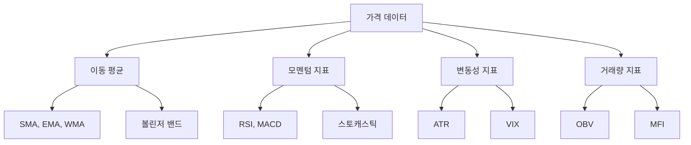
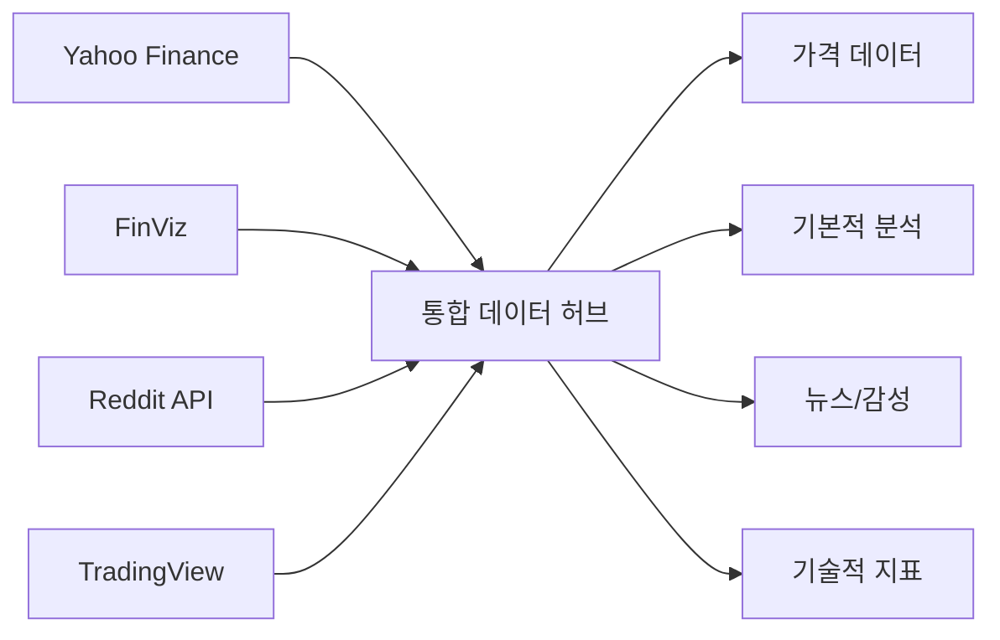
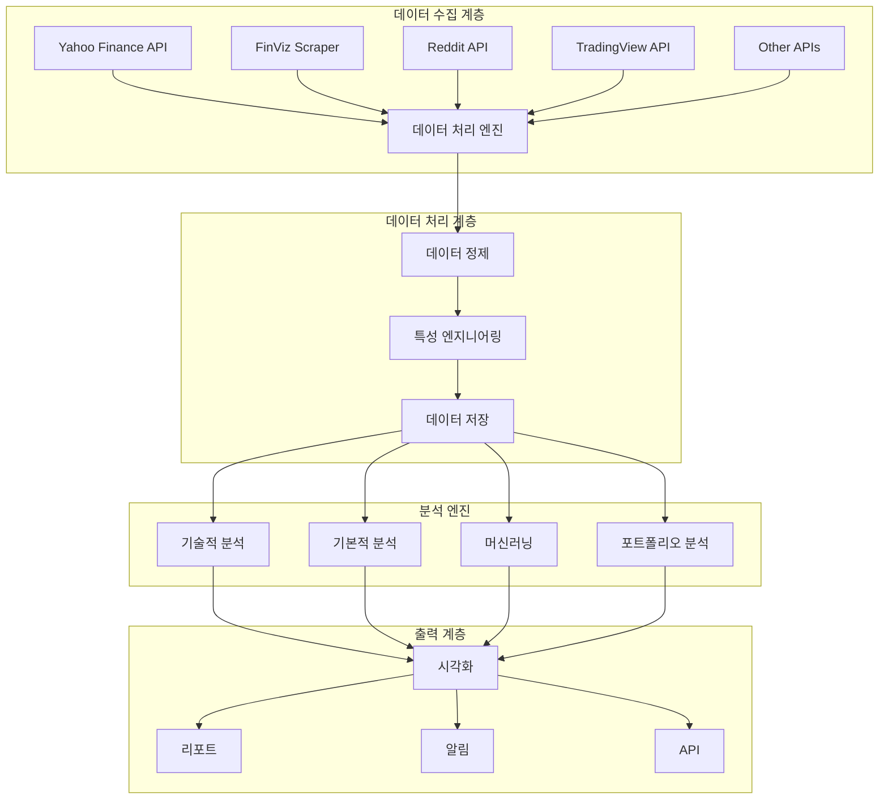
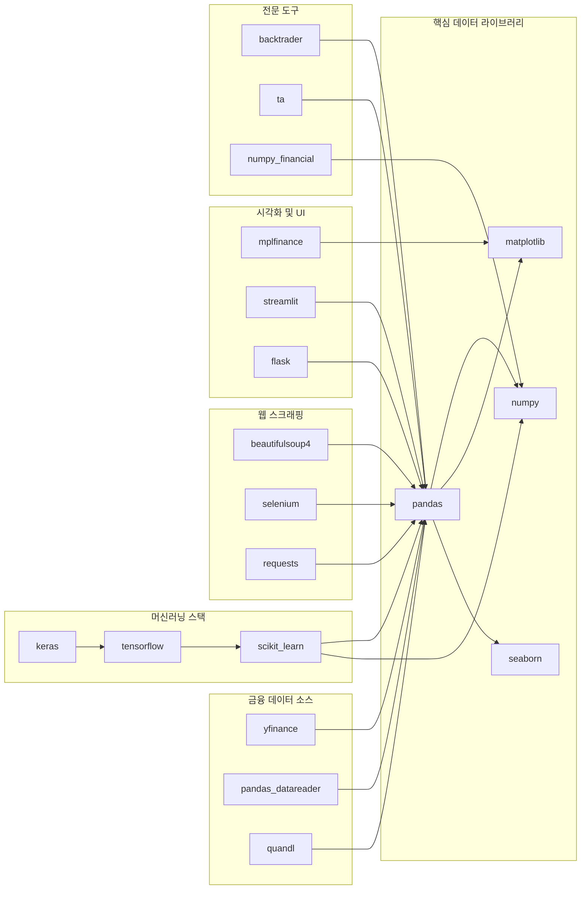
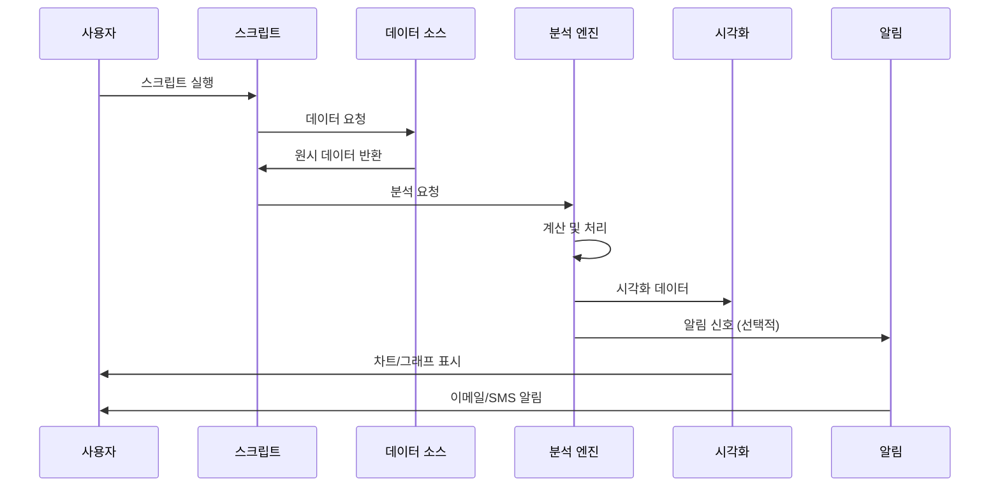
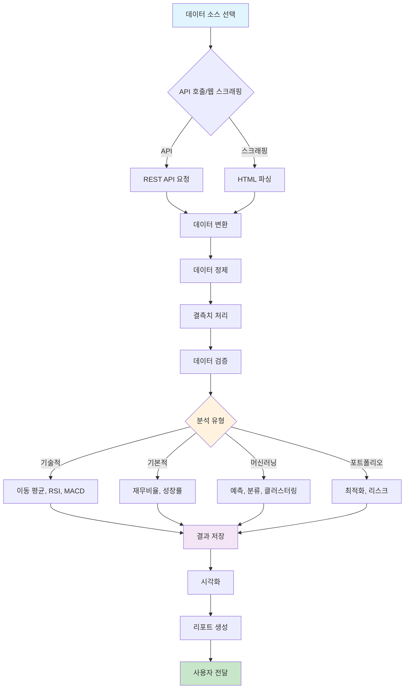
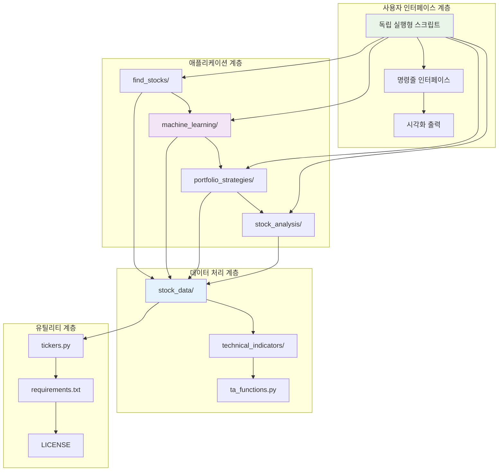
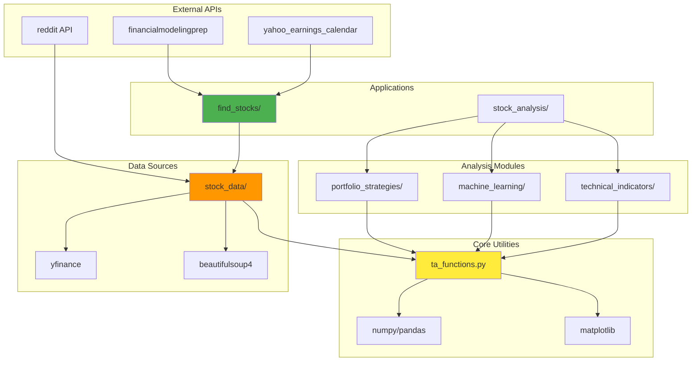
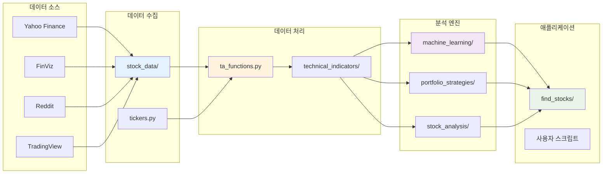
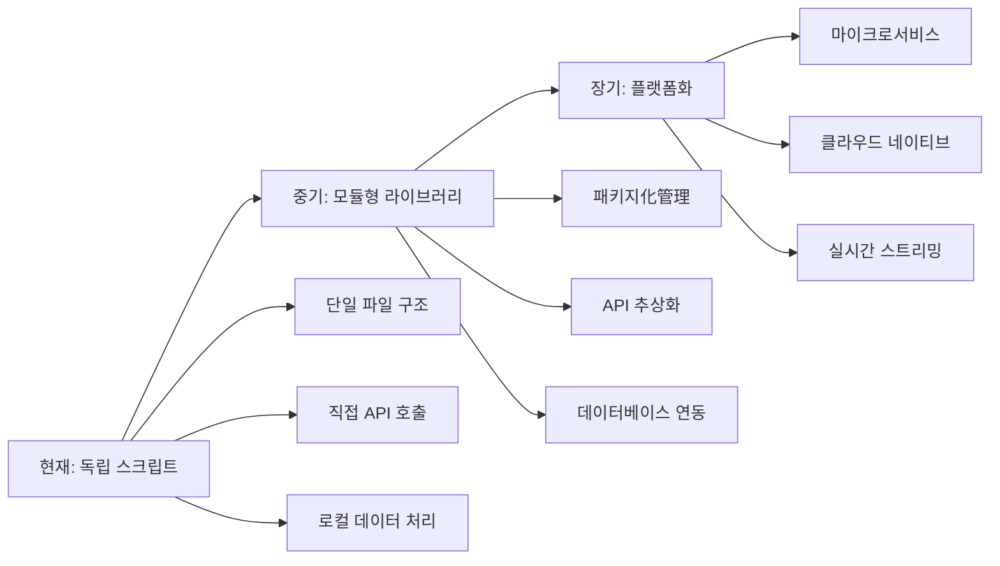

# Finance: 금융 데이터 분석 및 포트폴리오 관리를 위한 파이썬 라이브러리 모음 종합 기술 문서

## 📋 목차
1. [프로젝트 개요](#프로젝트-개요)
2. [기술 아키텍처](#기술-아키텍처)
3. [프로젝트 구조](#프로젝트-구조)
4. [설치 및 설정](#설치-및-설정)
5. [사용 가이드](#사용-가이드)
6. [개발 지침](#개발-지침)
7. [추가 정보](#추가-정보)

---

## 프로젝트 개요

### 🎯 프로젝트 목적과 기능

**Finance**는 금융 데이터 수집, 조작 및 분석을 위한 150개 이상의 파이썬 프로그램 모음입니다. 개별 투자자, 금융 분석가, 퀀트 개발자가 주식 시장 데이터를 효과적으로 분석하고 투자 전략을 개발할 수 있도록 설계되었습니다.

#### 핵심 기능
- **데이터 수집**: 다양한 API 및 웹 스크래핑을 통한 실시간 및 과거 데이터 수집
- **기술적 분석**: 80개 이상의 기술적 지표 계산 및 시각화
- **머신러닝**: 주가 예측, 분류, 클러스터링을 위한 ML 모델
- **포트폴리오 최적화**: 현대 포트폴리오 이론 기반 자산 배분
- **백테스팅**: 다양한 트레이딩 전략의 과거 성과 분석
- **스크리닝**: 기본적 분석 및 기술적 분석 기반 주식 필터링

### 🔍 문제 정의

개별 투자자와 소규모 금융 분석가들은 다음과 같은 문제에 직면합니다:

1. **데이터 접근성**: 다양한 소스의 금융 데이터를 통합적으로 활용하기 어려움
2. **기술적 전문성**: 복잡한 금융 분석 도구를 구현할 프로그래밍 역량 부족
3. **분석 도구 파편화**: 다양한 분석 도구를 통합하여 사용하기 어려움
4. **비용 문제**: 상업적 금융 분석 소프트웨어의 높은 라이선스 비용
5. **맞춤화 부족**: 특정 투자 스타일에 맞는 맞춤형 도구 부재

### 💡 해결 방법

Finance 프로젝트는 다음과 같은 통합적 해결책을 제공합니다:

1. **오픈소스 생태계**: 무료로 사용 가능한 150개 이상의 금융 분석 도구
2. **모듈식 아키텍처**: 필요한 기능만 선택적으로 사용 가능
3. **다양한 데이터 소스**: Yahoo Finance, FinViz, Reddit 등 다중 데이터 소스 통합
4. **교육적 접근**: 코드 예제와 함께 금융 분석 개념 학습 지원
5. **실용적 도구**: 실제 투자 의사결정에 바로 적용 가능한 도구

### 🚀 핵심 기능 상세

#### 1. 기술적 지표 라이브러리 (80+ 지표)


#### 2. 머신러닝 통합
- **딥러닝**: LSTM, 신경망을 통한 주가 예측
- **전통적 ML**: 랜덤 포레스트, SVM 등 분류 모델
- **클러스터링**: K-means를 통한 주식 그룹화
- **시계열 분석**: ARIMA, Prophet 모델

#### 3. 포트폴리오 관리
- **현대 포트폴리오 이론**: 평균-분산 최적화
- **리스크 관리**: VaR, 최대 손실률 분석
- **자산 배분**: 동적/정적 리밸런싱 전략
- **백테스팅**: 역사적 데이터 기반 전략 검증

#### 4. 데이터 수집 네트워크


### 👥 대상 사용자 및 사용 사례

#### 주요 사용자 그룹
1. **개별 투자자**: 데이터 기반 투자 의사결정 지원
2. **금융 학생**: 금융 분석 도구 및 개념 학습
3. **퀀트 개발자**: 거래 전략 개발 및 테스트
4. **파이낸셜 어드바이저**: 클라이언트 포트폴리오 분석
5. **데이터 분석가**: 금융 데이터 분석 프로젝트

#### 구체적 사용 사례
- **주식 스크리닝**: 특정 조건에 맞는 주식 필터링
- **기술적 분석**: 차트 패턴 및 지표 기반 매매 신호
- **포트폴리오 최적화**: 리스크 조정 수익률 극대화
- **시장 감성 분석**: 뉴스 및 소셜 미디어 감성 추출
- **리스크 평가**: 포트폴리오 리스크 측정 및 관리

---

## 기술 아키텍처

### 🏗️ 고수준 시스템 아키텍처



### 🔧 기술 스택

#### 핵심 프레임워크
- **Python 3.x**: 주요 프로그래밍 언어
- **Pandas**: 데이터 처리 및 조작
- **NumPy**: 수치 계산 및 배열 연산
- **Matplotlib/Seaborn**: 데이터 시각화

#### 머신러닝/딥러닝
```python
# 딥러닝 프레임워크
tensorflow==2.15.0    # 딥러닝 모델
keras==3.0.2          # 신경망 API
scikit_learn==1.3.0   # 전통적 머신러닝

# 시계열 분석
pmdarima==2.0.4       # ARIMA 모델
fbprophet==0.7.1      # Prophet 예측
statsmodels==0.14.0   # 통계 모델링
```

#### 금융 데이터 소스
```python
# 데이터 수집 라이브러리
yfinance==0.2.33           # Yahoo Finance API
pandas_datareader==0.10.0 # 다양한 금융 데이터 소스
quandl==3.7.0             # 경제/금융 데이터
robin_stocks==3.0.6       # Robinhood API
```

#### 웹 스크래핑 및 API
```python
# 웹 스크래핑
beautifulsoup4==4.12.2    # HTML 파싱
selenium==4.16.0          # 웹 자동화
autoscraper==1.1.14       # 자동 스크래핑
lxml==4.9.3               # XML/HTML 처리

# 소셜 미디어 API
praw==7.7.1               # Reddit API
tweepy==4.14.0            # Twitter API
```

### 🔗 종속성 관계



### 🎨 디자인 패턴

#### 1. 모듈식 아키텍처 패턴
```python
# 각 기능 모듈의 독립성 보장
# technical_indicators/
#   ├── RSI.py
#   ├── MACD.py
#   └── bollinger_bands.py

# machine_learning/
#   ├── lstm_prediction.py
#   ├── kmeans_clustering.py
#   └── ml_models_accuracy.py
```

#### 2. 팩토리 패턴 (데이터 소스)
```python
class DataSourceFactory:
    @staticmethod
    def create_source(source_type):
        if source_type == 'yahoo':
            return YahooFinanceSource()
        elif source_type == 'finviz':
            return FinVizSource()
        elif source_type == 'reddit':
            return RedditSource()
        else:
            raise ValueError(f"Unknown source type: {source_type}")
```

#### 3. 전략 패턴 (분석 방법)
```python
class AnalysisStrategy:
    def analyze(self, data):
        raise NotImplementedError

class TechnicalAnalysis(AnalysisStrategy):
    def analyze(self, data):
        # 기술적 분석 로직
        pass

class FundamentalAnalysis(AnalysisStrategy):
    def analyze(self, data):
        # 기본적 분석 로직
        pass
```

#### 4. 옵저버 패턴 (알림 시스템)
```python
class AlertObserver:
    def update(self, signal):
        raise NotImplementedError

class EmailAlert(AlertObserver):
    def update(self, signal):
        # 이메일 알림 발송
        pass

class SMSAlert(AlertObserver):
    def update(self, signal):
        # SMS 알림 발송
        pass
```

### ⚙️ 아키텍처 결정사항

#### 1. 독립 실행형 스크립트 아키텍처
**결정**: 각 기능을 독립적인 스크립트로 구현

**이유**:
- 학습 곡선 최소화
- 필요한 기능만 선택적 사용 가능
- 유지보수 용이성
- 모듈성 및 재사용성

#### 2. 다중 데이터 소스 통합
**결정**: 여러 금융 데이터 소스를 통합 지원

**이유**:
- 데이터 소스 다각화를 통한 리스크 감소
- 각 소스의 강점 활용
- 데이터 검증 및 교차 확인
- 확장성 고려

#### 3. 시각화 중심 접근
**결정**: 모든 분석 결과를 시각적으로 표현

**이유**:
- 복잡한 금융 데이터의 직관적 이해
- 의사결정 효율성 향상
- 보고서 및 프레젠테이션 용이성
- 교육적 효과 극대화

### 🔄 구성 요소 상호작용



### 📊 데이터 흐름



---

## 프로젝트 구조

### 📁 디렉토리별 설명

```
Finance/
├── find_stocks/              # 주식 스크리닝 도구
│   ├── fundamental_screener.py      # 기본적 분석 스크리너
│   ├── finviz_growth_screener.py   # FinViz 성장 스크리너
│   ├── get_rsi_tickers.py          # RSI 기반 스크리너
│   └── twitter_screener.py         # 트위터 감성 스크리너
├── machine_learning/          # 머신러닝 애플리케이션
│   ├── lstm_prediction.py            # LSTM 주가 예측
│   ├── kmeans_clustering.py         # K-means 클러스터링
│   ├── prophet_price_prediction.py  # Prophet 예측
│   └── ml_models_accuracy.py        # ML 모델 정확도 비교
├── portfolio_strategies/     # 포트폴리오 전략
│   ├── backtest_strategies.py        # 전략 백테스팅
│   ├── optimal_portfolio.py         # 최적 포트폴리오
│   ├── risk_management.py           # 리스크 관리
│   └── pairs_trading.py             # 페어 트레이딩
├── stock_analysis/           # 개별 주식 분석
│   ├── capm_analysis.py              # CAPM 분석
│   ├── intrinsic_value.py            # 내재가치 계산
│   ├── seasonal_stock_analysis.py    # 계절적 분석
│   └── performance_risk_analysis.py # 성과/리스크 분석
├── stock_data/               # 데이터 수집 도구
│   ├── finviz_stock_scraper.py       # FinViz 스크래퍼
│   ├── reddit_scraper.py            # Reddit 스크래퍼
│   ├── dividend_history.py          # 배당금 이력
│   └── fundamental_ratios.py        # 재무 비율
├── technical_indicators/     # 기술적 지표 (80+ 개)
│   ├── RSI.py                        # RSI 지표
│   ├── MACD.py                       # MACD 지표
│   ├── bollinger_bands.py           # 볼린저 밴드
│   └── ... (기타 77개 지표)
├── ta_functions.py           # 핵심 기술적 분석 함수
├── tickers.py                # 티커 데이터 관리
├── requirements.txt          # 의존성 목록
├── LICENSE                  # MIT 라이선스
└── README.md                # 프로젝트 문서
```

### 🏗️ 파일 구성의 근거

#### 1. 기능별 모듈화
- **find_stocks**: 투자 기회 발견을 위한 스크리닝 도구 모음
- **machine_learning**: 데이터 기반 예측 및 분류 모델
- **portfolio_strategies**: 포트폴리오 구성 및 관리 전략
- **stock_analysis**: 개별 자산 심층 분석 도구

#### 2. 데이터 처리 파이프라인
- **stock_data**: 원시 데이터 수집 및 전처리
- **technical_indicators**: 계산된 기술적 지표
- **ta_functions**: 재사용 가능한 핵심 함수들

#### 3. 유틸리티 및 설정
- **tickers.py**: 다양한 거래소 티커 데이터
- **requirements.txt**: 버전 관리된 의존성
- 독립 실행형 스크립트로 구성된 교육용 구조

### 🌳 프로젝트 계층 구조



### 📦 모듈 상호 의존성



### 🔄 데이터 흐름 아키텍처



---

## 설치 및 설정

### 📋 전제 조건

#### 시스템 요구사항
- **운영체제**: Linux, macOS, Windows
- **Python**: 3.7 이상 (권장 3.9+)
- **메모리**: 최소 4GB RAM (권장 8GB+)
- **저장 공간**: 최소 2GB 여유 공간
- **인터넷 연결**: 데이터 수집을 위한 안정적인 연결

#### 소프트웨어 의존성
```bash
# 기본 파이썬 환경
Python >= 3.7
pip >= 21.0

# 웹 브라우저 (스크래핑용)
Chrome/Firefox (최신 버전)

# 선택적 GPU 지원 (딥러닝)
CUDA >= 11.0 (NVIDIA GPU 사용 시)
```

### 🚀 단계별 설치 가이드

#### 1. 저장소 클론 및 환경 설정

```bash
# 저장소 클론
git clone https://github.com/shashankvemuri/Finance.git
cd Finance

# 가상환경 생성 (강력 권장)
python -m venv finance_env

# 가상환경 활성화
# Linux/macOS:
source finance_env/bin/activate
# Windows:
finance_env\Scripts\activate
```

#### 2. 의존성 설치

```bash
# 기본 의존성 설치
pip install -r requirements.txt

# 문제 발생 시 개별 설치
pip install pandas numpy matplotlib seaborn
pip install yfinance pandas-datareader
pip install scikit-learn tensorflow
pip install beautifulsoup4 selenium
```

#### 3. 웹 드라이버 설정 (선택사항)

```bash
# Chrome 드라이버 설정 (프로젝트에 포함됨)
# chromedriver 파일이 있는지 확인
ls -la chromedriver

# 권한 설정 (Linux/macOS)
chmod +x chromedriver

# 또는 webdriver_manager로 자동 관리
pip install webdriver_manager
```

#### 4. API 키 설정 (선택사항)

```python
# config.py 파일 생성 (기본적 분석 API용)
touch config.py

# config.py 내용
def financial_model_prep():
    return 'YOUR_FMP_API_KEY'

# Reddit API 설정 (선택사항)
def reddit_config():
    return {
        'client_id': 'YOUR_CLIENT_ID',
        'client_secret': 'YOUR_CLIENT_SECRET',
        'user_agent': 'finance_analyzer/1.0'
    }
```

### ⚙️ 구성 지침

#### 1. 데이터 소스 설정

**Yahoo Finance 설정**:
```python
import yfinance as yf
import pandas_datareader as pdr

# 자동 재정의 설정
yf.pdr_override()

# 데이터 수신 테스트
test_data = pdr.get_data_yahoo('AAPL', start='2023-01-01', end='2023-12-31')
print(f"데이터 수신 성공: {len(test_data)}일 데이터")
```

**FinViz 스크래핑 설정**:
```python
# User-Agent 설정 (차단 방지)
headers = {
    'User-Agent': 'Mozilla/5.0 (Windows NT 10.0; Win64; x64) AppleWebKit/537.36'
}

# 요청 간격 설정 (과도한 요청 방지)
import time
time.sleep(1)  # 요청 간 1초 간격
```

#### 2. 시각화 환경 설정

```python
# Matplotlib 백엔드 설정 (서버 환경)
import matplotlib
matplotlib.use('Agg')  # GUI 없는 환경

# 또는 Jupyter 노트북 환경
%matplotlib inline

# 한글 폰트 설정 (선택사항)
import matplotlib.pyplot as plt
plt.rcParams['font.family'] = 'Malgun Gothic'  # Windows
# plt.rcParams['font.family'] = 'AppleGothic'  # macOS
```

#### 3. 머신러닝 환경 설정

```python
# TensorFlow 설정
import tensorflow as tf

# GPU 사용 설정 (선택사항)
gpus = tf.config.experimental.list_physical_devices('GPU')
if gpus:
    try:
        for gpu in gpus:
            tf.config.experimental.set_memory_growth(gpu, True)
    except RuntimeError as e:
        print(f"GPU 설정 오류: {e}")

# 경고 메시지 제어
import warnings
warnings.filterwarnings('ignore')
```

### 🔧 일반적인 문제 해결

#### 1. 설치 관련 문제

**문제**: yfinance 데이터 수신 오류
```python
# 해결책 1: 최신 버전 확인
pip install --upgrade yfinance

# 해결책 2: pandas_datareader 대신 직접 사용
import yfinance as yf
data = yf.download('AAPL', start='2023-01-01', end='2023-12-31')

# 해결책 3: 타임아웃 설정
import yfinance as yf
ticker = yf.Ticker('AAPL')
data = ticker.history(period='1y', timeout=30)
```

**문제**: Selenium/Chrome 드라이버 오류
```python
# 해결책 1: webdriver_manager 사용
from selenium import webdriver
from webdriver_manager.chrome import ChromeDriverManager

driver = webdriver.Chrome(ChromeDriverManager().install())

# 해결책 2: 헤드리스 모드 설정
from selenium import webdriver
from selenium.webdriver.chrome.options import Options

options = Options()
options.add_argument('--headless')
options.add_argument('--no-sandbox')
options.add_argument('--disable-dev-shm-usage')
driver = webdriver.Chrome(options=options)
```

**문제**: TensorFlow/CUDA 호환성
```bash
# 해결책: 호환 가능한 버전 설치
# Python 3.9, CUDA 11.2 기준
pip install tensorflow==2.10.0

# CUDA 버전 확인
nvidia-smi

# CPU 전용으로 전환
import os
os.environ['CUDA_VISIBLE_DEVICES'] = '-1'
```

#### 2. 데이터 관련 문제

**문제**: 데이터 결측치 처리
```python
# 해결책: 데이터 정제 함수
def clean_stock_data(df):
    # 결측치 처리
    df = df.fillna(method='ffill').fillna(method='bfill')

    # 이상치 처리
    for col in ['Open', 'High', 'Low', 'Close']:
        q1 = df[col].quantile(0.01)
        q99 = df[col].quantile(0.99)
        df[col] = df[col].clip(lower=q1, upper=q99)

    return df

# 사용 예시
clean_data = clean_stock_data(raw_data)
```

**문제**: API 속도 제한
```python
# 해결책: 요청 속도 제어
import time
from functools import wraps

def rate_limit(calls_per_minute=60):
    def decorator(func):
        @wraps(func)
        def wrapper(*args, **kwargs):
            # 마지막 호출 시간 확인
            if not hasattr(wrapper, 'last_call'):
                wrapper.last_call = [0]

            current_time = time.time()
            elapsed = current_time - wrapper.last_call[0]

            if elapsed < 60.0 / calls_per_minute:
                sleep_time = 60.0 / calls_per_minute - elapsed
                time.sleep(sleep_time)

            wrapper.last_call[0] = time.time()
            return func(*args, **kwargs)
        return wrapper
    return decorator

# 사용 예시
@rate_limit(calls_per_minute=10)
def fetch_data(symbol):
    # 데이터 수신 로직
    pass
```

#### 3. 성능 최적화

**문제**: 대량 데이터 처리 시 메모리 부족
```python
# 해결책: 청크 단위 처리
def process_large_dataset(symbols, chunk_size=50):
    results = {}

    for i in range(0, len(symbols), chunk_size):
        chunk = symbols[i:i + chunk_size]

        for symbol in chunk:
            try:
                data = fetch_stock_data(symbol)
                results[symbol] = data
            except Exception as e:
                print(f"Error processing {symbol}: {e}")

        # 메모리 정리
        import gc
        gc.collect()

    return results

# 해결책: 데이터 타입 최적화
def optimize_memory_usage(df):
    # 수치형 데이터 타입 최적화
    for col in df.select_dtypes(include=['float64']).columns:
        df[col] = pd.to_numeric(df[col], downcast='float')

    for col in df.select_dtypes(include=['int64']).columns:
        df[col] = pd.to_numeric(df[col], downcast='integer')

    return df
```

### 📊 성능 벤치마크

#### 하드웨어 요구사항

| 작업 유형 | 최소 사양 | 권장 사양 |
|-----------|-----------|-----------|
| 기본 데이터 분석 | CPU 2코어, 4GB RAM | CPU 4코어, 8GB RAM |
| 머신러닝 모델 학습 | CPU 4코어, 8GB RAM | GPU 4GB, 16GB RAM |
| 대규모 데이터 처리 | CPU 8코어, 16GB RAM | CPU 16코어, 32GB RAM |
| 웹 스크래핑 | CPU 2코어, 4GB RAM | CPU 4코러, 8GB RAM |

#### 처리량 기준

| 작업 | 데이터 크기 | 처리 시간 (CPU) | 처리 시간 (GPU) |
|------|------------|-----------------|----------------|
| 기술적 지표 계산 | 1년 일봉 | ~1초 | ~0.5초 |
| LSTM 모델 학습 | 5년 일봉 | ~5분 | ~30초 |
| 포트폴리오 최적화 | 100종목 | ~10초 | ~2초 |
| 웹 스크래핑 | 500종목 | ~2분 | 해당 없음 |

---

## 사용 가이드

### 🎯 기본 사용 예제

#### 1. 기술적 분석 기본 사용

가장 기본적인 형태의 기술적 분석 예제입니다:

```python
import pandas as pd
import yfinance as yf
import matplotlib.pyplot as plt
import sys
import os

# 상위 디렉토리 경로 추가 (ta_functions.py 임포트용)
sys.path.append(os.path.dirname(os.getcwd()))
import ta_functions as ta

# 1. 데이터 수집
def fetch_stock_data(symbol, period='1y'):
    """주식 데이터 수집"""
    stock = yf.Ticker(symbol)
    data = stock.history(period=period)
    return data

# 2. 기술적 지표 계산
def calculate_technical_indicators(data):
    """주요 기술적 지표 계산"""
    # 이동 평균
    data['SMA_20'] = ta.SMA(data['Close'], timeperiod=20)
    data['EMA_12'] = ta.EMA(data['Close'], timeperiod=12)

    # RSI
    data['RSI'] = ta.RSI(data['Close'], timeperiod=14)

    # 볼린저 밴드
    bb_upper, bb_middle, bb_lower = ta.BBANDS(data['Close'], timeperiod=20)
    data['BB_Upper'] = bb_upper
    data['BB_Middle'] = bb_middle
    data['BB_Lower'] = bb_lower

    # MACD
    macd, signal, histogram = ta.MACD(data['Close'])
    data['MACD'] = macd
    data['MACD_Signal'] = signal
    data['MACD_Histogram'] = histogram

    return data

# 3. 시각화
def plot_technical_analysis(data, symbol):
    """기술적 분석 시각화"""
    fig, (ax1, ax2, ax3) = plt.subplots(3, 1, figsize=(12, 10))

    # 가격 차트
    ax1.plot(data.index, data['Close'], label='Close Price', color='blue')
    ax1.plot(data.index, data['SMA_20'], label='SMA 20', color='orange')
    ax1.plot(data.index, data['EMA_12'], label='EMA 12', color='green')
    ax1.fill_between(data.index, data['BB_Upper'], data['BB_Lower'],
                     alpha=0.1, color='gray', label='Bollinger Bands')
    ax1.set_title(f'{symbol} - Price and Moving Averages')
    ax1.legend()
    ax1.grid(True)

    # RSI 차트
    ax2.plot(data.index, data['RSI'], label='RSI', color='purple')
    ax2.axhline(y=70, color='r', linestyle='--', alpha=0.5)
    ax2.axhline(y=30, color='g', linestyle='--', alpha=0.5)
    ax2.set_title('RSI (Relative Strength Index)')
    ax2.legend()
    ax2.grid(True)

    # MACD 차트
    ax3.plot(data.index, data['MACD'], label='MACD', color='blue')
    ax3.plot(data.index, data['MACD_Signal'], label='Signal', color='red')
    ax3.bar(data.index, data['MACD_Histogram'], label='Histogram',
            color='green', alpha=0.6)
    ax3.set_title('MACD (Moving Average Convergence Divergence)')
    ax3.legend()
    ax3.grid(True)

    plt.tight_layout()
    plt.show()

# 4. 메인 실행 함수
def main():
    symbol = input("분석할 종목 코드를 입력하세요 (예: AAPL): ")

    print(f"{symbol} 데이터 수집 중...")
    data = fetch_stock_data(symbol)

    print("기술적 지표 계산 중...")
    data_with_indicators = calculate_technical_indicators(data)

    print("차트 생성 중...")
    plot_technical_analysis(data_with_indicators, symbol)

    print("최신 데이터:")
    print(data_with_indicators[['Close', 'SMA_20', 'RSI', 'MACD']].tail())

if __name__ == "__main__":
    main()
```

#### 2. 머신러닝 주가 예측

LSTM을 이용한 주가 예측 예제:

```python
import numpy as np
import pandas as pd
import matplotlib.pyplot as plt
from sklearn.preprocessing import MinMaxScaler
from tensorflow.keras.models import Sequential
from tensorflow.keras.layers import Dense, LSTM, Dropout
from sklearn.metrics import mean_squared_error
import yfinance as yf

class StockPricePredictor:
    def __init__(self, symbol, lookback_days=60):
        self.symbol = symbol
        self.lookback_days = lookback_days
        self.scaler = MinMaxScaler(feature_range=(0, 1))
        self.model = None
        self.data = None

    def fetch_data(self, period='5y'):
        """데이터 수집"""
        print(f"{self.symbol} 데이터 수집 중...")
        stock = yf.Ticker(self.symbol)
        self.data = stock.history(period=period)
        return self.data

    def prepare_data(self, test_size=0.2):
        """데이터 전처리"""
        if self.data is None:
            raise ValueError("데이터를 먼저 수집해야 합니다.")

        # 종가 데이터만 사용
        close_prices = self.data['Close'].values.reshape(-1, 1)

        # 데이터 정규화
        scaled_data = self.scaler.fit_transform(close_prices)

        # 훈련/테스트 데이터 분리
        train_size = int(len(scaled_data) * (1 - test_size))
        train_data = scaled_data[:train_size]
        test_data = scaled_data[train_size - self.lookback_days:]

        # 시퀀스 데이터 생성
        x_train, y_train = [], []
        for i in range(self.lookback_days, len(train_data)):
            x_train.append(train_data[i-self.lookback_days:i, 0])
            y_train.append(train_data[i, 0])

        x_test, y_test = [], []
        for i in range(self.lookback_days, len(test_data)):
            x_test.append(test_data[i-self.lookback_days:i, 0])
            y_test.append(test_data[i, 0])

        # NumPy 배열로 변환
        x_train, y_train = np.array(x_train), np.array(y_train)
        x_test, y_test = np.array(x_test), np.array(y_test)

        # LSTM 입력 형태로 변환 (samples, timesteps, features)
        x_train = np.reshape(x_train, (x_train.shape[0], x_train.shape[1], 1))
        x_test = np.reshape(x_test, (x_test.shape[0], x_test.shape[1], 1))

        return x_train, y_train, x_test, y_test

    def build_model(self):
        """LSTM 모델 구축"""
        self.model = Sequential()

        # 첫 번째 LSTM 레이어
        self.model.add(LSTM(units=50, return_sequences=True,
                           input_shape=(self.lookback_days, 1)))
        self.model.add(Dropout(0.2))

        # 두 번째 LSTM 레이어
        self.model.add(LSTM(units=50, return_sequences=True))
        self.model.add(Dropout(0.2))

        # 세 번째 LSTM 레이어
        self.model.add(LSTM(units=50))
        self.model.add(Dropout(0.2))

        # 출력 레이어
        self.model.add(Dense(units=1))

        # 모델 컴파일
        self.model.compile(optimizer='adam', loss='mean_squared_error')

        print("모델 구조:")
        self.model.summary()

    def train_model(self, x_train, y_train, epochs=25, batch_size=32):
        """모델 학습"""
        print(f"모델 학습 시작 (에포크: {epochs}, 배치 크기: {batch_size})...")

        history = self.model.fit(
            x_train, y_train,
            epochs=epochs,
            batch_size=batch_size,
            validation_split=0.1,
            verbose=1
        )

        return history

    def make_predictions(self, x_test, y_test):
        """예측 수행"""
        print("예측 수행 중...")

        # 테스트 데이터로 예측
        predictions = self.model.predict(x_test)
        predictions = self.scaler.inverse_transform(predictions)
        y_test_original = self.scaler.inverse_transform(y_test.reshape(-1, 1))

        # RMSE 계산
        rmse = np.sqrt(mean_squared_error(y_test_original, predictions))
        print(f"RMSE: {rmse:.2f}")

        return predictions, y_test_original

    def plot_results(self, y_test_original, predictions):
        """결과 시각화"""
        plt.figure(figsize=(12, 6))

        # 실제 가격
        plt.plot(y_test_original, color='blue', label='Actual Stock Price')

        # 예측 가격
        plt.plot(predictions, color='red', label='Predicted Stock Price')

        plt.title(f'{self.symbol} Stock Price Prediction')
        plt.xlabel('Time')
        plt.ylabel('Stock Price')
        plt.legend()
        plt.grid(True)
        plt.show()

    def predict_future(self, days=30):
        """미래 가격 예측"""
        # 마지막 lookback_days 데이터 사용
        last_data = self.data['Close'].values[-self.lookback_days:]
        last_data_scaled = self.scaler.transform(last_data.reshape(-1, 1))

        future_predictions = []
        current_batch = last_data_scaled.reshape((1, self.lookback_days, 1))

        for _ in range(days):
            # 다음 날 예측
            next_pred = self.model.predict(current_batch)
            future_predictions.append(next_pred[0, 0])

            # 다음 예측을 위해 배치 업데이트
            current_batch = np.append(current_batch[:, 1:, :],
                                    next_pred.reshape(1, 1, 1), axis=1)

        # 역정규화
        future_predictions = self.scaler.inverse_transform(
            np.array(future_predictions).reshape(-1, 1)
        )

        return future_predictions

# 사용 예제
def main():
    symbol = input("예측할 종목 코드를 입력하세요 (예: AAPL): ")

    # 예측기 초기화
    predictor = StockPricePredictor(symbol)

    # 데이터 수집 및 전처리
    data = predictor.fetch_data()
    x_train, y_train, x_test, y_test = predictor.prepare_data()

    # 모델 구축 및 학습
    predictor.build_model()
    history = predictor.train_model(x_train, y_train)

    # 예측 및 결과 시각화
    predictions, y_test_original = predictor.make_predictions(x_test, y_test)
    predictor.plot_results(y_test_original, predictions)

    # 미래 예측
    future_pred = predictor.predict_future(days=30)
    print(f"\n{symbol} 30일 예측:")
    for i, price in enumerate(future_pred[-5:], 1):
        print(f"{i}일 후: ${price[0]:.2f}")

if __name__ == "__main__":
    main()
```

### 🔧 고급 기능

#### 1. 포트폴리오 최적화

```python
import numpy as np
import pandas as pd
import yfinance as yf
import matplotlib.pyplot as plt
from scipy.optimize import minimize
import seaborn as sns

class PortfolioOptimizer:
    def __init__(self, symbols, start_date='2020-01-01', end_date=None):
        self.symbols = symbols
        self.start_date = start_date
        self.end_date = end_date or pd.Timestamp.now().strftime('%Y-%m-%d')
        self.data = None
        self.returns = None
        self.mean_returns = None
        self.cov_matrix = None

    def fetch_data(self):
        """포트폴리오 데이터 수집"""
        print("포트폴리오 데이터 수집 중...")

        data_frames = []
        for symbol in self.symbols:
            try:
                stock = yf.Ticker(symbol)
                hist = stock.history(start=self.start_date, end=self.end_date)
                data_frames.append(hist['Close'])
            except Exception as e:
                print(f"{symbol} 데이터 수집 실패: {e}")
                continue

        self.data = pd.concat(data_frames, axis=1)
        self.data.columns = self.symbols

        # 일일 수익률 계산
        self.returns = self.data.pct_change().dropna()
        self.mean_returns = self.returns.mean()
        self.cov_matrix = self.returns.cov()

        print(f"데이터 수집 완료: {len(self.data)}일 데이터")

    def calculate_portfolio_stats(self, weights):
        """포트폴리오 통계 계산"""
        portfolio_return = np.sum(self.mean_returns * weights) * 252
        portfolio_std = np.sqrt(np.dot(weights.T, np.dot(self.cov_matrix * 252, weights)))
        sharpe_ratio = portfolio_return / portfolio_std

        return portfolio_return, portfolio_std, sharpe_ratio

    def negative_sharpe_ratio(self, weights):
        """음의 샤프 비율 (최적화용)"""
        return -self.calculate_portfolio_stats(weights)[2]

    def optimize_portfolio(self, method='sharpe'):
        """포트폴리오 최적화"""
        num_assets = len(self.symbols)

        # 제약 조건: 가중치 합 = 1
        constraints = ({'type': 'eq', 'fun': lambda x: np.sum(x) - 1})

        # 가중치 범위: 0-1 (공매도 불가)
        bounds = tuple((0, 1) for _ in range(num_assets))

        # 초기 가중치 (균등)
        initial_weights = np.array(num_assets * [1. / num_assets])

        if method == 'sharpe':
            # 샤프 비율 최대화
            result = minimize(self.negative_sharpe_ratio,
                            initial_weights,
                            method='SLSQP',
                            bounds=bounds,
                            constraints=constraints)
        elif method == 'min_variance':
            # 분산 최소화
            def portfolio_variance(weights):
                return np.dot(weights.T, np.dot(self.cov_matrix * 252, weights))

            result = minimize(portfolio_variance,
                            initial_weights,
                            method='SLSQP',
                            bounds=bounds,
                            constraints=constraints)

        optimal_weights = result.x
        optimal_return, optimal_std, optimal_sharpe = self.calculate_portfolio_stats(optimal_weights)

        return {
            'weights': optimal_weights,
            'return': optimal_return,
            'volatility': optimal_std,
            'sharpe_ratio': optimal_sharpe
        }

    def generate_efficient_frontier(self, num_portfolios=100):
        """효율적 프론티어 생성"""
        efficient_portfolios = []

        # 목표 수익률 범위 설정
        min_return = min(self.mean_returns) * 252
        max_return = max(self.mean_returns) * 252
        target_returns = np.linspace(min_return, max_return, num_portfolios)

        for target_return in target_returns:
            constraints = (
                {'type': 'eq', 'fun': lambda x: np.sum(x) - 1},
                {'type': 'eq', 'fun': lambda x: np.sum(self.mean_returns * x) * 252 - target_return}
            )

            bounds = tuple((0, 1) for _ in range(len(self.symbols)))
            initial_weights = np.array(len(self.symbols) * [1. / len(self.symbols)])

            def portfolio_variance(weights):
                return np.dot(weights.T, np.dot(self.cov_matrix * 252, weights))

            try:
                result = minimize(portfolio_variance,
                                initial_weights,
                                method='SCLSQP',
                                bounds=bounds,
                                constraints=constraints)

                if result.success:
                    weights = result.x
                    portfolio_return, portfolio_std, sharpe_ratio = self.calculate_portfolio_stats(weights)

                    efficient_portfolios.append({
                        'return': portfolio_return,
                        'volatility': portfolio_std,
                        'sharpe_ratio': sharpe_ratio,
                        'weights': weights
                    })
            except:
                continue

        return efficient_portfolios

    def plot_efficient_frontier(self, efficient_portfolios, optimal_portfolio):
        """효율적 프론티어 시각화"""
        returns = [p['return'] for p in efficient_portfolios]
        volatilities = [p['volatility'] for p in efficient_portfolios]

        plt.figure(figsize=(12, 8))

        # 효율적 프론티어
        plt.plot(volatilities, returns, 'b-', linewidth=2, label='Efficient Frontier')

        # 최적 포트폴리오
        plt.scatter(optimal_portfolio['volatility'], optimal_portfolio['return'],
                   color='red', marker='*', s=200, label='Optimal Portfolio')

        # 개별 자산
        for i, symbol in enumerate(self.symbols):
            asset_return = self.mean_returns[i] * 252
            asset_vol = np.sqrt(self.cov_matrix.iloc[i, i] * 252)
            plt.scatter(asset_vol, asset_return, color='green', s=50)
            plt.annotate(symbol, (asset_vol, asset_return), xytext=(5, 5),
                        textcoords='offset points')

        plt.xlabel('Expected Volatility')
        plt.ylabel('Expected Return')
        plt.title('Efficient Frontier and Optimal Portfolio')
        plt.legend()
        plt.grid(True)
        plt.show()

    def plot_portfolio_composition(self, optimal_weights):
        """포트폴리오 구성 시각화"""
        portfolio_df = pd.DataFrame({
            'Symbol': self.symbols,
            'Weight': optimal_weights
        })

        portfolio_df = portfolio_df[portfolio_df['Weight'] > 0.01]  # 1% 이상만 표시

        plt.figure(figsize=(10, 6))
        plt.pie(portfolio_df['Weight'], labels=portfolio_df['Symbol'],
                autopct='%1.1f%%', startangle=90)
        plt.title('Optimal Portfolio Composition')
        plt.axis('equal')
        plt.show()

        return portfolio_df

# 사용 예제
def main():
    # 분석할 종목 선택
    symbols = ['AAPL', 'GOOGL', 'MSFT', 'AMZN', 'TSLA']

    print(f"포트폴리오 최적화 시작: {symbols}")

    # 최적화기 초기화
    optimizer = PortfolioOptimizer(symbols)

    # 데이터 수집
    optimizer.fetch_data()

    # 최적 포트폴리오 계산
    optimal_result = optimizer.optimize_portfolio(method='sharpe')

    print("\n=== 최적 포트폴리오 ===")
    print(f"연간 수익률: {optimal_result['return']:.2%}")
    print(f"연간 변동성: {optimal_result['volatility']:.2%}")
    print(f"샤프 비율: {optimal_result['sharpe_ratio']:.2f}")

    print("\n=== 포트폴리오 구성 ===")
    for symbol, weight in zip(symbols, optimal_result['weights']):
        if weight > 0.001:
            print(f"{symbol}: {weight:.2%}")

    # 효율적 프론티어 생성 및 시각화
    efficient_portfolios = optimizer.generate_efficient_frontier(num_portfolios=50)
    optimizer.plot_efficient_frontier(efficient_portfolios, optimal_result)

    # 포트폴리오 구성 시각화
    portfolio_composition = optimizer.plot_portfolio_composition(optimal_result['weights'])

if __name__ == "__main__":
    main()
```

#### 2. 자동화된 주식 스크리닝

```python
import pandas as pd
import numpy as np
import yfinance as yf
import matplotlib.pyplot as plt
from datetime import datetime, timedelta
import warnings
warnings.filterwarnings('ignore')

class StockScreener:
    def __init__(self):
        self.symbols = []
        self.screened_stocks = []

    def load_sp500_symbols(self):
        """S&P 500 종목 코드 로드"""
        # 프로젝트 내장 데이터 사용
        try:
            sp500_df = pd.read_csv('s&p500_tickers.csv')
            self.symbols = sp500_df['Symbol'].tolist()
            print(f"S&P 500 종목 {len(self.symbols)}개 로드 완료")
        except:
            # 기본 대표 종목 사용
            self.symbols = [
                'AAPL', 'MSFT', 'GOOGL', 'AMZN', 'META', 'TSLA', 'NVDA', 'JPM',
                'JNJ', 'V', 'PG', 'UNH', 'HD', 'MA', 'BAC', 'XOM', 'CVX', 'LLY',
                'ABBV', 'PFE', 'KO', 'PEP', 'TMO', 'COST', 'ABT', 'ACN', 'DHR'
            ]
            print(f"대표 종목 {len(self.symbols)}개 사용")

    def screen_by_rsi(self, rsi_threshold=30, period=14):
        """RSI 기반 저평가 주식 스크리닝"""
        print(f"RSI {rsi_threshold} 이하 종목 스크리닝 중...")

        screened_stocks = []

        for i, symbol in enumerate(self.symbols):
            try:
                # 진행률 표시
                if i % 50 == 0:
                    print(f"진행률: {i}/{len(self.symbols)} ({i/len(self.symbols)*100:.1f}%)")

                # 데이터 수집
                stock = yf.Ticker(symbol)
                data = stock.history(period='1y')

                if len(data) < period:
                    continue

                # RSI 계산
                delta = data['Close'].diff()
                gain = (delta.where(delta > 0, 0)).rolling(window=period).mean()
                loss = (-delta.where(delta < 0, 0)).rolling(window=period).mean()
                rs = gain / loss
                rsi = 100 - (100 / (1 + rs))

                current_rsi = rsi.iloc[-1]

                if current_rsi <= rsi_threshold:
                    # 추가 정보 계산
                    current_price = data['Close'].iloc[-1]
                    sma_50 = data['Close'].rolling(50).mean().iloc[-1]
                    sma_200 = data['Close'].rolling(200).mean().iloc[-1]

                    # 거래량 확인
                    avg_volume = data['Volume'].rolling(30).mean().iloc[-1]
                    current_volume = data['Volume'].iloc[-1]

                    stock_info = {
                        'Symbol': symbol,
                        'RSI': current_rsi,
                        'Current_Price': current_price,
                        'SMA_50': sma_50,
                        'SMA_200': sma_200,
                        'Current_Volume': current_volume,
                        'Avg_Volume': avg_volume,
                        'Price_vs_SMA50': (current_price / sma_50 - 1) * 100,
                        'Price_vs_SMA200': (current_price / sma_200 - 1) * 100
                    }

                    screened_stocks.append(stock_info)

            except Exception as e:
                continue

        self.screened_stocks = screened_stocks
        print(f"스크리닝 완료: {len(screened_stocks)}개 종목 발견")

        return pd.DataFrame(screened_stocks)

    def screen_by_fundamentals(self, pe_threshold=20, pb_threshold=3):
        """기본적 분석 기반 스크리닝"""
        print("기본적 분석 스크리닝 중...")

        screened_stocks = []

        for i, symbol in enumerate(self.symbols):
            try:
                if i % 50 == 0:
                    print(f"진행률: {i}/{len(self.symbols)} ({i/len(self.symbols)*100:.1f}%)")

                stock = yf.Ticker(symbol)
                info = stock.info

                # 필요한 정보 확인
                if all(key in info for key in ['forwardPE', 'priceToBook', 'marketCap']):
                    pe_ratio = info.get('forwardPE')
                    pb_ratio = info.get('priceToBook')
                    market_cap = info.get('marketCap', 0)

                    if pe_ratio and pb_ratio and pe_ratio <= pe_threshold and pb_ratio <= pb_threshold:
                        stock_info = {
                            'Symbol': symbol,
                            'PE_Ratio': pe_ratio,
                            'PB_Ratio': pb_ratio,
                            'Market_Cap': market_cap,
                            'Current_Price': info.get('currentPrice'),
                            'Dividend_Yield': info.get('dividendYield', 0) * 100,
                            'ROE': info.get('returnOnEquity', 0) * 100,
                            'Debt_to_Equity': info.get('debtToEquity', 0)
                        }

                        screened_stocks.append(stock_info)

            except Exception as e:
                continue

        print(f"기본적 분석 완료: {len(screened_stocks)}개 종목 발견")

        return pd.DataFrame(screened_stocks)

    def screen_by_growth(self, revenue_growth_threshold=10, earnings_growth_threshold=15):
        """성장성 기반 스크리닝"""
        print("성장성 스크리닝 중...")

        screened_stocks = []

        for i, symbol in enumerate(self.symbols):
            try:
                if i % 50 == 0:
                    print(f"진행률: {i}/{len(self.symbols)} ({i/len(self.symbols)*100:.1f}%)")

                stock = yf.Ticker(symbol)
                info = stock.info

                revenue_growth = info.get('revenueGrowth', 0) * 100
                earnings_growth = info.get('earningsGrowth', 0) * 100

                if (revenue_growth >= revenue_growth_threshold and
                    earnings_growth >= earnings_growth_threshold):

                    stock_info = {
                        'Symbol': symbol,
                        'Revenue_Growth': revenue_growth,
                        'Earnings_Growth': earnings_growth,
                        'PE_Ratio': info.get('forwardPE'),
                        'PEG_Ratio': info.get('pegRatio'),
                        'Current_Price': info.get('currentPrice'),
                        'Market_Cap': info.get('marketCap', 0),
                        'Analyst_Recommendation': info.get('recommendationKey', 'N/A')
                    }

                    screened_stocks.append(stock_info)

            except Exception as e:
                continue

        print(f"성장성 분석 완료: {len(screened_stocks)}개 종목 발견")

        return pd.DataFrame(screened_stocks)

    def generate_screening_report(self, df, screening_type, top_n=10):
        """스크리닝 리포트 생성"""
        if df.empty:
            print(f"{screening_type} 스크리닝 결과가 없습니다.")
            return

        print(f"\n=== {screening_type} 스크리닝 결과 (상위 {top_n}개) ===")
        print(df.head(top_n).to_string(index=False))

        # 시각화
        if screening_type == "RSI 저평가":
            self.plot_rsi_screening(df, top_n)
        elif screening_type == "기본적 분석":
            self.plot_fundamental_screening(df, top_n)
        elif screening_type == "성장성":
            self.plot_growth_screening(df, top_n)

    def plot_rsi_screening(self, df, top_n):
        """RSI 스크리닝 결과 시각화"""
        df_sorted = df.sort_values('RSI').head(top_n)

        fig, (ax1, ax2) = plt.subplots(1, 2, figsize=(15, 6))

        # RSI 비교
        ax1.bar(df_sorted['Symbol'], df_sorted['RSI'], color='lightcoral')
        ax1.set_title('Top 10 Low RSI Stocks')
        ax1.set_ylabel('RSI')
        ax1.axhline(y=30, color='red', linestyle='--', alpha=0.7, label='Oversold Level')
        ax1.legend()
        ax1.tick_params(axis='x', rotation=45)

        # 가격 vs SMA 비교
        ax2.scatter(df_sorted['Price_vs_SMA50'], df_sorted['Price_vs_SMA200'],
                   s=100, alpha=0.6)
        ax2.set_xlabel('Price vs SMA50 (%)')
        ax2.set_ylabel('Price vs SMA200 (%)')
        ax2.set_title('Price Relative to Moving Averages')
        ax2.axhline(y=0, color='gray', linestyle='--', alpha=0.5)
        ax2.axvline(x=0, color='gray', linestyle='--', alpha=0.5)

        # 종목명 표시
        for i, symbol in enumerate(df_sorted['Symbol']):
            ax2.annotate(symbol,
                        (df_sorted.iloc[i]['Price_vs_SMA50'],
                         df_sorted.iloc[i]['Price_vs_SMA200']),
                        xytext=(5, 5), textcoords='offset points', fontsize=8)

        plt.tight_layout()
        plt.show()

    def plot_fundamental_screening(self, df, top_n):
        """기본적 분석 스크리닝 결과 시각화"""
        df_sorted = df.sort_values('PE_Ratio').head(top_n)

        fig, (ax1, ax2) = plt.subplots(1, 2, figsize=(15, 6))

        # P/E 비율
        ax1.bar(df_sorted['Symbol'], df_sorted['PE_Ratio'], color='lightblue')
        ax1.set_title('Top 10 Low P/E Ratio Stocks')
        ax1.set_ylabel('P/E Ratio')
        ax1.tick_params(axis='x', rotation=45)

        # P/E vs P/B 산점도
        ax2.scatter(df['PE_Ratio'], df['PB_Ratio'], s=50, alpha=0.6)
        ax2.set_xlabel('P/E Ratio')
        ax2.set_ylabel('P/B Ratio')
        ax2.set_title('P/E vs P/B Ratio')
        ax2.axvline(x=20, color='red', linestyle='--', alpha=0.5, label='P/E Threshold')
        ax2.axhline(y=3, color='red', linestyle='--', alpha=0.5, label='P/B Threshold')
        ax2.legend()

        plt.tight_layout()
        plt.show()

    def plot_growth_screening(self, df, top_n):
        """성장성 스크리닝 결과 시각화"""
        df_sorted = df.sort_values('Revenue_Growth', ascending=False).head(top_n)

        fig, (ax1, ax2) = plt.subplots(1, 2, figsize=(15, 6))

        # 성장률 비교
        x = np.arange(len(df_sorted))
        width = 0.35

        ax1.bar(x - width/2, df_sorted['Revenue_Growth'], width,
                label='Revenue Growth', color='lightgreen')
        ax1.bar(x + width/2, df_sorted['Earnings_Growth'], width,
                label='Earnings Growth', color='lightcoral')

        ax1.set_xlabel('Stocks')
        ax1.set_ylabel('Growth Rate (%)')
        ax1.set_title('Top 10 Growth Stocks')
        ax1.set_xticks(x)
        ax1.set_xticklabels(df_sorted['Symbol'], rotation=45)
        ax1.legend()

        # PEG 비율
        peg_data = df_sorted.dropna(subset=['PEG_Ratio'])
        if not peg_data.empty:
            ax2.bar(peg_data['Symbol'], peg_data['PEG_Ratio'], color='gold')
            ax2.set_title('PEG Ratio (Lower is Better)')
            ax2.set_ylabel('PEG Ratio')
            ax2.axhline(y=1, color='red', linestyle='--', alpha=0.5, label='Fair Value')
            ax2.legend()
            ax2.tick_params(axis='x', rotation=45)

        plt.tight_layout()
        plt.show()

# 사용 예제
def main():
    screener = StockScreener()

    # S&P 500 종목 로드
    screener.load_sp500_symbols()

    # 1. RSI 기반 저평가 주식 스크리닝
    rsi_results = screener.screen_by_rsi(rsi_threshold=35)
    screener.generate_screening_report(rsi_results, "RSI 저평가", top_n=10)

    # 2. 기본적 분석 스크리닝
    fundamental_results = screener.screen_by_fundamentals(pe_threshold=25, pb_threshold=4)
    screener.generate_screening_report(fundamental_results, "기본적 분석", top_n=10)

    # 3. 성장성 스크리닝
    growth_results = screener.screen_by_growth(revenue_growth_threshold=15, earnings_growth_threshold=20)
    screener.generate_screening_report(growth_results, "성장성", top_n=10)

if __name__ == "__main__":
    main()
```

### ⚙️ 구성 옵션

#### 1. 데이터 소스 설정

```python
# data_config.py
class DataSourceConfig:
    """데이터 소스 설정 클래스"""

    # 기본 설정
    DEFAULT_PERIOD = '2y'
    DEFAULT_INTERVAL = '1d'

    # API 설정
    YFINANCE_TIMEOUT = 30
    REQUEST_DELAY = 1  # 요청 간 지연 (초)

    # 캐시 설정
    CACHE_DURATION = 3600  # 1시간
    CACHE_DIR = './cache'

    @staticmethod
    def get_yfinance_config():
        """Yahoo Finance 설정"""
        return {
            'progress': False,
            'timeout': DataSourceConfig.YFINANCE_TIMEOUT,
            'period': DataSourceConfig.DEFAULT_PERIOD
        }

    @staticmethod
    def get_finviz_config():
        """FinViz 스크래핑 설정"""
        return {
            'headers': {
                'User-Agent': 'Mozilla/5.0 (Windows NT 10.0; Win64; x64) AppleWebKit/537.36'
            },
            'delay': 2,  # 요청 간 지연
            'retry_count': 3
        }

# 사용 예시
from data_config import DataSourceConfig

config = DataSourceConfig.get_yfinance_config()
data = yf.download('AAPL', **config)
```

#### 2. 기술적 지표 파라미터

```python
# indicator_config.py
class TechnicalIndicatorConfig:
    """기술적 지표 설정"""

    # 이동 평균
    SMA_SHORT = 20
    SMA_LONG = 50
    EMA_SHORT = 12
    EMA_LONG = 26

    # RSI
    RSI_PERIOD = 14
    RSI_OVERSOLD = 30
    RSI_OVERBOUGHT = 70

    # MACD
    MACD_FAST = 12
    MACD_SLOW = 26
    MACD_SIGNAL = 9

    # 볼린저 밴드
    BB_PERIOD = 20
    BB_STD = 2

    # 볼륨 지표
    VWAP_PERIOD = 20

    @staticmethod
    def get_sma_config():
        return {
            'short_period': TechnicalIndicatorConfig.SMA_SHORT,
            'long_period': TechnicalIndicatorConfig.SMA_LONG
        }

    @staticmethod
    def get_rsi_config():
        return {
            'period': TechnicalIndicatorConfig.RSI_PERIOD,
            'oversold': TechnicalIndicatorConfig.RSI_OVERSOLD,
            'overbought': TechnicalIndicatorConfig.RSI_OVERBOUGHT
        }

# 사용 예시
from indicator_config import TechnicalIndicatorConfig

rsi_config = TechnicalIndicatorConfig.get_rsi_config()
rsi = calculate_rsi(data, period=rsi_config['period'])
```

#### 3. 머신러닝 모델 설정

```python
# ml_config.py
class MLModelConfig:
    """머신러닝 모델 설정"""

    # LSTM 설정
    LSTM_LOOKBACK = 60
    LSTM_UNITS = 50
    LSTM_DROPOUT = 0.2
    LSTM_EPOCHS = 25
    LSTM_BATCH_SIZE = 32

    # 데이터 분할
    TRAIN_SIZE = 0.8
    VALIDATION_SIZE = 0.1

    # 전처리
    FEATURE_RANGE = (0, 1)

    @staticmethod
    def get_lstm_config():
        return {
            'lookback_days': MLModelConfig.LSTM_LOOKBACK,
            'units': MLModelConfig.LSTM_UNITS,
            'dropout': MLModelConfig.LSTM_DROPOUT,
            'epochs': MLModelConfig.LSTM_EPOCHS,
            'batch_size': MLModelConfig.LSTM_BATCH_SIZE
        }

    @staticmethod
    def get_data_split_config():
        return {
            'train_size': MLModelConfig.TRAIN_SIZE,
            'validation_size': MLModelConfig.VALIDATION_SIZE
        }

# 사용 예시
from ml_config import MLModelConfig

lstm_config = MLModelConfig.get_lstm_config()
model = build_lstm_model(**lstm_config)
```

### 📚 API 문서

#### 주요 클래스 및 함수

**StockDataFetcher 클래스**:
```python
class StockDataFetcher:
    """주식 데이터 수집 클래스"""

    def __init__(self, source='yahoo'):
        """
        데이터 소스 초기화

        Args:
            source (str): 데이터 소스 ('yahoo', 'finviz', 'alpha_vantage')
        """

    def fetch_historical_data(self, symbol, period='1y', interval='1d'):
        """
        과거 데이터 수집

        Args:
            symbol (str): 종목 코드
            period (str): 기간 ('1d', '5d', '1mo', '3mo', '6mo', '1y', '2y', '5y', '10y', 'ytd', 'max')
            interval (str): 간격 ('1m', '2m', '5m', '15m', '30m', '60m', '90m', '1h', '1d', '5d', '1wk', '1mo', '3mo')

        Returns:
            pd.DataFrame: OHLCV 데이터
        """

    def fetch_real_time_data(self, symbol):
        """
        실시간 데이터 수집

        Args:
            symbol (str): 종목 코드

        Returns:
            dict: 실시간 가격 정보
        """

    def fetch_company_info(self, symbol):
        """
        회사 정보 수집

        Args:
            symbol (str): 종목 코드

        Returns:
            dict: 회사 기본 정보
        """
```

**TechnicalAnalyzer 클래스**:
```python
class TechnicalAnalyzer:
    """기술적 분석 클래스"""

    def __init__(self, data):
        """
        분석기 초기화

        Args:
            data (pd.DataFrame): OHLCV 데이터
        """

    def calculate_all_indicators(self):
        """
        모든 기술적 지표 계산

        Returns:
            pd.DataFrame: 기술적 지표가 추가된 데이터
        """

    def calculate_rsi(self, period=14):
        """
        RSI 계산

        Args:
            period (int): 기간

        Returns:
            pd.Series: RSI 값
        """

    def calculate_macd(self, fast=12, slow=26, signal=9):
        """
        MACD 계산

        Args:
            fast (int): 빠른 이동 평균 기간
            slow (int): 느린 이동 평균 기간
            signal (int): 신호선 기간

        Returns:
            tuple: (MACD, 신호선, 히스토그램)
        """

    def calculate_bollinger_bands(self, period=20, std=2):
        """
        볼린저 밴드 계산

        Args:
            period (int): 기간
            std (int): 표준편차 배수

        Returns:
            tuple: (상단 밴드, 중간 밴드, 하단 밴드)
        """

    def generate_signals(self, strategy='default'):
        """
        매매 신호 생성

        Args:
            strategy (str): 전략 이름

        Returns:
            pd.DataFrame: 매매 신호
        """
```

**PortfolioOptimizer 클래스**:
```python
class PortfolioOptimizer:
    """포트폴리오 최적화 클래스"""

    def __init__(self, symbols, start_date, end_date=None):
        """
        최적화기 초기화

        Args:
            symbols (list): 종목 코드 리스트
            start_date (str): 시작일
            end_date (str): 종료일
        """

    def optimize_portfolio(self, method='sharpe', risk_free_rate=0.02):
        """
        포트폴리오 최적화

        Args:
            method (str): 최적화 방법 ('sharpe', 'min_variance', 'max_return')
            risk_free_rate (float): 무위험 이자율

        Returns:
            dict: 최적 포트폴리오 정보
        """

    def calculate_portfolio_metrics(self, weights):
        """
        포트폴리오 지표 계산

        Args:
            weights (np.array): 자산 가중치

        Returns:
            dict: 포트폴리오 성과 지표
        """

    def generate_efficient_frontier(self, num_portfolios=100):
        """
        효율적 프론티어 생성

        Args:
            num_portfolios (int): 생성할 포트폴리오 수

        Returns:
            list: 효율적 포트폴리오 리스트
        """
```

### 💻 명령줄 인터페이스 참조

#### 1. 개별 스크립트 실행

```bash
# 기술적 분석
python technical_indicators/RSI.py

# 머신러닝 예측
python machine_learning/lstm_prediction.py

# 포트폴리오 최적화
python portfolio_strategies/optimal_portfolio.py

# 주식 스크리닝
python find_stocks/fundamental_screener.py
```

#### 2. 일괄 실행 스크립트

```bash
#!/bin/bash
# run_analysis.sh

echo "금융 분석 일괄 실행 시작..."

# 기술적 분석 실행
echo "1. 기술적 분석 실행"
python technical_indicators/RSI.py AAPL

# 머신러닝 예측
echo "2. 주가 예측 실행"
python machine_learning/lstm_prediction.py

# 포트폴리오 분석
echo "3. 포트폴리오 최적화 실행"
python portfolio_strategies/optimal_portfolio.py

# 스크리닝
echo "4. 주식 스크리닝 실행"
python find_stocks/fundamental_screener.py

echo "분석 완료!"
```

#### 3. 파이썬 모듈로 실행

```python
# main_analysis.py
import sys
import os

# 프로젝트 경로 추가
sys.path.append(os.path.dirname(os.path.abspath(__file__)))

from find_stocks.fundamental_screener import screen_stocks
from machine_learning.lstm_prediction import StockPredictor
from portfolio_strategies.optimal_portfolio import PortfolioOptimizer

def run_complete_analysis(symbols):
    """종합 분석 실행"""

    # 1. 스크리닝
    print("1. 주식 스크리닝...")
    screened = screen_stocks(symbols)

    # 2. 머신러닝 예측
    print("2. 주가 예측...")
    predictor = StockPredictor(screened[0])
    prediction = predictor.predict()

    # 3. 포트폴리오 최적화
    print("3. 포트폴리오 최적화...")
    optimizer = PortfolioOptimizer(screened[:10])
    optimal = optimizer.optimize()

    return {
        'screened_stocks': screened,
        'predictions': prediction,
        'optimal_portfolio': optimal
    }

if __name__ == "__main__":
    symbols = ['AAPL', 'GOOGL', 'MSFT', 'AMZN']
    results = run_complete_analysis(symbols)
    print("분석 완료:", results)
```

---

## 개발 지침

### 🛠️ 개발 환경 설정

#### 1. 개발 환경 구축

```bash
# 1. 저장소 클론
git clone https://github.com/shashankvemuri/Finance.git
cd Finance

# 2. 개발용 가상환경 생성
python -m venv dev_env
source dev_env/bin/activate  # Linux/macOS
# dev_env\Scripts\activate  # Windows

# 3. 개발 의존성 설치
pip install -r requirements.txt
pip install -r requirements-dev.txt  # 개발 전용 의존성

# 4. pre-commit 훅 설정
pre-commit install
```

#### 2. 개발용 의존성 (requirements-dev.txt)

```
# 테스트
pytest>=7.0.0
pytest-cov>=4.0.0
pytest-xdist>=3.0.0

# 코드 품질
black>=22.0.0
isort>=5.10.0
flake8>=5.0.0
mypy>=0.991

# 문서화
sphinx>=5.0.0
sphinx-rtd-theme>=1.0.0

# 개발 도구
jupyter>=1.0.0
ipywidgets>=8.0.0
pre-commit>=2.20.0
```

#### 3. IDE 설정

**VS Code 설정 (`.vscode/settings.json`)**:
```json
{
    "python.defaultInterpreterPath": "./dev_env/bin/python",
    "python.linting.enabled": true,
    "python.linting.flake8Enabled": true,
    "python.formatting.provider": "black",
    "python.sortImports.args": ["--profile", "black"],
    "editor.formatOnSave": true,
    "editor.codeActionsOnSave": {
        "source.organizeImports": true
    }
}
```

**Jupyter 환경 설정**:
```bash
# Jupyter 확장 설치
pip install jupyterlab
pip install ipywidgets

# Jupyter Lab 실행
jupyter lab
```

### 📝 코드 스타일 및 규칙

#### 1. Python 코드 스타일

**PEP 8 준수 + Black 포매팅**:
```python
# 좋은 예시
import pandas as pd
import numpy as np
import yfinance as yf
from typing import List, Dict, Optional

class StockAnalyzer:
    """주식 분석을 위한 클래스."""

    def __init__(self, symbol: str, period: str = '1y'):
        """
        분석기 초기화.

        Args:
            symbol: 주식 종목 코드
            period: 데이터 기간
        """
        self.symbol = symbol
        self.period = period
        self.data = None

    def fetch_data(self) -> pd.DataFrame:
        """
        주식 데이터를 가져옵니다.

        Returns:
            OHLCV 데이터프레임
        """
        try:
            stock = yf.Ticker(self.symbol)
            self.data = stock.history(period=self.period)
            return self.data
        except Exception as e:
            print(f"데이터 수집 오류: {e}")
            return pd.DataFrame()

    def calculate_sma(self, window: int = 20) -> pd.Series:
        """
        단순 이동 평균을 계산합니다.

        Args:
            window: 이동 평균 기간

        Returns:
            이동 평균 시리즈
        """
        if self.data is None:
            raise ValueError("먼저 데이터를 수집해야 합니다.")

        return self.data['Close'].rolling(window=window).mean()
```

#### 2. 명명 규칙

**클래스**: PascalCase
```python
class TechnicalIndicatorCalculator:
class PortfolioOptimizer:
class StockScreener:
```

**함수와 변수**: snake_case
```python
def calculate_rsi(prices, period=14):
def fetch_stock_data(symbol, start_date, end_date):
moving_average_window = 20
risk_free_rate = 0.02
```

**상수**: UPPER_SNAKE_CASE
```python
DEFAULT_PERIOD = '1y'
RSI_OVERSOLD_LEVEL = 30
RSI_OVERBOUGHT_LEVEL = 70
MAX_PORTFOLIO_SIZE = 50
```

**Private 멤버**: 밑줄 접두사
```python
class _InternalHelper:
    def _private_method(self):
        self._private_variable = 0
```

#### 3. 문서화 규칙

**Docstring 형식 (Google Style)**:
```python
def calculate_portfolio_metrics(weights: np.ndarray,
                             returns: pd.DataFrame,
                             risk_free_rate: float = 0.02) -> Dict[str, float]:
    """포트폴리오 성과 지표를 계산합니다.

    이 함수는 주어진 가중치와 수익률 데이터를 사용하여
    포트폴리오의 주요 성과 지표들을 계산합니다.

    Args:
        weights: 포트폴리오 자산 가중치 배열
        returns: 자산 수익률 데이터프레임
        risk_free_rate: 무위험 이자율 (연율)

    Returns:
        포트폴리오 성과 지표 딕셔너리:
            - 'return': 포트폴리오 기대수익률
            - 'volatility': 포트폴리오 변동성
            - 'sharpe_ratio': 샤프 비율
            - 'max_drawdown': 최대 손실률

    Raises:
        ValueError: 가중치 합이 1이 아닌 경우
        TypeError: 입력 데이터 타입이 올바르지 않은 경우

    Example:
        >>> weights = np.array([0.6, 0.4])
        >>> returns = pd.DataFrame({'AAPL': [0.1, 0.05], 'GOOGL': [0.08, 0.12]})
        >>> metrics = calculate_portfolio_metrics(weights, returns)
        >>> print(f"샤프 비율: {metrics['sharpe_ratio']:.2f}")
    """
    if not np.isclose(np.sum(weights), 1.0):
        raise ValueError("가중치 합은 1이어야 합니다.")

    # 구현
    pass
```

#### 4. 타입 힌팅

```python
from typing import List, Dict, Tuple, Optional, Union
import pandas as pd
import numpy as np

def analyze_stock_portfolio(symbols: List[str],
                          start_date: str,
                          end_date: str,
                          optimization_method: str = 'sharpe') -> Dict[str, Union[float, np.ndarray]]:
    """포트폴리오 분석."""

    # 데이터 타입 명시
    portfolio_data: Dict[str, pd.DataFrame] = {}
    optimal_weights: Optional[np.ndarray] = None

    # 구현
    return {
        'weights': optimal_weights,
        'expected_return': 0.15,
        'volatility': 0.20
    }

class StockData:
    def __init__(self, symbol: str, data: pd.DataFrame):
        self.symbol: str = symbol
        self.data: pd.DataFrame = data
        self.indicators: Dict[str, pd.Series] = {}

    def add_indicator(self, name: str, values: pd.Series) -> None:
        self.indicators[name] = values
```

### 🧪 테스트 절차 및 커버리지

#### 1. 테스트 구조

```
tests/
├── unit/                   # 단위 테스트
│   ├── test_technical_indicators.py
│   ├── test_portfolio_optimizer.py
│   └── test_stock_screener.py
├── integration/           # 통합 테스트
│   ├── test_data_pipeline.py
│   └── test_analysis_workflow.py
├── performance/           # 성능 테스트
│   ├── test_speed.py
│   └── test_memory.py
└── fixtures/             # 테스트 데이터
    ├── sample_stock_data.csv
    └── mock_api_responses.py
```

#### 2. 단위 테스트 예시

```python
# tests/unit/test_technical_indicators.py
import pytest
import pandas as pd
import numpy as np
from unittest.mock import Mock, patch

import sys
import os
sys.path.append(os.path.dirname(os.path.dirname(os.path.abspath(__file__))))

from technical_indicators.RSI import calculate_rsi

class TestTechnicalIndicators:
    @pytest.fixture
    def sample_data(self):
        """테스트용 샘플 데이터"""
        dates = pd.date_range('2023-01-01', periods=100, freq='D')
        prices = 100 + np.random.randn(100).cumsum()
        return pd.DataFrame({'Close': prices}, index=dates)

    @pytest.fixture
    def mock_yfinance_data(self):
        """yfinance 모의 데이터"""
        data = {
            'Open': pd.Series([100, 101, 102, 103, 104]),
            'High': pd.Series([101, 102, 103, 104, 105]),
            'Low': pd.Series([99, 100, 101, 102, 103]),
            'Close': pd.Series([100.5, 101.5, 102.5, 103.5, 104.5]),
            'Volume': pd.Series([1000, 1100, 1200, 1300, 1400])
        }
        return pd.DataFrame(data)

    def test_calculate_rsi_basic(self, sample_data):
        """RSI 기본 계산 테스트"""
        rsi = calculate_rsi(sample_data['Close'], period=14)

        assert isinstance(rsi, pd.Series)
        assert len(rsi) == len(sample_data)
        assert rsi.min() >= 0
        assert rsi.max() <= 100
        assert rsi.isna().sum() == 14  # 첫 14개는 NaN

    def test_calculate_rsi_edge_cases(self):
        """RSI 엣지 케이스 테스트"""
        # 항상 상승하는 가격
        rising_prices = pd.Series(range(1, 101))
        rsi_rising = calculate_rsi(rising_prices, period=14)

        # 항상 하락하는 가격
        falling_prices = pd.Series(range(100, 0, -1))
        rsi_falling = calculate_rsi(falling_prices, period=14)

        # 상승하는 가격의 RSI는 높아야 함
        assert rsi_rising.dropna().mean() > 50
        # 하락하는 가격의 RSI는 낮아야 함
        assert rsi_falling.dropna().mean() < 50

    def test_rsi_signal_generation(self, sample_data):
        """RSI 신호 생성 테스트"""
        rsi = calculate_rsi(sample_data['Close'], period=14)

        # 과매수/과매도 신호 생성
        overbought = rsi > 70
        oversold = rsi < 30

        assert isinstance(overbought, pd.Series)
        assert isinstance(oversold, pd.Series)
        assert len(overbought) == len(rsi)
        assert len(oversold) == len(rsi)

    @pytest.mark.parametrize("period", [5, 14, 21, 30])
    def test_rsi_different_periods(self, sample_data, period):
        """다양한 기간에 대한 RSI 계산 테스트"""
        rsi = calculate_rsi(sample_data['Close'], period=period)

        assert rsi.isna().sum() == period  # 기간만큼 NaN
        assert rsi.min() >= 0
        assert rsi.max() <= 100

    def test_invalid_inputs(self):
        """잘못된 입력 처리 테스트"""
        # 빈 데이터
        empty_data = pd.Series([])
        with pytest.raises(ValueError):
            calculate_rsi(empty_data)

        # 기간이 데이터 길이보다 긴 경우
        short_data = pd.Series([1, 2, 3])
        with pytest.raises(ValueError):
            calculate_rsi(short_data, period=10)
```

#### 3. 통합 테스트 예시

```python
# tests/integration/test_analysis_workflow.py
import pytest
import pandas as pd
import numpy as np
from unittest.mock import patch, MagicMock

class TestAnalysisWorkflow:
    @pytest.mark.integration
    def test_complete_analysis_pipeline(self):
        """전체 분석 파이프라인 테스트"""

        # 1. 데이터 수집 모킹
        mock_data = self._create_mock_stock_data()

        with patch('yfinance.Ticker') as mock_ticker:
            mock_ticker.return_value.history.return_value = mock_data

            # 2. 기술적 분석 실행
            from technical_indicators.RSI import calculate_rsi
            from technical_indicators.MACD import calculate_macd

            rsi = calculate_rsi(mock_data['Close'])
            macd_line, signal_line, histogram = calculate_macd(mock_data['Close'])

            # 3. 결과 검증
            assert len(rsi) == len(mock_data)
            assert len(macd_line) == len(mock_data)
            assert not rsi.dropna().empty

            # 4. 신호 생성 테스트
            signals = self._generate_trading_signals(rsi, macd_line, signal_line)
            assert 'buy' in signals or 'sell' in signals or 'hold' in signals

    def _create_mock_stock_data(self):
        """모의 주식 데이터 생성"""
        dates = pd.date_range('2023-01-01', periods=252, freq='D')
        np.random.seed(42)

        # 현실적인 가격 움직임 생성
        returns = np.random.normal(0.001, 0.02, 252)
        prices = 100 * np.exp(np.cumsum(returns))

        # OHLCV 생성
        data = {
            'Open': prices * (1 + np.random.normal(0, 0.005, 252)),
            'High': prices * (1 + np.abs(np.random.normal(0, 0.01, 252))),
            'Low': prices * (1 - np.abs(np.random.normal(0, 0.01, 252))),
            'Close': prices,
            'Volume': np.random.randint(1000000, 10000000, 252)
        }

        return pd.DataFrame(data, index=dates)

    def _generate_trading_signals(self, rsi, macd, signal):
        """매매 신호 생성"""
        signals = []

        for i in range(1, len(rsi)):
            if pd.isna(rsi.iloc[i]) or pd.isna(macd.iloc[i]):
                signals.append('hold')
                continue

            # RSI 과매수/과매도 신호
            if rsi.iloc[i] < 30 and macd.iloc[i] > signal.iloc[i]:
                signals.append('buy')
            elif rsi.iloc[i] > 70 and macd.iloc[i] < signal.iloc[i]:
                signals.append('sell')
            else:
                signals.append('hold')

        return signals

    @pytest.mark.slow
    def test_portfolio_optimization_integration(self):
        """포트폴리오 최적화 통합 테스트"""
        symbols = ['AAPL', 'GOOGL', 'MSFT']

        # 실제 API 호출 대신 모의 데이터 사용
        mock_returns = self._create_mock_returns_data(symbols)

        from portfolio_strategies.optimal_portfolio import PortfolioOptimizer

        optimizer = PortfolioOptimizer(symbols)
        optimizer.returns = mock_returns
        optimizer.mean_returns = mock_returns.mean()
        optimizer.cov_matrix = mock_returns.cov()

        # 최적화 실행
        result = optimizer.optimize_portfolio(method='sharpe')

        # 결과 검증
        assert 'weights' in result
        assert 'return' in result
        assert 'volatility' in result
        assert 'sharpe_ratio' in result

        # 가중치 합 검증
        assert np.isclose(result['weights'].sum(), 1.0)
        assert all(result['weights'] >= 0)

    def _create_mock_returns_data(self, symbols):
        """모의 수익률 데이터 생성"""
        dates = pd.date_range('2023-01-01', periods=252, freq='D')
        returns_data = {}

        for symbol in symbols:
            np.random.seed(hash(symbol) % 1000)  # 종목별 시드
            returns = np.random.normal(0.001, 0.02, 252)
            returns_data[symbol] = returns

        return pd.DataFrame(returns_data, index=dates)
```

#### 4. 테스트 실행

```bash
# 전체 테스트 실행
pytest

# 커버리지 포함 테스트 실행
pytest --cov=technical_indicators --cov=portfolio_strategies --cov-report=html

# 특정 테스트만 실행
pytest tests/unit/test_technical_indicators.py::TestTechnicalIndicators::test_calculate_rsi_basic

# 병렬 테스트 실행
pytest -n auto

# 마커별 테스트 실행
pytest -m "not slow"  # 빠른 테스트만
pytest -m integration  # 통합 테스트만
```

#### 5. 커버리지 목표

- **단위 테스트**: 85% 이상 라인 커버리지
- **통합 테스트**: 주요 워크플로우 100% 커버
- **성능 테스트**: 핵심 함수 벤치마크

```bash
# 커버리지 리포트 생성
pytest --cov=. --cov-report=term-missing --cov-report=html

# 커버리지 임계값 확인
pytest --cov=. --cov-fail-under=80
```

### 🤝 기여 가이드라인

#### 1. 기여 프로세스

**1. Issue 생성**: 버그 보고나 기능 요청을 위해 GitHub Issue 생성
**2. Fork 및 Branch**: 저장소 포크 후 기능별 브랜치 생성
```bash
git checkout -b feature/your-feature-name
# 또는
git checkout -b fix/bug-description
```

**3. 개발 및 테스트**: 코드 변경 후 테스트 실행
```bash
# 코드 스타일 확인
black --check .
isort --check-only .

# 테스트 실행
pytest

# 타입 검사
mypy technical_indicators/
```

**4. 커밋 및 푸시**: 의미 있는 커밋 메시지 작성
```bash
git add .
git commit -m "feat: add bollinger band width indicator"
git push origin feature/your-feature-name
```

**5. Pull Request**: Pull Request 생성 및 코드 리뷰 요청

#### 2. 커밋 메시지 규칙 (Conventional Commits)

```
<type>[optional scope]: <description>

[optional body]

[optional footer(s)]
```

**Type 종류**:
- `feat`: 새로운 기능
- `fix`: 버그 수정
- `docs`: 문서화
- `style`: 코드 스타일 (기능 변경 없음)
- `refactor`: 리팩토링
- `test`: 테스트 추가/수정
- `chore`: 빌드/유틸리티 작업

**예시**:
```
feat(technical_indicators): add bollinger band width calculation

- Add BBWidth indicator calculation
- Include visualization examples
- Update documentation with usage examples

Closes #123
```

#### 3. 코드 리뷰 가이드라인

**리뷰어 확인 사항**:
1. **기능성**: 코드가 의도대로 동작하는가?
2. **성능**: 성능 저하는 없는가?
3. **스타일**: 코드 스타일은 일관적인가?
4. **테스트**: 적절한 테스트가 있는가?
5. **문서**: 필요한 문서화가 있는가?

**PR 제출 시 체크리스트**:
- [ ] 코드는 프로젝트 스타일 가이드를 따름
- [ ] 모든 테스트가 통과함
- [ ] 새로운 기능에 대한 테스트가 추가됨
- [ ] 관련 문서가 업데이트됨
- [ ] 커밋 메시지가 명확함
- [ ] PR 설명이 상세함

#### 4. 이슈 템플릿

**Bug Report**:
```markdown
## 버그 설명
간단하고 명확한 버그 설명

## 재현 단계
1. '...'로 이동
2. '...' 클릭
3. '...' 입력
4. 에러 발생

## 예상 동작
명확하고 간결한 예상 동작 설명

## 실제 동작
실제로 발생한 동작 설명

## 환경 정보
- OS: [예: Ubuntu 20.04]
- Python 버전: [예: 3.9]
- 주요 라이브러리 버전: [예: pandas 1.3.0]

## 추가 컨텍스트
추가 컨텍스트나 관련 정보
```

**Feature Request**:
```markdown
## 기능 설명
추가하고 싶은 기능에 대한 간단하고 명확한 설명

## 문제 해결
이 기능이 어떤 문제를 해결하는가?

## 제안 해결책
기능 구현을 위한 제안 해결책

## 대안
고려한 대안 해결책

## 추가 컨텍스트
추가 컨텍스트나 기능에 대한 스크린샷
```

---

## 추가 정보

### ⚡ 성능 고려사항

#### 1. 데이터 처리 최적화

**효율적인 데이터 로딩**:
```python
import pandas as pd
import numpy as np
from concurrent.futures import ThreadPoolExecutor, as_completed

class OptimizedDataFetcher:
    def __init__(self, max_workers=5):
        self.max_workers = max_workers

    def fetch_multiple_stocks(self, symbols, period='1y'):
        """병렬 데이터 수집"""
        def fetch_single_stock(symbol):
            try:
                import yfinance as yf
                stock = yf.Ticker(symbol)
                return symbol, stock.history(period=period)
            except Exception as e:
                print(f"{symbol} 데이터 수집 실패: {e}")
                return symbol, None

        results = {}
        with ThreadPoolExecutor(max_workers=self.max_workers) as executor:
            future_to_symbol = {
                executor.submit(fetch_single_stock, symbol): symbol
                for symbol in symbols
            }

            for future in as_completed(future_to_symbol):
                symbol, data = future.result()
                if data is not None:
                    results[symbol] = data

        return results

# 메모리 최적화된 데이터 결합
def optimize_dataframe_memory(df):
    """데이터프레임 메모리 최적화"""
    for col in df.select_dtypes(include=['float64']).columns:
        df[col] = pd.to_numeric(df[col], downcast='float')

    for col in df.select_dtypes(include=['int64']).columns:
        df[col] = pd.to_numeric(df[col], downcast='integer')

    return df
```

**캐싱 전략**:
```python
import pickle
import hashlib
from pathlib import Path
from datetime import datetime, timedelta

class DataCache:
    def __init__(self, cache_dir='./cache', duration_hours=24):
        self.cache_dir = Path(cache_dir)
        self.cache_dir.mkdir(exist_ok=True)
        self.duration = timedelta(hours=duration_hours)

    def _get_cache_key(self, symbol, period, **kwargs):
        """캐시 키 생성"""
        params = f"{symbol}_{period}_{sorted(kwargs.items())}"
        return hashlib.md5(params.encode()).hexdigest()

    def get(self, symbol, period='1y', **kwargs):
        """캐시된 데이터 가져오기"""
        cache_key = self._get_cache_key(symbol, period, **kwargs)
        cache_file = self.cache_dir / f"{cache_key}.pkl"

        if cache_file.exists():
            # 캐시 만료 확인
            file_time = datetime.fromtimestamp(cache_file.stat().st_mtime)
            if datetime.now() - file_time < self.duration:
                try:
                    with open(cache_file, 'rb') as f:
                        return pickle.load(f)
                except:
                    cache_file.unlink()  # 손상된 캐시 삭제

        return None

    def set(self, data, symbol, period='1y', **kwargs):
        """데이터 캐싱"""
        cache_key = self._get_cache_key(symbol, period, **kwargs)
        cache_file = self.cache_dir / f"{cache_key}.pkl"

        with open(cache_file, 'wb') as f:
            pickle.dump(data, f)

# 사용 예시
cache = DataCache()
data = cache.get('AAPL', period='1y')
if data is None:
    data = fetch_stock_data('AAPL', period='1y')
    cache.set(data, 'AAPL', period='1y')
```

#### 2. 머신러닝 모델 최적화

**GPU 활용**:
```python
import tensorflow as tf
import torch

def setup_gpu_optimization():
    """GPU 최적화 설정"""
    # TensorFlow 설정
    gpus = tf.config.experimental.list_physical_devices('GPU')
    if gpus:
        try:
            for gpu in gpus:
                tf.config.experimental.set_memory_growth(gpu, True)
            print(f"{len(gpus)}개 GPU 사용 가능")
        except RuntimeError as e:
            print(f"GPU 설정 오류: {e}")

    # PyTorch 설정 (사용 시)
    if torch.cuda.is_available():
        device = torch.device('cuda')
        print(f"PyTorch CUDA 사용: {torch.cuda.get_device_name()}")
    else:
        device = torch.device('cpu')

    return device

# 모델 경량화
def optimize_model_for_inference(model):
    """추론을 위한 모델 최적화"""
    # TensorFlow Lite 변환 (선택사항)
    converter = tf.lite.TFLiteConverter.from_keras_model(model)
    converter.optimizations = [tf.lite.Optimize.DEFAULT]
    tflite_model = converter.convert()

    return tflite_model
```

**배치 처리 최적화**:
```python
def batch_technical_analysis(symbols, indicator_func, batch_size=10):
    """배치 기술적 분석"""
    results = {}

    for i in range(0, len(symbols), batch_size):
        batch = symbols[i:i + batch_size]
        batch_results = {}

        for symbol in batch:
            try:
                data = fetch_stock_data(symbol)
                indicators = indicator_func(data)
                batch_results[symbol] = indicators
            except Exception as e:
                print(f"{symbol} 분석 실패: {e}")

        results.update(batch_results)

        # 메모리 정리
        import gc
        gc.collect()

    return results
```

#### 3. 성능 벤치마킹

```python
import time
import psutil
import functools
from contextlib import contextmanager

@contextmanager
def benchmark(name):
    """성능 측정 컨텍스트 매니저"""
    start_time = time.perf_counter()
    start_memory = psutil.Process().memory_info().rss / 1024 / 1024  # MB

    try:
        yield
    finally:
        end_time = time.perf_counter()
        end_memory = psutil.Process().memory_info().rss / 1024 / 1024

        duration = end_time - start_time
        memory_used = end_memory - start_memory

        print(f"[{name}]")
        print(f"  실행 시간: {duration:.3f}s")
        print(f"  메모리 사용량: {memory_used:.1f}MB")

def benchmark_analysis_functions():
    """분석 함수 성능 벤치마크"""

    with benchmark("RSI 계산"):
        rsi = calculate_rsi(sample_data['Close'])

    with benchmark("MACD 계산"):
        macd, signal, histogram = calculate_macd(sample_data['Close'])

    with benchmark("볼린저 밴드 계산"):
        bb_upper, bb_middle, bb_lower = calculate_bollinger_bands(sample_data['Close'])

# 데코레이터 방식
def performance_monitor(func):
    """성능 모니터링 데코레이터"""
    @functools.wraps(func)
    def wrapper(*args, **kwargs):
        start_time = time.perf_counter()
        result = func(*args, **kwargs)
        end_time = time.perf_counter()

        print(f"{func.__name__} 실행 시간: {end_time - start_time:.3f}s")
        return result
    return wrapper

@performance_monitor
def expensive_calculation(data):
    # 시간이 많이 걸리는 계산
    pass
```

### 🔒 보안 고려사항

#### 1. API 키 관리

**환경 변수 사용**:
```python
import os
from dotenv import load_dotenv

load_dotenv()  # .env 파일 로드

class APIKeyManager:
    """API 키 관리 클래스"""

    @staticmethod
    def get_yahoo_finance_config():
        return {
            # Yahoo Finance는 API 키가 필요 없음
            'timeout': int(os.getenv('YFINANCE_TIMEOUT', '30'))
        }

    @staticmethod
    def get_finnhub_config():
        return {
            'api_key': os.getenv('FINNHUB_API_KEY'),
            'base_url': 'https://finnhub.io/api/v1'
        }

    @staticmethod
    def get_alpha_vantage_config():
        return {
            'api_key': os.getenv('ALPHA_VANTAGE_API_KEY'),
            'base_url': 'https://www.alphavantage.co/query'
        }

# .env 파일 예시
# YFINANCE_TIMEOUT=30
# FINNHUB_API_KEY=your_finnhub_api_key_here
# ALPHA_VANTAGE_API_KEY=your_alpha_vantage_api_key_here
```

**API 키 암호화**:
```python
from cryptography.fernet import Fernet
import base64
import getpass

class SecureKeyStorage:
    def __init__(self):
        self.key = self._generate_or_load_key()
        self.cipher = Fernet(self.key)

    def _generate_or_load_key(self):
        """키 생성 또는 로드"""
        key_file = Path('.secret_key')
        if key_file.exists():
            return key_file.read_bytes()
        else:
            key = Fernet.generate_key()
            key_file.write_bytes(key)
            key_file.chmod(0o600)  # 소유자만 읽기/쓰기 권한
            return key

    def encrypt_key(self, api_key):
        """API 키 암호화"""
        encrypted = self.cipher.encrypt(api_key.encode())
        return base64.b64encode(encrypted).decode()

    def decrypt_key(self, encrypted_key):
        """API 키 복호화"""
        encrypted_bytes = base64.b64decode(encrypted_key.encode())
        decrypted = self.cipher.decrypt(encrypted_bytes)
        return decrypted.decode()
```

#### 2. 데이터 프라이버시

**민감 정보 마스킹**:
```python
import re
import hashlib

class DataPrivacy:
    @staticmethod
    def mask_email(email):
        """이메일 주소 마스킹"""
        if '@' not in email:
            return email

        local, domain = email.split('@', 1)
        if len(local) <= 2:
            masked_local = '*' * len(local)
        else:
            masked_local = local[0] + '*' * (len(local) - 2) + local[-1]

        return f"{masked_local}@{domain}"

    @staticmethod
    def hash_user_id(user_id):
        """사용자 ID 해싱"""
        return hashlib.sha256(user_id.encode()).hexdigest()[:16]

    @staticmethod
    def anonymize_portfolio_data(df, user_column):
        """포트폴리오 데이터 익명화"""
        df_anon = df.copy()
        if user_column in df_anon.columns:
            df_anon[user_column] = df_anon[user_column].apply(
                lambda x: DataPrivacy.hash_user_id(str(x))
            )
        return df_anon
```

#### 3. 웹 스크래핑 윤리

```python
import time
import random
from urllib.robotparser import RobotFileParser
from urllib.parse import urlparse

class EthicalScraper:
    def __init__(self, min_delay=1, max_delay=3):
        self.min_delay = min_delay
        self.max_delay = max_delay
        self.session = requests.Session()
        self.session.headers.update({
            'User-Agent': 'Finance-Analyzer/1.0 (Educational Purpose)'
        })

    def can_scrape(self, url):
        """robots.txt 확인"""
        parsed_url = urlparse(url)
        robots_url = f"{parsed_url.scheme}://{parsed_url.netloc}/robots.txt"

        try:
            rp = RobotFileParser()
            rp.set_url(robots_url)
            rp.read()
            return rp.can_fetch('*', url)
        except:
            return True  # robots.txt가 없는 경우

    def respectful_request(self, url, max_retries=3):
        """예의 있는 요청"""
        if not self.can_scrape(url):
            raise PermissionError(f"robots.txt에서 {url} 스크래핑을 금지합니다.")

        for attempt in range(max_retries):
            try:
                # 랜덤 지연으로 서버 부하 감소
                delay = random.uniform(self.min_delay, self.max_delay)
                time.sleep(delay)

                response = self.session.get(url, timeout=30)
                response.raise_for_status()
                return response

            except requests.RequestException as e:
                if attempt == max_retries - 1:
                    raise
                time.sleep(2 ** attempt)  # 지수 백오프

        return None
```

### 🗺️ 프로젝트 로드맵 및 향후 계획

#### 1. 단기 목표 (3-6개월)

**기능 개선**:
- [ ] 실시간 데이터 스트리밍 지원
- [ ] 추가 기술적 지표 구현 (총 100+ 지표)
- [ ] 머신러닝 모델 성능 향상
- [ ] 웹 인터페이스 개선 (Streamlit 기반)

**성능 최적화**:
- [ ] 데이터베이스 통합 (SQLite/PostgreSQL)
- [ ] 병렬 처리 개선
- [ ] 메모리 사용량 최적화
- [ ] 캐싱 시스템 고도화

**사용자 경험**:
- [ ] 설정 파일 기반 파라미터 관리
- [ ] 자동화된 리포트 생성
- [ ] 이메일/SMS 알림 시스템
- [ ] 사용자 가이드 개선

#### 2. 중기 목표 (6-12개월)

**플랫폼 확장**:
- [ ] 클라우드 배포 지원 (AWS, GCP)
- [ ] REST API 개발
- [ ] 모바일 앱 지원
- [ ] 다국어 지원

**고급 분석 기능**:
- [ ] 감성 분석 고도화
- [ ] 뉴스 기반 이벤트 분석
- [ ] 옵션 전략 분석
- [ ] 크립토커런시 지원

**데이터 소스 확장**:
- [ ] 국제 시장 데이터 지원
- [ ] 대체 데이터 통합
- [ ] 실시간 뉴스 피드
- [ ] 경제 지표 연동

#### 3. 장기 목표 (1-2년)

**AI 기술 발전**:
- [ ] 강화학습 기반 트레이딩 에이전트
- [ ] 자연어 처리 기반 뉴스 분석
- [ ] 딥러닝 포트폴리오 최적화
- [ ] 예측 모델 자동 튜닝

**생태계 구축**:
- [ ] 플러그인 아키텍처
- [ ] 커뮤니티 기여 플랫폼
- [ ] 교육 콘텐츠 확장
- [ ] 파트너십 프로그램

**상용화**:
- [ ] 엔터프라이즈 버전
- [ ] 관리형 클라우드 서비스
- [ - 전문가 지원 서비스
- [ ] 인증 프로그램

#### 4. 기술 방향성

**아키텍처 발전 방향**:


### 📄 라이선스 및 저작권

#### 1. 라이선스 정보

**MIT License**
```
MIT License

Copyright (c) 2021 Shashank Vemuri

Permission is hereby granted, free of charge, to any person obtaining a copy
of this software and associated documentation files (the "Software"), to deal
in the Software without restriction, including without limitation the rights
to use, copy, modify, merge, publish, distribute, sublicense, and/or sell
copies of the Software, and to permit persons to whom the Software is
furnished to do so, subject to the following conditions:

The above copyright notice and this permission notice shall be included in all
copies or substantial portions of the Software.

THE SOFTWARE IS PROVIDED "AS IS", WITHOUT WARRANTY OF ANY KIND, EXPRESS OR
IMPLIED, INCLUDING BUT NOT LIMITED TO THE WARRANTIES OF MERCHANTABILITY,
FITNESS FOR A PARTICULAR PURPOSE AND NONINFRINGEMENT. IN NO EVENT SHALL THE
AUTHORS OR COPYRIGHT HOLDERS BE LIABLE FOR ANY CLAIM, DAMAGES OR OTHER
LIABILITY, WHETHER IN AN ACTION OF CONTRACT, TORT OR OTHERWISE, ARISING FROM,
OUT OF OR IN CONNECTION WITH THE SOFTWARE OR THE USE OR OTHER DEALINGS IN THE
SOFTWARE.
```

#### 2. 사용 조건

**허용되는 사항**:
- ✅ 상업적 사용
- ✅ 수정 및 배포
- ✅ 개인 사용
- ✅ 서브라이선스 부여
- ✅ 학술 연구

**요구 사항**:
- 📋 라이선스 및 저작권 표시 포함
- 📋 MIT 라이선스 사본 포함

**보증 부인**:
- ⚠️ 소프트웨어는 '있는 그대로' 제공
- ⚠️ 명시적 또는 묵시적 보증 없음
- ⚠️ 저자는 책임지지 않음

#### 3. 서드파티 라이선스

**주요 의존성 라이선스**:

| 라이브러리 | 라이선스 | 버전 |
|-----------|----------|------|
| pandas | BSD | 2.0.3 |
| numpy | BSD | 1.24.3 |
| matplotlib | PSF | 3.7.2 |
| yfinance | Apache 2.0 | 0.2.33 |
| scikit-learn | BSD | 1.3.0 |
| tensorflow | Apache 2.0 | 2.15.0 |
| requests | Apache 2.0 | 2.31.0 |

#### 4. 데이터 사용 정책

**데이터 소스 약관 준수**:
- 📊 Yahoo Finance 이용약관 준수
- 📊 FinViz robots.txt 정책 준수
- 📊 Reddit API 사용 정책 준수
- 📊 각 데이터 제공업체의 약관 준수

**윤리적 사용**:
- 🚫 과도한 API 요청 금지
- 🚫 데이터 재판매 금지
- 🚫 악의적 사용 금지
- ✅ 교육 및 연구 목적 사용 권장

#### 5. 저작권 및 기여

**원작성자**:
```
주요 개발자: Shashank Vemuri
GitHub: https://github.com/shashankvemuri
```

**기여자 인정**:
- 모든 기여는 GitHub 기여 기록으로 확인
- 코드 리뷰 및 버그 리포트 감사
- 커뮤니티 피드백 반영

**인용**:
학술 연구나 논문에서本项目를 사용할 경우:

```bibtex
@software{finance_python_library,
  title={Finance: Python for Finance},
  author={Vemuri, Shashank},
  year={2021},
  publisher={GitHub},
  url={https://github.com/shashankvemuri/Finance}
}
```

#### 6. 법적 고지

```
면책 조항:
본 소프트웨어는 교육 목적으로만 제공됩니다.
금융 투자 결정을 내릴 때 본 소프트웨어의 결과를 참고 자료로만 사용하시고,
투자 결정에 대한 전적인 책임은 사용자에게 있습니다.

과거의 성과가 미래의 결과를 보장하지 않습니다.
모든 투자에는 원본 손실의 위험이 따릅니다.

본 소프트웨어를 사용함으로써 이용약관에 동의하는 것으로 간주됩니다.
```

---

## 📞 문의 및 지원

### 연락처 정보
- **GitHub Repository**: https://github.com/shashankvemuri/Finance
- **Issues**: 버그 보고 및 기능 요청
- **Discussions**: 기술 질문 및 토론

### 커뮤니티
- **GitHub Issues**: 문제 보고 및 기능 요청
- **Pull Requests**: 코드 기여
- **Discussions**: 기술 토론 및 질문

### 추가 리소스
- **공식 문서**: README.md 파일 내 각 섹션
- **예제 코드**: 각 디렉토리별 실행 가능한 스크립트
- **데이터 소스**: 프로젝트 내 포함된 티커 데이터

### 학습 자료
- **기술적 분석**: technical_indicators/ 디렉토리
- **머신러닝**: machine_learning/ 디렉토리
- **포트폴리오 이론**: portfolio_strategies/ 디렉토리

---

*본 문서는 Finance 프로젝트의 공식 기술 문서입니다. 최종 업데이트: 2025년 10월*