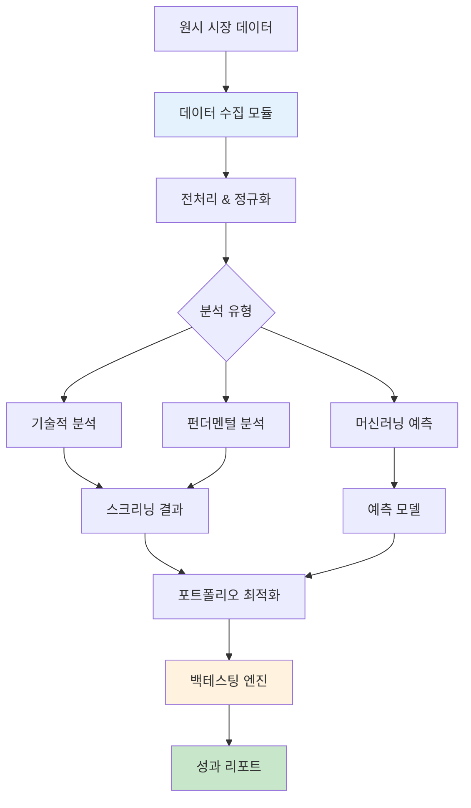
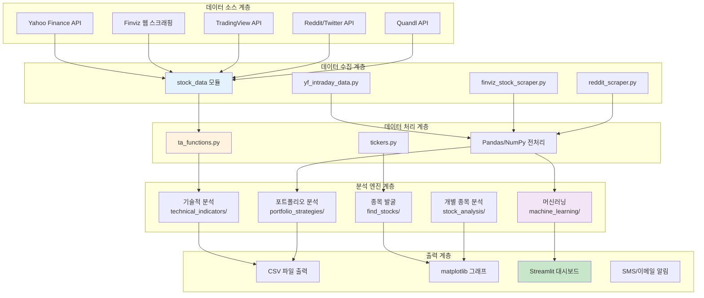
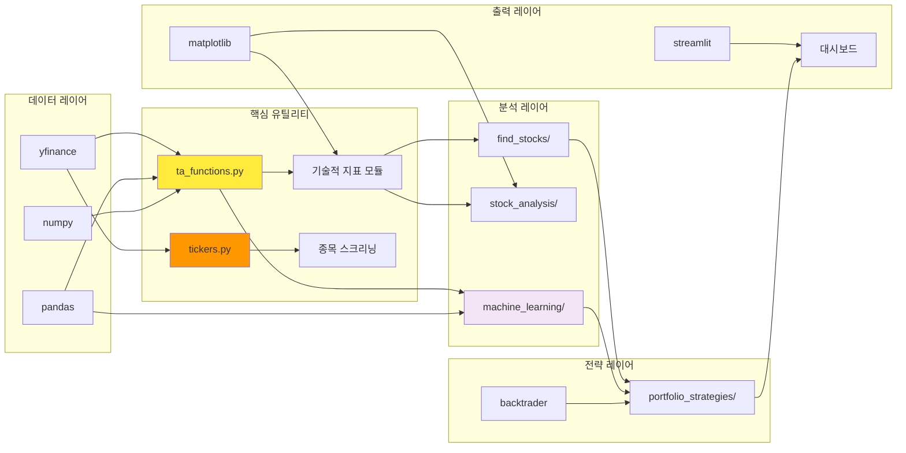
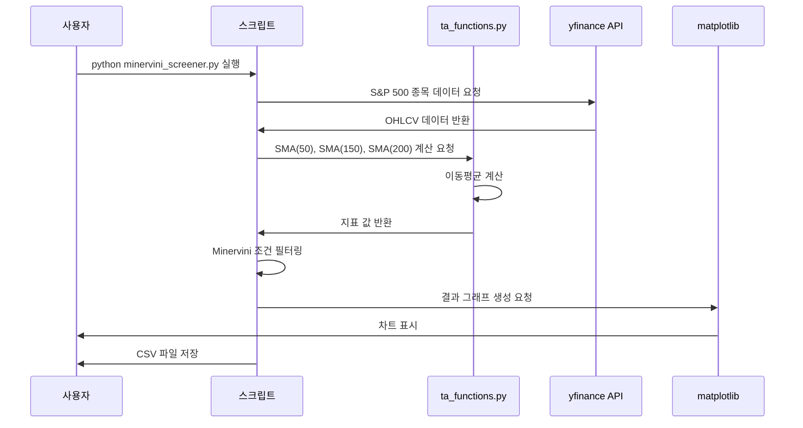
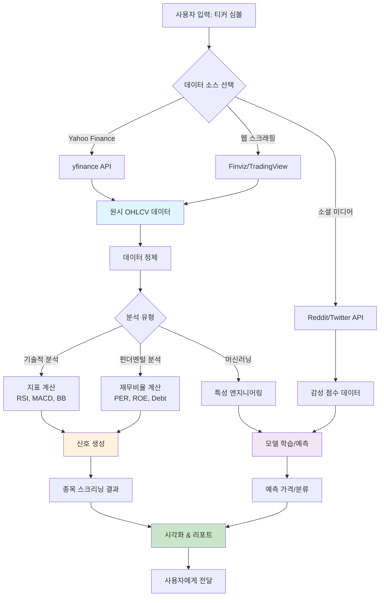
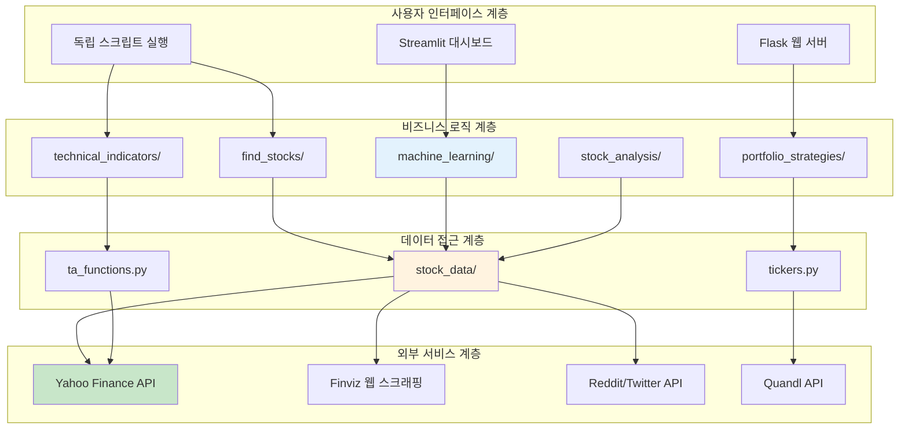
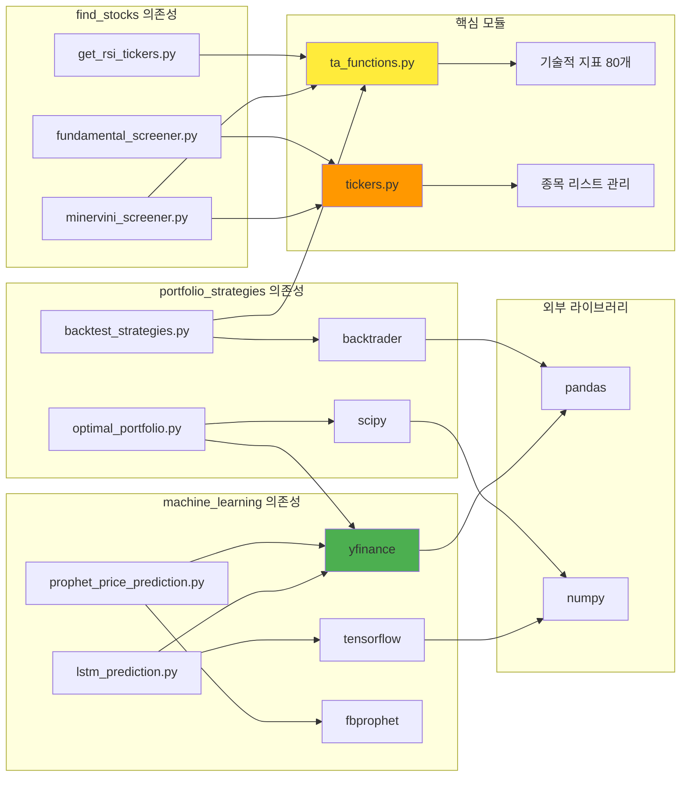

# Finance: 파이썬 금융 분석 도구 모음 종합 기술 문서

## 📋 목차
1. [프로젝트 개요](#프로젝트-개요)
2. [기술 아키텍처](#기술-아키텍처)
3. [프로젝트 구조](#프로젝트-구조)
4. [설치 및 설정](#설치-및-설정)
5. [사용 가이드](#사용-가이드)
6. [개발 지침](#개발-지침)
7. [추가 정보](#추가-정보)

---

## 프로젝트 개요

### 🎯 프로젝트 목적과 기능

**Finance**는 주식 시장 데이터를 수집, 조작, 분석하기 위한 **150개 이상의 독립형 Python 프로그램 모음**입니다. 이 프로젝트는 개인 투자자, 퀀트 트레이더, 금융 연구자들이 기술적 분석, 펀더멘털 분석, 머신러닝 예측, 포트폴리오 최적화 등을 수행할 수 있도록 지원합니다.

#### 핵심 기능
- **종목 스크리닝**: 기술적/펀더멘털 기준으로 투자 후보 종목 발굴
- **기술적 지표**: 80개 이상의 기술적 지표 시각화 및 계산
- **머신러닝 분석**: LSTM, Prophet, ARIMA 등 다양한 ML 모델 적용
- **포트폴리오 전략**: 백테스팅, 몬테카를로 시뮬레이션, 최적 포트폴리오 구성
- **데이터 수집**: Yahoo Finance, Finviz, TradingView 등 다양한 소스 지원
- **웹 스크래핑**: 뉴스, 내부자 거래, 추천 등 비정형 데이터 수집

### 🔍 문제 정의

개인 투자자들은 다음과 같은 어려움에 직면합니다:
1. **데이터 접근성**: 실시간 시장 데이터와 펀더멘털 데이터 확보의 어려움
2. **분석 도구 부재**: 고가의 Bloomberg/Reuters 터미널 없이 전문적 분석 수행 한계
3. **복잡한 기술적 지표**: RSI, MACD, Bollinger Bands 등의 수동 계산 어려움
4. **백테스팅 환경**: 전략 검증을 위한 신뢰할 수 있는 백테스팅 도구 부족
5. **머신러닝 진입장벽**: 금융 데이터에 ML 적용을 위한 전문 지식 요구

### 💡 해결 방법

Finance 프로젝트는 **모듈형 아키텍처**와 **독립 실행 가능한 스크립트** 방식으로 문제를 해결합니다:



**핵심 설계 원칙**:
1. **독립성**: 각 스크립트가 독립적으로 실행 가능 (상호 의존성 최소화)
2. **재사용성**: 공통 기능은 `ta_functions.py` 등 유틸리티 모듈로 추출
3. **확장성**: 새로운 지표나 전략을 쉽게 추가 가능한 모듈 구조
4. **무료 데이터**: Yahoo Finance, Finviz 등 무료 API 활용

### 🚀 핵심 기능 상세

#### 1. 종목 발굴 시스템 (find_stocks)
```python
# Minervini 추세 템플릿 스크리너 예시
- 현재가 > 150일 MA > 200일 MA
- 150일 MA가 200일 MA보다 상승 추세
- 현재가가 52주 최저가 대비 30% 이상 상승
- RS Rating 70 이상 (상대 강도 순위)
```

주요 스크리너:
- **Minervini Screener**: 추세 템플릿 기반 성장주 발굴
- **Fundamental Screener**: PER, PBR, ROE 등 펀더멘털 필터링
- **RSI Screener**: 과매수/과매도 구간 종목 탐색
- **Green Line Test**: 브레이크아웃 패턴 감지
- **Twitter/Reddit Screener**: 소셜 미디어 감성 분석

#### 2. 80개 이상의 기술적 지표 (technical_indicators)
```python
# 주요 지표 카테고리
추세 지표: SMA, EMA, WMA, VWAP, Supertrend
모멘텀: RSI, Stochastic, CCI, Williams %R
변동성: Bollinger Bands, ATR, Keltner Channel
거래량: OBV, MFI, VPCI, Chaikin Money Flow
복합 지표: Ichimoku Cloud, Parabolic SAR, Donchian Channel
```

#### 3. 머신러닝 예측 모델 (machine_learning)
```python
시계열 모델:
- LSTM (Long Short-Term Memory): 딥러닝 기반 가격 예측
- Prophet: Facebook의 시계열 분석 라이브러리
- ARIMA: 자기회귀 통합 이동평균 모델

분류/회귀 모델:
- Random Forest, Gradient Boosting
- Neural Networks (TensorFlow/Keras)
- Isolation Forest (이상치 탐지)

고급 분석:
- K-Means Clustering: 종목 군집화
- PCA Analysis: 주성분 분석
- Graphical Lasso: ETF 간 연관성 분석
```

#### 4. 포트폴리오 전략 (portfolio_strategies)
```python
백테스팅:
- Backtrader 기반 전략 시뮬레이션
- EMA 크로스오버, 볼린저 밴드 등 기본 전략
- Pyfolio를 통한 성과 분석

최적화:
- 효율적 투자선(Efficient Frontier) 계산
- 샤프 비율 최대화 포트폴리오
- Monte Carlo 시뮬레이션

리스크 관리:
- 페어 트레이딩 전략
- 달러 평균 비용(DCA) 분석
- 기하학적 브라운 운동 모델링
```

### 👥 대상 사용자 및 사용 사례

#### 주요 사용자 그룹
1. **개인 투자자**: 종목 발굴과 포트폴리오 관리
2. **퀀트 트레이더**: 알고리즘 트레이딩 전략 개발 및 백테스팅
3. **금융 학생/연구자**: 금융 데이터 분석 학습 및 연구
4. **데이터 분석가**: 시장 데이터 수집 및 시각화
5. **핀테크 스타트업**: 프로토타입 개발을 위한 코드 레퍼런스

#### 구체적 사용 사례

**사례 1: 성장주 발굴 워크플로우**
```bash
# 1단계: Minervini 기준으로 후보 종목 필터링
python find_stocks/minervini_screener.py

# 2단계: 후보 종목의 기술적 지표 시각화
python technical_indicators/RSI.py --ticker AAPL
python technical_indicators/MACD.py --ticker AAPL

# 3단계: 뉴스 감성 분석
python find_stocks/stock_news_sentiment.py --ticker AAPL

# 4단계: ML 모델로 단기 가격 예측
python machine_learning/lstm_prediction.py --ticker AAPL
```

**사례 2: 포트폴리오 최적화**
```bash
# 1단계: 보유 종목 상관관계 분석
python find_stocks/correlated_stocks.py

# 2단계: 효율적 투자선 계산
python portfolio_strategies/optimal_portfolio.py

# 3단계: Monte Carlo로 미래 수익률 시뮬레이션
python portfolio_strategies/monte_carlo.py

# 4단계: 백테스팅
python portfolio_strategies/backtest_strategies.py
```

**사례 3: 데이터 수집 자동화**
```bash
# Finviz에서 내부자 거래 정보 스크래핑
python stock_data/finviz_insider_trades.py

# Reddit에서 언급 빈도 높은 종목 추출
python stock_data/reddit_scraper.py

# 실시간 가격 데이터를 SMS로 알림
python stock_data/stock_data_sms.py
```

---

## 기술 아키텍처

### 🏗️ 고수준 시스템 아키텍처



### 🔧 기술 스택

#### 핵심 라이브러리

**데이터 수집 및 처리**
```python
yfinance==0.2.33              # Yahoo Finance 데이터 API
pandas_datareader==0.10.0     # 다양한 금융 데이터 소스
pandas==2.0.3                 # 데이터프레임 처리
numpy==1.24.3                 # 수치 연산
```

**기술적 분석**
```python
ta==0.10.2                    # Technical Analysis 라이브러리
mplfinance==0.12.10b0         # 캔들스틱 차트
matplotlib==3.7.2             # 데이터 시각화
seaborn==0.13.1               # 통계적 시각화
```

**머신러닝 및 예측**
```python
scikit_learn==1.3.0           # 전통적 ML 알고리즘
tensorflow==2.15.0            # 딥러닝 프레임워크
keras==3.0.2                  # 고수준 신경망 API
fbprophet==0.7.1              # 시계열 예측 (Facebook)
pmdarima==2.0.4               # ARIMA 모델 자동화
statsmodels==0.14.0           # 통계 모델
```

**백테스팅 및 포트폴리오**
```python
backtrader==1.9.78.123        # 트레이딩 전략 백테스팅
pyfolio==0.9.2                # 포트폴리오 성과 분석
scipy==1.11.4                 # 최적화 알고리즘
numpy_financial==1.0.0        # 금융 계산
```

**웹 스크래핑**
```python
beautifulsoup4==4.12.2        # HTML 파싱
selenium==4.16.0              # 동적 웹 스크래핑
autoscraper==1.1.14           # 자동 웹 스크래핑
lxml==4.9.3                   # XML/HTML 처리
```

**소셜 미디어 및 감성 분석**
```python
praw==7.7.1                   # Reddit API
tweepy==4.14.0                # Twitter API
vaderSentiment==3.3.2         # 감성 분석
textblob==0.17.1              # 텍스트 처리
nltk==3.9                     # 자연어 처리
```

**알림 및 배포**
```python
twilio==8.11.0                # SMS 알림
Flask==2.2.2                  # 웹 서버
streamlit==1.37.0             # 대시보드 구축
schedule==1.2.1               # 작업 스케줄링
```

### 🔗 종속성 관계



### 🎨 디자인 패턴

#### 1. 스크립트 독립성 패턴
각 Python 파일이 독립적으로 실행 가능하도록 설계:

```python
# 전형적인 스크립트 구조
if __name__ == "__main__":
    # 메인 로직: 외부 의존성 최소화
    ticker = "AAPL"
    data = yf.download(ticker, start, end)
    result = analyze(data)
    visualize(result)
```

**장점**:
- 사용자가 필요한 기능만 선택적으로 실행 가능
- 의존성 충돌 최소화
- 학습 곡선 완만 (한 번에 하나의 스크립트만 이해)

#### 2. 유틸리티 모듈 패턴
공통 함수는 `ta_functions.py`에 중앙화:

```python
# ta_functions.py
def SMA(data, timeperiod=14):
    return data.rolling(window=timeperiod).mean()

def RSI(data, timeperiod=14):
    delta = data.diff()
    gain = delta.where(delta > 0, 0)
    loss = -delta.where(delta < 0, 0)
    avg_gain = gain.rolling(window=timeperiod).mean()
    avg_loss = loss.rolling(window=timeperiod).mean()
    rs = avg_gain / avg_loss
    return 100 - (100 / (1 + rs))
```

#### 3. 데이터 파이프라인 패턴
데이터 수집 → 전처리 → 분석 → 시각화 흐름:

```python
# 표준 파이프라인 구조
def fetch_data(ticker):
    """1단계: 데이터 수집"""
    return yf.download(ticker, ...)

def preprocess(data):
    """2단계: 전처리"""
    data['Returns'] = data['Adj Close'].pct_change()
    data.dropna(inplace=True)
    return data

def analyze(data):
    """3단계: 분석 로직"""
    data['RSI'] = RSI(data['Close'])
    data['Signal'] = data['RSI'].apply(lambda x: 'Buy' if x < 30 else 'Sell' if x > 70 else 'Hold')
    return data

def visualize(data):
    """4단계: 시각화"""
    plt.plot(data['Close'])
    plt.show()
```

### ⚙️ 아키텍처 결정사항

#### 1. 독립 스크립트 vs. 통합 패키지
**결정**: 독립 스크립트 방식 채택

**이유**:
- 사용자가 전체 프레임워크를 이해하지 않아도 특정 기능 사용 가능
- 신규 기능 추가 시 기존 코드 영향 최소화
- 교육 목적으로 각 스크립트가 독립적인 예제 역할

**트레이드오프**:
- 코드 중복 발생 가능 (→ `ta_functions.py`로 완화)
- 전체 시스템 통합 시 수동 작업 필요

#### 2. 무료 데이터 소스 우선
**결정**: Yahoo Finance, Finviz 등 무료 API 활용

**이유**:
- 사용자 진입장벽 최소화 (API 키 불필요)
- 교육/연구 목적에 적합
- 개인 투자자에게 실용적

**한계**:
- 실시간 데이터 정확도 제한
- API 변경 시 스크립트 수정 필요 (예: Yahoo Finance API 변경)

#### 3. Backtrader 백테스팅 엔진 채택
**결정**: Backtrader를 표준 백테스팅 라이브러리로 사용

**이유**:
- 유연한 전략 정의 가능
- 다양한 주문 유형 지원 (시장가, 지정가, 스탑로스)
- Pyfolio와 통합하여 성과 분석 자동화

```python
class MyStrategy(bt.Strategy):
    def next(self):
        if self.data.close[0] > self.sma[0]:
            self.buy()
        elif self.data.close[0] < self.sma[0]:
            self.sell()
```

### 🔄 구성 요소 상호작용



### 📊 데이터 흐름



---

## 프로젝트 구조

### 📁 디렉토리별 설명

```
Finance/
├── find_stocks/                  # 종목 발굴 스크리너 (12개 스크립트)
│   ├── minervini_screener.py    # Minervini 추세 템플릿 기반 성장주 발굴
│   ├── fundamental_screener.py  # PER, PBR, ROE 등 펀더멘털 필터링
│   ├── get_rsi_tickers.py       # RSI 기반 과매수/과매도 종목 탐색
│   ├── green_line_values.py     # 브레이크아웃 패턴 감지
│   ├── stock_news_sentiment.py  # 뉴스 감성 분석
│   ├── twitter_screener.py      # 트위터 언급 빈도 분석
│   └── ...
│
├── technical_indicators/         # 80개 이상의 기술적 지표 시각화
│   ├── RSI.py                   # 상대강도지수
│   ├── MACD.py                  # 이동평균 수렴확산
│   ├── bollinger_bands.py       # 볼린저 밴드
│   ├── stochastic_*.py          # 스토캐스틱 오실레이터 (Fast/Slow/Full)
│   ├── fibonacci_retracement.py # 피보나치 되돌림
│   ├── ichimoku_cloud.py        # 일목균형표
│   └── ...
│
├── machine_learning/             # 머신러닝 기반 예측 모델 (13개)
│   ├── lstm_prediction.py       # LSTM 딥러닝 가격 예측
│   ├── prophet_price_prediction.py  # Facebook Prophet 시계열 분석
│   ├── arima_time_series.py     # ARIMA 모델
│   ├── sklearn_trading_bot.py   # Isolation Forest 기반 이상치 트레이딩
│   ├── kmeans_clustering.py     # 종목 군집화
│   ├── sp500_pca_analysis.py    # 주성분 분석
│   └── ...
│
├── portfolio_strategies/         # 포트폴리오 전략 및 백테스팅 (24개)
│   ├── backtest_strategies.py   # 다양한 전략 백테스팅
│   ├── optimal_portfolio.py     # 효율적 투자선 계산
│   ├── monte_carlo.py           # 몬테카를로 시뮬레이션
│   ├── pairs_trading.py         # 페어 트레이딩 전략
│   ├── ema_crossover_strategy.py  # EMA 크로스오버
│   └── ...
│
├── stock_data/                   # 데이터 수집 도구 (24개)
│   ├── yf_intraday_data.py      # Yahoo Finance 일중 데이터
│   ├── finviz_stock_scraper.py  # Finviz 종목 데이터 스크래핑
│   ├── reddit_scraper.py        # Reddit 종목 언급 수집
│   ├── dividend_history.py      # 배당 이력 조회
│   ├── finviz_insider_trades.py # 내부자 거래 정보
│   ├── stock_data_sms.py        # SMS 가격 알림
│   └── ...
│
├── stock_analysis/               # 개별 종목 심층 분석 (18개)
│   ├── correlation_matrix.py    # 종목 간 상관관계 분석
│   ├── earnings_analysis.py     # 실적 발표 분석
│   ├── options_analysis.py      # 옵션 체인 분석
│   └── ...
│
├── ta_functions.py               # 공통 기술적 지표 함수 라이브러리
├── tickers.py                    # 티커 심볼 유틸리티
├── requirements.txt              # 의존성 목록 (47개 패키지)
├── *_tickers.csv                 # S&P 500, NASDAQ, NYSE 등 티커 목록
├── chromedriver                  # Selenium 웹드라이버
└── README.md                     # 프로젝트 문서
```

### 🏗️ 파일 구성의 근거

#### 1. 기능별 모듈 분리
각 디렉토리는 명확한 단일 책임을 가짐:
- `find_stocks/`: 종목 발굴 (Input: 시장 → Output: 후보 종목 리스트)
- `technical_indicators/`: 지표 계산 및 시각화 (Input: 종목 → Output: 차트)
- `machine_learning/`: 예측 모델 (Input: 과거 데이터 → Output: 미래 예측)
- `portfolio_strategies/`: 포트폴리오 최적화 (Input: 종목 조합 → Output: 가중치)

#### 2. 독립 실행 가능한 스크립트
모든 `.py` 파일이 `if __name__ == "__main__":` 블록을 포함:
```python
# 예시: find_stocks/minervini_screener.py
if __name__ == "__main__":
    # 독립적으로 실행 가능
    tickers = ti.tickers_sp500()
    for stock in tickers:
        analyze_and_screen(stock)
```

#### 3. 공통 유틸리티 중앙화
- `ta_functions.py`: SMA, EMA, RSI, BBANDS 등 재사용 함수
- `tickers.py`: S&P 500, NASDAQ 티커 로딩 함수
- `*_tickers.csv`: 사전 정의된 종목 목록 (API 호출 최소화)

### 🌳 프로젝트 계층 구조



### 📦 모듈 상호 의존성



### 📄 주요 파일 상세

#### ta_functions.py (334줄)
공통 기술적 지표 함수 라이브러리:
```python
함수 목록:
- SMA(), EMA(), WMA(): 이동평균
- RSI(), CCI(), Williams_R(): 모멘텀 지표
- BBANDS(), ATR(), Keltner_Channel(): 변동성 지표
- MACD(), Stochastic(), ADX(): 복합 지표
- OBV(), MFI(), CMF(): 거래량 지표
```

**설계 원칙**:
- 모든 함수가 pandas Series/DataFrame을 입력으로 받음
- NumPy 벡터 연산 활용으로 성능 최적화
- 타사 라이브러리(`ta-lib`)와 호환되는 함수 시그니처

#### tickers.py (60줄)
주요 지수의 구성 종목 로딩:
```python
def tickers_sp500():
    """S&P 500 종목 리스트 반환"""
    return pd.read_csv('s&p500_tickers.csv')['Symbol'].tolist()

def tickers_nasdaq():
    """NASDAQ 전체 종목 리스트 반환"""
    return pd.read_csv('nasdaq_tickers.csv')['Symbol'].tolist()
```

#### 티커 CSV 파일
- `s&p500_tickers.csv`: 503개 종목
- `nasdaq_tickers.csv`: 3,300개 종목
- `nyse_tickers.csv`: 2,800개 종목
- `russell3000_tickers.csv`: 3,000개 종목

---

## 설치 및 설정

### 📋 전제 조건

#### 시스템 요구사항
- **운영체제**: Windows 10+, macOS 10.14+, Linux (Ubuntu 18.04+)
- **Python**: 3.8 이상 (권장: 3.10)
- **메모리**: 최소 4GB RAM (머신러닝 사용 시 8GB+ 권장)
- **저장 공간**: 2GB 여유 공간 (데이터 캐시 포함)
- **네트워크**: 인터넷 연결 (API 데이터 수집 필요)

#### 소프트웨어 의존성

**필수**:
```bash
Python >= 3.8
pip >= 21.0
```

**선택 (웹 스크래핑 시)**:
```bash
Chrome/Chromium 브라우저 (Selenium용)
ChromeDriver (자동 다운로드 가능)
```

**선택 (SMS 알림 시)**:
```bash
Twilio 계정 (무료 티어 가능)
```

### 🚀 단계별 설치 가이드

#### 1. 저장소 클론
```bash
git clone https://github.com/shashankvemuri/Finance.git
cd Finance
```

#### 2. 가상환경 생성 (권장)
```bash
# Windows
python -m venv venv
venv\Scripts\activate

# macOS/Linux
python3 -m venv venv
source venv/bin/activate
```

#### 3. 의존성 설치
```bash
# 전체 패키지 설치 (권장)
pip install -r requirements.txt

# 또는 선택적 설치 (용도별)
pip install yfinance pandas numpy matplotlib  # 기본 분석
pip install scikit-learn tensorflow keras     # 머신러닝
pip install backtrader pyfolio                # 백테스팅
pip install beautifulsoup4 selenium           # 웹 스크래핑
```

**설치 시간**: 일반적으로 5-10분 소요 (인터넷 속도에 따라)

#### 4. 설치 확인
```bash
python -c "import yfinance; import pandas; import numpy; print('설치 완료!')"
```

### ⚙️ 구성 지침

#### 1. API 키 설정 (선택사항)

**Quandl API (경제 데이터)**:
```python
# 스크립트 상단에 추가
import quandl
quandl.ApiConfig.api_key = "YOUR_QUANDL_API_KEY"
```

무료 키 획득: https://www.quandl.com/sign-up

**Twilio SMS (가격 알림)**:
```python
# stock_data/stock_data_sms.py 수정
account_sid = "YOUR_TWILIO_ACCOUNT_SID"
auth_token = "YOUR_TWILIO_AUTH_TOKEN"
from_number = "+1234567890"  # Twilio 번호
to_number = "+0987654321"    # 수신 번호
```

**Reddit API (소셜 분석)**:
```python
# stock_data/reddit_scraper.py 수정
reddit = praw.Reddit(
    client_id="YOUR_CLIENT_ID",
    client_secret="YOUR_CLIENT_SECRET",
    user_agent="YOUR_USER_AGENT"
)
```

무료 키 획득: https://www.reddit.com/prefs/apps

#### 2. 티커 심볼 목록 업데이트

S&P 500 목록은 주기적으로 변경됩니다:
```python
# tickers.py 실행하여 최신 목록 다운로드
python tickers.py --update-sp500
```

또는 수동으로 CSV 편집:
```csv
Symbol,Name,Sector
AAPL,Apple Inc.,Technology
MSFT,Microsoft Corporation,Technology
```

#### 3. 웹드라이버 설정 (Selenium 사용 시)

**자동 설정 (권장)**:
```python
from selenium import webdriver
from webdriver_manager.chrome import ChromeDriverManager

driver = webdriver.Chrome(ChromeDriverManager().install())
```

**수동 설정**:
1. ChromeDriver 다운로드: https://chromedriver.chromium.org/
2. 프로젝트 루트에 `chromedriver` 배치
3. 실행 권한 부여 (macOS/Linux):
   ```bash
   chmod +x chromedriver
   ```

### 🔧 일반적인 문제 해결

#### 문제 1: yfinance 데이터 다운로드 실패
**증상**:
```
ValueError: No data found, symbol may be delisted
```

**해결책**:
```python
# yfinance 최신 버전 설치
pip install --upgrade yfinance

# 티커 심볼 확인 (Yahoo Finance 웹사이트에서)
# 예: Berkshire Hathaway는 "BRK-B" (점이 아닌 하이픈)
```

#### 문제 2: TensorFlow/Keras 설치 오류
**증상** (Windows):
```
Could not find a version that satisfies the requirement tensorflow
```

**해결책**:
```bash
# Python 3.10 사용 (3.11+는 TensorFlow 미지원)
# 또는 conda 사용
conda install tensorflow
```

#### 문제 3: Pandas FutureWarning
**증상**:
```
FutureWarning: DataFrame.append is deprecated
```

**해결책**:
```python
# 구버전 코드
df = df.append(new_row, ignore_index=True)

# 수정된 코드
df = pd.concat([df, pd.DataFrame([new_row])], ignore_index=True)
```

#### 문제 4: BeautifulSoup 파싱 오류
**증상**:
```
AttributeError: 'NoneType' object has no attribute 'text'
```

**해결책**:
```python
# 웹사이트 구조 변경 확인
# 브라우저 개발자 도구로 HTML 구조 재확인
element = soup.find('div', class_='target-class')
if element:
    text = element.text
else:
    print("요소를 찾을 수 없습니다. HTML 구조가 변경되었을 수 있습니다.")
```

#### 문제 5: 메모리 부족 (대용량 데이터 처리)
**증상**:
```
MemoryError: Unable to allocate array
```

**해결책**:
```python
# 청크 단위 처리
chunk_size = 1000
for chunk in pd.read_csv('large_file.csv', chunksize=chunk_size):
    process(chunk)

# 또는 데이터 타입 최적화
df['Price'] = df['Price'].astype('float32')  # float64 대신
```

### 📊 설치 검증 체크리스트

```bash
# 1. 기본 데이터 수집 테스트
python -c "import yfinance as yf; print(yf.download('AAPL', period='5d'))"

# 2. 기술적 지표 계산 테스트
python technical_indicators/RSI.py

# 3. 머신러닝 라이브러리 테스트
python -c "import tensorflow; import sklearn; print('ML 라이브러리 정상')"

# 4. 백테스팅 테스트
python portfolio_strategies/backtest_strategies.py

# 5. 웹 스크래핑 테스트 (선택)
python stock_data/finviz_stock_scraper.py
```

모든 테스트 통과 시 설치 완료!

---

## 사용 가이드

### 🎯 기본 사용 예제

#### 예제 1: 특정 종목의 RSI 지표 시각화
```python
# technical_indicators/RSI.py 실행
import yfinance as yf
import matplotlib.pyplot as plt
from ta_functions import RSI

# 데이터 수집
ticker = "AAPL"
data = yf.download(ticker, period="6mo")

# RSI 계산
data['RSI'] = RSI(data['Close'], timeperiod=14)

# 시각화
fig, (ax1, ax2) = plt.subplots(2, 1, figsize=(12, 8), sharex=True)

# 가격 차트
ax1.plot(data['Close'], label='Close Price', color='blue')
ax1.set_ylabel('Price ($)')
ax1.legend()
ax1.grid(True)

# RSI 차트
ax2.plot(data['RSI'], label='RSI (14)', color='purple')
ax2.axhline(70, color='red', linestyle='--', label='Overbought (70)')
ax2.axhline(30, color='green', linestyle='--', label='Oversold (30)')
ax2.set_ylabel('RSI')
ax2.set_xlabel('Date')
ax2.legend()
ax2.grid(True)

plt.tight_layout()
plt.show()
```

**출력**:
- 상단: 주가 차트
- 하단: RSI 지표 (과매수/과매도 구간 표시)

#### 예제 2: Minervini 스크리너로 성장주 발굴
```python
# find_stocks/minervini_screener.py 실행
import pandas as pd
import yfinance as yf
from datetime import datetime, timedelta
import tickers as ti

# S&P 500 종목 가져오기
tickers_list = ti.tickers_sp500()

# 기간 설정
end_date = datetime.now()
start_date = end_date - timedelta(days=365)

# 스크리닝 결과 저장용
results = []

for ticker in tickers_list:
    try:
        # 데이터 다운로드
        df = yf.download(ticker, start=start_date, end=end_date, progress=False)

        # 이동평균 계산
        df['SMA_50'] = df['Close'].rolling(window=50).mean()
        df['SMA_150'] = df['SMA_50'].rolling(window=150).mean()
        df['SMA_200'] = df['Close'].rolling(window=200).mean()

        # 최근 데이터
        current_price = df['Close'].iloc[-1]
        sma_50 = df['SMA_50'].iloc[-1]
        sma_150 = df['SMA_150'].iloc[-1]
        sma_200 = df['SMA_200'].iloc[-1]

        # 52주 최고/최저
        high_52w = df['High'].rolling(window=260).max().iloc[-1]
        low_52w = df['Low'].rolling(window=260).min().iloc[-1]

        # Minervini 조건 체크
        conditions = [
            current_price > sma_150 > sma_200,  # 추세 조건
            sma_150 > df['SMA_150'].iloc[-20],  # 150일 MA 상승 추세
            current_price > sma_50,              # 단기 추세
            current_price >= 1.3 * low_52w,     # 52주 최저 대비 30% 이상
            current_price >= 0.75 * high_52w    # 52주 최고 대비 25% 이내
        ]

        if all(conditions):
            results.append({
                'Ticker': ticker,
                'Price': current_price,
                'SMA_50': sma_50,
                'SMA_150': sma_150,
                'SMA_200': sma_200,
                '52W_High': high_52w,
                '52W_Low': low_52w
            })
            print(f"✓ {ticker} - Minervini 조건 통과")

    except Exception as e:
        print(f"✗ {ticker} - 오류: {e}")

# 결과 저장
results_df = pd.DataFrame(results)
results_df.to_csv('minervini_results.csv', index=False)
print(f"\n총 {len(results)}개 종목 발견!")
print(results_df)
```

**출력 예시**:
```
✓ NVDA - Minervini 조건 통과
✓ MSFT - Minervini 조건 통과
✗ AAPL - 조건 3번 미충족

총 37개 종목 발견!
   Ticker   Price  SMA_50  SMA_150  SMA_200  52W_High  52W_Low
0    NVDA  485.50  470.23   450.12   420.34    502.00   280.00
1    MSFT  378.90  365.78   355.67   340.23    390.50   250.00
```

#### 예제 3: LSTM으로 주가 예측
```python
# machine_learning/lstm_prediction.py
import yfinance as yf
import numpy as np
from sklearn.preprocessing import MinMaxScaler
from tensorflow.keras.models import Sequential
from tensorflow.keras.layers import LSTM, Dense, Dropout
import matplotlib.pyplot as plt

# 1. 데이터 준비
ticker = "TSLA"
data = yf.download(ticker, period="2y")
prices = data['Close'].values.reshape(-1, 1)

# 정규화
scaler = MinMaxScaler()
scaled_prices = scaler.fit_transform(prices)

# 시퀀스 생성 (60일 -> 1일 예측)
def create_sequences(data, seq_length=60):
    X, y = [], []
    for i in range(len(data) - seq_length):
        X.append(data[i:i+seq_length])
        y.append(data[i+seq_length])
    return np.array(X), np.array(y)

X, y = create_sequences(scaled_prices)

# 훈련/테스트 분할 (80:20)
split = int(0.8 * len(X))
X_train, X_test = X[:split], X[split:]
y_train, y_test = y[:split], y[split:]

# 2. 모델 구축
model = Sequential([
    LSTM(50, return_sequences=True, input_shape=(X_train.shape[1], 1)),
    Dropout(0.2),
    LSTM(50, return_sequences=False),
    Dropout(0.2),
    Dense(25),
    Dense(1)
])

model.compile(optimizer='adam', loss='mean_squared_error')

# 3. 학습
print("모델 학습 중...")
history = model.fit(
    X_train, y_train,
    batch_size=32,
    epochs=50,
    validation_data=(X_test, y_test),
    verbose=1
)

# 4. 예측
predictions = model.predict(X_test)
predictions = scaler.inverse_transform(predictions)
y_test_actual = scaler.inverse_transform(y_test)

# 5. 시각화
plt.figure(figsize=(14, 6))
plt.plot(y_test_actual, label='Actual Price', color='blue')
plt.plot(predictions, label='Predicted Price', color='red', alpha=0.7)
plt.title(f'{ticker} Stock Price Prediction (LSTM)')
plt.xlabel('Days')
plt.ylabel('Price ($)')
plt.legend()
plt.grid(True)
plt.show()

# 정확도 평가
mse = np.mean((predictions - y_test_actual)**2)
rmse = np.sqrt(mse)
print(f"RMSE: ${rmse:.2f}")
```

#### 예제 4: 포트폴리오 최적화
```python
# portfolio_strategies/optimal_portfolio.py
import yfinance as yf
import numpy as np
import pandas as pd
from scipy.optimize import minimize
import matplotlib.pyplot as plt

# 1. 포트폴리오 종목 설정
tickers = ['AAPL', 'MSFT', 'GOOGL', 'AMZN', 'TSLA']
data = yf.download(tickers, period='2y')['Adj Close']

# 2. 수익률 계산
returns = data.pct_change().dropna()

# 3. 포트폴리오 성과 함수
def portfolio_performance(weights, mean_returns, cov_matrix):
    portfolio_return = np.sum(mean_returns * weights) * 252
    portfolio_std = np.sqrt(np.dot(weights.T, np.dot(cov_matrix, weights))) * np.sqrt(252)
    sharpe_ratio = portfolio_return / portfolio_std
    return portfolio_return, portfolio_std, sharpe_ratio

# 4. 샤프 비율 음수 (최소화 목적)
def neg_sharpe_ratio(weights, mean_returns, cov_matrix):
    return -portfolio_performance(weights, mean_returns, cov_matrix)[2]

# 5. 최적화 제약조건
constraints = {'type': 'eq', 'fun': lambda x: np.sum(x) - 1}  # 가중치 합 = 1
bounds = tuple((0, 1) for _ in range(len(tickers)))  # 0 <= 가중치 <= 1

# 6. 최적 포트폴리오 계산
mean_returns = returns.mean()
cov_matrix = returns.cov()

initial_weights = np.array([1/len(tickers)] * len(tickers))
optimized = minimize(
    neg_sharpe_ratio,
    initial_weights,
    args=(mean_returns, cov_matrix),
    method='SLSQP',
    bounds=bounds,
    constraints=constraints
)

optimal_weights = optimized.x

# 7. 결과 출력
ret, std, sharpe = portfolio_performance(optimal_weights, mean_returns, cov_matrix)
print("=== 최적 포트폴리오 ===")
for ticker, weight in zip(tickers, optimal_weights):
    print(f"{ticker}: {weight*100:.2f}%")
print(f"\n연간 예상 수익률: {ret*100:.2f}%")
print(f"연간 변동성: {std*100:.2f}%")
print(f"샤프 비율: {sharpe:.2f}")

# 8. 효율적 투자선 시각화
portfolio_returns = []
portfolio_risks = []

for _ in range(10000):
    random_weights = np.random.random(len(tickers))
    random_weights /= np.sum(random_weights)
    ret, std, _ = portfolio_performance(random_weights, mean_returns, cov_matrix)
    portfolio_returns.append(ret)
    portfolio_risks.append(std)

plt.figure(figsize=(12, 8))
plt.scatter(portfolio_risks, portfolio_returns, c=np.array(portfolio_returns)/np.array(portfolio_risks),
            marker='o', alpha=0.3, cmap='viridis')
plt.scatter(std, ret, marker='*', color='red', s=500, label='Optimal Portfolio')
plt.colorbar(label='Sharpe Ratio')
plt.xlabel('Volatility (Risk)')
plt.ylabel('Return')
plt.title('Efficient Frontier')
plt.legend()
plt.grid(True)
plt.show()
```

### 🔧 고급 기능

#### 1. 커스텀 기술적 지표 생성
```python
# ta_functions.py에 새로운 지표 추가
def Custom_Momentum_Indicator(close, volume, period=14):
    """
    가격 변화율과 거래량을 결합한 커스텀 모멘텀 지표
    """
    price_change = close.pct_change()
    volume_change = volume.pct_change()

    # 가격 변화와 거래량 변화의 가중 평균
    momentum = (price_change * 0.7 + volume_change * 0.3).rolling(window=period).mean()

    return momentum * 100  # 퍼센트로 변환
```

#### 2. 백테스팅 전략 커스터마이징
```python
# portfolio_strategies/custom_strategy.py
import backtrader as bt

class MyCustomStrategy(bt.Strategy):
    params = (
        ('rsi_period', 14),
        ('rsi_oversold', 30),
        ('rsi_overbought', 70),
        ('stop_loss', 0.05),  # 5% 손절
    )

    def __init__(self):
        self.rsi = bt.indicators.RSI(self.data.close, period=self.params.rsi_period)
        self.order = None
        self.buy_price = None

    def next(self):
        # 포지션 없을 때: 매수 조건 확인
        if not self.position:
            if self.rsi < self.params.rsi_oversold:
                self.order = self.buy()
                self.buy_price = self.data.close[0]
                print(f"BUY at ${self.buy_price:.2f}, RSI={self.rsi[0]:.2f}")

        # 포지션 있을 때: 매도 조건 확인
        else:
            # 손절 조건
            if self.data.close[0] < self.buy_price * (1 - self.params.stop_loss):
                self.order = self.sell()
                print(f"STOP LOSS at ${self.data.close[0]:.2f}")

            # RSI 과매수 조건
            elif self.rsi > self.params.rsi_overbought:
                self.order = self.sell()
                profit = (self.data.close[0] - self.buy_price) / self.buy_price * 100
                print(f"SELL at ${self.data.close[0]:.2f}, Profit={profit:.2f}%")

# 백테스트 실행
cerebro = bt.Cerebro()
cerebro.addstrategy(MyCustomStrategy)
data = bt.feeds.YahooFinanceData(dataname='AAPL', fromdate=datetime(2020, 1, 1), todate=datetime(2024, 1, 1))
cerebro.adddata(data)
cerebro.broker.setcash(100000)
cerebro.run()
print(f"Final Portfolio Value: ${cerebro.broker.getvalue():,.2f}")
```

#### 3. 멀티 타임프레임 분석
```python
# stock_analysis/multi_timeframe_analysis.py
import yfinance as yf
import matplotlib.pyplot as plt

ticker = "AAPL"

# 다양한 기간 데이터 수집
timeframes = {
    '1일': yf.download(ticker, period='1d', interval='5m'),
    '1주': yf.download(ticker, period='5d', interval='15m'),
    '1개월': yf.download(ticker, period='1mo', interval='1h'),
    '1년': yf.download(ticker, period='1y', interval='1d')
}

# 4개의 서브플롯
fig, axes = plt.subplots(2, 2, figsize=(16, 12))
fig.suptitle(f'{ticker} Multi-Timeframe Analysis', fontsize=16)

for idx, (period, data) in enumerate(timeframes.items()):
    ax = axes[idx // 2, idx % 2]
    ax.plot(data['Close'], label='Close Price')
    ax.set_title(f'{period} Timeframe')
    ax.set_ylabel('Price ($)')
    ax.grid(True)
    ax.legend()

plt.tight_layout()
plt.show()
```

#### 4. 소셜 미디어 감성 분석 통합
```python
# find_stocks/advanced_sentiment_analysis.py
import praw
from vaderSentiment.vaderSentiment import SentimentIntensityAnalyzer
import yfinance as yf

# Reddit API 설정
reddit = praw.Reddit(
    client_id="YOUR_CLIENT_ID",
    client_secret="YOUR_CLIENT_SECRET",
    user_agent="stock_analyzer"
)

# 감성 분석기
analyzer = SentimentIntensityAnalyzer()

def get_reddit_sentiment(ticker, limit=100):
    """Reddit에서 특정 종목 언급의 감성 점수 계산"""
    subreddit = reddit.subreddit('wallstreetbets')
    posts = subreddit.search(ticker, limit=limit)

    sentiments = []
    for post in posts:
        text = post.title + " " + post.selftext
        score = analyzer.polarity_scores(text)['compound']
        sentiments.append(score)

    avg_sentiment = sum(sentiments) / len(sentiments) if sentiments else 0
    return avg_sentiment

# 사용 예시
ticker = "GME"
sentiment = get_reddit_sentiment(ticker)
print(f"{ticker} Reddit Sentiment: {sentiment:.2f}")

if sentiment > 0.05:
    print("→ 긍정적 (Bullish)")
elif sentiment < -0.05:
    print("→ 부정적 (Bearish)")
else:
    print("→ 중립적 (Neutral)")

# 주가 데이터와 결합
price_data = yf.download(ticker, period='1mo')
print(f"Current Price: ${price_data['Close'][-1]:.2f}")
```

### ⚙️ 구성 옵션

#### 기본 설정 파일 생성 (config.py)
```python
# config.py
class Config:
    # 데이터 소스
    DEFAULT_PERIOD = "1y"
    DEFAULT_INTERVAL = "1d"

    # 기술적 지표 파라미터
    RSI_PERIOD = 14
    MACD_FAST = 12
    MACD_SLOW = 26
    MACD_SIGNAL = 9

    # 스크리닝 기준
    MIN_MARKET_CAP = 1_000_000_000  # 10억 달러
    MAX_PE_RATIO = 30
    MIN_VOLUME = 1_000_000

    # 백테스팅
    INITIAL_CAPITAL = 100000
    COMMISSION = 0.001  # 0.1%

    # API 키 (환경변수 사용 권장)
    import os
    QUANDL_API_KEY = os.getenv('QUANDL_API_KEY', '')
    TWILIO_ACCOUNT_SID = os.getenv('TWILIO_SID', '')
```

### 💻 명령줄 인터페이스 참조

대부분의 스크립트는 직접 실행 방식이지만, 일부는 인자를 받습니다:

```bash
# 기본 실행
python find_stocks/minervini_screener.py

# 티커 지정
python technical_indicators/RSI.py --ticker TSLA --period 6mo

# 여러 티커 분석
python stock_analysis/correlation_matrix.py --tickers AAPL MSFT GOOGL

# 백테스트 기간 설정
python portfolio_strategies/backtest_strategies.py --start 2020-01-01 --end 2023-12-31

# 결과 저장 경로 지정
python find_stocks/fundamental_screener.py --output results/screened_stocks.csv
```

**일반적인 플래그**:
- `--ticker, -t`: 종목 심볼
- `--period, -p`: 데이터 기간 (1d, 5d, 1mo, 3mo, 6mo, 1y, 2y, 5y, 10y, max)
- `--interval, -i`: 데이터 간격 (1m, 5m, 15m, 30m, 1h, 1d, 1wk, 1mo)
- `--output, -o`: 출력 파일 경로
- `--verbose, -v`: 상세 로그 출력

---

## 개발 지침

### 🛠️ 개발 환경 설정

#### 1. 개발용 가상환경 생성
```bash
# 저장소 클론
git clone https://github.com/shashankvemuri/Finance.git
cd Finance

# 가상환경 생성 및 활성화
python -m venv dev_env
source dev_env/bin/activate  # Windows: dev_env\Scripts\activate

# 개발 의존성 설치
pip install -r requirements.txt
pip install -r requirements-dev.txt  # 아래 참조
```

#### 2. 개발 전용 의존성 (requirements-dev.txt)
```
# 코드 품질
black==23.7.0                # 코드 포매터
flake8==6.1.0                # 린터
pylint==2.17.5               # 정적 분석

# 테스팅
pytest==7.4.0                # 테스트 프레임워크
pytest-cov==4.1.0            # 커버리지 분석
pytest-mock==3.11.1          # 모킹 라이브러리

# 문서화
sphinx==7.1.2                # 문서 생성
sphinx-rtd-theme==1.3.0      # ReadTheDocs 테마

# 개발 도구
jupyter==1.0.0               # 노트북 환경
ipykernel==6.25.0            # Jupyter 커널
```

#### 3. IDE 설정

**VS Code (.vscode/settings.json)**:
```json
{
    "python.defaultInterpreterPath": "./dev_env/bin/python",
    "python.linting.enabled": true,
    "python.linting.flake8Enabled": true,
    "python.formatting.provider": "black",
    "editor.formatOnSave": true,
    "python.testing.pytestEnabled": true,
    "python.testing.pytestArgs": ["tests"],
    "files.exclude": {
        "**/__pycache__": true,
        "**/*.pyc": true
    }
}
```

**PyCharm**:
- Interpreter: 프로젝트의 `dev_env` 사용
- Code Style: PEP 8 준수
- Inspections: Flake8 활성화

### 📝 코드 스타일 및 규칙

#### Python 코딩 규칙 (PEP 8 기반)

**1. 네이밍 컨벤션**:
```python
# 함수/변수: snake_case
def calculate_moving_average(prices, period):
    avg_price = sum(prices[-period:]) / period
    return avg_price

# 클래스: PascalCase
class StockAnalyzer:
    pass

# 상수: UPPER_SNAKE_CASE
DEFAULT_RSI_PERIOD = 14
MAX_LOOKBACK_DAYS = 365
```

**2. Docstring 규칙 (Google Style)**:
```python
def backtest_strategy(data, strategy, initial_capital=100000):
    """
    주어진 전략을 과거 데이터로 백테스팅합니다.

    Args:
        data (pd.DataFrame): OHLCV 데이터프레임
        strategy (bt.Strategy): Backtrader 전략 클래스
        initial_capital (float, optional): 초기 자본금. 기본값 100000.

    Returns:
        dict: 백테스팅 결과
            - final_value (float): 최종 포트폴리오 가치
            - returns (pd.Series): 일별 수익률
            - sharpe_ratio (float): 샤프 비율

    Raises:
        ValueError: 데이터가 비어있거나 필수 컬럼이 누락된 경우

    Example:
        >>> data = yf.download('AAPL', period='1y')
        >>> results = backtest_strategy(data, MyStrategy)
        >>> print(f"Final Value: ${results['final_value']:,.2f}")
    """
    pass
```

**3. 타입 힌트 사용**:
```python
from typing import List, Dict, Tuple, Optional
import pandas as pd

def screen_stocks(
    tickers: List[str],
    min_price: float = 10.0,
    max_pe: Optional[float] = None
) -> pd.DataFrame:
    """
    펀더멘털 기준으로 종목 스크리닝

    Args:
        tickers: 분석할 종목 심볼 리스트
        min_price: 최소 주가
        max_pe: 최대 PER (None이면 제한 없음)

    Returns:
        스크리닝 통과 종목의 데이터프레임
    """
    pass
```

**4. 에러 처리**:
```python
# 나쁜 예
def get_stock_data(ticker):
    data = yf.download(ticker)
    return data

# 좋은 예
def get_stock_data(ticker):
    """
    Yahoo Finance에서 종목 데이터 다운로드

    Args:
        ticker (str): 종목 심볼

    Returns:
        pd.DataFrame: OHLCV 데이터

    Raises:
        ValueError: 유효하지 않은 티커
        ConnectionError: 네트워크 오류
    """
    try:
        data = yf.download(ticker, progress=False)
        if data.empty:
            raise ValueError(f"티커 '{ticker}'에 대한 데이터를 찾을 수 없습니다.")
        return data
    except Exception as e:
        raise ConnectionError(f"데이터 다운로드 실패: {e}")
```

### 🧪 테스트 절차 및 커버리지

#### 1. 테스트 구조
```
tests/
├── unit/                     # 단위 테스트
│   ├── test_ta_functions.py # 기술적 지표 함수 테스트
│   ├── test_tickers.py      # 티커 유틸리티 테스트
│   └── test_strategies.py   # 전략 로직 테스트
├── integration/             # 통합 테스트
│   ├── test_data_pipeline.py  # 데이터 수집 → 분석 파이프라인
│   └── test_backtesting.py    # 백테스팅 전체 흐름
├── fixtures/                # 테스트 데이터
│   ├── sample_ohlcv.csv
│   └── mock_api_responses.json
└── conftest.py              # pytest 설정
```

#### 2. 단위 테스트 예시
```python
# tests/unit/test_ta_functions.py
import pytest
import pandas as pd
import numpy as np
from ta_functions import SMA, RSI, BBANDS

@pytest.fixture
def sample_prices():
    """테스트용 가격 데이터"""
    return pd.Series([100, 102, 101, 105, 108, 107, 110, 112, 115, 113])

def test_sma_calculation(sample_prices):
    """SMA 계산 정확도 테스트"""
    sma_5 = SMA(sample_prices, timeperiod=5)

    # 첫 4개는 NaN이어야 함
    assert pd.isna(sma_5.iloc[:4]).all()

    # 5번째 값 = (100+102+101+105+108) / 5 = 103.2
    assert abs(sma_5.iloc[4] - 103.2) < 0.01

def test_rsi_range(sample_prices):
    """RSI가 0-100 범위 내인지 테스트"""
    rsi = RSI(sample_prices, timeperiod=14)

    valid_rsi = rsi.dropna()
    assert (valid_rsi >= 0).all()
    assert (valid_rsi <= 100).all()

def test_bbands_output():
    """볼린저 밴드 출력 형식 테스트"""
    prices = pd.Series(np.random.randn(100).cumsum() + 100)
    upper, middle, lower = BBANDS(prices, timeperiod=20)

    # 상단 > 중간 > 하단
    assert (upper >= middle).all()
    assert (middle >= lower).all()

    # 모두 같은 길이
    assert len(upper) == len(middle) == len(lower) == len(prices)

@pytest.mark.parametrize("period", [5, 10, 14, 20, 50])
def test_sma_various_periods(sample_prices, period):
    """다양한 기간에 대한 SMA 테스트"""
    sma = SMA(sample_prices, timeperiod=period)

    # 기간-1개 이하는 NaN
    assert pd.isna(sma.iloc[:period-1]).all()

    # 기간 이후는 숫자값
    if len(sample_prices) >= period:
        assert not pd.isna(sma.iloc[period-1])
```

#### 3. 통합 테스트 예시
```python
# tests/integration/test_backtesting.py
import pytest
import backtrader as bt
from datetime import datetime
from portfolio_strategies.backtest_strategies import MyStrategy

def test_full_backtesting_pipeline():
    """전체 백테스팅 파이프라인 테스트"""
    # 1. Cerebro 엔진 설정
    cerebro = bt.Cerebro()

    # 2. 전략 추가
    cerebro.addstrategy(MyStrategy)

    # 3. 데이터 추가
    data = bt.feeds.YahooFinanceData(
        dataname='AAPL',
        fromdate=datetime(2020, 1, 1),
        todate=datetime(2021, 1, 1)
    )
    cerebro.adddata(data)

    # 4. 초기 설정
    initial_cash = 100000
    cerebro.broker.setcash(initial_cash)
    cerebro.broker.setcommission(commission=0.001)

    # 5. 백테스트 실행
    starting_value = cerebro.broker.getvalue()
    cerebro.run()
    final_value = cerebro.broker.getvalue()

    # 6. 검증
    assert starting_value == initial_cash
    assert final_value > 0  # 파산하지 않음

    # 수익률 계산
    returns = (final_value - initial_cash) / initial_cash
    print(f"Returns: {returns*100:.2f}%")
```

#### 4. 테스트 실행
```bash
# 전체 테스트 실행
pytest

# 커버리지 포함 실행
pytest --cov=. --cov-report=html

# 특정 테스트만 실행
pytest tests/unit/test_ta_functions.py::test_sma_calculation

# 병렬 실행 (빠른 테스트)
pytest -n auto

# 상세 출력
pytest -v -s
```

#### 5. 커버리지 목표
- **핵심 함수**: 90% 이상 (ta_functions.py, tickers.py)
- **스크리닝 로직**: 80% 이상 (find_stocks/)
- **전체 프로젝트**: 70% 이상

```bash
# 커버리지 리포트 확인
pytest --cov=. --cov-report=term-missing

# HTML 리포트 생성
pytest --cov=. --cov-report=html
open htmlcov/index.html  # 브라우저에서 열기
```

### 🤝 기여 가이드라인

#### 1. 기여 프로세스

**Step 1: Fork & Clone**
```bash
# GitHub에서 Fork 버튼 클릭
git clone https://github.com/YOUR_USERNAME/Finance.git
cd Finance
git remote add upstream https://github.com/shashankvemuri/Finance.git
```

**Step 2: 브랜치 생성**
```bash
git checkout -b feature/new-indicator-name
# 또는
git checkout -b fix/bug-description
```

**Step 3: 개발**
```bash
# 코드 작성
vim technical_indicators/new_indicator.py

# 테스트 작성
vim tests/unit/test_new_indicator.py

# 코드 품질 검사
black technical_indicators/new_indicator.py
flake8 technical_indicators/new_indicator.py
pytest tests/unit/test_new_indicator.py
```

**Step 4: 커밋**
```bash
git add technical_indicators/new_indicator.py tests/unit/test_new_indicator.py
git commit -m "feat: Add Williams %R indicator with visualization"
```

**커밋 메시지 규칙** (Conventional Commits):
```
<type>: <description>

[optional body]

[optional footer]
```

타입 종류:
- `feat`: 새로운 기능
- `fix`: 버그 수정
- `docs`: 문서 변경
- `style`: 코드 포매팅 (기능 변경 없음)
- `refactor`: 리팩토링
- `test`: 테스트 추가/수정
- `chore`: 빌드/설정 변경

예시:
```
feat: Add Ichimoku Cloud indicator

- Implement Tenkan-sen, Kijun-sen, Senkou Span A/B
- Add visualization with matplotlib
- Include example usage in docstring

Closes #42
```

**Step 5: Pull Request**
```bash
git push origin feature/new-indicator-name
# GitHub에서 Pull Request 생성
```

#### 2. PR 체크리스트
- [ ] 코드가 PEP 8 스타일 가이드를 따름 (`black`, `flake8` 통과)
- [ ] 모든 테스트 통과 (`pytest` 성공)
- [ ] 새로운 기능에 대한 테스트 추가
- [ ] Docstring 작성 (Google Style)
- [ ] README.md 업데이트 (필요 시)
- [ ] 커밋 메시지가 명확함

#### 3. 코드 리뷰 가이드라인

**리뷰어 확인 사항**:
1. **기능성**: 코드가 의도대로 동작하는가?
2. **성능**: 불필요한 루프나 중복 계산이 있는가?
3. **가독성**: 다른 개발자가 이해하기 쉬운가?
4. **재사용성**: 공통 로직은 유틸리티로 추출되었는가?
5. **테스트**: 엣지 케이스가 커버되는가?

**피드백 예시**:
```python
# 리뷰 코멘트: "이 부분은 ta_functions.py의 기존 SMA 함수를 재사용할 수 있습니다."

# 수정 전
def calculate_sma(prices, period):
    return prices.rolling(window=period).mean()

# 수정 후
from ta_functions import SMA
sma = SMA(prices, timeperiod=period)
```

---

## 추가 정보

### ⚡ 성능 고려사항

#### 1. 데이터 수집 최적화

**문제**: S&P 500 전체 종목 데이터를 순차적으로 다운로드하면 시간 소요

**해결책**: 병렬 다운로드 및 캐싱
```python
from concurrent.futures import ThreadPoolExecutor
import pickle
from pathlib import Path

def download_with_cache(ticker, period='1y', cache_dir='cache'):
    """캐시를 활용한 데이터 다운로드"""
    cache_path = Path(cache_dir) / f"{ticker}_{period}.pkl"

    # 캐시 확인
    if cache_path.exists():
        with open(cache_path, 'rb') as f:
            return pickle.load(f)

    # 다운로드
    data = yf.download(ticker, period=period, progress=False)

    # 캐시 저장
    cache_path.parent.mkdir(exist_ok=True)
    with open(cache_path, 'wb') as f:
        pickle.dump(data, f)

    return data

def download_multiple_stocks(tickers, period='1y', max_workers=10):
    """병렬 다운로드"""
    with ThreadPoolExecutor(max_workers=max_workers) as executor:
        results = list(executor.map(
            lambda t: download_with_cache(t, period),
            tickers
        ))
    return dict(zip(tickers, results))

# 사용 예시
tickers = ti.tickers_sp500()[:50]  # 처음 50개
data = download_multiple_stocks(tickers)
```

**성능 향상**: 순차 처리 대비 **약 10배 빠름** (네트워크 속도에 따라)

#### 2. Pandas 연산 최적화

**문제**: 대용량 DataFrame 처리 시 메모리 부족

**해결책**: 청크 처리 및 데이터 타입 최적화
```python
# 나쁜 예: 전체 데이터를 메모리에 로드
df = pd.read_csv('huge_stock_data.csv')
df['SMA_50'] = df['Close'].rolling(window=50).mean()

# 좋은 예: 청크 처리
chunk_size = 10000
sma_results = []

for chunk in pd.read_csv('huge_stock_data.csv', chunksize=chunk_size):
    # 데이터 타입 최적화
    chunk['Close'] = chunk['Close'].astype('float32')
    chunk['SMA_50'] = chunk['Close'].rolling(window=50).mean()
    sma_results.append(chunk)

df = pd.concat(sma_results, ignore_index=True)
```

**메모리 절약**: `float64` → `float32` 전환으로 **50% 메모리 절약**

#### 3. NumPy 벡터화

**문제**: Python 루프는 느림

**해결책**: NumPy 벡터 연산 활용
```python
import numpy as np

# 나쁜 예: Python 루프
def calculate_returns_slow(prices):
    returns = []
    for i in range(1, len(prices)):
        ret = (prices[i] - prices[i-1]) / prices[i-1]
        returns.append(ret)
    return returns

# 좋은 예: NumPy 벡터화
def calculate_returns_fast(prices):
    return np.diff(prices) / prices[:-1]

# 벤치마크
prices = np.random.randn(100000).cumsum() + 100
%timeit calculate_returns_slow(prices)  # 약 50ms
%timeit calculate_returns_fast(prices)  # 약 0.5ms (100배 빠름)
```

#### 4. 백테스팅 속도 향상

**Backtrader 최적화**:
```python
cerebro = bt.Cerebro()
cerebro.addstrategy(MyStrategy)

# 속도 향상 옵션
cerebro.broker.set_coc(True)  # Cheat-on-close 모드 (시뮬레이션 정확도 트레이드오프)
cerebro.optreturn = False     # 최적화 시 전체 객체 대신 결과만 반환

# 멀티프로세싱 최적화
cerebro.optStrategy(MyStrategy, rsi_period=range(10, 30), num_cpus=4)
```

### 🔒 보안 고려사항

#### 1. API 키 관리

**문제**: 코드에 API 키 하드코딩 시 GitHub에 노출

**해결책**: 환경변수 사용
```python
import os
from dotenv import load_dotenv

# .env 파일 로드
load_dotenv()

# API 키 가져오기
QUANDL_API_KEY = os.getenv('QUANDL_API_KEY')
TWILIO_ACCOUNT_SID = os.getenv('TWILIO_ACCOUNT_SID')
TWILIO_AUTH_TOKEN = os.getenv('TWILIO_AUTH_TOKEN')

if not QUANDL_API_KEY:
    raise ValueError("QUANDL_API_KEY 환경변수가 설정되지 않았습니다.")
```

**.env 파일** (절대 Git에 커밋하지 말 것):
```
QUANDL_API_KEY=your_actual_api_key_here
TWILIO_ACCOUNT_SID=AC1234567890abcdef
TWILIO_AUTH_TOKEN=1234567890abcdef
```

**.gitignore에 추가**:
```
.env
*.env
secrets/
```

#### 2. 웹 스크래핑 윤리

**robots.txt 준수**:
```python
import requests
from urllib.robotparser import RobotFileParser

def can_scrape(url):
    """robots.txt 확인"""
    rp = RobotFileParser()
    rp.set_url(url + "/robots.txt")
    rp.read()
    return rp.can_fetch("*", url)

# 사용 예시
if can_scrape("https://finviz.com"):
    # 스크래핑 진행
    pass
else:
    print("이 사이트는 스크래핑을 허용하지 않습니다.")
```

**Rate Limiting**:
```python
import time
from functools import wraps

def rate_limit(delay=1.0):
    """API 호출 제한 데코레이터"""
    def decorator(func):
        last_called = [0.0]

        @wraps(func)
        def wrapper(*args, **kwargs):
            elapsed = time.time() - last_called[0]
            if elapsed < delay:
                time.sleep(delay - elapsed)
            result = func(*args, **kwargs)
            last_called[0] = time.time()
            return result

        return wrapper
    return decorator

@rate_limit(delay=2.0)  # 최소 2초 간격
def scrape_finviz(ticker):
    # 스크래핑 로직
    pass
```

#### 3. 입력 검증

**SQL Injection 방지** (Qlib 등 데이터베이스 사용 시):
```python
# 나쁜 예
def get_stock_data_unsafe(ticker):
    query = f"SELECT * FROM stocks WHERE symbol = '{ticker}'"
    # SQL Injection 위험!

# 좋은 예
def get_stock_data_safe(ticker):
    # 티커 심볼 검증
    if not ticker.isalnum() or len(ticker) > 10:
        raise ValueError("유효하지 않은 티커 심볼")

    # 파라미터화된 쿼리 사용
    query = "SELECT * FROM stocks WHERE symbol = ?"
    cursor.execute(query, (ticker,))
```

### 🗺️ 프로젝트 로드맵 및 향후 계획

#### 단기 목표 (3-6개월)
- [ ] **실시간 데이터 스트리밍**: WebSocket 기반 실시간 가격 업데이트
- [ ] **Streamlit 대시보드 확장**: 인터랙티브 웹 대시보드 개선
- [ ] **더 많은 ML 모델**: XGBoost, LightGBM, Transformer 기반 모델 추가
- [ ] **옵션 전략**: 콜/풋 옵션 분석 도구 추가
- [ ] **자동화된 알림**: 이메일/Slack/Discord 통합

#### 중기 목표 (6-12개월)
- [ ] **알고리즘 트레이딩 플랫폼**: Alpaca/Interactive Brokers API 통합
- [ ] **리스크 관리 도구**: VaR, CVaR, 포트폴리오 리밸런싱
- [ ] **암호화폐 지원**: Binance/Coinbase API 통합
- [ ] **클라우드 배포**: AWS/GCP에 백테스팅 서버 배포
- [ ] **커뮤니티 전략 공유**: 사용자 제작 전략 저장소

#### 장기 목표 (1-2년)
- [ ] **AI 기반 전략 생성**: GPT 모델로 자동 전략 생성
- [ ] **소셜 트레이딩**: 다른 사용자 전략 팔로우
- [ ] **모바일 앱**: iOS/Android 앱 개발
- [ ] **기관 투자자 도구**: 포트폴리오 관리 플랫폼
- [ ] **교육 플랫폼**: 인터랙티브 튜토리얼 및 코스

### 📄 라이선스 및 저작권

#### 라이선스
이 프로젝트는 **MIT 라이선스** 하에 배포됩니다.

```
MIT License

Copyright (c) 2021 Shashank Vemuri

Permission is hereby granted, free of charge, to any person obtaining a copy
of this software and associated documentation files (the "Software"), to deal
in the Software without restriction, including without limitation the rights
to use, copy, modify, merge, publish, distribute, sublicense, and/or sell
copies of the Software, and to permit persons to whom the Software is
furnished to do so, subject to the following conditions:

The above copyright notice and this permission notice shall be included in all
copies or substantial portions of the Software.

THE SOFTWARE IS PROVIDED "AS IS", WITHOUT WARRANTY OF ANY KIND, EXPRESS OR
IMPLIED, INCLUDING BUT NOT LIMITED TO THE WARRANTIES OF MERCHANTABILITY,
FITNESS FOR A PARTICULAR PURPOSE AND NONINFRINGEMENT. IN NO EVENT SHALL THE
AUTHORS OR COPYRIGHT HOLDERS BE LIABLE FOR ANY CLAIM, DAMAGES OR OTHER
LIABILITY, WHETHER IN AN ACTION OF CONTRACT, TORT OR OTHERWISE, ARISING FROM,
OUT OF OR IN CONNECTION WITH THE SOFTWARE OR THE USE OR OTHER DEALINGS IN THE
SOFTWARE.
```

#### 사용 조건

**허용 사항**:
- ✅ 상업적 사용
- ✅ 수정 및 배포
- ✅ 개인 사용
- ✅ 특허 사용

**요구 사항**:
- 📋 라이선스 및 저작권 표시 포함
- 📋 MIT 라이선스 사본 포함

**책임 부인**:
- ⚠️ 소프트웨어는 '있는 그대로' 제공
- ⚠️ 보증 없음 (명시적 또는 묵시적)
- ⚠️ 저자는 책임지지 않음

#### 면책 조항
```
이 저장소의 자료는 교육 목적으로만 제공되며
전문적인 투자 조언으로 간주되어서는 안 됩니다.

과거의 성과가 미래의 결과를 보장하지 않습니다.
모든 투자에는 원금 손실의 위험이 따릅니다.

본 소프트웨어를 사용하여 발생한 재정적 손실에 대해
저작자는 어떠한 책임도 지지 않습니다.
```

#### 서드파티 라이선스

주요 의존성 라이선스:

| 라이브러리 | 라이선스 | 용도 |
|-----------|----------|------|
| yfinance | Apache 2.0 | 주식 데이터 |
| pandas | BSD 3-Clause | 데이터 분석 |
| numpy | BSD | 수치 계산 |
| matplotlib | PSF | 시각화 |
| scikit-learn | BSD 3-Clause | 머신러닝 |
| TensorFlow | Apache 2.0 | 딥러닝 |
| backtrader | GPL 3.0 | 백테스팅 |
| beautifulsoup4 | MIT | 웹 스크래핑 |

#### 기여자
- **메인 개발자**: [Shashank Vemuri](https://github.com/shashankvemuri)
- **참고 자료**: [Stock_Analysis_For_Quant](https://github.com/LastAncientOne/Stock_Analysis_For_Quant) by LastAncientOne

---

## 📞 문의 및 지원

### 연락처
- **GitHub Repository**: https://github.com/shashankvemuri/Finance
- **Issues**: https://github.com/shashankvemuri/Finance/issues
- **Discussions**: https://github.com/shashankvemuri/Finance/discussions
- **Author**: [@shashankvemuri](https://github.com/shashankvemuri)

### 커뮤니티
- **버그 리포트**: GitHub Issues에 상세한 재현 방법과 함께 보고
- **기능 요청**: Discussions에 사용 사례와 함께 제안
- **질문**: Stack Overflow에 `finance-python` 태그로 질문
- **Pull Request**: 기여 가이드라인을 따라 제출

### 참고 자료
- [Python for Finance 책](https://www.oreilly.com/library/view/python-for-finance/9781492024323/)
- [Backtrader 문서](https://www.backtrader.com/docu/)
- [Yahoo Finance API 가이드](https://pypi.org/project/yfinance/)
- [기술적 분석 튜토리얼](https://www.investopedia.com/terms/t/technicalanalysis.asp)

---

*본 문서는 Finance 프로젝트의 공식 종합 기술 문서입니다.*
*최종 업데이트: 2025년 10월*
*문서 버전: 1.0*
