# Finance 프로젝트 종합 리포트 (Codex Edition)

> Finance는 150여 개의 파이낸스 실습 스크립트를 모아놓은 오픈소스 도구 모음으로, 주식 데이터 수집·분석·전략 시뮬레이션까지 폭넓게 다룹니다. 본 보고서는 `@source/Finance` 저장소를 기반으로 구조, 아키텍처, 활용 방법을 체계적으로 정리했습니다.

- 문서 버전: 2025-02-15 Codex 작성본  
- 원본 저장소: https://github.com/shashankvemuri/Finance  
- 주 사용자: 개인/기관 트레이더, 데이터 사이언티스트, 퀀트 애널리스트, 교육·연구 기관

---

## 1. 프로젝트 개요

### 1.1 목적과 기능
- **학습·실험 플랫폼**: 금융 데이터 수집부터 기술적/기초적 분석, 머신러닝, 포트폴리오 시뮬레이션까지 단계별 예제를 제공해 학습 곡선을 낮춥니다.
- **스크립트 기반 툴킷**: 각 스크립트가 독립적으로 동작하도록 설계되어 원하는 기능만 선택 실행 가능.
- **데이터 소스 통합**: Yahoo Finance, Finviz, Quandl, Reddit, Twilio, Robinhood 등 다양한 API/웹 소스를 활용합니다.

### 1.2 문제 정의
- 금융 데이터 분석은 **데이터 입수·정제·지표계산** 등 반복 작업이 많고, 실전 전략 검증을 위한 파이프라인을 직접 구축하기 어렵습니다.
- 많은 학습자와 실무자들이 **API 인증, 스크래핑, 머신러닝 적용**을 처음부터 구현해야 하는 부담이 있습니다.

### 1.3 해결 방법
- **도메인별 디렉토리 분할**: `find_stocks`, `stock_data`, `machine_learning` 등 주제별로 소스 분리 → 목적에 맞는 스크립트를 빠르게 찾을 수 있음.
- **공통 유틸 제공**: `ta_functions.py`, `tickers.py` 등 반복되는 기술적 지표 계산과 티커 수집 로직은 모듈로 별도 관리.
- **실행 즉시 활용**: 대부분의 스크립트는 표준 라이브러리 + `requirements.txt` 기반으로 동작하며, 인자로 티커·기간 입력 후 바로 실행.
- **다양한 출력 형태**: 콘솔 로그, Matplotlib 그래프, Streamlit 앱, Flask + Twilio 서버 등 여러 표현 방식을 제공해 실사용과 데모에 모두 적합.

### 1.4 핵심 기능
- **종목 발굴(find_stocks)**: Finviz/TradingView 스크리너, 뉴스·SNS 감성 분석, Minervini 규칙 필터링.
- **데이터 수집(stock_data)**: Yahoo Finance, TradingView, Finviz, Reddit, Earnings 캘린더 등에서 시세/펀더멘털/뉴스 수집.
- **기술 지표(technical_indicators)**: 70여 개의 지표 계산·시각화 스크립트와 공용 함수.
- **머신러닝(machine_learning)**: ARIMA, Prophet, LSTM, PCA, SVM 등 예측·분류 모델 데모.
- **포트폴리오 전략(portfolio_strategies)**: 이동평균 크로스, RSI, Bollinger, 백테스트, 몬테카를로, Robinhood 자동매매 등.
- **분석 도구(stock_analysis)**: CAPM, Kelly 기준, 리스크-리턴 분석, 계절성 분석, Twitter 감성 등.

### 1.5 대상 사용자 및 사용 사례

| 사용자 유형 | 사용 목적 | 예시 스크립트 |
| --- | --- | --- |
| 개인 투자자 | 기술적 분석과 전략 테스트 | `technical_indicators/bollinger_bands.py`, `portfolio_strategies/moving_avg_strategy.py` |
| 데이터 사이언티스트 | 금융 데이터 기반 ML 실험 | `machine_learning/lstm_prediction.py`, `machine_learning/quantitative_indicators_prediction.py` |
| 퀀트 애널리스트 | 포트폴리오 최적화·리스크 관리 | `portfolio_strategies/portfolio_optimization.py`, `stock_analysis/var_analysis.py` |
| 에듀케이터/연구자 | 실습 자료, 수업/워크숍 콘텐츠 | `stock_data/main_indicators_streamlit.py`, `find_stocks/fundamental_screener.py` |
| 자동화 엔지니어 | 알림/봇 구축 | `stock_data/stock_twilio_server.py`, `portfolio_strategies/robinhood_bot.py` |

---

## 2. 기술 아키텍처

### 2.1 고수준 시스템 아키텍처

```mermaid
flowchart LR
    subgraph Data["데이터 소스"]
        Yahoo[yfinance/pandas_datareader]
        Finviz[Finviz HTML/Autoscraper]
        TradingView
        Reddit[Reddit API (PRAW)]
        Quandl
        Twilio
        Robinhood
    end

    subgraph Core["Finance 코드베이스"]
        Collectors["stock_data /\nfind_stocks\n(스크래핑 & API 래퍼)"]
        Indicators["technical_indicators /\nta_functions.py"]
        Analysis["stock_analysis /\nportfolio_strategies"]
        ML["machine_learning"]
        Utilities["tickers.py /\ncsv universes"]
    end

    subgraph Presentation["출력/서비스 계층"]
        CLI[CLI Scripts]
        StreamlitApps[Streamlit 대시보드]
        FlaskAPI[Flask + Twilio SMS]
        Jupyter[Notebook 활용 (외부)]
    end

    Yahoo --> Collectors
    Finviz --> Collectors
    TradingView --> Collectors
    Reddit --> Collectors
    Quandl --> Collectors
    Collectors --> Indicators
    Collectors --> Analysis
    Collectors --> ML
    Indicators --> Analysis
    Indicators --> ML
    Analysis --> CLI
    ML --> CLI
    CLI --> Presentation
    StreamlitApps --> Presentation
    FlaskAPI --> Presentation
    Twilio --> FlaskAPI
    Robinhood --> Analysis
```

### 2.2 기술 스택

| 영역 | 주요 라이브러리 / 서비스 | 비고 |
| --- | --- | --- |
| 데이터 수집 | `yfinance`, `pandas_datareader`, `Autoscraper`, `requests`, `BeautifulSoup`, `selenium`, `praw`, `quandl`, `yahoo_earnings_calendar` | 웹 스크래핑, REST API 요청, OAuth 필요 없음(대부분) |
| 분석/지표 | `pandas`, `numpy`, `ta`, `statsmodels`, `scipy`, `numpy_financial` | 시계열/통계 계산 |
| 시각화 | `matplotlib`, `seaborn`, `mplfinance`, `wordcloud` | 그래프, 시각적 요약 |
| 머신러닝/딥러닝 | `scikit-learn`, `tensorflow/keras`, `fastai`, `pmdarima`, `prophet` | 예측·분류·군집화 모델 |
| 백테스트 & 포트폴리오 | `backtrader`, `pyfolio`, `factor_analyzer`, `networkx` | 전략 평가, 팩터 분석 |
| 웹/UI | `Flask`, `Streamlit`, `twilio`, `schedule`, `websocket_client` | REST/SMS 서비스, 대시보드, 스케줄러 |
| 자동화/봇 | `robin_stocks`, `twilio`, `selenium`, `webdriver_manager` | 브로커 API, 문자 알림, 웹 자동화 |

### 2.3 종속성 특징
- **대량 의존성**: 40여 개 패키지를 요구 → 가상환경 사용 권장.
- **시스템 도구**: Selenium용 `chromedriver` 바이너리 포함(로컬 실행 가능). OS별 최신 버전으로 교체 필요.
- **API Key 필요 스크립트**: Robinhood 봇(`robin_stocks`), Twilio SMS 서버, 일부 Reddit 스크립트(PRAW) 등은 인증 정보가 필요.
- **Legacy 라이브러리**: `fbprophet` (파생 패키지는 `prophet`로 업그레이드 가능) 등 Python 3.11 이상에서 호환성 이슈가 있을 수 있음.

### 2.4 디자인 패턴 및 아키텍처 결정
- **스크립트 우선 구조**: 각 기능이 독립 실행 가능하도록 설계되어, 프로젝트 전반은 모놀리식 앱이 아닌 “도구 모음(Toolbox)” 패턴을 따릅니다.
- **공통 모듈화**: 반복 계산 로직(기술 지표, 티커 로딩)을 모듈(`ta_functions`, `tickers`)로 분리해 코드 중복을 최소화.
- **Procedural + Functional 혼합**: 대부분 절차형 스크립트이나, 함수/클래스를 정의해 재사용성을 확보한 예(`stock_data/main_indicators_streamlit.py`).
- **입력 기반 실행**: 콘솔 입력(`input()`), 인라인 변수, 환경 변수 등을 활용하여 사용자 맞춤 실행.
- **저장소 외부 의존**: 창구 웹사이트 변경에 취약 → HTML 구조 변경 시 스크립트 수정 필요.

### 2.5 구성 요소 상호작용 및 데이터 흐름
- **데이터 수집 → 분석**: 예) `stock_data/historical_sp500_data.py`로 시세 수집 → `technical_indicators/bollinger_bands.py`에서 지표 계산 → `portfolio_strategies/backtest_strategies.py`로 전략 검증.
- **유틸 연계**: Streamlit 앱과 백테스트 스크립트가 `ta_functions`의 지표 함수를 재사용.
- **외부 서비스 연동**: `stock_data/stock_twilio_server.py`는 Flask 서버로 수신된 SMS를 파싱 후, Yahoo Finance 데이터로 계산해 Twilio 응답으로 반환.
- **ML 파이프라인**: `machine_learning/lstm_prediction.py`는 yfinance → MinMaxScaler → Keras LSTM → Matplotlib 시각화를 한 파일 내에서 모두 수행.
- **거래 자동화**: `portfolio_strategies/robinhood_bot.py`는 Robinhood 보유 종목 → 매수/매도 조건 필터링 → 주문 실행까지 끝-to-끝 자동화.

---

## 3. 프로젝트 구조

### 3.1 디렉토리별 설명

| 경로 | 요약 | 주요 스크립트 & 기능 |
| --- | --- | --- |
| `find_stocks/` | 스크리닝 & 뉴스 감성 | `finviz_growth_screener.py`, `stock_news_sentiment.py`, `tradingview_signals.py` |
| `machine_learning/` | ML/딥러닝 예측 | `lstm_prediction.py`, `prophet_price_prediction.py`, `kmeans_clustering.py` |
| `portfolio_strategies/` | 전략 시뮬레이션, 백테스트 | `backtest_strategies.py`, `ema_crossover_strategy.py`, `monte_carlo.py`, `robinhood_bot.py` |
| `stock_analysis/` | 리스크/수익 분석 | `capm_analysis.py`, `intrinsic_value.py`, `kelly_criterion.py`, `seasonal_stock_analysis.py` |
| `stock_data/` | 데이터 수집·서비스 | `autoscraper_finviz_data.py`, `main_indicators_streamlit.py`, `stock_twilio_server.py`, `tradingview_intraday_data.py` |
| `technical_indicators/` | 지표 계산 | SMA/EMA/MACD/RSI 등 70+ 지표 스크립트 |
| 루트 | 공용 유틸/데이터 | `ta_functions.py`, `tickers.py`, 티커 목록 CSV, `chromedriver` |

### 3.2 파일 구성 근거
- **도메인 중심 분류**: 학습/실전 시나리오에 맞춰 영역별로 묶여 있어 필요 스크립트를 빠르게 찾을 수 있습니다.
- **중앙 유틸 공유**: 지표·티커 함수가 루트에 있어 모든 디렉토리에서 임포트 가능.
- **데이터 대비 스크립트**: CSV(Ticker Universe), WebDriver는 실행 환경에 즉시 활용 가능하도록 포함.
- **확장 용이성**: 새 기능은 기존 카테고리에 추가하거나 새로운 폴더 생성으로 확장.

### 3.3 구조 다이어그램

```mermaid
flowchart TD
    Root["Finance/"]
    Root --> FS["find_stocks/"]
    Root --> ML["machine_learning/"]
    Root --> PS["portfolio_strategies/"]
    Root --> SA["stock_analysis/"]
    Root --> SD["stock_data/"]
    Root --> TI["technical_indicators/"]
    Root --> Utils["ta_functions.py\ntickers.py\n*.csv\nchromedriver"]

    FS -->|"스크리너"| FS1[finviz_growth_screener.py]
    FS --> FS2[stock_news_sentiment.py]

    ML --> ML1[lstm_prediction.py]
    ML --> ML2[prophet_price_prediction.py]
    ML --> ML3[technical_indicators_clustering.py]

    PS --> PS1[backtest_strategies.py]
    PS --> PS2[portfolio_optimization.py]
    PS --> PS3[robinhood_bot.py]

    SA --> SA1[capm_analysis.py]
    SA --> SA2[kelly_criterion.py]
    SA --> SA3[var_analysis.py]

    SD --> SD1[main_indicators_streamlit.py]
    SD --> SD2[stock_twilio_server.py]
    SD --> SD3[tradingview_intraday_data.py]

    TI --> TI1[RSI.py]
    TI --> TI2[MACD.py]
    TI --> TI3[bollinger_bands.py]
```



---

## 4. 설치 및 설정

### 4.1 전제 조건
- Python 3.9 ~ 3.10 권장 (TensorFlow, fbprophet 호환성 고려).
- pip ≥ 21.0 (PEP-517 패키지 빌드).
- OS: macOS, Linux, Windows (Selenium, Streamlit, Twilio 등 실행 가능). Windows 사용 시 WSL 권장.
- 브라우저 드라이버: Selenium 사용 시 `chromedriver`가 브라우저 버전과 일치해야 함.

### 4.2 단계별 설치
```bash
# 1. 저장소 복제
git clone https://github.com/shashankvemuri/Finance.git
cd Finance

# 2. 가상환경 생성 (예: venv)
python -m venv .venv
source .venv/bin/activate  # Windows: .venv\Scripts\activate

# 3. 필수 패키지 설치
pip install --upgrade pip
pip install -r requirements.txt

# 4. (선택) 개발 편의를 위한 도구
pip install ipykernel jupyterlab black pylint
```

### 4.3 구성 지침
- **환경 변수/비밀키**
  - Twilio: `TWILIO_ACCOUNT_SID`, `TWILIO_AUTH_TOKEN` (Flask SMS 서버).
  - Robinhood: `r.login('username','password')` 부분을 환경 변수나 `.env`로 대체 권장.
  - Reddit(PRAW): `praw.ini` 또는 환경 변수에 `client_id`, `client_secret`, `user_agent`.
  - 이메일/SMTP, Twitter API 등 사용 스크립트는 코드 내 주석 참고.
- **chromedriver**: `chromedriver` 바이너리를 시스템 PATH에 맞는 버전으로 교체. 예) `/usr/local/bin/chromedriver` 링크 생성.
- **데이터 캐시**: yfinance는 기본적으로 캐시 사용. 빈번한 요청 시 요청 제한에 주의.
- **로캘 설정**: Streamlit 앱 실행 시 Matplotlib 폰트 문제 발생 가능 → `matplotlibrc` 조정.

### 4.4 일반적인 문제 해결

| 증상 | 원인 | 해결책 |
| --- | --- | --- |
| `ModuleNotFoundError: fbprophet` | OS별 의존성 누락 | `pip install prophet`로 대체 또는 `conda install pystan` 후 재설치 |
| Selenium 관련 `SessionNotCreated` | Chrome/Driver 버전 불일치 | 최신 Chromedriver 다운로드 후 `chromedriver` 교체 |
| `pandas_datareader._utils.RemoteDataError` | Yahoo API 제한 또는 네트워크 이슈 | 잠시 후 재시도, 프록시 설정 |
| Streamlit 앱 실행 시 인증 오류 | PyPI 버전 불일치 | `streamlit run stock_data/main_indicators_streamlit.py` 실행 전 최신 버전 유지 |
| Twilio 응답 실패 | 환경 변수 또는 번호 미설정 | Twilio 대시보드에서 Webhook URL, 인증 정보 확인 |
| Robinhood 로그인 실패 | MFA/보안 정책 | `robin_stocks` 문서 참고, TOT 코드 또는 token 기반 인증 구성 |

---

## 5. 사용 가이드

### 5.1 기본 실행 패턴
- 대부분의 스크립트는 커맨드라인에서 직접 실행:
  ```bash
  python find_stocks/finviz_growth_screener.py
  python machine_learning/lstm_prediction.py
  python portfolio_strategies/backtest_strategies.py
  ```
- 실행 중 사용자 입력(`input()`)을 요구하는 스크립트가 많으므로 콘솔을 통해 값 제공.

### 5.2 코드 스니펫

**기술 지표 계산 (Python 모듈 활용)**
```python
import yfinance as yf
import ta_functions as ta

df = yf.download("AAPL", period="6mo")
df["RSI_14"] = ta.RSI(df["Adj Close"], timeperiod=14)
df["upper"], df["mid"], df["lower"] = ta.BBANDS(df["Adj Close"])
print(df[["Adj Close", "RSI_14", "upper"]].tail())
```

**Streamlit 앱 실행**
```bash
streamlit run stock_data/main_indicators_streamlit.py
```
→ 브라우저에서 티커, 기간 입력 후 SMA, MACD, RSI 등 시각화 확인.

**Twilio SMS 서버 실행**
```bash
export TWILIO_ACCOUNT_SID=...
export TWILIO_AUTH_TOKEN=...
python stock_data/stock_twilio_server.py
```
→ Ngrok 등으로 엔드포인트 노출 후 Twilio Webhook에 연결.

### 5.3 고급 기능 / 시나리오
- **분산 전략 백테스트**: `portfolio_strategies/backtrader_backtest.py`에서 Backtrader 전략 템플릿 활용.
- **클러스터 기반 종목 분류**: `machine_learning/technical_indicators_clustering.py`로 지표 기반 클러스터링 수행.
- **SNS 감성 분석**: `find_stocks/twitter_screener.py`, `stock_analysis/twitter_sentiment_analysis.py`는 Tweepy & TextBlob/VADER 활용.
- **자동 알림**: `stock_data/price_alert_email.py`, `stock_data/stock_data_sms.py` 등으로 메일/SMS 발송.
- **웹 자동화**: Selenium + Chromedriver로 실시간 신호를 크롤링(`find_stocks/tradingview_signals.py`).

### 5.4 구성 옵션
- 각 스크립트 내 상단 변수로 파라미터 제어 (예: 기간, 지표 길이, 매수/매도 임계값).
- 일부 스크립트는 스케줄링 라이브러리(`schedule`) 사용 → 주기 설정 변경 가능.
- 머신러닝 스크립트에서는 모델 구조/하이퍼파라미터를 코드 상단에서 직접 수정.
- CSV 기반 티커 리스트(`nyse_tickers.csv`, `russell3000_tickers.csv`)는 추가/업데이트가 용이.

### 5.5 내부 API (모듈 함수)

| 모듈 | 시그니처 | 설명 |
| --- | --- | --- |
| `ta_functions.SMA(data, timeperiod=14)` | pandas Series → Rolling mean 반환 | 기초 이동평균 |
| `ta_functions.BBANDS(series, timeperiod=20, nbdevup=2, nbdevdn=2)` | (upper, mid, lower) 튜플 | Bollinger Band 계산 |
| `tickers.tickers_sp500()` | `List[str]` | 위키피디아에서 S&P500 종목 리스트 수집 |
| `tickers.tickers_nyse()` | `List[str]` | NASDAQ Trader 리스트에서 NYSE 심볼 필터 |

### 5.6 명령줄 인터페이스 정리

| 커맨드 | 기능 | 비고 |
| --- | --- | --- |
| `python find_stocks/minervini_screener.py` | 마크 미네르비니 전략 기반 스크리닝 | 콘솔 결과 |
| `python portfolio_strategies/moving_avg_strategy.py` | SMA 전략 백테스트 그래프 출력 | Matplotlib |
| `python machine_learning/prophet_price_prediction.py` | Prophet 기반 예측 | CSV 저장 옵션 포함 |
| `streamlit run stock_data/main_indicators_streamlit.py` | 웹 대시보드 | 포트 8501 기본 |
| `python stock_data/tradingview_intraday_data.py` | TradingView Intraday 데이터 수집 | Selenium 필요 |

---

## 6. 개발 지침

### 6.1 개발 환경 설정
- `venv` 또는 `conda` 등 가상환경 필수 (패키지 버전 충돌 방지).
- GPU 연산이 필요한 스크립트는 TensorFlow, fastai 설치 후 CUDA Toolkit 확인.
- IDE 설정: VS Code/ PyCharm → `PYTHONPATH`에 프로젝트 루트를 등록하면 `import ta_functions` 인식.
- 데이터/API 테스트용으로는 Jupyter Notebook을 활용해 코드 조각 실행 권장.

### 6.2 코드 스타일 및 규칙
- 기존 스크립트는 PEP8을 반드시 준수하지 않지만, 신규 기여 시 PEP8/Black 포매팅 권장.
- 함수/클래스에 Docstring 추가해 용도 명확화.
- API 키, 계정 정보는 코드에 하드코딩하지 말고 환경 변수 사용.
- 웹 스크래핑은 HTML 구조 변경에 민감 → try/except 및 로깅 강화 권장.

### 6.3 테스트 절차 및 커버리지
- 자동화된 테스트 스위트는 없음 → 기능별 수동 테스트 필요.
- 권장 테스트 체크리스트:
  1. 데이터 수집 스크립트 실행 후 DataFrame 구조 확인.
  2. 주요 지표 함수에 대한 샘플 입력/출력 검증.
  3. ML 스크립트는 소규모 기간/샘플로 실행해 학습 파이프라인 확인.
  4. Twilio/Robinhood 등 외부 서비스는 샌드박스 환경에서 동작 검증.
- 신규 스크립트 추가 시 최소한의 스모크 테스트 코드(예: 함수 호출) 포함을 권장.

### 6.4 기여 가이드라인
- 포크 → 브랜치 생성(`feature/...` or `bugfix/...`) → PR 제출.
- README 또는 해당 디렉토리 내에 사용법 요약/필수 의존성 주석 추가.
- 큰 데이터 파일은 저장소에 포함하지 말고 다운로드 스크립트 제공.
- Selenium/Streamlit 등 UI 관련 스크립트는 실행 방법과 요구 사항을 주석/README에 서술.
- 라이선스(MIT) 준수: 외부 코드 재사용 시 출처 명시.

---

## 7. 추가 정보

### 7.1 성능 고려사항
- **네트워크 요청**: 대량 티커 조회 시 API Rate Limit 발생 가능 → 슬립, 배치 처리 필요.
- **스크래핑 안정성**: Finviz/TradingView HTML 구조가 변경되면 파싱 실패. 구조 변경 감지 로깅 필요.
- **대용량 계산**: ML 스크립트는 메모리 사용량이 크므로 기간 축소 또는 샘플링 적용.
- **Streamlit & Flask**: 동시 사용자 처리에는 제한 → 프로덕션 배포 시 Gunicorn/Nginx·Session 관리 필요.
- **Selenium**: 헤드리스 브라우저 실행 시 CPU 사용량 상승, Docker에서 실행 시 추가 설정 필요.

### 7.2 보안 고려사항
- API 키, 계정, 비밀번호를 코드에 직접 저장하지 말고 `.env`/환경 변수 사용.
- Robinhood, Twilio 등 민감 계정은 다중 인증(MFA) 구성 및 저장소 외부로 분리.
- 웹 스크래핑 시 서비스 이용 약관을 준수하고 너무 잦은 요청을 피함.
- Flask 서버 배포 시 HTTPS(예: Ngrok + 인증서) 적용, 입력 검증 필요.

### 7.3 로드맵 및 향후 계획 (추론)
- **패키지화/CLI 통합**: 현재 산재한 스크립트를 패키지 혹은 CLI 메뉴 형태로 묶으면 사용성이 향상될 것.
- **테스트 도입**: 핵심 유틸(지표 함수, 티커 로더)에 대한 단위 테스트 추가.
- **컨피그 관리**: `.env`/YAML 기반 글로벌 설정 도입 → API 키, 데이터 경로, 기본 파라미터 중앙화.
- **문서 확장**: 각 디렉터리별 README에 실행 샘플과 예상 출력 이미지 추가.
- **의존성 정비**: `fbprophet` → `prophet`, 오래된 패키지 업데이트, Python 3.11 지원 검토.

### 7.4 라이선스 및 저작권
- **MIT License** (Copyright © 2025).
- 코드 사용·수정·재배포 가능하나, 저작권 고지와 라이선스 사본을 포함해야 합니다.
- 스크립트 실행에 사용되는 외부 데이터/서비스 약관(NYSE, NASDAQ, Finviz 등)을 준수해야 합니다.

---

## 부록: 빠른 참조

- GitHub 저장소: https://github.com/shashankvemuri/Finance  
- Streamlit 체험: `streamlit run stock_data/main_indicators_streamlit.py`  
- Twilio SMS 데모: `python stock_data/stock_twilio_server.py`  
- ML 예측 샘플: `python machine_learning/lstm_prediction.py`  
- 기술 지표 모듈: `import ta_functions as ta`

> _"데이터 수집 → 지표 계산 → 전략 시뮬레이션 → 자동화까지, Finance 툴킷 하나로 빠르게 실험해 보세요."_  
