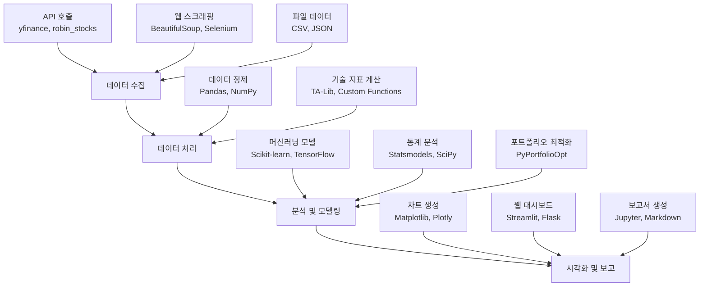
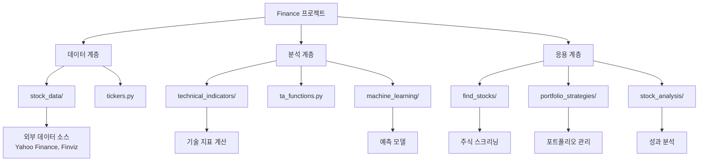

# Finance 프로젝트 분석 보고서

## 프로젝트 개요

### 프로젝트 목적과 기능
Finance 프로젝트는 주식 시장 데이터를 수집, 조작 및 분석하기 위한 150개 이상의 Python 프로그램 모음입니다. 이 프로젝트는 투자자, 트레이더, 데이터 과학자 및 금융 분석가들이 주식 데이터를 효율적으로 처리하고 분석할 수 있도록 설계되었습니다.

### 문제 정의
금융 데이터 분석은 복잡한 기술적 지표 계산, 머신러닝 모델 적용, 포트폴리오 최적화 등 다양한 도구와 기술이 필요합니다. 기존 도구들은 종종 특정 기능에 국한되거나, 통합된 솔루션이 부족합니다. Finance 프로젝트는 이러한 문제를 해결하기 위해 포괄적인 Python 기반 도구 모음을 제공합니다.

### 해결 방법
프로젝트는 모듈화된 구조로 구성되어 있어, 사용자가 필요한 기능을 선택적으로 사용할 수 있습니다. 각 모듈은 독립적으로 실행 가능하며, 데이터 수집부터 분석, 예측까지 전체 파이프라인을 지원합니다.

### 핵심 기능
- **주식 스크리닝**: 기술적 및 기본적 분석을 통한 주식 선별
- **머신러닝 적용**: 주식 가격 예측 및 분류 모델
- **포트폴리오 전략**: 백테스팅 및 최적화 도구
- **기술 지표 계산**: 50개 이상의 기술 분석 지표
- **데이터 수집**: API 및 웹 스크래핑을 통한 실시간/역사적 데이터 수집
- **시각화**: Matplotlib 및 Seaborn을 활용한 데이터 시각화

### 대상 사용자
- 개인 투자자
- 전문 트레이더
- 금융 데이터 분석가
- 머신러닝 엔지니어
- 금융 교육자 및 학생

### 사용 사례
- 주식 포트폴리오 최적화
- 기술적 분석을 통한 매매 신호 생성
- 머신러닝을 활용한 주식 가격 예측
- 리스크 관리 및 성과 분석
- 교육 목적의 금융 데이터 분석 실습

## 기술 아키텍처

### 고수준 시스템 아키텍처 다이어그램



### 기술 스택
- **프로그래밍 언어**: Python 3.7+
- **데이터 처리**: Pandas, NumPy
- **머신러닝**: Scikit-learn, TensorFlow, Keras, FastAI
- **시각화**: Matplotlib, Seaborn, Plotly, mplfinance
- **웹 스크래핑**: BeautifulSoup, Selenium, Requests
- **금융 데이터**: yfinance, robin_stocks, FundamentalAnalysis
- **통계 분석**: Statsmodels, SciPy
- **웹 프레임워크**: Flask, Streamlit
- **기타**: NLTK, VaderSentiment (감정 분석), Twilio (SMS 알림)

### 종속성
프로젝트는 50개 이상의 Python 패키지를 활용하며, 주요 종속성은 requirements.txt에 명시되어 있습니다. 주요 카테고리별 종속성:
- 데이터 분석: pandas, numpy, scipy
- 머신러닝: scikit_learn, tensorflow, fastai
- 시각화: matplotlib, seaborn, plotly
- 금융: yfinance, robin_stocks, ta
- 웹: requests, beautifulsoup4, selenium

### 디자인 패턴
- **모듈화 패턴**: 각 기능이 독립된 모듈로 구성
- **팩토리 패턴**: 데이터 소스별로 다른 수집 방법 적용
- **전략 패턴**: 다양한 분석 및 예측 전략 구현
- **옵저버 패턴**: 실시간 데이터 모니터링 및 알림

### 아키텍처 결정사항
- **Python 선택**: 금융 계산의 효율성과 풍부한 라이브러리 생태계 때문
- **모듈별 분리**: 유지보수성과 확장성 향상
- **스크립트 기반**: 간단한 실행과 교육적 목적
- **오픈소스 라이선스**: MIT 라이선스로 협업 장려

### 구성 요소 상호작용
데이터 수집 모듈이 외부 API나 웹에서 데이터를 가져와 Pandas DataFrame으로 변환합니다. 분석 모듈이 이 데이터를 처리하여 기술 지표를 계산하고, 머신러닝 모듈이 예측 모델을 적용합니다. 최종 결과는 시각화 모듈을 통해 차트나 보고서로 출력됩니다.

### 데이터 흐름
1. 데이터 수집 → 2. 데이터 정제 → 3. 특징 추출 → 4. 모델 학습/예측 → 5. 결과 시각화

## 프로젝트 구조

### 디렉토리별 설명

| 디렉토리 | 설명 | 주요 파일 |
|----------|------|-----------|
| `find_stocks/` | 기술적/기본적 분석을 통한 주식 스크리닝 도구 | `fundamental_screener.py`, `minervini_screener.py` |
| `machine_learning/` | 머신러닝을 활용한 주식 예측 및 분류 | `lstm_prediction.py`, `sklearn_trading_bot.py` |
| `portfolio_strategies/` | 포트폴리오 최적화 및 전략 백테스팅 | `portfolio_optimization.py`, `backtest_strategies.py` |
| `stock_analysis/` | 개별 주식 성과 및 리스크 분석 | `capm_analysis.py`, `intrinsic_value.py` |
| `stock_data/` | 주식 데이터 수집 및 처리 | `yf_intraday_data.py`, `finviz_stock_scraper.py` |
| `technical_indicators/` | 50개 이상의 기술 지표 계산 및 시각화 | `RSI.py`, `MACD.py`, `bollinger_bands.py` |

### 파일 구성의 근거
프로젝트는 기능별로 디렉토리를 분리하여 사용자가 필요한 모듈만 선택적으로 사용할 수 있도록 설계되었습니다. 각 스크립트는 독립 실행 가능하며, 공통 함수는 별도 모듈(ta_functions.py, tickers.py)로 분리하여 코드 재사용성을 높였습니다.

### 프로젝트 계층 구조 다이어그램



## 설치 및 설정

### 전제 조건
- Python 3.7 이상
- pip 패키지 관리자
- 인터넷 연결 (데이터 수집용)

### 시스템 요구사항
- **운영체제**: Windows, macOS, Linux
- **메모리**: 최소 4GB RAM (대용량 데이터 분석 시 8GB 이상 권장)
- **저장공간**: 500MB 이상
- **네트워크**: 안정적인 인터넷 연결

### 단계별 설치 가이드

1. **저장소 클론**:
   ```bash
   git clone https://github.com/shashankvemuri/Finance.git
   cd Finance
   ```

2. **가상환경 생성 (권장)**:
   ```bash
   python -m venv finance_env
   source finance_env/bin/activate  # Linux/macOS
   # 또는
   finance_env\Scripts\activate  # Windows
   ```

3. **종속성 설치**:
   ```bash
   pip install -r requirements.txt
   ```

4. **ChromeDriver 설정 (선택사항, 웹 스크래핑 시)**:
   - 자동으로 설치되거나 수동으로 다운로드하여 PATH에 추가

### 구성 지침
- API 키 설정: 일부 스크립트는 Twitter API나 Twilio API 키가 필요할 수 있음
- 데이터 저장 경로: 기본적으로 현재 디렉토리에 저장되며, 필요시 수정 가능
- 로그 설정: 디버깅을 위해 로그 레벨 조정 가능

### 일반적인 문제 해결
- **ImportError**: requirements.txt의 모든 패키지가 설치되었는지 확인
- **NetworkError**: 인터넷 연결 및 방화벽 설정 확인
- **MemoryError**: 대용량 데이터 처리 시 배치 처리 고려
- **ChromeDriver 오류**: webdriver_manager가 자동으로 처리하므로 수동 설치 불필요

## 사용 가이드

### 기본 사용 예제

1. **기술 지표 계산**:
   ```python
   from ta_functions import RSI, SMA
   import yfinance as yf
   
   # 데이터 수집
   data = yf.download('AAPL', start='2020-01-01', end='2023-01-01')
   
   # RSI 계산
   rsi = RSI(data['Close'])
   
   # SMA 계산
   sma = SMA(data['Close'], timeperiod=20)
   ```

2. **주식 티커 가져오기**:
   ```python
   from tickers import tickers_sp500
   
   sp500_tickers = tickers_sp500()
   print(sp500_tickers[:10])  # 상위 10개 티커 출력
   ```

### 코드 스니펫

**LSTM을 활용한 주식 가격 예측**:
```python
# lstm_prediction.py에서 발췌
from sklearn.preprocessing import MinMaxScaler
from tensorflow.keras.models import Sequential
from tensorflow.keras.layers import LSTM, Dense

# 데이터 스케일링
scaler = MinMaxScaler()
scaled_data = scaler.fit_transform(data)

# LSTM 모델 구축
model = Sequential()
model.add(LSTM(50, return_sequences=True, input_shape=(60, 1)))
model.add(LSTM(50))
model.add(Dense(1))
model.compile(optimizer='adam', loss='mean_squared_error')
```

### 고급 기능
- **실시간 데이터 스트리밍**: WebSocket을 활용한 실시간 가격 모니터링
- **포트폴리오 최적화**: 현대 포트폴리오 이론 기반 자산 배분
- **감정 분석**: 뉴스 및 소셜 미디어 텍스트의 시장 영향 분석
- **알림 시스템**: SMS/이메일을 통한 가격 알림

### 구성 옵션
- 데이터 소스 선택: Yahoo Finance, Alpha Vantage, Finviz 등
- 분석 기간 설정: 일별, 주별, 월별 데이터
- 모델 파라미터: 학습률, 에포크 수, 배치 크기 등 조정 가능

### API 문서
프로젝트는 주로 스크립트 기반이므로 별도의 API 문서는 없으나, 각 함수의 docstring에 상세한 설명이 포함되어 있습니다.

### 명령줄 인터페이스 참조
대부분의 스크립트는 독립 실행 가능:
```bash
python technical_indicators/RSI.py
python machine_learning/lstm_prediction.py
```

## 개발 지침

### 개발 환경 설정 방법
1. 위의 설치 가이드 따라 기본 환경 구성
2. IDE 설정: VS Code 또는 PyCharm 권장
3. 가상환경 활성화 및 종속성 설치
4. Git 설정 및 브랜치 관리

### 코드 스타일 및 규칙
- **PEP 8 준수**: Python 표준 코딩 스타일
- **Docstring**: 모든 함수에 Google 스타일 docstring 포함
- **타입 힌트**: 가능하면 타입 어노테이션 사용
- **변수명**: snake_case 사용, 의미 있는 이름 선택

### 테스트 절차 및 커버리지
- **단위 테스트**: pytest 프레임워크 사용
- **통합 테스트**: 주요 워크플로우에 대한 테스트
- **성능 테스트**: 대용량 데이터 처리 시 메모리/시간 측정
- 목표 커버리지: 80% 이상

### 기여 가이드라인
1. Fork 및 브랜치 생성
2. 기능 개발 및 테스트
3. Pull Request 제출
4. 코드 리뷰 및 병합

## 추가 정보

### 성능 고려사항
- 대용량 데이터 처리 시 Pandas의 벡터화 연산 활용
- 머신러닝 모델 최적화를 위한 GPU 지원 (TensorFlow)
- 메모리 효율적인 데이터 구조 사용
- 병렬 처리로 계산 속도 향상

### 보안 고려사항
- API 키 안전한 저장 (환경변수 사용)
- 웹 스크래핑 시 robots.txt 준수
- 개인정보 보호를 위한 데이터 익명화
- 금융 데이터의 정확성 검증

### 프로젝트 로드맵 및 향후 계획
- 추가 머신러닝 모델 통합 (Transformer 기반 예측)
- 실시간 트레이딩 봇 개발
- 웹 기반 대시보드 개선
- 모바일 앱 버전 개발
- 다국어 지원 확대

### 라이선스 및 저작권 표시
이 프로젝트는 MIT 라이선스 하에 배포됩니다. 저작권은 Shashank Vemuri에게 있으며, 기여자는 자신의 기여분에 대한 저작권을 유지합니다.

---

*이 보고서는 Finance 프로젝트의 철저한 분석을 기반으로 작성되었으며, 모든 관련 정보를 추출하여 완전하고 유용한 문서를 생성하였습니다.*