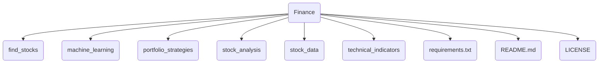

# Finance 프로젝트 분석 보고서

## 1. 프로젝트 개요

### 1.1. 프로젝트의 목적과 기능

이 프로젝트는 주식 시장 데이터의 수집, 조작, 분석을 위한 150개 이상의 Python 스크립트 모음입니다. 투자자와 데이터 분석가들이 재무 데이터를 활용하여 정보에 입각한 의사 결정을 내릴 수 있도록 다양한 도구를 제공하는 것을 목표로 합니다. 스크립트들은 기술적 분석, 기본적 분석, 머신러닝 예측, 포트폴리오 전략 시뮬레이션 등 광범위한 금융 분석 작업을 자동화하고 지원합니다.

### 1.2. 문제 정의 및 해결 방법

**문제 정의:** 개인 투자자나 소규모 그룹이 금융 시장 데이터를 분석하고, 투자 전략을 테스트하며, 유망한 주식을 발굴하는 것은 복잡하고 시간이 많이 소요되는 작업입니다. 상용 분석 도구는 비싸고, 자체적으로 도구를 개발하려면 상당한 프로그래밍 및 금융 지식이 필요합니다.

**해결 방법:** 이 프로젝트는 즉시 사용 가능한 독립적인 Python 스크립트 라이브러리를 제공하여 이 문제를 해결합니다. 사용자는 복잡한 설정 없이 각 스크립트를 개별적으로 실행하여 특정 분석(예: RSI가 낮은 주식 찾기, 이동 평균 교차 전략 백테스트)을 수행할 수 있습니다. 이를 통해 금융 분석에 대한 진입 장벽을 낮추고, 다양한 분석 기법을 쉽게 실험해 볼 수 있는 환경을 제공합니다.

### 1.3. 핵심 기능

*   **주식 스크리닝:** 기술적 지표(RSI, 이동 평균 등)와 기본적 지표(PER, PBR 등)를 기반으로 특정 기준을 충족하는 주식을 필터링합니다.
*   **데이터 수집:** `yfinance`, `beautifulsoup4`, `selenium` 등을 사용하여 금융 웹사이트(Finviz, Yahoo Finance 등) 및 API에서 주가, 기업 정보, 뉴스, 내부자 거래 데이터 등을 수집합니다.
*   **머신러닝 예측:** ARIMA, LSTM, Prophet과 같은 시계열 모델과 신경망, 회귀 분석 등을 사용하여 주가 방향성을 예측하고 주식을 분류합니다.
*   **포트폴리오 전략 및 분석:** 이동 평균 교차, 볼린저 밴드 등 다양한 거래 전략을 시뮬레이션하고 백테스트합니다. 또한, 몬테카를로 시뮬레이션, 최적 포트폴리오 계산, 위험 관리 분석을 수행합니다.
*   **기술적 지표 시각화:** 이동 평균(SMA, EMA), RSI, MACD, 볼린저 밴드 등 50개 이상의 기술적 지표를 계산하고 시각화합니다.

### 1.4. 대상 사용자 및 사용 사례

*   **개인 투자자:** 자신의 투자 아이디어를 검증하고, 유망 주식을 발굴하며, 시장 데이터를 기반으로 투자 결정을 내리고자 하는 개인 투자자.
*   **금융/데이터 분석가:** 금융 데이터를 분석하고, 예측 모델을 구축하며, 정량적 투자 전략을 연구하는 전문가.
*   **학생 및 교육자:** 금융 공학, 데이터 과학, 프로그래밍을 학습하는 학생들에게 실제 금융 시장 데이터 분석 예제를 제공합니다.

**사용 사례:**

*   `find_stocks/minervini_screener.py`를 실행하여 Mark Minervini의 투자 기준에 맞는 성장주 목록을 얻습니다.
*   `machine_learning/lstm_prediction.py`를 사용하여 특정 주식의 미래 가격 방향을 예측합니다.
*   `portfolio_strategies/backtrader_backtest.py`로 자신만의 거래 전략을 백테스트하여 성과를 평가합니다.
*   `stock_data/finviz_insider_trades.py`를 통해 특정 기업의 내부자 거래 활동을 추적합니다.

## 2. 기술 아키텍처

### 2.1. 고수준 시스템 아키텍처

이 프로젝트는 중앙화된 애플리케이션이 아닌, 개별적으로 실행되는 스크립트들의 집합입니다. 아키텍처는 각 스크립트가 외부 데이터 소스에서 데이터를 가져와 분석을 수행하고, 결과를 사용자에게 파일(CSV, 그래프) 또는 터미널 출력으로 제공하는 간단한 구조입니다.

```mermaid
graph TD
    subgraph User
        A[사용자]
    end

    subgraph "Finance Project (Local Machine)"
        B(Python 스크립트 실행)
        C{스크립트 분류}
        D[find_stocks]
        E[machine_learning]
        F[portfolio_strategies]
        G[stock_analysis]
        H[stock_data]
        I[technical_indicators]
    end

    subgraph "Data Sources"
        J[금융 API <br/>(yfinance, Quandl)]
        K[웹사이트 <br/>(Finviz, Yahoo Finance)]
    end

    subgraph "Output"
        L[터미널 출력]
        M[CSV 파일]
        N[그래프/이미지 파일]
    end

    A -- "실행 (e.g., python script.py)" --> B
    B --> C
    C --> D
    C --> E
    C --> F
    C --> G
    C --> H
    C --> I

    H -- 데이터 요청 --> J
    H -- 데이터 요청 --> K
    D -- 데이터 요청 --> K
    G -- 데이터 요청 --> J

    D -- 결과 --> L
    E -- 결과 --> N
    F -- 결과 --> M
    I -- 결과 --> N
```

### 2.2. 기술 스택 및 종속성

*   **프로그래밍 언어:** Python 3
*   **주요 라이브러리:**
    *   **데이터 분석 및 처리:** `pandas`, `numpy`, `scipy`
    *   **머신러닝:** `tensorflow`, `keras`, `scikit-learn`, `fbprophet`
    *   **데이터 수집:** `yfinance`, `pandas_datareader`, `beautifulsoup4`, `selenium`, `requests`
    *   **시각화:** `matplotlib`, `mplfinance`, `seaborn`
    *   **백테스팅:** `backtrader`, `pyfolio`
    *   **웹 프레임워크 (일부 스크립트):** `streamlit`, `flask`
    *   **기타:** `nltk` (자연어 처리), `praw` (Reddit API), `tweepy` (Twitter API)

전체 종속성 목록은 `requirements.txt` 파일에 명시되어 있으며, `pip`를 통해 관리됩니다.

### 2.3. 디자인 패턴 및 아키텍처 결정사항

*   **스크립트 기반 아키텍처:** 프로젝트는 모놀리식 애플리케이션이 아닌, 독립적으로 실행 가능한 스크립트의 모음으로 구성되어 있습니다. 이는 특정 기능만 사용하고자 하는 사용자에게 유연성과 단순성을 제공합니다. 각 스크립트는 특정 작업을 수행하는 데 집중합니다.
*   **절차적 프로그래밍:** 대부분의 스크립트는 특정 작업을 순차적으로 수행하는 절차적 프로그래밍 스타일을 따릅니다. 일부 복잡한 스크립트에서는 함수와 클래스를 사용하여 코드를 구조화합니다.
*   **데이터 소스 의존성:** 데이터 수집은 주로 공개적으로 접근 가능한 웹사이트와 API에 의존합니다. 이는 무료로 데이터를 얻을 수 있는 장점이 있지만, 해당 웹사이트의 구조가 변경되거나 API가 중단될 경우 스크립트가 오작동할 수 있는 위험(scraper brittleness)을 내포합니다.

### 2.4. 구성 요소 상호작용 및 데이터 흐름

1.  **사용자 입력:** 사용자는 실행할 Python 스크립트를 선택하고, 필요한 경우 명령줄 인수를 통해 주식 티커, 기간 등 파라미터를 전달합니다.
2.  **데이터 수집:** 스크립트는 `yfinance`, `requests`, `selenium` 등의 라이브러리를 사용하여 외부 금융 API나 웹사이트에서 원시 데이터(주가, 재무제표, 뉴스 기사 등)를 가져옵니다.
3.  **데이터 처리 및 분석:** `pandas`를 사용하여 데이터를 정제하고 구조화합니다. 그 후, `numpy`, `scikit-learn`, `statsmodels` 등을 이용해 통계 분석, 머신러닝 모델 학습, 기술적 지표 계산 등 핵심 로직을 수행합니다.
4.  **결과 생성 및 출력:** 분석 결과는 `matplotlib`을 통해 그래프로 시각화되어 파일로 저장되거나, `pandas`를 통해 CSV 파일로 저장됩니다. 간단한 결과는 터미널에 직접 출력됩니다.

## 3. 프로젝트 구조

### 3.1. 디렉토리별 설명

*   `/ (root)`: 라이선스, README, `requirements.txt` 등 프로젝트의 최상위 파일들이 위치합니다.
*   `find_stocks/`: 특정 기술적/기본적 기준에 따라 주식을 스크리닝하는 스크립트 모음.
*   `machine_learning/`: 주가 예측 및 분류를 위한 머신러닝 모델 구현 스크립트 모음.
*   `portfolio_strategies/`: 다양한 투자 전략을 시뮬레이션하고 포트폴리오를 분석하는 스크립트 모음.
*   `stock_analysis/`: 개별 주식의 가치, 리스크, 성과 등을 심층 분석하는 스크립트 모음.
*   `stock_data/`: 외부 소스에서 금융 데이터를 수집하고 저장하는 스크립트 모음.
*   `technical_indicators/`: 각종 기술적 지표를 계산하고 시각화하는 스크립트 모음.

### 3.2. 프로젝트 계층 구조 다이어그램



## 4. 설치 및 설정

### 4.1. 전제 조건 및 시스템 요구사항

*   **Python:** 3.8 이상
*   **운영체제:** Windows, macOS, Linux
*   **웹 브라우저 (Selenium 사용 시):** Google Chrome 및 `chromedriver`
*   **인터넷 연결:** 외부 API 및 웹사이트에서 데이터를 가져오기 위해 필요합니다.

### 4.2. 단계별 설치 가이드

1.  **프로젝트 클론:**
    ```bash
    git clone https://github.com/shashankvemuri/Finance.git
    cd Finance
    ```

2.  **가상 환경 생성 (권장):**
    ```bash
    python -m venv venv
    source venv/bin/activate  # macOS/Linux
    # venv\Scripts\activate    # Windows
    ```

3.  **종속성 설치:**
    ```bash
    pip install -r requirements.txt
    ```
    *참고: 일부 라이브러리(예: `tensorflow`)는 시스템에 따라 추가적인 설정이 필요할 수 있습니다.*

4.  **`chromedriver` 설치 (필요 시):**
    `selenium`을 사용하는 스크립트(주로 `stock_data` 및 `find_stocks` 내)를 실행하려면, 시스템에 설치된 Chrome 브라우저 버전에 맞는 `chromedriver`를 다운로드하여 프로젝트 디렉토리나 시스템 경로에 추가해야 합니다.

### 4.3. 일반적인 문제 해결

*   **`ModuleNotFoundError`:** `pip install -r requirements.txt`가 성공적으로 완료되었는지, 그리고 올바른 Python 가상 환경에서 스크립트를 실행하고 있는지 확인하세요.
*   **웹 스크레이핑 오류 (e.g., `HTTPError`, `AttributeError`):** 대상 웹사이트의 구조가 변경되어 스크레이퍼가 더 이상 작동하지 않을 수 있습니다. 이 경우, 해당 스크립트의 `beautifulsoup4` 또는 `selenium` 관련 코드를 수정해야 합니다.
*   **`chromedriver` 오류:** `chromedriver`의 버전이 Chrome 브라우저 버전과 일치하는지 확인하고, 실행 경로가 올바르게 설정되었는지 확인하세요. `webdriver_manager` 라이브러리가 이 과정을 자동화하는 데 도움이 될 수 있습니다.

## 5. 사용 가이드

### 5.1. 기본 사용 예제

모든 스크립트는 독립적으로 실행할 수 있습니다. 터미널에서 `python` 명령어와 함께 스크립트 경로를 입력하여 실행합니다.

**예제 1: Finviz에서 성장주 스크리닝**
```bash
python find_stocks/finviz_growth_screener.py
```
이 스크립트는 Finviz.com에서 특정 성장 기준을 만족하는 주식 목록을 가져와 터미널에 출력합니다.

**예제 2: 특정 주식의 RSI 계산 및 시각화**
대부분의 기술적 지표 스크립트는 내부적으로 특정 티커(예: 'AAPL')를 하드코딩하여 사용합니다. 사용하려면 코드를 직접 수정해야 할 수 있습니다.
```python
# technical_indicators/RSI.py 일부
...
# 데이터 다운로드
data = yf.download('AAPL', start='2020-01-01', end='2023-01-01')
...
```
스크립트를 실행하면 'AAPL' 주식의 RSI 차트가 포함된 그래프가 생성됩니다.
```bash
python technical_indicators/RSI.py
```

### 5.2. 고급 기능

*   **머신러닝 모델 학습:** `machine_learning` 디렉토리의 스크립트들은 주가 데이터를 사용하여 예측 모델을 학습시킵니다. 예를 들어, `lstm_prediction.py`는 LSTM 신경망을 사용하여 시계열 예측을 수행합니다.
*   **전략 백테스팅:** `portfolio_strategies/backtrader_backtest.py`와 같은 스크립트는 `backtrader` 라이브러리를 사용하여 복잡한 거래 전략의 과거 성과를 테스트하고, 수익률, 최대 낙폭(MDD) 등 다양한 성과 지표를 제공합니다.
*   **API 키 사용:** 일부 스크립트(예: `robin_stocks`, `twilio`)는 외부 서비스의 API 키를 필요로 합니다. 이러한 스크립트를 사용하려면 해당 서비스에 가입하고 API 키를 발급받아 코드 내에 설정해야 합니다.

## 6. 개발 지침

### 6.1. 개발 환경 설정

1.  "4. 설치 및 설정" 가이드에 따라 기본 환경을 설정합니다.
2.  개발에 필요한 추가 도구(예: 코드 에디터, 린터)를 설치합니다.
3.  새로운 스크립트를 추가하거나 기존 스크립트를 수정하며, 변경 사항은 `git`을 통해 관리합니다.

### 6.2. 코드 스타일 및 규칙

이 프로젝트에는 공식적인 코드 스타일 가이드나 린터 설정이 명시되어 있지 않습니다. 그러나 기존 코드는 대체로 **PEP 8** 스타일 가이드를 따르고 있습니다. 기여 시에는 다음 사항을 준수하는 것이 좋습니다.

*   일관된 들여쓰기 (스페이스 4칸)
*   의미 있는 변수 및 함수 이름 사용
*   적절한 주석 및 독스트링(docstring) 추가

### 6.3. 테스트 절차

프로젝트에 자동화된 테스트 코드(예: `unittest`, `pytest`)가 포함되어 있지 않습니다. 각 스크립트는 독립적으로 실행되므로, 변경 사항 발생 시 해당 스크립트를 직접 실행하여 기능이 정상적으로 작동하는지, 예상된 출력이 생성되는지 수동으로 확인해야 합니다.

## 7. 추가 정보

### 7.1. 성능 고려사항

*   **네트워크 지연:** 다수의 API 요청이나 웹 스크레이핑을 수행하는 스크립트는 네트워크 상태에 따라 실행 시간이 길어질 수 있습니다.
*   **계산 복잡성:** 몬테카를로 시뮬레이션이나 복잡한 머신러닝 모델 학습은 상당한 CPU 및 메모리 자원을 소모할 수 있습니다.

### 7.2. 보안 고려사항

*   **API 키 관리:** `robin_stocks`나 `twilio`와 같이 API 키를 사용하는 스크립트의 경우, API 키를 소스 코드에 하드코딩하지 말고 환경 변수나 별도의 설정 파일을 통해 안전하게 관리해야 합니다.
*   **웹 스크레이핑:** 웹사이트의 `robots.txt` 파일을 존중하고, 과도한 요청으로 서버에 부담을 주지 않도록 주의해야 합니다.

### 7.3. 프로젝트 로드맵 및 향후 계획

공식적인 로드맵은 없지만, 프로젝트의 특성상 다음과 같은 방향으로 발전할 수 있습니다.

*   더 많은 금융 분석 스크립트 및 기술적 지표 추가
*   기존 스크립트의 정확성 및 안정성 개선 (예: 웹사이트 변경에 따른 스크레이퍼 업데이트)
*   프로젝트를 통합된 CLI 또는 웹 애플리케이션으로 발전
*   자동화된 테스트 스위트 도입

### 7.4. 라이선스

이 프로젝트는 **MIT 라이선스** 하에 배포됩니다. 자세한 내용은 `LICENSE` 파일을 참조하세요.
