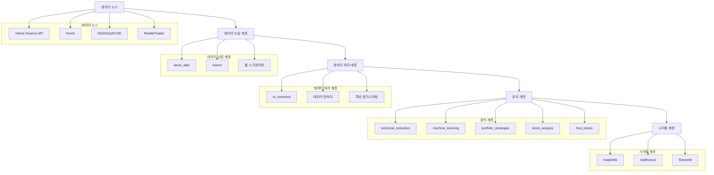
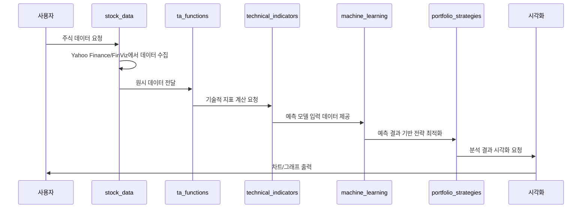
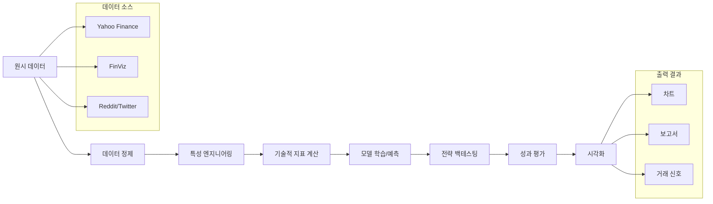
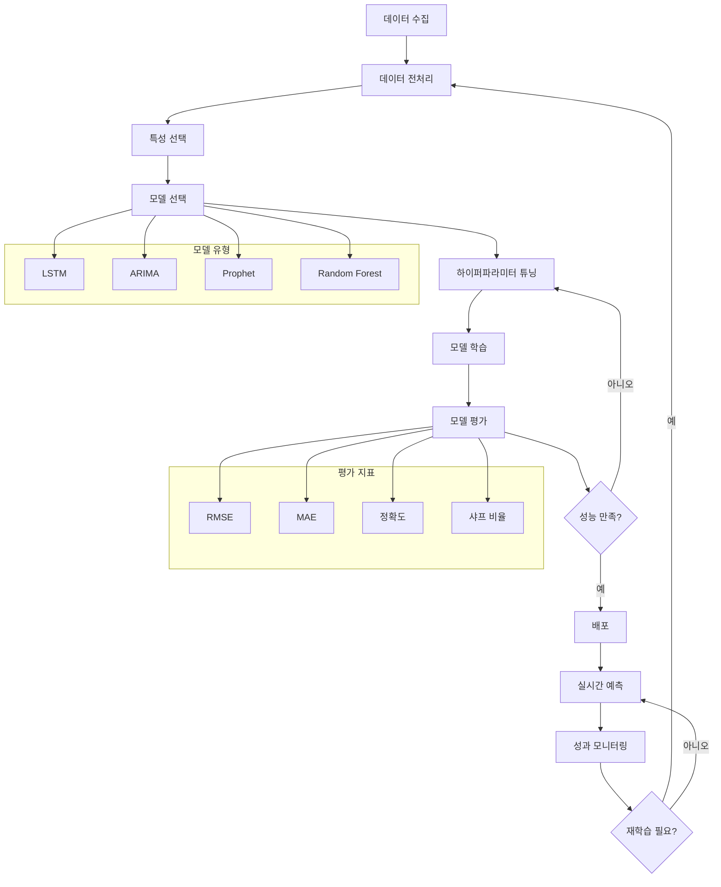
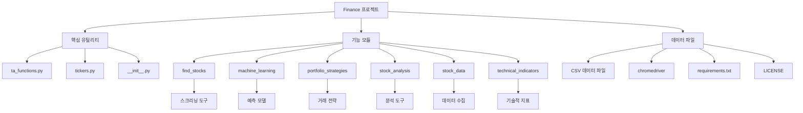
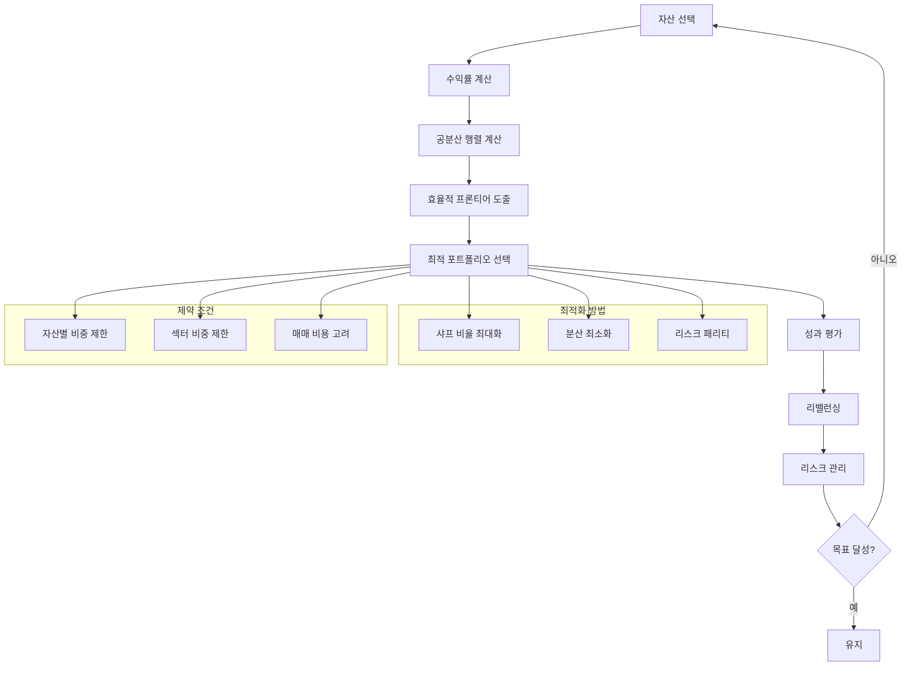
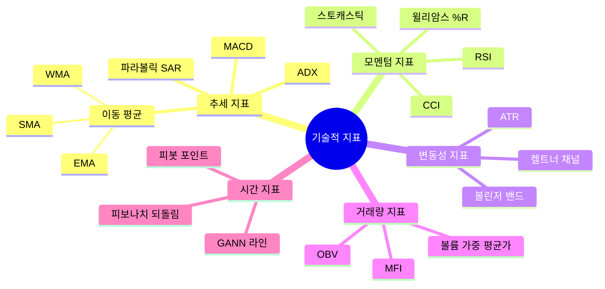
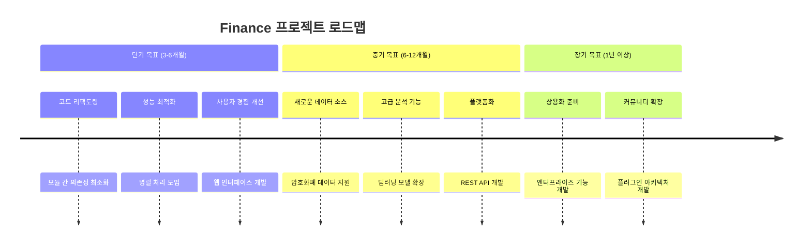

# Finance 프로젝트 포괄적 분석 보고서

## 프로젝트 개요

### 목적과 기능

Finance 프로젝트는 주식 시장 데이터를 수집, 조작 및 분석하기 위한 150개 이상의 Python 프로그램 모음입니다. 이 프로젝트는 금융 데이터 분석, 기술적 분석, 머신러닝 기반 예측, 포트폴리오 전략 개발 등 다양한 금융 분석 작업을 지원하는 통합 플랫폼을 제공합니다.

### 문제 정의

금융 시장은 복잡하고 방대한 양의 데이터를 생성하며, 개인 투자자와 금융 전문가 모두에게 체계적인 데이터 분석 도구가 필요합니다. 기존의 상용 솔루션은 비용이 높거나 유연성이 부족하여, 개인화된 분석과 자동화된 투자 전략 개발이 어려웠습니다.

### 해결 방법

이 프로젝트는 오픈소스 Python 기반 금융 분석 도구 모음을 제공하여 다음과 같은 문제를 해결합니다:

- 무료로 접근 가능한 금융 분석 도구 제공
- 다양한 데이터 소스와 API 통합
- 재사용 가능한 모듈식 아키텍처
- 교육용으로 적합한 명확한 코드 구조

### 핵심 기능

1. **주식 스크리닝**: 기술적 및 기본적 분석 기반 주식 필터링
2. **기술적 지표**: 80개 이상의 기술적 분석 지표 구현
3. **머신러닝 예측**: LSTM, ARIMA 등 다양한 모델을 활용한 가격 예측
4. **포트폴리오 전략**: 백테스팅 및 최적화 도구
5. **시장 분석**: CAPM, 변동성, 리스크 분석 도구
6. **데이터 수집**: Yahoo Finance, FinViz 등 다양한 소스에서 데이터 수집

### 대상 사용자 및 사용 사례

- **개인 투자자**: 자체 투자 전략 개발 및 백테스팅
- **금융 분석가**: 시장 분석 및 보고서 생성 자동화
- **학생 및 교육자**: 금융 공학 및 데이터 과학 교육
- **퀀트 개발자**: 알고리즘 트레이ding 전략 프로토타이핑

## 기술 아키텍처

### 고수준 시스템 아키텍처



### 기술 스택

#### 핵심 라이브러리
- **데이터 처리**: pandas, numpy
- **금융 데이터**: yfinance, pandas_datareader
- **머신러닝**: scikit-learn, tensorflow, keras
- **시각화**: matplotlib, seaborn, mplfinance
- **웹 스크래핑**: beautifulsoup4, selenium, autoscraper
- **기술적 분석**: ta
- **포트폴리오 분석**: pyfolio, backtrader

#### 통신 및 API
- **데이터 소스**: Yahoo Finance, FinViz, Reddit API, Twitter API
- **웹 프레임워크**: Flask
- **메시징**: Twilio (SMS 알림)

### 종속성

프로젝트의 주요 종속성은 [`requirements.txt`](source/Finance/requirements.txt:1) 파일에 정의되어 있으며, 총 46개의 핵심 패키지로 구성됩니다. 주요 카테고리는 다음과 같습니다:

1. **데이터 과학**: numpy, pandas, scipy, scikit-learn
2. **딥러닝**: tensorflow, keras
3. **금융 분석**: yfinance, pandas_datareader, pyfolio, backtrader
4. **시각화**: matplotlib, seaborn, mplfinance
5. **웹 스크래핑**: beautifulsoup4, selenium, autoscraper
6. **자연어 처리**: nltk, textblob, vaderSentiment
7. **시계열 분석**: fbprophet, pmdarima, statsmodels

### 디자인 패턴

1. **모듈식 아키텍처**: 각 기능 영역을 별도의 모듈로 분리
2. **함수형 프로그래밍**: [`ta_functions.py`](source/Finance/ta_functions.py:1)에서 순수 함수 기반 접근
3. **데이터 파이프라인**: 데이터 수집 → 처리 → 분석 → 시각화의 흐름
4. **팩토리 패턴**: 다양한 기술적 지표 생성 시 사용
5. **전략 패턴**: 다양한 거래 전략을 교체 가능하게 구현

### 아키텍처 결정사항

1. **데이터 중심 아키텍처**: pandas DataFrame을 중심으로 모든 데이터 처리
2. **독립 실행형 스크립트**: 각 프로그램이 독립적으로 실행 가능하도록 설계
3. **다양한 데이터 소스 지원**: 여러 금융 데이터 제공업체와의 통합
4. **시각화 중심 접근**: 분석 결과의 직관적 이해를 위한 강력한 시각화 지원

### 구성 요소 상호작용 및 데이터 흐름



### 데이터 처리 파이프라인



### 머신러닝 워크플로우



## 프로젝트 구조

### 디렉토리별 설명

#### [`find_stocks/`](source/Finance/find_stocks:1)
주식 스크리닝 및 필터링 도구 모음입니다. 기술적 및 기본적 분석을 기반으로 투자 매력적인 주식을 식별합니다.

- [`finviz_growth_screener.py`](source/Finance/find_stocks/finviz_growth_screener.py:1): FinViz에서 성장주 스크리닝
- [`get_rsi_tickers.py`](source/Finance/find_stocks/get_rsi_tickers.py:1): RSI 기반 과매도/과매수 주식 식별
- [`twitter_screener.py`](source/Finance/find_stocks/twitter_screener.py:1): 트위터 감성 분석 기반 주식 스크리닝

#### [`machine_learning/`](source/Finance/machine_learning:1)
머신러닝 및 딥러닝 모델을 활용한 주식 가격 예측 및 분석 도구입니다.

- [`lstm_prediction.py`](source/Finance/machine_learning/lstm_prediction.py:1): LSTM 신경망을 사용한 주가 예측
- [`arima_time_series.py`](source/Finance/machine_learning/arima_time_series.py:1): ARIMA 시계열 모델
- [`prophet_price_prediction.py`](source/Finance/machine_learning/prophet_price_prediction.py:1): Facebook Prophet을 활용한 예측

#### [`portfolio_strategies/`](source/Finance/portfolio_strategies:1)
포트폴리오 최적화, 백테스팅 및 거래 전략 개발 도구입니다.

- [`backtest_strategies.py`](source/Finance/portfolio_strategies/backtest_strategies.py:1): 다양한 거래 전략 백테스팅
- [`portfolio_optimization.py`](source/Finance/portfolio_strategies/portfolio_optimization.py:1): 현대 포트폴리오 이론 기반 최적화
- [`risk_management.py`](source/Finance/portfolio_strategies/risk_management.py:1): 리스크 관리 도구

#### [`stock_analysis/`](source/Finance/stock_analysis:1)
개별 주식에 대한 심층 분석 도구입니다.

- [`capm_analysis.py`](source/Finance/stock_analysis/capm_analysis.py:1): 자본자산가격결정모형(CAPM) 분석
- [`intrinsic_value.py`](source/Finance/stock_analysis/intrinsic_value.py:1): 내재 가치 계산
- [`performance_risk_analysis.py`](source/Finance/stock_analysis/performance_risk_analysis.py:1): 성과 및 리스크 분석

#### [`stock_data/`](source/Finance/stock_data:1)
다양한 소스에서 주식 데이터를 수집하고 전처리하는 도구입니다.

- [`finviz_stock_scraper.py`](source/Finance/stock_data/finviz_stock_scraper.py:1): FinViz에서 기본적 데이터 스크래핑
- [`yf_intraday_data.py`](source/Finance/stock_data/yf_intraday_data.py:1): Yahoo Finance에서 일중 데이터 수집
- [`reddit_scraper.py`](source/Finance/stock_data/reddit_scraper.py:1): Reddit에서 감성 데이터 수집

#### [`technical_indicators/`](source/Finance/technical_indicators:1)
80개 이상의 기술적 분석 지표 구현입니다.

- [`RSI.py`](source/Finance/technical_indicators/RSI.py:1): 상대강도지수(RSI) 계산 및 시각화
- [`MACD.py`](source/Finance/technical_indicators/MACD.py:1): MACD 지표 계산
- [`bollinger_bands.py`](source/Finance/technical_indicators/bollinger_bands.py:1): 볼린저 밴드 계산

### 파일 구성의 근거

1. **기능별 분리**: 유사한 기능을 가진 모듈을 동일한 디렉토리로 그룹화
2. **재사용성**: [`ta_functions.py`](source/Finance/ta_functions.py:1)와 같은 공통 유틸리티 함수 분리
3. **독립성**: 각 스크립트가 독립적으로 실행 가능하도록 설계
4. **확장성**: 새로운 지표나 전략을 쉽게 추가할 수 있는 구조

### 프로젝트 계층 구조



### 포트폴리오 최적화 프로세스



### 기술적 지표 분류 체계



## 설치 및 설정

### 전제 조건

- Python 3.7 이상
- pip (Python 패키지 관리자)
- Git (소스 코드 다운로드용)

### 시스템 요구사항

- **운영체제**: Windows, macOS, Linux
- **메모리**: 최소 4GB RAM (머신러닝 모델 실행 시 8GB 이상 권장)
- **저장 공간**: 최소 2GB (데이터 캐시 및 모델 저장용)
- **네트워크**: 인터넷 연결 (실시간 데이터 수집용)

### 단계별 설치 가이드

1. **저장소 복제**
   ```bash
   git clone https://github.com/shashankvemuri/Finance.git
   cd Finance
   ```

2. **가상 환경 생성 (권장)**
   ```bash
   python -m venv finance_env
   source finance_env/bin/activate  # Linux/macOS
   # 또는
   finance_env\Scripts\activate  # Windows
   ```

3. **종속성 설치**
   ```bash
   pip install -r requirements.txt
   ```

4. **설치 확인**
   ```bash
   python -c "import pandas, yfinance, matplotlib; print('설치 완료')"
   ```

### 구성 지침

1. **데이터 소스 설정**
   - Yahoo Finance API는 별도 설정 없이 사용 가능
   - Reddit/Twitter API 사용 시 별도 API 키 필요

2. **ChromeDriver 설정**
   - Selenium 기반 스크래핑을 위해 [`chromedriver`](source/Finance/chromedriver:1) 포함
   - 시스템에 맞는 버전으로 업데이트 권장

3. **환경 변수 (선택사항)**
   ```bash
   export FINANCE_DATA_DIR="/path/to/data/directory"
   export FINANCE_CACHE_DIR="/path/to/cache"
   ```

### 일반적인 문제 해결

1. **yfinance 데이터 수집 오류**
   ```bash
   # yfinance 버전 업데이트
   pip install --upgrade yfinance
   ```

2. **Selenium 관련 오류**
   ```bash
   # webdriver-manager로 자동 관리
   pip install --upgrade webdriver-manager
   ```

3. **메모리 부족 오류**
   - 대용량 데이터 처리 시 배치 처리 방식 사용
   - 불필요한 변수 명시적 삭제: `del df`

4. **인터넷 연결 문제**
   - 프록시 설정 필요 시 환경 변수 구성
   - 데이터 소스별 타임아웃 값 조정

## 사용 가이드

### 기본 사용 예제

#### 주식 데이터 수집 및 기본 분석

```python
import yfinance as yf
import pandas as pd
from datetime import datetime, timedelta

# Apple 주식 데이터 수집
ticker = 'AAPL'
end_date = datetime.now()
start_date = end_date - timedelta(days=365)

data = yf.download(ticker, start=start_date, end=end_date)
print(data.head())

# 기본 통계
print(data.describe())
```

#### 기술적 지표 계산

```python
# ta_functions 모듈 사용
import sys
sys.path.append('path/to/Finance')
import ta_functions as ta

# RSI 계산
rsi = ta.RSI(data['Close'], timeperiod=14)
print(f"최신 RSI 값: {rsi.iloc[-1]:.2f}")

# 볼린저 밴드 계산
upper, middle, lower = ta.BBANDS(data['Close'], timeperiod=20)
print(f"상단 밴드: {upper.iloc[-1]:.2f}")
print(f"중간 밴드: {middle.iloc[-1]:.2f}")
print(f"하단 밴드: {lower.iloc[-1]:.2f}")
```

### 코드 스니펫

#### 이동 평균 교차 전략

```python
def moving_average_crossover_strategy(data, short_window=20, long_window=50):
    signals = pd.DataFrame(index=data.index)
    signals['signal'] = 0.0
    
    # 단기 및 장기 이동 평균 계산
    signals['short_mavg'] = data['Close'].rolling(window=short_window, min_periods=1).mean()
    signals['long_mavg'] = data['Close'].rolling(window=long_window, min_periods=1).mean()
    
    # 신호 생성
    signals['signal'][short_window:] = np.where(
        signals['short_mavg'][short_window:] > signals['long_mavg'][short_window:], 1.0, 0.0
    )
    
    # 거래 신호 계산
    signals['positions'] = signals['signal'].diff()
    
    return signals

# 전략 적용
signals = moving_average_crossover_strategy(data)
print(signals.tail())
```

#### LSTM 기반 주가 예측

```python
from tensorflow.keras.models import Sequential
from tensorflow.keras.layers import LSTM, Dense
from sklearn.preprocessing import MinMaxScaler

# 데이터 전처리
scaler = MinMaxScaler(feature_range=(0, 1))
scaled_data = scaler.fit_transform(data['Close'].values.reshape(-1, 1))

# 훈련 데이터 생성
x_train, y_train = [], []
for i in range(60, len(scaled_data)):
    x_train.append(scaled_data[i-60:i, 0])
    y_train.append(scaled_data[i, 0])

x_train, y_train = np.array(x_train), np.array(y_train)
x_train = np.reshape(x_train, (x_train.shape[0], x_train.shape[1], 1))

# LSTM 모델 구축
model = Sequential([
    LSTM(50, return_sequences=True, input_shape=(x_train.shape[1], 1)),
    LSTM(50, return_sequences=False),
    Dense(25),
    Dense(1)
])

model.compile(optimizer='adam', loss='mean_squared_error')
model.fit(x_train, y_train, batch_size=1, epochs=5)
```

### 고급 기능

#### 포트폴리오 최적화

```python
import numpy as np
import pandas as pd
from scipy.optimize import minimize

# 포트폴리오 최적화 함수
def portfolio_optimization(returns, risk_free_rate=0.02):
    num_assets = len(returns.columns)
    
    # 목표 함수 (샤프 비율 최대화)
    def negative_sharpe_ratio(weights):
        portfolio_return = np.sum(returns.mean() * weights) * 252
        portfolio_std = np.sqrt(np.dot(weights.T, np.dot(returns.cov() * 252, weights)))
        sharpe_ratio = (portfolio_return - risk_free_rate) / portfolio_std
        return -sharpe_ratio
    
    # 제약 조건
    constraints = ({'type': 'eq', 'fun': lambda x: np.sum(x) - 1})
    bounds = tuple((0, 1) for _ in range(num_assets))
    
    # 최적화
    result = minimize(negative_sharpe_ratio, num_assets * [1./num_assets], 
                     method='SLSQP', bounds=bounds, constraints=constraints)
    
    return result.x
```

#### 감성 분석 기반 주식 스크리닝

```python
from vaderSentiment.vaderSentiment import SentimentIntensityAnalyzer
import tweepy

# 트위터 감성 분석
def twitter_sentiment_analysis(ticker, count=100):
    analyzer = SentimentIntensityAnalyzer()
    
    # 트위터 API 연결 (별도 인증 필요)
    # auth = tweepy.OAuthHandler(consumer_key, consumer_secret)
    # api = tweepy.API(auth)
    
    # 트윗 수집 및 감성 분석
    # tweets = api.search(q=ticker, count=count)
    sentiments = []
    
    # for tweet in tweets:
    #     sentiment = analyzer.polarity_scores(tweet.text)
    #     sentiments.append(sentiment['compound'])
    
    # 평균 감성 점수 계산
    # avg_sentiment = np.mean(sentiments)
    # return avg_sentiment
    
    return 0.0  # 예시 반환값
```

### 구성 옵션

#### 데이터 소스 설정

```python
# config.py 예시
DATA_SOURCES = {
    'yahoo_finance': {
        'enabled': True,
        'timeout': 30,
        'retry_count': 3
    },
    'finviz': {
        'enabled': True,
        'base_url': 'https://finviz.com',
        'request_delay': 1.0
    },
    'reddit': {
        'enabled': False,
        'client_id': 'your_client_id',
        'client_secret': 'your_client_secret'
    }
}
```

#### 기술적 지표 파라미터

```python
# indicators_config.py 예시
TECHNICAL_INDICATORS = {
    'RSI': {
        'timeperiod': 14,
        'overbought': 70,
        'oversold': 30
    },
    'MACD': {
        'fastperiod': 12,
        'slowperiod': 26,
        'signalperiod': 9
    },
    'Bollinger_Bands': {
        'timeperiod': 20,
        'nbdevup': 2,
        'nbdevdn': 2
    }
}
```

### API 문서

#### ta_functions 모듈

[`ta_functions.py`](source/Finance/ta_functions.py:1) 모듈은 기술적 분석 지표 계산을 위한 핵심 함수들을 제공합니다.

**주요 함수:**

- [`SMA(data, timeperiod=14)`](source/Finance/ta_functions.py:10): 단순 이동 평균 계산
- [`EMA(data, timeperiod=12)`](source/Finance/ta_functions.py:18): 지수 이동 평균 계산
- [`RSI(data, timeperiod=14)`](source/Finance/ta_functions.py:81): 상대강도지수 계산
- [`MACD(data, fastperiod=12, slowperiod=26, signalperiod=9)`](source/Finance/ta_functions.py:112): MACD 지표 계산
- [`BBANDS(data, timeperiod=20, nbdevup=2, nbdevdn=2)`](source/Finance/ta_functions.py:49): 볼린저 밴드 계산

**예제:**
```python
import ta_functions as ta

# 데이터 준비
close_prices = data['Close']

# 기술적 지표 계산
sma_20 = ta.SMA(close_prices, timeperiod=20)
rsi_14 = ta.RSI(close_prices, timeperiod=14)
macd, signal, histogram = ta.MACD(close_prices)
```

#### tickers 모듈

[`tickers.py`](source/Finance/tickers.py:1) 모듈은 다양한 주식 지수의 티커 목록을 제공합니다.

**주요 함수:**

- [`tickers_sp500()`](source/Finance/tickers.py:4): S&P 500 티커 목록 반환
- [`tickers_nasdaq()`](source/Finance/tickers.py:11): NASDAQ 티커 목록 반환
- [`tickers_nyse()`](source/Finance/tickers.py:20): NYSE 티커 목록 반환

### 명령줄 인터페이스 참조

#### 개별 스크립트 실행

```bash
# 기술적 지표 계산
python technical_indicators/RSI.py

# 머신러닝 예측
python machine_learning/lstm_prediction.py

# 포트폴리오 백테스팅
python portfolio_strategies/backtest_strategies.py
```

#### 일괄 처리 스크립트

```bash
#!/bin/bash
# batch_analysis.sh

# 여러 주식에 대한 기술적 분석
tickers=("AAPL" "GOOGL" "MSFT" "AMZN")

for ticker in "${tickers[@]}"; do
    echo "Analyzing $ticker..."
    python stock_analysis/capm_analysis.py --ticker $ticker
    python technical_indicators/RSI.py --ticker $ticker
done
```

## 개발 지침

### 개발 환경 설정 방법

```mermaid
flowchart TD
    A[개발 환경 설정] --> B[가상 환경 생성]
    B --> C[개발 종속성 설치]
    C --> D[IDE 설정]
    D --> E[디버깅 환경 구성]
    E --> F[테스트 환경 설정]
    F --> G[코드 품질 도구 설정]
    G --> H[완료]
    
    subgraph "개발 도구"
        D1[VS Code]
        D2[PyCharm]
        D3[Jupyter]
    end
    
    subgraph "코드 품질 도구"
        G1[Black]
        G2[Flake8]
        G3[Pylint]
        G4[pytest]
    end
    
    D --> D1
    D --> D2
    D --> D3
    G --> G1
    G --> G2
    G --> G3
    G --> G4
```



1. **개발 환경 구성**
   ```bash
   # 개발용 가상 환경 생성
   python -m venv finance_dev
   source finance_dev/bin/activate
   
   # 개발 종속성 설치
   pip install -r requirements.txt
   pip install pytest black flake8 jupyter
   ```

2. **IDE 설정**
   - VS Code 추천 확장: Python, Pylance, Jupyter
   - PyCharm 설정: Python 통합 개발 환경

3. **디버깅 환경**
   ```python
   # 디버깅용 로깅 설정
   import logging
   
   logging.basicConfig(
       level=logging.DEBUG,
       format='%(asctime)s - %(name)s - %(levelname)s - %(message)s',
       handlers=[
           logging.FileHandler('finance.log'),
           logging.StreamHandler()
       ]
   )
   ```

### 코드 스타일 및 규칙

1. **PEP 8 준수**
   - 최대 줄 길이: 88자 (Black 기준)
   - 들여쓰기: 4스페이스
   - 함수 및 변수 명명: snake_case

2. **문서화 규칙**
   ```python
   def calculate_rsi(data, timeperiod=14):
       """
       상대강도지수(RSI)를 계산합니다.
       
       Args:
           data (pd.Series): 가격 데이터
           timeperiod (int): 기간 (기본값: 14)
           
       Returns:
           pd.Series: RSI 값 시리즈
           
       Example:
           >>> rsi = calculate_rsi(price_data, timeperiod=14)
       """
       # 구현 내용
   ```

3. **타입 힌트 사용**
   ```python
   from typing import Tuple, Optional, Union
   
   def calculate_bollinger_bands(
       data: pd.Series, 
       timeperiod: int = 20,
       nbdevup: float = 2.0,
       nbdevdn: float = 2.0
   ) -> Tuple[pd.Series, pd.Series, pd.Series]:
       # 구현 내용
   ```

4. **에러 처리**
   ```python
   def fetch_stock_data(ticker: str) -> Optional[pd.DataFrame]:
       try:
           data = yf.download(ticker)
           if data.empty:
               raise ValueError(f"No data found for ticker {ticker}")
           return data
       except Exception as e:
           logging.error(f"Error fetching data for {ticker}: {e}")
           return None
   ```

### 테스트 절차 및 커버리지

1. **단위 테스트 작성**
   ```python
   # test_ta_functions.py
   import unittest
   import pandas as pd
   import ta_functions as ta
   
   TestTechnicalIndicators(unittest.TestCase):
       def setUp(self):
           # 테스트 데이터 생성
           self.test_data = pd.Series([1, 2, 3, 4, 5, 6, 7, 8, 9, 10])
       
       def test_sma_calculation(self):
           result = ta.SMA(self.test_data, timeperiod=5)
           expected = pd.Series([None, None, None, None, 3.0, 4.0, 5.0, 6.0, 7.0, 8.0])
           pd.testing.assert_series_equal(result, expected)
   ```

2. **테스트 실행**
   ```bash
   # 모든 테스트 실행
   pytest tests/
   
   # 커버리지 리포트 생성
   pytest --cov=. tests/
   
   # 특정 테스트 파일 실행
   pytest tests/test_ta_functions.py -v
   ```

3. **테스트 커버리지 목표**
   - 핵심 모듈: 80% 이상
   - 전체 프로젝트: 70% 이상

### 기여 가이드라인

```mermaid
gitgraph
    commit id: "초기 상태"
    branch feature
    checkout feature
    commit id: "기능 개발"
    commit id: "테스트 추가"
    commit id: "문서 업데이트"
    checkout main
    merge feature
    commit id: "릴리즈 준비"
    commit id: "버전 배포"
```

1. **기여 프로세스**
   - 이슈 생성: 버그 보고 또는 기능 요청
   - 포크 생성: GitHub 저장소 포크
   - 브랜치 생성: 기능별 브랜치 생성
   - 풀 리퀘스트: 코드 리뷰 후 병합

2. **코드 제출 가이드라인**
   - 기존 코드 스타일 준수
   - 적절한 테스트 케이스 포함
   - 문서 업데이트
   - 커밋 메시지 명확성

3. **커밋 메시지 형식**
   ```
   type(scope): description
   
   [optional body]
   
   [optional footer]
   
   예시:
   feat(technical_indicators): add stochastic oscillator implementation
   
   - Add full stochastic oscillator calculation
   - Include visualization examples
   - Update documentation
   ```

## 추가 정보

### 성능 고려사항

1. **데이터 처리 최적화**
   ```python
   # 대용량 데이터 처리 시 벡터화 연산 사용
   # 느린 방법
   for i in range(len(data)):
       result[i] = complex_calculation(data[i])
   
   # 빠른 방법
   result = data.apply(complex_calculation)
   
   # 또는 numpy 벡터화
   result = vectorized_function(data.values)
   ```

2. **메모리 관리**
   ```python
   # 불필요한 데이터 즉시 삭제
   large_dataframe = pd.read_csv('large_file.csv')
   processed_data = process_data(large_dataframe)
   del large_dataframe  # 메모리 해제
   
   # 데이터 타입 최적화
   df['price'] = df['price'].astype('float32')  # float64 대신 float32 사용
   ```

3. **캐싱 전략**
   ```python
   import pickle
   from pathlib import Path
   
   def cached_calculation(ticker, calculation_func):
       cache_file = Path(f'cache/{ticker}_{calculation_func.__name__}.pkl')
       
       if cache_file.exists():
           with open(cache_file, 'rb') as f:
               return pickle.load(f)
       
       result = calculation_func(ticker)
       
       with open(cache_file, 'wb') as f:
           pickle.dump(result, f)
       
       return result
   ```

### 보안 고려사항

1. **API 키 관리**
   ```python
   # 환경 변수 사용
   import os
   
   api_key = os.getenv('FINANCE_API_KEY')
   if not api_key:
       raise ValueError("API key not found in environment variables")
   ```

2. **데이터 검증**
   ```python
   def validate_stock_data(data):
       if data.empty:
           raise ValueError("Empty dataset")
       
       if data.isnull().any().any():
           logging.warning("Dataset contains null values")
       
       # 가격 데이터의 음수값 확인
       price_columns = ['Open', 'High', 'Low', 'Close']
       for col in price_columns:
           if (data[col] < 0).any():
               raise ValueError(f"Negative values found in {col}")
   ```

3. **웹 스크래핑 윤리**
   - robots.txt 준수
   - 요청 간격 적절히 설정 (최소 1초)
   - 사용자 에이전트 명확히 표시

### 프로젝트 로드맵 및 향후 계획



#### 단기 목표 (3-6개월)
1. **코드 리팩토링**
   - 모듈 간 의존성 최소화
   - 테스트 커버리지 80% 이상 확보
   - 문서화 완성도 향상

2. **성능 최적화**
   - 병렬 처리 도입
   - 메모리 사용량 최적화
   - 캐싱 시스템 구현

3. **사용자 경험 개선**
   - 웹 인터페이스 개발 (Streamlit 기반)
   - 설정 파일 표준화
   - 에러 메시지 개선

#### 중기 목표 (6-12개월)
1. **새로운 데이터 소스 통합**
   - 암호화폐 데이터 지원
   - 국제 시장 데이터 확장
   - 대체 데이터 소스 추가

2. **고급 분석 기능**
   - 딥러닝 모델 확장
   - 실시간 스트리밍 데이터 처리
   - 자동 거래 시스템 개발

3. **플랫폼화**
   - REST API 개발
   - 클라우드 배포 지원
   - 사용자 인증 시스템

#### 장기 목표 (1년 이상)
1. **상용화 준비**
   - 엔터프라이즈 기능 개발
   - 규제 준수 기능 추가
   - 고객 지원 시스템 구축

2. **커뮤니티 확장**
   - 플러그인 아키텍처 개발
   - 개발자 문서 포털 구축
   - 교육 자료 확장

### 라이선스 및 저작권 표시

이 프로젝트는 [MIT 라이선스](source/Finance/LICENSE:1) 하에 배포됩니다.

#### 라이선스 요약
- 상업적 사용: 허용
- 수정: 허용
- 배포: 허용
- 개인 사용: 허용
- 저작권 고지: 필수
- 라이선스 동일: 필수

#### 저작권 정보
```
Copyright (c) 2023 shashankvemuri

Permission is hereby granted, free of charge, to any person obtaining a copy
of this software and associated documentation files (the "Software"), to deal
in the Software without restriction, including without limitation the rights
to use, copy, modify, merge, publish, distribute, sublicense, and/or sell
copies of the Software, and to permit persons to whom the Software is
furnished to do so, subject to the following conditions:

The above copyright notice and this permission notice shall be included in all
copies or substantial portions of the Software.
```

#### 참고 및 인용
- [Stock_Analysis_For_Quant](https://github.com/LastAncientOne/Stock_Analysis_For_Quant/tree/master/Python_Stock/Technical_Indicators) by [LastAncientOne](https://github.com/LastAncientOne)

#### 데이터 소스 라이선스
- Yahoo Finance: 개인 사용 제한, 상업적 사용 시 별도 라이선스 필요
- FinViz: 웹사이트 이용약관 준수
- Reddit/Twitter: 각 플랫폼 API 이용약관 준수

---

**면책 조항**: 이 저장소의 자료는 교육 목적으로만 제공되며, 전문적인 투자 자료로 간주되어서는 안 됩니다. 투자 결정은 스스로의 책임하에 신중하게 내려야 합니다.