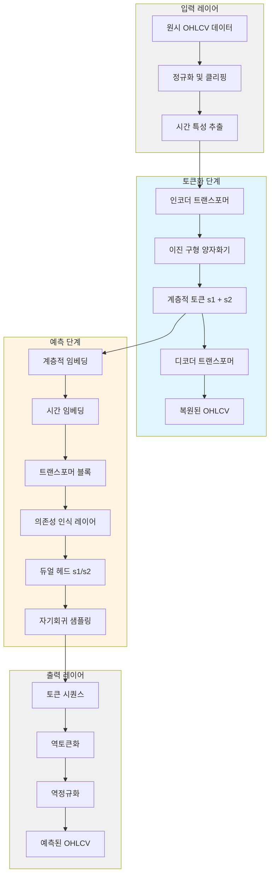
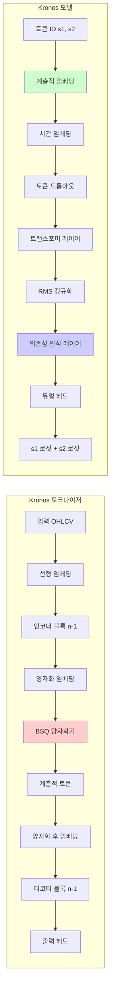
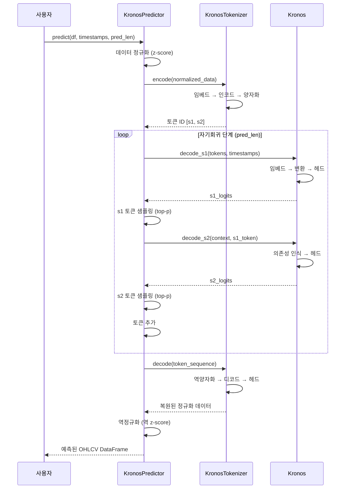
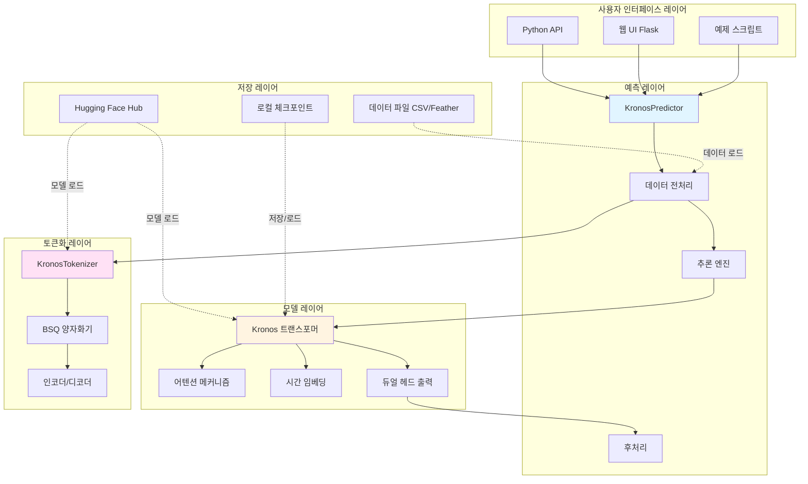
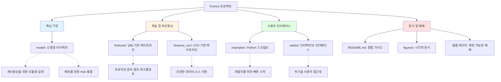
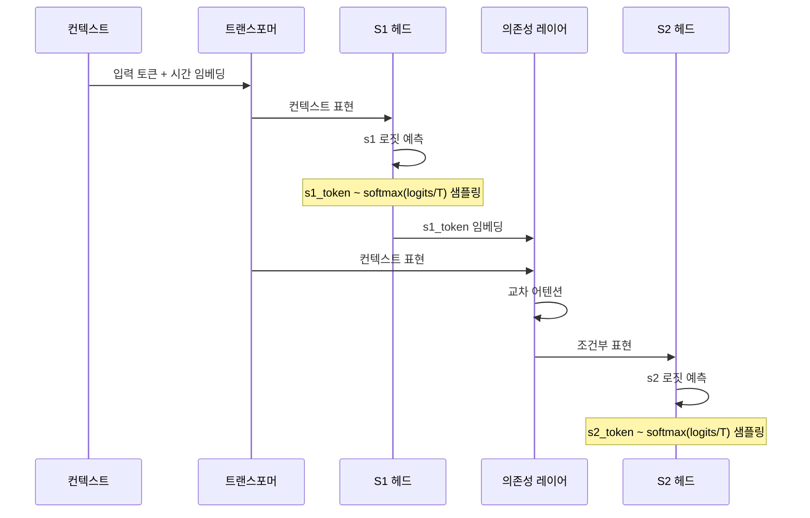
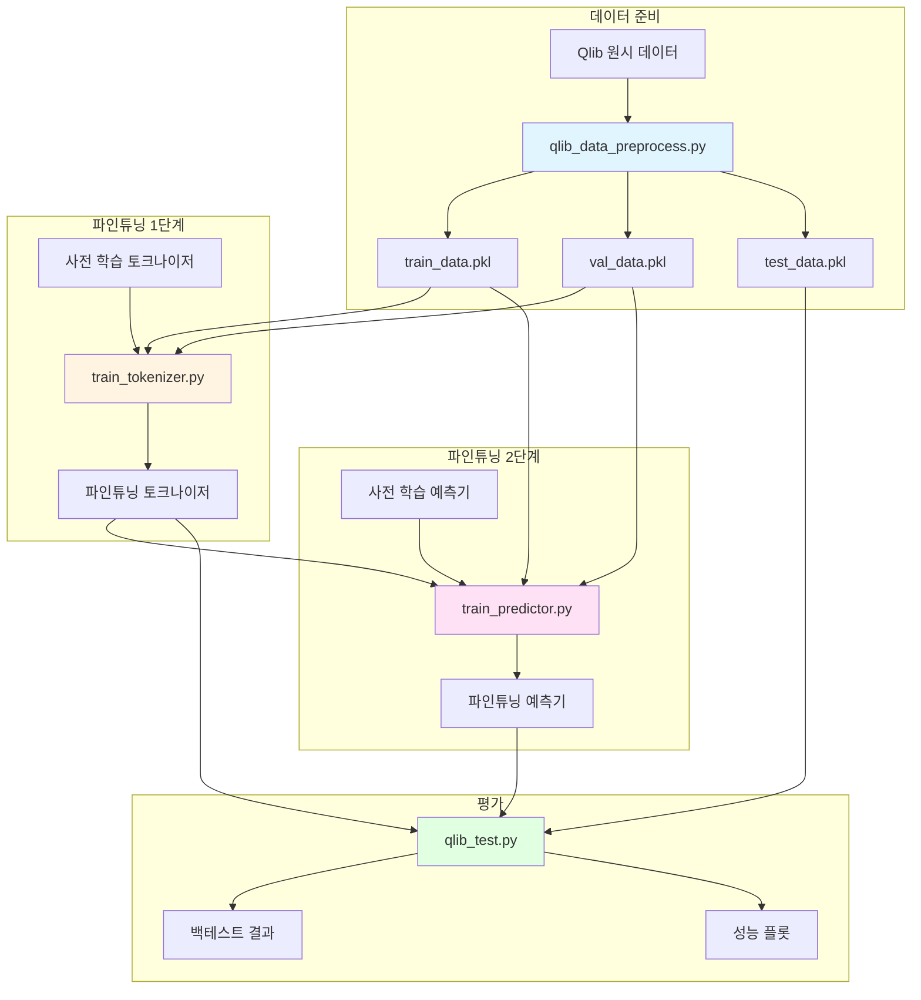
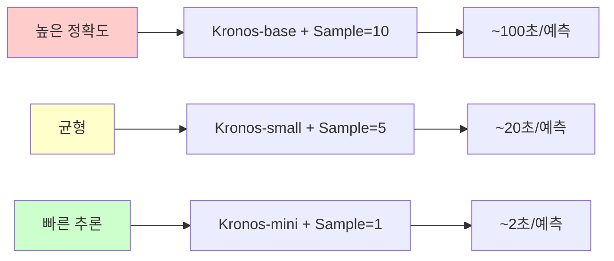

# Kronos: 금융 시장을 위한 파운데이션 모델 - 종합 기술 분석

## 요약

**Kronos**는 금융 캔들스틱(K-라인) 데이터 분석 및 예측을 위해 특별히 설계된 획기적인 오픈소스 파운데이션 모델입니다. 범용 시계열 모델과 달리, Kronos는 계층적 토큰화와 자기회귀 트랜스포머를 결합한 새로운 2단계 아키텍처를 활용하여 금융 시장 데이터의 고유한 고잡음 특성을 처리합니다. 이 프로젝트는 전 세계 45개 이상의 거래소 데이터로 학습된 최초의 오픈소스 파운데이션 모델을 대표합니다.

**핵심 하이라이트:**
- **도메인 특화 설계**: 금융 OHLCV(시가, 고가, 저가, 종가, 거래량) 데이터 전용 구축
- **2단계 아키텍처**: 특화된 토크나이저 + 대규모 트랜스포머 디코더
- **모델 패밀리**: 다양한 계산 요구사항을 위한 여러 크기(mini, small, base)
- **프로덕션 준비**: 웹 UI, 파인튜닝 파이프라인, 포괄적인 예제 포함
- **연구 기반**: 학술 논문 지원(arXiv:2508.02739)

---

## 목차

1. [프로젝트 개요](#1-프로젝트-개요)
2. [기술 아키텍처](#2-기술-아키텍처)
3. [프로젝트 구조](#3-프로젝트-구조)
4. [설치 및 설정](#4-설치-및-설정)
5. [사용 가이드](#5-사용-가이드)
6. [개발 가이드라인](#6-개발-가이드라인)
7. [모델 아키텍처 심층 분석](#7-모델-아키텍처-심층-분석)
8. [파인튜닝 파이프라인](#8-파인튜닝-파이프라인)
9. [웹 UI 애플리케이션](#9-웹-ui-애플리케이션)
10. [성능 고려사항](#10-성능-고려사항)
11. [보안 및 라이선스](#11-보안-및-라이선스)
12. [추가 리소스](#12-추가-리소스)
13. [결론](#13-결론)

---

## 1. 프로젝트 개요

### 1.1 문제 정의

금융 시장은 캔들스틱 차트(K-라인) 형태로 막대한 양의 시계열 데이터를 생성합니다. 기존 시계열 예측 모델은 여러 과제에 직면합니다:

- **높은 노이즈**: 금융 데이터는 상당한 시장 노이즈와 변동성 포함
- **복잡한 패턴**: OHLCV 특성 간 다차원 상관관계
- **시간적 의존성**: 가격 움직임의 장기 의존성
- **도메인 특화**: 일반 모델은 금융 시장 역학을 포착하지 못함

### 1.2 솔루션 접근법

Kronos는 다음을 통해 이러한 과제를 해결합니다:

1. **계층적 토큰화**: 이진 구형 양자화(BSQ)를 사용하여 연속적인 OHLCV 데이터를 이산 토큰으로 변환
2. **자기회귀 트랜스포머**: 금융 데이터로 사전 학습된 대규모 디코더 전용 아키텍처
3. **2레벨 토큰**: 효율적인 표현을 위한 계층적 토큰 구조(s1 + s2)
4. **시간 임베딩**: 시간 인식 위치 인코딩(분, 시간, 일, 요일, 월)

### 1.3 핵심 기능

#### 예측 기능
- 다단계 앞서 예측(구성 가능한 예측 길이)
- 온도 및 nucleus 샘플링을 사용한 확률적 예측
- 다중 시계열 배치 예측
- 다양한 시간 프레임 지원(분, 시간, 일)

#### 모델 변형
| 모델 | 파라미터 | 컨텍스트 길이 | 토크나이저 | 사용 사례 |
|-------|-----------|----------------|-----------|----------|
| Kronos-mini | 4.1M | 2048 | Kronos-Tokenizer-2k | 빠른 추론, 리소스 제한 환경 |
| Kronos-small | 24.7M | 512 | Kronos-Tokenizer-base | 균형잡힌 성능 |
| Kronos-base | 102.3M | 512 | Kronos-Tokenizer-base | 고품질 예측 |

#### 주요 기능
- 미지의 시장에 대한 제로샷 예측
- 커스텀 데이터셋으로 파인튜닝 가능
- 대화형 예측을 위한 웹 UI
- 퀀트 트레이딩을 위한 Qlib 통합
- 배치 처리 지원

### 1.4 대상 사용자

- **퀀트 연구자**: 트레이딩 전략 구축 및 백테스팅
- **데이터 과학자**: 금융 시계열 분석 및 예측
- **알고리즘 트레이더**: 자동 거래 시스템 개발
- **학술 연구자**: 금융 ML 및 시계열 모델링
- **금융 분석가**: 시장 트렌드 분석 및 예측

---

## 2. 기술 아키텍처

### 2.1 고수준 시스템 아키텍처



### 2.2 기술 스택

#### 핵심 의존성
```
Python 3.10+
PyTorch (딥러닝 프레임워크)
NumPy (수치 계산)
Pandas (데이터 조작)
```

#### 주요 라이브러리
```
huggingface_hub==0.33.1  # 모델 호스팅 및 배포
einops==0.8.1            # 텐서 연산
safetensors==0.6.2       # 모델 직렬화
matplotlib==3.9.3        # 시각화
tqdm==4.67.1             # 진행 표시줄
```

#### 선택적 의존성
```
pyqlib                   # 퀀트 투자 라이브러리 (파인튜닝)
flask, flask-cors        # 웹 UI 백엔드
plotly                   # 인터랙티브 차트
comet_ml                 # 실험 추적
```

### 2.3 아키텍처 구성요소



### 2.4 설계 패턴 및 원칙

#### 1. 계층적 토큰화 패턴
- **목적**: 연속적인 다차원 데이터의 효율적 표현
- **구현**: 2레벨 토큰 구조(s1: 거친, s2: 세밀한)
- **이점**: 표현력을 유지하면서 어휘 크기 감소

#### 2. 의존성 인식 디코딩
- **목적**: 계층적 토큰 간 의존성 모델링
- **구현**: s1과 s2 토큰 간 교차 어텐션
- **이점**: 복원 품질 향상

#### 3. 자기회귀 생성
- **목적**: 불확실성 정량화를 통한 순차 예측
- **구현**: 학습 중 teacher forcing, 추론 중 샘플링
- **이점**: 제어 가능한 무작위성을 갖춘 확률적 예측

#### 4. Hub 기반 배포
- **목적**: 쉬운 모델 공유 및 배포
- **구현**: PyTorchModelHubMixin 통합
- **이점**: Hugging Face Hub에서 한 줄로 모델 로드

### 2.5 데이터 흐름 다이어그램



### 2.6 구성요소 상호작용



---

## 3. 프로젝트 구조

### 3.1 디렉토리 구성

```
Kronos/
├── model/                          # 핵심 모델 구현
│   ├── __init__.py                # 주요 클래스 익스포트
│   ├── kronos.py                  # 메인 모델 클래스
│   └── module.py                  # 신경망 모듈
│
├── finetune/                      # 파인튜닝 파이프라인
│   ├── config.py                  # 설정 파라미터
│   ├── train_tokenizer.py         # 토크나이저 파인튜닝
│   ├── train_predictor.py         # 예측기 파인튜닝
│   ├── qlib_data_preprocess.py    # Qlib 데이터 준비
│   ├── qlib_test.py               # 백테스팅 스크립트
│   ├── dataset.py                 # 데이터셋 클래스
│   └── utils/                     # 학습 유틸리티
│       ├── __init__.py
│       └── training_utils.py      # 헬퍼 함수
│
├── finetune_csv/                  # CSV 기반 파인튜닝 (대안)
│   ├── config_loader.py           # 설정 관리
│   ├── configs/                   # 설정 파일
│   ├── data/                      # 샘플 데이터셋
│   └── examples/                  # 예제 스크립트
│
├── examples/                      # 사용 예제
│   ├── prediction_example.py      # 기본 예측
│   ├── prediction_batch_example.py # 배치 예측
│   ├── prediction_wo_vol_example.py # 거래량 없이
│   └── data/                      # 샘플 데이터 파일
│       └── XSHG_5min_600977.csv   # 예제 데이터셋
│
├── webui/                         # 웹 기반 인터페이스
│   ├── app.py                     # Flask 애플리케이션
│   ├── run.py                     # 시작 스크립트
│   ├── requirements.txt           # 웹 UI 의존성
│   ├── templates/                 # HTML 템플릿
│   │   └── index.html
│   └── prediction_results/        # 저장된 예측 (JSON)
│
├── figures/                       # 문서 이미지
│   ├── logo.png
│   ├── overview.png
│   ├── prediction_example.png
│   └── backtest_result_example.png
│
├── requirements.txt               # 핵심 의존성
├── README.md                      # 프로젝트 문서
├── LICENSE                        # MIT 라이선스
└── .gitignore                     # Git 무시 규칙
```

### 3.2 프로젝트 구조 설계 근거



### 3.3 주요 파일 설명

#### 핵심 모델 파일

**`model/kronos.py`** (627줄)
- **목적**: 주요 모델 구현
- **주요 클래스**:
  - `KronosTokenizer`: BSQ를 사용한 계층적 토큰화
  - `Kronos`: 디코더 전용 트랜스포머 예측기
  - `KronosPredictor`: 고수준 예측 API
- **주요 함수**:
  - `auto_regressive_inference()`: 자기회귀 생성 루프
  - `calc_time_stamps()`: 시간 특성 추출
  - `top_k_top_p_filtering()`: Nucleus 샘플링

**`model/module.py`** (582줄)
- **목적**: 신경망 빌딩 블록
- **주요 클래스**:
  - `BinarySphericalQuantizer`: BSQ 구현
  - `TransformerBlock`: 표준 트랜스포머 레이어
  - `MultiHeadAttentionWithRoPE`: 회전 위치 임베딩
  - `HierarchicalEmbedding`: 2레벨 토큰 임베딩
  - `DependencyAwareLayer`: s1-s2용 교차 어텐션
  - `TemporalEmbedding`: 시간 기반 임베딩
  - `DualHead`: s1/s2용 별도 출력 헤드

#### 파인튜닝 파일

**`finetune/config.py`** (132줄)
- **목적**: 중앙 집중식 설정 관리
- **주요 파라미터**:
  - 데이터 경로 (Qlib, 데이터셋, 체크포인트)
  - 하이퍼파라미터 (학습률, 배치 크기, 에폭)
  - 모델 경로 (사전 학습, 파인튜닝)
  - 백테스팅 파라미터

**`finetune/train_tokenizer.py`**
- **목적**: 도메인 특화 데이터로 토크나이저 파인튜닝
- **기능**: torchrun을 통한 멀티 GPU 지원, 검증 메트릭, 체크포인트 저장

**`finetune/train_predictor.py`**
- **목적**: 예측기 모델 파인튜닝
- **기능**: 분산 학습, 조기 종료, Comet ML 로깅

**`finetune/qlib_data_preprocess.py`**
- **목적**: Qlib 데이터를 학습 형식으로 변환
- **출력**: 슬라이딩 윈도우를 사용한 pickle 파일 (train/val/test)

**`finetune/qlib_test.py`**
- **목적**: 퀀트 전략을 사용한 백테스팅
- **전략**: 구성 가능한 파라미터를 사용한 Top-K 포트폴리오

#### 웹 UI 파일

**`webui/app.py`** (709줄)
- **목적**: 대화형 예측을 위한 Flask 웹 애플리케이션
- **엔드포인트**:
  - `/api/data-files`: 사용 가능한 데이터셋 목록
  - `/api/load-data`: 데이터 로드 및 검증
  - `/api/load-model`: Kronos 모델 초기화
  - `/api/predict`: 예측 생성
  - `/api/model-status`: 모델 상태 확인
- **기능**:
  - 인터랙티브 Plotly 차트
  - 커스텀 시간 범위 선택
  - 예측 vs 실제 비교
  - JSON으로 결과 내보내기

---

## 4. 설치 및 설정

### 4.1 전제 조건

#### 시스템 요구사항
- **운영 체제**: Linux, macOS 또는 Windows
- **Python 버전**: 3.10 이상
- **GPU** (선택사항이지만 권장):
  - CUDA 호환 GPU (빠른 추론용)
  - Kronos-small용 최소 4GB VRAM
  - Kronos-base용 8GB+ VRAM

#### 소프트웨어 의존성
- Python 패키지 매니저 (pip)
- Git (저장소 클론용)
- CUDA 툴킷 (GPU 사용 시)

### 4.2 단계별 설치

#### 옵션 1: 기본 설치 (예측 전용)

```bash
# 1. 저장소 클론
git clone https://github.com/shiyu-coder/Kronos.git
cd Kronos

# 2. 가상 환경 생성 (권장)
python -m venv venv
source venv/bin/activate  # Windows: venv\Scripts\activate

# 3. 핵심 의존성 설치
pip install -r requirements.txt

# 4. 설치 확인
python -c "from model import Kronos, KronosTokenizer; print('설치 성공!')"
```

#### 옵션 2: 전체 설치 (파인튜닝 및 웹 UI 포함)

```bash
# 옵션 1의 1-3단계 수행 후:

# 4. 파인튜닝용 Qlib 설치
pip install pyqlib

# 5. 웹 UI 의존성 설치
pip install -r webui/requirements.txt

# 6. (선택사항) 실험 추적 설치
pip install comet_ml

# 7. 전체 설치 확인
python -c "import qlib; import flask; print('전체 설치 성공!')"
```

### 4.3 설정

#### 환경 설정

API 키용 `.env` 파일 생성 (Comet ML 사용 시):

```bash
# .env 파일
COMET_API_KEY=your_comet_api_key_here
COMET_WORKSPACE=your_workspace
```

#### Qlib 데이터 설정 (파인튜닝용)

```bash
# Qlib 데이터 다운로드 (중국 A-주식 예제)
python -m qlib.run.get_data qlib_data --target_dir ~/.qlib/qlib_data/cn_data --region cn

# config.py를 데이터 경로로 업데이트
# finetune/config.py 편집:
# self.qlib_data_path = "~/.qlib/qlib_data/cn_data"
```

### 4.4 일반적인 문제 해결

#### 문제 1: CUDA 메모리 부족

**증상**: RuntimeError: CUDA out of memory

**해결 방법**:
```python
# 옵션 A: 더 작은 모델 사용
tokenizer = KronosTokenizer.from_pretrained("NeoQuasar/Kronos-Tokenizer-2k")
model = Kronos.from_pretrained("NeoQuasar/Kronos-mini")  # -base 대신

# 옵션 B: 예측에서 배치 크기 감소
predictor.predict(..., sample_count=1)  # 5 대신

# 옵션 C: CPU 사용
predictor = KronosPredictor(model, tokenizer, device="cpu")
```

#### 문제 2: Hugging Face Hub 연결 시간 초과

**증상**: urllib3.exceptions.ReadTimeoutError

**해결 방법**:
```bash
# 옵션 A: 미러 사용 (중국 사용자)
export HF_ENDPOINT=https://hf-mirror.com

# 옵션 B: 수동으로 다운로드하고 로컬에서 로드
# https://huggingface.co/NeoQuasar/Kronos-small 에서 다운로드
tokenizer = KronosTokenizer.from_pretrained("/path/to/local/tokenizer")
model = Kronos.from_pretrained("/path/to/local/model")
```

#### 문제 3: 거래량/금액 열 누락

**증상**: ValueError: volume column not found

**해결 방법**: 예측기가 누락된 열을 자동으로 처리:
```python
# 거래량과 금액은 선택사항 - 0으로 채워짐
df = df[['open', 'high', 'low', 'close']]  # 거래량/금액 불필요
pred_df = predictor.predict(df, ...)  # 정상 작동
```

---

## 5. 사용 가이드

### 5.1 기본 예측 예제

```python
import pandas as pd
from model import Kronos, KronosTokenizer, KronosPredictor

# 1단계: Hugging Face에서 사전 학습된 모델 로드
tokenizer = KronosTokenizer.from_pretrained("NeoQuasar/Kronos-Tokenizer-base")
model = Kronos.from_pretrained("NeoQuasar/Kronos-small")

# 2단계: 예측기 인스턴스 생성
predictor = KronosPredictor(
    model=model,
    tokenizer=tokenizer,
    device="cuda:0",      # GPU 없으면 "cpu" 사용
    max_context=512,      # 모델의 최대 컨텍스트 길이
    clip=5                # 이상치용 데이터 클리핑 값
)

# 3단계: 데이터 준비
df = pd.read_csv("your_data.csv")
df['timestamps'] = pd.to_datetime(df['timestamps'])

# 예측 파라미터 정의
lookback = 400   # 사용할 과거 데이터 포인트 수
pred_len = 120   # 예측할 미래 데이터 포인트 수

# 입력 데이터 추출
x_df = df.iloc[:lookback, ['open', 'high', 'low', 'close', 'volume', 'amount']]
x_timestamp = df.iloc[:lookback, 'timestamps']
y_timestamp = df.iloc[lookback:lookback+pred_len, 'timestamps']

# 4단계: 예측 생성
pred_df = predictor.predict(
    df=x_df,
    x_timestamp=x_timestamp,
    y_timestamp=y_timestamp,
    pred_len=pred_len,
    T=1.0,              # 온도 (높을수록 무작위성 증가)
    top_p=0.9,          # Nucleus 샘플링 임계값
    sample_count=1,     # 평균화할 샘플 수
    verbose=True        # 진행 표시줄 표시
)

# 5단계: 예측 사용
print(pred_df.head())
print(f"예측된 종가: {pred_df['close'].values}")
```

### 5.2 배치 예측

여러 시계열을 병렬로 예측:

```python
# 여러 데이터셋 준비
df_list = [df1, df2, df3]  # 각각 pandas DataFrame
x_timestamp_list = [x_ts1, x_ts2, x_ts3]
y_timestamp_list = [y_ts1, y_ts2, y_ts3]

# 배치 예측 (GPU 병렬 처리)
pred_df_list = predictor.predict_batch(
    df_list=df_list,
    x_timestamp_list=x_timestamp_list,
    y_timestamp_list=y_timestamp_list,
    pred_len=120,
    T=1.0,
    top_p=0.9,
    sample_count=1,
    verbose=True
)

# pred_df_list의 각 요소는 입력 시리즈에 대응
for i, pred_df in enumerate(pred_df_list):
    print(f"시리즈 {i} 예측:", pred_df.head())
```

**배치 예측 요구사항**:
- 모든 시리즈는 동일한 `lookback` 길이를 가져야 함
- 모든 시리즈는 동일한 `pred_len`을 가져야 함
- 모든 DataFrame은 필수 열 포함: `['open', 'high', 'low', 'close']`

### 5.3 거래량/금액 없이 예측

```python
# 데이터에 거래량/금액 열이 없는 경우
df_no_vol = df[['open', 'high', 'low', 'close']]  # OHLC만

# 예측기가 자동으로 누락된 열을 0으로 채움
pred_df = predictor.predict(
    df=df_no_vol,
    x_timestamp=x_timestamp,
    y_timestamp=y_timestamp,
    pred_len=120
)

# 예측된 거래량과 금액은 0이 됨 (무시 가능)
print(pred_df[['open', 'high', 'low', 'close']].head())
```

### 5.4 고급 샘플링 파라미터

#### 온도 제어
```python
# 낮은 온도 (더 결정적)
pred_conservative = predictor.predict(..., T=0.5, top_p=0.9)

# 높은 온도 (더 탐색적)
pred_diverse = predictor.predict(..., T=1.5, top_p=0.9)

# 무작위성 없음 (탐욕 디코딩)
pred_greedy = predictor.predict(..., T=0.01, top_p=1.0)
```

#### 다중 샘플 평균화
```python
# 더 부드러운 예측을 위해 10개 샘플 평균화
pred_smooth = predictor.predict(
    ...,
    T=1.0,
    top_p=0.9,
    sample_count=10  # 샘플 많을수록 부드럽지만 느림
)
```

### 5.5 웹 UI 사용

#### 웹 서버 시작

```bash
cd webui
python app.py
# 서버가 http://localhost:7070 에서 시작됨
```

#### 웹 UI 워크플로우

1. **모델 로드**:
   - 모델 변형 선택 (mini/small/base)
   - 장치 선택 (CPU/GPU)
   - "모델 로드" 클릭

2. **데이터 로드**:
   - OHLC 열이 있는 CSV 파일 업로드
   - 데이터 요약 확인 (행, 날짜 범위, 가격 범위)

3. **예측 구성**:
   - 룩백 윈도우 설정 (기본값: 400)
   - 예측 길이 설정 (기본값: 120)
   - 온도 및 top_p 조정

4. **예측 생성**:
   - "예측" 클릭
   - 인터랙티브 Plotly 차트 보기
   - 실제 데이터와 비교 (사용 가능한 경우)

5. **결과 내보내기**:
   - 예측이 자동으로 `webui/prediction_results/`에 저장됨
   - 메타데이터 및 분석이 포함된 JSON 형식

### 5.6 API 참조

#### KronosPredictor 클래스

```python
class KronosPredictor:
    def __init__(
        self,
        model: Kronos,
        tokenizer: KronosTokenizer,
        device: str = "cuda:0",
        max_context: int = 512,
        clip: float = 5.0
    ):
        """
        예측기 초기화.

        Args:
            model: 사전 학습된 Kronos 모델
            tokenizer: 해당 토크나이저
            device: 추론용 장치 ("cuda:0", "cpu" 등)
            max_context: 최대 시퀀스 길이
            clip: 정규화 후 데이터 클리핑 값
        """

    def predict(
        self,
        df: pd.DataFrame,
        x_timestamp: pd.Series,
        y_timestamp: pd.Series,
        pred_len: int,
        T: float = 1.0,
        top_k: int = 0,
        top_p: float = 0.9,
        sample_count: int = 1,
        verbose: bool = True
    ) -> pd.DataFrame:
        """
        단일 시계열 예측 생성.

        Args:
            df: 과거 OHLCV 데이터
            x_timestamp: 과거 데이터용 타임스탬프
            y_timestamp: 예측용 타임스탬프
            pred_len: 예측할 단계 수
            T: 샘플링 온도 (0.1-2.0)
            top_k: Top-k 샘플링 (0 = 비활성화)
            top_p: Nucleus 샘플링 임계값 (0.0-1.0)
            sample_count: 평균화할 샘플 수
            verbose: 진행 표시줄 표시

        Returns:
            예측된 OHLCV 값이 있는 DataFrame
        """

    def predict_batch(
        self,
        df_list: list[pd.DataFrame],
        x_timestamp_list: list[pd.Series],
        y_timestamp_list: list[pd.Series],
        pred_len: int,
        T: float = 1.0,
        top_k: int = 0,
        top_p: float = 0.9,
        sample_count: int = 1,
        verbose: bool = True
    ) -> list[pd.DataFrame]:
        """
        여러 시계열 배치 예측.

        Returns:
            예측 DataFrame 목록 (입력과 동일한 순서)
        """
```

#### 데이터 형식 요구사항

**입력 DataFrame**:
```python
# 필수 열:
df.columns = ['open', 'high', 'low', 'close']

# 선택적 열:
df.columns = ['open', 'high', 'low', 'close', 'volume', 'amount']

# 타임스탬프 열 (다음 이름 중 하나):
df.columns = [..., 'timestamps']  # 또는 'timestamp' 또는 'date'
```

**타임스탬프 형식**:
```python
# pandas datetime 타입이어야 함
df['timestamps'] = pd.to_datetime(df['timestamps'])

# 예시:
"2024-01-01 09:30:00"
"2024-01-01"
"2024-01-01T09:30:00Z"
```

---

## 6. 개발 가이드라인

### 6.1 개발 환경 설정

```bash
# 개발 환경 생성
python -m venv venv-dev
source venv-dev/bin/activate

# 의존성 설치
pip install -r requirements.txt
pip install -r webui/requirements.txt

# 개발 도구 설치
pip install pytest black flake8 mypy jupyter

# 편집 가능 모드로 설치
pip install -e .
```

### 6.2 코드 스타일 및 표준

코드베이스는 다음 규칙을 따릅니다:

- **독스트링**: 모든 공개 메서드에 Google 스타일 독스트링
- **타입 힌트**: 점진적으로 타입 주석 추가
- **네이밍**:
  - 클래스: `PascalCase` (예: `KronosTokenizer`)
  - 함수: `snake_case` (예: `auto_regressive_inference`)
  - 상수: `UPPER_SNAKE_CASE` (예: `AVAILABLE_MODELS`)
- **라인 길이**: ~100자 (가독성을 위해 유연함)

### 6.3 테스팅 전략

#### 단위 테스트

```python
# 예제 테스트 구조 (현재 코드베이스에 미포함)
import pytest
from model import KronosPredictor, Kronos, KronosTokenizer

def test_predictor_initialization():
    tokenizer = KronosTokenizer.from_pretrained("NeoQuasar/Kronos-Tokenizer-base")
    model = Kronos.from_pretrained("NeoQuasar/Kronos-mini")
    predictor = KronosPredictor(model, tokenizer, device="cpu")
    assert predictor.device == "cpu"

def test_prediction_shape():
    # ... 모델 및 데이터 로드
    pred_df = predictor.predict(...)
    assert len(pred_df) == pred_len
    assert set(pred_df.columns) == {'open', 'high', 'low', 'close', 'volume', 'amount'}
```

#### 통합 테스트

파인튜닝 파이프라인 테스트:
```bash
# 학습용 스모크 테스트
python finetune/train_tokenizer.py --epochs 1 --batch_size 2

# 백테스팅용 스모크 테스트
python finetune/qlib_test.py --device cpu
```

### 6.4 기여 워크플로우

1. **포크 및 클론**:
   ```bash
   git clone https://github.com/YOUR_USERNAME/Kronos.git
   cd Kronos
   git remote add upstream https://github.com/shiyu-coder/Kronos.git
   ```

2. **기능 브랜치 생성**:
   ```bash
   git checkout -b feature/your-feature-name
   ```

3. **변경 사항 작성**:
   - 깨끗하고 문서화된 코드 작성
   - 해당되는 경우 테스트 추가
   - 기능 추가 시 README 업데이트

4. **커밋 및 푸시**:
   ```bash
   git add .
   git commit -m "feat: 기능 설명 추가"
   git push origin feature/your-feature-name
   ```

5. **풀 리퀘스트 제출**:
   - 변경 사항 및 동기 설명
   - 관련 이슈 참조
   - CI 통과 확인 (설정된 경우)

---

## 7. 모델 아키텍처 심층 분석

### 7.1 이진 구형 양자화 (BSQ)

#### 개념

BSQ는 연속 벡터를 초구 상의 이진 코드로 매핑하는 새로운 양자화 방법입니다:

```mermaid
graph LR
    A[연속 벡터 z ∈ ℝᵈ] --> B[L2 정규화]
    B --> C[이진 양자화]
    C --> D[양극 코드 {-1, +1}ᵈ]
    D --> E[1/√d로 스케일]
    E --> F[양자화된 벡터 zq]

    style C fill:#ffcccc
```

#### 수학적 공식

1. **정규화**: `z_norm = z / ||z||₂`
2. **양자화**: `zq = sign(z_norm)`
3. **스케일링**: `zq = zq / √d` (L2 정규화용)
4. **인덱스 변환**: `index = Σᵢ (zqᵢ + 1)/2 * 2ⁱ`

#### 손실 구성요소

```python
# module.py:BinarySphericalQuantizer.forward()에서

# 1. 커밋 손실: 인코더 출력이 양자화된 버전과 일치하도록 권장
commit_loss = β * mean((zq.detach() - z)²)

# 2. 샘플별 엔트로피: 각 샘플 내에서 높은 엔트로피 권장
H_sample = -Σᵢ p(bᵢ=1) * log(p(bᵢ=1))

# 3. 코드북 엔트로피: 다양한 코드북 사용 권장
H_codebook = -Σₖ p(codeₖ) * log(p(codeₖ))

# 4. 총 손실
bsq_loss = commit_loss + γ₀ * H_sample - γ * H_codebook
```

#### 계층적 토큰 구조

```
토큰 표현:
┌─────────────────────────────────┐
│  s1 (거친)    │  s2 (세밀한)    │
│   6비트       │   10비트        │
│   2⁶ = 64     │   2¹⁰ = 1024   │
│   어휘        │   어휘          │
└─────────────────────────────────┘

이점:
- s1: 주요 트렌드/패턴 포착
- s2: 세부 변화로 정제
- 총: 16비트 코드북 (65,536 코드)
- 하지만: 64 + 1024 임베딩만 필요!
```

### 7.2 트랜스포머 아키텍처

#### Kronos 모델 구조

```python
# kronos.py:Kronos에서 단순화된 아키텍처

Kronos(
    # 임베딩 레이어
    HierarchicalEmbedding(s1_vocab=64, s2_vocab=1024, d_model=256),
    TemporalEmbedding(d_model=256, learn_pe=True),

    # 트랜스포머 백본
    TransformerBlock[n_layers=12](
        MultiHeadAttentionWithRoPE(n_heads=8, d_model=256),
        FeedForward(d_model=256, ff_dim=1024),
        RMSNorm(d_model=256)
    ),

    # 디코딩 헤드
    DependencyAwareLayer(d_model=256),
    DualHead(s1_vocab=64, s2_vocab=1024)
)
```

#### 주요 혁신

**1. 회전 위치 임베딩 (RoPE)**

```python
# module.py:RotaryPositionalEmbedding에서

# 절대 위치 대신 쿼리와 키를 회전
θⱼ = 10000^(-2j/d)
RoPE(q, k, position) = [
    q * cos(position * θ) + rotate_half(q) * sin(position * θ),
    k * cos(position * θ) + rotate_half(k) * sin(position * θ)
]

# 이점:
# - 상대적 위치 정보
# - 더 긴 시퀀스로의 더 나은 외삽
# - 학습된 위치 임베딩보다 빠름
```

**2. 의존성 인식 디코딩**

```python
# module.py:DependencyAwareLayer에서

# s1과 s2 토큰 간 교차 어텐션
hidden_s2 = DependencyAwareLayer(
    query=s1_embedding,      # s1 토큰을 쿼리로
    key=transformer_output,   # 전체 컨텍스트를 키/값으로
    value=transformer_output
)

# s1에 조건부인 s2 예측:
s2_logits = DualHead.cond_forward(hidden_s2)
```

**3. 계층적 디코딩 프로세스**



### 7.3 시간 임베딩

```python
# module.py:TemporalEmbedding에서

# 타임스탬프에서 추출된 시간 특성:
time_features = {
    'minute': 0-59   (60개 임베딩),
    'hour': 0-23     (24개 임베딩),
    'weekday': 0-6   (7개 임베딩),
    'day': 1-31      (32개 임베딩),
    'month': 1-12    (13개 임베딩)
}

# 총 시간 임베딩:
temporal_emb = emb_minute + emb_hour + emb_weekday + emb_day + emb_month

# 토큰 임베딩에 추가됨:
x = token_emb + temporal_emb
```

**중요한 이유**:
- 일중 패턴 포착 (분, 시간)
- 주간 패턴 포착 (요일)
- 월간 패턴 포착 (일, 월)
- 강한 시간 계절성을 갖는 금융 데이터에 중요

### 7.4 자기회귀 추론

```python
# kronos.py:auto_regressive_inference에서

# 생성 루프 의사 코드
for step in range(pred_len):
    # 1. 현재 컨텍스트 가져오기 (슬라이딩 윈도우)
    if current_seq_len > max_context:
        input_tokens = tokens[:, -max_context:]
    else:
        input_tokens = tokens

    # 2. s1 토큰 예측
    s1_logits, context = model.decode_s1(input_tokens, timestamps)
    s1_logits = s1_logits[:, -1, :]  # 마지막 위치
    s1_token = sample(s1_logits, T, top_p)

    # 3. s2 토큰 예측 (s1에 조건부)
    s2_logits = model.decode_s2(context, s1_token)
    s2_logits = s2_logits[:, -1, :]
    s2_token = sample(s2_logits, T, top_p)

    # 4. 시퀀스에 추가
    tokens = concat(tokens, [s1_token, s2_token])
```

---

## 8. 파인튜닝 파이프라인

### 8.1 파이프라인 개요



### 8.2 설정 구성

**`finetune/config.py` 편집**:

```python
class Config:
    # === 데이터 경로 ===
    qlib_data_path = "~/.qlib/qlib_data/cn_data"  # Qlib 데이터
    dataset_path = "./data/processed_datasets"     # 출력 pickle

    # === 시장 파라미터 ===
    instrument = 'csi300'  # 또는 'csi800', 'csi1000'
    dataset_begin_time = "2011-01-01"
    dataset_end_time = "2025-06-05"

    # === 슬라이딩 윈도우 ===
    lookback_window = 90   # 과거 윈도우
    predict_window = 10    # 예측 윈도우
    max_context = 512      # 모델 컨텍스트 제한

    # === 시간 분할 ===
    train_time_range = ["2011-01-01", "2022-12-31"]
    val_time_range = ["2022-09-01", "2024-06-30"]
    test_time_range = ["2024-04-01", "2025-06-05"]

    # === 학습 하이퍼파라미터 ===
    epochs = 30
    batch_size = 50
    tokenizer_learning_rate = 2e-4
    predictor_learning_rate = 4e-5

    # === 모델 경로 ===
    pretrained_tokenizer_path = "NeoQuasar/Kronos-Tokenizer-base"
    pretrained_predictor_path = "NeoQuasar/Kronos-small"

    save_path = "./outputs/models"
    tokenizer_save_folder_name = 'finetune_tokenizer_demo'
    predictor_save_folder_name = 'finetune_predictor_demo'
```

### 8.3 데이터 준비

```bash
# 1단계: Qlib 데이터 준비
python -m qlib.run.get_data qlib_data --target_dir ~/.qlib/qlib_data/cn_data --region cn

# 2단계: train/val/test 분할로 처리
python finetune/qlib_data_preprocess.py
```

**출력 구조**:
```
data/processed_datasets/
├── train_data.pkl  # (x, y, x_stamp, y_stamp) 튜플 목록
├── val_data.pkl    # 동일한 형식
└── test_data.pkl   # 동일한 형식

# 각 샘플:
x: (lookback_window, 6)  # OHLCV + Amount
y: (predict_window, 6)
x_stamp: (lookback_window, 5)  # 시간 특성
y_stamp: (predict_window, 5)
```

### 8.4 학습 프로세스

#### 1단계: 토크나이저 파인튜닝

```bash
# 멀티 GPU 학습 (권장)
torchrun --standalone --nproc_per_node=2 finetune/train_tokenizer.py

# 단일 GPU
CUDA_VISIBLE_DEVICES=0 python finetune/train_tokenizer.py
```

**학습 루프** (단순화):
```python
for epoch in range(epochs):
    for batch in train_loader:
        # 토크나이저를 통한 순방향 패스
        (z_pre, z), bsq_loss, quantized, z_indices = tokenizer(x)

        # 복원 손실 (MSE)
        recon_loss_pre = mse(z_pre, x)
        recon_loss_full = mse(z, x)

        # 총 손실
        loss = recon_loss_pre + recon_loss_full + bsq_loss

        # 역전파
        optimizer.zero_grad()
        loss.backward()
        optimizer.step()

    # 검증
    val_loss = validate(val_loader)
    if val_loss < best_val_loss:
        save_checkpoint(tokenizer, 'best_model')
```

#### 2단계: 예측기 파인튜닝

```bash
# 멀티 GPU 학습
torchrun --standalone --nproc_per_node=2 finetune/train_predictor.py
```

**학습 루프** (단순화):
```python
for epoch in range(epochs):
    for batch in train_loader:
        # 입력 토큰화
        with torch.no_grad():
            x_tokens = tokenizer.encode(x, half=True)  # [s1, s2]
            y_tokens = tokenizer.encode(y, half=True)

        # Teacher forcing을 사용한 순방향 패스
        s1_logits, s2_logits = model(
            s1_ids=x_tokens[0],
            s2_ids=x_tokens[1],
            stamp=x_stamp,
            use_teacher_forcing=True,
            s1_targets=y_tokens[0]
        )

        # 교차 엔트로피 손실
        ce_loss, ce_s1, ce_s2 = model.head.compute_loss(
            s1_logits, s2_logits,
            y_tokens[0], y_tokens[1]
        )

        # 역전파
        optimizer.zero_grad()
        ce_loss.backward()
        optimizer.step()

    # 검증
    val_loss = validate(val_loader)
    if val_loss < best_val_loss:
        save_checkpoint(model, 'best_model')
```

### 8.5 백테스팅

```bash
python finetune/qlib_test.py --device cuda:0
```

**전략 구현**:

```python
# Top-K 롱 온리 전략
for date in backtest_period:
    # 1. 모든 주식에 대한 예측 생성
    predictions = []
    for stock in universe:
        pred_df = predictor.predict(
            df=stock_data[stock],
            x_timestamp=...,
            y_timestamp=...,
            pred_len=predict_window
        )
        # 시그널: 예측 가격 변화
        signal = (pred_df['close'].iloc[-1] - x_df['close'].iloc[-1]) / x_df['close'].iloc[-1]
        predictions.append((stock, signal))

    # 2. 시그널로 상위 K 주식 선택
    predictions.sort(key=lambda x: x[1], reverse=True)
    top_k_stocks = predictions[:n_symbol_hold]

    # 3. 동일 가중 포트폴리오
    for stock, signal in top_k_stocks:
        position[stock] = capital / n_symbol_hold

    # 4. 수익률 계산
    daily_return = sum(position[s] * actual_return[s] for s in position)
    cumulative_return *= (1 + daily_return)
```

**평가 메트릭**:
```python
# 백테스트 결과에서:
{
    'annualized_return': 0.15,      # 15% 연간 수익률
    'information_ratio': 1.2,       # Sharpe 유사 메트릭
    'max_drawdown': 0.08,           # 8% 최대 낙폭
    'excess_return_without_cost': 0.12,
    'excess_return_with_cost': 0.10
}
```

---

## 9. 웹 UI 애플리케이션

### 9.1 애플리케이션 아키텍처

```mermaid
graph TB
    subgraph "프론트엔드 (HTML/JS)"
        F1[index.html] --> F2[파일 선택]
        F2 --> F3[데이터 검증]
        F3 --> F4[예측 폼]
        F4 --> F5[인터랙티브 차트]
        F5 --> F6[결과 내보내기]
    end

    subgraph "백엔드 (Flask)"
        B1[app.py] --> B2[/api/data-files]
        B1 --> B3[/api/load-data]
        B1 --> B4[/api/load-model]
        B1 --> B5[/api/predict]
        B1 --> B6[/api/model-status]
    end

    subgraph "모델 레이어"
        M1[KronosPredictor]
        M2[Kronos 모델]
        M3[KronosTokenizer]
    end

    F2 --> B2
    F3 --> B3
    F4 --> B4
    F5 --> B5

    B4 --> M1
    B5 --> M1
    M1 --> M2
    M1 --> M3

    style F1 fill:#e1f5ff
    style B1 fill:#fff4e1
    style M1 fill:#ffe1f5
```

### 9.2 주요 기능

#### 1. 모델 선택

```python
# app.py:AVAILABLE_MODELS에서

AVAILABLE_MODELS = {
    'kronos-mini': {
        'model_id': 'NeoQuasar/Kronos-mini',
        'tokenizer_id': 'NeoQuasar/Kronos-Tokenizer-2k',
        'context_length': 2048,
        'params': '4.1M'
    },
    'kronos-small': {...},
    'kronos-base': {...}
}

# API 엔드포인트:
@app.route('/api/load-model', methods=['POST'])
def load_model():
    model_key = request.json.get('model_key')
    device = request.json.get('device', 'cpu')

    tokenizer = KronosTokenizer.from_pretrained(
        AVAILABLE_MODELS[model_key]['tokenizer_id']
    )
    model = Kronos.from_pretrained(
        AVAILABLE_MODELS[model_key]['model_id']
    )
    predictor = KronosPredictor(model, tokenizer, device=device)
```

#### 2. 데이터 파일 관리

```python
# 자동 데이터 발견
def load_data_files():
    data_dir = 'data/'
    data_files = []
    for file in os.listdir(data_dir):
        if file.endswith(('.csv', '.feather')):
            data_files.append({
                'name': file,
                'path': os.path.join(data_dir, file),
                'size': f"{os.path.getsize(file) / 1024:.1f} KB"
            })
    return data_files

# 데이터 검증
def load_data_file(file_path):
    df = pd.read_csv(file_path)

    # 필수 열 확인
    required_cols = ['open', 'high', 'low', 'close']
    if not all(col in df.columns for col in required_cols):
        raise ValueError(f"필수 열 누락")

    # 타임스탬프 열 자동 감지
    if 'timestamps' not in df.columns:
        if 'timestamp' in df.columns:
            df['timestamps'] = pd.to_datetime(df['timestamp'])
        elif 'date' in df.columns:
            df['timestamps'] = pd.to_datetime(df['date'])
        else:
            # 합성 타임스탬프 생성
            df['timestamps'] = pd.date_range(
                start='2024-01-01', periods=len(df), freq='1H'
            )

    return df
```

#### 3. 인터랙티브 시각화

```python
# app.py:create_prediction_chart에서

def create_prediction_chart(df, pred_df, lookback, pred_len, actual_df=None):
    fig = go.Figure()

    # 과거 캔들스틱 (녹색/빨간색)
    fig.add_trace(go.Candlestick(
        x=df['timestamps'][:lookback],
        open=df['open'][:lookback],
        high=df['high'][:lookback],
        low=df['low'][:lookback],
        close=df['close'][:lookback],
        name='과거 데이터',
        increasing_line_color='#26A69A',
        decreasing_line_color='#EF5350'
    ))

    # 예측 캔들스틱 (밝은 녹색/빨간색)
    fig.add_trace(go.Candlestick(
        x=pred_timestamps,
        open=pred_df['open'],
        high=pred_df['high'],
        low=pred_df['low'],
        close=pred_df['close'],
        name='예측',
        increasing_line_color='#66BB6A',
        decreasing_line_color='#FF7043'
    ))

    # 비교를 위한 실제 데이터 (주황색/빨간색)
    if actual_df is not None:
        fig.add_trace(go.Candlestick(
            x=actual_timestamps,
            open=actual_df['open'],
            high=actual_df['high'],
            low=actual_df['low'],
            close=actual_df['close'],
            name='실제 데이터',
            increasing_line_color='#FF9800',
            decreasing_line_color='#F44336'
        ))

    fig.update_layout(
        title='Kronos 예측 결과',
        xaxis_title='시간',
        yaxis_title='가격',
        template='plotly_white',
        height=600
    )

    return json.dumps(fig, cls=plotly.utils.PlotlyJSONEncoder)
```

#### 4. 결과 저장

```python
# 메타데이터와 함께 예측 자동 저장
def save_prediction_results(file_path, prediction_type, prediction_results,
                             actual_data, input_data, prediction_params):
    results_dir = 'webui/prediction_results/'
    timestamp = datetime.now().strftime('%Y%m%d_%H%M%S')
    filename = f'prediction_{timestamp}.json'

    save_data = {
        'timestamp': datetime.now().isoformat(),
        'file_path': file_path,
        'prediction_type': prediction_type,
        'prediction_params': prediction_params,
        'input_data_summary': {
            'rows': len(input_data),
            'price_range': {
                'open': {'min': float(input_data['open'].min()),
                         'max': float(input_data['open'].max())},
                # ... 기타 OHLC 통계
            }
        },
        'prediction_results': prediction_results,
        'actual_data': actual_data,
        'analysis': {
            'continuity': {
                'gaps': {...},
                'gap_percentages': {...}
            }
        }
    }

    with open(os.path.join(results_dir, filename), 'w') as f:
        json.dump(save_data, f, indent=2)
```

### 9.3 사용 워크플로우

1. **서버 시작**:
   ```bash
   cd webui
   python app.py
   # http://localhost:7070 에서 접속
   ```

2. **모델 로드** (UI를 통해):
   - 모델 변형 선택 (mini/small/base)
   - 장치 선택 (CPU/GPU)
   - 모델 로딩 확인 대기

3. **데이터 업로드**:
   - 로컬 CSV 파일 탐색
   - 데이터 정보 확인 (행, 열, 날짜 범위)
   - 데이터 로드 성공 확인

4. **예측 구성**:
   - 룩백: 400 (또는 커스텀)
   - 예측 길이: 120 (또는 커스텀)
   - 온도: 0.5-1.5 (탐색 수준)
   - Top-p: 0.8-0.95 (샘플링 임계값)
   - 샘플 수: 1-10 (평균화)

5. **생성 및 분석**:
   - "예측" 클릭
   - 인터랙티브 차트 보기
   - 실제 데이터와 비교 (사용 가능한 경우)
   - 결과 JSON 다운로드

---

## 10. 성능 고려사항

### 10.1 추론 속도

#### 벤치마크 (Kronos-small, NVIDIA RTX 3090)

| 구성 | 지연 시간 | 처리량 |
|---------------|---------|------------|
| Lookback=400, Pred=120, Sample=1 | ~5초 | 24 단계/초 |
| Lookback=400, Pred=120, Sample=5 | ~20초 | 6 단계/초 |
| 배치 크기=10 (병렬) | ~8초 | 150 단계/초 |

**속도에 영향을 미치는 요인**:
- **컨텍스트 길이**: 룩백이 길수록 → 더 많은 어텐션 계산
- **예측 길이**: 단계 수에 따라 선형 스케일링
- **샘플 수**: 선형 스케일링 (각 샘플 독립적)
- **모델 크기**: Kronos-base는 Kronos-small보다 4배 느림
- **장치**: GPU는 CPU보다 10-50배 빠름

#### 최적화 팁

```python
# 1. 실시간 애플리케이션에 더 작은 모델 사용
model = Kronos.from_pretrained("NeoQuasar/Kronos-mini")  # 4.1M 파라미터

# 2. 샘플 수 감소 (평균화 감소)
pred_df = predictor.predict(..., sample_count=1)  # 5 대신

# 3. 여러 주식에 대한 배치 처리
pred_df_list = predictor.predict_batch(df_list, ...)  # GPU 병렬 처리

# 4. 혼합 정밀도 (지원되는 경우)
model = model.half()  # FP32 대신 FP16 (2배 빠름, 약간 덜 정확)

# 5. 모델 컴파일 (PyTorch 2.0+)
model = torch.compile(model)  # 1.5-2배 속도 향상
```

### 10.2 메모리 요구사항

#### GPU VRAM 사용량

| 모델 | 정밀도 | 배치=1 | 배치=10 | 배치=50 |
|-------|-----------|---------|----------|----------|
| Kronos-mini | FP32 | 0.5 GB | 1.2 GB | 4 GB |
| Kronos-small | FP32 | 1.2 GB | 2.5 GB | 8 GB |
| Kronos-base | FP32 | 3.5 GB | 8 GB | 24 GB |
| Kronos-small | FP16 | 0.6 GB | 1.3 GB | 4 GB |

**메모리 최적화**:
```python
# 1. 그래디언트 체크포인팅 (학습만)
model.gradient_checkpointing_enable()

# 2. 배치 크기 감소
config.batch_size = 10  # 50 대신

# 3. FP16 사용 (반정밀도)
model = model.half()
x = x.half()

# 4. 예측 간 캐시 지우기
torch.cuda.empty_cache()

# 5. 대형 모델용 CPU 오프로딩
model = model.to('cpu')
model.to('cuda:0')  # 추론 중에만 GPU로 이동
```

### 10.3 정확도 vs 속도 트레이드오프



**권장사항**:
- **연구/백테스팅**: Kronos-base 사용, sample_count=10
- **프로덕션 트레이딩**: Kronos-small 사용, sample_count=3-5
- **실시간 대시보드**: Kronos-mini 사용, sample_count=1

### 10.4 확장성

#### 수평 스케일링 (멀티 GPU)

```python
# torchrun을 사용한 파인튜닝 (내장 지원)
torchrun --standalone --nproc_per_node=4 finetune/train_predictor.py

# DataParallel을 사용한 추론
model = nn.DataParallel(model, device_ids=[0, 1, 2, 3])

# 수동 샤딩을 사용한 추론
predictions = []
for gpu_id, df_batch in enumerate(data_batches):
    model_gpu = model.to(f'cuda:{gpu_id}')
    pred = model_gpu.predict(df_batch)
    predictions.append(pred)
```

#### 분산 백테스팅

```python
# 예: 1000개 주식을 병렬로 백테스트
from multiprocessing import Pool

def predict_stock(stock_id):
    # 데이터 로드
    df = load_stock_data(stock_id)
    # 예측
    pred_df = predictor.predict(df, ...)
    # 시그널 계산
    signal = compute_signal(pred_df)
    return (stock_id, signal)

# 병렬 처리
with Pool(processes=16) as pool:
    results = pool.map(predict_stock, stock_ids)
```

---

## 11. 보안 및 라이선스

### 11.1 보안 고려사항

#### 데이터 프라이버시

**민감한 데이터 처리**:
- Kronos는 금융 데이터를 로컬에서 처리 (데이터 전송 없음)
- 웹 UI는 기본적으로 localhost에서 실행 (인터넷에 노출되지 않음)
- 예측 결과는 `webui/prediction_results/`에 로컬로 저장됨

**권장사항**:
```python
# 1. 공개 배포 시 웹 UI 보안
app.run(
    debug=False,  # 프로덕션에서 디버그 모드 비활성화
    host='127.0.0.1',  # localhost에만 바인딩
    ssl_context=('cert.pem', 'key.pem')  # HTTPS 사용
)

# 2. 파일 경로 살균
import os
file_path = os.path.abspath(file_path)
if not file_path.startswith('/allowed/directory/'):
    raise ValueError("접근 거부")

# 3. 파일 크기 제한
MAX_FILE_SIZE = 100 * 1024 * 1024  # 100 MB
if os.path.getsize(file_path) > MAX_FILE_SIZE:
    raise ValueError("파일이 너무 큼")
```

#### 모델 보안

**적대적 견고성**:
- 입력 클리핑(`clip=5`)으로 극단적인 이상치 완화
- Z-스코어 정규화로 스케일에 대한 민감도 감소
- 알려진 적대적 공격 벡터 없음 (안전 중요 아님)

**공급망**:
```python
# 모델 체크섬 확인 (Hugging Face가 SHA256 제공)
from huggingface_hub import hf_hub_download

model_path = hf_hub_download(
    repo_id="NeoQuasar/Kronos-small",
    filename="model.safetensors",
    # cache_dir="./models"  # 로컬 캐시 사용
)

# safetensors 형식은 임의 코드 실행 방지
model = Kronos.from_pretrained(model_path)
```

### 11.2 라이선스 정보

#### 프로젝트 라이선스

**MIT 라이선스** (source/Kronos/LICENSE)

```
Copyright (c) 2025 ShiYu

본 소프트웨어 및 관련 문서 파일("소프트웨어")의 사본을 얻는 모든 사람에게
무료로, 소프트웨어를 제한 없이 다룰 수 있는 권한이 부여됩니다.
여기에는 사용, 복사, 수정, 병합, 게시, 배포, 서브라이선스 및/또는
소프트웨어의 사본 판매 권리가 포함됩니다...
```

**주요 사항**:
- ✅ 상업적 사용 허용
- ✅ 수정 허용
- ✅ 배포 허용
- ✅ 개인 사용 허용
- ⚠️ 보증 또는 책임 없음
- ℹ️ 저작권 고지 포함 필수

#### 모델 라이선스

**사전 학습 모델** (Hugging Face의 NeoQuasar):
- Kronos-mini: MIT 라이선스
- Kronos-small: MIT 라이선스
- Kronos-base: MIT 라이선스
- 토크나이저: MIT 라이선스

**서드파티 의존성**:
- PyTorch: BSD-3-Clause
- Hugging Face Hub: Apache 2.0
- Qlib (선택사항): MIT 라이선스
- Flask (선택사항): BSD-3-Clause

### 11.3 인용 및 속성

#### 학술 인용

연구에서 Kronos를 사용하는 경우 다음과 같이 인용하세요:

```bibtex
@misc{shi2025kronos,
    title={Kronos: A Foundation Model for the Language of Financial Markets},
    author={Yu Shi and Zongliang Fu and Shuo Chen and Bohan Zhao and
            Wei Xu and Changshui Zhang and Jian Li},
    year={2025},
    eprint={2508.02739},
    archivePrefix={arXiv},
    primaryClass={q-fin.ST},
    url={https://arxiv.org/abs/2508.02739},
}
```

#### 상업적 속성

상업 제품에서 사용할 때:
- MIT 라이선스 텍스트 포함
- 원저자 크레딧 (선택사항이지만 권장)
- GitHub 저장소 링크: https://github.com/shiyu-coder/Kronos

---

## 12. 추가 리소스

### 12.1 프로젝트 링크

- **GitHub 저장소**: https://github.com/shiyu-coder/Kronos
- **Hugging Face 모델**: https://huggingface.co/NeoQuasar
- **라이브 데모**: https://shiyu-coder.github.io/Kronos-demo/
- **arXiv 논문**: https://arxiv.org/abs/2508.02739

### 12.2 관련 프로젝트

- **Qlib**: Microsoft의 퀀트 투자 라이브러리
  - https://github.com/microsoft/qlib
- **FinGPT**: 금융용 오픈소스 LLM
  - https://github.com/AI4Finance-Foundation/FinGPT
- **TimeGPT**: Nixtla의 시계열 파운데이션 모델
  - https://github.com/Nixtla/nixtla

### 12.3 커뮤니티 및 지원

- **이슈**: GitHub Issues에서 버그 보고
- **토론**: Q&A를 위한 GitHub Discussions
- **번역**: zdoc.app을 통해 8개 언어로 제공

---

## 13. 결론

### 13.1 핵심 요약

Kronos는 금융 시계열 예측에서 중요한 진전을 나타냅니다:

1. **도메인 특화**: 금융 K-라인 전용 최초 오픈소스 파운데이션 모델
2. **새로운 아키텍처**: 계층적 토큰화 + 자기회귀 트랜스포머
3. **프로덕션 준비**: 추론부터 백테스팅까지 완전한 파이프라인
4. **접근성**: 오픈소스, 잘 문서화됨, 사용하기 쉬움

### 13.2 제한사항 및 향후 작업

**현재 제한사항**:
- **데이터 범위**: 주로 중국 및 미국 시장으로 학습 (45개 거래소)
- **컨텍스트 길이**: 512/2048 토큰 (제한된 장기 메모리)
- **불확실성 정량화**: 확률적이지만 공식적인 신뢰 구간 없음
- **시장 체제 변화**: 전례 없는 이벤트에 어려움을 겪을 수 있음

**잠재적 개선사항**:
- 더 긴 컨텍스트 윈도우 (4096+)
- 다중 모달 입력 (뉴스, 소셜 미디어, 거시경제 데이터)
- 해석 가능성을 위한 인과 어텐션
- 포트폴리오 최적화 통합
- 리스크 팩터 분해

### 13.3 최종 권장사항

**연구자용**:
- 최고 품질 예측을 위해 Kronos-base 사용
- 특정 시장/자산 클래스로 파인튜닝
- 견고한 전략을 위해 포트폴리오 최적화와 결합
- 발행물에서 arXiv 논문 인용

**실무자용**:
- 균형잡힌 성능을 위해 Kronos-small로 시작
- 배포 전 표본 외 데이터로 검증
- 독립형 거래 시스템이 아닌 시그널 생성기로 사용
- 성능 모니터링 및 주기적 재학습

**개발자용**:
- 빠른 프로토타이핑을 위해 웹 UI 활용
- 커스텀 데이터 소스를 위해 파인튜닝 파이프라인 확장
- 커뮤니티에 개선사항 기여
- 금융 ML 모범 사례 준수 (워크포워드 검증 등)

---

**문서 정보**:
- **생성 날짜**: 2025-10-19
- **모델**: Claude Code Sonnet 4.5
- **소스**: /Users/gyuha/workspace/investment-open-source-analysis/source/Kronos
- **분석 깊이**: 포괄적 (코드 리뷰, 아키텍처 분석, 사용 예제)
- **문서 버전**: 1.0 (한글)

---

**면책 조항**: 이 분석은 정보 및 연구 목적으로만 제공됩니다. Kronos는 예측 도구이며 금융 결정의 유일한 근거로 사용되어서는 안 됩니다. 과거 성과가 미래 결과를 보장하지 않습니다. 투자 결정을 내리기 전에 항상 철저한 실사를 수행하고 전문가의 조언을 고려하세요.
