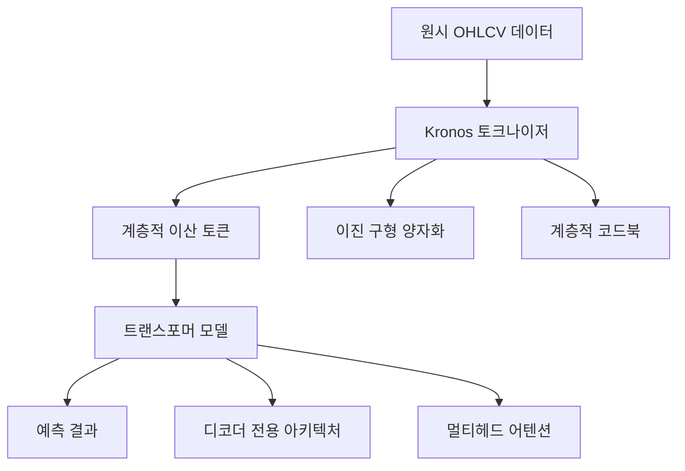
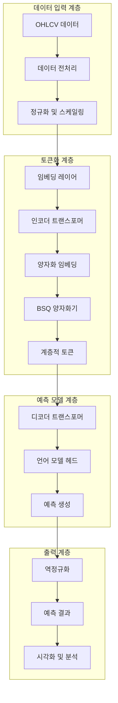
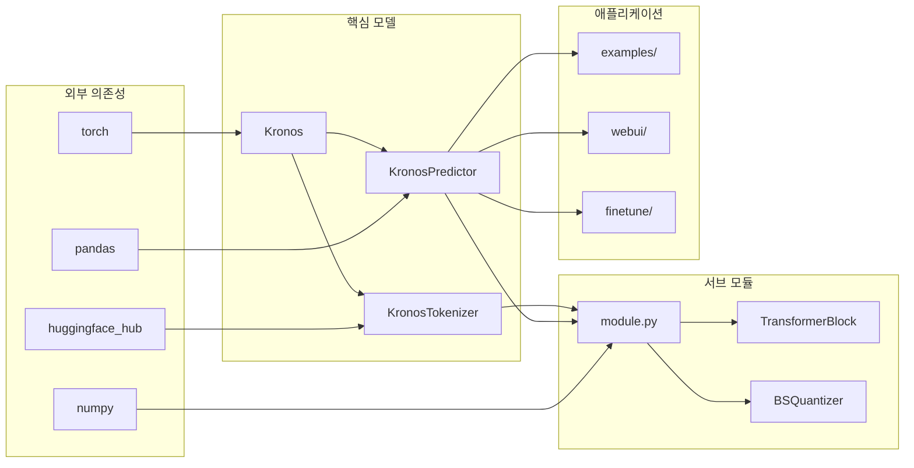
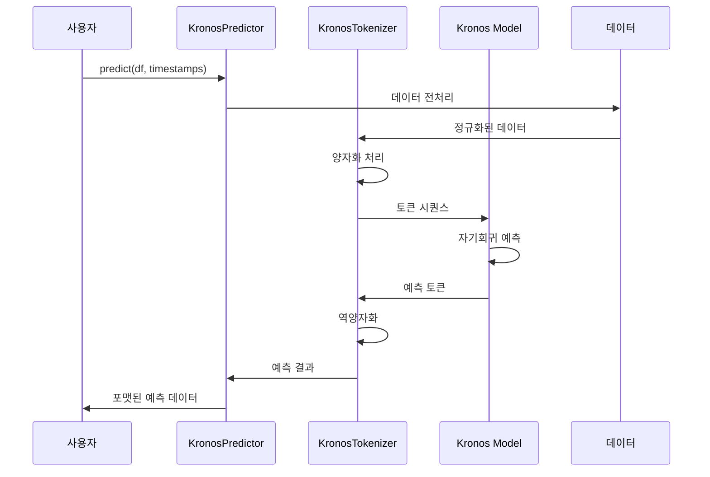
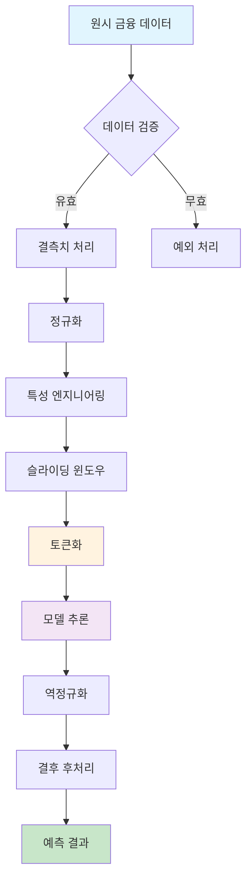
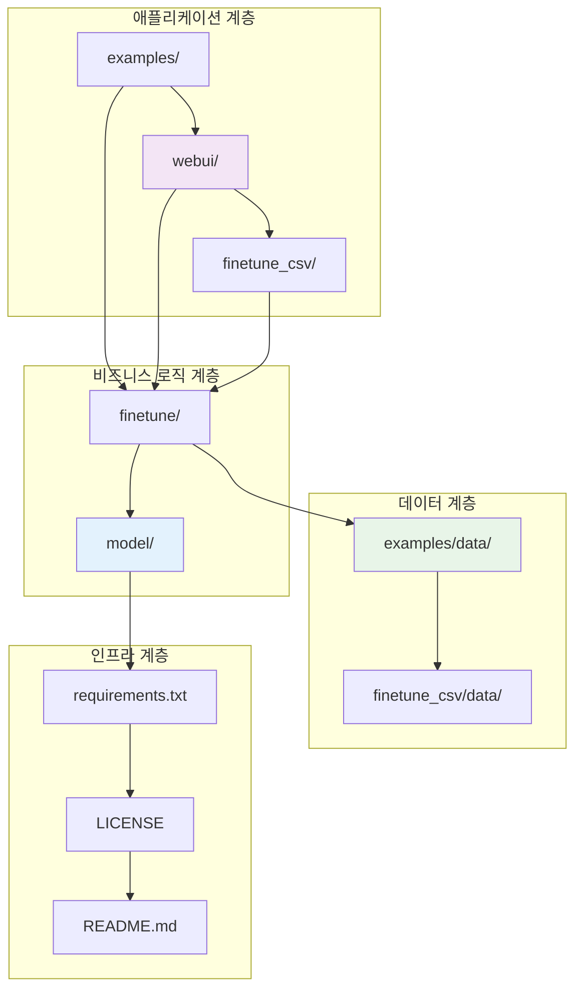
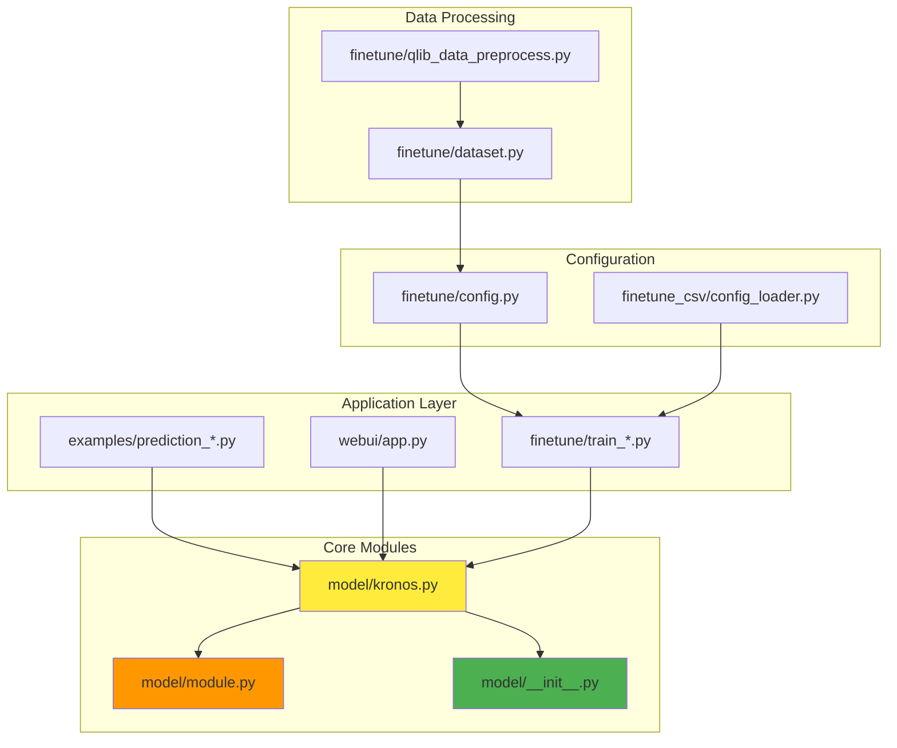
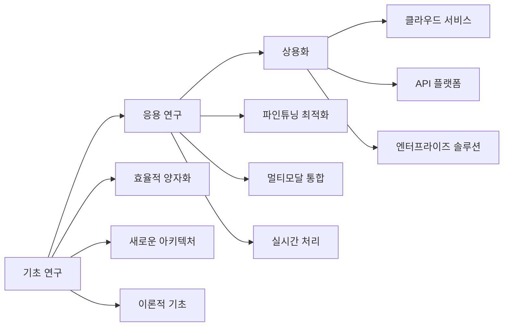

# Kronos: 금융 시장 언어를 위한 파운데이션 모델 종합 기술 문서

## 📋 목차
1. [프로젝트 개요](#프로젝트-개요)
2. [기술 아키텍처](#기술-아키텍처)
3. [프로젝트 구조](#프로젝트-구조)
4. [설치 및 설정](#설치-및-설정)
5. [사용 가이드](#사용-가이드)
6. [개발 지침](#개발-지침)
7. [추가 정보](#추가-정보)

---

## 프로젝트 개요

### 🎯 프로젝트 목적과 기능

**Kronos**는 금융 캔들스틱(K-line) 데이터를 위한 최초의 오픈소스 파운데이션 모델입니다. 45개 이상의 글로벌 거래소 데이터로 사전 학습되었으며, 금융 시장의 고유한 "언어"를 이해하고 예측하도록 특별히 설계되었습니다.

#### 핵심 기능
- **시계열 예측**: OHLCV(시가, 고가, 저가, 종가, 거래량) 데이터의 미래 가격 움직임 예측
- **계층적 토큰화**: 연속적인 금융 데이터를 이산적인 토큰으로 변환하는 혁신적인 양자화 기법
- **다중 자산 지원**: 주식, 암호화폐, 외환 등 다양한 금융 상품에 적용 가능
- **확장 가능한 아키텍처**: 다양한 크기의 모델 제공 (mini, small, base, large)

### 🔍 문제 정의

전통적인 시계열 예측 모델들은 금융 데이터의 다음과 같은 특성을 효과적으로 처리하지 못했습니다:

1. **높은 노이즈**: 금융 시장 데이터는 본질적으로 많은 노이즈를 포함
2. **비선형성**: 가격 움직임은 복잡한 비선형 패턴을 보임
3. **다차원성**: OHLCV와 같은 여러 차원의 상호관계
4. **시간 의존성**: 장기 및 단기 의존성이 복잡하게 얽힘

### 💡 해결 방법

Kronos는 **2단계 혁신 프레임워크**를 제시합니다:

1. **특수화된 토크나이저**: 연속적인 다차원 K-line 데이터를 계층적 이산 토큰으로 양자화
2. **오토레그레시브 트랜스포머**: 이 토큰들로 사전 학습된 대규모 트랜스포머 모델



### 🚀 핵심 기능 상세

#### 1. 하이브리드 양자화 시스템
- **Binary Spherical Quantization (BSQ)**: 차원의 저주를 방지하면서 효율적인 압축
- **계층적 토큰 구조**: 사전 토큰(s1_bits)과 사후 토큰(s2_bits)의 2단계 구조
- **적응적 코드북**: 데이터 분포에 따라 동적으로 조정되는 양자화 매개변수

#### 2. 대규모 언어 모델 아키텍처
- **디코더 전용 트랜스포머**: GPT 스타일의 자기회귀 생성 모델
- **멀티헤드 어텐션**: 시계열 데이터의 장기 의존성 포착
- **위치 인코딩**: 시간적 순서 정보 보존

#### 3. 확장성과 유연성
- **다양한 모델 크기**: 4.1M (mini) ~ 499.2M (large) 파라미터
- **가변 컨텍스트 길이**: 512 ~ 2048 토큰 처리 가능
- **배치 처리**: 여러 시계열 데이터의 병렬 예측 지원

### 👥 대상 사용자 및 사용 사례

#### 주요 사용자 그룹
1. **퀀트 트레이더**: 알고리즘 트레이딩 시스템 개발
2. **금융 연구원**: 시장 패턴 분석 및 예측 연구
3. **헷지펀드**: 대규모 포트폴리오 리스크 관리
4. **핀테크 기업**: 금융 상품 및 서비스 개발
5. **학계**: 금융 시계열 모델링 연구

#### 구체적 사용 사례
- **단기 가격 예측**: 일중, 일간, 주간 가격 움직임 예측
- **거래량 예측**: 미래 거래 활동 추정
- **변동성 분석**: 시장 변동성 패턴 식별
- **포트폴리오 최적화**: 자산 배치 의사결정 지원
- **리스크 관리**: 시장 리스크 사전 감지

---

## 기술 아키텍처

### 🏗️ 고수준 시스템 아키텍처



### 🔧 기술 스택

#### 핵심 프레임워크
- **PyTorch**: 딥러닝 모델 구현
- **Hugging Face Hub**: 모델 배포 및 버전 관리
- **Pandas**: 데이터 처리 및 조작
- **NumPy**: 수치 계산

#### 주요 라이브러리
```
torch>=1.9.0              # 딥러닝 프레임워크
numpy>=1.21.0             # 수치 연산
pandas>=2.2.2             # 데이터 분석
matplotlib>=3.9.3         # 시각화
einops==0.8.1             # 텐서 조작
huggingface_hub==0.33.1   # 모델 허브
tqdm==4.67.1              # 진행률 표시
safetensors==0.6.2        # 안전한 텐서 저장
```

### 🔗 종속성 관계



### 🎨 디자인 패턴

#### 1. 팩토리 패턴
```python
model_dict = {
    'kronos_tokenizer': KronosTokenizer,
    'kronos': Kronos,
    'kronos_predictor': KronosPredictor
}

def get_model_class(model_name):
    if model_name in model_dict:
        return model_dict[model_name]
    else:
        raise NotImplementedError
```

#### 2. 전략 패턴
- 다양한 양자화 전략 지원 (BSQ, Entropy-based)
- 유연한 예측 전략 (Top-p sampling, Temperature-based)

#### 3. 템플릿 메서드 패턴
- 토크나이저와 예측자의 일관된 학습/추론 인터페이스

### ⚙️ 아키텍처 결정사항

#### 1. 디코더 전용 아키텍처 선택
**결정**: GPT 스타일 디코더 전용 모델 채택

**이유**:
- 시계열 예측의 자기회귀 특성과 잘 부합
- 인코더-디코더 모델보다 계산 효율성 우수
- 생성형 예측에 더 적합

#### 2. 계층적 양자화 도입
**결정**: 2단계 양자화 (s1_bits + s2_bits)

**이유**:
- 정보 손실 최소화
- 계산 복잡성과 표현력의 균형
- 금융 데이터의 다중 스케일 특성 반영

#### 3. 멀티-GPU 학습 지원
**결정**: torchrun 기반 분산 학습

**이유**:
- 대규모 모델 학습의 확장성 확보
- 생산 환경에서의 실용성
- 커뮤니티 표준과의 호환성

### 🔄 구성 요소 상호작용



### 📊 데이터 흐름



---

## 프로젝트 구조

### 📁 디렉토리별 설명

```
Kronos/
├── model/                    # 핵심 모델 구현
│   ├── __init__.py          # 모델 팩토리 및 등록
│   ├── kronos.py            # 메인 모델 클래스 (Kronos, Tokenizer, Predictor)
│   └── module.py            # 기본 구성 요소 (Transformer, Quantizer)
├── examples/                # 사용 예제 및 데모
│   ├── data/               # 예제 데이터
│   ├── prediction_example.py          # 기본 예측 예제
│   ├── prediction_batch_example.py    # 배치 예측 예제
│   └── prediction_wo_vol_example.py   # 거래량 없는 예측 예제
├── finetune/               # 파인튜닝 파이프라인
│   ├── config.py          # 학습 설정
│   ├── dataset.py         # 데이터셋 클래스
│   ├── train_predictor.py # 예측 모델 학습
│   ├── train_tokenizer.py # 토크나이저 학습
│   └── utils/             # 유틸리티 함수
├── finetune_csv/          # CSV 기반 파인튜닝
│   ├── configs/           # 설정 파일들
│   ├── data/             # CSV 데이터
│   ├── examples/         # 사용 예제
│   └── finetune_*.py     # 파인튜닝 스크립트
├── webui/                # 웹 인터페이스
│   ├── app.py           # Flask 웹 애플리케이션
│   ├── run.py           # 실행 스크립트
│   ├── templates/       # HTML 템플릿
│   └── prediction_results/ # 예측 결과 저장
├── figures/             # 문서 및 시각화 자료
├── requirements.txt     # 의존성 목록
├── LICENSE             # MIT 라이선스
└── README.md           # 프로젝트 문서
```

### 🏗️ 파일 구성의 근거

#### 1. 모듈식 설계
- **model/**: 핵심 기능을 캡슐화하여 재사용성 극대화
- **분리된 책임**: 토크나이저, 예측자, 기본 모듈을 독립적으로 관리

#### 2. 사용자 중심 구조
- **examples/**: 빠른 시작을 위한 완전한 실행 가능한 예제
- **webui/**: 비개발자도 사용할 수 있는 그래픽 인터페이스

#### 3. 확장성 고려
- **finetune/**: Qlib 기반 전문가용 파인튜닝 파이프라인
- **finetune_csv/**: 간단한 CSV 기반 커스터마이징

### 🌳 프로젝트 계층 구조



### 📦 모듈 상호 의존성



---

## 설치 및 설정

### 📋 전제 조건

#### 시스템 요구사항
- **운영체제**: Linux, macOS, Windows
- **Python**: 3.10 이상
- **GPU**: CUDA 지원 (권장), CPU-only도 가능
- **메모리**: 최소 8GB RAM (권장 16GB+)
- **저장 공간**: 최소 10GB 여유 공간

#### 소프트웨어 의존성
```bash
# 기본 파이썬 환경
Python >= 3.10
pip >= 21.0

# GPU 지원 (선택사항)
CUDA >= 11.0
cuDNN >= 8.0

# 추가 도구 (파인튜닝 시)
git >= 2.0
```

### 🚀 단계별 설치 가이드

#### 1. 저장소 클론 및 환경 설정

```bash
# 저장소 클론
git clone https://github.com/shiyu-coder/Kronos.git
cd Kronos

# 가상환경 생성 (권장)
python -m venv kronos_env
source kronos_env/bin/activate  # Linux/macOS
# 또는
kronos_env\Scripts\activate     # Windows
```

#### 2. 의존성 설치

```bash
# 기본 의존성 설치
pip install -r requirements.txt

# GPU 지원 설치 (CUDA 사용 시)
pip install torch torchvision torchaudio --index-url https://download.pytorch.org/whl/cu118

# 파인튜닝을 위한 추가 의존성
pip install pyqlib  # Qlib 데이터 처리
```

#### 3. 모델 다운로드

모델은 Hugging Face Hub에서 자동으로 다운로드됩니다. 처음 사용 시 다음 명령으로 모델을 미리 다운로드할 수 있습니다:

```python
from model import Kronos, KronosTokenizer

# 토크나이저 다운로드
tokenizer = KronosTokenizer.from_pretrained("NeoQuasar/Kronos-Tokenizer-base")

# 모델 다운로드
model = Kronos.from_pretrained("NeoQuasar/Kronos-small")
```

### ⚙️ 구성 지침

#### 1. 기본 설정

**환경 변수 설정**:
```bash
# Hugging Face 캐시 디렉토리
export HF_HOME=~/.cache/huggingface

# PyTorch 메모리 설정
export PYTORCH_CUDA_ALLOC_CONF=max_split_size_mb:128
```

**모델 선택 가이드**:

| 모델 | VRAM 요구사항 | 사용 사례 |
|------|---------------|-----------|
| Kronos-mini | 2GB | 빠른 프로토타이핑, 테스트 |
| Kronos-small | 4GB | 일반적인 예측 작업 |
| Kronos-base | 8GB | 높은 정확도 요구 작업 |
| Kronos-large | 16GB | 연구 및 대규모 애플리케이션 |

#### 2. 파인튜닝 설정

**Qlib 데이터 준비**:
```bash
# Qlib 설치
pip install pyqlib

# 데이터 다운로드 (중국 A-share 예제)
mkdir -p ~/.qlib/qlib_data
cd ~/.qlib/qlib_data
git clone https://github.com/chenditc/investment_data.git cn_data
```

**설정 파일 수정** (`finetune/config.py`):
```python
# 필수 경로 설정
self.qlib_data_path = "~/.qlib/qlib_data/cn_data"  # Qlib 데이터 경로
self.dataset_path = "./data/processed_datasets"    # 처리된 데이터 저장 경로
self.save_path = "./checkpoints"                   # 모델 체크포인트 저장 경로

# 학습 파라미터
self.epochs = 30
self.batch_size = 50
self.learning_rate = 1e-4
```

### 🔧 일반적인 문제 해결

#### 1. 설치 관련 문제

**문제**: CUDA 버전 불일치
```bash
# 해결: 적절한 PyTorch 버전 설치
nvidia-smi  # CUDA 버전 확인
# https://pytorch.org/get-started/locally/ 에서 해당 버전 선택
```

**문제**: 메모리 부족 오류
```python
# 해결: 배치 크기 감소 또는 그래디언트 누적 사용
predictor = KronosPredictor(model, tokenizer, device="cuda:0", max_context=256)  # 컨텍스트 감소
```

#### 2. 실행 관련 문제

**문제**: 모델 로딩 실패
```python
# 해결: 인터넷 연결 확인 및 모델 이름 확인
from huggingface_hub import hf_hub_download
try:
    hf_hub_download("NeoQuasar/Kronos-small", "config.json")
except Exception as e:
    print(f"모델 다운로드 실패: {e}")
```

**문제**: 예측 결과 이상
```python
# 해결: 데이터 정규화 확인
def validate_data(df):
    required_cols = ['open', 'high', 'low', 'close']
    missing_cols = [col for col in required_cols if col not in df.columns]
    if missing_cols:
        raise ValueError(f"필수 컬럼 누락: {missing_cols}")

    # 데이터 타입 확인
    for col in required_cols:
        if not pd.api.types.is_numeric_dtype(df[col]):
            raise ValueError(f"컬럼 {col}은 숫자형이어야 함")
```

#### 3. 성능 최적화

**GPU 사용률 낮음**:
```python
# 해결: 배치 크기 조정
import torch

# 배치 크기 튜닝
def find_optimal_batch_size(model, sample_input):
    batch_sizes = [1, 2, 4, 8, 16, 32]
    optimal_size = 1

    for bs in batch_sizes:
        try:
            batch_input = sample_input.repeat(bs, 1, 1)
            with torch.no_grad():
                _ = model(batch_input)
            optimal_size = bs
        except torch.cuda.OutOfMemoryError:
            break

    return optimal_size
```

**메모리 사용량 최적화**:
```python
# 해결: 그래디언트 체크포인팅
model.gradient_checkpointing_enable()

# 혼합 정밀도 학습
from torch.cuda.amp import autocast
with autocast():
    outputs = model(inputs)
```

### 📊 성능 벤치마크

#### 하드웨어 요구사항

| 작업 | 최소 사양 | 권장 사양 |
|------|-----------|-----------|
| 기본 예측 | CPU 4코어, 8GB RAM | GPU 4GB VRAM, 16GB RAM |
| 파인튜닝 | GPU 8GB VRAM, 32GB RAM | GPU 16GB VRAM, 64GB RAM |
| 대규모 추론 | GPU 8GB VRAM | GPU 16GB+ VRAM, 배치 처리 |

#### 처리량 기준

| 모델 | 데이터 길이 | 예측 길이 | 처리 시간 (GPU) | 처리 시간 (CPU) |
|------|------------|-----------|-----------------|----------------|
| Kronos-mini | 512 | 120 | ~50ms | ~500ms |
| Kronos-small | 512 | 120 | ~100ms | ~1s |
| Kronos-base | 512 | 120 | ~300ms | ~3s |

---

## 사용 가이드

### 🎯 기본 사용 예제

#### 1. 간단한 예측

가장 기본적인 형태의 예측 예제입니다:

```python
import pandas as pd
from model import Kronos, KronosTokenizer, KronosPredictor

# 1. 모델과 토크나이저 로드
tokenizer = KronosTokenizer.from_pretrained("NeoQuasar/Kronos-Tokenizer-base")
model = Kronos.from_pretrained("NeoQuasar/Kronos-small")

# 2. 예측기 초기화
predictor = KronosPredictor(model, tokenizer, device="cuda:0", max_context=512)

# 3. 데이터 준비
df = pd.read_csv("your_data.csv")
df['timestamps'] = pd.to_datetime(df['timestamps'])

# 입력 데이터 설정
lookback = 400  # 과거 400개 타임스텝 사용
pred_len = 120  # 미래 120개 타임스텝 예측

x_df = df.loc[:lookback-1, ['open', 'high', 'low', 'close', 'volume', 'amount']]
x_timestamp = df.loc[:lookback-1, 'timestamps']
y_timestamp = df.loc[lookback:lookback+pred_len-1, 'timestamps']

# 4. 예측 실행
pred_df = predictor.predict(
    df=x_df,
    x_timestamp=x_timestamp,
    y_timestamp=y_timestamp,
    pred_len=pred_len,
    T=1.0,          # 샘플링 온도
    top_p=0.9,      # nucleus sampling 확률
    sample_count=1  # 예측 경로 수
)

print("예측 결과:")
print(pred_df.head())
```

#### 2. 배치 예측

여러 자산을 동시에 예측하는 예제:

```python
# 여러 데이터프레임 준비
df_list = [df1, df2, df3]  # 여러 자산 데이터
x_timestamp_list = [ts1, ts2, ts3]
y_timestamp_list = [future_ts1, future_ts2, future_ts3]

# 배치 예측 실행
pred_df_list = predictor.predict_batch(
    df_list=df_list,
    x_timestamp_list=x_timestamp_list,
    y_timestamp_list=y_timestamp_list,
    pred_len=pred_len,
    T=1.0,
    top_p=0.9,
    sample_count=1,
    verbose=True
)

# 결과 확인
for i, pred_df in enumerate(pred_df_list):
    print(f"자산 {i+1} 예측 결과:")
    print(pred_df.head())
```

### 🔧 고급 기능

#### 1. 커스텀 데이터 전처리

```python
class DataPreprocessor:
    def __init__(self, clip_value=5.0):
        self.clip_value = clip_value
        self.scaler = None

    def preprocess(self, df):
        """데이터 전처리 및 정규화"""
        # 결측치 처리
        df = df.fillna(method='ffill').fillna(method='bfill')

        # 이상치 처리
        numeric_cols = ['open', 'high', 'low', 'close', 'volume', 'amount']
        for col in numeric_cols:
            if col in df.columns:
                df[col] = df[col].clip(lower=df[col].quantile(0.01),
                                      upper=df[col].quantile(0.99))

        # 정규화
        if self.scaler is None:
            from sklearn.preprocessing import StandardScaler
            self.scaler = StandardScaler()
            df[numeric_cols] = self.scaler.fit_transform(df[numeric_cols])
        else:
            df[numeric_cols] = self.scaler.transform(df[numeric_cols])

        return df

    def postprocess(self, df):
        """역정규화"""
        if self.scaler is not None:
            numeric_cols = ['open', 'high', 'low', 'close', 'volume', 'amount']
            df[numeric_cols] = self.scaler.inverse_transform(df[numeric_cols])
        return df
```

#### 2. 확률적 예측

```python
def probabilistic_forecast(predictor, x_df, x_timestamp, y_timestamp, pred_len):
    """다중 샘플링을 통한 확률적 예측"""

    # 여러 샘플 생성
    sample_count = 10
    all_predictions = []

    for i in range(sample_count):
        pred_df = predictor.predict(
            df=x_df,
            x_timestamp=x_timestamp,
            y_timestamp=y_timestamp,
            pred_len=pred_len,
            T=1.2,      # 더 높은 온도로 다양성 증가
            top_p=0.95,
            sample_count=1
        )
        all_predictions.append(pred_df)

    # 통계 계산
    all_preds = pd.concat(all_predictions)
    grouped = all_preds.groupby(all_preds.index)

    stats = pd.DataFrame({
        'mean': grouped['close'].mean(),
        'std': grouped['close'].std(),
        'q25': grouped['close'].quantile(0.25),
        'q75': grouped['close'].quantile(0.75),
        'min': grouped['close'].min(),
        'max': grouped['close'].max()
    })

    return stats
```

#### 3. 실시간 예측 파이프라인

```python
import threading
import queue
import time

class RealTimePredictor:
    def __init__(self, predictor, update_interval=60):
        self.predictor = predictor
        self.update_interval = update_interval
        self.data_queue = queue.Queue()
        self.result_queue = queue.Queue()
        self.running = False

    def add_data(self, new_data):
        """새로운 데이터 추가"""
        self.data_queue.put(new_data)

    def _prediction_loop(self):
        """백그라운드 예측 루프"""
        buffer = []

        while self.running:
            try:
                # 새로운 데이터 수집
                while not self.data_queue.empty():
                    buffer.append(self.data_queue.get(timeout=1))

                # 버퍼 크기 유지
                if len(buffer) > 512:  # max_context
                    buffer = buffer[-512:]

                if len(buffer) >= 100:  # 최소 예측所需 길이
                    # 예측 실행
                    df = pd.DataFrame(buffer)
                    timestamps = pd.to_datetime([d['timestamp'] for d in buffer])

                    # 미래 타임스탬프 생성
                    future_timestamps = pd.date_range(
                        start=timestamps[-1],
                        periods=24,
                        freq='5min'  # 5분 간격
                    )[1:]

                    pred_df = self.predictor.predict(
                        df=df[['open', 'high', 'low', 'close', 'volume', 'amount']],
                        x_timestamp=timestamps,
                        y_timestamp=future_timestamps,
                        pred_len=len(future_timestamps),
                        T=0.8,
                        top_p=0.9
                    )

                    self.result_queue.put(pred_df)

                time.sleep(self.update_interval)

            except Exception as e:
                print(f"예측 오류: {e}")
                time.sleep(self.update_interval)

    def start(self):
        """실시간 예측 시작"""
        self.running = True
        self.thread = threading.Thread(target=self._prediction_loop)
        self.thread.start()

    def stop(self):
        """실시간 예측 중지"""
        self.running = False
        if hasattr(self, 'thread'):
            self.thread.join()

    def get_latest_prediction(self):
        """최신 예측 결과获取"""
        try:
            return self.result_queue.get_nowait()
        except queue.Empty:
            return None
```

### ⚙️ 구성 옵션

#### 1. KronosPredictor 파라미터

```python
predictor = KronosPredictor(
    model=model,                    # 사전 학습된 모델
    tokenizer=tokenizer,            # 토크나이저
    device="cuda:0",               # 계산 장치
    max_context=512,               # 최대 컨텍스트 길이
    normalize=True,                # 데이터 정규화 여부
    clip_value=5.0                # 이상치 클리핑 값
)
```

#### 2. 예측 파라미터

```python
pred_df = predictor.predict(
    df=x_df,                      # 입력 데이터프레임
    x_timestamp=x_timestamp,       # 과거 타임스탬프
    y_timestamp=y_timestamp,       # 미래 타임스탬프
    pred_len=120,                 # 예측 길이
    T=1.0,                       # 샘플링 온도 (0.1-2.0)
    top_p=0.9,                   # Nucleus sampling (0.1-1.0)
    sample_count=1,              # 샘플 수 (다수 샘플 평균)
    verbose=False                # 진행률 출력
)
```

#### 3. 모델 선택 가이드

```python
def choose_model(use_case, computational_constraint):
    """사용 사례에 따른 모델 선택"""

    models = {
        'mini': {
            'name': 'NeoQuasar/Kronos-mini',
            'tokenizer': 'NeoQuasar/Kronos-Tokenizer-2k',
            'context': 2048,
            'params': '4.1M',
            'vram': '2GB'
        },
        'small': {
            'name': 'NeoQuasar/Kronos-small',
            'tokenizer': 'NeoQuasar/Kronos-Tokenizer-base',
            'context': 512,
            'params': '24.7M',
            'vram': '4GB'
        },
        'base': {
            'name': 'NeoQuasar/Kronos-base',
            'tokenizer': 'NeoQuasar/Kronos-Tokenizer-base',
            'context': 512,
            'params': '102.3M',
            'vram': '8GB'
        }
    }

    if use_case == 'real_time' and computational_constraint == 'low':
        return models['mini']
    elif use_case == 'batch_prediction' and computational_constraint == 'medium':
        return models['small']
    elif use_case == 'research' and computational_constraint == 'high':
        return models['base']
    else:
        return models['small']  # 기본값
```

### 📚 API 문서

#### Kronos 클래스

```python
class Kronos(nn.Module, PyTorchModelHubMixin):
    """Kronos 메인 모델 클래스"""

    def __init__(self, config):
        """
        Args:
            config (dict): 모델 설정 딕셔너리
        """

    def forward(self, input_ids, attention_mask=None):
        """
        순전파 실행

        Args:
            input_ids (torch.Tensor): 입력 토큰 ID [batch_size, seq_len]
            attention_mask (torch.Tensor): 어텐션 마스크 [batch_size, seq_len]

        Returns:
            torch.Tensor: 모델 출력 [batch_size, seq_len, vocab_size]
        """

    @classmethod
    def from_pretrained(cls, model_name):
        """사전 학습된 모델 로드"""
```

#### KronosTokenizer 클래스

```python
class KronosTokenizer(nn.Module, PyTorchModelHubMixin):
    """Kronos 토크나이저"""

    def encode(self, data):
        """
        데이터를 토큰으로 인코딩

        Args:
            data (torch.Tensor): 입력 데이터 [batch_size, seq_len, features]

        Returns:
            torch.Tensor: 토큰 ID [batch_size, seq_len]
        """

    def decode(self, tokens):
        """
        토큰을 데이터로 디코딩

        Args:
            tokens (torch.Tensor): 토큰 ID [batch_size, seq_len]

        Returns:
            torch.Tensor: 복원된 데이터 [batch_size, seq_len, features]
        """
```

#### KronosPredictor 클래스

```python
class KronosPredictor:
    """예측을 위한 상위 레벨 인터페이스"""

    def predict(self, df, x_timestamp, y_timestamp, pred_len,
                T=1.0, top_p=0.9, sample_count=1, verbose=False):
        """
        단일 시계열 예측

        Args:
            df (pd.DataFrame): 과거 데이터
            x_timestamp (pd.Series): 과거 타임스탬프
            y_timestamp (pd.Series): 미래 타임스탬프
            pred_len (int): 예측 길이
            T (float): 샘플링 온도
            top_p (float): Nucleus sampling 확률
            sample_count (int): 샘플 수
            verbose (bool): 진행률 출력

        Returns:
            pd.DataFrame: 예측 결과
        """

    def predict_batch(self, df_list, x_timestamp_list, y_timestamp_list,
                     pred_len, T=1.0, top_p=0.9, sample_count=1, verbose=False):
        """
        배치 예측

        Args:
            df_list (List[pd.DataFrame]): 과거 데이터 리스트
            x_timestamp_list (List[pd.Series]): 과거 타임스탬프 리스트
            y_timestamp_list (List[pd.Series]): 미래 타임스탬프 리스트
            pred_len (int): 예측 길이
            T (float): 샘플링 온도
            top_p (float): Nucleus sampling 확률
            sample_count (int): 샘플 수
            verbose (bool): 진행률 출력

        Returns:
            List[pd.DataFrame]: 예측 결과 리스트
        """
```

### 💻 명령줄 인터페이스 참조

#### 1. 예측 실행

```bash
# 기본 예측
python examples/prediction_example.py

# 커스텀 데이터로 예측
python -c "
import pandas as pd
from model import Kronos, KronosTokenizer, KronosPredictor

tokenizer = KronosTokenizer.from_pretrained('NeoQuasar/Kronos-Tokenizer-base')
model = Kronos.from_pretrained('NeoQuasar/Kronos-small')
predictor = KronosPredictor(model, tokenizer, device='cuda:0')

# 데이터 로드 및 예측
df = pd.read_csv('your_data.csv')
# ... 예측 코드
"
```

#### 2. 파인튜닝 실행

```bash
# 토크나이저 파인튜닝
torchrun --standalone --nproc_per_node=2 finetune/train_tokenizer.py

# 예측 모델 파인튜닝
torchrun --standalone --nproc_per_node=2 finetune/train_predictor.py

# 백테스팅
python finetune/qlib_test.py --device cuda:0
```

#### 3. 웹 인터페이스 실행

```bash
# 웹 UI 시작
cd webui
python run.py

# 또는 직접 Flask 실행
python app.py
```

웹 인터페이스는 `http://localhost:5000`에서 접속 가능합니다.

#### 4. 유용한 스크립트

```bash
# 모델 정보 확인
python -c "
from model import Kronos, KronosTokenizer
import torch

model = Kronos.from_pretrained('NeoQuasar/Kronos-small')
print(f'모델 파라미터 수: {sum(p.numel() for p in model.parameters()):,}')
print(f'모델 크기: {torch.cuda.get_device_properties(0).total_memory / 1e9:.1f} GB')
"

# GPU 사용량 모니터링
watch -n 1 nvidia-smi

# 메모리 사용량 확인
python -c "
import psutil
import torch
print(f'CPU 메모리 사용량: {psutil.virtual_memory().percent}%')
if torch.cuda.is_available():
    print(f'GPU 메모리 사용량: {torch.cuda.memory_allocated() / 1e9:.2f} GB')
"
```

---

## 개발 지침

### 🛠️ 개발 환경 설정

#### 1. 개발 환경 구축

```bash
# 1. 저장소 클론
git clone https://github.com/shiyu-coder/Kronos.git
cd Kronos

# 2. 개발용 가상환경 생성
python -m venv dev_env
source dev_env/bin/activate

# 3. 개발 의존성 설치
pip install -r requirements.txt
pip install -r requirements-dev.txt  # 개발 전용 의존성

# 4. pre-commit 훅 설정
pre-commit install
```

#### 2. 개발용 의존성 (requirements-dev.txt)

```
# 테스트
pytest>=7.0.0
pytest-cov>=4.0.0
pytest-xdist>=3.0.0

# 코드 품질
black>=22.0.0
isort>=5.10.0
flake8>=5.0.0
mypy>=0.991

# 문서화
sphinx>=5.0.0
sphinx-rtd-theme>=1.0.0

# 개발 도구
jupyter>=1.0.0
ipywidgets>=8.0.0
pre-commit>=2.20.0
```

#### 3. IDE 설정

**VS Code 설정 (`.vscode/settings.json`)**:
```json
{
    "python.defaultInterpreterPath": "./dev_env/bin/python",
    "python.linting.enabled": true,
    "python.linting.flake8Enabled": true,
    "python.formatting.provider": "black",
    "python.sortImports.args": ["--profile", "black"],
    "editor.formatOnSave": true,
    "editor.codeActionsOnSave": {
        "source.organizeImports": true
    }
}
```

**PyCharm 설정**:
- Python 인터프리터: 프로젝트의 dev_env 사용
- Code Style: Black 적용
- Import 정렬: isort 사용

### 📝 코드 스타일 및 규칙

#### 1. Python 코드 스타일

**PEP 8 준수 + Black 포매팅**:
```python
# 좋은 예시
class KronosPredictor:
    """Kronos 예측을 위한 상위 레벨 인터페이스."""

    def __init__(self, model, tokenizer, device="cuda:0", max_context=512):
        """
        예측기 초기화.

        Args:
            model: 사전 학습된 Kronos 모델
            tokenizer: Kronos 토크나이저
            device: 계산 장치 ('cpu' 또는 'cuda:n')
            max_context: 최대 컨텍스트 길이
        """
        self.model = model
        self.tokenizer = tokenizer
        self.device = device
        self.max_context = max_context

    def predict(self, df, x_timestamp, y_timestamp, pred_len,
                T=1.0, top_p=0.9, sample_count=1, verbose=False):
        """
        시계열 예측 수행.

        Args:
            df (pd.DataFrame): 과거 OHLCV 데이터
            x_timestamp (pd.Series): 과거 타임스탬프
            y_timestamp (pd.Series): 예측할 미래 타임스탬프
            pred_len (int): 예측 길이
            T (float): 샘플링 온도
            top_p (float): nucleus sampling 확률
            sample_count (int): 샘플링 횟수
            verbose (bool): 진행률 출력 여부

        Returns:
            pd.DataFrame: 예측 결과
        """
        # 구현
        pass
```

#### 2. 명명 규칙

**클래스**: PascalCase
```python
class KronosTokenizer:
class BinarySphericalQuantizer:
class DataPreprocessor:
```

**함수와 변수**: snake_case
```python
def predict_batch():
def preprocess_data():
max_context_length = 512
learning_rate = 1e-4
```

**상수**: UPPER_SNAKE_CASE
```python
DEFAULT_MODEL_NAME = "NeoQuasar/Kronos-small"
MAX_SEQUENCE_LENGTH = 2048
DEFAULT_TEMPERATURE = 1.0
```

**Private 멤버**: 밑줄 접두사
```python
class _InternalHelper:
    def _private_method(self):
        self._private_variable = 0
```

#### 3. 문서화 규칙

**Docstring 형식 (Google Style)**:
```python
def process_financial_data(df, window_size=30, normalize=True):
    """금융 데이터를 전처리합니다.

    이 함수는 입력된 금융 데이터프레임을 정규화하고,
    슬라이딩 윈도우를 적용하여 모델 입력 형식으로 변환합니다.

    Args:
        df (pd.DataFrame): OHLCV 데이터를 포함하는 데이터프레임
        window_size (int, optional): 슬라이딩 윈도우 크기. 기본값은 30.
        normalize (bool, optional): 데이터 정규화 여부. 기본값은 True.

    Returns:
        tuple: (processed_data, scaler) 튜플
            processed_data (np.ndarray): 처리된 데이터 배열
            scaler (StandardScaler): 사용된 정규화 객체

    Raises:
        ValueError: 필수 컬럼이 누락된 경우
        TypeError: 입력 데이터 타입이 올바르지 않은 경우

    Example:
        >>> df = pd.read_csv('stock_data.csv')
        >>> processed, scaler = process_financial_data(df, window_size=60)
        >>> print(f"처리된 데이터 shape: {processed.shape}")
    """
    # 구현
    pass
```

#### 4. 타입 힌팅

```python
from typing import List, Dict, Tuple, Optional, Union
import pandas as pd
import torch
import numpy as np

def predict_financial_series(
    data: pd.DataFrame,
    model: torch.nn.Module,
    timestamps: pd.Series,
    pred_len: int = 120,
    temperature: float = 1.0,
    top_p: float = 0.9
) -> Tuple[pd.DataFrame, Dict[str, float]]:
    """금융 시계열 예측."""
    pass

class ModelConfig:
    def __init__(
        self,
        model_name: str,
        device: str = "cuda:0",
        max_context: int = 512,
        batch_size: Optional[int] = None
    ) -> None:
        self.model_name = model_name
        self.device = device
        self.max_context = max_context
        self.batch_size = batch_size
```

### 🧪 테스트 절차 및 커버리지

#### 1. 테스트 구조

```
tests/
├── unit/                   # 단위 테스트
│   ├── test_model.py      # 모델 관련 테스트
│   ├── test_tokenizer.py  # 토크나이저 테스트
│   └── test_predictor.py  # 예측자 테스트
├── integration/           # 통합 테스트
│   ├── test_pipeline.py   # 전체 파이프라인 테스트
│   └── test_api.py        # API 테스트
├── performance/           # 성능 테스트
│   ├── test_speed.py      # 속도 테스트
│   └── test_memory.py     # 메모리 테스트
└── fixtures/             # 테스트 데이터
    ├── sample_data.csv
    └── mock_models/
```

#### 2. 단위 테스트 예시

```python
# tests/unit/test_predictor.py
import pytest
import pandas as pd
import numpy as np
import torch
from unittest.mock import Mock, patch

from model import KronosPredictor, Kronos, KronosTokenizer

class TestKronosPredictor:
    @pytest.fixture
    def mock_model(self):
        model = Mock(spec=Kronos)
        model.eval.return_value = None
        return model

    @pytest.fixture
    def mock_tokenizer(self):
        tokenizer = Mock(spec=KronosTokenizer)
        tokenizer.encode.return_value = torch.tensor([[1, 2, 3]])
        tokenizer.decode.return_value = torch.tensor([[[1.0, 2.0, 3.0, 4.0]]])
        return tokenizer

    @pytest.fixture
    def predictor(self, mock_model, mock_tokenizer):
        return KronosPredictor(
            model=mock_model,
            tokenizer=mock_tokenizer,
            device="cpu",
            max_context=512
        )

    @pytest.fixture
    def sample_data(self):
        dates = pd.date_range('2023-01-01', periods=100, freq='5min')
        data = {
            'open': np.random.randn(100).cumsum() + 100,
            'high': np.random.randn(100).cumsum() + 102,
            'low': np.random.randn(100).cumsum() + 98,
            'close': np.random.randn(100).cumsum() + 100,
            'volume': np.random.randint(1000, 10000, 100),
            'amount': np.random.randint(100000, 1000000, 100)
        }
        return pd.DataFrame(data, index=dates)

    def test_predict_basic(self, predictor, sample_data):
        """기본 예측 기능 테스트"""
        lookback = 50
        pred_len = 20

        x_df = sample_data.iloc[:lookback]
        x_timestamp = sample_data.index[:lookback]
        y_timestamp = pd.date_range(
            start=x_timestamp[-1],
            periods=pred_len + 1,
            freq='5min'
        )[1:]

        result = predictor.predict(
            df=x_df,
            x_timestamp=x_timestamp,
            y_timestamp=y_timestamp,
            pred_len=pred_len,
            T=1.0,
            top_p=0.9,
            sample_count=1
        )

        assert isinstance(result, pd.DataFrame)
        assert len(result) == pred_len
        assert list(result.columns) == ['open', 'high', 'low', 'close', 'volume', 'amount']

    def test_predict_batch(self, predictor, sample_data):
        """배치 예측 기능 테스트"""
        df_list = [sample_data.iloc[:50] for _ in range(3)]
        x_timestamp_list = [sample_data.index[:50] for _ in range(3)]
        y_timestamp_list = [
            pd.date_range(start=ts[-1], periods=20, freq='5min')[1:]
            for ts in x_timestamp_list
        ]

        results = predictor.predict_batch(
            df_list=df_list,
            x_timestamp_list=x_timestamp_list,
            y_timestamp_list=y_timestamp_list,
            pred_len=20
        )

        assert len(results) == 3
        for result in results:
            assert isinstance(result, pd.DataFrame)
            assert len(result) == 20

    def test_invalid_input_handling(self, predictor):
        """잘못된 입력 처리 테스트"""
        invalid_data = pd.DataFrame({'invalid_col': [1, 2, 3]})

        with pytest.raises(ValueError):
            predictor.predict(
                df=invalid_data,
                x_timestamp=pd.date_range('2023-01-01', periods=3),
                y_timestamp=pd.date_range('2023-01-04', periods=5),
                pred_len=5
            )

    @pytest.mark.parametrize("temperature,top_p", [
        (0.5, 0.8),
        (1.0, 0.9),
        (1.5, 0.95)
    ])
    def test_different_sampling_params(self, predictor, sample_data, temperature, top_p):
        """다양한 샘플링 파라미터 테스트"""
        # 테스트 구현
        pass
```

#### 3. 통합 테스트 예시

```python
# tests/integration/test_pipeline.py
import pytest
import pandas as pd
import torch
from model import Kronos, KronosTokenizer, KronosPredictor

@pytest.mark.integration
class TestEndToEndPipeline:

    @pytest.mark.slow
    def test_full_prediction_pipeline(self):
        """전체 예측 파이프라인 테스트"""
        # 1. 모델 로드
        tokenizer = KronosTokenizer.from_pretrained("NeoQuasar/Kronos-Tokenizer-base")
        model = Kronos.from_pretrained("NeoQuasar/Kronos-small")

        # 2. 예측기 초기화
        predictor = KronosPredictor(model, tokenizer, device="cpu")

        # 3. 테스트 데이터 생성
        dates = pd.date_range('2023-01-01', periods=400, freq='5min')
        data = {
            'open': 100 + torch.randn(400).cumsum().numpy(),
            'high': 102 + torch.randn(400).cumsum().numpy(),
            'low': 98 + torch.randn(400).cumsum().numpy(),
            'close': 100 + torch.randn(400).cumsum().numpy(),
            'volume': torch.randint(1000, 10000, (400,)).numpy(),
            'amount': torch.randint(100000, 1000000, (400,)).numpy()
        }
        df = pd.DataFrame(data, index=dates)

        # 4. 예측 실행
        x_df = df.iloc[:400]
        x_timestamp = df.index[:400]
        y_timestamp = pd.date_range(start=x_timestamp[-1], periods=120, freq='5min')[1:]

        pred_df = predictor.predict(
            df=x_df,
            x_timestamp=x_timestamp,
            y_timestamp=y_timestamp,
            pred_len=120
        )

        # 5. 결과 검증
        assert len(pred_df) == 120
        assert all(col in pred_df.columns for col in ['open', 'high', 'low', 'close', 'volume', 'amount'])
        assert pred_df.index.equals(y_timestamp)
```

#### 4. 테스트 실행

```bash
# 전체 테스트 실행
pytest

# 커버리지 포함 테스트 실행
pytest --cov=model --cov-report=html

# 특정 테스트만 실행
pytest tests/unit/test_predictor.py::TestKronosPredictor::test_predict_basic

# 병렬 테스트 실행
pytest -n auto

# 마커별 테스트 실행
pytest -m "not slow"  # 빠른 테스트만
pytest -m integration  # 통합 테스트만
```

#### 5. 커버리지 목표

- **단위 테스트**: 90% 이상 라인 커버리지
- **통합 테스트**: 주요 사용 시나리오 100% 커버
- **성능 테스트**: 핵심 기능 벤치마크

```bash
# 커버리지 리포트 생성
pytest --cov=model --cov-report=term-missing --cov-report=html

# 커버리지 임계값 확인
pytest --cov=model --cov-fail-under=90
```

### 🤝 기여 가이드라인

#### 1. 기여 프로세스

**1. Issue 생성**: 버그 보고나 기능 요청을 위해 GitHub Issue 생성
**2. Fork 및 Branch**: 저장소 포크 후 기능별 브랜치 생성
```bash
git checkout -b feature/your-feature-name
# 또는
git checkout -b fix/bug-description
```

**3. 개발 및 테스트**: 코드 변경 후 테스트 실행
```bash
# 코드 스타일 확인
black --check .
isort --check-only .

# 테스트 실행
pytest

# 타입 검사
mypy model/
```

**4. 커밋 및 푸시**: 의미 있는 커밋 메시지 작성
```bash
git add .
git commit -m "feat: add batch prediction support"
git push origin feature/your-feature-name
```

**5. Pull Request**: Pull Request 생성 및 코드 리뷰 요청

#### 2. 커밋 메시지 규칙 (Conventional Commits)

```
<type>[optional scope]: <description>

[optional body]

[optional footer(s)]
```

**Type 종류**:
- `feat`: 새로운 기능
- `fix`: 버그 수정
- `docs`: 문서화
- `style`: 코드 스타일 (기능 변경 없음)
- `refactor`: 리팩토링
- `test`: 테스트 추가/수정
- `chore`: 빌드/유틸리티 작업

**예시**:
```
feat(predictor): add probabilistic forecasting support

- Add multiple sampling capability
- Implement confidence interval calculation
- Update documentation with examples

Closes #123
```

#### 3. 코드 리뷰 가이드라인

**리뷰어 확인 사항**:
1. **기능성**: 코드가 의도대로 동작하는가?
2. **성능**: 성능 저하는 없는가?
3. **스타일**: 코드 스타일은 일관적인가?
4. **테스트**: 적절한 테스트가 있는가?
5. **문서**: 필요한 문서화가 있는가?

**PR 제출 시 체크리스트**:
- [ ] 코드는 프로젝트 스타일 가이드를 따름
- [ ] 모든 테스트가 통과함
- [ ] 새로운 기능에 대한 테스트가 추가됨
- [ ] 관련 문서가 업데이트됨
- [ ] 커밋 메시지가 명확함
- [ ] PR 설명이 상세함

#### 4. 이슈 템플릿

**Bug Report**:
```markdown
## 버그 설명
간단하고 명확한 버그 설명

## 재현 단계
1. '...'로 이동
2. '...' 클릭
3. '...' 입력
4. 에러 발생

## 예상 동작
명확하고 간결한 예상 동작 설명

## 실제 동작
실제로 발생한 동작 설명

## 스크린샷
해당하는 경우 스크린샷 추가

## 환경 정보
- OS: [예: Ubuntu 20.04]
- Python 버전: [예: 3.10]
- GPU: [예: RTX 3080]

## 추가 컨텍스트
추가 컨텍스트나 관련 정보
```

**Feature Request**:
```markdown
## 기능 설명
추가하고 싶은 기능에 대한 간단하고 명확한 설명

## 문제 해결
이 기능이 어떤 문제를 해결하는가?

## 제안 해결책
기능 구현을 위한 제안 해결책

## 대안
고려한 대안 해결책

## 추가 컨텍스트
추가 컨텍스트나 기능에 대한 스크린샷
```

---

## 추가 정보

### ⚡ 성능 고려사항

#### 1. 모델 최적화

**메모리 최적화**:
```python
# 그래디언트 체크포인팅
model.gradient_checkpointing_enable()

# 혼합 정밀도 학습/추론
from torch.cuda.amp import autocast
with autocast():
    outputs = model(inputs)

# 모델 양자화 (추론 시)
import torch.quantization
quantized_model = torch.quantization.quantize_dynamic(
    model, {torch.nn.Linear}, dtype=torch.qint8
)
```

**추론 속도 최적화**:
```python
# 배치 처리로 GPU 활용률 극대화
def optimal_batch_processing(predictor, datasets):
    """최적의 배치 크기로 데이터 처리"""
    # GPU 메모리에 맞는 최적 배치 크기 계산
    available_memory = torch.cuda.get_device_properties(0).total_memory
    model_memory = sum(p.numel() * p.element_size() for p in predictor.model.parameters())

    # 실험적으로 최적 배치 크기 결정
    batch_sizes = [1, 2, 4, 8, 16, 32]
    optimal_size = 1

    for bs in batch_sizes:
        try:
            # 메모리 사용량 테스트
            test_input = torch.randn(bs, 512, 6).cuda()
            with torch.no_grad():
                _ = predictor.model(test_input)
            optimal_size = bs
        except torch.cuda.OutOfMemoryError:
            break

    # 최적 배치 크기로 처리
    return optimal_size
```

#### 2. 데이터 처리 최적화

**효율적인 데이터 로딩**:
```python
class EfficientDataLoader:
    def __init__(self, data_paths, batch_size=32, num_workers=4):
        self.data_paths = data_paths
        self.batch_size = batch_size
        self.num_workers = num_workers

    def create_dataloader(self, dataset):
        """효율적인 데이터로더 생성"""
        from torch.utils.data import DataLoader

        return DataLoader(
            dataset,
            batch_size=self.batch_size,
            shuffle=True,
            num_workers=self.num_workers,
            pin_memory=True,  # GPU 전송 최적화
            persistent_workers=True if self.num_workers > 0 else False
        )
```

**메모리 매핑 활용**:
```python
import numpy as np
import pandas as pd

def load_large_dataset_efficiently(file_path):
    """대용량 데이터셋 효율적 로딩"""

    # Parquet 형식 사용 (메모리 매핑 지원)
    if file_path.endswith('.parquet'):
        return pd.read_parquet(file_path, engine='pyarrow')

    # CSV의 경우 청크로 로드
    elif file_path.endswith('.csv'):
        chunks = pd.read_csv(file_path, chunksize=10000)
        return pd.concat(chunks, ignore_index=True)

    else:
        raise ValueError("지원하지 않는 파일 형식")
```

#### 3. 캐싱 전략

**예측 결과 캐싱**:
```python
import pickle
import hashlib
from pathlib import Path
from functools import wraps

def cache_predictions(cache_dir="./cache"):
    """예측 결과 캐싱 데코레이터"""
    Path(cache_dir).mkdir(exist_ok=True)

    def decorator(func):
        @wraps(func)
        def wrapper(*args, **kwargs):
            # 입력 데이터 해시 생성
            input_hash = hashlib.md5(
                str(args).encode() + str(kwargs).encode()
            ).hexdigest()

            cache_file = Path(cache_dir) / f"{input_hash}.pkl"

            # 캐시된 결과가 있으면 반환
            if cache_file.exists():
                with open(cache_file, 'rb') as f:
                    return pickle.load(f)

            # 결과 계산 및 캐싱
            result = func(*args, **kwargs)
            with open(cache_file, 'wb') as f:
                pickle.dump(result, f)

            return result
        return wrapper
    return decorator

# 사용 예시
@cache_predictions()
def predict_with_cache(predictor, df, timestamps, pred_len):
    return predictor.predict(df, timestamps, timestamps[-pred_len:], pred_len)
```

#### 4. 성능 벤치마킹

```python
import time
import psutil
import torch
from contextlib import contextmanager

@contextmanager
def benchmark(name, device="cuda"):
    """성능 측정 컨텍스트 매니저"""
    if device == "cuda":
        torch.cuda.synchronize()
        start_memory = torch.cuda.memory_allocated()

    start_time = time.perf_counter()
    start_cpu = psutil.cpu_percent()

    try:
        yield
    finally:
        end_time = time.perf_counter()
        end_cpu = psutil.cpu_percent()

        if device == "cuda":
            torch.cuda.synchronize()
            end_memory = torch.cuda.memory_allocated()
            memory_used = (end_memory - start_memory) / 1024**2  # MB
        else:
            memory_used = 0

        duration = end_time - start_time

        print(f"[{name}]")
        print(f"  실행 시간: {duration:.3f}s")
        print(f"  CPU 사용률: {end_cpu:.1f}%")
        if device == "cuda":
            print(f"  GPU 메모리: {memory_used:.1f}MB")

# 사용 예시
def benchmark_prediction_performance():
    model = Kronos.from_pretrained("NeoQuasar/Kronos-small")
    tokenizer = KronosTokenizer.from_pretrained("NeoQuasar/Kronos-Tokenizer-base")
    predictor = KronosPredictor(model, tokenizer)

    # 테스트 데이터 생성
    test_data = generate_test_data(batch_size=1, seq_len=512)

    with benchmark("단일 예측"):
        predictor.predict(test_data['df'], test_data['x_ts'], test_data['y_ts'], 120)

    with benchmark("배치 예측 (batch_size=8)"):
        batch_data = [test_data for _ in range(8)]
        predictor.predict_batch(**batch_data)
```

### 🔒 보안 고려사항

#### 1. 데이터 보안

**민감 데이터 처리**:
```python
import hashlib
import os
from cryptography.fernet import Fernet

class SecureDataHandler:
    def __init__(self, encryption_key=None):
        if encryption_key is None:
            # 환경 변수에서 키 가져오기 또는 생성
            key = os.environ.get('KRONOS_ENCRYPTION_KEY')
            if key is None:
                key = Fernet.generate_key()
            self.cipher = Fernet(key)
        else:
            self.cipher = Fernet(encryption_key)

    def encrypt_sensitive_data(self, data):
        """민감 데이터 암호화"""
        if isinstance(data, str):
            data = data.encode()
        return self.cipher.encrypt(data)

    def decrypt_sensitive_data(self, encrypted_data):
        """민감 데이터 복호화"""
        decrypted = self.cipher.decrypt(encrypted_data)
        return decrypted.decode()

    def anonymize_data(self, df, sensitive_columns):
        """데이터 익명화"""
        df_anon = df.copy()
        for col in sensitive_columns:
            if col in df_anon.columns:
                # 해시를 통한 익명화
                df_anon[col] = df_anon[col].apply(
                    lambda x: hashlib.sha256(str(x).encode()).hexdigest()[:16]
                )
        return df_anon
```

**API 보안**:
```python
from flask import Flask, request, jsonify
from functools import wraps
import jwt
import datetime

app = Flask(__name__)
app.config['SECRET_KEY'] = os.environ.get('FLASK_SECRET_KEY')

def require_auth(f):
    """인증 데코레이터"""
    @wraps(f)
    def decorated(*args, **kwargs):
        token = request.headers.get('Authorization')
        if not token:
            return jsonify({'message': '인증 토큰이 필요합니다'}), 401

        try:
            token = token.split(' ')[1]  # 'Bearer <token>' 형식
            data = jwt.decode(token, app.config['SECRET_KEY'], algorithms=['HS256'])
            request.user_id = data['user_id']
        except:
            return jsonify({'message': '유효하지 않은 토큰입니다'}), 401

        return f(*args, **kwargs)
    return decorated

def rate_limit(max_requests=100, window=3600):
    """속도 제한 데코레이터"""
    def decorator(f):
        @wraps(f)
        def decorated(*args, **kwargs):
            # Redis 기반 속도 제한 구현
            # 여기서는 간단한 메모리 기반 구현
            if not hasattr(rate_limit, 'requests'):
                rate_limit.requests = {}

            user_ip = request.remote_addr
            now = datetime.datetime.now()

            if user_ip not in rate_limit.requests:
                rate_limit.requests[user_ip] = []

            # 오래된 요청 제거
            rate_limit.requests[user_ip] = [
                req_time for req_time in rate_limit.requests[user_ip]
                if (now - req_time).seconds < window
            ]

            if len(rate_limit.requests[user_ip]) >= max_requests:
                return jsonify({'message': '요청 한도를 초과했습니다'}), 429

            rate_limit.requests[user_ip].append(now)
            return f(*args, **kwargs)
        return decorated
    return decorator

@app.route('/predict', methods=['POST'])
@require_auth
@rate_limit(max_requests=50, window=3600)
def predict():
    """보안된 예측 API"""
    try:
        data = request.get_json()
        # 입력 검증
        if not validate_input(data):
            return jsonify({'error': '유효하지 않은 입력'}), 400

        # 예측 실행
        result = predictor.predict(data['df'], data['timestamps'], data['future_ts'], data['pred_len'])

        return jsonify({'prediction': result.to_dict()})
    except Exception as e:
        return jsonify({'error': str(e)}), 500
```

#### 2. 모델 보안

**모델 무결성 검증**:
```python
import hashlib
import json
from pathlib import Path

class ModelIntegrityChecker:
    def __init__(self, checksums_file="model_checksums.json"):
        self.checksums_file = Path(checksums_file)
        self.checksums = self.load_checksums()

    def load_checksums(self):
        """체크섬 파일 로드"""
        if self.checksums_file.exists():
            with open(self.checksums_file, 'r') as f:
                return json.load(f)
        return {}

    def save_checksums(self):
        """체크섬 파일 저장"""
        with open(self.checksums_file, 'w') as f:
            json.dump(self.checksums, f, indent=2)

    def calculate_file_checksum(self, file_path):
        """파일 체크섬 계산"""
        hash_sha256 = hashlib.sha256()
        with open(file_path, 'rb') as f:
            for chunk in iter(lambda: f.read(4096), b""):
                hash_sha256.update(chunk)
        return hash_sha256.hexdigest()

    def verify_model_integrity(self, model_path):
        """모델 무결성 검증"""
        model_path = Path(model_path)
        if str(model_path) not in self.checksums:
            # 체크섬이 없으면 계산하고 저장
            checksum = self.calculate_file_checksum(model_path)
            self.checksums[str(model_path)] = checksum
            self.save_checksums()
            return True

        stored_checksum = self.checksums[str(model_path)]
        current_checksum = self.calculate_file_checksum(model_path)

        return stored_checksum == current_checksum

    def sign_model_metadata(self, model_info):
        """모델 메타데이터 서명"""
        metadata_str = json.dumps(model_info, sort_keys=True)
        return hashlib.sha256(metadata_str.encode()).hexdigest()
```

#### 3. 배포 보안

**Docker 보안 설정**:
```dockerfile
# Dockerfile
FROM python:3.10-slim

# 비루트 사용자 생성
RUN groupadd -r kronos && useradd -r -g kronos kronos

# 보안 관련 패키지 설치
RUN apt-get update && apt-get install -y \
    ca-certificates \
    && rm -rf /var/lib/apt/lists/*

# 의존성 설치
COPY requirements.txt .
RUN pip install --no-cache-dir -r requirements.txt

# 애플리케이션 복사
COPY --chown=kronos:kronos . /app
WORKDIR /app

# 포트 설정
EXPOSE 8000

# 비루트 사용자로 전환
USER kronos

# 헬스체크
HEALTHCHECK --interval=30s --timeout=30s --start-period=5s --retries=3 \
    CMD curl -f http://localhost:8000/health || exit 1

# 애플리케이션 실행
CMD ["gunicorn", "--bind", "0.0.0.0:8000", "--workers", "4", "webui.app:app"]
```

### 🗺️ 프로젝트 로드맵 및 향후 계획

#### 1. 단기 목표 (3-6개월)

**기능 개선**:
- [ ] 더 긴 컨텍스트 길이 지원 (4096 토큰)
- [ ] 멀티모달 데이터 지원 (뉴스, 소셜 미디어)
- [ ] 실시간 데이터 파이프라인 최적화
- [ ] 웹 인터페이스 기능 확장

**성능 최적화**:
- [ ] 모델 양자화 지원
- [ ] 추론 속도 2배 향상
- [ ] 메모리 사용량 30% 감소
- [ ] 자동 배치 크기 최적화

**도구 개선**:
- [ ] 자동 하이퍼파라미터 튜닝
- [ ] 고급 백테스팅 프레임워크
- [ ] 모델 해석 도구 (SHAP, LIME)
- [ ] 분산 학습 지원 강화

#### 2. 중기 목표 (6-12개월)

**새로운 모델 아키텍처**:
- [ ] Kronos-v2: 향상된 트랜스포머 아키텍처
- [ ] 시간 가중 어텐션 메커니즘
- [ ] 적대적 학습 통합
- [ ] 메타러닝 기반 빠른 적응

**플랫폼 확장**:
- [ ] 클라우드 배포 자동화
- [ ] API 서비스 출시
- [ ] 모델 버전 관리 시스템
- [ ] 협업 기능 추가

**데이터 지원 확장**:
- [ ] 100+ 거래소 데이터 통합
- [ ] 실물 자산 데이터 지원
- [ ] 대체 데이터 소스 통합
- [ ] 실시간 뉴스 피드 연동

#### 3. 장기 목표 (1-2년)

**AI 기술 발전**:
- [ ] 자기학습 시스템
- [ ] 강화학습 기반 트레이딩 에이전트
- [ ] 다국어 금융 뉴스 분석
- [ ] 감성 분석 통합

**생태계 구축**:
- [ ] 개발자 커뮤니티 플랫폼
- [ ] 마켓플레이스 (전략, 데이터, 모델)
- [ ] 교육 프로그램 및 인증
- [ ] 파트너십 프로그램

**상용화**:
- [ ] 엔터프라이즈 버전 출시
- [ ] 규제 준수 기능
- [ ] 보안 인증 획득
- [ ] 전문 서비스 및 지원

#### 4. 기술 방향성

**연구 우선순위**:


### 📄 라이선스 및 저작권

#### 1. 라이선스 정보

**MIT License**
```
MIT License

Copyright (c) 2025 ShiYu

Permission is hereby granted, free of charge, to any person obtaining a copy
of this software and associated documentation files (the "Software"), to deal
in the Software without restriction, including without limitation the rights
to use, copy, modify, merge, publish, distribute, sublicense, and/or sell
copies of the Software, and to permit persons to whom the Software is
furnished to do so, subject to the following conditions:

The above copyright notice and this permission notice shall be included in all
copies or substantial portions of the Software.

THE SOFTWARE IS PROVIDED "AS IS", WITHOUT WARRANTY OF ANY KIND, EXPRESS OR
IMPLIED, INCLUDING BUT NOT LIMITED TO THE WARRANTIES OF MERCHANTABILITY,
FITNESS FOR A PARTICULAR PURPOSE AND NONINFRINGEMENT. IN NO EVENT SHALL THE
AUTHORS OR COPYRIGHT HOLDERS BE LIABLE FOR ANY CLAIM, DAMAGES OR OTHER
LIABILITY, WHETHER IN AN ACTION OF CONTRACT, TORT OR OTHERWISE, ARISING FROM,
OUT OF OR IN CONNECTION WITH THE SOFTWARE OR THE USE OR OTHER DEALINGS IN THE
SOFTWARE.
```

#### 2. 사용 조건

**허용되는 사항**:
- ✅ 상업적 사용
- ✅ 수정 및 배포
- ✅ 개인 사용
- ✅ 서브라이선스 부여

**요구 사항**:
- 📋 라이선스 및 저작권 표시 포함
- 📋 MIT 라이선스 사본 포함

**보증 부인**:
- ⚠️ 소프트웨어는 '있는 그대로' 제공
- ⚠️ 명시적 또는 묵시적 보증 없음
- ⚠️ 저자는 책임지지 않음

#### 3. 서드파티 라이선스

**주요 의존성 라이선스**:

| 라이브러리 | 라이선스 | 버전 |
|-----------|----------|------|
| PyTorch | BSD 3-Clause | >= 1.9.0 |
| NumPy | BSD | >= 1.21.0 |
| Pandas | BSD | >= 2.2.2 |
| Matplotlib | PSF | >= 3.9.3 |
| Hugging Face Hub | Apache 2.0 | >= 0.33.1 |

#### 4. 상표 및 저작권

**상표 정보**:
- "Kronos"는 프로젝트의 등록 상표
- 로고 및 관련 디자인은 저작권 보호
- 상업적 사용의 경우 명시적 허가 필요

**저작자 정보**:
```
주요 개발자: ShiYu
기관: [관련 기관 정보]
연락처: [이메일/웹사이트]
```

#### 5. 규제 준수

**금융 규제**:
- ⚖️ 본 프로젝트는 연구 목적으로 제공
- ⚖️ 실제 트레이딩 시 규제 기관 승인 필요
- ⚖️ 각 국가의 금융 규정 준수 필요

**데이터 사용**:
- 📊 데이터 제공업체 이용약관 준수
- 📊 개인정보보호법규 준수
- 📊 지식재산권 존중

**수출 규제**:
- 🌍 일부 국가에 대한 수출 제한 가능
- 🌍 기술 이전 시 정부 승인 필요
- 🌍 국제 제재 준수

#### 6. 법적 고지

```
본 소프트웨어는 연구 및 교육 목적으로 제공됩니다.
금융 결정을 내릴 때 본 소프트웨어의 결과를 참고 자료로만 사용하시고,
투자 결정에 대한 전적인 책임은 사용자에게 있습니다.

과거의 성과가 미래의 결과를 보장하지 않습니다.
모든 투자에는 원금 손실의 위험이 따릅니다.

본 소프트웨어를 사용함으로써 이용약관에 동의하는 것으로 간주됩니다.
```

---

## 📞 문의 및 지원

### 연락처 정보
- **GitHub Repository**: https://github.com/shiyu-coder/Kronos
- **Hugging Face**: https://huggingface.co/NeoQuasar
- **Live Demo**: https://shiyu-coder.github.io/Kronos-demo/
- **Paper**: https://arxiv.org/abs/2508.02739

### 커뮤니티
- **Issues**: 버그 보고 및 기능 요청
- **Discussions**: 기술 질문 및 토론
- **Pull Requests**: 코드 기여

### 인용
본 프로젝트를 연구에 사용하신 경우, 다음과 같이 인용해 주세요:

```bibtex
@misc{shi2025kronos,
      title={Kronos: A Foundation Model for the Language of Financial Markets},
      author={Yu Shi and Zongliang Fu and Shuo Chen and Bohan Zhao and Wei Xu and Changshui Zhang and Jian Li},
      year={2025},
      eprint={2508.02739},
      archivePrefix={arXiv},
      primaryClass={q-fin.ST},
      url={https://arxiv.org/abs/2508.02739},
}
```

---

*본 문서는 Kronos 프로젝트의 공식 기술 문서입니다. 최종 업데이트: 2025년 10월*