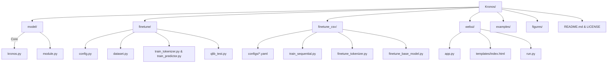

# Kronos 프로젝트 종합 리포트 (Codex Edition)

> Kronos는 "전 세계 45개 이상의 거래소에서 수집한 K-라인(캔들스틱) 시계열을 학습한 **오픈소스 금융 특화 기반 모델**"입니다. 본 문서는 "`@source/Kronos` 코드베이스를 바탕으로 프로젝트의 구조, 아키텍처, 운영 및 개발 지침을 체계적으로 정리한 기술 보고서"입니다.

- 문서 버전: 2025-02-15 Codex 작성본  
- 원본 저장소: https://github.com/shiyu-coder/Kronos  
- 적용 대상: 퀀트 리서처, 데이터 사이언티스트, 자동투자 시스템 개발자, 웹 UI/제품 엔지니어, 실무 배포 담당자

---

## 1. 프로젝트 개요

### 1.1 목적과 기능
- **도메인 특화 LLM**: "금융 시계열(OHLCV) 데이터를 자연어처럼 토큰화해 예측 가능한 시퀀스로 학습."
- **범용 양자화-트랜스포머 파이프라인**: "BSQuantizer 기반 계층적 토큰화 + 디코더 전용 Transformer로 구성된 2단계 구조."
- **즉시 활용 가능한 예측기**: "`KronosPredictor` 클래스로 데이터 전처리, 토큰화, 샘플링, 역정규화 과정을 자동화."
- **Fine-tuning 파이프라인**: "Qlib 데이터셋 또는 사용자 CSV 파일을 대상으로 토크나이저/모델을 단계별 재학습."
- **시각화 도구**: "Flask/Plotly 기반 Web UI로 데이터 업로드, 파라미터 튜닝, 결과 비교를 GUI에서 수행."
- **예제 및 백테스트 지원**: "예측 스크립트, 멀티 시리즈 배치 예측, 백테스팅 스크립트 포함."

### 1.2 문제 정의
- "일반적인 시계열 모델은 금융 시장 고유의 노이즈·비정상성·시장별 상이한 스케일링에 취약."
- "다양한 주기/거래소의 K-라인을 단일 모델에서 학습하기 어렵고, 데이터 전처리 파이프라인이 표준화되어 있지 않음."
- "고급 모델을 산업 현장에 적용하려면 GPU 분산 학습, 모델 서빙, 시각화를 모두 직접 구축해야 하는 비용이 큼."

### 1.3 해결 방법
- **하이브리드 양자화 토크나이저**: "연속값을 비트 단위로 양자화해 Transformer 입력에 적합한 이산 토큰으로 변환."
- **리치 컨텍스트 학습**: "시간 임베딩·의존성 계층을 통해 시계열의 패턴, 거래량, 시즌성을 동시에 모델링."
- **표준화된 예측 인터페이스**: "pandas DataFrame과 타임스탬프만 준비하면 예측·시각화까지 자동 수행."
- **재학습 스크립트 제공**: "`torchrun` 기반 분산 학습, Comet.ml 로깅, 데이터 전처리를 템플릿화."
- **웹 UI 배포 템플릿**: "Flask 앱과 Plotly 차트로 비기술 사용자도 쉽게 모델 예측을 검토할 수 있게 지원."

### 1.4 핵심 기능
- **모델 패밀리**: "Hugging Face Hub에 공개된 mini/small/base 가중치 + 전용 토크나이저 제공."
- **샘플링 제어**: "Temperature, Top-k, Top-p, sample count 조절 지원 → 시나리오별 다양도·안정성 제어."
- **멀티 시리즈 배치 예측**: "`predict_batch`로 여러 종목을 동시에 처리해 리소스를 효율적으로 활용."
- **Fine-tuning 단계화**: "토크나이저 미세조정 → 기반 모델 미세조정 → 백테스트 → 지표 분석까지 파이프라인 제공."
- **Web UI 기능**: "다중 데이터 포맷, 모델 선택, 디바이스 지정, 예측 파라미터 조정, 결과 비교/저장."
- **백테스트 지원**: "Qlib 파이프라인으로 Top-K 전략, 누적 수익 곡선, 벤치마크 대비 분석 수행."

### 1.5 대상 사용자 및 사용 사례
- **퀀트/헤지펀드**: "글로벌 멀티마켓 데이터를 단일 모델로 통합 학습하고 시그널 생성."
- **데이터 사이언티스트**: "고급 금융 시계열 모델을 벤치마킹하거나 신규 데이터셋에 맞게 재학습."
- **개인 투자자/리테일**: "Web UI를 활용해 모델 예측을 시각적으로 검증."
- **교육·연구 기관**: "금융 데이터용 LLM 구조를 분석하고 실험용으로 활용."
- **핀테크 프로덕트 팀**: "백엔드 API 또는 UI로 통합해 자동화된 리서치/리포트 기능 구축."

---

## 2. 기술 아키텍처

### 2.1 고수준 시스템 아키텍처

```mermaid
flowchart LR
    subgraph Inference["예측 경로"]
        RawData[(OHLCV 시계열)]
        Preprocess[정규화 & 시간피처 생성\n(Numpy/Pandas)]
        Tokenizer[KronosTokenizer\nBSQuantizer]
        Transformer[Kronos 모델\n(Hierarchical Embedding + Decoder)]
        Sampler[샘플링 제어\n(Temperature/Top-k/Top-p)]
        Postprocess[역정규화 & 결과 DataFrame]
    end

    subgraph Serving["응용 계층"]
        Predictor[KronosPredictor\n(Python API)]
        WebUI[Flask Web UI\nPlotly 시각화]
        Examples[CLI/Notebook 예제]
    end

    subgraph Training["재학습 파이프라인"]
        Qlib[Qlib 데이터 로딩]
        CSV[Custom CSV Loader]
        TokenizerTrain[train_tokenizer.py\n(DDP + Comet)]
        PredictorTrain[train_predictor.py\n(DDP)]
        Backtest[qlib_test.py\nTop-K 전략]
    end

    RawData --> Preprocess --> Tokenizer --> Transformer --> Sampler --> Postprocess
    Postprocess --> Predictor
    Predictor --> WebUI
    Predictor --> Examples

    Qlib --> TokenizerTrain
    CSV --> TokenizerTrain
    TokenizerTrain --> PredictorTrain --> Backtest --> Predictor
```

### 2.2 기술 스택

| 계층 | 기술 / 라이브러리 | 설명 |
| --- | --- | --- |
| 언어/런타임 | Python 3.10+, PyTorch 2.x | 모델 구현, 분산 학습, GPU 가속 |
| 모델링 | Transformer, BSQuantizer, Hierarchical Embedding | 금융 시계열 전용 구조 |
| 데이터 | pandas, numpy, qlib | 데이터 전처리, 시계열 피처 생성 |
| 토큰화/허브 | huggingface_hub, safetensors | 사전학습 모델/토크나이저 로드 |
| 시각화 | matplotlib(예제), Plotly.js(Web UI) | 예측 결과 시각화 |
| 웹 애플리케이션 | Flask, flask-cors | REST 엔드포인트, 템플릿 렌더링 |
| 분산 학습/로깅 | torchrun, torch.distributed, comet_ml | DDP 학습, 실험 추적 |
| 기타 유틸 | tqdm, einops | 진행률 표시, 텐서 재구성 |

### 2.3 주요 종속성

| 컴포넌트 | 필수 패키지 | 비고 |
| --- | --- | --- |
| 루트 환경 | `torch`, `numpy`, `pandas`, `huggingface_hub`, `einops`, `matplotlib`, `tqdm`, `safetensors` | GPU 사용 시 CUDA 11.8 이상 권장 |
| Web UI | `flask`, `flask-cors`, `plotly`, `pandas`, `numpy` | CPU/MPS/CUDA 선택 가능 |
| Qlib 파이프라인 | `qlib`, `comet_ml` (옵션) | 중국 시장 데이터 예시, Comet 사용 안할 경우 비활성화 가능 |
| CSV 파이프라인 | `pandas`, `numpy`, `torch`, `PyYAML` | 사용자 정의 데이터 학습 |

### 2.4 디자인 패턴 및 아키텍처 결정
- **2단계 모델 구조**: "연속형 데이터를 양자화한 후 Transformer로 처리하는 *Quantize → Model* 파이프라인."
- **Hierarchical Embedding**: "s1(저차원)·s2(고차원) 토큰을 분리해 의존성을 모델링, `DualHead`로 조건부 출력."
- **Dependency-Aware Layer**: "s1 출력을 s2 예측에 조건부로 연결해 토큰 간 상호작용 강화."
- **Autoregressive Inference**: "시계열 길이만큼 반복 샘플링, Temperature/Top-p/Top-k 조절, 다중 샘플 평균화."
- **DDP 우선 설계**: "`torchrun` 기반 분산 학습, `DistributedSampler`로 데이터 균등 분배."
- **구성 분리**: "`Config`/`CustomFinetuneConfig`로 경로·하이퍼파라미터를 중앙 관리하고 스크립트에서 로드."
- **웹-모델 분리**: "Flask 앱에서 모델 로딩을 선택적으로 수행, 모델 미로딩 시 시뮬레이션 데이터로 데모 유지."

### 2.5 구성 요소 상호작용 및 데이터 흐름
1. **Inference**: "pandas DataFrame → 타임스탬프 파생 피처 → 정규화 → 토큰화 → Kronos Transformer → 샘플링 → 역정규화 → DataFrame 반환."
2. **Web UI**: "사용자가 데이터 파일·모델·장치·파라미터 선택 → Flask REST → `KronosPredictor` 호출 → Plotly Candlestick, 통계, JSON 결과 저장."
3. **Fine-tuning (QLib)**: "Qlib 데이터 로드 → train/val/test 피클 저장 → DDP 학습(`train_tokenizer.py`, `train_predictor.py`) → 체크포인트 저장 → `qlib_test.py`로 백테스트."
4. **Fine-tuning (CSV)**: "YAML 기반 설정 → 시계열 분할 → 분산 학습/로깅 → 결과 이미지·체크포인트 자동 저장."
5. **Hugging Face 통합**: "`from_pretrained()`로 토크나이저·모델 로드, 커스텀 경로 또는 로컬 캐시 사용."

---

## 3. 프로젝트 구조

### 3.1 디렉터리별 설명

| 경로 | 설명 | 핵심 파일 / 서브디렉터리 |
| --- | --- | --- |
| `README.md` | 공식 소개 문서 | 뉴스, 모델 설명, 데모 링크, 인용문, 라이선스 |
| `model/` | Kronos 핵심 모듈 | `kronos.py` (Tokenizer/Model/Predictor), `module.py` (BSQuantizer 등) |
| `examples/` | 예측 데모 스크립트 | `prediction_example.py`, `prediction_batch_example.py` |
| `finetune/` | Qlib 기반 재학습 | `config.py`, `dataset.py`, `train_tokenizer.py`, `train_predictor.py`, `qlib_test.py` |
| `finetune/utils/` | 분산 학습 유틸 | `training_utils.py` (DDP 초기화, seed 설정 등) |
| `finetune_csv/` | CSV 데이터 재학습 | YAML 설정, `finetune_tokenizer.py`, `train_sequential.py`, `examples/` |
| `webui/` | Flask Web UI | `app.py`, `run.py`, `templates/index.html`, `prediction_results/` |
| `figures/` | 문서 이미지 | 로고, 모델 개요도, 백테스트 결과 |
| `requirements.txt` | 기본 의존성 | 루트 환경 패키지 정의 |
| `webui/requirements.txt` | Web UI 전용 의존성 | Flask, Plotly 등 |
| `LICENSE` | MIT 라이선스 | 사용 조건 명시 |

### 3.2 파일 구성 근거
- **핵심 모델 분리**: "`model/` 디렉터리에 토크나이저/기반 모델/예측기를 집약해 다른 서브시스템에서도 재사용 가능하도록 설계."
- **학습 파이프라인 구분**: "Qlib 기반(`finetune/`)과 CSV 기반(`finetune_csv/`)을 분리하여 데이터 원천별 구성이 충돌하지 않도록 관리."
- **유저 인터페이스 격리**: "Web UI는 독립 요구사항(Flask, Plotly)과 배포 스크립트를 포함하고, 루트 의존성과 충돌 없이 설정 가능."
- **예제 스크립트 제공**: "모델 사용법을 즉시 테스트할 수 있는 실용적 샘플 코드 포함."
- **구성/유틸 템플릿화**: "Config 클래스, YAML 설정, util 함수로 반복 설정을 중앙화해 유지보수 용이."

### 3.3 프로젝트 계층 Mermaid 다이어그램



---

## 4. 설치 및 설정

### 4.1 전제 조건 및 시스템 요구사항
- **운영체제**: Linux, macOS, (Windows는 WSL 권장)
- **Python**: 3.10 이상
- **GPU**: CUDA 11.8+ (NVIDIA) 또는 Apple Silicon MPS 권장, CPU도 동작 가능하나 속도 저하 예상
- **스토리지**: 사전학습 모델 다운로드용 수 GB 여유 공간 (Hugging Face 캐시)
- **추가 도구**: Hugging Face CLI (선택), Git, torchrun (PyTorch 2.x 기본 포함)
- **Qlib 사용 시**: Qlib 데이터셋(예: `~/.qlib/qlib_data/cn_data`)과 지역별 캘린더 설정 필요

### 4.2 기본 설치 절차
```bash
# 1) 저장소 클론
git clone https://github.com/shiyu-coder/Kronos.git
cd Kronos

# 2) 가상환경 생성 (예: venv)
python -m venv .venv
source .venv/bin/activate  # Windows는 .venv\Scripts\activate

# 3) 핵심 의존성 설치
pip install --upgrade pip
pip install -r requirements.txt

# 4) (선택) Web UI 사용 시
pip install -r webui/requirements.txt
```

### 4.3 구성 지침

| 항목 | 경로/방법 | 설명 |
| --- | --- | --- |
| Hugging Face 인증 | `huggingface-cli login` | 비공개 모델 사용 시 필수 |
| GPU 디바이스 지정 | 예측 코드에서 `device="cuda:0"` | 환경에 따라 `"cpu"`, `"mps"`로 변경 |
| Qlib 경로 | `finetune/config.py` → `qlib_data_path` | 로컬 qlib 데이터 위치 지정 |
| 데이터셋 저장 경로 | `Config.dataset_path` | 전처리된 피클 저장 위치 |
| Comet 설정 | `Config.use_comet` 및 `comet_config` | API 키, 프로젝트명, 워크스페이스 설정 |
| 웹 UI 포트 | `webui/app.py` → `app.run(port=7070)` | 포트 충돌 시 수정 |
| CSV Finetune 설정 | `finetune_csv/configs/*.yaml` | 데이터 경로, 하이퍼파라미터, 저장 경로 템플릿 |

### 4.4 단계별 설치 가이드 (대표 시나리오)
1. **모델 예측만 사용**
   - "루트 requirements 설치 → Hugging Face 모델 로드 → `examples/prediction_example.py` 실행."
2. **Web UI 체험**
   - "Web UI requirements 설치 → `python webui/run.py` → 브라우저에서 http://localhost:7070 접속."
3. **Qlib 재학습**
   - "Qlib 데이터 준비 → `python finetune/qlib_data_preprocess.py` → `torchrun --standalone --nproc_per_node=NUM_GPUS finetune/train_tokenizer.py`."
4. **CSV 재학습**
   - "YAML 수정 → `python finetune_csv/train_sequential.py --config configs/<파일>` → 로그·체크포인트 확인."

### 4.5 일반적인 문제 해결

| 증상 | 원인 | 해결책 |
| --- | --- | --- |
| `ImportError: No module named 'qlib'` | Qlib 미설치 | `pip install pyqlib` 설치 또는 Qlib pipeline 미사용 시 스크립트 실행 제외 |
| Hugging Face 다운로드 실패 | 인증 필요/네트워크 문제 | `huggingface-cli login`, 프록시 설정 또는 수동 다운로드 후 로컬 경로 지정 |
| CUDA OOM | GPU 메모리 부족 | 모델 사이즈 축소(mini/small), 배치/샘플 수 감소, CPU/MPS 대체 |
| Web UI가 7070 충돌 | 포트 점유 | `app.run(..., port=80xx)` 포트 변경 또는 종료 후 재시작 |
| `KeyError` in `load_data_file` | CSV 컬럼명 불일치 | 필수 컬럼(`open`,`high`,`low`,`close`) 존재 여부 확인, 리네임 필요 |
| DDP 초기화 오류 (`NCCL error`) | 환경 변수 미설정 | `MASTER_ADDR`, `MASTER_PORT` 설정 또는 `torchrun --standalone` 사용 |
| Comet API Key 에러 | 환경 변수 미설정 또는 비활성화 필요 | `Config.use_comet=False`로 설정하거나 `COMET_API_KEY` 환경 변수 지정 |

---

## 5. 사용 가이드

### 5.1 기본 예측 예제

```python
import pandas as pd
from model import Kronos, KronosTokenizer, KronosPredictor

# 1) 모델/토크나이저 로드 (Hugging Face)
tokenizer = KronosTokenizer.from_pretrained("NeoQuasar/Kronos-Tokenizer-base")
model = Kronos.from_pretrained("NeoQuasar/Kronos-small")

# 2) Predictor 인스턴스 생성
predictor = KronosPredictor(model, tokenizer, device="cuda:0", max_context=512)

# 3) 데이터 준비 (lookback=400, pred_len=120)
df = pd.read_csv("examples/data/XSHG_5min_600977.csv")
df["timestamps"] = pd.to_datetime(df["timestamps"])

lookback, pred_len = 400, 120
x_df = df.loc[:lookback-1, ["open","high","low","close","volume","amount"]]
x_ts = df.loc[:lookback-1, "timestamps"]
y_ts = df.loc[lookback:lookback+pred_len-1, "timestamps"]

# 4) 예측 실행
forecast = predictor.predict(
    df=x_df,
    x_timestamp=x_ts,
    y_timestamp=y_ts,
    pred_len=pred_len,
    T=1.0,
    top_p=0.9,
    sample_count=1,
    verbose=True
)

print(forecast.head())
```

### 5.2 고급 기능
- **배치 예측**: "여러 종목·시점별로 `predict_batch` 사용 → 동일 길이의 시계열 세트에 대해 병렬 추론."
- **샘플링 제어**: "`T`, `top_k`, `top_p`, `sample_count` 파라미터 조정으로 예측 다양성·안정성 조절."
- **볼륨 데이터 미존재**: "`predict`가 volume/amount 컬럼 미존재 시 자동으로 0 채움."
- **멀티 디바이스 지원**: "`device` 인자를 `"cpu"`, `"cuda:1"`, `"mps"` 등으로 변경."
- **예측 결과 저장**: "Web UI에서 JSON 형식으로 `prediction_results/`에 기록 (데이터 통계, 갭 분석 포함)."
- **Plotly 그래프**: "예측과 실제를 같은 타임스케일에서 비교하는 캔들스틱·라인 차트 렌더링."

### 5.3 Web UI 사용 순서
1. `cd webui && python run.py`
2. 브라우저에서 http://localhost:7070 접속
3. 데이터 파일 선택 (`data/` 폴더 또는 사용자 파일)
4. 모델/토크나이저 선택 (`kronos-mini/small/base`, 로컬 경로 가능)
5. 장치 선택(CPU/CUDA/MPS) 및 샘플링 파라미터 지정
6. 타임 윈도우 슬라이더(400+120 포인트)로 예측 구간 선택
7. "Start Prediction" 버튼 → 그래프/테이블 확인 → 결과 저장(자동)

### 5.4 Fine-tuning 파이프라인

**QLib 기반 (국내/중국 예시)**
```bash
# 데이터 전처리
python finetune/qlib_data_preprocess.py

# 토크나이저 학습
torchrun --standalone --nproc_per_node=2 finetune/train_tokenizer.py

# 예측기(모델) 학습
torchrun --standalone --nproc_per_node=2 finetune/train_predictor.py

# 백테스트
python finetune/qlib_test.py --device cuda:0
```

**CSV 기반 (사용자 데이터)**
```bash
# 설정 파일 편집
vim finetune_csv/configs/config_ali09988_candle-5min.yaml

# 전체 파이프라인 실행
python finetune_csv/train_sequential.py --config configs/config_ali09988_candle-5min.yaml

# 토크나이저/모델 개별 실행도 가능
python finetune_csv/finetune_tokenizer.py --config <...>
python finetune_csv/finetune_base_model.py --config <...>
```

### 5.5 API 문서 (핵심 클래스)

| 클래스 | 주요 메서드 | 설명 |
| --- | --- | --- |
| `KronosTokenizer` | `encode(x, half=True)`, `decode(indices, half=True)` | BSQuantizer 기반 토큰화/역토큰화 |
| `Kronos` | `forward(s1_ids, s2_ids, stamp, ...)`, `decode_s1`, `decode_s2` | s1/s2 계층 출력, 의존성 레이어 활용 |
| `KronosPredictor` | `predict`, `predict_batch`, `generate` | 정규화→토큰화→샘플링→역정규화 파이프라인 |
| `auto_regressive_inference` | 내부 함수 | 컨텍스트 윈도우 유지, Pred_len 반복 샘플링 |
| `QlibDataset` | `__getitem__`, `set_epoch_seed` | 슬라이딩 윈도우 샘플링, 시간 피처 자동 생성 |
| `CustomKlineDataset` | CSV 기반 Dataset | 시간 순서 분할, 정규화, 랜덤 시드 제어 |

### 5.6 명령줄 인터페이스
- **예측 예제 실행**: "`python examples/prediction_example.py`"
- **배치 예측**: "`python examples/prediction_batch_example.py`"
- **웹 UI 실행**: "`python webui/run.py` (자동 브라우저 오픈)"
- **분산 학습**: "`torchrun --standalone --nproc_per_node=N finetune/train_tokenizer.py`"
- **백테스트**: "`python finetune/qlib_test.py --device cuda:0`"

---

## 6. 개발 지침

### 6.1 개발 환경 설정
1. 가상환경 생성 후 루트 requirements 설치.
2. 옵션별(Web UI, Qlib, CSV) requirements 추가 설치.
3. GPU 개발 시 CUDA Driver/Runtime 버전 확인 (PyTorch 호환성).
4. Hugging Face 모델 캐시 디렉터리 사용량 점검 (`~/.cache/huggingface`).
5. IDE에서 `model/` 디렉터리를 PYTHONPATH에 추가하거나 `sys.path.append` 처리 확인.

### 6.2 코드 스타일 및 규칙
- "PEP8 준수, 4 스페이스 인덴트."
- "타입 힌트 최소화되어 있으나 PyTorch 텐서 shape 주석 활용 권장."
- "로그 출력은 `print` 또는 `logging` 기반 (분산 학습 시 rank==0 출력 제한)."
- "주석 중 일부는 AI 생성(README 안내) → 사실 여부 검증 후 수정 권장."
- "Config 값은 코드 내 상수 대신 중앙 Config 클래스/파일에서 관리."
- "분산 학습 스크립트는 `if __name__ == "__main__":` 가드로 래핑되어 있음 → 수정 시 유지."

### 6.3 테스트 절차 및 커버리지
- "현재 공식 단위 테스트 스위트는 포함되어 있지 않음 → 실험 시 다음 체크 권장:"
  - "`examples/prediction_example.py` 실행으로 모델 로드/예측 검증."
  - "`webui/run.py` 실행 후 GUI 동작/결과 저장 확인."
  - "Fine-tune 스크립트 실행 시 일정 에폭 후 중간 저장본 로드/추론 검증."
  - "백테스트(`qlib_test.py`) 결과에서 예상 지표(누적 수익, Sharpe 등) 검토."
- "추가 자동화 필요 시 PyTest 기반 스모크 테스트 작성 권장(예: 모델 로드/한 단계 추론)."

### 6.4 기여 가이드라인
- "포크 후 브랜치(`feature/<name>`, `bugfix/<name>`) 생성 → 커밋 → PR 제출."
- "대규모 모델 가중치는 Git LFS 대신 Hugging Face Hub를 활용할 것."
- "PR 설명에 학습 로그, 예측 예제 결과, 성능 비교(선택) 첨부."
- "DDP 스크립트 변경 시 GPU 수·환경 변수에 따른 재현성 테스트 권장."
- "Web UI 수정 시 Plotly/JS 빌드 없이 정적 파일만 업데이트 가능(현재 구성은 CDN)."
- "문서/주석 AI 생성 여부 표기(README 안내 참고) 및 검증 상태 명시."

---

## 7. 추가 정보

### 7.1 성능 고려사항
- **추론 시간**: "mini 모델은 수백 ms, base 모델은 수초 수준 (GPU 기준, pred_len=120)."
- **컨텍스트 제한**: "`max_context=512` 초과 시 과거 토큰 슬라이딩 → 긴 히스토리 필요 시 모델 수치 조정 필요."
- **메모리**: "base 모델은 VRAM 수 GB 필요, 분산 학습 시 rank별 배치 크기 조정."
- **샘플 수**: "`sample_count` 증가 시 평균화로 안정화 가능하지만 계산량 선형 증가."
- **정규화**: "시계열별 정규화 적용 → 역정규화 시 평균/표준편차 저장 필수."
- **백테스트**: "Qlib Top-K 전략은 단순 모델 → 실전 투입 전 포트폴리오 최적화/슬리피지 모델링 필요."

### 7.2 보안 고려사항
- "Hugging Face 토큰은 환경 변수/CLI 로그인으로 관리, 코드 내 하드코딩 금지."
- "Web UI는 기본적으로 로컬 접근 전제 → 외부 공개 시 인증/HTTPS/역프록시 구성 필요."
- "모델 다운로드 캐시는 민감 데이터 포함 없음, 단 사용자 데이터 업로드 시 저장 경로(예: `webui/prediction_results/`)에 주의."
- "Comet ML 사용 시 API Key를 `.env` 또는 환경 변수로 분리."

### 7.3 로드맵 및 향후 계획 (코드 기반 추론)
- "`DataFetcher` 주석(주석 처리된 TODO) → 실시간/다중 주기 데이터 지원 확대 예정."
- "`BinarySphericalQuantizer` 주석 → Entropy 최적화, 코드북 효율화 개선 가능성."
- "`config.py` Todo 항목 → 경로, Comet, 모델 경로의 사용자 맞춤 자동화."
- "CSV 파이프라인 → `skip_existing` 플래그 기반 증분 학습/체크포인트 재사용 기능 강화 전망."
- "Web UI → 다국어 지원(템플릿 언어 zh-CN), 데이터 업로드/다운로드 UX 개선 여지."

### 7.4 라이선스 및 저작권
- **라이선스**: "MIT License (Copyright © 2025 ShiYu)"
  - "상업적 이용, 수정, 재배포 가능하나 저작권/라이선스 표기 유지 필수."
  - "파생 모델 배포 시 Hugging Face 라이선스 조건 및 데이터 제공처 약관 준수 필요."
- **인용**: "논문 `Kronos: A Foundation Model for the Language of Financial Markets`(arXiv:2508.02739) 참조."

---

## 부록: 참고 자료
- Kronos Demo: https://shiyu-coder.github.io/Kronos-demo/
- Hugging Face Model Zoo: https://huggingface.co/NeoQuasar
- Qlib 프로젝트: https://github.com/microsoft/qlib
- Comet ML: https://www.comet.com/
- Torch Distributed 가이드: https://pytorch.org/docs/stable/distributed.html

> _"시간의 언어를 이해하는 모델, Kronos와 함께 금융 시장의 미래를 예측하세요."_  
