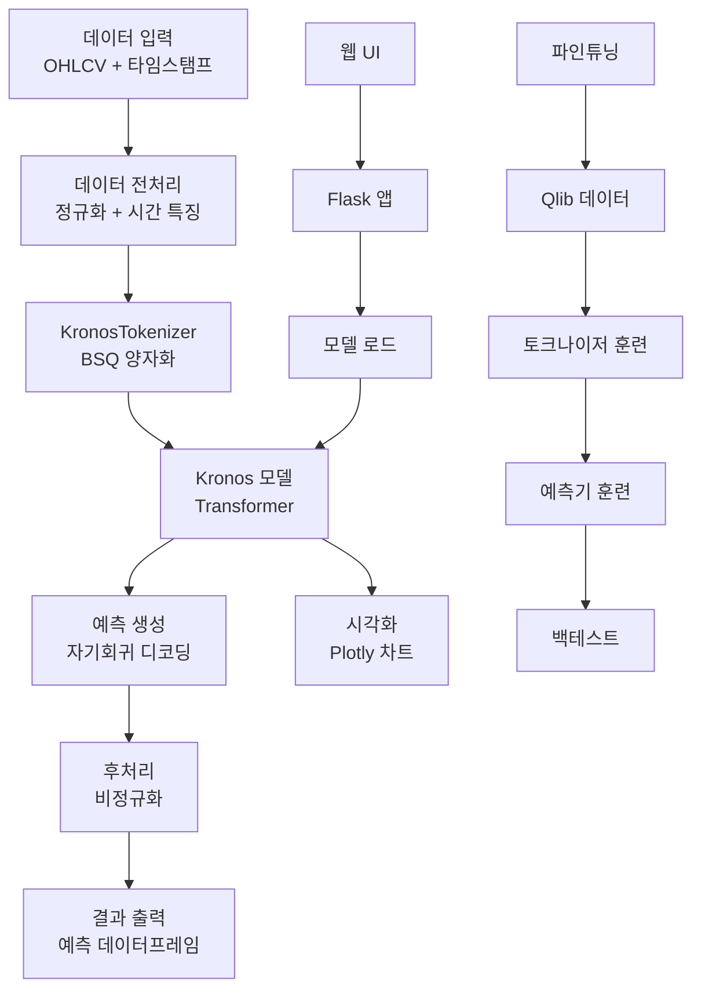
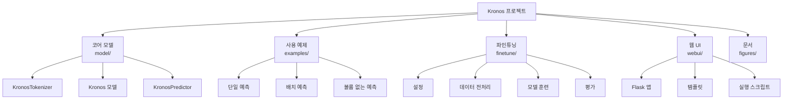

# Kronos: A Foundation Model for the Language of Financial Markets

## 프로젝트 개요

### 목적과 기능
Kronos는 금융 시장의 "언어"인 K-라인(K-line, 캔들스틱) 시퀀스를 위한 최초의 오픈소스 파운데이션 모델입니다. 일반적인 시계열 예측 모델과 달리, Kronos는 금융 데이터의 고잡음 특성을 처리하도록 설계되었습니다. 이 모델은 45개 이상의 글로벌 거래소에서 수집된 데이터로 사전 학습되었으며, 양적 거래 작업을 위한 통합 모델로 작동합니다.

### 문제 정의
금융 시장 예측은 높은 잡음, 비정상성, 복잡한 패턴으로 인해 어려운 과제입니다. 기존 모델들은 일반적인 시계열 예측에 초점을 맞추었으나, 금융 데이터의 특수한 특성을 충분히 고려하지 못했습니다.

### 해결 방법
Kronos는 혁신적인 2단계 프레임워크를 사용합니다:
1. **특화된 토크나이저**: 연속적이고 다차원적인 K-라인 데이터(OHLCV)를 계층적 이산 토큰으로 양자화합니다.
2. **대규모 자기회귀 Transformer**: 이러한 토큰에서 사전 학습되어 다양한 양적 작업을 위한 통합 모델을 형성합니다.

### 핵심 기능
- **다중 규모 모델**: mini(4.1M 파라미터)부터 large(499.2M 파라미터)까지 다양한 크기의 모델 제공
- **효율적 예측**: 단 몇 줄의 코드로 원시 데이터에서 예측까지 수행
- **배치 예측**: GPU 병렬화를 활용한 다중 시계열 동시 예측
- **파인튜닝 지원**: Qlib을 사용한 맞춤형 데이터셋 파인튜닝
- **웹 인터페이스**: 직관적인 예측 및 시각화 도구

### 대상 사용자
- 양적 트레이더 및 투자 전문가
- 금융 데이터 사이언티스트
- 머신러닝 연구자
- 금융 기술 개발자

### 사용 사례
- 주식 가격 예측
- 암호화폐 트렌드 분석
- 포트폴리오 최적화
- 위험 관리
- 알고리즘 트레이딩 전략 개발

## 기술 아키텍처

### 기술 스택
- **프로그래밍 언어**: Python 3.10+
- **딥러닝 프레임워크**: PyTorch
- **데이터 처리**: pandas, NumPy
- **시각화**: Matplotlib, Plotly
- **웹 프레임워크**: Flask
- **패키지 관리**: pip, requirements.txt
- **버전 관리**: Git

### 종속성
```
numpy
pandas
torch
einops==0.8.1
huggingface_hub==0.33.1
matplotlib==3.9.3
pandas==2.2.2
tqdm==4.67.1
safetensors==0.6.2
```

### 디자인 패턴
- **토크나이저-예측기 분리**: 데이터 전처리와 모델 예측을 분리하여 모듈성 향상
- **팩토리 패턴**: KronosPredictor 클래스를 통한 모델 인스턴스 생성
- **어댑터 패턴**: 다양한 데이터 형식 지원을 위한 데이터 로더
- **옵저버 패턴**: 훈련 중 로깅 및 모니터링

### 아키텍처 결정사항
- **이진 구형 양자화(BSQ)**: 효율적인 데이터 압축 및 재구성을 위한 맞춤형 양자화 기법
- **계층적 임베딩**: S1(사전 토큰)과 S2(사후 토큰)의 2단계 토큰화
- **시간적 임베딩**: 시계열 데이터의 시간적 종속성 캡처
- **의존성 인식 레이어**: S1 토큰에 조건부 S2 예측

### 구성 요소 상호작용
1. **데이터 입력**: OHLCV 데이터와 타임스탬프
2. **토크나이저**: 데이터를 이산 토큰으로 변환
3. **Transformer**: 토큰 시퀀스 처리 및 예측 생성
4. **정규화/비정규화**: 입력/출력 데이터 스케일링
5. **시각화**: 예측 결과 플롯팅

### 데이터 흐름
```
원시 데이터 → 정규화 → 토큰화 → Transformer 예측 → 디토큰화 → 비정규화 → 최종 예측
```

### 고수준 시스템 아키텍처 다이어그램



## 프로젝트 구조

### 디렉토리별 설명

- **/**: 프로젝트 루트
  - `README.md`: 프로젝트 소개 및 사용 가이드
  - `requirements.txt`: Python 종속성
  - `LICENSE`: MIT 라이선스

- **examples/**: 사용 예제
  - `prediction_example.py`: 기본 예측 예제
  - `prediction_batch_example.py`: 배치 예측 예제
  - `prediction_wo_vol_example.py`: 볼륨 없는 데이터 예측
  - `data/`: 샘플 데이터 파일

- **figures/**: 문서화 이미지
  - `logo.png`: 프로젝트 로고
  - `overview.png`: 아키텍처 개요 다이어그램
  - `prediction_example.png`: 예측 결과 예시
  - `backtest_result_example.png`: 백테스트 결과 예시

- **finetune/**: 모델 파인튜닝 도구
  - `config.py`: 파인튜닝 설정
  - `dataset.py`: 데이터셋 클래스
  - `qlib_data_preprocess.py`: Qlib 데이터 전처리
  - `train_tokenizer.py`: 토크나이저 파인튜닝
  - `train_predictor.py`: 예측기 파인튜닝
  - `qlib_test.py`: 백테스트 평가
  - `utils/`: 유틸리티 함수들

- **finetune_csv/**: 파인튜닝용 CSV 데이터 (비어있음)

- **model/**: 코어 모델 구현
  - `__init__.py`: 패키지 초기화
  - `kronos.py`: Kronos 모델 및 예측기 클래스
  - `module.py`: 모델 구성 요소 (Transformer 블록, 양자화 등)

- **webui/**: 웹 인터페이스
  - `app.py`: Flask 웹 애플리케이션
  - `run.py`: 애플리케이션 실행 스크립트
  - `requirements.txt`: 웹 UI 종속성
  - `templates/`: HTML 템플릿
  - `prediction_results/`: 예측 결과 저장 디렉토리

### 파일 구성의 근거
프로젝트는 모듈성을 고려하여 구성되었습니다:
- 모델 코어는 `model/`에 집중
- 사용 예제는 `examples/`에 분리
- 파인튜닝 도구는 `finetune/`에 그룹화
- 웹 인터페이스는 `webui/`에 독립적 배치

### 프로젝트 계층 구조 다이어그램



## 설치 및 설정

### 전제 조건
- Python 3.10 이상
- pip 패키지 관리자
- Git (선택사항, 클론용)

### 시스템 요구사항
- **운영체제**: Linux, macOS, Windows
- **RAM**: 최소 8GB, 권장 16GB 이상
- **저장공간**: 5GB 이상 (모델 및 데이터용)
- **GPU**: 선택사항, CUDA 지원 GPU 권장 (훈련/대규모 추론용)

### 단계별 설치 가이드

1. **저장소 클론** (선택사항):
   ```bash
   git clone https://github.com/shiyu-coder/Kronos.git
   cd Kronos
   ```

2. **종속성 설치**:
   ```bash
   pip install -r requirements.txt
   ```

3. **모델 다운로드 확인**:
   설치 후 Hugging Face Hub에서 모델이 자동으로 다운로드됩니다.

### 구성 지침

- **환경 변수**: 민감한 정보(API 키 등)는 환경 변수로 설정
- **경로 설정**: 데이터 및 모델 경로는 절대 경로 사용 권장
- **GPU 설정**: CUDA_VISIBLE_DEVICES로 GPU 지정

### 일반적인 문제 해결

- **ImportError**: requirements.txt의 모든 패키지 설치 확인
- **CUDA 오류**: PyTorch CUDA 버전과 GPU 드라이버 호환성 확인
- **메모리 부족**: 배치 크기 감소 또는 CPU 모드 사용
- **모델 다운로드 실패**: 인터넷 연결 및 Hugging Face 접근성 확인

## 사용 가이드

### 기본 사용 예제

```python
from model import Kronos, KronosTokenizer, KronosPredictor
import pandas as pd

# 1. 모델 및 토크나이저 로드
tokenizer = KronosTokenizer.from_pretrained("NeoQuasar/Kronos-Tokenizer-base")
model = Kronos.from_pretrained("NeoQuasar/Kronos-small")

# 2. 예측기 생성
predictor = KronosPredictor(model, tokenizer, device="cuda:0", max_context=512)

# 3. 데이터 준비
df = pd.read_csv("data.csv")
df['timestamps'] = pd.to_datetime(df['timestamps'])

lookback = 400
pred_len = 120

x_df = df.loc[:lookback-1, ['open', 'high', 'low', 'close', 'volume', 'amount']]
x_timestamp = df.loc[:lookback-1, 'timestamps']
y_timestamp = df.loc[lookback:lookback+pred_len-1, 'timestamps']

# 4. 예측 수행
pred_df = predictor.predict(
    df=x_df,
    x_timestamp=x_timestamp,
    y_timestamp=y_timestamp,
    pred_len=pred_len,
    T=1.0,
    top_p=0.9,
    sample_count=1
)

print(pred_df.head())
```

### 코드 스니펫

**배치 예측**:
```python
pred_df_list = predictor.predict_batch(
    df_list=[df1, df2, df3],
    x_timestamp_list=[ts1, ts2, ts3],
    y_timestamp_list=[future_ts1, future_ts2, future_ts3],
    pred_len=120,
    T=1.0,
    top_p=0.9,
    sample_count=1,
    verbose=True
)
```

**볼륨 없는 데이터 예측**:
```python
# volume 및 amount 컬럼이 없는 경우 자동으로 0으로 채워짐
pred_df = predictor.predict(df=x_df, ...)
```

### 고급 기능

- **확률적 샘플링**: `T`, `top_p`, `sample_count` 파라미터로 다양성 조절
- **맞춤형 토크나이저**: 도메인 특화 데이터로 파인튜닝
- **시간 특징**: 자동 시간 기반 특징 생성
- **GPU 병렬화**: 배치 예측으로 다중 시계열 동시 처리

### 구성 옵션

| 파라미터 | 기본값 | 설명 |
|----------|--------|------|
| `device` | "cuda:0" | 계산 장치 |
| `max_context` | 512 | 최대 컨텍스트 길이 |
| `T` | 1.0 | 샘플링 온도 |
| `top_p` | 0.9 | Nucleus 샘플링 확률 |
| `sample_count` | 1 | 샘플 수 |

### API 문서

**KronosPredictor.predict()**
- **입력**: df, x_timestamp, y_timestamp, pred_len, T, top_p, sample_count
- **출력**: 예측 데이터프레임 (open, high, low, close, volume, amount 컬럼)
- **예외**: ValueError (잘못된 입력), RuntimeError (GPU 메모리 부족)

**KronosPredictor.predict_batch()**
- **입력**: df_list, x_timestamp_list, y_timestamp_list, 기타 predict() 파라미터
- **출력**: 예측 데이터프레임 리스트
- **요구사항**: 모든 시리즈 동일 길이

### 명령줄 인터페이스

웹 UI를 통한 그래픽 인터페이스 제공:
```bash
cd webui
python run.py
```
브라우저에서 http://localhost:5000 접속

## 개발 지침

### 개발 환경 설정 방법

1. **가상환경 생성**:
   ```bash
   python -m venv kronos_env
   source kronos_env/bin/activate  # Linux/macOS
   # 또는 kronos_env\Scripts\activate  # Windows
   ```

2. **종속성 설치**:
   ```bash
   pip install -r requirements.txt
   pip install -r webui/requirements.txt  # 웹 UI 개발 시
   ```

3. **개발 도구 설치**:
   ```bash
   pip install pytest black flake8  # 테스트, 코드 포맷팅, 린팅
   ```

### 코드 스타일 및 규칙

- **포맷팅**: Black 사용 (줄 길이 88자)
- **린팅**: flake8 사용
- **네이밍**: snake_case (함수/변수), PascalCase (클래스)
- **문서화**: Google 스타일 docstring
- **타입 힌트**: 필수 함수에 적용

### 테스트 절차 및 커버리지

```bash
# 단위 테스트 실행
pytest tests/

# 커버리지 보고서
pytest --cov=model --cov-report=html
```

**테스트 범위**:
- 모델 로드 및 초기화
- 토큰화/디토큰화 정확성
- 예측 출력 형식 검증
- 에러 처리 시나리오

### 기여 가이드라인

1. **이슈 생성**: GitHub 이슈로 버그 리포트 또는 기능 요청
2. **브랜치 생성**: `feature/기능명` 또는 `bugfix/이슈번호`
3. **코드 작성**: 테스트와 함께 TDD 방식 권장
4. **PR 제출**: 설명적 커밋 메시지, 관련 이슈 링크
5. **리뷰**: 최소 1명 승인 후 머지

## 추가 정보

### 성능 고려사항

- **모델 크기**: mini 모델은 빠르지만 정확도 낮음, large 모델은 정확하지만 리소스 많이 사용
- **컨텍스트 길이**: 512 토큰 제한, 긴 시퀀스는 자동 절단
- **GPU 메모리**: 배치 크기와 시퀀스 길이에 따라 조절
- **추론 속도**: CPU 모드보다 GPU 권장, 배치 예측으로 최적화

### 보안 고려사항

- **API 키**: 환경 변수로 민감 정보 관리
- **데이터 검증**: 입력 데이터 NaN/무한값 검사
- **모델 파일**: 신뢰할 수 있는 소스(Hugging Face)에서 다운로드
- **웹 UI**: CORS 설정, 입력 유효성 검사

### 프로젝트 로드맵 및 향후 계획

- **단기 (2025 Q1-Q2)**: 추가 모델 크기, 다중 모달 입력 지원
- **중기 (2025 Q3-Q4)**: 실시간 예측 API, 클라우드 배포
- **장기 (2026+)**: 멀티에셋 예측, 강화학습 통합

### 라이선스 및 저작권 표시

이 프로젝트는 MIT 라이선스 하에 배포됩니다. 저작권 © 2025 ShiYu.

**인용**:
```
@misc{shi2025kronos,
      title={Kronos: A Foundation Model for the Language of Financial Markets}, 
      author={Yu Shi and Zongliang Fu and Shuo Chen and Bohan Zhao and Wei Xu and Changshui Zhang and Jian Li},
      year={2025},
      eprint={2508.02739},
      archivePrefix={arXiv},
      primaryClass={q-fin.ST},
      url={https://arxiv.org/abs/2508.02739}, 
}
```</content>
<parameter name="filePath">/Users/gyuha/workspace/investment-open-source-analysis/report/Kronos/report-copilot-grok.md