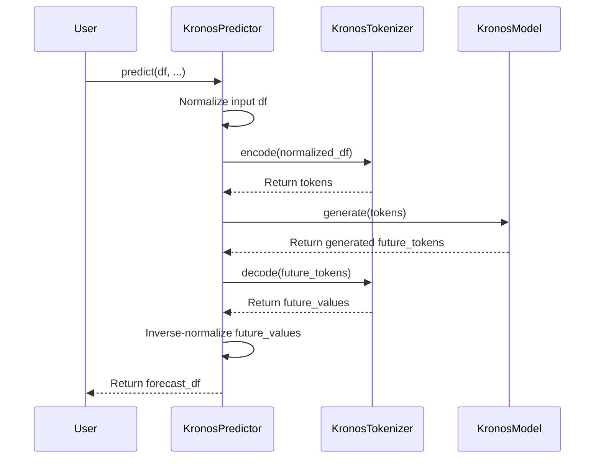
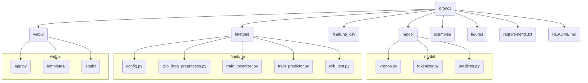

# Kronos 프로젝트 분석 보고서

## 1. 프로젝트 개요

### 1.1. 프로젝트 목적 및 기능

Kronos는 금융 시장의 언어, 특히 금융 캔들스틱(K-라인) 시계열 데이터를 위해 특별히 설계된 최초의 오픈소스 파운데이션 모델입니다. 일반적인 시계열 예측 모델과 달리, Kronos는 노이즈가 많고 복잡한 금융 데이터의 고유한 특성을 처리하는 데 중점을 둡니다. 이 프로젝트의 핵심 목적은 금융 시계열 데이터의 패턴을 깊이 있게 학습하여, 예측, 백테스팅 등 다양한 정량적 금융 분석 작업에 활용될 수 있는 통일된 모델을 제공하는 것입니다.

### 1.2. 문제 정의

금융 시계열 데이터(OHLCV: 시가, 고가, 저가, 종가, 거래량)는 변동성이 크고, 비정형적이며, 노이즈가 많은 특성을 가집니다. 기존의 통계적 또는 머신러닝 모델들은 이러한 데이터의 복잡한 비선형적 패턴을 완전히 포착하는 데 한계가 있었습니다. 또한, 특정 작업에 특화된 모델은 다른 종류의 분석에 재사용하기 어려워, 각기 다른 작업마다 새로운 모델을 개발해야 하는 비효율성이 존재했습니다.

### 1.3. 해결 방법

Kronos는 이 문제를 해결하기 위해 독창적인 2단계 프레임워크를 제안합니다.

1.  **특수 토크나이저 (Specialized Tokenizer)**: 연속적인 다차원 K-라인 데이터를 계층적이고 이산적인 토큰(token)으로 양자화합니다. 이는 마치 자연어 처리에서 문장을 단어로 나누는 것과 유사하며, 복잡한 금융 데이터를 트랜스포머 모델이 이해할 수 있는 형태로 변환하는 핵심 단계입니다.
2.  **대규모 자기회귀 트랜스포머 (Autoregressive Transformer)**: 토큰화된 데이터를 기반으로 대규모 자기회귀(decoder-only) 트랜스포머 모델을 사전 훈련합니다. 이 모델은 과거 데이터의 패턴을 학습하여 미래의 데이터 시퀀스를 생성(예측)하는 능력을 갖추게 됩니다.

이러한 접근 방식을 통해 Kronos는 단일 모델로 다양한 금융 분석 작업을 수행할 수 있는 강력한 기반을 마련합니다.

### 1.4. 핵심 기능

*   **금융 특화 파운데이션 모델**: 45개 이상의 글로벌 거래소 데이터로 사전 훈련된 다양한 크기(mini, small, base)의 모델 제공.
*   **간편한 예측 인터페이스**: `KronosPredictor` 클래스를 통해 데이터 전처리, 정규화, 예측, 역정규화 과정을 자동화하여 몇 줄의 코드로 쉽게 예측 결과를 얻을 수 있습니다.
*   **확장성 있는 파인튜닝**: 자체 데이터셋을 사용하여 모델을 특정 시장이나 자산에 맞게 미세 조정(finetuning)할 수 있는 완전한 파이프라인을 제공합니다. (예: 중국 A주식 시장 데이터 파인튜닝 및 백테스팅 예제 포함)
*   **배치 예측**: 여러 시계열 데이터를 동시에 병렬로 처리하여 효율성을 극대화하는 `predict_batch` 기능을 지원합니다.
*   **대화형 웹 UI**: Flask와 Plotly를 기반으로 한 웹 데모를 통해 모델의 예측 결과를 시각적으로 확인하고 상호작용할 수 있습니다.

### 1.5. 대상 사용자 및 사용 사례

*   **퀀트 분석가 (Quantitative Analysts)**: 새로운 알파 전략을 탐색하거나 기존 전략의 예측 신호를 개선하는 데 Kronos를 활용할 수 있습니다.
*   **금융 연구원 (Financial Researchers)**: 시장의 미세 구조나 특정 이벤트가 가격에 미치는 영향을 모델링하고 분석하는 연구에 사용될 수 있습니다.
*   **AI/ML 개발자 (AI/ML Developers)**: 금융 예측 모델을 구축하거나, LLM을 금융 도메인에 적용하는 방법을 탐구하는 데 유용한 프레임워크를 제공합니다.
*   **개인 투자자**: 기술적 분석의 보조 도구로서 단기적인 가격 움직임을 예측하는 데 참고 자료로 활용할 수 있습니다.

## 2. 기술 아키텍처

### 2.1. 고수준 시스템 아키텍처

```mermaid
graph TD
    subgraph 데이터 입력
        A[Raw Financial Data<br/>(OHLCV DataFrame)]
    end

    subgraph KronosPredictor
        B[Data Preprocessing<br/>(Normalization)]
        C[KronosTokenizer<br/>(Quantization & Tokenization)]
        D[Kronos Model<br/>(Autoregressive Transformer)]
        E[Detokenization &<br/>Inverse Normalization]
    end

    subgraph 예측 결과
        F[Forecasted Data<br/>(DataFrame)]
    end

    A --> B
    B --> C
    C --> D
    D --> E
    E --> F
```

### 2.2. 기술 스택 및 종속성

*   **언어**: Python 3.10+
*   **핵심 라이브러리**:
    *   `torch`: 딥러닝 모델의 구현 및 학습을 위한 핵심 프레임워크.
    *   `pandas`, `numpy`: 데이터 조작 및 수치 연산을 위해 사용.
    *   `huggingface_hub`, `safetensors`: Hugging Face Hub에서 사전 훈련된 모델을 다운로드하고 안전하게 로드.
    *   `einops`: 복잡한 텐서 연산을 직관적으로 표현.
*   **파인튜닝 및 백테스팅**:
    *   `pyqlib`: Microsoft에서 개발한 퀀트 투자 플랫폼으로, 데이터 처리 및 백테스팅에 사용.
*   **웹 UI**:
    *   `Flask`, `Flask-CORS`: 웹 애플리케이션 백엔드 구축.
    *   `Plotly`: 인터랙티브한 차트 생성을 위해 사용.
*   **기타**: `matplotlib`, `tqdm`

### 2.3. 디자인 패턴 및 아키텍처 결정사항

*   **파운데이션 모델 접근 방식**: 특정 작업에 국한되지 않고, 사전 훈련된 대규모 모델을 다양한 다운스트림 작업(예: 예측, 시뮬레이션)에 적용할 수 있도록 설계되었습니다. 이는 전이 학습(Transfer Learning)의 개념을 금융 시계열에 적용한 것입니다.
*   **Decoder-Only 트랜스포머**: GPT와 같은 생성 모델에서 주로 사용되는 아키텍처를 채택하여, 과거 데이터(prompt)를 기반으로 미래의 데이터 시퀀스를 자기회귀적으로 생성하는 데 최적화되어 있습니다.
*   **추상화 계층 (Abstraction Layer)**: `KronosPredictor` 클래스는 모델의 복잡한 내부 동작(정규화, 토큰화, 예측, 역정규화)을 캡슐화하여 사용자에게 간단한 API를 제공합니다. 이는 사용 편의성을 크게 향상시키는 중요한 설계 결정입니다.
*   **모듈화된 구조**: 핵심 모델(`model`), 파인튜닝(`finetune`), 웹 UI(`webui`), 예제(`examples`) 등 기능별로 코드가 명확하게 분리되어 있어 유지보수와 확장이 용이합니다.
*   **Hugging Face Hub 통합**: 사전 훈련된 모델과 토크나이저를 Hugging Face Hub를 통해 배포함으로써, 사용자들이 쉽게 모델을 다운로드하고 사용할 수 있도록 표준적인 생태계를 활용합니다.

### 2.4. 컴포넌트 상호작용 및 데이터 흐름

#### 예측 과정 데이터 흐름



#### 파인튜닝 과정 데이터 흐름

```mermaid
graph TD
    subgraph 1. 데이터 준비
        A[Raw Data<br/>(e.g., Qlib dataset)] --> B{qlib_data_preprocess.py};
        B --> C[train_data.pkl];
        B --> D[val_data.pkl];
        B --> E[test_data.pkl];
    end

    subgraph 2. 모델 학습
        F[Pre-trained Tokenizer] --> G{train_tokenizer.py};
        C -- Training Data --> G;
        G --> H[Fine-tuned Tokenizer];

        I[Pre-trained Predictor] --> J{train_predictor.py};
        H -- Fine-tuned Tokenizer --> J;
        C -- Training Data --> J;
        J --> K[Fine-tuned Predictor];
    end

    subgraph 3. 백테스팅
        K -- Fine-tuned Predictor --> L{qlib_test.py};
        H -- Fine-tuned Tokenizer --> L;
        E -- Test Data --> L;
        L --> M[Backtest Results<br/>(Performance Analysis & Plot)];
    end
```

## 3. 프로젝트 구조

### 3.1. 디렉토리별 설명

*   `source/Kronos/`: 프로젝트의 루트 디렉토리입니다.
    *   `model/`: `Kronos`, `KronosTokenizer`, `KronosPredictor` 등 핵심 모델의 정의가 포함된 디렉토리입니다.
    *   `finetune/`: Qlib 데이터를 사용하여 모델을 파인튜닝하고 백테스팅하는 스크립트들이 위치합니다.
    *   `finetune_csv/`: (추정) CSV 파일을 사용하여 모델을 파인튜닝하기 위한 스크립트들이 위치할 것으로 보입니다.
    *   `webui/`: Flask 기반의 웹 애플리케이션으로, 모델의 예측을 시각화하는 UI를 제공합니다.
    *   `examples/`: 모델을 사용하여 예측을 수행하는 방법을 보여주는 예제 코드(`prediction_example.py`)가 포함되어 있습니다.
    *   `figures/`: `README.md` 파일에 사용되는 로고, 아키텍처 다이어그램 등의 이미지 파일이 저장되어 있습니다.
    *   `requirements.txt`: 프로젝트 실행에 필요한 Python 라이브러리 목록입니다.
    *   `README.md`: 프로젝트에 대한 상세한 소개와 사용법을 담고 있는 문서입니다.

### 3.2. 프로젝트 계층 구조



## 4. 설치 및 설정

### 4.1. 전제 조건 및 시스템 요구사항

*   **Python**: 3.10 이상
*   **하드웨어**:
    *   기본 예측: CPU로도 가능.
    *   모델 학습/파인튜닝: NVIDIA GPU (CUDA 지원) 권장.
*   **운영체제**: Linux, macOS, Windows

### 4.2. 단계별 설치 가이드

1.  **프로젝트 클론**:
    ```bash
    git clone https://github.com/shiyu-coder/Kronos.git
    cd Kronos
    ```

2.  **가상 환경 생성 (권장)**:
    ```bash
    python -m venv venv
    source venv/bin/activate  # Linux/macOS
    # venv\Scripts\activate  # Windows
    ```

3.  **종속성 설치**:
    ```bash
    pip install -r requirements.txt
    ```

4.  **(선택) 파인튜닝을 위한 Qlib 설치**:
    ```bash
    pip install pyqlib
    ```

### 4.3. 구성 지침

*   **기본 예측**: 별도의 구성이 필요하지 않습니다. `examples/prediction_example.py`를 참고하여 바로 사용할 수 있습니다.
*   **파인튜닝**: `finetune/config.py` 파일을 수정해야 합니다.
    *   `qlib_data_path`: 로컬 Qlib 데이터 경로를 지정합니다.
    *   `dataset_path`: 가공된 데이터셋(pickle 파일)이 저장될 경로를 지정합니다.
    *   `save_path`: 파인튜닝된 모델 체크포인트가 저장될 경로를 지정합니다.
    *   `pretrained_tokenizer_path`, `pretrained_predictor_path`: 파인튜닝의 기반이 될 사전 훈련 모델의 경로 또는 Hugging Face 모델 이름을 지정합니다. (예: `NeoQuasar/Kronos-small`)

### 4.4. 일반적인 문제 해결

*   **`ImportError: Kronos model cannot be imported`**: `requirements.txt`의 모든 라이브러리가 올바르게 설치되었는지 확인하세요. 특히 `torch` 버전 호환성 문제가 있을 수 있습니다.
*   **CUDA out of memory**: 모델 학습 또는 파인튜닝 시 GPU 메모리가 부족할 경우 발생합니다. `finetune/config.py`에서 `batch_size`를 줄이거나, 더 작은 모델(예: `Kronos-mini`)을 사용해 보세요.
*   **파일 경로 문제**: `finetune/config.py`에 설정된 경로들이 올바른지, 해당 디렉토리에 대한 읽기/쓰기 권한이 있는지 확인하세요.

## 5. 사용 가이드

### 5.1. 기본 사용 예제 (예측)

다음은 `KronosPredictor`를 사용하여 주가 데이터를 예측하는 기본 예제입니다.

```python
import pandas as pd
from model import Kronos, KronosTokenizer, KronosPredictor

# 1. 사전 훈련된 모델과 토크나이저 로드
tokenizer = KronosTokenizer.from_pretrained("NeoQuasar/Kronos-Tokenizer-base")
model = Kronos.from_pretrained("NeoQuasar/Kronos-small")

# 2. Predictor 초기화
predictor = KronosPredictor(model, tokenizer, device="cuda:0") # GPU 사용

# 3. 입력 데이터 준비 (OHLCV 포함된 DataFrame)
# 예시: 'data.csv' 파일에 OHLCV 데이터가 있다고 가정
df = pd.read_csv("data.csv")
df['timestamps'] = pd.to_datetime(df['timestamps'])

lookback = 400 # 과거 400개 데이터 포인트 사용
pred_len = 120 # 미래 120개 데이터 포인트 예측

x_df = df.iloc[:lookback]
x_timestamp = df.loc[:lookback-1, 'timestamps']
y_timestamp = pd.date_range(start=x_timestamp.iloc[-1], periods=pred_len + 1, freq='H')[1:] # 예측할 타임스탬프

# 4. 예측 생성
pred_df = predictor.predict(
    df=x_df[['open', 'high', 'low', 'close', 'volume']],
    x_timestamp=x_timestamp,
    y_timestamp=y_timestamp,
    pred_len=pred_len,
    T=1.0,
    top_p=0.9
)

print("--- 예측 결과 ---")
print(pred_df.head())
```

### 5.2. 고급 기능 (파인튜닝)

1.  **데이터 준비**: `finetune/config.py` 설정 후, `qlib_data_preprocess.py` 실행하여 데이터를 `pkl` 파일로 저장.
    ```bash
    python finetune/qlib_data_preprocess.py
    ```
2.  **토크나이저 파인튜닝**:
    ```bash
    # NUM_GPUS를 사용할 GPU 개수로 변경 (예: 2)
    torchrun --standalone --nproc_per_node=NUM_GPUS finetune/train_tokenizer.py
    ```
3.  **예측 모델 파인튜닝**:
    ```bash
    torchrun --standalone --nproc_per_node=NUM_GPUS finetune/train_predictor.py
    ```
4.  **백테스팅**:
    ```bash
    python finetune/qlib_test.py --device cuda:0
    ```

### 5.3. 명령줄 인터페이스 (Web UI)

프로젝트는 별도의 CLI를 제공하지 않지만, `webui/app.py`를 실행하여 웹 기반 인터페이스를 사용할 수 있습니다.

```bash
python webui/app.py
```

실행 후 웹 브라우저에서 `http://0.0.0.0:7070`에 접속하면, 데이터 파일을 선택하고 예측 파라미터를 조절하며 결과를 시각적으로 확인할 수 있습니다.

## 6. 개발 지침

### 6.1. 개발 환경 설정

1.  [4.2. 단계별 설치 가이드](#42-단계별-설치-가이드)에 따라 기본 환경을 설정합니다.
2.  개발에 필요한 추가 라이브러리(예: `pylint`, `black`)를 설치합니다.
    ```bash
    pip install black pylint
    ```

### 6.2. 코드 스타일 및 규칙

*   코드는 **PEP 8** 스타일 가이드를 따르는 것을 권장합니다.
*   `black` 포맷터를 사용하여 코드 스타일을 일관되게 유지합니다.
*   `pylint`와 같은 정적 분석 도구를 사용하여 코드 품질을 관리합니다.
*   주석은 명확하고 간결하게 작성하며, 특히 복잡한 로직에 대해서는 설명을 추가합니다. `finetune/` 디렉토리의 코드 주석은 AI에 의해 생성되었으므로 참고용으로만 활용하고, 실제 로직은 코드를 직접 분석해야 합니다.

### 6.3. 테스트 절차

*   **단위 테스트**: 현재 프로젝트에는 공식적인 단위 테스트 프레임워크가 포함되어 있지 않습니다. 새로운 기능을 추가할 경우, `pytest` 등을 사용하여 단위 테스트를 작성하는 것이 권장됩니다.
*   **기능 테스트**: `examples/` 디렉토리의 스크립트와 `webui/app.py`를 실행하여 예측 기능이 정상적으로 동작하는지 확인합니다.
*   **파인튜닝/백테스팅 테스트**: `finetune/` 디렉토리의 파이프라인을 실행하여 모델 학습 및 평가 과정에 오류가 없는지 확인합니다.

## 7. 추가 정보

### 7.1. 성능 고려사항

*   **모델 크기**: 모델 크기(`mini`, `small`, `base`)는 예측 품질과 계산 비용 간의 트레이드오프 관계에 있습니다. 더 큰 모델은 일반적으로 더 나은 성능을 보이지만 더 많은 메모리와 계산 시간을 필요로 합니다.
*   **배치 처리**: 여러 자산을 동시에 예측할 경우, `predict_batch` 메소드를 사용하면 GPU 병렬 처리를 통해 성능을 크게 향상시킬 수 있습니다.
*   **데이터 로딩**: 대용량 데이터셋을 다룰 경우, `pandas`의 `feather` 포맷이나 `parquet` 포맷을 사용하면 CSV보다 더 빠르게 데이터를 읽고 쓸 수 있습니다.

### 7.2. 보안 고려사항

*   **Hugging Face 모델 로드**: `huggingface_hub`를 통해 모델을 로드할 때는 항상 신뢰할 수 있는 소스(공식 `NeoQuasar` 리포지토리)에서 다운로드해야 합니다.
*   **데이터 보안**: 민감한 금융 데이터를 다룰 경우, 데이터가 저장되고 처리되는 환경의 보안을 강화해야 합니다.
*   **웹 UI**: `webui/app.py`는 개발 및 데모용으로 제작되었습니다. 프로덕션 환경에 배포할 경우, Flask의 디버그 모드를 비활성화하고 Gunicorn, Nginx와 같은 WSGI 서버를 사용하여 보안을 강화해야 합니다.

### 7.3. 프로젝트 로드맵 및 향후 계획

*   **`Kronos-large` 모델 공개**: 현재 비공개 상태인 499.2M 파라미터의 `large` 모델을 향후 공개할 계획이 있을 수 있습니다.
*   **다양한 금융 작업 지원**: 현재는 예측에 중점을 두고 있지만, 변동성 예측, 이상 탐지, 포트폴리오 최적화 등 더 넓은 범위의 금융 다운스트림 작업을 지원하도록 모델을 확장할 수 있습니다.
*   **멀티모달(Multi-modal) 데이터 통합**: 가격 데이터 외에 뉴스, 소셜 미디어 데이터 등 다른 형태의 데이터를 통합하여 예측 성능을 향상시키는 방향으로 발전할 수 있습니다.

### 7.4. 라이선스 및 저작권

이 프로젝트는 **MIT 라이선스** 하에 배포됩니다. 이는 소스 코드의 사용, 복제, 수정, 배포에 대한 폭넓은 자유를 허용하지만, 원본 저작권 및 라이선스 고지를 포함해야 합니다. 자세한 내용은 `LICENSE` 파일을 참고하세요.
