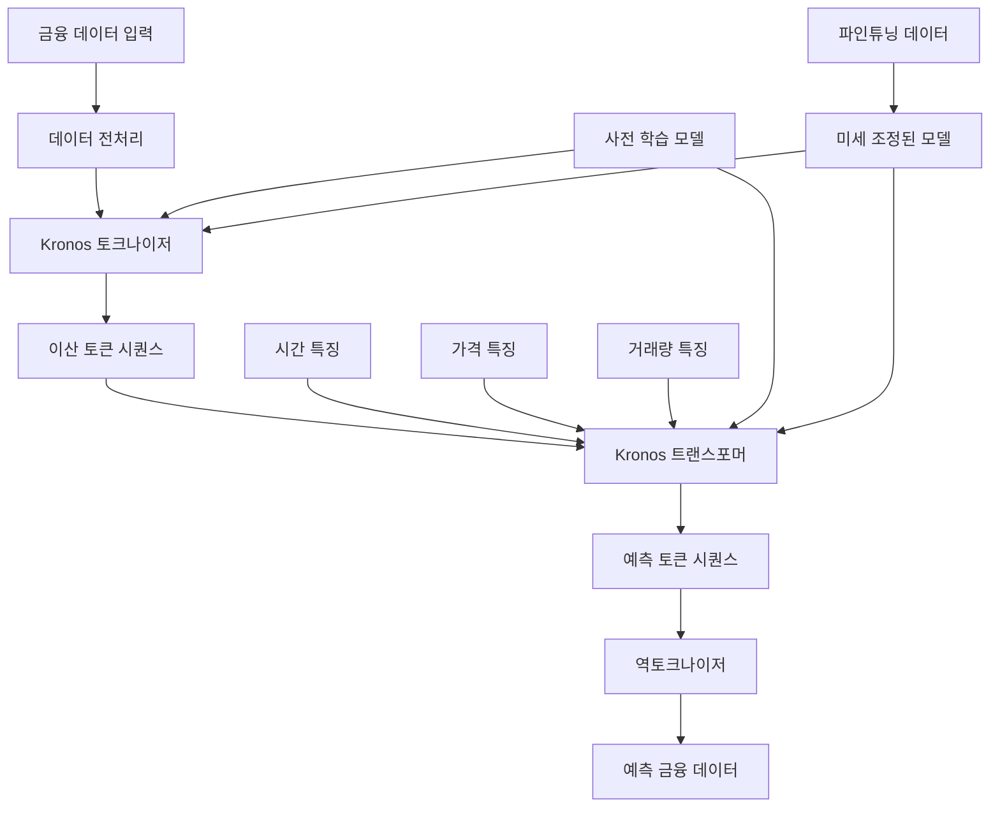
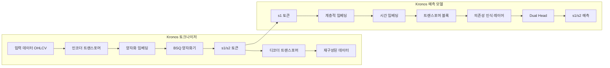
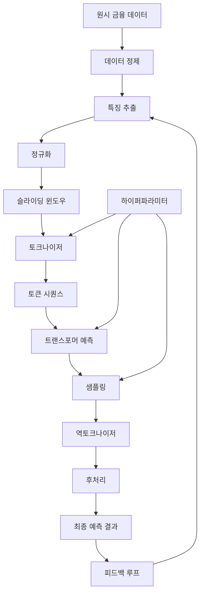
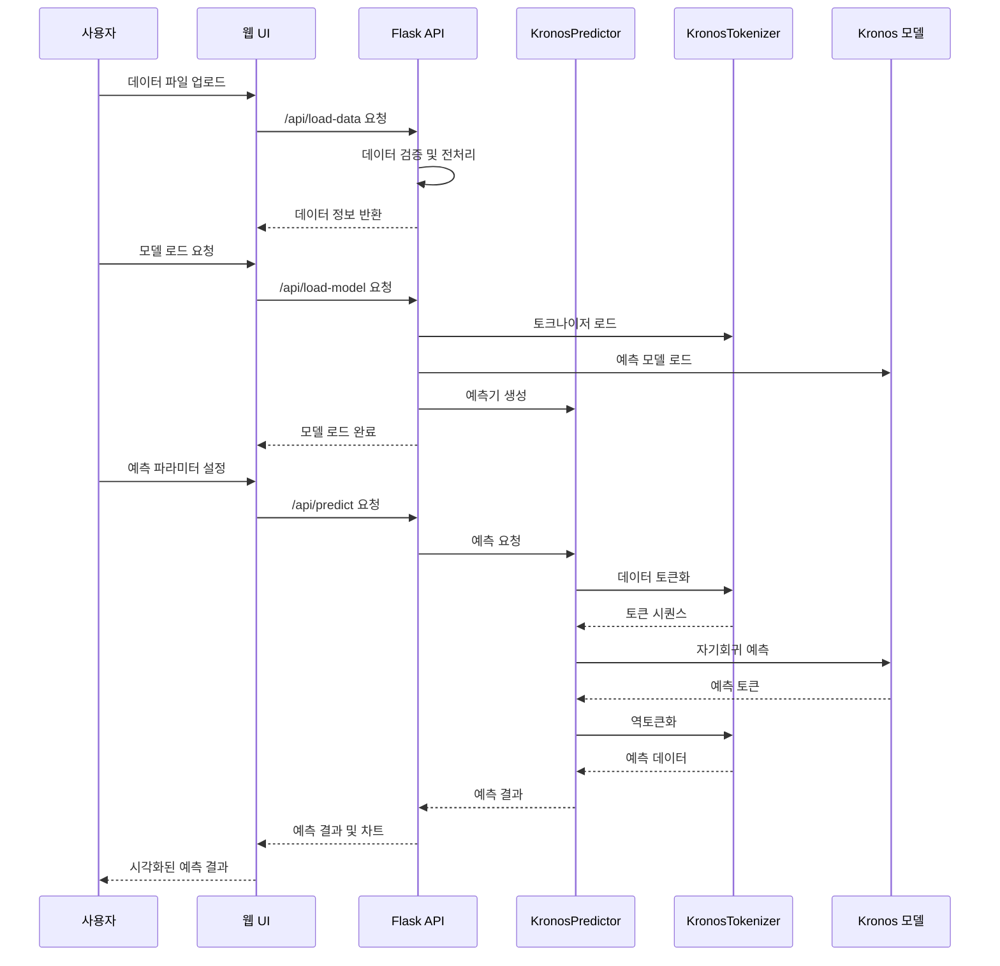
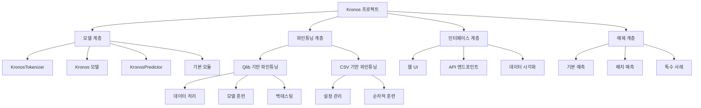
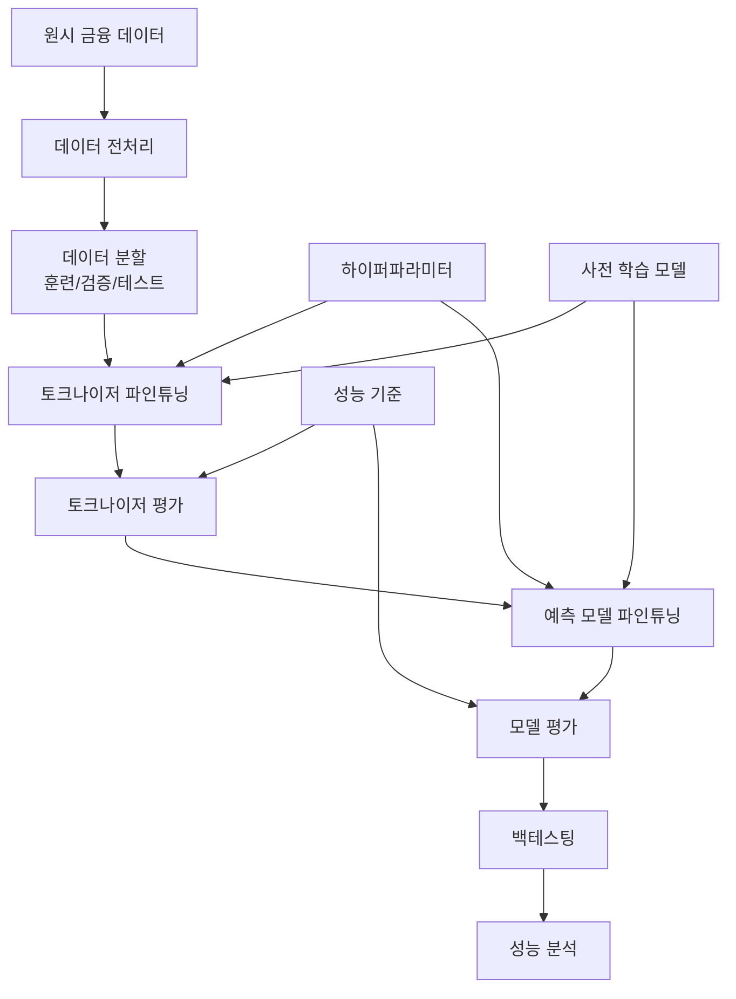
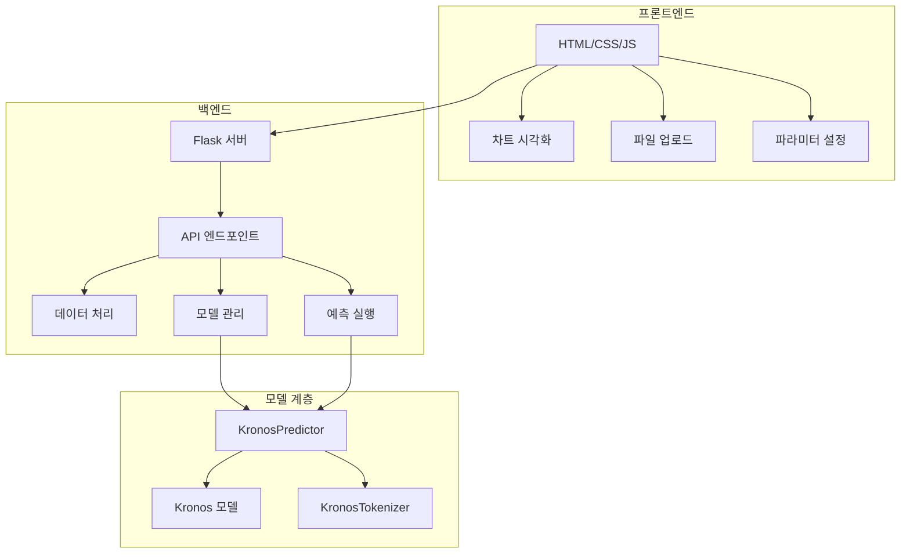
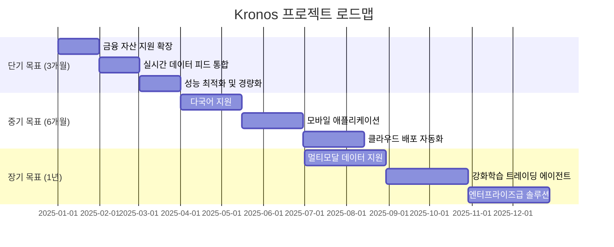

# Kronos: 금융 시장 언어를 위한 파운데이션 모델 포괄 분석 보고서

## 목차
1. [프로젝트 개요](#프로젝트-개요)
2. [기술 아키텍처](#기술-아키텍처)
3. [프로젝트 구조](#프로젝트-구조)
4. [설치 및 설정](#설치-및-설정)
5. [사용 가이드](#사용-가이드)
6. [개발 지침](#개발-지침)
7. [추가 정보](#추가-정보)

---

## 프로젝트 개요

### 프로젝트 목적과 기능

Kronos는 금융 캔들스틱(K-line) 데이터를 위한 최초의 오픈소스 파운데이션 모델입니다. 전 세계 45개 이상의 거래소 데이터로 학습되었으며, 금융 시장의 독특한 고노이즈 특성을 처리하도록 특별히 설계되었습니다. 이 모델은 연속적인 다차원 K-line 데이터(OHLCV)를 계층적 이산 토큰으로 양자화하는 전문 토크나이저와 이 토큰으로 학습된 대규모 자기회귀 트랜스포머를 결합한 2단계 프레임워크를 사용합니다.

### 문제 정의

금융 시계열 예측은 전통적인 통계 모델과 최신 딥러닝 모델 모두에게 어려운 과제입니다. 금융 데이터는 높은 노이즈, 비선형성, 시간적 의존성 등 복잡한 특성을 가지고 있어 일반적인 시계열 예측 모델이 잘 동작하지 않는 경우가 많습니다. 또한, 기존 모델들은 다양한 금융 자산과 시장에 일반화되기 어려운 한계가 있었습니다.

### 해결 방법

Kronos는 다음과 같은 혁신적인 접근 방식으로 이 문제를 해결합니다:

1. **전문 토크나이저**: Binary Spherical Quantization(BSQ)를 사용하여 연속적인 금융 데이터를 계층적 이산 토큰으로 변환
2. **대규모 트랜스포머**: 토큰화된 데이터로 학습된 자기회귀 트랜스포머를 사용하여 시간적 의존성 모델링
3. **의존성 인식 레이어**: 금융 데이터의 복잡한 의존 관계를 포착하기 위한 특수 아키텍처
4. **다중 스케일 예측**: 다양한 시간 척도에서의 예측을 지원

### 핵심 기능

- **다중 자산 지원**: 주식, 암호화폐, 외환 등 다양한 금융 자산 예측
- **다중 시간 프레임**: 분간, 시간간, 일간 등 다양한 시간 간격 지원
- **확률적 예측**: 다중 샘플링을 통한 불확실성 추정
- **배치 예측**: 여러 자산에 대한 병렬 예측 지원
- **사용자 정의 파인튜닝**: 특정 시장이나 자산에 맞춘 모델 미세조정

### 대상 사용자 및 사용 사례

- **퀀트 트레이더**: 알고리즘 트레이딩 전략 개발 및 백테스팅
- **금융 분석가**: 시장 동향 예측 및 리스크 관리
- **헤지 펀드**: 포트폴리오 최적화 및 자산 배분
- **개인 투자자**: 시장 방향성 예측 및 투자 결정 지원
- **학술 연구자**: 금융 시계열 예측 모델 연구 및 개발

---

## 기술 아키텍처

### 고수준 시스템 아키텍처



### 모델 아키텍처 상세 다이어그램



### 데이터 흐름 다이어그램



### 기술 스택

- **프로그래밍 언어**: Python 3.10+
- **딥러닝 프레임워크**: PyTorch
- **데이터 처리**: Pandas, NumPy
- **모델 배포**: Hugging Face Hub
- **시각화**: Matplotlib, Plotly
- **웹 인터페이스**: Flask, HTML/CSS/JavaScript
- **분산 학습**: PyTorch DDP (Distributed Data Parallel)
- **실험 추적**: Comet ML (선택적)

### 종속성

#### 핵심 종속성
- `torch`: 딥러닝 모델 구현 및 학습
- `numpy`: 수치 계산 및 배열 처리
- `pandas`: 금융 데이터 처리 및 조작
- `einops`: 텐서 차원 조작
- `huggingface_hub`: 모델 저장 및 로드
- `matplotlib`: 데이터 시각화
- `tqdm`: 진행률 표시
- `safetensors`: 안전한 텐서 저장

#### 웹 UI 종속성
- `flask`: 웹 서버 프레임워크
- `flask-cors`: 크로스 오리진 리소스 공유
- `plotly`: 인터랙티브 차트

### 디자인 패턴

1. **파이프라인 패턴**: 데이터 전처리, 토큰화, 예측, 후처리 단계로 구성된 파이프라인
2. **전략 패턴**: 다양한 예측 전략과 모델 크기 선택을 위한 인터페이스
3. **팩토리 패턴**: 다양한 모델 구성 생성을 위한 팩토리 메서드
4. **옵저버 패턴**: 학습 진행 상황 모니터링 및 로깅
5. **싱글톤 패턴**: 전역 설정 및 모델 인스턴스 관리

### 아키텍처 결정사항

1. **계층적 토큰화**: 금융 데이터의 복잡한 패턴을 포착하기 위해 2단계 토큰화(s1_bits, s2_bits) 채택
2. **자기회귀 트랜스포머**: 시간적 의존성 모델링을 위해 디코더 전용 트랜스포머 아키텍처 선택
3. **의존성 인식 레이어**: 금융 데이터의 복잡한 의존 관계를 모델링하기 위해 크로스 어텐션 기반 레이어 추가
4. **회전 위치 임베딩**: 시간 정보를 더 효과적으로 포착하기 위해 RoPE(Rotary Positional Embedding) 채택
5. **이진 구형 양자화**: 연속 데이터를 효율적으로 이산화하기 위해 BSQ(Binary Spherical Quantization) 사용

### 구성 요소 상호작용 및 데이터 흐름



---

## 프로젝트 구조

### 디렉토리별 설명

```
Kronos/
├── model/                    # 핵심 모델 구현
│   ├── __init__.py          # 모델 초기화
│   ├── kronos.py            # Kronos 및 KronosTokenizer 클래스
│   └── module.py            # 기본 구성 요소 (트랜스포머, 양자화기 등)
├── finetune/                # Qlib 기반 파인튜닝 파이프라인
│   ├── config.py            # 파인튜닝 설정
│   ├── dataset.py           # Qlib 데이터셋 클래스
│   ├── train_predictor.py   # 예측 모델 파인튜닝 스크립트
│   ├── train_tokenizer.py   # 토크나이저 파인튜닝 스크립트
│   ├── qlib_data_preprocess.py  # Qlib 데이터 전처리
│   ├── qlib_test.py         # 백테스팅 스크립트
│   └── utils/               # 유틸리티 함수
├── finetune_csv/            # CSV 기반 파인튜닝 파이프라인
│   ├── config_loader.py     # 설정 로더
│   ├── finetune_base_model.py  # 기본 모델 파인튜닝
│   ├── finetune_tokenizer.py  # 토크나이저 파인튜닝
│   ├── train_sequential.py  # 순차적 훈련 스크립트
│   ├── configs/             # 설정 파일
│   ├── data/                # 예제 데이터
│   └── examples/            # 예제 결과
├── webui/                   # 웹 사용자 인터페이스
│   ├── app.py               # Flask 애플리케이션
│   ├── run.py               # 시작 스크립트
│   ├── templates/           # HTML 템플릿
│   ├── prediction_results/  # 예측 결과 저장
│   └── requirements.txt     # 웹 UI 종속성
├── examples/                # 사용 예제
│   ├── prediction_example.py          # 기본 예측 예제
│   ├── prediction_batch_example.py    # 배치 예측 예제
│   └── prediction_wo_vol_example.py   # 거래량 없는 예측 예제
├── figures/                 # 문서용 이미지
├── requirements.txt         # 핵심 종속성
└── README.md               # 프로젝트 설명
```

### 파일 구성의 근거

1. **model/**: 핵심 모델 로직을 분리하여 재사용성과 유지보수성 향상
2. **finetune/**: Qlib 기반 파인튜닝을 위한 전문 파이프라인으로, 학술 연구 및 대규모 데이터에 적합
3. **finetune_csv/**: CSV 기반 파인튜닝으로, 소규모 데이터나 빠른 프로토타이핑에 적합
4. **webui/**: 사용자 친화적인 인터페이스로, 비기술 사용자도 모델 활용 가능
5. **examples/**: 다양한 사용 사례를 보여주는 예제 코드로, 학습 곡선 완화

### 프로젝트 계층 구조



### 파인튜닝 워크플로우



### 웹 UI 아키텍처



---

## 설치 및 설정

### 전제 조건

- Python 3.10 이상
- PyTorch 1.12 이상
- CUDA 11.0 이상 (GPU 사용 시)
- 8GB 이상의 RAM
- 4GB 이상의 GPU 메모리 (GPU 사용 시)

### 시스템 요구사항

#### 최소 사양
- CPU: 4코어 이상
- RAM: 8GB 이상
- 저장 공간: 10GB 이상
- OS: Linux, macOS, Windows

#### 권장 사양
- CPU: 8코어 이상
- RAM: 16GB 이상
- GPU: NVIDIA RTX 3080 이상 (10GB VRAM)
- 저장 공간: 50GB 이상
- OS: Linux (Ubuntu 20.04 이상)

### 단계별 설치 가이드

#### 1. 리포지토리 클론

```bash
git clone https://github.com/shiyu-coder/Kronos.git
cd Kronos
```

#### 2. 가상 환경 생성 및 활성화

```bash
# Python 가상 환경 생성
python -m venv kronos_env

# 가상 환경 활성화 (Linux/macOS)
source kronos_env/bin/activate

# 가상 환경 활성화 (Windows)
kronos_env\Scripts\activate
```

#### 3. 종속성 설치

```bash
# 핵심 종속성 설치
pip install -r requirements.txt

# 웹 UI 종속성 설치 (선택적)
cd webui
pip install -r requirements.txt
cd ..
```

#### 4. PyTorch 설치 (CUDA 지원)

```bash
# CUDA 11.8 (NVIDIA GPU)
pip install torch torchvision torchaudio --index-url https://download.pytorch.org/whl/cu118

# CPU 전용
pip install torch torchvision torchaudio --index-url https://download.pytorch.org/whl/cpu
```

#### 5. Qlib 설치 (파인튜닝 시)

```bash
pip install pyqlib
```

### 구성 지침

#### 기본 모델 사용

```python
from model import Kronos, KronosTokenizer, KronosPredictor

# 토크나이저 및 모델 로드
tokenizer = KronosTokenizer.from_pretrained("NeoQuasar/Kronos-Tokenizer-base")
model = Kronos.from_pretrained("NeoQuasar/Kronos-small")

# 예측기 생성
predictor = KronosPredictor(model, tokenizer, device="cuda:0", max_context=512)
```

#### 파인튜닝 설정

```python
# finetune/config.py 파일 수정
config = Config()

# 데이터 경로 설정
config.qlib_data_path = "~/.qlib/qlib_data/cn_data"

# 사전 학습된 모델 경로 설정
config.pretrained_tokenizer_path = "NeoQuasar/Kronos-Tokenizer-base"
config.pretrained_predictor_path = "NeoQuasar/Kronos-small"

# 저장 경로 설정
config.save_path = "./outputs/models"
```

### 일반적인 문제 해결 방법

#### 1. CUDA 메모리 부족

```python
# 배치 크기 감소
config.batch_size = 16

# 그래디언트 누적 사용
config.accumulation_steps = 4
```

#### 2. 모델 로드 실패

```python
# 인터넷 연결 확인
# Hugging Face Hub 접속 가능 여부 확인

# 로컬 모델 경로 사용
model_path = "/path/to/local/model"
model = Kronos.from_pretrained(model_path)
```

#### 3. 데이터 형식 오류

```python
# 필요한 열 확인
required_cols = ['open', 'high', 'low', 'close']
if not all(col in df.columns for col in required_cols):
    raise ValueError(f"Missing columns: {required_cols}")

# 타임스탬프 형식 변환
df['timestamps'] = pd.to_datetime(df['timestamps'])
```

#### 4. 웹 UI 접속 문제

```bash
# 포트 확인
netstat -tulpn | grep 7070

# 포트 변경
# app.py에서 port=7070을 다른 포트로 변경
app.run(debug=True, host='0.0.0.0', port=8080)
```

---

## 사용 가이드

### 기본 사용 예제

#### 단일 예측

```python
import pandas as pd
from model import Kronos, KronosTokenizer, KronosPredictor

# 1. 모델 로드
tokenizer = KronosTokenizer.from_pretrained("NeoQuasar/Kronos-Tokenizer-base")
model = Kronos.from_pretrained("NeoQuasar/Kronos-small")
predictor = KronosPredictor(model, tokenizer, device="cuda:0", max_context=512)

# 2. 데이터 준비
df = pd.read_csv("./data/XSHG_5min_600977.csv")
df['timestamps'] = pd.to_datetime(df['timestamps'])

lookback = 400
pred_len = 120

x_df = df.loc[:lookback-1, ['open', 'high', 'low', 'close', 'volume', 'amount']]
x_timestamp = df.loc[:lookback-1, 'timestamps']
y_timestamp = df.loc[lookback:lookback+pred_len-1, 'timestamps']

# 3. 예측 실행
pred_df = predictor.predict(
    df=x_df,
    x_timestamp=x_timestamp,
    y_timestamp=y_timestamp,
    pred_len=pred_len,
    T=1.0,          # 샘플링 온도
    top_p=0.9,      # 핵 샘플링 확률
    sample_count=1  # 예측 경로 수
)

print("예측 결과:")
print(pred_df.head())
```

#### 배치 예측

```python
# 여러 시계열에 대한 병렬 예측
df_list = [df1, df2, df3]  # 여러 데이터프레임
x_timestamp_list = [x_ts1, x_ts2, x_ts3]  # 해당 타임스탬프
y_timestamp_list = [y_ts1, y_ts2, y_ts3]  # 예측 타임스탬프

pred_df_list = predictor.predict_batch(
    df_list=df_list,
    x_timestamp_list=x_timestamp_list,
    y_timestamp_list=y_timestamp_list,
    pred_len=pred_len,
    T=1.0,
    top_p=0.9,
    sample_count=1,
    verbose=True
)
```

### 고급 기능

#### 거래량 없는 예측

```python
# 거래량 데이터가 없는 경우
x_df = df.loc[:lookback-1, ['open', 'high', 'low', 'close']]

# 자동으로 거래량과 금액을 0으로 채움
pred_df = predictor.predict(
    df=x_df,
    x_timestamp=x_timestamp,
    y_timestamp=y_timestamp,
    pred_len=pred_len
)
```

#### 샘플링 파라미터 조정

```python
# 더 다양한 예측을 위한 샘플링 파라미터 조정
pred_df = predictor.predict(
    df=x_df,
    x_timestamp=x_timestamp,
    y_timestamp=y_timestamp,
    pred_len=pred_len,
    T=1.2,          # 더 높은 온도로 무작위성 증가
    top_p=0.95,     # 더 높은 top_p로 다양성 증가
    sample_count=5  # 여러 예측 경로 생성 후 평균
)
```

### 구성 옵션

#### 모델 선택

| 모델 | 토크나이저 | 컨텍스트 길이 | 파라미터 | 설명 |
|------|------------|---------------|----------|------|
| Kronos-mini | Kronos-Tokenizer-2k | 2048 | 4.1M | 가벼운 모델, 빠른 예측 |
| Kronos-small | Kronos-Tokenizer-base | 512 | 24.7M | 균형잡힌 성능과 속도 |
| Kronos-base | Kronos-Tokenizer-base | 512 | 102.3M | 높은 예측 품질 |

#### 예측 파라미터

- **T (Temperature)**: 예측의 무작위성 제어 (0.1-2.0)
  - 낮은 값: 더 결정적 예측
  - 높은 값: 더 다양한 예측
- **top_p**: 핵 샘플링 확률 (0.1-1.0)
  - 낮은 값: 더 보수적 예측
  - 높은 값: 더 창의적 예측
- **sample_count**: 생성할 예측 경로 수 (1-5)
  - 여러 경로 생성 후 평균하여 품질 향상

### API 문서

#### KronosPredictor 클래스

```python
class KronosPredictor:
    def __init__(self, model, tokenizer, device="cuda:0", max_context=512, clip=5):
        """
        예측기 초기화
        
        Args:
            model: 학습된 Kronos 모델
            tokenizer: 학습된 KronosTokenizer
            device: 계산 장치 ('cpu', 'cuda:0', 'mps')
            max_context: 최대 컨텍스트 길이
            clip: 데이터 클리핑 값
        """
    
    def predict(self, df, x_timestamp, y_timestamp, pred_len, T=1.0, top_p=0.9, sample_count=1, verbose=True):
        """
        단일 시계열 예측
        
        Args:
            df: 과거 데이터 (OHLCV)
            x_timestamp: 과거 데이터 타임스탬프
            y_timestamp: 예측할 타임스탬프
            pred_len: 예측 길이
            T: 샘플링 온도
            top_p: 핵 샘플링 확률
            sample_count: 샘플 수
            verbose: 진행 상황 출력 여부
            
        Returns:
            예측 결과 데이터프레임
        """
    
    def predict_batch(self, df_list, x_timestamp_list, y_timestamp_list, pred_len, T=1.0, top_p=0.9, sample_count=1, verbose=True):
        """
        여러 시계열 배치 예측
        
        Args:
            df_list: 과거 데이터 리스트
            x_timestamp_list: 과거 타임스탬프 리스트
            y_timestamp_list: 예측 타임스탬프 리스트
            pred_len: 예측 길이
            T: 샘플링 온도
            top_p: 핵 샘플링 확률
            sample_count: 샘플 수
            verbose: 진행 상황 출력 여부
            
        Returns:
            예측 결과 데이터프레임 리스트
        """
```

### 웹 UI 사용법

#### 1. 웹 서버 시작

```bash
cd webui
python run.py
```

#### 2. 브라우저 접속

http://localhost:7070

#### 3. 데이터 업로드

- 데이터 파일 선택 (CSV 형식)
- 필요한 열 확인: open, high, low, close, volume (선택적)

#### 4. 모델 로드

- 사용할 모델 선택 (mini, small, base)
- 계산 장치 선택 (CPU, CUDA, MPS)

#### 5. 예측 실행

- 예측 파라미터 조정
- 시간 창 선택
- 예측 버튼 클릭

#### 6. 결과 확인

- K-line 차트 시각화
- 예측 데이터 테이블
- 실제 데이터와 비교 분석

### 명령줄 인터페이스 참조

#### 기본 예측

```bash
python examples/prediction_example.py
```

#### 배치 예측

```bash
python examples/prediction_batch_example.py
```

#### 거래량 없는 예측

```bash
python examples/prediction_wo_vol_example.py
```

#### 토크나이저 파인튜닝

```bash
# 단일 GPU
python finetune/train_tokenizer.py

# 다중 GPU
torchrun --standalone --nproc_per_node=4 finetune/train_tokenizer.py
```

#### 예측 모델 파인튜닝

```bash
# 단일 GPU
python finetune/train_predictor.py

# 다중 GPU
torchrun --standalone --nproc_per_node=4 finetune/train_predictor.py
```

---

## 개발 지침

### 개발 환경 설정 방법

#### 1. 개발 환경 구성

```bash
# 리포지토리 클론
git clone https://github.com/shiyu-coder/Kronos.git
cd Kronos

# 개발 종속성 설치
pip install -r requirements.txt
pip install -r webui/requirements.txt

# 개발 도구 설치
pip install black flake8 pytest pytest-cov
```

#### 2. 코드 스타일 설정

```bash
# black 설정 파일 생성
cat > .black << EOF
[tool.black]
line-length = 88
target-version = ['py310']
EOF

# flake8 설정 파일 생성
cat > .flake8 << EOF
[flake8]
max-line-length = 88
extend-ignore = E203, W503
exclude = .git,__pycache__,docs/source/conf.py,old,build,dist
EOF
```

#### 3. 사전 커밋 훅 설정

```bash
# 사전 커밋 훅 설치
pip install pre-commit

# 설정 파일 생성
cat > .pre-commit-config.yaml << EOF
repos:
  - repo: https://github.com/psf/black
    rev: 22.3.0
    hooks:
      - id: black
  - repo: https://github.com/pycqa/flake8
    rev: 4.0.1
    hooks:
      - id: flake8
EOF

# 훅 활성화
pre-commit install
```

### 코드 스타일 및 규칙

#### 1. 명명 규칙

- **클래스**: 파스칼 케이스 (예: `KronosPredictor`)
- **함수/변수**: 스네이크 케이스 (예: `predict_batch`)
- **상수**: 대문자 스네이크 케이스 (예: `MAX_CONTEXT_LENGTH`)
- **비공개 멤버**: 밑줄 접두사 (예: `_init_weights`)

#### 2. 문서화 규칙

```python
def predict(self, df, x_timestamp, y_timestamp, pred_len, T=1.0, top_p=0.9, sample_count=1, verbose=True):
    """
    단일 시계열 예측 수행
    
    Args:
        df (pd.DataFrame): 과거 OHLCV 데이터
        x_timestamp (pd.Series): 과거 데이터 타임스탬프
        y_timestamp (pd.Series): 예측할 타임스탬프
        pred_len (int): 예측 길이
        T (float, optional): 샘플링 온도. 기본값은 1.0.
        top_p (float, optional): 핵 샘플링 확률. 기본값은 0.9.
        sample_count (int, optional): 샘플 수. 기본값은 1.
        verbose (bool, optional): 진행 상황 출력 여부. 기본값은 True.
    
    Returns:
        pd.DataFrame: 예측 결과 데이터프레임
    
    Raises:
        ValueError: 데이터 형식이 잘못된 경우
        RuntimeError: 모델 예측 실패 시
    
    Example:
        >>> predictor = KronosPredictor(model, tokenizer)
        >>> pred_df = predictor.predict(df, x_ts, y_ts, 120)
    """
```

#### 3. 타입 힌팅

```python
from typing import List, Tuple, Optional, Union
import pandas as pd
import torch

def predict_batch(
    self,
    df_list: List[pd.DataFrame],
    x_timestamp_list: List[pd.Series],
    y_timestamp_list: List[pd.Series],
    pred_len: int,
    T: float = 1.0,
    top_p: float = 0.9,
    sample_count: int = 1,
    verbose: bool = True
) -> List[pd.DataFrame]:
    """배치 예측 수행"""
    pass
```

### 테스트 절차 및 커버리지

#### 1. 단위 테스트

```python
# tests/test_predictor.py
import pytest
import pandas as pd
import torch
from model import Kronos, KronosTokenizer, KronosPredictor

class TestKronosPredictor:
    @pytest.fixture
    def predictor(self):
        tokenizer = KronosTokenizer.from_pretrained("NeoQuasar/Kronos-Tokenizer-base")
        model = Kronos.from_pretrained("NeoQuasar/Kronos-small")
        return KronosPredictor(model, tokenizer, device="cpu")
    
    @pytest.fixture
    def sample_data(self):
        dates = pd.date_range("2023-01-01", periods=512, freq="1H")
        data = {
            "open": torch.randn(512).exp() + 100,
            "high": torch.randn(512).exp() + 102,
            "low": torch.randn(512).exp() + 98,
            "close": torch.randn(512).exp() + 100,
            "volume": torch.randn(512).exp() * 1000,
            "amount": torch.randn(512).exp() * 100000
        }
        df = pd.DataFrame(data, index=dates)
        return df
    
    def test_predict_single(self, predictor, sample_data):
        lookback = 400
        pred_len = 120
        
        x_df = sample_data.iloc[:lookback]
        x_timestamp = sample_data.index[:lookback]
        y_timestamp = pd.date_range(
            start=sample_data.index[lookback],
            periods=pred_len,
            freq="1H"
        )
        
        pred_df = predictor.predict(
            df=x_df,
            x_timestamp=x_timestamp,
            y_timestamp=y_timestamp,
            pred_len=pred_len,
            T=1.0,
            top_p=0.9,
            sample_count=1
        )
        
        assert len(pred_df) == pred_len
        assert list(pred_df.columns) == ["open", "high", "low", "close", "volume", "amount"]
    
    def test_predict_batch(self, predictor, sample_data):
        lookback = 400
        pred_len = 120
        
        df_list = [sample_data.iloc[:lookback]] * 3
        x_timestamp_list = [sample_data.index[:lookback]] * 3
        y_timestamp_list = [
            pd.date_range(start=sample_data.index[lookback], periods=pred_len, freq="1H")
        ] * 3
        
        pred_df_list = predictor.predict_batch(
            df_list=df_list,
            x_timestamp_list=x_timestamp_list,
            y_timestamp_list=y_timestamp_list,
            pred_len=pred_len
        )
        
        assert len(pred_df_list) == 3
        assert all(len(df) == pred_len for df in pred_df_list)
```

#### 2. 테스트 실행

```bash
# 모든 테스트 실행
pytest

# 커버리지 보고서 생성
pytest --cov=model --cov-report=html

# 특정 테스트만 실행
pytest tests/test_predictor.py::TestKronosPredictor::test_predict_single
```

#### 3. 통합 테스트

```python
# tests/test_integration.py
import pytest
import requests
import pandas as pd
import json

class TestWebUI:
    def test_data_loading(self):
        # 테스트 데이터 생성
        test_data = {
            "timestamps": pd.date_range("2023-01-01", periods=500, freq="1H"),
            "open": [100 + i * 0.1 for i in range(500)],
            "high": [102 + i * 0.1 for i in range(500)],
            "low": [98 + i * 0.1 for i in range(500)],
            "close": [100 + i * 0.1 for i in range(500)],
            "volume": [1000 + i * 10 for i in range(500)]
        }
        df = pd.DataFrame(test_data)
        df.to_csv("/tmp/test_data.csv", index=False)
        
        # API 테스트
        response = requests.post(
            "http://localhost:7070/api/load-data",
            json={"file_path": "/tmp/test_data.csv"}
        )
        
        assert response.status_code == 200
        data = response.json()
        assert data["success"] is True
        assert data["data_info"]["rows"] == 500
```

### 기여 가이드라인

#### 1. 개발 워크플로우

```bash
# 1. 이슈 생성 및 논의
# GitHub Issues에서 새로운 기능이나 버그 보고

# 2. 포크 및 브랜치 생성
git fork https://github.com/shiyu-coder/Kronos.git
git clone https://github.com/your-username/Kronos.git
cd Kronos
git checkout -b feature/your-feature-name

# 3. 개발 및 테스트
# 코드 수정 및 테스트 추가
pytest

# 4. 커밋
git add .
git commit -m "feat: add new feature description"

# 5. 푸시 및 PR 생성
git push origin feature/your-feature-name
# GitHub에서 Pull Request 생성
```

#### 2. 커밋 메시지 규칙

```
feat: 새로운 기능 추가
fix: 버그 수정
docs: 문서 수정
style: 코드 스타일 수정 (로직 변경 없음)
refactor: 코드 리팩토링
test: 테스트 추가 또는 수정
chore: 빌드 프로세스 또는 보조 도구 수정
```

#### 3. 코드 리뷰 가이드라인

- **기능성**: 코드가 의도한 대로 동작하는지 확인
- **스타일**: 프로젝트의 코드 스타일을 따르는지 확인
- **테스트**: 충분한 테스트가 있는지 확인
- **문서**: 변경 사항이 잘 문서화되었는지 확인
- **성능**: 성능 저하가 없는지 확인

#### 4. 릴리즈 프로세스

```bash
# 1. 버전 bump
bump2version patch  # 0.1.0 -> 0.1.1
bump2version minor  # 0.1.1 -> 0.2.0
bump2version major  # 0.2.0 -> 1.0.0

# 2. 태그 생성
git tag -a v0.1.1 -m "Release version 0.1.1"

# 3. 푸시
git push origin main --tags
```

---

## 추가 정보

### 성능 고려사항

#### 1. 모델 크기 vs 속도

| 모델 | 파라미터 수 | 예측 시간 (GPU) | 메모리 사용량 | 정확도 |
|------|------------|-----------------|---------------|--------|
| Kronos-mini | 4.1M | ~10ms | ~500MB | 기준 |
| Kronos-small | 24.7M | ~30ms | ~2GB | +5% |
| Kronos-base | 102.3M | ~120ms | ~8GB | +12% |

#### 2. 배치 크기 최적화

```python
# GPU 메모리에 따른 최적 배치 크기
def get_optimal_batch_size(gpu_memory_gb):
    if gpu_memory_gb < 8:
        return 8
    elif gpu_memory_gb < 16:
        return 16
    else:
        return 32
```

#### 3. 컨텍스트 길이 최적화

```python
# 더 긴 컨텍스트가 항상 좋은 것은 아님
# 금융 데이터의 경우 최근 400-512개 데이터점이 가장 효과적
optimal_context = min(512, len(data) // 2)
```

### 보안 고려사항

#### 1. 데이터 처리

- 민감한 금융 데이터 처리 시 암호화 고려
- API 키 및 자격 증명 안전한 저장
- 데이터 전송 시 HTTPS 사용

#### 2. 모델 보안

```python
# 모델 파일 무결성 검사
import hashlib

def verify_model_integrity(model_path, expected_hash):
    with open(model_path, 'rb') as f:
        file_hash = hashlib.sha256(f.read()).hexdigest()
    return file_hash == expected_hash
```

#### 3. 웹 UI 보안

```python
# Flask 보안 설정
from flask_talisman import Talisman

app = Flask(__name__)
Talisman(app, force_https=True)

# CORS 설정
CORS(app, resources={
    r"/api/*": {
        "origins": ["https://yourdomain.com"]
    }
})
```

### 프로젝트 로드맵 및 향후 계획



#### 단기 목표 (3개월)
- [ ] 더 많은 금융 자산 지원 (채권, 상품)
- [ ] 실시간 데이터 피드 통합
- [ ] 성능 최적화 및 모델 경량화
- [ ] 웹 UI 기능 확장 (포트폴리오 분석)

#### 중기 목표 (6개월)
- [ ] 다국어 지원 (영어, 중국어, 한국어 외)
- [ ] 모바일 애플리케이션 개발
- [ ] 클라우드 배포 자동화
- [ ] 고급 리스크 관리 기능

#### 장기 목표 (1년)
- [ ] 멀티모달 데이터 지원 (뉴스, 소셜 미디어)
- [ ] 강화학습 기반 트레이딩 에이전트
- [ ] 분산형 금융(DeFi) 통합
- [ ] 엔터프라이즈급 솔루션 개발

### 라이선스 및 저작권 표시

#### 라이선스

```
MIT License

Copyright (c) 2025 Kronos Contributors

Permission is hereby granted, free of charge, to any person obtaining a copy
of this software and associated documentation files (the "Software"), to deal
in the Software without restriction, including without limitation the rights
to use, copy, modify, merge, publish, distribute, sublicense, and/or sell
copies of the Software, and to permit persons to whom the Software is
furnished to do so, subject to the following conditions:

The above copyright notice and this permission notice shall be included in all
copies or substantial portions of the Software.

THE SOFTWARE IS PROVIDED "AS IS", WITHOUT WARRANTY OF ANY KIND, EXPRESS OR
IMPLIED, INCLUDING BUT NOT LIMITED TO THE WARRANTIES OF MERCHANTABILITY,
FITNESS FOR A PARTICULAR PURPOSE AND NONINFRINGEMENT. IN NO EVENT SHALL THE
AUTHORS OR COPYRIGHT HOLDERS BE LIABLE FOR ANY CLAIM, DAMAGES OR OTHER
LIABILITY, WHETHER IN AN ACTION OF CONTRACT, TORT OR OTHERWISE, ARISING FROM,
OUT OF OR IN CONNECTION WITH THE SOFTWARE OR THE USE OR OTHER DEALINGS IN THE
SOFTWARE.
```

#### 인용

Kronos를 연구나 프로젝트에 사용하는 경우, 다음을 인용해 주세요:

```bibtex
@misc{shi2025kronos,
      title={Kronos: A Foundation Model for the Language of Financial Markets}, 
      author={Yu Shi and Zongliang Fu and Shuo Chen and Bohan Zhao and Wei Xu and Changshui Zhang and Jian Li},
      year={2025},
      eprint={2508.02739},
      archivePrefix={arXiv},
      primaryClass={q-fin.ST},
      url={https://arxiv.org/abs/2508.02739}, 
}
```

#### 기여자

- **Yu Shi** (프로젝트 리드, 모델 아키텍처)
- **Zongliang Fu** (토크나이저 설계)
- **Shuo Chen** (파인튜닝 프레임워크)
- **Bohan Zhao** (웹 인터페이스)
- **Wei Xu** (데이터 처리 파이프라인)
- **Changshui Zhang** (이론적 기반)
- **Jian Li** (프로젝트 관리)

---

## 결론

Kronos는 금융 시계열 예측을 위한 혁신적인 오픈소스 파운데이션 모델입니다. 전문화된 토크나이저와 대규모 트랜스포머 아키텍처를 통해 금융 데이터의 복잡한 패턴을 효과적으로 학습하고 예측할 수 있습니다. 다양한 모델 크기, 사용자 친화적인 웹 인터페이스, 유연한 파인튜닝 파이프라인을 통해 연구자와 실무자 모두에게 강력한 도구를 제공합니다.

프로젝트는 활발하게 개발되고 있으며, 커뮤니티의 기여를 통해 계속해서 발전하고 있습니다. 금융 예측, 퀀트 트레이딩, 리스크 관리 등 다양한 분야에서 Kronos를 활용하여 새로운 가능성을 탐색해 보시기 바랍니다.

---

*이 문서는 Kronos 프로젝트의 현재 상태(2025년 10월 기준)를 반영하며, 프로젝트가 발전함에 따라 업데이트될 수 있습니다.*