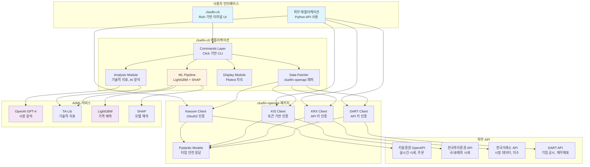
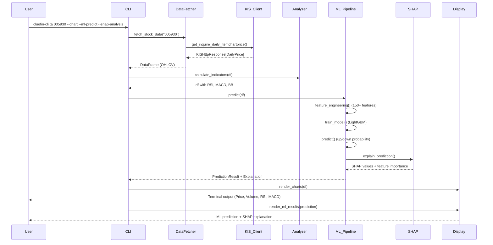
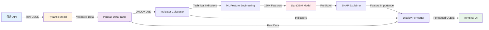
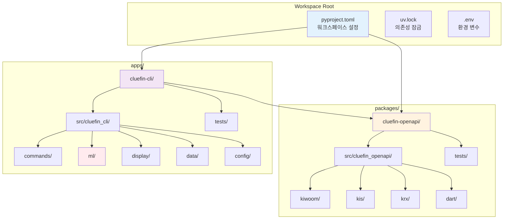

# Cluefin: 한국 금융 투자 도우미

[](https://app.codacy.com/gh/kgcrom/cluefin/dashboard)
[](https://app.codacy.com/gh/kgcrom/cluefin/dashboard)
[](https://github.com/kgcrom/cluefin/actions/workflows/ci.yml)
[](LICENSE)

> **"Clearly Looking for U Entered Financial Information"**
> 투자자가 금융 의사결정을 분석, 자동화, 최적화할 수 있도록 돕는 파이썬 툴킷

---

## 📑 목차

- [프로젝트 개요](#-프로젝트-개요)
- [기술 아키텍처](#-기술-아키텍처)
- [프로젝트 구조](#-프로젝트-구조)
- [설치 및 설정](#-설치-및-설정)
- [사용 가이드](#-사용-가이드)
- [개발 지침](#-개발-지침)
- [추가 정보](#-추가-정보)

---

## 🎯 프로젝트 개요

### 목적과 기능

Cluefin은 한국 금융 시장에 특화된 오픈소스 투자 분석 플랫폼입니다. 여러 금융 OpenAPI를 통합하여 실시간 시세 조회, 기술적 분석, AI 기반 인사이트, 머신러닝 예측을 제공합니다.

### 문제 정의

한국 투자자들이 직면하는 주요 문제점:

1. **분산된 데이터 소스**: 키움증권, 한국투자증권, 한국거래소, DART 등 여러 API를 개별적으로 통합해야 함
2. **복잡한 API 인증**: 각 금융사마다 다른 인증 방식 (OAuth2, 토큰 기반, 단순 API 키)
3. **타입 안전성 부족**: 금융 API 응답의 런타임 검증 부재로 인한 버그 발생
4. **분석 도구 부족**: 기술적 지표, ML 예측, AI 분석을 통합한 도구의 부재
5. **한국 시장 특화 기능**: KST 시간대, 6자리 종목 코드, 한글 필드명 처리 필요

### 해결 방법

Cluefin은 다음과 같은 방식으로 문제를 해결합니다:

1. **통합 API 클라이언트** (`cluefin-openapi`)
   - 키움증권, 한국투자증권(KIS), 한국거래소(KRX), DART의 통합 인터페이스
   - Pydantic 기반 타입 안전 응답 모델
   - 자동 토큰 갱신 및 에러 처리

2. **대화형 CLI 도구** (`cluefin-cli`)
   - Rich 기반의 아름다운 터미널 UI
   - 실시간 차트 및 기술적 지표 시각화
   - AI(GPT-4) 기반 시장 분석
   - LightGBM + SHAP 기반 ML 예측

3. **Monorepo 아키텍처**
   - UV 워크스페이스 기반 패키지 관리
   - 공유 의존성 및 일관된 개발 환경
   - 빠른 빌드 및 테스트 실행

### 핵심 기능

#### 📊 데이터 소스 통합

- **키움증권 API**: 실시간 시세, 계좌 관리, 주문 실행
- **한국투자증권 API**: 국내/해외 주식 시세, 계좌 조회, 시장 분석
- **한국거래소 API**: KOSPI/KOSDAQ/KONEX 데이터, 지수, 채권, ETF
- **DART API**: 기업 공시, 재무제표, 대량보유상황

#### 🔍 기술적 분석

- **20+ 기술적 지표**: RSI, MACD, 볼린저 밴드, 스토캐스틱, 이동평균
- **150+ ML 피처**: TA-Lib 기반 고급 기술적 지표
- **터미널 차트**: Plotext 기반 ASCII 차트 렌더링
- **지지/저항 레벨**: 주요 가격대 자동 식별

#### 🤖 AI/ML 기능

- **GPT-4 분석**: 자연어 기반 시장 인사이트 및 거래 추천
- **LightGBM 분류**: 익일 가격 움직임 예측 (상승/하락)
- **SHAP 해석가능성**: 예측 근거 및 피처 중요도 분석
- **시계열 교차검증**: 데이터 누출 방지를 위한 적절한 검증

#### 📈 펀더멘털 분석

- **재무제표**: 대차대조표, 손익계산서, 현금흐름표
- **배당 정보**: 배당률, 배당금, 배당 히스토리
- **주요 주주**: 지분율, 보유 현황
- **기업 공시**: 실시간 공시 조회 및 알림

### 대상 사용자

1. **개인 투자자**
   - 기술적 분석 및 AI 인사이트를 통한 투자 의사결정 지원
   - 실시간 시세 모니터링 및 알림

2. **알고리즘 트레이더**
   - Python 기반 자동 거래 시스템 개발을 위한 API 클라이언트
   - 백테스팅 및 전략 최적화

3. **금융 데이터 분석가**
   - 한국 금융 시장 데이터 수집 및 분석
   - 머신러닝 모델 개발 및 연구

4. **핀테크 개발자**
   - 금융 애플리케이션 개발을 위한 통합 API 클라이언트
   - 타입 안전한 금융 데이터 처리

### 사용 사례

#### 사례 1: 일일 주식 분석 루틴

```bash
# 삼성전자 종합 분석 (차트 + AI + ML)
cluefin-cli ta 005930 --chart --ai-analysis --ml-predict --shap-analysis
```

**결과**:
- 실시간 주가 및 거래량
- RSI, MACD, 볼린저 밴드 등 기술적 지표
- 터미널 차트 시각화
- GPT-4 기반 시장 분석 및 거래 추천
- LightGBM 기반 익일 가격 예측 (확률 포함)
- SHAP 기반 예측 근거 설명

#### 사례 2: 펀더멘털 분석

```bash
# SK하이닉스 2023년 사업보고서 기반 펀더멘털 분석
cluefin-cli fa 000660 --year 2023 --report annual --max-shareholders 5
```

**결과**:
- 재무제표 주요 지표 (매출, 영업이익, 당기순이익)
- 배당 정보
- 주요 주주 현황 (상위 5명)
- 부채비율, ROE, PER, PBR

#### 사례 3: 프로그래매틱 API 사용

```python
from cluefin_openapi.kis._client import Client as KISClient
from cluefin_openapi.kis._auth import Auth
import os

# 인증 및 클라이언트 초기화
auth = Auth(
    app_key=os.getenv("KIS_APP_KEY"),
    secret_key=os.getenv("KIS_SECRET_KEY"),
    env="dev"
)
token = auth.generate()
client = KISClient(
    app_key=os.getenv("KIS_APP_KEY"),
    secret_key=os.getenv("KIS_SECRET_KEY"),
    token=token,
    env="dev"
)

# 삼성전자 현재가 조회
price = client.domestic_basic_quote.get_inquire_price(
    fid_cond_mrkt_div_code="J",
    fid_input_iscd="005930"
)
print(f"삼성전자 현재가: {price.body.output.stck_prpr}원")
```

---

## 🏗 기술 아키텍처

### 고수준 시스템 아키텍처



### 기술 스택

#### 핵심 프레임워크

| 카테고리 | 기술 | 버전 | 용도 |
|---------|------|------|------|
| **패키지 관리** | UV | latest | Rust 기반 초고속 Python 패키지 관리자 |
| **데이터 검증** | Pydantic | 2.11.7 | 타입 안전 데이터 모델 및 설정 관리 |
| **HTTP 클라이언트** | Requests | 2.32+ | REST API 통신 |
| **CLI 프레임워크** | Click | 8.1+ | 명령줄 인터페이스 구축 |
| **터미널 UI** | Rich | 13.7+ | 아름다운 터미널 출력 및 프로그레스 바 |
| **로깅** | Loguru | 0.7+ | 구조화된 로깅 및 디버깅 |

#### 데이터 분석 및 ML

| 카테고리 | 기술 | 버전 | 용도 |
|---------|------|------|------|
| **데이터 처리** | Pandas | 2.0+ | 시계열 데이터 처리 및 분석 |
| **수치 연산** | NumPy | 1.24+ | 고성능 배열 연산 |
| **기술적 지표** | TA-Lib | 0.4.25+ | 150+ 금융 기술적 지표 |
| **머신러닝** | LightGBM | 4.0+ | 그래디언트 부스팅 분류기 |
| **ML 평가** | Scikit-learn | 1.3+ | 모델 평가 및 교차검증 |
| **불균형 처리** | Imbalanced-learn | 0.14+ | 클래스 불균형 해결 (SMOTE) |
| **모델 해석** | SHAP | 0.47+ | 모델 예측 해석가능성 |

#### AI 통합

| 카테고리 | 기술 | 버전 | 용도 |
|---------|------|------|------|
| **LLM** | OpenAI | 1.0+ | GPT-4 기반 시장 분석 및 인사이트 |

#### 시각화

| 카테고리 | 기술 | 버전 | 용도 |
|---------|------|------|------|
| **터미널 차트** | Plotext | 5.2+ | ASCII 기반 차트 렌더링 (가격, 거래량, RSI, MACD) |

#### 개발 도구

| 카테고리 | 기술 | 버전 | 용도 |
|---------|------|------|------|
| **린팅/포맷팅** | Ruff | 0.12+ | Rust 기반 초고속 린터 및 포매터 |
| **테스트** | Pytest | 8.4+ | 단위/통합 테스트 프레임워크 |
| **비동기 테스트** | Pytest-asyncio | 0.25+ | 비동기 코드 테스트 |
| **HTTP 모킹** | Requests-mock | 1.12+ | API 응답 모킹 |
| **코드 커버리지** | Coverage | 7.10+ | 테스트 커버리지 측정 |
| **환경 변수** | Python-dotenv | 1.1+ | `.env` 파일 로드 |

### 종속성

#### cluefin-openapi 종속성

```toml
dependencies = [
    "loguru>=0.7.3",      # 구조화된 로깅
    "pydantic>=2.11.7",   # 데이터 검증 및 타입 안전성
    "requests>=2.32.4",   # HTTP 클라이언트
    "defusedxml>=0.7.1",  # 안전한 XML 파싱 (DART API)
]
```

#### cluefin-cli 종속성

```toml
dependencies = [
    "cluefin-openapi",                    # 내부 API 클라이언트
    "click>=8.1.7",                       # CLI 프레임워크
    "rich>=13.7.0",                       # 터미널 UI
    "pandas>=2.0.0",                      # 데이터 처리
    "numpy>=1.24.0",                      # 수치 연산
    "openai>=1.0.0",                      # GPT-4 통합
    "pydantic-settings>=2.0.0",           # 설정 관리
    "plotext>=5.2.8",                     # 터미널 차트
    "loguru>=0.7.3",                      # 로깅
    "pydantic==2.11.7",                   # 데이터 검증
    "lightgbm>=4.0.0,<5.0.0",            # ML 분류기
    "scikit-learn>=1.3.0,<2.0.0",        # ML 평가
    "shap>=0.47.2,<1.0.0",               # 모델 해석
    "TA-Lib>=0.4.25",                     # 기술적 지표
    "imbalanced-learn>=0.14.0",          # 불균형 처리
]
```

### 디자인 패턴

#### 1. 응답 래퍼 패턴 (Response Wrapper Pattern)

모든 API 응답을 구조화된 형태로 래핑하여 일관된 에러 처리 및 연속 조회 지원:

```python
@dataclass
class KiwoomHttpResponse(Generic[T]):
    """키움증권 API 응답 래퍼"""
    headers: KiwoomHttpHeader  # 연속조회키, 메시지 등
    body: T                    # Pydantic 모델로 검증된 응답 데이터

# 사용 예
response: KiwoomHttpResponse[AccountBalance] = client.account.get_inquire_balance()
print(response.headers.rt_cd)  # 응답 코드
print(response.body.output1)   # 계좌 잔고 데이터
```

#### 2. 클라이언트 팩토리 패턴 (Client Factory Pattern)

각 금융 API별로 전용 클라이언트를 생성하여 인증 및 설정 관리:

```python
# 키움증권 클라이언트
kiwoom_client = Client(
    token=kiwoom_token,
    env="prod"  # 또는 "dev"
)

# KIS 클라이언트
kis_client = KISClient(
    app_key=app_key,
    secret_key=secret_key,
    token=kis_token,
    env="dev"
)

# KRX 클라이언트
krx_client = KRXClient(
    auth_key=auth_key,
    timeout=30
)
```

#### 3. Pydantic 모델 기반 타입 안전성

모든 API 응답을 Pydantic 모델로 정의하여 런타임 검증 및 IDE 자동완성 지원:

```python
class InquirePriceOutput(BaseModel):
    """주식 현재가 시세 조회 응답"""
    stck_prpr: str = Field(..., alias="stck_prpr")  # 주식 현재가
    prdy_vrss: str = Field(..., alias="prdy_vrss")  # 전일 대비
    prdy_ctrt: str = Field(..., alias="prdy_ctrt")  # 전일 대비율

    class Config:
        populate_by_name = True  # 한글 필드명과 영어 별칭 모두 지원
```

#### 4. 명령 패턴 (Command Pattern)

Click 기반 CLI 명령을 독립적인 모듈로 분리하여 확장 가능한 구조:

```python
@click.command()
@click.argument('stock_code')
@click.option('--chart', is_flag=True, help='Display terminal charts')
@click.option('--ai-analysis', is_flag=True, help='Include AI analysis')
@click.option('--ml-predict', is_flag=True, help='Include ML prediction')
def ta(stock_code: str, chart: bool, ai_analysis: bool, ml_predict: bool):
    """Technical analysis command"""
    # 명령 실행 로직
```

#### 5. 의존성 주입 (Dependency Injection)

Pydantic Settings를 통한 설정 관리 및 의존성 주입:

```python
class Settings(BaseSettings):
    """애플리케이션 설정"""
    kiwoom_app_key: str = Field(default="", env="KIWOOM_APP_KEY")
    kis_app_key: str = Field(default="", env="KIS_APP_KEY")
    openai_api_key: str = Field(default="", env="OPENAI_API_KEY")

    class Config:
        env_file = ".env"
        env_file_encoding = "utf-8"

settings = Settings()
```

### 아키텍처 결정사항

#### 1. Monorepo 구조 선택

**결정**: UV 워크스페이스 기반 Monorepo

**이유**:
- `cluefin-openapi`와 `cluefin-cli`의 긴밀한 연동
- 공유 의존성 관리 및 일관된 버전 관리
- 빠른 빌드 및 테스트 실행 (UV의 Rust 기반 성능)
- 단일 리포지토리에서 API 클라이언트와 CLI 도구 동시 개발 가능

#### 2. Pydantic 기반 타입 안전성

**결정**: 모든 API 응답을 Pydantic 모델로 정의

**이유**:
- 런타임 데이터 검증으로 버그 조기 발견
- IDE 자동완성 및 타입 힌팅 지원
- 한글 필드명과 영어 별칭 동시 지원 (`Field(alias=...)`)
- JSON 직렬화/역직렬화 자동 처리

#### 3. LightGBM + SHAP 조합

**결정**: 머신러닝 예측에 LightGBM 사용, 해석가능성에 SHAP 사용

**이유**:
- **LightGBM**: 빠른 학습 속도, 적은 메모리 사용, 높은 정확도
- **SHAP**: 모델 예측 근거를 투명하게 설명 (규제 준수)
- 금융 도메인에서 해석가능성은 필수 (투자 의사결정 근거 제공)

#### 4. 터미널 기반 UI (Rich + Plotext)

**결정**: 웹 UI 대신 터미널 기반 UI 선택

**이유**:
- 개발자 및 파워 유저 대상 도구
- 빠른 실행 및 경량 배포 (웹 서버 불필요)
- SSH 원격 접속 환경에서도 사용 가능
- 자동화 스크립트와 쉬운 통합

#### 5. 다중 금융 API 통합

**결정**: 키움증권, KIS, KRX, DART 등 여러 API 통합

**이유**:
- 단일 API로는 한국 금융 시장 전체를 커버할 수 없음
- 각 API의 강점 활용 (키움: 실시간 시세, KRX: 시장 데이터, DART: 펀더멘털)
- 사용자에게 원스톱 솔루션 제공

### 구성 요소 상호작용

#### 시퀀스 다이어그램: 기술적 분석 플로우



#### 데이터 흐름: API → 분석 → 시각화



---

## 📂 프로젝트 구조

### 디렉토리 구조

```
cluefin/
├── packages/                           # 공유 라이브러리
│   └── cluefin-openapi/                # 한국 금융 API 클라이언트
│       ├── src/cluefin_openapi/
│       │   ├── kiwoom/                 # 키움증권 API 클라이언트
│       │   │   ├── _auth.py            # OAuth2 인증
│       │   │   ├── _client.py          # HTTP 클라이언트
│       │   │   ├── _account.py         # 계좌 관련 API
│       │   │   ├── _domestic_quote.py  # 국내 시세 API
│       │   │   ├── _model.py           # Pydantic 응답 모델
│       │   │   └── _exceptions.py      # 예외 처리
│       │   ├── kis/                    # 한국투자증권 API 클라이언트
│       │   │   ├── _auth.py            # 토큰 기반 인증
│       │   │   ├── _client.py          # HTTP 클라이언트
│       │   │   ├── _domestic_basic_quote.py      # 국내 시세
│       │   │   ├── _domestic_account.py          # 국내 계좌
│       │   │   ├── _overseas_basic_quote.py      # 해외 시세
│       │   │   ├── _domestic_market_analysis.py  # 시장 분석
│       │   │   └── _exceptions.py                # 예외 처리
│       │   ├── krx/                    # 한국거래소 API 클라이언트
│       │   │   ├── _client.py          # HTTP 클라이언트
│       │   │   ├── _stock.py           # 주식 시장 데이터
│       │   │   ├── _index.py           # 지수 데이터
│       │   │   ├── _bond.py            # 채권 데이터
│       │   │   ├── _derivatives.py     # 파생상품 데이터
│       │   │   └── _exchange_traded_product.py  # ETF/ETN/ELW
│       │   ├── dart/                   # DART API 클라이언트
│       │   │   ├── _client.py          # HTTP 클라이언트
│       │   │   ├── _public_disclosure.py         # 공시 조회
│       │   │   ├── _periodic_report_financial_statement.py  # 재무제표
│       │   │   ├── _major_shareholder_disclosure.py  # 대량보유상황
│       │   │   └── _exceptions.py      # 예외 처리
│       │   └── __init__.py
│       ├── tests/                      # 테스트 스위트
│       │   ├── kiwoom/
│       │   │   ├── test_*_unit.py      # 단위 테스트 (requests_mock)
│       │   │   └── test_*_integration.py  # 통합 테스트
│       │   ├── kis/
│       │   │   ├── test_*_unit.py
│       │   │   ├── test_*_integration.py
│       │   │   └── *_cases.json        # 테스트 케이스 데이터
│       │   ├── krx/
│       │   │   ├── test_*_unit.py
│       │   │   └── test_*_integration.py
│       │   └── dart/
│       │       ├── test_*_unit.py
│       │       └── test_*_integration.py
│       ├── pyproject.toml              # 패키지 설정 및 의존성
│       └── README.md                   # API 클라이언트 문서
├── apps/                               # 애플리케이션
│   └── cluefin-cli/                    # CLI 도구
│       ├── src/cluefin_cli/
│       │   ├── commands/               # CLI 명령 구현
│       │   │   ├── technical_analysis.py       # 기술적 분석 명령
│       │   │   ├── fundamental_analysis.py     # 펀더멘털 분석 명령
│       │   │   ├── inquiry/                    # 시장 조회 시스템
│       │   │   │   ├── main.py                 # 메인 조회 로직
│       │   │   │   ├── menu_controller.py      # 메뉴 네비게이션
│       │   │   │   ├── stock_info.py           # 개별 종목 정보
│       │   │   │   ├── ranking_info.py         # 종목 랭킹
│       │   │   │   └── sector_info.py          # 섹터 분석
│       │   │   └── analysis/                   # 분석 모듈
│       │   │       ├── indicators.py           # 기술적 지표 계산
│       │   │       └── ai_analyzer.py          # AI 분석 (GPT-4)
│       │   ├── ml/                     # 머신러닝 파이프라인
│       │   │   ├── feature_engineering.py      # 피처 생성 (TA-Lib)
│       │   │   ├── models.py                   # LightGBM 모델
│       │   │   ├── predictor.py                # 예측 파이프라인
│       │   │   ├── explainer.py                # SHAP 해석
│       │   │   └── diagnostics.py              # 모델 평가
│       │   ├── display/                # 터미널 시각화
│       │   │   └── charts.py                   # Plotext 차트
│       │   ├── data/                   # 데이터 레이어
│       │   │   ├── fetcher.py                  # 데이터 수집
│       │   │   └── fundamentals.py             # 펀더멘털 데이터
│       │   ├── config/                 # 설정 관리
│       │   │   └── settings.py                 # Pydantic Settings
│       │   ├── utils/                  # 유틸리티
│       │   │   └── formatters.py               # 한글 포맷팅
│       │   └── main.py                 # CLI 진입점 (Click app)
│       ├── tests/                      # 테스트 스위트
│       │   ├── unit/                   # 단위 테스트
│       │   │   ├── commands/
│       │   │   └── ml/
│       │   └── integration/            # 통합 테스트
│       ├── pyproject.toml              # CLI 설정 및 의존성
│       └── README.md                   # CLI 사용 가이드
├── pyproject.toml                      # 워크스페이스 설정
├── uv.lock                             # 의존성 잠금 파일
├── LICENSE                             # MIT 라이선스
└── README.md                           # 프로젝트 메인 문서
```

### 주요 디렉토리 설명

#### `packages/cluefin-openapi/`

**목적**: 한국 금융 API 통합 클라이언트 라이브러리

**책임**:
- 키움증권, 한국투자증권, 한국거래소, DART API 래핑
- Pydantic 기반 타입 안전 응답 모델 제공
- 인증, 토큰 갱신, 에러 처리 자동화
- 한국 시장 특화 기능 (KST 시간대, 6자리 종목 코드, 한글 필드명)

**설계 근거**:
- **독립적인 패키지**: CLI와 분리하여 다른 프로젝트에서도 재사용 가능
- **모듈별 분리**: 각 API를 독립적인 모듈로 관리하여 유지보수 용이
- **타입 안전성**: Pydantic 모델로 런타임 검증 및 IDE 지원

#### `apps/cluefin-cli/`

**목적**: 대화형 터미널 기반 주식 분석 도구

**책임**:
- Click 기반 CLI 명령 제공 (`ta`, `fa`, `inquiry`)
- Rich 기반 아름다운 터미널 UI
- 기술적 분석 및 AI/ML 예측
- Plotext 기반 터미널 차트 렌더링

**설계 근거**:
- **명령 패턴**: 각 명령을 독립적인 모듈로 분리하여 확장 가능
- **레이어드 아키텍처**: Commands → Analysis/ML → Data → Display
- **의존성 주입**: Pydantic Settings로 설정 관리

### 파일 구성 근거

#### 1. Monorepo 구조

**근거**: `cluefin-openapi`와 `cluefin-cli`는 긴밀하게 연동되므로 단일 리포지토리에서 관리

**장점**:
- 공유 의존성 관리 (uv.lock)
- 일관된 버전 관리
- 동시 개발 및 테스트 용이
- CI/CD 파이프라인 단순화

#### 2. 테스트 전략

**단위 테스트**: `test_*_unit.py`
- Requests-mock을 사용한 API 모킹
- 빠른 실행 속도 (네트워크 I/O 없음)
- 로직 검증

**통합 테스트**: `test_*_integration.py`
- 실제 API 호출 (API 키 필요)
- `@pytest.mark.integration` 마커로 분리
- 종단 간(E2E) 검증

#### 3. 설정 파일 위치

**.env 파일**: 워크스페이스 루트에 위치
- 모든 패키지/앱에서 공유
- 환경 변수 중앙 관리

**pyproject.toml**: 각 패키지/앱별로 독립적인 설정
- 워크스페이스 루트: 공유 개발 의존성 (`[dependency-groups]`)
- 각 패키지: 개별 의존성 및 빌드 설정

### 프로젝트 계층 구조 다이어그램



---

## 🛠 설치 및 설정

### 전제 조건

#### 필수 요구사항

| 항목 | 버전 | 용도 |
|------|------|------|
| **Python** | 3.10+ | 프로젝트 런타임 |
| **UV** | latest | 패키지 관리자 |
| **TA-Lib** | 0.4.25+ | 기술적 지표 계산 (시스템 라이브러리) |
| **LightGBM** | 4.0+ | 머신러닝 예측 (시스템 라이브러리) |

#### 선택 요구사항

| 항목 | 용도 |
|------|------|
| **Git** | 소스 코드 클론 |
| **API 키** | 금융 API 접근 (키움증권, KIS, KRX, DART, OpenAI) |

### 시스템 요구사항

#### macOS

```bash
# Homebrew로 시스템 의존성 설치
brew install ta-lib lightgbm

# UV 설치
curl -LsSf https://astral.sh/uv/install.sh | sh
```

#### Ubuntu/Debian

```bash
# TA-Lib 빌드 및 설치
wget http://prdownloads.sourceforge.net/ta-lib/ta-lib-0.4.0-src.tar.gz
tar -xzf ta-lib-0.4.0-src.tar.gz
cd ta-lib/
./configure --prefix=/usr
make
sudo make install

# LightGBM 설치
sudo apt-get install -y cmake libboost-dev libboost-system-dev libboost-filesystem-dev
git clone --recursive https://github.com/microsoft/LightGBM
cd LightGBM
mkdir build
cd build
cmake ..
make -j4

# UV 설치
curl -LsSf https://astral.sh/uv/install.sh | sh
```

#### Windows

```powershell
# TA-Lib 바이너리 다운로드 및 설치 (Unofficial Windows Binaries)
# https://www.lfd.uci.edu/~gohlke/pythonlibs/#ta-lib

# LightGBM (pip로 자동 설치됨)

# UV 설치
powershell -c "irm https://astral.sh/uv/install.ps1 | iex"
```

### 단계별 설치 가이드

#### 1. 리포지토리 클론

```bash
# GitHub에서 클론
git clone https://github.com/kgcrom/cluefin.git
cd cluefin
```

#### 2. Python 가상환경 생성

```bash
# Python 3.10 기반 가상환경 생성
uv venv --python 3.10

# 가상환경 활성화
# macOS/Linux
source .venv/bin/activate

# Windows
.venv\Scripts\activate
```

#### 3. 워크스페이스 의존성 설치

```bash
# 모든 패키지 의존성 설치
uv sync --all-packages

# 개발 의존성 포함
uv sync --all-packages --dev
```

**설치되는 내용**:
- `cluefin-openapi` 패키지 및 의존성
- `cluefin-cli` 애플리케이션 및 의존성
- 개발 도구 (pytest, ruff, coverage 등)

#### 4. 설치 확인

```bash
# CLI 버전 확인
cluefin-cli --help

# Python 패키지 확인
python -c "import cluefin_openapi; print('cluefin-openapi:', cluefin_openapi.__version__)"
python -c "import cluefin_cli; print('cluefin-cli installed')"
```

### 구성 지침

#### 1. 환경 변수 설정

```bash
# 샘플 .env 파일 복사
cp apps/cluefin-cli/.env.sample .env

# .env 파일 편집
vim .env  # 또는 nano, VS Code 등
```

#### 2. .env 파일 구성

```env
# ========================================
# 키움증권 API 설정
# ========================================
# API 포털: https://apiportal.kiwoom.com/
KIWOOM_APP_KEY=your_kiwoom_app_key_here
KIWOOM_SECRET_KEY=your_kiwoom_secret_key_here
KIWOOM_ENV=prod  # options: prod (운영), dev (개발/모의투자)

# ========================================
# 한국투자증권 API 설정
# ========================================
# API 포털: https://apiportal.koreainvestment.com/
KIS_APP_KEY=your_kis_app_key_here
KIS_SECRET_KEY=your_kis_secret_key_here
KIS_ENV=dev  # options: prod (운영), dev (모의투자)

# ========================================
# 한국거래소 OpenAPI 설정
# ========================================
# API 포털: http://openapi.krx.co.kr/
KRX_AUTH_KEY=your_krx_auth_key_here

# ========================================
# 금융감독원 DART API 설정
# ========================================
# API 포털: https://opendart.fss.or.kr/
DART_AUTH_KEY=your_dart_auth_key_here

# ========================================
# OpenAI API 설정 (AI 분석용)
# ========================================
# API 포털: https://platform.openai.com/api-keys
OPENAI_API_KEY=your_openai_api_key_here

# ========================================
# 머신러닝 설정 (선택)
# ========================================
ML_MODEL_PATH=models/  # ML 모델 저장 경로
ML_CACHE_DIR=.ml_cache/  # 피처 캐시 디렉토리
```

#### 3. API 키 발급 가이드

##### 키움증권 API 키 발급

1. [키움증권 OpenAPI 포털](https://apiportal.kiwoom.com/) 접속
2. 회원가입 및 로그인
3. **API 신청** → **앱 등록** → APP_KEY 및 SECRET_KEY 발급
4. **개발환경** 또는 **운영환경** 선택 (운영환경은 실계좌 필요)

##### 한국투자증권 API 키 발급

1. [한국투자증권 OpenAPI 포털](https://apiportal.koreainvestment.com/) 접속
2. 회원가입 및 로그인
3. **API 신청** → **앱 등록** → APP_KEY 및 SECRET_KEY 발급
4. **모의투자** 또는 **실전투자** 선택

##### 한국거래소 OpenAPI 인증키 발급

1. [한국거래소 OpenAPI 포털](http://openapi.krx.co.kr/) 접속
2. 회원가입 및 로그인
3. **인증키 신청** → 승인 대기 (1~2일 소요)
4. 사용할 API마다 **API 사용 신청** 필요

##### DART API 키 발급

1. [DART OpenAPI 포털](https://opendart.fss.or.kr/) 접속
2. 회원가입 및 로그인
3. **인증키 신청** → 즉시 발급

##### OpenAI API 키 발급

1. [OpenAI Platform](https://platform.openai.com/) 접속
2. 회원가입 및 로그인
3. **API Keys** → **Create new secret key**
4. 사용량 기반 과금 (GPT-4 사용 시 유료)

### 일반적인 문제 해결

#### 문제 1: TA-Lib 설치 실패

**증상**:
```
ERROR: Could not find a version that satisfies the requirement TA-Lib
```

**해결 방법**:

macOS:
```bash
brew install ta-lib
pip install TA-Lib
```

Ubuntu/Debian:
```bash
# TA-Lib 소스 컴파일 (위의 시스템 요구사항 참조)
```

Windows:
```bash
# Unofficial Windows Binaries 다운로드
pip install https://github.com/cgohlke/talib-build/releases/download/v0.4.29/TA_Lib-0.4.29-cp310-cp310-win_amd64.whl
```

#### 문제 2: LightGBM 설치 실패

**증상**:
```
ERROR: Failed building wheel for lightgbm
```

**해결 방법**:

macOS:
```bash
brew install lightgbm
pip install lightgbm --no-binary lightgbm
```

Ubuntu/Debian:
```bash
sudo apt-get install -y cmake libboost-dev
pip install lightgbm --install-option=--nomp
```

#### 문제 3: API 키 인증 실패

**증상**:
```
KiwoomAPIError: 40080000 - 토큰 만료
```

**해결 방법**:

1. `.env` 파일의 API 키 확인
2. 키 유효성 확인 (키움/KIS 포털에서 확인)
3. `KIWOOM_ENV` 또는 `KIS_ENV` 설정 확인 (prod/dev)
4. 토큰 재생성:

```python
from cluefin_openapi.kiwoom._auth import Auth
auth = Auth(app_key="...", secret_key="...", env="prod")
token = auth.generate_token()
print(token.get_token())
```

#### 문제 4: 파이썬 버전 불일치

**증상**:
```
ERROR: Python 3.9 is not supported
```

**해결 방법**:

```bash
# pyenv로 Python 3.10 설치 (macOS/Linux)
pyenv install 3.10
pyenv local 3.10

# UV로 가상환경 재생성
uv venv --python 3.10
source .venv/bin/activate
uv sync --all-packages
```

#### 문제 5: 모듈을 찾을 수 없음

**증상**:
```
ModuleNotFoundError: No module named 'cluefin_openapi'
```

**해결 방법**:

```bash
# 워크스페이스 의존성 재설치
uv sync --all-packages

# 개발 모드로 패키지 설치 확인
pip list | grep cluefin
```

---

## 📚 사용 가이드

### 기본 사용 예제

#### 예제 1: 기본 기술적 분석

```bash
# 삼성전자 기술적 분석
cluefin-cli ta 005930
```

**출력**:
```
┌─────────────────────────────────────────────────┐
│ 삼성전자 (005930) - 2025-10-19 14:30:00        │
├─────────────────────────────────────────────────┤
│ 현재가: 64,775원                                │
│ 전일대비: -1,300원 (-1.97%)                     │
│ 거래량: 7,544,353주                             │
│ 거래대금: 488,123백만원                         │
└─────────────────────────────────────────────────┘

기술적 지표
┌──────────────┬──────────┬──────────────┐
│ 지표         │ 값       │ 신호         │
├──────────────┼──────────┼──────────────┤
│ RSI (14)     │ 57.60    │ 중립         │
│ MACD         │ 429.71   │ 강세         │
│ 이동평균선   │ 63,110   │ MA20 위      │
│ 볼린저밴드   │ 중간     │ 중립         │
└──────────────┴──────────┴──────────────┘
```

#### 예제 2: 차트와 함께 분석

```bash
# SK하이닉스 차트 표시
cluefin-cli ta 000660 --chart
```

**출력**: 가격 차트, 거래량 차트, RSI 오실레이터, MACD 히스토그램

#### 예제 3: AI 분석 포함

```bash
# 네이버 AI 분석
cluefin-cli ta 035420 --ai-analysis
```

**AI 분석 출력 예시**:
```
🤖 AI 시장 분석 (GPT-4)

📊 기술적 분석 요약:
- RSI가 57.60으로 중립 구간에 있으며, 과매수/과매도 신호는 없습니다.
- MACD가 양수(+429.71)로 단기 상승 모멘텀이 있습니다.
- 현재가가 20일 이동평균선(63,110원) 위에 위치하여 단기 추세는 강세입니다.

💡 투자 인사이트:
- 단기적으로 상승 모멘텀이 유지되고 있으나, 거래량 감소로 추세 약화 가능성이 있습니다.
- 65,000원 근처가 저항선으로 작용할 수 있으니 주의가 필요합니다.
- 지지선은 63,000원 근처에 형성되어 있습니다.

⚠️ 리스크:
- 외국인 순매도가 지속되고 있어 단기 변동성이 높을 수 있습니다.
```

#### 예제 4: 머신러닝 예측

```bash
# 삼성전자 ML 예측
cluefin-cli ta 005930 --ml-predict --shap-analysis
```

**ML 예측 출력 예시**:
```
🤖 머신러닝 예측 결과

┌─────────────────────────────────────────────────┐
│ 예측 신호: 📈 매수 (67.3%)                     │
│ 신뢰도: 67.3%                                   │
│ 상승 확률: 67.3%                                │
│ 하락 확률: 32.7%                                │
└─────────────────────────────────────────────────┘

📊 모델 성능
┌─────────────────────────────────────────────────┐
│ 검증 정확도: 64.2%                              │
│ F1-Score: 0.638                                 │
│ AUC: 0.721                                      │
└─────────────────────────────────────────────────┘

🔍 주요 피처 중요도 (SHAP)
┌──────┬─────────────────────┬────────────┬────────────┐
│ 순위 │ 피처                │ 중요도     │ 영향       │
├──────┼─────────────────────┼────────────┼────────────┤
│  1   │ rsi_14              │   0.0234   │ 📈 상승    │
│  2   │ macd_signal         │   0.0198   │ 📉 하락    │
│  3   │ bb_position         │   0.0167   │ 📈 상승    │
│  4   │ volume_ratio        │   0.0142   │ 📈 상승    │
│  5   │ sma_20              │   0.0134   │ 📉 하락    │
└──────┴─────────────────────┴────────────┴────────────┘
```

#### 예제 5: 펀더멘털 분석

```bash
# LG화학 펀더멘털 분석
cluefin-cli fa 051910 --year 2023 --report annual --max-shareholders 5
```

**출력 예시**:
```
📘 LG화학 (051910) 펀더멘털 분석
사업연도: 2023 | 보고서: 사업보고서

재무 정보
┌─────────────────┬──────────────────┐
│ 매출액          │ 52조 3,450억원  │
│ 영업이익        │ 3조 2,100억원   │
│ 당기순이익      │ 2조 1,450억원   │
│ 자산총계        │ 45조 6,780억원  │
│ 부채총계        │ 15조 2,340억원  │
│ 자본총계        │ 30조 4,440억원  │
└─────────────────┴──────────────────┘

재무 비율
┌─────────────────┬──────────────────┐
│ ROE             │ 7.05%            │
│ ROA             │ 4.69%            │
│ 부채비율        │ 50.03%           │
│ 유동비율        │ 165.23%          │
└─────────────────┴──────────────────┘

주요 주주 (상위 5명)
┌──────┬──────────────────┬──────────────┬──────────┐
│ 순위 │ 주주명           │ 보유주식수   │ 지분율   │
├──────┼──────────────────┼──────────────┼──────────┤
│  1   │ 국민연금공단     │ 5,234,567주  │ 7.45%    │
│  2   │ LG              │ 3,456,789주  │ 4.92%    │
│  3   │ 블랙록          │ 2,345,678주  │ 3.34%    │
│  4   │ 삼성생명        │ 1,234,567주  │ 1.76%    │
│  5   │ 신한은행        │ 987,654주    │ 1.41%    │
└──────┴──────────────────┴──────────────┴──────────┘
```

### 코드 스니펫

#### 스니펫 1: 키움증권 API 사용

```python
import os
from pydantic import SecretStr
from cluefin_openapi.kiwoom._auth import Auth
from cluefin_openapi.kiwoom._client import Client
from dotenv import load_dotenv

# 환경 변수 로드
load_dotenv()

# 인증
auth = Auth(
    app_key=os.getenv("KIWOOM_APP_KEY"),
    secret_key=SecretStr(os.getenv("KIWOOM_SECRET_KEY")),
    env="prod"  # "dev" 또는 "prod"
)

# 토큰 생성
token = auth.generate_token()
print(f"토큰: {token.get_token()}")

# 클라이언트 초기화
client = Client(token=token.get_token(), env="prod")

# 삼성전자 일별 실현손익 조회
response = client.account.get_daily_stock_realized_profit_loss_by_date(
    "005930",  # 종목 코드
    "20250630"  # 조회 날짜 (YYYYMMDD)
)

print(f"응답 코드: {response.headers.rt_cd}")
print(f"응답 메시지: {response.headers.msg1}")
print(f"데이터: {response.body}")
```

#### 스니펫 2: 한국투자증권 API 사용

```python
import os
from pydantic import SecretStr
from cluefin_openapi.kis._auth import Auth
from cluefin_openapi.kis._client import Client as KISClient
from dotenv import load_dotenv

# 환경 변수 로드
load_dotenv()

# 인증
auth = Auth(
    app_key=os.getenv("KIS_APP_KEY"),
    secret_key=SecretStr(os.getenv("KIS_SECRET_KEY")),
    env="dev"
)

# 토큰 생성
token = auth.generate()

# 클라이언트 초기화
client = KISClient(
    app_key=os.getenv("KIS_APP_KEY"),
    secret_key=SecretStr(os.getenv("KIS_SECRET_KEY")),
    token=token,
    env="dev"
)

# 삼성전자 현재가 조회
response = client.domestic_basic_quote.get_inquire_price(
    fid_cond_mrkt_div_code="J",  # 시장 분류 (J: 주식)
    fid_input_iscd="005930"  # 종목 코드
)

print(f"종목명: {response.output.hts_kor_isnm}")
print(f"현재가: {response.output.stck_prpr}원")
print(f"전일대비: {response.output.prdy_vrss}원 ({response.output.prdy_ctrt}%)")
print(f"거래량: {response.output.acml_vol}주")
```

#### 스니펫 3: 한국거래소 API 사용

```python
import os
from cluefin_openapi.krx._client import Client as KRXClient
from dotenv import load_dotenv

# 환경 변수 로드
load_dotenv()

# 클라이언트 초기화
client = KRXClient(
    auth_key=os.getenv("KRX_AUTH_KEY"),
    timeout=30
)

# KOSPI 일별매매정보 조회
response = client.stock.get_kospi("20251019")

print(f"조회 건수: {len(response.body.OutBlock_1)}")
for stock in response.body.OutBlock_1[:5]:  # 상위 5개만 출력
    print(f"{stock.isu_abbrv}: {stock.tdd_clsprc}원 ({stock.cmpprevdd_prc})")

# KRX 종합지수 조회
index_response = client.index.get_krx("20251019")
print(f"KRX 지수: {index_response.body.OutBlock_1[0].clsprc}")
```

#### 스니펫 4: DART API 사용

```python
import os
from cluefin_openapi.dart._client import Client as DARTClient
from dotenv import load_dotenv

# 환경 변수 로드
load_dotenv()

# 클라이언트 초기화
client = DARTClient(auth_key=os.getenv("DART_AUTH_KEY"))

# 삼성전자 최근 공시 조회
response = client.public_disclosure.get_list(
    corp_code="00126380",  # 삼성전자 고유번호
    bgn_de="20250101",
    end_de="20251231",
    pblntf_ty="A"  # 정기공시
)

print(f"공시 건수: {response.total_count}")
for disclosure in response.list[:5]:  # 최근 5건
    print(f"{disclosure.report_nm} - {disclosure.rcept_dt}")
```

#### 스니펫 5: 기술적 지표 계산

```python
import pandas as pd
from cluefin_cli.commands.analysis.indicators import TechnicalIndicators

# 예시 OHLCV 데이터
data = {
    'open': [64000, 64500, 64200, 64700, 64900],
    'high': [64800, 64900, 64600, 65100, 65200],
    'low': [63900, 64300, 64100, 64600, 64700],
    'close': [64500, 64400, 64500, 64900, 65000],
    'volume': [1000000, 1200000, 1100000, 1300000, 1400000]
}
df = pd.DataFrame(data)

# 기술적 지표 계산
indicators = TechnicalIndicators.calculate_all(df)

print(f"RSI: {indicators['rsi'].iloc[-1]:.2f}")
print(f"MACD: {indicators['macd'].iloc[-1]:.2f}")
print(f"볼린저 상단: {indicators['bb_upper'].iloc[-1]:.2f}")
print(f"볼린저 하단: {indicators['bb_lower'].iloc[-1]:.2f}")
```

### 고급 기능

#### 고급 1: 사용자 정의 ML 피처 추가

```python
from cluefin_cli.ml.feature_engineering import FeatureEngineer
import pandas as pd

# 기존 피처 엔지니어링
engineer = FeatureEngineer()
df = pd.read_csv("stock_data.csv")
df_features = engineer.create_features(df)

# 사용자 정의 피처 추가
def custom_momentum_feature(df):
    """사용자 정의 모멘텀 지표"""
    return (df['close'] - df['close'].shift(10)) / df['close'].shift(10) * 100

df_features['custom_momentum'] = custom_momentum_feature(df)

# ML 모델 학습
from cluefin_cli.ml.models import StockPredictor

predictor = StockPredictor()
predictor.train(df_features)
```

#### 고급 2: 대량 종목 분석

```python
import asyncio
from cluefin_openapi.kis._client import Client as KISClient

async def analyze_multiple_stocks(stock_codes: list):
    """여러 종목 동시 분석"""
    client = KISClient(...)  # 클라이언트 초기화

    tasks = []
    for code in stock_codes:
        task = asyncio.create_task(
            client.domestic_basic_quote.get_inquire_price(
                fid_cond_mrkt_div_code="J",
                fid_input_iscd=code
            )
        )
        tasks.append(task)

    results = await asyncio.gather(*tasks)
    return results

# 사용 예
stock_codes = ["005930", "000660", "035420", "051910"]
results = asyncio.run(analyze_multiple_stocks(stock_codes))

for code, result in zip(stock_codes, results):
    print(f"{code}: {result.output.stck_prpr}원")
```

#### 고급 3: 실시간 알림 시스템

```python
import time
from cluefin_openapi.kis._client import Client as KISClient

def price_alert(stock_code: str, target_price: float):
    """가격 알림 시스템"""
    client = KISClient(...)  # 클라이언트 초기화

    while True:
        response = client.domestic_basic_quote.get_inquire_price(
            fid_cond_mrkt_div_code="J",
            fid_input_iscd=stock_code
        )

        current_price = float(response.output.stck_prpr)

        if current_price >= target_price:
            print(f"🚨 알림: {stock_code} 가격이 {current_price}원에 도달했습니다!")
            break

        time.sleep(60)  # 1분마다 확인

# 사용 예
price_alert("005930", 70000)  # 삼성전자가 70,000원에 도달하면 알림
```

### 구성 옵션

#### 옵션 1: ML 모델 설정

```python
# apps/cluefin-cli/src/cluefin_cli/config/settings.py
from pydantic_settings import BaseSettings

class Settings(BaseSettings):
    # ML 설정
    ml_model_path: str = "models/"
    ml_cache_dir: str = ".ml_cache/"
    ml_min_train_days: int = 30  # 최소 학습 데이터 일수
    ml_test_size: float = 0.2  # 테스트 데이터 비율
    ml_random_state: int = 42  # 재현성을 위한 랜덤 시드

    # LightGBM 하이퍼파라미터
    lgbm_num_leaves: int = 31
    lgbm_max_depth: int = -1
    lgbm_learning_rate: float = 0.05
    lgbm_n_estimators: int = 100

    class Config:
        env_file = ".env"
```

#### 옵션 2: 로깅 설정

```python
from loguru import logger

# 로그 파일 설정
logger.add(
    "logs/cluefin_{time}.log",
    rotation="10 MB",  # 10MB마다 로테이션
    retention="7 days",  # 7일 후 삭제
    level="INFO",
    format="{time:YYYY-MM-DD HH:mm:ss} | {level} | {message}"
)

# 민감 정보 마스킹
logger.add(
    lambda msg: print(msg.replace(os.getenv("KIWOOM_SECRET_KEY"), "***SECRET***"))
)
```

### API 문서

#### API 1: cluefin-openapi 주요 클래스

##### KiwoomClient

```python
class Client:
    """키움증권 API 클라이언트"""

    def __init__(self, token: str, env: Literal["prod", "dev"]):
        """
        Args:
            token: OAuth2 액세스 토큰
            env: 환경 설정 ("prod" 또는 "dev")
        """
        pass

    @property
    def account(self) -> Account:
        """계좌 관련 API 접근"""
        pass

    @property
    def domestic_quote(self) -> DomesticQuote:
        """국내 시세 API 접근"""
        pass
```

##### KISClient

```python
class Client:
    """한국투자증권 API 클라이언트"""

    def __init__(
        self,
        app_key: str,
        secret_key: SecretStr,
        token: str,
        env: Literal["prod", "dev"]
    ):
        """
        Args:
            app_key: API 앱 키
            secret_key: API 시크릿 키
            token: 액세스 토큰
            env: 환경 설정 ("prod" 또는 "dev")
        """
        pass

    @property
    def domestic_basic_quote(self) -> DomesticBasicQuote:
        """국내 기본 시세 API"""
        pass

    @property
    def domestic_account(self) -> DomesticAccount:
        """국내 계좌 API"""
        pass

    @property
    def overseas_basic_quote(self) -> OverseasBasicQuote:
        """해외 기본 시세 API"""
        pass
```

##### KRXClient

```python
class Client:
    """한국거래소 API 클라이언트"""

    def __init__(self, auth_key: str, timeout: int = 30):
        """
        Args:
            auth_key: KRX API 인증키
            timeout: HTTP 요청 타임아웃 (초)
        """
        pass

    @property
    def stock(self) -> Stock:
        """주식 시장 데이터 API"""
        pass

    @property
    def index(self) -> Index:
        """지수 데이터 API"""
        pass

    @property
    def bond(self) -> Bond:
        """채권 데이터 API"""
        pass
```

### 명령줄 인터페이스 참조

#### 명령: `cluefin-cli ta`

**구문**:
```bash
cluefin-cli ta [OPTIONS] STOCK_CODE
```

**인수**:
- `STOCK_CODE` (필수): 한국 주식 코드 (6자리, 예: `005930`)

**옵션**:
- `-c, --chart`: 터미널 차트 표시
- `-a, --ai-analysis`: AI 기반 분석 포함 (OpenAI API 키 필요)
- `-m, --ml-predict`: ML 기반 가격 예측 포함
- `-f, --feature-importance`: 피처 중요도 표시 (`--ml-predict` 필요)
- `-s, --shap-analysis`: SHAP 분석 표시 (`--ml-predict` 필요)
- `--help`: 도움말 표시

**예제**:
```bash
# 기본 분석
cluefin-cli ta 005930

# 모든 기능 포함
cluefin-cli ta 005930 --chart --ai-analysis --ml-predict --shap-analysis
```

#### 명령: `cluefin-cli fa`

**구문**:
```bash
cluefin-cli fa [OPTIONS] STOCK_CODE
```

**인수**:
- `STOCK_CODE` (필수): 한국 주식 코드 (6자리)

**옵션**:
- `--year INTEGER`: 조회할 사업연도 (기본값: 전년도)
- `--report TEXT`: 공시 보고서 구분 (`annual`, `q1`, `half`, `q3`)
- `--max-shareholders INTEGER`: 출력할 주요 주주 수 (기본값: 5)
- `--help`: 도움말 표시

**예제**:
```bash
# 2023년 사업보고서 기반 분석
cluefin-cli fa 005930 --year 2023 --report annual

# 상위 3명의 주요 주주만 표시
cluefin-cli fa 005930 --max-shareholders 3
```

---

## 🛠 개발 지침

### 개발 환경 설정

#### 1. 리포지토리 클론 및 설정

```bash
# 리포지토리 클론
git clone https://github.com/kgcrom/cluefin.git
cd cluefin

# Python 3.10 가상환경 생성
uv venv --python 3.10
source .venv/bin/activate

# 모든 의존성 설치 (개발 도구 포함)
uv sync --all-packages --dev
```

#### 2. IDE 설정 (VS Code 예시)

**`.vscode/settings.json`**:
```json
{
  "python.defaultInterpreterPath": "${workspaceFolder}/.venv/bin/python",
  "python.linting.enabled": true,
  "python.linting.ruffEnabled": true,
  "python.formatting.provider": "none",
  "[python]": {
    "editor.formatOnSave": true,
    "editor.defaultFormatter": "charliermarsh.ruff"
  },
  "python.testing.pytestEnabled": true,
  "python.testing.pytestArgs": [
    "-v",
    "-m",
    "not integration"
  ]
}
```

**`.vscode/extensions.json`**:
```json
{
  "recommendations": [
    "charliermarsh.ruff",
    "ms-python.python",
    "ms-python.vscode-pylance"
  ]
}
```

#### 3. Pre-commit 훅 설정 (선택)

```bash
# pre-commit 설치
pip install pre-commit

# 훅 설치
pre-commit install
```

**`.pre-commit-config.yaml`**:
```yaml
repos:
  - repo: https://github.com/astral-sh/ruff-pre-commit
    rev: v0.12.3
    hooks:
      - id: ruff
        args: [--fix]
      - id: ruff-format
```

### 코드 스타일 및 규칙

#### Ruff 설정 (`pyproject.toml`)

```toml
[tool.ruff]
line-length = 120
fix = true
target-version = "py311"
extend-exclude = ["*.json"]

[tool.ruff.format]
docstring-code-format = true

[tool.ruff.lint]
select = ["E", "F", "W", "B", "Q", "I", "ASYNC", "T20"]
ignore = ["F401", "E501"]
```

#### 코드 스타일 가이드

1. **명명 규칙**:
   - 클래스: `PascalCase` (예: `KiwoomClient`)
   - 함수/변수: `snake_case` (예: `get_inquire_price`)
   - 상수: `UPPER_SNAKE_CASE` (예: `MAX_RETRY_COUNT`)
   - Private 메서드: `_leading_underscore` (예: `_validate_token`)

2. **Docstring 규칙**:
```python
def get_inquire_price(
    self,
    fid_cond_mrkt_div_code: str,
    fid_input_iscd: str
) -> KISHttpResponse[InquirePriceOutput]:
    """주식 현재가 시세 조회

    Args:
        fid_cond_mrkt_div_code: 시장 분류 코드 (J: 주식, ETF 등)
        fid_input_iscd: 종목 코드 (6자리)

    Returns:
        KISHttpResponse[InquirePriceOutput]: 현재가 시세 정보

    Raises:
        KISAPIError: API 호출 실패 시

    Example:
        >>> client.domestic_basic_quote.get_inquire_price("J", "005930")
        KISHttpResponse(output=InquirePriceOutput(...))
    """
    pass
```

3. **타입 힌팅**:
```python
from typing import Optional, List, Dict, Any

def fetch_stock_data(
    stock_code: str,
    start_date: Optional[str] = None,
    end_date: Optional[str] = None
) -> List[Dict[str, Any]]:
    """모든 함수에 타입 힌팅 필수"""
    pass
```

### 테스트 절차 및 커버리지

#### 1. 테스트 실행

```bash
# 모든 테스트 실행
uv run pytest

# 단위 테스트만 실행 (통합 테스트 제외)
uv run pytest -m "not integration"

# 통합 테스트만 실행 (API 키 필요)
uv run pytest -m "integration"

# 특정 패키지 테스트
uv run pytest packages/cluefin-openapi/tests/ -v

# 특정 테스트 파일
uv run pytest packages/cluefin-openapi/tests/kis/test_auth_unit.py -v

# 특정 테스트 케이스
uv run pytest packages/cluefin-openapi/tests/kis/test_auth_unit.py::test_generate_token -v
```

#### 2. 코드 커버리지

```bash
# 커버리지 측정
uv run pytest --cov=cluefin_openapi --cov=cluefin_cli --cov-report=html

# 브라우저에서 리포트 보기
open htmlcov/index.html
```

#### 3. 테스트 작성 가이드

**단위 테스트 예시** (`test_*_unit.py`):
```python
import pytest
import requests_mock
from cluefin_openapi.kis._client import Client

def test_get_inquire_price_success():
    """현재가 조회 성공 테스트"""
    with requests_mock.Mocker() as m:
        # API 응답 모킹
        m.post(
            "https://openapi.koreainvestment.com:9443/uapi/domestic-stock/v1/quotations/inquire-price",
            json={
                "output": {
                    "stck_prpr": "64775",
                    "prdy_vrss": "-1300",
                    "prdy_ctrt": "-1.97"
                }
            }
        )

        # 테스트 실행
        client = Client(...)
        response = client.domestic_basic_quote.get_inquire_price("J", "005930")

        # 검증
        assert response.output.stck_prpr == "64775"
        assert response.output.prdy_vrss == "-1300"
```

**통합 테스트 예시** (`test_*_integration.py`):
```python
import pytest
import os
from cluefin_openapi.kis._client import Client

@pytest.mark.integration
def test_get_inquire_price_integration():
    """현재가 조회 통합 테스트 (실제 API 호출)"""
    # API 키 확인
    assert os.getenv("KIS_APP_KEY"), "KIS_APP_KEY 환경 변수 필요"

    # 클라이언트 초기화
    client = Client(
        app_key=os.getenv("KIS_APP_KEY"),
        secret_key=os.getenv("KIS_SECRET_KEY"),
        token=os.getenv("KIS_TOKEN"),
        env="dev"
    )

    # 실제 API 호출
    response = client.domestic_basic_quote.get_inquire_price("J", "005930")

    # 검증
    assert response.output.stck_prpr is not None
    assert int(response.output.stck_prpr) > 0
```

### 기여 가이드라인

#### 1. 브랜치 전략

- `main`: 안정 버전
- `develop`: 개발 브랜치
- `feature/*`: 새 기능 개발
- `bugfix/*`: 버그 수정
- `hotfix/*`: 긴급 수정

```bash
# Feature 브랜치 생성
git checkout -b feature/add-ml-prediction develop

# 작업 후 커밋
git add .
git commit -m "feat: Add ML prediction with LightGBM"

# Develop에 병합
git checkout develop
git merge --no-ff feature/add-ml-prediction
```

#### 2. 커밋 메시지 규칙

[Conventional Commits](https://www.conventionalcommits.org/) 규칙 준수:

```
<타입>(<범위>): <제목>

<본문>

<푸터>
```

**타입**:
- `feat`: 새 기능
- `fix`: 버그 수정
- `docs`: 문서 변경
- `style`: 코드 포맷팅
- `refactor`: 코드 리팩토링
- `test`: 테스트 추가/수정
- `chore`: 빌드 설정 변경

**예시**:
```
feat(kis): Add overseas stock quote API

- Implemented OverseasBasicQuote class
- Added Pydantic models for overseas stocks
- Added unit and integration tests

Closes #123
```

#### 3. Pull Request 절차

1. **이슈 생성**: 기능 또는 버그에 대한 이슈 생성
2. **브랜치 생성**: `feature/` 또는 `bugfix/` 브랜치 생성
3. **코드 작성**: 기능 구현 및 테스트 작성
4. **테스트 실행**: 모든 테스트 통과 확인
5. **코드 리뷰**: `ruff check` 및 `ruff format` 실행
6. **PR 생성**: GitHub에서 PR 생성
7. **리뷰 대응**: 리뷰 코멘트 반영
8. **병합**: Maintainer가 승인 후 병합

**PR 템플릿**:
```markdown
## 변경 사항
- [x] 새 기능 추가: ML 기반 가격 예측
- [x] 테스트 추가
- [x] 문서 업데이트

## 테스트
- [x] 단위 테스트 통과
- [x] 통합 테스트 통과
- [x] 수동 테스트 완료

## 체크리스트
- [x] 코드 스타일 준수 (ruff)
- [x] 타입 힌팅 추가
- [x] Docstring 작성
- [x] README 업데이트

## 관련 이슈
Closes #123
```

#### 4. 코드 리뷰 가이드

```bash
# 코드 포맷팅
uv run ruff format .

# 린팅 및 자동 수정
uv run ruff check . --fix

# 테스트 실행
uv run pytest -m "not integration"

# 커버리지 확인
uv run pytest --cov=cluefin_openapi --cov=cluefin_cli --cov-report=term-missing
```

---

## 📋 추가 정보

### 성능 고려사항

#### 1. API 요청 최적화

**문제**: 금융 API는 요청 제한이 있음 (예: 초당 20건)

**해결**:
```python
import time
from functools import wraps

def rate_limit(max_per_second: int):
    """API 요청 속도 제한 데코레이터"""
    min_interval = 1.0 / max_per_second
    last_called = [0.0]

    def decorator(func):
        @wraps(func)
        def wrapper(*args, **kwargs):
            elapsed = time.time() - last_called[0]
            left_to_wait = min_interval - elapsed
            if left_to_wait > 0:
                time.sleep(left_to_wait)
            ret = func(*args, **kwargs)
            last_called[0] = time.time()
            return ret
        return wrapper
    return decorator

# 사용 예
@rate_limit(max_per_second=20)
def fetch_stock_data(stock_code: str):
    # API 호출
    pass
```

#### 2. 데이터 캐싱

```python
from functools import lru_cache
import pickle
import os

class DataCache:
    """파일 기반 데이터 캐싱"""

    def __init__(self, cache_dir: str = ".cache"):
        self.cache_dir = cache_dir
        os.makedirs(cache_dir, exist_ok=True)

    def get(self, key: str):
        """캐시에서 데이터 로드"""
        cache_path = os.path.join(self.cache_dir, f"{key}.pkl")
        if os.path.exists(cache_path):
            with open(cache_path, "rb") as f:
                return pickle.load(f)
        return None

    def set(self, key: str, value):
        """캐시에 데이터 저장"""
        cache_path = os.path.join(self.cache_dir, f"{key}.pkl")
        with open(cache_path, "wb") as f:
            pickle.dump(value, f)

# 사용 예
cache = DataCache()
stock_data = cache.get("005930_20251019")
if stock_data is None:
    stock_data = fetch_stock_data("005930")
    cache.set("005930_20251019", stock_data)
```

#### 3. ML 모델 최적화

- **피처 선택**: SHAP 기반 중요 피처만 사용 (150+ → 30개)
- **모델 저장**: 학습된 모델을 디스크에 저장하여 재사용
- **배치 예측**: 여러 종목을 한 번에 예측

```python
import joblib

# 모델 저장
predictor.save_model("models/lgbm_predictor.pkl")

# 모델 로드
predictor = StockPredictor.load_model("models/lgbm_predictor.pkl")
```

### 보안 고려사항

#### 1. API 키 관리

**DO**:
- `.env` 파일에 API 키 저장
- `.gitignore`에 `.env` 추가
- Pydantic `SecretStr` 사용

**DON'T**:
- 코드에 하드코딩 금지
- GitHub에 커밋 금지
- 로그에 출력 금지

```python
from pydantic import SecretStr

# Good
secret_key = SecretStr("my_secret")
print(secret_key)  # SecretStr('**********')

# Bad
secret_key = "my_secret"
print(secret_key)  # my_secret (노출!)
```

#### 2. 민감 정보 마스킹

```python
import re

def mask_sensitive_data(text: str) -> str:
    """민감 정보 마스킹"""
    # API 키 마스킹 (첫 4자리만 표시)
    text = re.sub(r'([A-Za-z0-9]{4})[A-Za-z0-9]+', r'\1****', text)

    # 계좌번호 마스킹
    text = re.sub(r'(\d{4})\d+(\d{2})', r'\1****\2', text)

    return text

# 사용 예
logger.info(mask_sensitive_data(f"API Key: {api_key}"))
```

#### 3. HTTPS 사용

모든 API 클라이언트는 HTTPS만 사용:

```python
# Good
BASE_URL = "https://openapi.koreainvestment.com:9443"

# Bad
BASE_URL = "http://openapi.koreainvestment.com"  # 보안 취약
```

### 프로젝트 로드맵

#### 단기 계획 (1-3개월)

- [ ] **WebSocket 실시간 시세**: 키움증권/KIS WebSocket 통합
- [ ] **백테스팅 엔진**: 과거 데이터 기반 전략 백테스팅
- [ ] **알림 시스템**: 가격 알림, 공시 알림, ML 예측 알림
- [ ] **다중 계좌 지원**: 여러 증권사 계좌 통합 관리

#### 중기 계획 (3-6개월)

- [ ] **웹 대시보드**: FastAPI + React 기반 웹 UI
- [ ] **포트폴리오 최적화**: Markowitz 평균-분산 최적화
- [ ] **자동 매매**: 전략 기반 자동 주문 실행
- [ ] **데이터베이스 통합**: PostgreSQL/TimescaleDB 연동

#### 장기 계획 (6-12개월)

- [ ] **강화학습 트레이딩**: Stable-Baselines3 기반 RL 에이전트
- [ ] **뉴스 감성 분석**: 네이버 뉴스 크롤링 및 NLP 분석
- [ ] **소셜 미디어 분석**: Twitter/Reddit 감성 분석
- [ ] **모바일 앱**: Flutter/React Native 기반 모바일 앱

### 버전 히스토리

#### v0.2.1 (2025-01-XX)

- **기능**: ML 기반 가격 예측 추가 (LightGBM + SHAP)
- **기능**: DART API 클라이언트 추가
- **개선**: KRX API 안정성 향상
- **버그**: KIS 토큰 갱신 오류 수정

#### v0.2.0 (2024-12-XX)

- **기능**: 한국거래소(KRX) API 통합
- **기능**: 터미널 차트 렌더링 (Plotext)
- **개선**: Pydantic v2 마이그레이션
- **문서**: 포괄적인 README 및 예제 추가

#### v0.1.0 (2024-11-XX)

- **초기 릴리스**: 키움증권, KIS API 클라이언트
- **기능**: 기본 CLI 도구 (`ta`, `fa` 명령)
- **기능**: AI 분석 (GPT-4 통합)

### 라이선스

#### MIT License

```
MIT License

Copyright (c) 2024 Hangoo Kang

Permission is hereby granted, free of charge, to any person obtaining a copy
of this software and associated documentation files (the "Software"), to deal
in the Software without restriction, including without limitation the rights
to use, copy, modify, merge, publish, distribute, sublicense, and/or sell
copies of the Software, and to permit persons to whom the Software is
furnished to do so, subject to the following conditions:

The above copyright notice and this permission notice shall be included in all
copies or substantial portions of the Software.

THE SOFTWARE IS PROVIDED "AS IS", WITHOUT WARRANTY OF ANY KIND, EXPRESS OR
IMPLIED, INCLUDING BUT NOT LIMITED TO THE WARRANTIES OF MERCHANTABILITY,
FITNESS FOR A PARTICULAR PURPOSE AND NONINFRINGEMENT. IN NO EVENT SHALL THE
AUTHORS OR COPYRIGHT HOLDERS BE LIABLE FOR ANY CLAIM, DAMAGES OR OTHER
LIABILITY, WHETHER IN AN ACTION OF CONTRACT, TORT OR OTHERWISE, ARISING FROM,
OUT OF OR IN CONNECTION WITH THE SOFTWARE OR THE USE OR OTHER DEALINGS IN THE
SOFTWARE.
```

#### 서드파티 라이선스

주요 의존성 라이선스:

| 패키지 | 라이선스 | 용도 |
|--------|----------|------|
| **Pydantic** | MIT | 데이터 검증 |
| **Click** | BSD-3-Clause | CLI 프레임워크 |
| **Rich** | MIT | 터미널 UI |
| **LightGBM** | MIT | 머신러닝 |
| **SHAP** | MIT | 모델 해석 |
| **TA-Lib** | BSD | 기술적 지표 |
| **OpenAI** | MIT | AI 분석 |

### 저작권 표시

```
Copyright (c) 2024 Cluefin Contributors

이 프로젝트는 MIT 라이선스에 따라 배포됩니다.
자세한 내용은 LICENSE 파일을 참조하세요.

키움증권, 한국투자증권, 한국거래소, 금융감독원과 공식적으로 연관되지 않습니다.
모든 API는 공개된 OpenAPI를 사용합니다.
```

---

## ⚠️ 면책 조항

```
이 프로젝트는 교육 및 연구 목적으로만 제공됩니다.
실제 거래나 투자 사용을 위한 것이 아니며, 금융 자문을 구성하거나 어떤 결과를 보장하지 않습니다.
작성자와 기여자는 이 소프트웨어를 기반으로 한 금융 손실이나 결정에 대해 책임을 지지 않습니다.
투자 결정을 하기 전에 항상 자격을 갖춘 금융 고문과 상담하십시오.
과거 성과는 미래 결과를 나타내지 않습니다.

Cluefin을 사용함으로써 귀하는 자신의 책임 하에 학습이나 실험 목적으로만 사용할 것임을 인정하고 동의합니다.
```

---

## 📞 지원 및 커뮤니티

### 지원 채널

- **GitHub Issues**: [https://github.com/kgcrom/cluefin/issues](https://github.com/kgcrom/cluefin/issues)
- **GitHub Discussions**: [https://github.com/kgcrom/cluefin/discussions](https://github.com/kgcrom/cluefin/discussions)
- **Email**: kgcrom@hotmail.com

### 기여자

이 프로젝트에 기여해주신 모든 분들께 감사드립니다!

- **Hangoo Kang** ([@kgcrom](https://github.com/kgcrom)) - 프로젝트 창시자 및 메인테이너

### 관련 링크

- **GitHub 리포지토리**: [https://github.com/kgcrom/cluefin](https://github.com/kgcrom/cluefin)
- **키움증권 OpenAPI**: [https://apiportal.kiwoom.com/](https://apiportal.kiwoom.com/)
- **한국투자증권 OpenAPI**: [https://apiportal.koreainvestment.com/](https://apiportal.koreainvestment.com/)
- **한국거래소 OpenAPI**: [http://openapi.krx.co.kr/](http://openapi.krx.co.kr/)
- **DART OpenAPI**: [https://opendart.fss.or.kr/](https://opendart.fss.or.kr/)

---

> **"더 스마트하게 투자하세요, 더 어렵게 하지 말고 Cluefin과 함께."**

*"Clearly Looking for U Entered Financial Information"*
