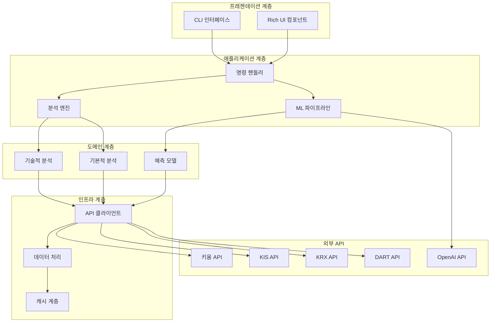
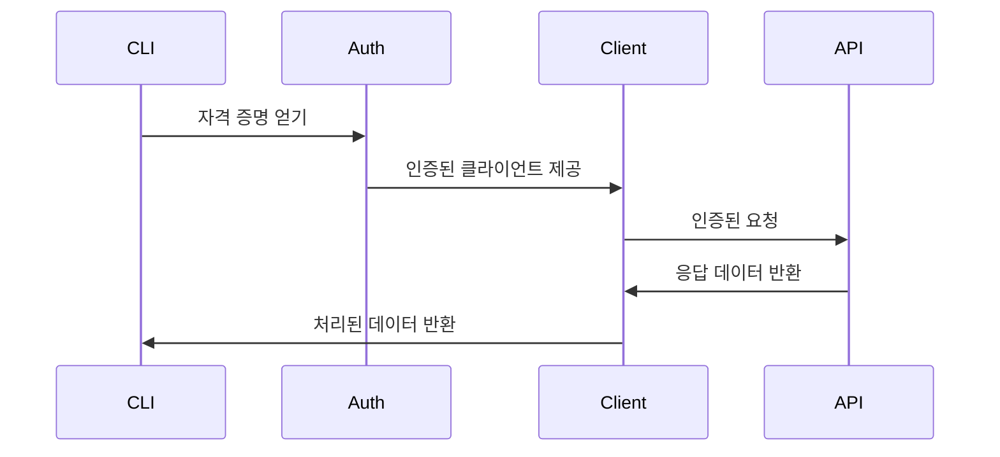
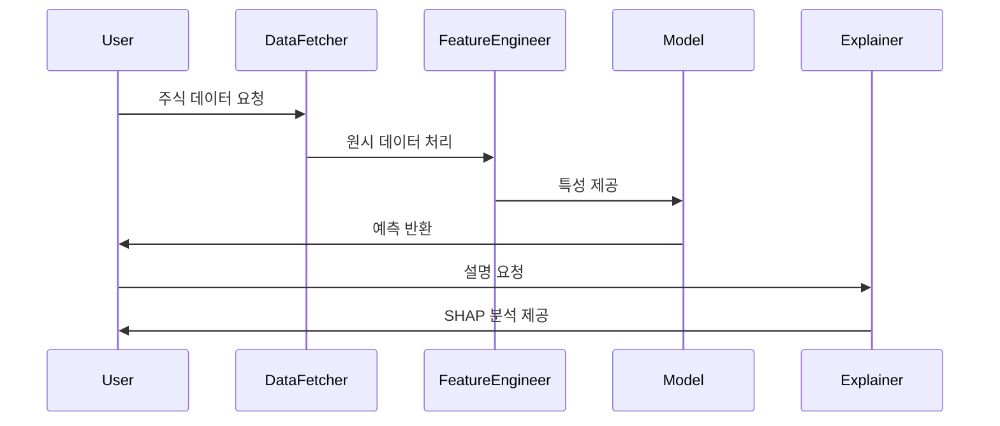
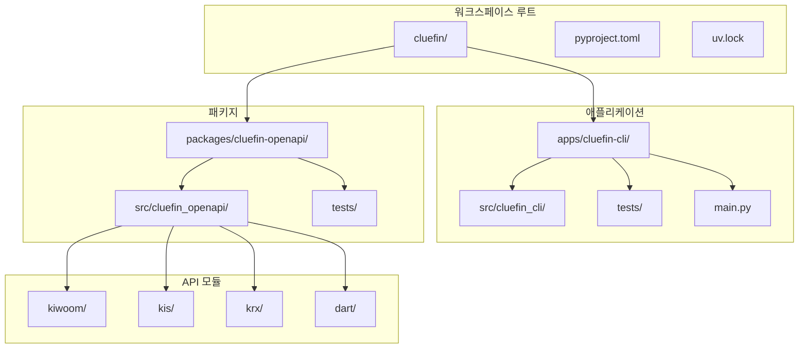

# Cluefin: 포괄적 프로젝트 분석 보고서

## 목차

1. [프로젝트 개요](#프로젝트-개요)
2. [기술 아키텍처](#기술-아키텍처)
3. [프로젝트 구조](#프로젝트-구조)
4. [설치 및 설정](#설치-및-설정)
5. [사용 가이드](#사용-가이드)
6. [개발 지침](#개발-지침)
7. [추가 정보](#추가-정보)

---

## 프로젝트 개요

### 목적 및 기능

**Cluefin** (Clearly Looking for U Entered Financial Information)은 한국 주식 시장을 위해 특별히 설계된 포괄적인 Python 기반 금융 투자 툴킷입니다. 이 프로젝트는 고급 기술 분석, 머신러닝 예측, AI 기반 인사이트를 통해 투자자들이 금융 의사결정 과정을 분석, 자동화, 최적화할 수 있도록 돕는 지능형 비서 역할을 합니다.

### 문제 정의

한국 금융 시장 투자자들은 여러 가지 과제에 직면합니다:
- **분산된 데이터 소스**: 키움, KIS, KRX, DART 등 다양한 인증 방식을 사용하는 여러 API
- **복잡한 분석 요구사항**: 기술적 분석과 기본적 분석 모두 필요
- **정보 과부하**: 대량의 시장 데이터를 효율적으로 처리하기 어려움
- **통합 도구 부재**: 전통적인 분석과 현대적인 ML/AI 기능을 결합한 통합 솔루션 부족

### 해결 방법

Cluefin은 다음을 통해 이러한 과제를 해결합니다:
- **통합 API 클라이언트 라이브러리**: 주요 한국 금융 API를 위한 타입 안전 클라이언트
- **고급 분석**: 150개 이상의 지표와 ML 기반 예측을 포함한 기술적 분석
- **AI 기반 인사이트**: GPT-4 통합을 통한 자연어 설명
- **대화형 CLI 인터페이스**: 풍부한 시각화를 갖춘 사용자 친화적 터미널 인터페이스
- **포괄적 테스팅**: 단위 및 통합 테스트를 통한 견고한 테스트 커버리지

### 핵심 기능

#### 🔥 주요 기능
- **대화형 CLI**: 핵심 분석 기능을 위한 Rich 기반 터미널 인터페이스
- **한국 금융 API 통합**: 키움증권, 한국투자증권(KIS), 한국거래소(KRX), DART를 위한 타입 안전 클라이언트
- **ML 기반 예측**: 주식 움직임 예측을 위한 SHAP 설명 기능을 갖춘 LightGBM 모델
- **기술적 분석**: TA-Lib 통합을 통한 20개 이상의 지표 (RSI, MACD, 볼린저 밴드 등)
- **AI 인사이트**: 시장 분석 및 자연어 설명을 위한 GPT-4 통합

#### 📊 데이터 소스
- **키움증권**: 실시간 시세, 계좌 관리, 주문 실행
- **한국투자증권(KIS)**: 국내/해외 주식 시세, 계좌 조회, 시장 분석
- **한국거래소(KRX)**: 시장 데이터, 지수, 섹터 정보
- **DART**: 기업 공시, 재무제표, 대량보유상황
- **기술적 지표**: 포괄적인 TA-Lib 통합
- **AI 분석**: OpenAI 기반 시장 인사이트 및 설명

### 대상 사용자 및 사용 사례

#### 주요 사용자
1. **개인 투자자**: 고급 분석 도구를 찾는 개인 투자자
2. **정량적 분석가**: 견고한 데이터 소스와 ML 기능이 필요한 전문가
3. **금융 개발자**: 한국 시장 애플리케이션을 구축하는 개발자
4. **연구원**: 한국 금융 시장을 연구하는 학계 인사

#### 일반적인 사용 사례
- **주식 분석**: 포괄적인 기술적 및 기본적 분석
- **포트폴리오 관리**: 자동화된 포트폴리오 모니터링 및 리밸런싱
- **시장 연구**: 시장 트렌드와 패턴의 체계적 분석
- **알고리즘 트레이딩**: 트레이딩 전략 구축 및 테스트
- **교육 목적**: 금융 시장과 분석 기법 학습

---

## 기술 아키텍처

### 고수준 시스템 아키텍처



### 기술 스택

#### 핵심 기술
- **Python 3.10+**: 주요 프로그래밍 언어
- **uv**: 워크스페이스 관리를 위한 현대적 Python 패키지 관리자
- **Pydantic**: 데이터 검증 및 설정 관리
- **Click**: 명령줄 인터페이스 프레임워크
- **Rich**: 터미널 UI 및 포맷팅 라이브러리

#### 데이터 과학 및 ML
- **Pandas**: 데이터 조작 및 분석
- **NumPy**: 수치 계산
- **LightGBM**: ML 예측을 위한 그래디언트 부스팅 프레임워크
- **Scikit-learn**: 머신러닝 알고리즘 및 도구
- **SHAP**: 모델 설명 및 특성 중요도
- **TA-Lib**: 기술적 분석 라이브러리

#### 외부 통합
- **Requests**: API 통신을 위한 HTTP 클라이언트
- **OpenAI**: AI 기반 분석 및 인사이트
- **Loguru**: 구조화된 로깅

#### 개발 및 테스팅
- **pytest**: 비동기 지원 테스팅 프레임워크
- **requests-mock**: 테스팅을 위한 HTTP 요청 모킹
- **coverage**: 코드 커버리지 측정
- **ruff**: 빠른 Python 린터 및 포매터

### 종속성

#### 핵심 종속성
```python
# API 클라이언트 종속성
loguru>=0.7.3          # 구조화된 로깅
pydantic>=2.11.7       # 데이터 검증
requests>=2.32.4       # HTTP 클라이언트
defusedxml>=0.7.1      # 보안 XML 파싱

# CLI 종속성
click>=8.1.7           # CLI 프레임워크
rich>=13.7.0           # 터미널 UI
pydantic-settings>=2.0.0  # 설정 관리
plotext>=5.2.8         # 터미널 플로팅

# ML/데이터 과학 종속성
pandas>=2.0.0          # 데이터 분석
numpy>=1.24.0          # 수치 계산
lightgbm>=4.0.0,<5.0.0 # ML 프레임워크
scikit-learn>=1.3.0,<2.0.0  # ML 알고리즘
shap>=0.47.2,<1.0.0    # 모델 설명
TA-Lib>=0.4.25         # 기술적 분석
imbalanced-learn>=0.14.0  # ML 불균형 처리
openai>=1.0.0          # AI 통합
```

#### 개발 종속성
```python
# 테스팅 및 품질
coverage>=7.10.1       # 코드 커버리지
pytest>=8.4.1          # 테스팅 프레임워크
pytest-asyncio>=0.25.0 # 비동기 테스팅
python-dotenv>=1.1.1   # 환경 변수
requests-mock>=1.12.1  # HTTP 모킹
ruff>=0.12.3           # 린팅 및 포맷팅
```

### 디자인 패턴

#### 1. **리포지토리 패턴**
API 클라이언트는 데이터 접근 추상화를 위해 리포지토리 패턴을 구현합니다:
```python
class Client:
    @property
    def domestic_account(self):
        return DomesticAccount(self)

    @property
    def domestic_basic_quote(self):
        return DomesticBasicQuote(self)
```

#### 2. **팩토리 패턴**
ML 컴포넌트는 모델 생성을 위해 팩토리 패턴을 사용합니다:
```python
class StockPredictor:
    def __init__(self, model_params: Optional[Dict] = None):
        self.model = self._create_model(model_params)
```

#### 3. **전략 패턴**
기술적 분석은 다양한 지표를 위해 전략 패턴을 구현합니다:
```python
class TechnicalAnalyzer:
    def add_indicator(self, indicator_type: str, **params):
        # 동적 지표 전략 선택
```

#### 4. **커맨드 패턴**
CLI 명령은 다양한 분석 작업을 위해 커맨드 패턴을 구현합니다:
```python
@click.command(name="ta")
@click.argument("stock_code")
@click.option("--chart", "-c", is_flag=True)
def technical_analysis(stock_code: str, chart: bool):
    # 커맨드 구현
```

### 아키텍처 결정사항

#### 1. **모노레포 구조**
- **근거**: 공유 종속성, 통합 버전 관리, 단순화된 개발
- **구현**: packages 및 apps 디렉토리를 포함하는 uv 워크스페이스
- **이점**: 코드 재사용, 일관된 도구, 단순화된 배포

#### 2. **Pydantic을 통한 타입 안전성**
- **근거**: 런타임 타입 검증, API 응답 모델링
- **구현**: 모든 API 응답을 Pydantic 모델로 래핑
- **이점**: 데이터 무결성, 자동 검증, IDE 지원

#### 3. **비동기/대기 지원**
- **근거**: 더 나은 성능을 위한 비차단 API 호출
- **구현**: 모든 API 작업을 위한 비동기 메서드
- **이점**: 향상된 처리량, 반응성 있는 CLI

#### 4. **모듈형 ML 파이프라인**
- **근거**: 관심사 분리, 테스트 가능성, 유연성
- **구현**: 특성 공학, 모델링, 설명을 위한 별도 모듈
- **이점**: 유지보수 가능한 코드, 쉬운 실험, 명확한 인터페이스

### 컴포넌트 상호작용

#### API 클라이언트 아키텍처


#### ML 파이프라인 흐름


### 데이터 흐름

#### 데이터 처리 파이프라인
1. **데이터 수집**: 다중 소스 API 데이터 수집
2. **검증**: Pydantic 모델 검증 및 타입 확인
3. **처리**: 특성 공학 및 데이터 변환
4. **분석**: 기술적 지표 및 ML 예측
5. **프레젠테이션**: 시각화를 포함한 Rich CLI 출력

#### 캐싱 전략
- **API 응답**: 자주 액세스하는 데이터를 위한 인메모리 캐싱
- **ML 모델**: 더 빠른 추론을 위한 캐시된 모델 아티팩트
- **특성 세트**: 일반적인 분석 시나리오를 위한 미리 계산된 특성

---

## 프로젝트 구조

### 디렉토리 구성

```
cluefin/
├── .github/                     # GitHub Actions 워크플로우
│   └── workflows/
│       └── ci.yml              # CI/CD 파이프라인 구성
├── apps/                       # 애플리케이션 레벨 패키지
│   └── cluefin-cli/            # 메인 CLI 애플리케이션
│       ├── src/
│       │   └── cluefin_cli/
│       │       ├── commands/   # CLI 명령 구현
│       │       │   ├── analysis/  # 분석 모듈
│       │       │   ├── technical_analysis.py
│       │       │   └── fundamental_analysis.py
│       │       ├── config/     # 설정 관리
│       │       │   └── settings.py
│       │       ├── data/       # 데이터 가져오기 및 처리
│       │       │   └── fetcher.py
│       │       ├── display/    # UI 컴포넌트
│       │       │   └── charts.py
│       │       ├── ml/         # 머신러닝 컴포넌트
│       │       │   ├── predictor.py
│       │       │   ├── feature_engineering.py
│       │       │   ├── models.py
│       │       │   ├── explainer.py
│       │       │   └── diagnostics.py
│       │       └── utils/      # 유틸리티 함수
│       │           └── formatters.py
│       ├── tests/              # 테스트 스위트
│       │   ├── unit/
│       │   └── integration/
│       ├── main.py             # CLI 진입점
│       ├── pyproject.toml      # 패키지 구성
│       └── README.md           # 패키지 문서
├── packages/                   # 공유 라이브러리
│   └── cluefin-openapi/        # API 클라이언트 라이브러리
│       ├── src/
│       │   └── cluefin_openapi/
│       │       ├── kiwoom/     # 키움증권 API
│       │       │   ├── _client.py
│       │       │   ├── _auth.py
│       │       │   └── *_types.py
│       │       ├── kis/        # 한국투자증권 API
│       │       │   ├── _client.py
│       │       │   ├── _auth.py
│       │       │   ├── domestic_*.py
│       │       │   └── overseas_*.py
│       │       ├── krx/        # 한국거래소 API
│       │       │   ├── _client.py
│       │       │   ├── stock.py
│       │       │   ├── bond.py
│       │       │   └── derivatives.py
│       │       └── dart/       # DART 공시 API
│       │           ├── _client.py
│       │           ├── financial_statements.py
│       │           └── disclosures.py
│       ├── tests/              # 포괄적인 테스트 스위트
│       │   ├── kis/           # KIS API 테스트
│       │   ├── krx/           # KRX API 테스트
│       │   ├── dart/          # DART API 테스트
│       │   └── kiwoom/        # 키움 API 테스트
│       ├── pyproject.toml     # 패키지 구성
│       └── README.md          # 패키지 문서
├── pyproject.toml             # 워크스페이스 구성
├── uv.lock                   # 종속성 잠금 파일
├── LICENSE                    # MIT 라이선스
├── .gitignore                # Git 무시 규칙
├── .python-version           # Python 버전 명세
└── README.md                 # 프로젝트 문서
```

### 컴포넌트 계층 구조



### 파일 구성 근거

#### 1. **모노레포 구조**
- **워크스페이스 관리**: 공유 종속성 관리를 위한 uv 워크스페이스
- **코드 재사용**: 여러 애플리케이션에서 공통 API 클라이언트 사용
- **버전 관리**: 통합된 버전 관리 및 릴리스 관리

#### 2. **패키지 분리**
- **API 라이브러리 (`cluefin-openapi`)**: 한국 금융 API를 위한 재사용 가능한 클라이언트 라이브러리
- **CLI 애플리케이션 (`cluefin-cli`)**: 분석 기능을 갖춘 사용자 친화적 애플리케이션
- **명확한 경계**: 고유한 책임과 인터페이스

#### 3. **모듈 구성**
- **커맨드 패턴**: 기능별로 구성된 CLI 명령
- **레이어드 아키텍처**: 프레젠테이션, 비즈니스 로직, 데이터 접근의 명확한 분리
- **모듈형 ML**: 특성 공학, 모델링, 설명을 위한 별도 컴포넌트

#### 4. **테스팅 전략**
- **병렬 구조**: 테스트가 소스 코드 구조를 미러링
- **테스트 유형**: 단위 및 통합 테스트 스위트 분리
- **API 테스팅**: 모든 API 클라이언트에 대한 포괄적인 테스트 커버리지

### 구성 관리

#### 다단계 구성
1. **워크스페이스 레벨**: 공유 종속성 및 도구링을 위한 pyproject.toml
2. **패키지 레벨**: 특정 종속성을 위한 개별 pyproject.toml 파일
3. **환경 레벨**: API 키 및 민감한 구성을 위한 .env 파일
4. **런타임 레벨**: 동적 구성을 위한 설정 클래스

#### 도구 구성
- **Ruff**: 워크스페이스 상속을 통한 코드 린팅 및 포맷팅
- **pytest**: 테스트 카테고리화를 위한 마커와 함께 테스트 구성
- **Coverage**: 코드 커버리지 측정 및 보고
- **GitHub Actions**: 자동화된 CI/CD 파이프라인

---

## 설치 및 설정

### 전제 조건

#### 시스템 요구사항
- **운영체제**: macOS, Linux, 또는 Windows (WSL2 권장)
- **Python 버전**: 3.10 이상
- **메모리**: 최소 4GB RAM (ML 작업의 경우 8GB+ 권장)
- **저장공간**: 종속성 및 모델을 위한 2GB 여유 디스크 공간

#### 필수 시스템 종속성
```bash
# macOS
brew install ta-lib lightgbm

# Ubuntu/Debian
sudo apt-get update
sudo apt-get install build-essential
sudo apt-get install libta-lib-dev

# Windows (WSL2)
sudo apt-get update
sudo apt-get install build-essential libta-lib-dev
```

#### 패키지 관리자
- **uv**: 현대적 Python 패키지 관리자 (필수)
  ```bash
  # uv 설치
  curl -LsSf https://astral.sh/uv/install.sh | sh
  ```

### 단계별 설치 가이드

#### 1. 리포지토리 복제
```bash
# 리포지토리 복제
git clone https://github.com/kgcrom/cluefin.git
cd cluefin

# Python 버전 확인
python --version  # 3.10+ 이어야 함
```

#### 2. 가상 환경 생성
```bash
# uv로 가상 환경 생성
uv venv --python 3.10

# 가상 환경 활성화
# Unix/macOS에서:
source .venv/bin/activate
# Windows에서:
.venv\Scripts\activate
```

#### 3. 종속성 설치
```bash
# 모든 워크스페이스 종속성 설치
uv sync --all-packages

# 개발 종속성 설치 (선택사항)
uv sync --dev
```

#### 4. 환경 구성
```bash
# 환경 템플릿 복사
cp apps/cluefin-cli/.env.sample .env

# API 키로 환경 파일 편집
nano .env  # 또는 선호하는 편집기 사용
```

#### 5. 설치 확인
```bash
# CLI 설치 테스트
cluefin-cli --help

# 기능 확인을 위해 테스트 실행
uv run pytest -m "not integration"
```

### 구성 지침

#### API 키 설정

다음 구성으로 `.env` 파일 생성:
```bash
# 키움증권 API
KIWOOM_APP_KEY=your_kiwoom_app_key
KIWOOM_SECRET_KEY=your_kiwoom_secret_key
KIWOOM_ENV=dev  # 또는 운영 환경의 경우 'prod'

# 한국투자증권 API
KIS_APP_KEY=your_kis_app_key
KIS_SECRET_KEY=your_kis_secret_key
KIS_ENV=dev  # 또는 운영 환경의 경우 'prod'

# 한국거래소 API
KRX_AUTH_KEY=your_krx_auth_key

# DART (금융 공시) API
DART_AUTH_KEY=your_dart_auth_key

# OpenAI API (AI 분석용)
OPENAI_API_KEY=your_openai_api_key
```

#### 환경 변수

| 변수 | 필수 여부 | 설명 | 기본값 |
|------|-----------|------|--------|
| `KIWOOM_APP_KEY` | 선택사항 | 키움 API 애플리케이션 키 | None |
| `KIWOOM_SECRET_KEY` | 선택사항 | 키움 API 시크릿 키 | None |
| `KIWOOM_ENV` | 선택사항 | 키움 환경 (dev/prod) | dev |
| `KIS_APP_KEY` | 선택사항 | KIS API 애플리케이션 키 | None |
| `KIS_SECRET_KEY` | 선택사항 | KIS API 시크릿 키 | None |
| `KIS_ENV` | 선택사항 | KIS 환경 (dev/prod) | dev |
| `KRX_AUTH_KEY` | 선택사항 | KRX API 인증 키 | None |
| `DART_AUTH_KEY` | 선택사항 | DART API 인증 키 | None |
| `OPENAI_API_KEY` | 선택사항 | AI 분석을 위한 OpenAI API 키 | None |

### 일반적인 문제 해결

#### 설치 문제

**문제**: `uv command not found`
```bash
# 해결책: uv를 올바르게 설치
curl -LsSf https://astral.sh/uv/install.sh | sh
# 터미널을 재시작하거나 셸 프로필을 소싱
```

**문제**: `ta-lib installation failed`
```bash
# macOS 해결책:
brew install ta-lib

# Linux 해결책:
sudo apt-get install libta-lib-dev

# 수동 설치 (필요한 경우):
wget http://prdownloads.sourceforge.net/ta-lib/ta-lib-0.4.0-src.tar.gz
tar -xzf ta-lib-0.4.0-src.tar.gz
cd ta-lib/
./configure --prefix=/usr
make
sudo make install
```

**문제**: `lightgbm installation failed`
```bash
# macOS 해결책:
brew install lightgbm

# Linux 해결책:
sudo apt-get install liblightgbm-dev

# 또는 시스템 종속성 설치 후 pip로 설치
pip install lightgbm
```

#### 런타임 문제

**문제**: API 인증 오류
```bash
# API 키가 올바르게 설정되었는지 확인
echo $KIWOOM_APP_KEY
# .env 파일 형식 및 권한 확인
ls -la .env
```

**문제**: 권한 거부 오류
```bash
# 가상 환경 권한 수정
chmod +x .venv/bin/activate

# 파일 권한 확인
ls -la .venv/bin/
```

**문제**: 모듈 임포트 오류
```bash
# 종속성 재설치
uv sync --all-packages --reinstall

# Python 경로 확인
python -c "import sys; print(sys.path)"
```

#### 성능 문제

**문제**: ML 모델 로딩이 느림
```bash
# OpenMP 지원으로 LightGBM 설치 (Linux)
export CMAKE_ARGS="-DOpenMP_C_FLAGS=-fopenmp -DOpenMP_CXX_FLAGS=-fopenmp -DOpenMP_omp_LIBRARY=/usr/lib/x86_64-linux-gnu/libgomp.so"
uv pip install lightgbm --no-cache-dir
```

**문제**: 분석 중 메모리 사용량
```bash
# ML 작업을 위한 메모리 사용량 제한
export LGBM_MAX_MEMORY_USAGE_MB=2048
```

### 개발 환경 설정

#### IDE 구성

**VS Code 설정** (.vscode/settings.json):
```json
{
    "python.defaultInterpreterPath": ".venv/bin/python",
    "python.linting.enabled": true,
    "python.linting.ruffEnabled": true,
    "python.formatting.provider": "black",
    "python.testing.pytestEnabled": true,
    "python.testing.pytestArgs": [
        "-m", "not integration",
        "--tb=short"
    ],
    "python.testing.unittestEnabled": false
}
```

**PyCharm 설정**:
1. PyCharm에서 프로젝트 열기
2. Python 인터프리터를 `.venv/bin/python`으로 구성
3. 테스트 러너로 pytest 활성화
4. 코드 포맷팅을 위해 ruff 구성

#### 사전 커밋 후크 (선택사항)
```bash
# 코드 품질을 위한 사전 커밋 설치
pip install pre-commit

# .pre-commit-config.yaml 생성
repos:
  - repo: https://github.com/astral-sh/ruff-pre-commit
    rev: v0.12.3
    hooks:
      - id: ruff
        args: [--fix]
      - id: ruff-format

# 후크 설치
pre-commit install
```

---

## 사용 가이드

### 기본 사용 예제

#### CLI 명령 구조
```bash
# 도움말 및 사용 가능한 명령 표시
cluefin-cli --help

# 차트와 함께 기술적 분석
cluefin-cli ta 005930 --chart

# AI 인사이트와 함께 기술적 분석
cluefin-cli ta 005930 --ai-analysis

# ML 예측과 함께 기술적 분석
cluefin-cli ta 005930 --ml-predict --shap-analysis

# 모든 기능을 포함한 포괄적 분석
cluefin-cli ta 005930 \
  --chart \
  --ai-analysis \
  --ml-predict \
  --shap-analysis
```

#### 주식 분석 예제

**기본 기술적 분석**:
```bash
# 삼성전자 (005930) 분석
cluefin-cli ta 005930

# 출력 포함:
# - 현재 가격 정보
# - 기술적 지표 (RSI, MACD, 볼린저 밴드)
# - 거래량 분석
# - 지지 및 저항 수준
```

**ML과 함께하는 고급 분석**:
```bash
# ML 예측과 함께 포괄적 분석
cluefin-cli ta 005930 --ml-predict --shap-analysis

# 출력 포함:
# - ML 기반 가격 움직임 예측
# - 특성 중요도 분석
# - 예측에 대한 SHAP 값 설명
# - 신뢰 구간 및 위험 지표
```

**AI 기반 인사이트**:
```bash
# 자연어 설명과 함께 분석
cluefin-cli ta 005930 --ai-analysis

# 출력 포함:
# - GPT-4 생성 시장 분석
# - 지표에 대한 자연어 설명
# - 맥락적 거래 추천
# - 위험 평가 및 시장 심리
```

### 코드 스니펫 및 예제

#### Python API 사용법

**기본 API 클라이언트 사용법**:
```python
from cluefin_openapi.kis import Client
from cluefin_openapi.krx import Client as KRXClient

# KIS 클라이언트 초기화
kis_client = Client(
    token="your_token",
    app_key="your_app_key",
    secret_key="your_secret_key",
    env="dev"  # 또는 "prod"
)

# 국내 주식 정보 얻기
stock_info = kis_client.domestic_stock_info.get_stock_info(
    fid_cond_mrkt_div_code="J",
    fid_input_iscd="005930",
    fid_input_passwd_1=""
)

print(f"주식 이름: {stock_info.output1.hts_kor_isnm}")
print(f"현재 가격: {stock_info.output1.stck_prpr}")
```

**ML과 함께하는 기술적 분석**:
```python
from cluefin_cli.ml import StockMLPredictor
from cluefin_cli.data.fetcher import DataFetcher

# 컴포넌트 초기화
fetcher = DataFetcher()
ml_predictor = StockMLPredictor()

# 주식 데이터 가져오기
stock_data = await fetcher.fetch_stock_data("005930", period="1y")

# 예측하기
predictions = ml_predictor.predict(stock_data)
print(f"예측: {predictions.direction}")
print(f"신뢰도: {predictions.confidence:.2f}")

# SHAP 설명 얻기
if predictions.explanations:
    for feature, importance in predictions.explanations.items():
        print(f"{feature}: {importance:.4f}")
```

**맞춤형 기술적 분석**:
```python
from cluefin_cli.commands.analysis.indicators import TechnicalAnalyzer
import pandas as pd

# 분석기 초기화
analyzer = TechnicalAnalyzer()

# 지표 추가
analyzer.add_indicator("rsi", period=14)
analyzer.add_indicator("macd", fast=12, slow=26, signal=9)
analyzer.add_indicator("bollinger_bands", period=20, std=2)

# 데이터 분석
df = pd.DataFrame(...)  # OHLCV 데이터
results = analyzer.calculate_indicators(df)

print(f"RSI: {results['rsi'].iloc[-1]:.2f}")
print(f"MACD: {results['macd'].iloc[-1]:.4f}")
print(f"시그널: {results['macd_signal'].iloc[-1]:.4f}")
```

### 고급 기능

#### 맞춤 모델 구성
```python
from cluefin_cli.ml.models import StockPredictor

# 맞춤 모델 매개변수
model_params = {
    "objective": "binary",
    "metric": "binary_logloss",
    "boosting_type": "gbdt",
    "num_leaves": 31,
    "learning_rate": 0.05,
    "feature_fraction": 0.9
}

# 맞춤 매개변수로 예측기 초기화
predictor = StockPredictor(model_params=model_params)
```

#### 다중 API 데이터 집계
```python
import asyncio
from cluefin_openapi.kis import Client as KISClient
from cluefin_openapi.krx import Client as KRXClient
from cluefin_openapi.dart import Client as DARTClient

async def comprehensive_analysis(stock_code):
    # 클라이언트 초기화
    kis_client = KISClient(...)
    krx_client = KRXClient(...)
    dart_client = DARTClient(...)

    # 여러 소스에서 데이터 가져오기
    tasks = [
        kis_client.domestic_basic_quote.get_price(stock_code),
        krx_client.stock.get_master_info(stock_code),
        dart_client.financial_statements.get_latest(stock_code)
    ]

    results = await asyncio.gather(*tasks)
    return results
```

### 구성 옵션

#### CLI 구성
```python
# apps/cluefin-cli/src/cluefin_cli/config/settings.py

from typing import Literal, Optional
from pydantic_settings import BaseSettings

class Settings(BaseSettings):
    # API 구성
    kiwoom_app_key: Optional[str] = None
    kiwoom_secret_key: Optional[str] = None
    kiwoom_env: Literal["dev", "prod"] = "dev"

    # 한국거래소 API
    krx_auth_key: Optional[str] = None

    # DART API
    dart_auth_key: Optional[str] = None

    # OpenAI 구성
    openai_api_key: Optional[str] = None

    # ML 구성
    ml_model_path: Optional[str] = None
    enable_shap: bool = True

    # 거래 구성
    trading_hours_start: str = "09:00"
    trading_hours_end: str = "15:30"

    class Config:
        env_file = ".env"
        env_file_encoding = "utf-8"
```

#### 기술적 분석 구성
```python
# 맞춤 지표 매개변수
indicator_config = {
    "rsi": {"period": 14, "overbought": 70, "oversold": 30},
    "macd": {"fast": 12, "slow": 26, "signal": 9},
    "bollinger_bands": {"period": 20, "std": 2},
    "stochastic": {"k_period": 14, "d_period": 3}
}
```

### API 문서

#### KIS API 클라이언트 메서드

**국내 주식 작업**:
```python
# 주식 가격 정보 얻기
price_info = client.domestic_basic_quote.get_price(
    fid_input_iscd="005930",  # 주식 코드
    fid_cond_mrkt_div_code="J"  # 시장 구분
)

# 계좌 정보 얻기
account_info = client.domestic_account.get_account_info(
    cano="12345678",  # 계좌 번호
    acnt_prdt_cd="01"  # 계좌 상품 코드
)

# 주문 실행
order_result = client.domestic_account.place_order(
    cano="12345678",
    acnt_prdt_cd="01",
    pdno="005930",
    ord_dvsn="01",  # 매수 주문
    ord_qty="100",
    ord_unpr="50000"
)
```

**해외 주식 작업**:
```python
# 해외 주식 가격 얻기
overseas_price = client.overseas_basic_quote.get_price(
    PDNO="AAPL",  # 주식 기호
    OVRS_EXCG_CD="NASD",  # 거래소 코드
    CUR_CD="USD"  # 통화 코드
)
```

#### KRX API 클라이언트 메서드

**주식 정보**:
```python
# 주식 마스터 정보 얻기
stock_master = krx_client.stock.get_master_info(
    short_ISIN="005930"
)

# 시장 데이터 얻기
market_data = krx_client.stock.get_market_data(
    basDd="20240101",
    srtnCd="005930"
)
```

#### DART API 클라이언트 메서드

**재무제표**:
```python
# 재무제표 얻기
financials = dart_client.financial_statements.get_financial_statements(
    corp_code="00126380",  # 삼성전자
    bsns_year="2023",
    reprt_code="11011"  # 연간 보고서
)

# 공시 정보 얻기
disclosures = dart_client.disclosures.get_disclosures(
    corp_code="00126380",
    start_dt="20240101",
    end_dt="20241231"
)
```

### 명령줄 인터페이스 참조

#### 전역 옵션
```bash
cluefin-cli [GLOBAL_OPTIONS] COMMAND [COMMAND_OPTIONS]

Global Options:
  --help          도움말 메시지 표시
  --version       버전 정보 표시
```

#### 기술적 분석 명령
```bash
cluefin-cli ta [OPTIONS] STOCK_CODE

Options:
  -c, --chart                    터미널에 차트 표시
  -a, --ai-analysis              AI 기반 분석 포함
  -m, --ml-predict               ML 기반 가격 예측 포함
  -f, --feature-importance       특성 중요도 표시
  -s, --shap-analysis            SHAP 분석 표시
  --help                         도움말 메시지 표시

Arguments:
  STOCK_CODE    주식 코드 (예: 삼성의 경우 005930)
```

#### 기본적 분석 명령
```bash
cluefin-cli fa [OPTIONS] STOCK_CODE

Options:
  --financials    재무제표 분석 포함
  --ratios        재무 비율 분석 포함
  --trends        트렌드 분석 포함
  --help          도움말 메시지 표시
```

#### 사용 패턴 예제

**빠른 분석**:
```bash
# 빠른 기술적 분석
cluefin-cli ta 005930 --chart
```

**포괄적 분석**:
```bash
# 모든 기능을 포함한 전체 분석
cluefin-cli ta 005930 \
  --chart \
  --ai-analysis \
  --ml-predict \
  --shap-analysis
```

**일괄 분석**:
```bash
# 여러 주식 분석
for stock in 005930 000660 035420; do
    echo "$stock 분석 중..."
    cluefin-cli ta $stock --ml-predict
done
```

---

## 개발 지침

### 개발 환경 설정

#### 워크스페이스 설정
```bash
# 리포지토리 복제
git clone https://github.com/kgcrom/cluefin.git
cd cluefin

# 개발 환경 생성
uv venv --python 3.10
source .venv/bin/activate

# 개발 도구를 포함한 모든 종속성 설치
uv sync --all-packages --dev

# 설치 확인
uv run pytest --version
uv run ruff --version
```

#### IDE 구성

**VS Code 구성** (.vscode/settings.json):
```json
{
    "python.defaultInterpreterPath": ".venv/bin/python",
    "python.linting.enabled": true,
    "python.linting.ruffEnabled": true,
    "python.linting.ruffArgs": ["--fix"],
    "python.formatting.provider": "black",
    "python.testing.pytestEnabled": true,
    "python.testing.pytestArgs": [
        "-m", "not integration",
        "--tb=short"
    ],
    "python.testing.unittestEnabled": false,
    "files.exclude": {
        "**/__pycache__": true,
        "**/*.pyc": true,
        ".pytest_cache": true,
        ".coverage": true,
        "htmlcov": true
    }
}
```

**VS Code 확장**:
- Python (Microsoft)
- Pylance (Microsoft)
- Ruff (Charlie Marsh)
- Python Docstring Generator
- GitLens
- Thunder Client (API 테스팅용)

#### 개발 도구 구성

**Ruff 구성** (pyproject.toml):
```toml
[tool.ruff]
line-length = 120
fix = true
target-version = "py311"
extend-exclude = ["*.json"]

[tool.ruff.format]
docstring-code-format = true

[tool.ruff.lint]
select = ["E", "F", "W", "B", "Q", "I", "ASYNC", "T20"]
ignore = ["F401", "E501"]
```

**pytest 구성** (pyproject.toml):
```toml
[tool.pytest.ini_options]
markers = [
    "integration: integration tests",
    "slow: mark test as slow running",
]
addopts = "-ra"
testpaths = [
    "packages/cluefin-openapi/tests",
    "apps/cluefin-cli/tests",
]
```

### 코드 스타일 및 규칙

#### Python 코드 표준

**타입 힌트**:
```python
# 좋음: 포괄적인 타입 힌트
from typing import List, Dict, Optional, Union
from pydantic import BaseModel

class StockData(BaseModel):
    symbol: str
    price: float
    volume: int
    timestamp: datetime

def calculate_rsi(
    prices: List[float],
    period: int = 14
) -> Optional[float]:
    """RSI 지표 계산."""
    if len(prices) < period:
        return None
    # 구현
```

**문서화 표준**:
```python
def fetch_stock_data(
    symbol: str,
    period: str = "1d",
    interval: str = "1m"
) -> pd.DataFrame:
    """
    API에서 주식 시장 데이터 가져오기.

    Args:
        symbol: 주식 기호 (예: "005930")
        period: 기간 ("1d", "1w", "1m", "1y")
        interval: 데이터 간격 ("1m", "5m", "1h", "1d")

    Returns:
        OHLCV 데이터가 포함된 DataFrame

    Raises:
        APIError: API 요청 실패 시
        ValueError: 매개변수가 유효하지 않을 때

    Example:
        >>> data = fetch_stock_data("005930", "1d", "1h")
        >>> print(data.head())
    """
```

**오류 처리 표준**:
```python
import logging
from typing import Optional
from pydantic import ValidationError

logger = logging.getLogger(__name__)

class APIError(Exception):
    """맞춤형 API 오류."""
    pass

def process_api_response(response: Dict) -> Optional[StockData]:
    """
    적절한 오류 처리로 API 응답 처리.

    Returns:
        StockData 객체 또는 처리 실패 시 None
    """
    try:
        return StockData.model_validate(response)
    except ValidationError as e:
        logger.error(f"검증 오류: {e}")
        return None
    except Exception as e:
        logger.error(f"예상치 못한 오류: {e}")
        raise APIError(f"응답 처리 실패: {e}")
```

#### 명명 규칙

**파일 및 디렉토리**:
- 파일 이름에는 snake_case 사용: `technical_analysis.py`
- 설명적인 이름 사용: `stock_ml_predictor.py`
- 테스트 파일: `test_technical_analysis.py`

**클래스 및 함수**:
```python
# 클래스: PascalCase
class StockMLPredictor:
    pass

class TechnicalAnalyzer:
    pass

# 함수 및 변수: snake_case
def calculate_rsi(prices: List[float]) -> float:
    stock_data = fetch_data("005930")

# 상수: UPPER_SNAKE_CASE
DEFAULT_RSI_PERIOD = 14
API_TIMEOUT_SECONDS = 30
```

**API 클라이언트 패턴**:
```python
# 일관된 클라이언트 인터페이스
class Client:
    def __init__(self, token: str, app_key: str, secret_key: str):
        self.token = token
        self.app_key = app_key
        self.secret_key = secret_key

    @property
    def domestic_account(self) -> DomesticAccount:
        """속성 기반 API 접근."""
        return DomesticAccount(self)
```

#### 코드 구성 패턴

**모듈 구조**:
```python
# 표준 모듈 구조
"""목적을 설명하는 모듈 문서화."""

from typing import List, Optional
import logging

# 상수
DEFAULT_TIMEOUT = 30

# 클래스 정의
class DataProcessor:
    """메인 프로세서 클래스."""

    def __init__(self):
        self.logger = logging.getLogger(__name__)

    def process(self) -> bool:
        """메인 처리 메서드."""
        pass

# 함수 정의
def helper_function(data: List[str]) -> Optional[str]:
    """도우미 함수."""
    pass

# __all__ 정의
__all__ = ["DataProcessor", "helper_function"]
```

### 테스팅 절차 및 커버리지

#### 테스트 구조

**단위 테스트**:
```python
# tests/unit/test_technical_analysis.py
import pytest
import pandas as pd
from cluefin_cli.commands.analysis.indicators import TechnicalAnalyzer

class TestTechnicalAnalyzer:
    """TechnicalAnalyzer 테스트 스위트."""

    def setup_method(self):
        """각 테스트 메서드 설정."""
        self.analyzer = TechnicalAnalyzer()
        self.sample_data = pd.DataFrame({
            'open': [100, 101, 102, 103, 104],
            'high': [101, 102, 103, 104, 105],
            'low': [99, 100, 101, 102, 103],
            'close': [101, 102, 103, 104, 105],
            'volume': [1000, 1100, 1200, 1300, 1400]
        })

    def test_calculate_rsi_valid_data(self):
        """유효한 데이터로 RSI 계산 테스트."""
        result = self.analyzer.calculate_rsi(self.sample_data['close'], 14)
        assert result is not None
        assert 0 <= result <= 100

    def test_calculate_rsi_insufficient_data(self):
        """데이터가 부족한 경우 RSI 계산 테스트."""
        short_data = self.sample_data['close'].head(10)
        result = self.analyzer.calculate_rsi(short_data, 14)
        assert result is None

    @pytest.mark.parametrize("period", [14, 21, 30])
    def test_rsi_different_periods(self, period):
        """다양한 기간으로 RSI 테스트."""
        # 더 긴 테스트 데이터 생성
        long_data = pd.Series(range(100, 200))
        result = self.analyzer.calculate_rsi(long_data, period)
        assert result is not None
```

**통합 테스트**:
```python
# tests/integration/test_api_client.py
import pytest
from cluefin_openapi.kis import Client

@pytest.mark.integration
class TestKISIntegration:
    """KIS API 통합 테스트."""

    def setup_method(self):
        """실제 자격 증명으로 설정."""
        self.client = Client(
            token="test_token",
            app_key="test_app_key",
            secret_key="test_secret_key",
            env="dev"
        )

    def test_get_stock_info(self):
        """실제 API 호출 테스트."""
        response = self.client.domestic_basic_quote.get_price("005930")
        assert response is not None
        assert hasattr(response, 'output1')
```

#### 테스팅 모범 사례

**테스트 커버리지 요구사항**:
- 단위 테스트: 최소 90% 라인 커버리지
- 통합 테스트: 모든 API 엔드포인트 커버
- ML 컴포넌트: 예측 파이프라인 및 특성 공학 테스트

**모크 테스팅**:
```python
import pytest
from unittest.mock import Mock, patch
from requests import Response

@patch('cluefin_openapi.kis._client.requests.Session.get')
def test_api_call_mock(mock_get):
    """모크 응답으로 API 클라이언트 테스트."""
    # 모크 응답 설정
    mock_response = Mock(spec=Response)
    mock_response.json.return_value = {"output1": {"stck_prpr": "50000"}}
    mock_response.raise_for_status.return_value = None
    mock_get.return_value = mock_response

    # 클라이언트 테스트
    client = Client("token", "app_key", "secret_key")
    result = client.domestic_basic_quote.get_price("005930")

    # 단언
    assert result.output1.stck_prpr == "50000"
    mock_get.assert_called_once()
```

**속성 기반 테스팅**:
```python
import pytest
from hypothesis import given, strategies as st

@given(st.lists(st.floats(min_value=0, max_value=1000), min_size=20))
def test_rsi_calculation_properties(prices):
    """다양한 입력으로 RSI 계산 테스트."""
    analyzer = TechnicalAnalyzer()
    rsi = analyzer.calculate_rsi(prices, 14)

    if rsi is not None:
        assert 0 <= rsi <= 100
        assert isinstance(rsi, float)
```

#### 테스트 실행

**단위 테스트만**:
```bash
# 단위 테스트 실행 (통합 테스트 제외)
uv run pytest -m "not integration"

# 특정 패키지 테스트 실행
uv run pytest packages/cluefin-openapi/tests/unit/
uv run pytest apps/cluefin-cli/tests/unit/

# 커버리지와 함께 실행
uv run coverage run -m pytest -m "not integration"
uv run coverage report
uv run coverage html
```

**통합 테스트**:
```bash
# 통합 테스트 실행 (API 키 필요)
uv run pytest -m "integration"

# 특정 통합 테스트 실행
uv run pytest tests/integration/test_kis_api.py -v
```

**성능 테스트**:
```bash
# 느린 성능 테스트 실행
uv run pytest -m "slow"

# 타임아웃과 함께 실행
uv run pytest --timeout=300
```

### 기여 가이드라인

#### 기여 워크플로우

1. **포크 및 복제**:
   ```bash
   git clone https://github.com/your-username/cluefin.git
   cd cluefin
   ```

2. **개발 브랜치 생성**:
   ```bash
   git checkout -b feature/your-feature-name
   ```

3. **변경 사항 적용**:
   - 코드 스타일 가이드라인 준수
   - 새로운 기능을 위한 테스트 추가
   - 문서 업데이트

4. **테스트 실행**:
   ```bash
   uv run pytest
   uv run ruff check .
   uv run ruff format .
   ```

5. **변경 사항 커밋**:
   ```bash
   git add .
   git commit -m "feat: 새 기능 설명 추가"
   ```

6. **푸시 및 풀 리퀘스트 생성**:
   ```bash
   git push origin feature/your-feature-name
   # GitHub에서 풀 리퀘스트 생성
   ```

#### 커밋 메시지 표준

**관행적 커밋**:
```
feat: 새로운 기술적 분석 지표 추가
fix: API 인증 문제 해결
docs: 설치 가이드 업데이트
test: KIS API 통합 테스트 추가
refactor: ML 파이프라인 성능 개선
style: ruff로 코드 포맷팅
chore: 종속성 업데이트
```

**풀 리퀘스트 템플릿**:
```markdown
## 설명
적용된 변경 사항에 대한 간단한 설명.

## 변경 유형
- [ ] 버그 수정
- [ ] 새 기능
- [ ] 호환성 깨지는 변경
- [ ] 문서 업데이트

## 테스팅
- [ ] 단위 테스트 통과
- [ ] 통합 테스트 통과 (해당하는 경우)
- [ ] 수동 테스트 완료

## 체크리스트
- [ ] 코드가 스타일 가이드라인을 따름
- [ ] 셀프 리뷰 완료
- [ ] 문서 업데이트
- [ ] 테스트 추가/업데이트
```

#### 코드 리뷰 프로세스

**리뷰 기준**:
1. **기능성**: 코드가 의도한 대로 작동하는가?
2. **테스팅**: 테스트가 포괄적이고 통과하는가?
3. **스타일**: 코드가 프로젝트 가이드라인을 따르는가?
4. **문서화**: 문서가 업데이트되었는가?
5. **성능**: 성능 고려사항이 있는가?

**리뷰 체크리스트**:
- [ ] 코드가 읽기 쉽고 유지보수 가능한가
- [ ] 테스트가 적절한 커버리지를 제공하는가
- [ ] 오류 처리가 적절한가
- [ ] 하드코딩된 자격 증명이나 값이 없는가
- [ ] 타입 힌트가 포괄적인가
- [ ] 문서가 명확하고 정확한가

#### 릴리스 프로세스

**버전 관리**:
- 시맨틱 버전 관리 사용 (MAJOR.MINOR.PATCH)
- pyproject.toml 파일에서 버전 번호 업데이트
- 릴리스를 위해 git 태그 생성

**릴리스 체크리스트**:
1. 모든 테스트 통과
2. 문서 업데이트
3. CHANGELOG.md 업데이트
4. 버전 번호 업데이트
5. git 태그 생성
6. GitHub 릴리스 생성

---

## 추가 정보

### 성능 고려사항

#### API 속도 제한

**속도 제한 전략**:
```python
import time
from functools import wraps
from typing import Callable

def rate_limit(calls: int, period: float):
    """속도 제한 데코레이터."""
    def decorator(func: Callable):
        last_called = [0.0]

        @wraps(func)
        def wrapper(*args, **kwargs):
            elapsed = time.time() - last_called[0]
            if elapsed < period / calls:
                time.sleep(period / calls - elapsed)
            last_called[0] = time.time()
            return func(*args, **kwargs)
        return wrapper
    return decorator

# 사용법
@rate_limit(calls=60, period=60)  # 분당 60회 호출
def api_call():
    # API 구현
    pass
```

**캐싱 구현**:
```python
from functools import lru_cache
from typing import Optional
import pandas as pd

class DataCache:
    """API 응답 및 계산된 데이터를 위한 캐시."""

    def __init__(self, ttl: int = 300):
        self.ttl = ttl
        self._cache = {}

    @lru_cache(maxsize=128)
    def get_stock_data(self, symbol: str, period: str) -> Optional[pd.DataFrame]:
        """캐시된 주식 데이터 검색."""
        cache_key = f"{symbol}_{period}"
        # 캐시 확인 및 TTL 로직 구현
```

#### 메모리 최적화

**대규모 데이터셋 처리**:
```python
# 메모리 효율적인 데이터 처리
def process_large_dataset(data_path: str, chunk_size: int = 10000):
    """청크로 대규모 데이터셋 처리."""
    for chunk in pd.read_csv(data_path, chunksize=chunk_size):
        yield process_chunk(chunk)

# 메모리 효율성을 위한 생성자 패턴
def technical_indicators_generator(prices: pd.Series):
    """한 번에 하나씩 지표 생성."""
    window = []
    for price in prices:
        window.append(price)
        if len(window) >= 20:
            yield calculate_indicator(window)
            window.pop(0)
```

**ML 모델 최적화**:
```python
# 메모리 효율성을 위한 LightGBM 최적화
model_params = {
    "objective": "binary",
    "metric": "binary_logloss",
    "boosting_type": "gbdt",
    "num_leaves": 31,
    "learning_rate": 0.05,
    "feature_fraction": 0.9,
    "bagging_fraction": 0.8,
    "bagging_freq": 5,
    "verbose": -1,
    "max_memory_usage": "2048MB"
}
```

#### 성능 모니터링

**성능 메트릭**:
```python
import time
from functools import wraps
from typing import Dict, Any

def performance_monitor(func):
    """함수 성능 모니터링."""
    @wraps(func)
    def wrapper(*args, **kwargs):
        start_time = time.time()
        result = func(*args, **kwargs)
        end_time = time.time()

        execution_time = end_time - start_time
        logger.info(f"{func.__name__} {execution_time:.4f}초에 실행됨")

        return result
    return wrapper

# 사용법
@performance_monitor
def expensive_ml_operation(data: pd.DataFrame) -> Dict[str, Any]:
    # ML 구현
    pass
```

### 보안 고려사항

#### API 키 관리

**보안 키 저장**:
```python
from pydantic import SecretStr
from pydantic_settings import BaseSettings

class SecureSettings(BaseSettings):
    api_key: SecretStr
    secret_key: SecretStr

    def get_api_key(self) -> str:
        """안전하게 API 키 검색."""
        return self.api_key.get_secret_value()

# 환경 변수 처리
settings = SecureSettings()
# 키는 로그 및 문자열 표현에서 자동으로 마스킹됨
```

**입력 검증**:
```python
from pydantic import BaseModel, validator
from typing import Optional

class StockRequest(BaseModel):
    symbol: str
    period: Optional[str] = "1d"

    @validator('symbol')
    def validate_symbol(cls, v):
        if not v or len(v) != 6 or not v.isdigit():
            raise ValueError('잘못된 주식 기호 형식')
        return v

    @validator('period')
    def validate_period(cls, v):
        valid_periods = ["1d", "1w", "1m", "1y"]
        if v and v not in valid_periods:
            raise ValueError(f'기간은 {valid_periods} 중 하나여야 함')
        return v
```

#### 데이터 프라이버시

**민감한 데이터 처리**:
```python
import logging
from typing import Dict, Any

def sanitize_log_data(data: Dict[str, Any]) -> Dict[str, Any]:
    """로그 데이터에서 민감한 정보 제거."""
    sensitive_keys = ['api_key', 'secret_key', 'token', 'password']

    sanitized = data.copy()
    for key in sensitive_keys:
        if key in sanitized:
            sanitized[key] = "***REDACTED***"

    return sanitized

# 로깅에서 사용법
logger.info("API 요청 데이터: %s", sanitize_log_data(request_data))
```

**HTTPS 및 인증서 검증**:
```python
import requests
from urllib3.exceptions import InsecureRequestWarning

# 인증서 검증이 포함된 보안 HTTPS 클라이언트
class SecureAPIClient:
    def __init__(self, base_url: str):
        self.base_url = base_url
        self.session = requests.Session()
        self.session.verify = True  # 항상 SSL 인증서 검증

        # 안전하지 않은 요청 경고 비활성화
        requests.packages.urllib3.disable_warnings(InsecureRequestWarning)
```

### 프로젝트 로드맵 및 향후 계획

#### 단기 목표 (3-6개월)

1. **향상된 ML 기능**:
   - 향상된 예측 정확도를 위한 앙상블 방법
   - 시계열 분석을 위한 딥러닝 모델 구현
   - 실시간 예측 업데이트 추가

2. **API 확장**:
   - 추가 한국 금융 API에 대한 지원 추가
   - 실시간 데이터를 위한 웹소켓 연결 구현
   - 국제 시장 지원 추가

3. **사용자 경험 개선**:
   - 웹 기반 대시보드 인터페이스
   - 모바일 애플리케이션 개발
   - 향상된 시각화 기능

#### 중기 목표 (6-12개월)

1. **고급 분석**:
   - 포트폴리오 최적화 알고리즘
   - 위험 관리 도구
   - 전략 백테스팅 프레임워크

2. **통합 기능**:
   - 제3자 거래 플랫폼 통합
   - 과거 데이터 저장을 위한 데이터베이스 지원
   - 알림을 위한 알림 시스템

3. **성능 최적화**:
   - 대규모 분석을 위한 분산 처리
   - ML 계산을 위한 가속화된 GPU
   - 실시간 스트리밍 데이터 처리

#### 장기 비전 (1년 이상)

1. **플랫폼 확장**:
   - 다중 시장 글로벌 지원
   - 기관급 기능
   - 규제 준수 도구

2. **AI 발전**:
   - 뉴스 분석을 위한 자연어 처리
   - 감성 분석 통합
   - 자동화된 보고서 생성

3. **생태계 개발**:
   - 맞춤형 지표를 위한 플러그인 시스템
   - 커뮤니티 주도 전략 공유
   - 교육 자료 및 튜토리얼

### 라이선스 및 저작권

#### 라이선스 정보

```
MIT License

Copyright (c) 2024 Hangoo Kang

Permission is hereby granted, free of charge, to any person obtaining a copy
of this software and associated documentation files (the "Software"), to deal
in the Software without restriction, including without limitation the rights
to use, copy, modify, merge, publish, distribute, sublicense, and/or sell
copies of the Software, and to permit persons to whom the Software is
furnished to do so, subject to the following conditions:

The above copyright notice and this permission notice shall be included in all
copies or substantial portions of the Software.

THE SOFTWARE IS PROVIDED "AS IS", WITHOUT WARRANTY OF ANY KIND, EXPRESS OR
IMPLIED, INCLUDING BUT NOT LIMITED TO THE WARRANTIES OF MERCHANTABILITY,
FITNESS FOR A PARTICULAR PURPOSE AND NONINFRINGEMENT. IN NO EVENT SHALL THE
AUTHORS OR COPYRIGHT HOLDERS BE LIABLE FOR ANY CLAIM, DAMAGES OR OTHER
LIABILITY, WHETHER IN AN ACTION OF CONTRACT, TORT OR OTHERWISE, ARISING FROM,
OUT OF OR IN CONNECTION WITH THE SOFTWARE OR THE USE OR OTHER DEALINGS IN THE
SOFTWARE.
```

#### 저작권 표시

- **작성자**: 강한구 (Hangoo Kang)
- **이메일**: kgcrom@hotmail.com
- **연도**: 2024
- **라이선스**: MIT 라이선스

#### 제3자 라이선스

이 프로젝트는 여러 오픈소스 라이브러리를 통합합니다:

- **Pydantic**: MIT 라이선스
- **Requests**: Apache 라이선스 2.0
- **LightGBM**: MIT 라이선스
- **Pandas**: BSD 3-Clause 라이선스
- **Click**: BSD 3-Clause 라이선스
- **Rich**: MIT 라이선스
- **pytest**: MIT 라이선스

#### 속성 요구사항

이 프로젝트를 사용하거나 수정할 때 다음을 준수하십시오:

1. 원본 저작권 표시 유지
2. 배포물에 라이선스 텍스트 포함
3. 제3자 라이브러리 사용 인정
4. 원본 작성자에게 속성 제공

#### 면책 조항

이 프로젝트는 교육 및 연구 목적으로만 제공됩니다. 실제 거래나 투자 사용을 위한 것이 아니며, 금융 자문을 구성하거나 어떤 결과도 보장하지 않습니다. 작성자와 기여자는 이 소프트웨어를 기반으로 한 금융 손실이나 결정에 대해 책임지지 않습니다.

---

## 결론

Cluefin은 전통적인 기술적 분석과 현대적인 머신러닝 및 AI 기능을 결합하여 한국 금융 시장 분석에 대한 포괄적인 접근 방식을 나타냅니다. 프로젝트의 모듈형 아키텍처, 광범위한 API 통합, 사용자 친화적인 CLI 인터페이스는 한국 주식 시장에 관심 있는 투자자, 분석가, 연구원에게 귀중한 도구가 됩니다.

프로젝트의 타입 안전성, 포괄적인 테스팅, 명확한 문서화에 대한 강조는 유지보수성과 신뢰성을 보장하며, 확장 가능한 아키텍처는 향후 향상과 커뮤니티 기여를 가능하게 합니다.

프로젝트가 계속 발전함에 따라 복잡한 금융 분석과 접근 가능한 도구 사이의 격차를 해소하고, 고급 기술과 직관적인 설계를 통해 더 정보에 기반한 투자 결정을 내릴 수 있도록 목표로 합니다.

---

*더 많은 정보, 질문, 또는 기여를 위해 프로젝트 리포지토리를 방문하세요: [https://github.com/kgcrom/cluefin](https://github.com/kgcrom/cluefin).*