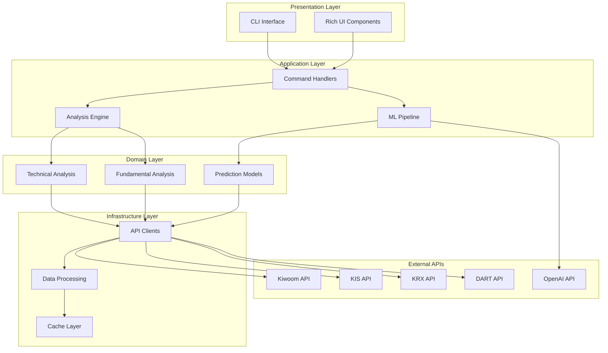
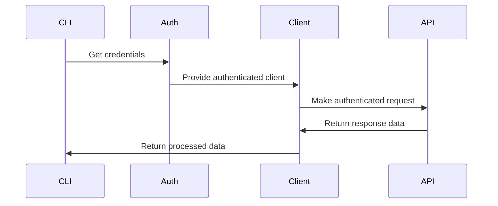
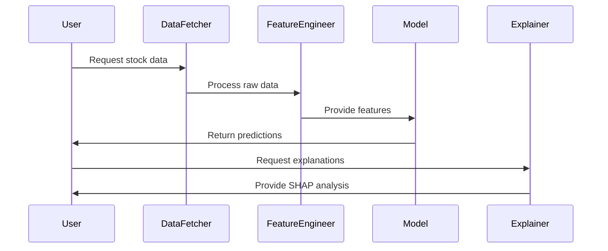
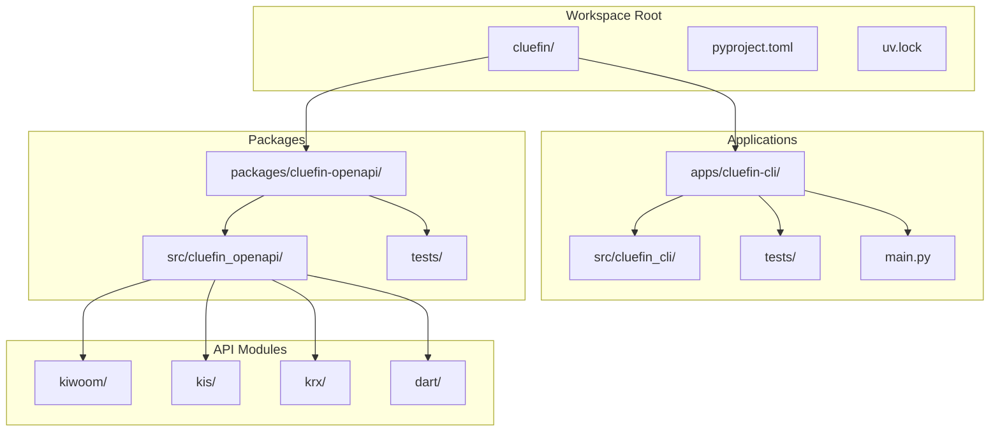

# Cluefin: Comprehensive Project Analysis Report

## Table of Contents

1. [Project Overview](#project-overview)
2. [Technical Architecture](#technical-architecture)
3. [Project Structure](#project-structure)
4. [Installation and Setup](#installation-and-setup)
5. [Usage Guide](#usage-guide)
6. [Development Guidelines](#development-guidelines)
7. [Additional Information](#additional-information)

---

## Project Overview

### Purpose and Functionality

**Cluefin** (Clearly Looking for U Entered Financial Information) is a comprehensive Python-based financial investment toolkit specifically designed for the Korean stock market. The project serves as an intelligent assistant that helps investors analyze, automate, and optimize their financial decision-making processes through advanced technical analysis, machine learning predictions, and AI-powered insights.

### Problem Definition

Korean financial market investors face several challenges:
- **Fragmented Data Sources**: Multiple APIs (Kiwoom, KIS, KRX, DART) with different authentication methods
- **Complex Analysis Requirements**: Need for both technical and fundamental analysis
- **Information Overload**: Difficulty processing large amounts of market data efficiently
- **Lack of Integrated Tools**: No unified solution combining traditional analysis with modern ML/AI capabilities

### Solution Approach

Cluefin addresses these challenges by providing:
- **Unified API Client Library**: Type-safe clients for major Korean financial APIs
- **Advanced Analytics**: Technical analysis with 150+ indicators and ML-based predictions
- **AI-Powered Insights**: Natural language explanations using GPT-4 integration
- **Interactive CLI Interface**: User-friendly terminal interface with rich visualizations
- **Comprehensive Testing**: Robust test coverage with unit and integration tests

### Core Features

#### 🔥 Key Capabilities
- **Interactive CLI**: Rich-based terminal interface for core analysis functions
- **Korean Financial API Integration**: Type-safe clients for Kiwoom Securities, Korea Investment & Securities (KIS), Korea Exchange (KRX), and DART
- **ML-Based Predictions**: LightGBM models with SHAP explanations for stock movement prediction
- **Technical Analysis**: 20+ indicators through TA-Lib integration (RSI, MACD, Bollinger Bands, etc.)
- **AI Insights**: GPT-4 integration for market analysis and natural language explanations

#### 📊 Data Sources
- **Kiwoom Securities**: Real-time quotes, account management, order execution
- **Korea Investment & Securities (KIS)**: Domestic/overseas stock quotes, account inquiries, market analysis
- **Korea Exchange (KRX)**: Market data, indices, sector information
- **DART**: Corporate disclosures, financial statements, major shareholder holdings
- **Technical Indicators**: Comprehensive TA-Lib integration
- **AI Analysis**: OpenAI-based market insights and explanations

### Target Users and Use Cases

#### Primary Users
1. **Retail Investors**: Individual investors seeking advanced analysis tools
2. **Quantitative Analysts**: Professionals requiring robust data sources and ML capabilities
3. **Financial Developers**: Developers building Korean market applications
4. **Researchers**: Academics studying Korean financial markets

#### Common Use Cases
- **Stock Analysis**: Comprehensive technical and fundamental analysis
- **Portfolio Management**: Automated portfolio monitoring and rebalancing
- **Market Research**: Systematic analysis of market trends and patterns
- **Algorithmic Trading**: Building and testing trading strategies
- **Educational Purposes**: Learning about financial markets and analysis techniques

---

## Technical Architecture

### High-Level System Architecture



### Technology Stack

#### Core Technologies
- **Python 3.10+**: Primary programming language
- **uv**: Modern Python package manager for workspace management
- **Pydantic**: Data validation and settings management
- **Click**: Command-line interface framework
- **Rich**: Terminal UI and formatting library

#### Data Science & ML
- **Pandas**: Data manipulation and analysis
- **NumPy**: Numerical computing
- **LightGBM**: Gradient boosting framework for ML predictions
- **Scikit-learn**: Machine learning algorithms and tools
- **SHAP**: Model explanations and feature importance
- **TA-Lib**: Technical analysis library

#### External Integrations
- **Requests**: HTTP client for API communication
- **OpenAI**: AI-powered analysis and insights
- **Loguru**: Structured logging

#### Development & Testing
- **pytest**: Testing framework with async support
- **requests-mock**: HTTP request mocking for testing
- **coverage**: Code coverage measurement
- **ruff**: Fast Python linter and formatter

### Dependencies

#### Core Dependencies
```python
# API Client Dependencies
loguru>=0.7.3          # Structured logging
pydantic>=2.11.7       # Data validation
requests>=2.32.4       # HTTP client
defusedxml>=0.7.1      # Secure XML parsing

# CLI Dependencies
click>=8.1.7           # CLI framework
rich>=13.7.0           # Terminal UI
pydantic-settings>=2.0.0  # Configuration management
plotext>=5.2.8         # Terminal plotting

# ML/Data Science Dependencies
pandas>=2.0.0          # Data analysis
numpy>=1.24.0          # Numerical computing
lightgbm>=4.0.0,<5.0.0 # ML framework
scikit-learn>=1.3.0,<2.0.0  # ML algorithms
shap>=0.47.2,<1.0.0    # Model explanations
TA-Lib>=0.4.25         # Technical analysis
imbalanced-learn>=0.14.0  # ML imbalance handling
openai>=1.0.0          # AI integration
```

#### Development Dependencies
```python
# Testing & Quality
coverage>=7.10.1       # Code coverage
pytest>=8.4.1          # Testing framework
pytest-asyncio>=0.25.0 # Async testing
python-dotenv>=1.1.1   # Environment variables
requests-mock>=1.12.1  # HTTP mocking
ruff>=0.12.3           # Linting and formatting
```

### Design Patterns

#### 1. **Repository Pattern**
API clients implement repository pattern for data access abstraction:
```python
class Client:
    @property
    def domestic_account(self):
        return DomesticAccount(self)

    @property
    def domestic_basic_quote(self):
        return DomesticBasicQuote(self)
```

#### 2. **Factory Pattern**
ML components use factory pattern for model creation:
```python
class StockPredictor:
    def __init__(self, model_params: Optional[Dict] = None):
        self.model = self._create_model(model_params)
```

#### 3. **Strategy Pattern**
Technical analysis implements strategy pattern for different indicators:
```python
class TechnicalAnalyzer:
    def add_indicator(self, indicator_type: str, **params):
        # Dynamic indicator strategy selection
```

#### 4. **Command Pattern**
CLI commands implement command pattern for different analysis operations:
```python
@click.command(name="ta")
@click.argument("stock_code")
@click.option("--chart", "-c", is_flag=True)
def technical_analysis(stock_code: str, chart: bool):
    # Command implementation
```

### Architecture Decisions

#### 1. **Monorepo Structure**
- **Rationale**: Shared dependencies, unified versioning, simplified development
- **Implementation**: uv workspace with packages and apps directories
- **Benefits**: Code reuse, consistent tooling, simplified deployment

#### 2. **Type Safety with Pydantic**
- **Rationale**: Runtime type validation, API response modeling
- **Implementation**: All API responses wrapped in Pydantic models
- **Benefits**: Data integrity, automatic validation, IDE support

#### 3. **Async/Await Support**
- **Rationale**: Non-blocking API calls for better performance
- **Implementation**: Async methods for all API operations
- **Benefits**: Improved throughput, responsive CLI

#### 4. **Modular ML Pipeline**
- **Rationale**: Separation of concerns, testability, flexibility
- **Implementation**: Separate modules for feature engineering, modeling, explanations
- **Benefits**: Maintainable code, easy experimentation, clear interfaces

### Component Interactions

#### API Client Architecture


#### ML Pipeline Flow


### Data Flow

#### Data Processing Pipeline
1. **Data Collection**: Multi-source API data gathering
2. **Validation**: Pydantic model validation and type checking
3. **Processing**: Feature engineering and data transformation
4. **Analysis**: Technical indicators and ML predictions
5. **Presentation**: Rich CLI output with visualizations

#### Caching Strategy
- **API Responses**: In-memory caching for frequently accessed data
- **ML Models**: Cached model artifacts for faster inference
- **Feature Sets**: Pre-computed features for common analysis scenarios

---

## Project Structure

### Directory Organization

```
cluefin/
├── .github/                     # GitHub Actions workflows
│   └── workflows/
│       └── ci.yml              # CI/CD pipeline configuration
├── apps/                       # Application-level packages
│   └── cluefin-cli/            # Main CLI application
│       ├── src/
│       │   └── cluefin_cli/
│       │       ├── commands/   # CLI command implementations
│       │       │   ├── analysis/  # Analysis modules
│       │       │   ├── technical_analysis.py
│       │       │   └── fundamental_analysis.py
│       │       ├── config/     # Configuration management
│       │       │   └── settings.py
│       │       ├── data/       # Data fetching and processing
│       │       │   └── fetcher.py
│       │       ├── display/    # UI components
│       │       │   └── charts.py
│       │       ├── ml/         # Machine learning components
│       │       │   ├── predictor.py
│       │       │   ├── feature_engineering.py
│       │       │   ├── models.py
│       │       │   ├── explainer.py
│       │       │   └── diagnostics.py
│       │       └── utils/      # Utility functions
│       │           └── formatters.py
│       ├── tests/              # Test suites
│       │   ├── unit/
│       │   └── integration/
│       ├── main.py             # CLI entry point
│       ├── pyproject.toml      # Package configuration
│       └── README.md           # Package documentation
├── packages/                   # Shared libraries
│   └── cluefin-openapi/        # API client library
│       ├── src/
│       │   └── cluefin_openapi/
│       │       ├── kiwoom/     # Kiwoom Securities API
│       │       │   ├── _client.py
│       │       │   ├── _auth.py
│       │       │   └── *_types.py
│       │       ├── kis/        # Korea Investment & Securities API
│       │       │   ├── _client.py
│       │       │   ├── _auth.py
│       │       │   ├── domestic_*.py
│       │       │   └── overseas_*.py
│       │       ├── krx/        # Korea Exchange API
│       │       │   ├── _client.py
│       │       │   ├── stock.py
│       │       │   ├── bond.py
│       │       │   └── derivatives.py
│       │       └── dart/       # DART disclosure API
│       │           ├── _client.py
│       │           ├── financial_statements.py
│       │           └── disclosures.py
│       ├── tests/              # Comprehensive test suite
│       │   ├── kis/           # KIS API tests
│       │   ├── krx/           # KRX API tests
│       │   ├── dart/          # DART API tests
│       │   └── kiwoom/        # Kiwoom API tests
│       ├── pyproject.toml     # Package configuration
│       └── README.md          # Package documentation
├── pyproject.toml             # Workspace configuration
├── uv.lock                   # Dependency lock file
├── LICENSE                    # MIT license
├── .gitignore                # Git ignore rules
├── .python-version           # Python version specification
└── README.md                 # Project documentation
```

### Component Hierarchy



### File Organization Rationale

#### 1. **Monorepo Structure**
- **Workspace Management**: uv workspace enables shared dependency management
- **Code Reuse**: Common API clients used across multiple applications
- **Version Control**: Unified versioning and release management

#### 2. **Package Separation**
- **API Library (`cluefin-openapi`)**: Reusable client library for Korean financial APIs
- **CLI Application (`cluefin-cli`)**: User-facing application with analysis capabilities
- **Clear Boundaries**: Distinct responsibilities and interfaces

#### 3. **Module Organization**
- **Command Pattern**: CLI commands organized by functionality
- **Layered Architecture**: Clear separation between presentation, business logic, and data access
- **Modular ML**: Separate components for feature engineering, modeling, and explanation

#### 4. **Testing Strategy**
- **Parallel Structure**: Tests mirror source code organization
- **Test Types**: Separate unit and integration test suites
- **API Testing**: Comprehensive test coverage for all API clients

### Configuration Management

#### Multi-level Configuration
1. **Workspace Level**: pyproject.toml for shared dependencies and tooling
2. **Package Level**: Individual pyproject.toml files for specific dependencies
3. **Environment Level**: .env files for API keys and sensitive configuration
4. **Runtime Level**: Settings classes for dynamic configuration

#### Tooling Configuration
- **Ruff**: Code linting and formatting with workspace inheritance
- **pytest**: Test configuration with markers for test categorization
- **Coverage**: Code coverage measurement and reporting
- **GitHub Actions**: Automated CI/CD pipeline

---

## Installation and Setup

### Prerequisites

#### System Requirements
- **Operating System**: macOS, Linux, or Windows (WSL2 recommended)
- **Python Version**: 3.10 or higher
- **Memory**: Minimum 4GB RAM (8GB+ recommended for ML operations)
- **Storage**: 2GB free disk space for dependencies and models

#### Required System Dependencies
```bash
# macOS
brew install ta-lib lightgbm

# Ubuntu/Debian
sudo apt-get update
sudo apt-get install build-essential
sudo apt-get install libta-lib-dev

# Windows (WSL2)
sudo apt-get update
sudo apt-get install build-essential libta-lib-dev
```

#### Package Managers
- **uv**: Modern Python package manager (required)
  ```bash
  # Install uv
  curl -LsSf https://astral.sh/uv/install.sh | sh
  ```

### Step-by-Step Installation Guide

#### 1. Clone Repository
```bash
# Clone the repository
git clone https://github.com/kgcrom/cluefin.git
cd cluefin

# Verify Python version
python --version  # Should be 3.10+
```

#### 2. Create Virtual Environment
```bash
# Create virtual environment with uv
uv venv --python 3.10

# Activate virtual environment
# On Unix/macOS:
source .venv/bin/activate
# On Windows:
.venv\Scripts\activate
```

#### 3. Install Dependencies
```bash
# Install all workspace dependencies
uv sync --all-packages

# Install development dependencies (optional)
uv sync --dev
```

#### 4. Environment Configuration
```bash
# Copy environment template
cp apps/cluefin-cli/.env.sample .env

# Edit environment file with your API keys
nano .env  # or use your preferred editor
```

#### 5. Verify Installation
```bash
# Test CLI installation
cluefin-cli --help

# Run tests to verify functionality
uv run pytest -m "not integration"
```

### Configuration Guidelines

#### API Keys Setup

Create `.env` file with the following configuration:
```bash
# Kiwoom Securities API
KIWOOM_APP_KEY=your_kiwoom_app_key
KIWOOM_SECRET_KEY=your_kiwoom_secret_key
KIWOOM_ENV=dev  # or 'prod' for production

# Korea Investment & Securities API
KIS_APP_KEY=your_kis_app_key
KIS_SECRET_KEY=your_kis_secret_key
KIS_ENV=dev  # or 'prod' for production

# Korea Exchange API
KRX_AUTH_KEY=your_krx_auth_key

# DART (Financial Disclosures) API
DART_AUTH_KEY=your_dart_auth_key

# OpenAI API (for AI analysis)
OPENAI_API_KEY=your_openai_api_key
```

#### Environment Variables

| Variable | Required | Description | Default |
|----------|----------|-------------|---------|
| `KIWOOM_APP_KEY` | Optional | Kiwoom API application key | None |
| `KIWOOM_SECRET_KEY` | Optional | Kiwoom API secret key | None |
| `KIWOOM_ENV` | Optional | Kiwoom environment (dev/prod) | dev |
| `KIS_APP_KEY` | Optional | KIS API application key | None |
| `KIS_SECRET_KEY` | Optional | KIS API secret key | None |
| `KIS_ENV` | Optional | KIS environment (dev/prod) | dev |
| `KRX_AUTH_KEY` | Optional | KRX API authentication key | None |
| `DART_AUTH_KEY` | Optional | DART API authentication key | None |
| `OPENAI_API_KEY` | Optional | OpenAI API key for AI analysis | None |

### Troubleshooting Common Issues

#### Installation Issues

**Issue**: `uv command not found`
```bash
# Solution: Install uv properly
curl -LsSf https://astral.sh/uv/install.sh | sh
# Restart terminal or source shell profile
```

**Issue**: `ta-lib installation failed`
```bash
# macOS Solution:
brew install ta-lib

# Linux Solution:
sudo apt-get install libta-lib-dev

# Manual installation (if needed):
wget http://prdownloads.sourceforge.net/ta-lib/ta-lib-0.4.0-src.tar.gz
tar -xzf ta-lib-0.4.0-src.tar.gz
cd ta-lib/
./configure --prefix=/usr
make
sudo make install
```

**Issue**: `lightgbm installation failed`
```bash
# macOS Solution:
brew install lightgbm

# Linux Solution:
sudo apt-get install liblightgbm-dev

# Or install via pip after installing system dependencies
pip install lightgbm
```

#### Runtime Issues

**Issue**: API authentication errors
```bash
# Verify API keys are correctly set
echo $KIWOOM_APP_KEY
# Check .env file format and permissions
ls -la .env
```

**Issue**: Permission denied errors
```bash
# Fix virtual environment permissions
chmod +x .venv/bin/activate

# Check file permissions
ls -la .venv/bin/
```

**Issue**: Module import errors
```bash
# Reinstall dependencies
uv sync --all-packages --reinstall

# Check Python path
python -c "import sys; print(sys.path)"
```

#### Performance Issues

**Issue**: Slow ML model loading
```bash
# Install LightGBM with OpenMP support (Linux)
export CMAKE_ARGS="-DOpenMP_C_FLAGS=-fopenmp -DOpenMP_CXX_FLAGS=-fopenmp -DOpenMP_omp_LIBRARY=/usr/lib/x86_64-linux-gnu/libgomp.so"
uv pip install lightgbm --no-cache-dir
```

**Issue**: Memory usage during analysis
```bash
# Limit memory usage for ML operations
export LGBM_MAX_MEMORY_USAGE_MB=2048
```

### Development Environment Setup

#### IDE Configuration

**VS Code Setup** (.vscode/settings.json):
```json
{
    "python.defaultInterpreterPath": ".venv/bin/python",
    "python.linting.enabled": true,
    "python.linting.ruffEnabled": true,
    "python.formatting.provider": "black",
    "python.testing.pytestEnabled": true,
    "python.testing.pytestArgs": ["-m", "not integration"]
}
```

**PyCharm Setup**:
1. Open project in PyCharm
2. Configure Python interpreter to `.venv/bin/python`
3. Enable pytest as test runner
4. Configure ruff for code formatting

#### Pre-commit Hooks (Optional)
```bash
# Install pre-commit for code quality
pip install pre-commit

# Create .pre-commit-config.yaml
repos:
  - repo: https://github.com/astral-sh/ruff-pre-commit
    rev: v0.12.3
    hooks:
      - id: ruff
        args: [--fix]
      - id: ruff-format

# Install hooks
pre-commit install
```

---

## Usage Guide

### Basic Usage Examples

#### CLI Command Structure
```bash
# Show help and available commands
cluefin-cli --help

# Technical analysis with chart
cluefin-cli ta 005930 --chart

# Technical analysis with AI insights
cluefin-cli ta 005930 --ai-analysis

# Technical analysis with ML prediction
cluefin-cli ta 005930 --ml-predict --shap-analysis

# Comprehensive analysis
cluefin-cli ta 005930 --chart --ai-analysis --ml-predict --shap-analysis
```

#### Stock Analysis Examples

**Basic Technical Analysis**:
```bash
# Analyze Samsung Electronics (005930)
cluefin-cli ta 005930

# Output includes:
# - Current price information
# - Technical indicators (RSI, MACD, Bollinger Bands)
# - Trading volume analysis
# - Support and resistance levels
```

**Advanced Analysis with ML**:
```bash
# Comprehensive analysis with ML predictions
cluefin-cli ta 005930 --ml-predict --shap-analysis

# Output includes:
# - ML-based price movement prediction
# - Feature importance analysis
# - SHAP values explaining predictions
# - Confidence intervals and risk metrics
```

**AI-Powered Insights**:
```bash
# Analysis with natural language explanations
cluefin-cli ta 005930 --ai-analysis

# Output includes:
# - GPT-4 generated market analysis
# - Natural language explanations of indicators
# - Contextual trading recommendations
# - Risk assessment and market sentiment
```

### Code Snippets and Examples

#### Python API Usage

**Basic API Client Usage**:
```python
from cluefin_openapi.kis import Client
from cluefin_openapi.krx import Client as KRXClient

# Initialize KIS client
kis_client = Client(
    token="your_token",
    app_key="your_app_key",
    secret_key="your_secret_key",
    env="dev"  # or "prod"
)

# Get domestic stock information
stock_info = kis_client.domestic_stock_info.get_stock_info(
    fid_cond_mrkt_div_code="J",
    fid_input_iscd="005930",
    fid_input_passwd_1=""
)

print(f"Stock Name: {stock_info.output1.hts_kor_isnm}")
print(f"Current Price: {stock_info.output1.stck_prpr}")
```

**Technical Analysis with ML**:
```python
from cluefin_cli.ml import StockMLPredictor
from cluefin_cli.data.fetcher import DataFetcher

# Initialize components
fetcher = DataFetcher()
ml_predictor = StockMLPredictor()

# Fetch stock data
stock_data = await fetcher.fetch_stock_data("005930", period="1y")

# Make predictions
predictions = ml_predictor.predict(stock_data)
print(f"Prediction: {predictions.direction}")
print(f"Confidence: {predictions.confidence:.2f}")

# Get SHAP explanations
if predictions.explanations:
    for feature, importance in predictions.explanations.items():
        print(f"{feature}: {importance:.4f}")
```

**Custom Technical Analysis**:
```python
from cluefin_cli.commands.analysis.indicators import TechnicalAnalyzer
import pandas as pd

# Initialize analyzer
analyzer = TechnicalAnalyzer()

# Add indicators
analyzer.add_indicator("rsi", period=14)
analyzer.add_indicator("macd", fast=12, slow=26, signal=9)
analyzer.add_indicator("bollinger_bands", period=20, std=2)

# Analyze data
df = pd.DataFrame(...)  # Your OHLCV data
results = analyzer.calculate_indicators(df)

print(f"RSI: {results['rsi'].iloc[-1]:.2f}")
print(f"MACD: {results['macd'].iloc[-1]:.4f}")
print(f"Signal: {results['macd_signal'].iloc[-1]:.4f}")
```

### Advanced Features

#### Custom Model Configuration
```python
from cluefin_cli.ml.models import StockPredictor

# Custom model parameters
model_params = {
    "objective": "binary",
    "metric": "binary_logloss",
    "boosting_type": "gbdt",
    "num_leaves": 31,
    "learning_rate": 0.05,
    "feature_fraction": 0.9
}

# Initialize predictor with custom parameters
predictor = StockMLPredictor(model_params=model_params)
```

#### Multi-API Data Aggregation
```python
import asyncio
from cluefin_openapi.kis import Client as KISClient
from cluefin_openapi.krx import Client as KRXClient
from cluefin_openapi.dart import Client as DARTClient

async def comprehensive_analysis(stock_code):
    # Initialize clients
    kis_client = KISClient(...)
    krx_client = KRXClient(...)
    dart_client = DARTClient(...)

    # Fetch data from multiple sources
    tasks = [
        kis_client.domestic_basic_quote.get_price(stock_code),
        krx_client.stock.get_master_info(stock_code),
        dart_client.financial_statements.get_latest(stock_code)
    ]

    results = await asyncio.gather(*tasks)
    return results
```

### Configuration Options

#### CLI Configuration
```python
# apps/cluefin-cli/src/cluefin_cli/config/settings.py

from typing import Literal, Optional
from pydantic_settings import BaseSettings

class Settings(BaseSettings):
    # API Configuration
    kiwoom_app_key: Optional[str] = None
    kiwoom_secret_key: Optional[str] = None
    kiwoom_env: Literal["dev", "prod"] = "dev"

    # Korean Exchange API
    krx_auth_key: Optional[str] = None

    # DART API
    dart_auth_key: Optional[str] = None

    # OpenAI Configuration
    openai_api_key: Optional[str] = None

    # ML Configuration
    ml_model_path: Optional[str] = None
    enable_shap: bool = True

    # Trading Configuration
    trading_hours_start: str = "09:00"
    trading_hours_end: str = "15:30"

    class Config:
        env_file = ".env"
        env_file_encoding = "utf-8"
```

#### Technical Analysis Configuration
```python
# Custom indicator parameters
indicator_config = {
    "rsi": {"period": 14, "overbought": 70, "oversold": 30},
    "macd": {"fast": 12, "slow": 26, "signal": 9},
    "bollinger_bands": {"period": 20, "std": 2},
    "stochastic": {"k_period": 14, "d_period": 3}
}
```

### API Documentation

#### KIS API Client Methods

**Domestic Stock Operations**:
```python
# Get stock price information
price_info = client.domestic_basic_quote.get_price(
    fid_input_iscd="005930",  # Stock code
    fid_cond_mrkt_div_code="J"  # Market division
)

# Get account information
account_info = client.domestic_account.get_account_info(
    cano="12345678",  # Account number
    acnt_prdt_cd="01"  # Account product code
)

# Place order
order_result = client.domestic_account.place_order(
    cano="12345678",
    acnt_prdt_cd="01",
    pdno="005930",
    ord_dvsn="01",  # Buy order
    ord_qty="100",
    ord_unpr="50000"
)
```

**Overseas Stock Operations**:
```python
# Get overseas stock price
overseas_price = client.overseas_basic_quote.get_price(
    PDNO="AAPL",  # Stock symbol
    OVRS_EXCG_CD="NASD",  # Exchange code
    CUR_CD="USD"  # Currency code
)
```

#### KRX API Client Methods

**Stock Information**:
```python
# Get stock master information
stock_master = krx_client.stock.get_master_info(
    short_ISIN="005930"
)

# Get market data
market_data = krx_client.stock.get_market_data(
    basDd="20240101",
    srtnCd="005930"
)
```

#### DART API Client Methods

**Financial Statements**:
```python
# Get financial statements
financials = dart_client.financial_statements.get_financial statements(
    corp_code="00126380",  # Samsung Electronics
    bsns_year="2023",
    reprt_code="11011"  # Annual report
)

# Get disclosures
disclosures = dart_client.disclosures.get_disclosures(
    corp_code="00126380",
    start_dt="20240101",
    end_dt="20241231"
)
```

### Command-Line Interface Reference

#### Global Options
```bash
cluefin-cli [GLOBAL_OPTIONS] COMMAND [COMMAND_OPTIONS]

Global Options:
  --help          Show help message
  --version       Show version information
```

#### Technical Analysis Command
```bash
cluefin-cli ta [OPTIONS] STOCK_CODE

Options:
  -c, --chart                    Display chart in terminal
  -a, --ai-analysis              Include AI-powered analysis
  -m, --ml-predict               Include ML-based price prediction
  -f, --feature-importance       Display feature importance
  -s, --shap-analysis            Display SHAP analysis
  --help                         Show help message

Arguments:
  STOCK_CODE    Stock code (e.g., 005930 for Samsung)
```

#### Fundamental Analysis Command
```bash
cluefin-cli fa [OPTIONS] STOCK_CODE

Options:
  --financials    Include financial statements analysis
  --ratios        Include financial ratios analysis
  --trends        Include trend analysis
  --help          Show help message
```

#### Example Usage Patterns

**Quick Analysis**:
```bash
# Quick technical analysis
cluefin-cli ta 005930 --chart
```

**Comprehensive Analysis**:
```bash
# Full analysis with all features
cluefin-cli ta 005930 \
  --chart \
  --ai-analysis \
  --ml-predict \
  --shap-analysis
```

**Batch Analysis**:
```bash
# Analyze multiple stocks
for stock in 005930 000660 035420; do
    echo "Analyzing $stock..."
    cluefin-cli ta $stock --ml-predict
done
```

---

## Development Guidelines

### Development Environment Setup

#### Workspace Setup
```bash
# Clone repository
git clone https://github.com/kgcrom/cluefin.git
cd cluefin

# Create development environment
uv venv --python 3.10
source .venv/bin/activate

# Install all dependencies including dev tools
uv sync --all-packages --dev

# Verify installation
uv run pytest --version
uv run ruff --version
```

#### IDE Configuration

**VS Code Configuration** (.vscode/settings.json):
```json
{
    "python.defaultInterpreterPath": ".venv/bin/python",
    "python.linting.enabled": true,
    "python.linting.ruffEnabled": true,
    "python.linting.ruffArgs": ["--fix"],
    "python.formatting.provider": "black",
    "python.testing.pytestEnabled": true,
    "python.testing.pytestArgs": [
        "-m", "not integration",
        "--tb=short"
    ],
    "python.testing.unittestEnabled": false,
    "files.exclude": {
        "**/__pycache__": true,
        "**/*.pyc": true,
        ".pytest_cache": true,
        ".coverage": true,
        "htmlcov": true
    }
}
```

**VS Code Extensions**:
- Python (Microsoft)
- Pylance (Microsoft)
- Ruff (Charlie Marsh)
- Python Docstring Generator
- GitLens
- Thunder Client (for API testing)

#### Development Tools Configuration

**Ruff Configuration** (pyproject.toml):
```toml
[tool.ruff]
line-length = 120
fix = true
target-version = "py311"
extend-exclude = ["*.json"]

[tool.ruff.format]
docstring-code-format = true

[tool.ruff.lint]
select = ["E", "F", "W", "B", "Q", "I", "ASYNC", "T20"]
ignore = ["F401", "E501"]
```

**pytest Configuration** (pyproject.toml):
```toml
[tool.pytest.ini_options]
markers = [
    "integration: integration tests",
    "slow: mark test as slow running",
]
addopts = "-ra"
testpaths = [
    "packages/cluefin-openapi/tests",
    "apps/cluefin-cli/tests",
]
```

### Code Style and Standards

#### Python Code Standards

**Type Hints**:
```python
# Good: Comprehensive type hints
from typing import List, Dict, Optional, Union
from pydantic import BaseModel

class StockData(BaseModel):
    symbol: str
    price: float
    volume: int
    timestamp: datetime

def calculate_rsi(
    prices: List[float],
    period: int = 14
) -> Optional[float]:
    """Calculate RSI indicator."""
    if len(prices) < period:
        return None
    # Implementation
```

**Documentation Standards**:
```python
def fetch_stock_data(
    symbol: str,
    period: str = "1d",
    interval: str = "1m"
) -> pd.DataFrame:
    """
    Fetch stock market data from API.

    Args:
        symbol: Stock symbol (e.g., "005930")
        period: Time period ("1d", "1w", "1m", "1y")
        interval: Data interval ("1m", "5m", "1h", "1d")

    Returns:
        DataFrame with OHLCV data

    Raises:
        APIError: When API request fails
        ValueError: When parameters are invalid

    Example:
        >>> data = fetch_stock_data("005930", "1d", "1h")
        >>> print(data.head())
    """
```

**Error Handling Standards**:
```python
import logging
from typing import Optional
from pydantic import ValidationError

logger = logging.getLogger(__name__)

class APIError(Exception):
    """Custom API error."""
    pass

def process_api_response(response: Dict) -> Optional[StockData]:
    """
    Process API response with proper error handling.

    Returns:
        StockData object or None if processing fails
    """
    try:
        return StockData.model_validate(response)
    except ValidationError as e:
        logger.error(f"Validation error: {e}")
        return None
    except Exception as e:
        logger.error(f"Unexpected error: {e}")
        raise APIError(f"Failed to process response: {e}")
```

#### Naming Conventions

**Files and Directories**:
- Use snake_case for filenames: `technical_analysis.py`
- Use descriptive names: `stock_ml_predictor.py`
- Test files: `test_technical_analysis.py`

**Classes and Functions**:
```python
# Classes: PascalCase
class StockMLPredictor:
    pass

class TechnicalAnalyzer:
    pass

# Functions and variables: snake_case
def calculate_rsi(prices: List[float]) -> float:
    stock_data = fetch_data("005930")

# Constants: UPPER_SNAKE_CASE
DEFAULT_RSI_PERIOD = 14
API_TIMEOUT_SECONDS = 30
```

**API Client Patterns**:
```python
# Consistent client interface
class Client:
    def __init__(self, token: str, app_key: str, secret_key: str):
        self.token = token
        self.app_key = app_key
        self.secret_key = secret_key

    @property
    def domestic_account(self) -> DomesticAccount:
        """Property-based API access."""
        return DomesticAccount(self)
```

#### Code Organization Patterns

**Module Structure**:
```python
# Standard module structure
"""Module docstring explaining purpose."""

from typing import List, Optional
import logging

# Constants
DEFAULT_TIMEOUT = 30

# Class definitions
class DataProcessor:
    """Main processor class."""

    def __init__(self):
        self.logger = logging.getLogger(__name__)

    def process(self) -> bool:
        """Main processing method."""
        pass

# Function definitions
def helper_function(data: List[str]) -> Optional[str]:
    """Helper function."""
    pass

# __all__ definition
__all__ = ["DataProcessor", "helper_function"]
```

### Testing Procedures and Coverage

#### Test Structure

**Unit Tests**:
```python
# tests/unit/test_technical_analysis.py
import pytest
import pandas as pd
from cluefin_cli.commands.analysis.indicators import TechnicalAnalyzer

class TestTechnicalAnalyzer:
    """Test suite for TechnicalAnalyzer."""

    def setup_method(self):
        """Setup for each test method."""
        self.analyzer = TechnicalAnalyzer()
        self.sample_data = pd.DataFrame({
            'open': [100, 101, 102, 103, 104],
            'high': [101, 102, 103, 104, 105],
            'low': [99, 100, 101, 102, 103],
            'close': [101, 102, 103, 104, 105],
            'volume': [1000, 1100, 1200, 1300, 1400]
        })

    def test_calculate_rsi_valid_data(self):
        """Test RSI calculation with valid data."""
        result = self.analyzer.calculate_rsi(self.sample_data['close'], 14)
        assert result is not None
        assert 0 <= result <= 100

    def test_calculate_rsi_insufficient_data(self):
        """Test RSI calculation with insufficient data."""
        short_data = self.sample_data['close'].head(10)
        result = self.analyzer.calculate_rsi(short_data, 14)
        assert result is None

    @pytest.mark.parametrize("period", [14, 21, 30])
    def test_rsi_different_periods(self, period):
        """Test RSI with different periods."""
        # Generate longer test data
        long_data = pd.Series(range(100, 200))
        result = self.analyzer.calculate_rsi(long_data, period)
        assert result is not None
```

**Integration Tests**:
```python
# tests/integration/test_api_client.py
import pytest
from cluefin_openapi.kis import Client

@pytest.mark.integration
class TestKISIntegration:
    """Integration tests for KIS API."""

    def setup_method(self):
        """Setup with real credentials."""
        self.client = Client(
            token="test_token",
            app_key="test_app_key",
            secret_key="test_secret_key",
            env="dev"
        )

    def test_get_stock_info(self):
        """Test real API call."""
        response = self.client.domestic_basic_quote.get_price("005930")
        assert response is not None
        assert hasattr(response, 'output1')
```

#### Testing Best Practices

**Test Coverage Requirements**:
- Unit tests: Minimum 90% line coverage
- Integration tests: Cover all API endpoints
- ML components: Test prediction pipelines and feature engineering

**Mock Testing**:
```python
import pytest
from unittest.mock import Mock, patch
from requests import Response

@patch('cluefin_openapi.kis._client.requests.Session.get')
def test_api_call_mock(mock_get):
    """Test API client with mocked responses."""
    # Setup mock response
    mock_response = Mock(spec=Response)
    mock_response.json.return_value = {"output1": {"stck_prpr": "50000"}}
    mock_response.raise_for_status.return_value = None
    mock_get.return_value = mock_response

    # Test client
    client = Client("token", "app_key", "secret_key")
    result = client.domestic_basic_quote.get_price("005930")

    # Assertions
    assert result.output1.stck_prpr == "50000"
    mock_get.assert_called_once()
```

**Property-Based Testing**:
```python
import pytest
from hypothesis import given, strategies as st

@given(st.lists(st.floats(min_value=0, max_value=1000), min_size=20))
def test_rsi_calculation_properties(prices):
    """Test RSI calculation with various inputs."""
    analyzer = TechnicalAnalyzer()
    rsi = analyzer.calculate_rsi(prices, 14)

    if rsi is not None:
        assert 0 <= rsi <= 100
        assert isinstance(rsi, float)
```

#### Running Tests

**Unit Tests Only**:
```bash
# Run unit tests (excludes integration tests)
uv run pytest -m "not integration"

# Run specific package tests
uv run pytest packages/cluefin-openapi/tests/unit/
uv run pytest apps/cluefin-cli/tests/unit/

# Run with coverage
uv run coverage run -m pytest -m "not integration"
uv run coverage report
uv run coverage html
```

**Integration Tests**:
```bash
# Run integration tests (requires API keys)
uv run pytest -m "integration"

# Run specific integration test
uv run pytest tests/integration/test_kis_api.py -v
```

**Performance Tests**:
```bash
# Run slow performance tests
uv run pytest -m "slow"

# Run with timeout
uv run pytest --timeout=300
```

### Contributing Guidelines

#### Contribution Workflow

1. **Fork and Clone**:
   ```bash
   git clone https://github.com/your-username/cluefin.git
   cd cluefin
   ```

2. **Create Development Branch**:
   ```bash
   git checkout -b feature/your-feature-name
   ```

3. **Make Changes**:
   - Follow code style guidelines
   - Add tests for new functionality
   - Update documentation

4. **Run Tests**:
   ```bash
   uv run pytest
   uv run ruff check .
   uv run ruff format .
   ```

5. **Commit Changes**:
   ```bash
   git add .
   git commit -m "feat: add new feature description"
   ```

6. **Push and Create Pull Request**:
   ```bash
   git push origin feature/your-feature-name
   # Create pull request on GitHub
   ```

#### Commit Message Standards

**Conventional Commits**:
```
feat: add new technical analysis indicator
fix: resolve API authentication issue
docs: update installation guide
test: add integration tests for KIS API
refactor: improve ML pipeline performance
style: format code with ruff
chore: update dependencies
```

**Pull Request Template**:
```markdown
## Description
Brief description of changes made.

## Type of Change
- [ ] Bug fix
- [ ] New feature
- [ ] Breaking change
- [ ] Documentation update

## Testing
- [ ] Unit tests pass
- [ ] Integration tests pass (if applicable)
- [ ] Manual testing completed

## Checklist
- [ ] Code follows style guidelines
- [ ] Self-review completed
- [ ] Documentation updated
- [ ] Tests added/updated
```

#### Code Review Process

**Review Criteria**:
1. **Functionality**: Does the code work as intended?
2. **Testing**: Are tests comprehensive and passing?
3. **Style**: Does code follow project guidelines?
4. **Documentation**: Is documentation updated?
5. **Performance**: Any performance considerations?

**Review Checklist**:
- [ ] Code is readable and maintainable
- [ ] Tests provide adequate coverage
- [ ] Error handling is appropriate
- [ ] No hardcoded credentials or values
- [ ] Type hints are comprehensive
- [ ] Documentation is clear and accurate

#### Release Process

**Version Management**:
- Use semantic versioning (MAJOR.MINOR.PATCH)
- Update version numbers in pyproject.toml files
- Create git tags for releases

**Release Checklist**:
1. All tests passing
2. Documentation updated
3. CHANGELOG.md updated
4. Version numbers updated
5. Git tag created
6. GitHub release created

---

## Additional Information

### Performance Considerations

#### API Rate Limiting

**Rate Limiting Strategies**:
```python
import time
from functools import wraps
from typing import Callable

def rate_limit(calls: int, period: float):
    """Rate limiting decorator."""
    def decorator(func: Callable):
        last_called = [0.0]

        @wraps(func)
        def wrapper(*args, **kwargs):
            elapsed = time.time() - last_called[0]
            if elapsed < period / calls:
                time.sleep(period / calls - elapsed)
            last_called[0] = time.time()
            return func(*args, **kwargs)
        return wrapper
    return decorator

# Usage
@rate_limit(calls=60, period=60)  # 60 calls per minute
def api_call():
    # API implementation
    pass
```

**Caching Implementation**:
```python
from functools import lru_cache
from typing import Optional
import pandas as pd

class DataCache:
    """Cache for API responses and computed data."""

    def __init__(self, ttl: int = 300):
        self.ttl = ttl
        self._cache = {}

    @lru_cache(maxsize=128)
    def get_stock_data(self, symbol: str, period: str) -> Optional[pd.DataFrame]:
        """Cached stock data retrieval."""
        cache_key = f"{symbol}_{period}"
        # Check cache and implement TTL logic
```

#### Memory Optimization

**Large Dataset Handling**:
```python
# Memory-efficient data processing
def process_large_dataset(data_path: str, chunk_size: int = 10000):
    """Process large datasets in chunks."""
    for chunk in pd.read_csv(data_path, chunksize=chunk_size):
        yield process_chunk(chunk)

# Generator pattern for memory efficiency
def technical_indicators_generator(prices: pd.Series):
    """Generate indicators one at a time."""
    window = []
    for price in prices:
        window.append(price)
        if len(window) >= 20:
            yield calculate_indicator(window)
            window.pop(0)
```

**ML Model Optimization**:
```python
# LightGBM optimization for memory efficiency
model_params = {
    "objective": "binary",
    "metric": "binary_logloss",
    "boosting_type": "gbdt",
    "num_leaves": 31,
    "learning_rate": 0.05,
    "feature_fraction": 0.9,
    "bagging_fraction": 0.8,
    "bagging_freq": 5,
    "verbose": -1,
    "max_memory_usage": "2048MB"
}
```

#### Performance Monitoring

**Performance Metrics**:
```python
import time
from functools import wraps
from typing import Dict, Any

def performance_monitor(func):
    """Monitor function performance."""
    @wraps(func)
    def wrapper(*args, **kwargs):
        start_time = time.time()
        result = func(*args, **kwargs)
        end_time = time.time()

        execution_time = end_time - start_time
        logger.info(f"{func.__name__} executed in {execution_time:.4f}s")

        return result
    return wrapper

# Usage
@performance_monitor
def expensive_ml_operation(data: pd.DataFrame) -> Dict[str, Any]:
    # ML implementation
    pass
```

### Security Considerations

#### API Key Management

**Secure Key Storage**:
```python
from pydantic import SecretStr
from pydantic_settings import BaseSettings

class SecureSettings(BaseSettings):
    api_key: SecretStr
    secret_key: SecretStr

    def get_api_key(self) -> str:
        """Safely retrieve API key."""
        return self.api_key.get_secret_value()

# Environment variable handling
settings = SecureSettings()
# Keys are automatically masked in logs and string representations
```

**Input Validation**:
```python
from pydantic import BaseModel, validator
from typing import Optional

class StockRequest(BaseModel):
    symbol: str
    period: Optional[str] = "1d"

    @validator('symbol')
    def validate_symbol(cls, v):
        if not v or len(v) != 6 or not v.isdigit():
            raise ValueError('Invalid stock symbol format')
        return v

    @validator('period')
    def validate_period(cls, v):
        valid_periods = ["1d", "1w", "1m", "1y"]
        if v and v not in valid_periods:
            raise ValueError(f'Period must be one of {valid_periods}')
        return v
```

#### Data Privacy

**Sensitive Data Handling**:
```python
import logging
from typing import Dict, Any

def sanitize_log_data(data: Dict[str, Any]) -> Dict[str, Any]:
    """Remove sensitive information from log data."""
    sensitive_keys = ['api_key', 'secret_key', 'token', 'password']

    sanitized = data.copy()
    for key in sensitive_keys:
        if key in sanitized:
            sanitized[key] = "***REDACTED***"

    return sanitized

# Usage in logging
logger.info("API request data: %s", sanitize_log_data(request_data))
```

**HTTPS and Certificate Verification**:
```python
import requests
from urllib3.exceptions import InsecureRequestWarning

# Secure HTTPS client with certificate verification
class SecureAPIClient:
    def __init__(self, base_url: str):
        self.base_url = base_url
        self.session = requests.Session()
        self.session.verify = True  # Always verify SSL certificates

        # Disable insecure request warnings
        requests.packages.urllib3.disable_warnings(InsecureRequestWarning)
```

### Project Roadmap and Future Plans

#### Short-term Goals (3-6 months)

1. **Enhanced ML Capabilities**:
   - Add ensemble methods for improved prediction accuracy
   - Implement deep learning models for time series analysis
   - Add real-time prediction updates

2. **API Expansions**:
   - Add support for additional Korean financial APIs
   - Implement websocket connections for real-time data
   - Add international market support

3. **User Experience Improvements**:
   - Web-based dashboard interface
   - Mobile application development
   - Enhanced visualization capabilities

#### Medium-term Goals (6-12 months)

1. **Advanced Analytics**:
   - Portfolio optimization algorithms
   - Risk management tools
   - Backtesting framework for strategies

2. **Integration Features**:
   - Third-party trading platform integrations
   - Database support for historical data storage
   - Notification system for alerts

3. **Performance Optimization**:
   - Distributed processing for large-scale analysis
   - GPU acceleration for ML computations
   - Real-time streaming data processing

#### Long-term Vision (1+ years)

1. **Platform Expansion**:
   - Multi-market global support
   - Institutional-grade features
   - Regulatory compliance tools

2. **AI Advancements**:
   - Natural language processing for news analysis
   - Sentiment analysis integration
   - Automated report generation

3. **Ecosystem Development**:
   - Plugin system for custom indicators
   - Community-driven strategy sharing
   - Educational resources and tutorials

### License and Copyright

#### License Information

```
MIT License

Copyright (c) 2024 Hangoo Kang

Permission is hereby granted, free of charge, to any person obtaining a copy
of this software and associated documentation files (the "Software"), to deal
in the Software without restriction, including without limitation the rights
to use, copy, modify, merge, publish, distribute, sublicense, and/or sell
copies of the Software, and to permit persons to whom the Software is
furnished to do so, subject to the following conditions:

The above copyright notice and this permission notice shall be included in all
copies or substantial portions of the Software.

THE SOFTWARE IS PROVIDED "AS IS", WITHOUT WARRANTY OF ANY KIND, EXPRESS OR
IMPLIED, INCLUDING BUT NOT LIMITED TO THE WARRANTIES OF MERCHANTABILITY,
FITNESS FOR A PARTICULAR PURPOSE AND NONINFRINGEMENT. IN NO EVENT SHALL THE
AUTHORS OR COPYRIGHT HOLDERS BE LIABLE FOR ANY CLAIM, DAMAGES OR OTHER
LIABILITY, WHETHER IN AN ACTION OF CONTRACT, TORT OR OTHERWISE, ARISING FROM,
OUT OF OR IN CONNECTION WITH THE SOFTWARE OR THE USE OR OTHER DEALINGS IN THE
SOFTWARE.
```

#### Copyright Notice

- **Author**: Hangoo Kang
- **Email**: kgcrom@hotmail.com
- **Year**: 2024
- **License**: MIT License

#### Third-Party Licenses

This project incorporates several open-source libraries:

- **Pydantic**: MIT License
- **Requests**: Apache License 2.0
- **LightGBM**: MIT License
- **Pandas**: BSD 3-Clause License
- **Click**: BSD 3-Clause License
- **Rich**: MIT License
- **pytest**: MIT License

#### Attribution Requirements

When using or modifying this project, please:

1. Retain the original copyright notice
2. Include the license text in distributions
3. Acknowledge the use of third-party libraries
4. Provide attribution to the original author

#### Disclaimer

This project is provided for educational and research purposes only. It is not intended for actual trading or investment use, does not constitute financial advice, and does not guarantee any outcomes. The authors and contributors are not responsible for any financial losses or decisions made based on this software.

---

## Conclusion

Cluefin represents a comprehensive approach to Korean financial market analysis, combining traditional technical analysis with modern machine learning and AI capabilities. The project's modular architecture, extensive API integration, and user-friendly CLI interface make it a valuable tool for investors, analysts, and researchers interested in the Korean stock market.

The project's emphasis on type safety, comprehensive testing, and clear documentation ensures maintainability and reliability, while the extensible architecture allows for future enhancements and community contributions.

As the project continues to evolve, it aims to bridge the gap between complex financial analysis and accessible tools, enabling more informed investment decisions through advanced technology and intuitive design.

---

*For more information, questions, or contributions, please visit the project repository at [https://github.com/kgcrom/cluefin](https://github.com/kgcrom/cluefin).*