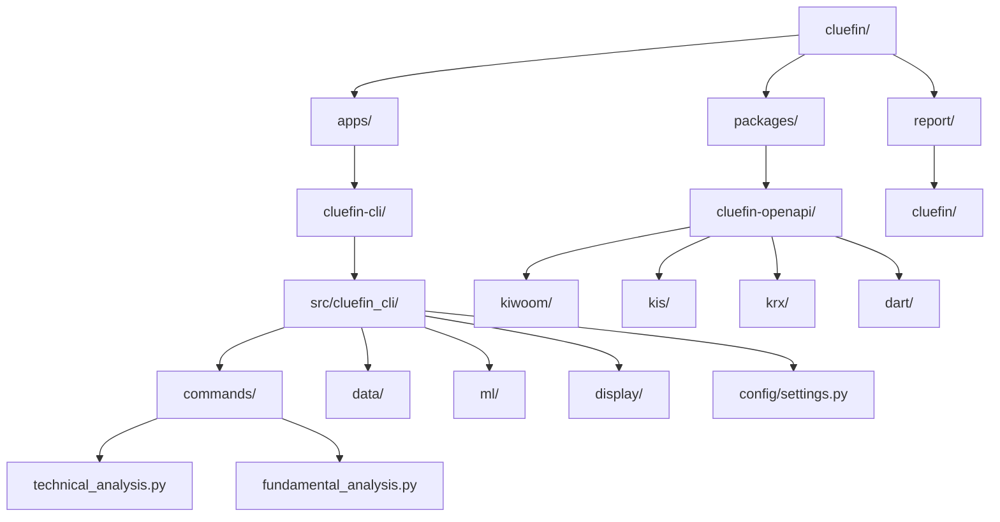

# Cluefin 프로젝트 종합 리포트 (Codex Edition)

> Cluefin은 한국 금융 시장을 대상으로 기술적·기초적 분석, 머신러닝 기반 예측, AI 인사이트를 제공하는 파이썬 워크스페이스입니다. 본 문서는 `@source/cluefin` 코드를 기반으로 프로젝트의 구조, 아키텍처, 운영 및 개발 지침을 체계적으로 정리한 기술 보고서입니다.

- 문서 버전: 2025-02-15 Codex 작성본  
- 원본 저장소: https://github.com/kgcrom/cluefin  
- 적용 대상: 개발자, 퀀트 리서처, 데이터 애널리스트, 자동 투자 시스템 개발자, 테크니컬 라이터

---

## 1. 프로젝트 개요

### 1.1 목적과 기능
- **투자 의사결정 지원**: 한국 주식 시장 데이터를 통합 분석하여 개인·기관 투자자의 의사결정을 돕는 CLI/라이브러리.
- **자동화된 데이터 수집**: 키움증권, 한국투자증권(KIS), 한국거래소(KRX), 금융감독원 DART의 OpenAPI를 타입 안전한 Python 클라이언트로 래핑.
- **머신러닝 기반 예측**: LightGBM과 TA-Lib 지표 150+개를 활용해 다음 거래일 주가 방향을 예측하고 SHAP 기반 해석을 제공.
- **AI 인사이트 생성**: OpenAI GPT-4와 연동하여 기술적 분석 결과를 자연어 설명으로 요약.
- **터미널 UI**: Rich, plotext를 활용한 대화형 CLI로 차트, 테이블, 패널을 시각화.

### 1.2 문제 정의
- 국내 금융 API는 규격이 상이하고 한글 필드명이 혼용되어 개발 난이도가 높음.
- 실시간 혹은 준실시간 데이터 처리 시 레이트 리밋, 인증, 오류 처리를 직접 구현해야 함.
- 투자 전략 분석은 기술적 지표, 공시 정보, 시장 데이터, AI 분석을 모두 아우르는 통합 도구가 필요.

### 1.3 해결 방법
- **모듈형 워크스페이스**: `uv` 기반 모노레포로 응용 프로그램(`apps/cluefin-cli`)과 API 클라이언트 패키지(`packages/cluefin-openapi`)를 분리.
- **타입 안전성 강화**: Pydantic 모델과 dataclass를 조합해 API 응답을 검증하고 IDE 친화적인 타입 힌트를 제공.
- **인증·레이트리밋 내장**: TokenBucket 기반 레이트 리미터, OAuth2 토큰 발급, 요청 재시도 로직을 클라이언트에 캡슐화.
- **머신러닝 파이프라인**: FeatureEngineer → StockPredictor → SHAPExplainer로 이어지는 파이프라인을 구축하고, SMOTE/클래스 가중치로 불균형 데이터를 완화.
- **CLI 커맨드 레이어**: Click 명령어로 기술적 분석(`ta`), 기초적 분석(`fa`)을 제공하고 비동기 이벤트 루프(`asyncio.run`)를 통해 데이터 수집과 분석을 조정.

### 1.4 핵심 기능
- **기술적 분석 (`cluefin-cli ta`)**
  - OHLCV 데이터 수집, 이동평균·RSI·MACD·Bollinger Band·Stochastic 계산
  - 터미널 차트(가격, 거래량, RSI, MACD) 렌더링
  - 머신러닝 예측, 피처 중요도, SHAP 기반 설명
  - GPT-4 기반 자연어 인사이트
- **기초적 분석 (`cluefin-cli fa`)**
  - DART 공시 기반 재무제표/지표/배당/주요 주주 정보 조회
  - Rich 테이블 패널 출력
- **cluefin-openapi 패키지**
  - **Kiwoom**: 계좌, 주문, 차트, 랭킹, 섹터, 테마 등 20+ 엔드포인트
  - **KIS**: 국내·해외 계좌, 시세, 시장 분석, 실시간 데이터
  - **KRX**: 지수, 종목, ETF/ETN, 채권, 파생, ESG 데이터
  - **DART**: 공시 메타데이터, 재무제표, 대량보유 상황, 배당 정보 등

### 1.5 대상 사용자 및 사용 사례
- **개인 투자자**: 한국 주식 종목의 기술적·기초적 분석을 빠르게 확인.
- **퀀트/데이터 사이언티스트**: API 클라이언트를 활용한 데이터 파이프라인 구축.
- **핀테크 개발자**: 레이트 리밋·인증 로직이 내장된 클라이언트를 서비스에 통합.
- **리서치 애널리스트**: 공시 기반 재무/배당/지배구조 데이터를 정형화해 리포트 작성.
- **교육 및 연구**: 머신러닝 예측 파이프라인, SHAP 해석 예제를 학습용으로 활용.

---

## 2. 기술 아키텍처

### 2.1 고수준 시스템 아키텍처

```mermaid
flowchart LR
    U[사용자 / 스크립트] -->|CLI 명령| CLI[cluefin-cli (Click + Rich)]
    subgraph CLI["CLI 애플리케이션 계층"]
        CMD[Command Layer<br/>ta / fa]
        DF[DataFetcher & Fundamentals]
        ML[ML Pipeline<br/>(FeatureEngineer + LightGBM + SHAP)]
        AI[AIAnalyzer<br/>(OpenAI GPT-4)]
        DISP[Display Layer<br/>(Rich / plotext)]
    end
    subgraph OPENAPI["cluefin-openapi 패키지"]
        KIW[Kiwoom Client<br/>(OAuth2, Rate Limit, Cache)]
        KIS[KIS Client<br/>(REST/OAuth2)]
        KRX[KRX Client<br/>(AUTH_KEY, GET)]
        DART[DART Client<br/>(REST + XML/JSON)]
    end
    CMD --> DF
    DF -->|동기 요청| KIW
    DF --> KRX
    CMD --> ML
    ML --> DF
    CMD --> AI
    AI -->|chat completions| OpenAI[(OpenAI API)]
    KIW -->|REST| Kiwoom[(Kiwoom OpenAPI)]
    KIS -->|REST| KIS_API[(한국투자증권 OpenAPI)]
    KRX -->|REST| KRX_API[(KRX DataOpenAPI)]
    DART -->|REST| DART_API[(금융감독원 DART)]
    DF --> DISP
    ML --> DISP
    AI --> DISP
```

### 2.2 기술 스택

| 계층 | 기술 / 라이브러리 | 설명 |
| --- | --- | --- |
| 언어/런타임 | Python 3.10+, uv | uv 워크스페이스로 패키지·앱을 동시에 관리 |
| CLI 프레임워크 | Click, Rich, plotext | 명령어 정의, 컬러 터미널 UI, ASCII 차트 |
| 데이터 처리 | pandas, numpy | 시계열 처리, 데이터 프레임 변환 |
| 머신러닝 | LightGBM, scikit-learn, imbalanced-learn, SHAP, TA-Lib | 분류 모델, 불균형 처리, 피처 생성, 해석 |
| HTTP 클라이언트 | requests, loguru | REST 호출, 로깅 |
| 설정/타입 | Pydantic v2, pydantic-settings, dataclass | 응답 모델 검증, 설정 관리 |
| 인증/보안 | OpenAI SDK, SecretStr | API 키 관리, GPT-4 연동 |
| 품질 관리 | pytest, requests-mock, coverage, ruff, pytest-asyncio | 테스트, 모킹, 커버리지, 린팅 |

### 2.3 주요 종속성

| 패키지 | 버전 (pyproject 기준) | 용도 / 비고 |
| --- | --- | --- |
| `cluefin-openapi` | 0.2.1 | 워크스페이스 내부 패키지 |
| `click` | ≥8.1.7 | CLI 명령 정의 |
| `rich` | ≥13.7.0 | 터미널 렌더링 |
| `plotext` | ≥5.2.8 | ASCII 차트 |
| `pandas` | ≥2.0.0 | 데이터 분석 |
| `lightgbm` | ≥4,<5 | ML 모델 |
| `TA-Lib` | ≥0.4.25 (시스템 종속) | 기술적 지표 계산 |
| `openai` | ≥1.0.0 | GPT-4 연동 |
| `pydantic` | 2.11.7 | 데이터 모델 |
| `loguru` | ≥0.7.3 | 구조화된 로깅 |
| `scikit-learn`, `imbalanced-learn` | 최신 | 전처리, SMOTE |

### 2.4 디자인 패턴 및 아키텍처 결정
- **레이어드 아키텍처**: CLI ↔ 데이터 수집 ↔ API 클라이언트 ↔ 외부 서비스로 명확히 분리.
- **TokenBucket 레이트 리미터** (`cluefin_openapi/kiwoom/_rate_limiter.py`): 외부 API 트래픽 제어.
- **요청 캐시 패턴**: `SimpleCache` 옵션을 통해 동일 요청을 캐시 (TTL 300초 기본).
- **Pydantic 모델 + dataclass 래퍼**: REST 응답을 `KiwoomHttpResponse[T]` 등으로 래핑해 헤더/바디를 분리.
- **의존성 주입 스타일**: CLI 계층이 `DataFetcher`, `StockMLPredictor`, `AIAnalyzer` 등 구성 요소를 런타임에 조합.
- **비동기 경계**: CLI는 `asyncio.run`으로 비동기 컨텍스트를 관리하지만, 내부 API 클라이언트는 동기 호출(추후 개선 여지).
- **설정 로더**: Pydantic Settings가 `.env`를 자동 로드해 민감 정보를 코드에서 분리.
- **테스트 전략**: requests-mock 기반 단위 테스트 + 실제 API 키가 필요한 통합 테스트(`@pytest.mark.integration`).

### 2.5 구성 요소 상호작용 및 데이터 흐름
1. 사용자가 `cluefin-cli ta 005930 --chart --ml-predict --ai-analysis` 명령 실행.
2. Click이 옵션 파싱 → `asyncio.run(_analyze_stock)` 호출.
3. `DataFetcher`가 .env에서 인증 정보를 로드 → Kiwoom Auth로 토큰 발급 → 차트/정보 엔드포인트 호출 → pandas DataFrame 생성.
4. `TechnicalAnalyzer`가 지표 계산 → `ChartRenderer`가 plotext로 ASCII 차트 렌더링.
5. `StockMLPredictor`가 FeatureEngineer를 통해 TA-Lib 지표, 사용자 지표를 결합 → SMOTE/클래스 가중치 적용 → LightGBM 학습 → 예측/SHAP 분석 → Rich Panel 출력.
6. 옵션에 따라 `AIAnalyzer`가 GPT-4 모델에 프롬프트 전달 → 자연어 요약을 Panel로 출력.
7. `fundamental_analysis` 명령은 DART 클라이언트를 통해 공시 데이터를 가져와 Rich 테이블에 표시.

---

## 3. 프로젝트 구조

### 3.1 디렉터리 개요

| 경로 | 설명 | 주요 파일 / 서브디렉터리 |
| --- | --- | --- |
| `pyproject.toml` | uv 워크스페이스 루트. 패키지 멤버, 의존성 그룹, pytest/ruff 설정. | `tool.uv.workspace`, `dependency-groups.dev`, `tool.pytest.ini_options` |
| `uv.lock` | 잠금 파일. 모든 런타임/빌드 의존성 버전 고정. | - |
| `apps/cluefin-cli/` | CLI 애플리케이션 소스. | `main.py`, `src/cluefin_cli`, `tests`, `.env.sample` |
| `packages/cluefin-openapi/` | 금융 OpenAPI 클라이언트 패키지. | `src/cluefin_openapi`, `tests` |
| `packages/cluefin-openapi/src/cluefin_openapi/kiwoom/` | 키움증권 REST 엔드포인트 모듈. | `_client.py`, `_auth.py`, `_domestic_*.py` |
| `packages/cluefin-openapi/src/cluefin_openapi/kis/` | 한국투자증권 API 모듈. | `_client.py`, `_domestic_*`, `_overseas_*` |
| `packages/cluefin-openapi/src/cluefin_openapi/krx/` | KRX 데이터 API. | `_client.py`, `_index.py`, `_stock.py` 등 |
| `packages/cluefin-openapi/src/cluefin_openapi/dart/` | DART 공시 API. | `_client.py`, `_public_disclosure.py`, `_periodic_report_*` |
| `report/cluefin/` | 분석 결과 리포트. | `report-codex.md` (본 문서) 外 |

### 3.2 설계 근거
- **모노레포 + 워크스페이스**: 애플리케이션과 재사용 가능한 API 클라이언트를 동일 저장소에서 버전체계화.
- **`apps/` vs `packages/` 경계**: 배포 대상(파이썬 패키지)과 실행 애플리케이션을 분리해 의존성 관리 용이.
- **타입 모듈 분리**: `_types.py` 파일에 Pydantic 모델을 모아 API 응답 구조를 문서화.
- **테스트 병렬 구조**: 각 패키지/앱마다 `tests/` 디렉터리 배치, 통합 테스트는 마커로 구분.
- **`.env.sample` 제공**: 필수 인증 키를 샘플 파일로 안내해 초기 설정 장벽 감소.

### 3.3 프로젝트 계층 Mermaid 다이어그램



---

## 4. 설치 및 설정

### 4.1 전제 조건 및 시스템 요구사항
- 운영체제: macOS, Linux (TA-Lib 빌드를 위해). Windows는 WSL 권장.
- Python: 3.10 이상 (uv 가상환경 사용 권장).
- 패키지 매니저: [uv](https://github.com/astral-sh/uv) 0.4+.
- 시스템 라이브러리:
  - `TA-Lib`, `lightgbm` (macOS: `brew install ta-lib lightgbm`)
  - C/C++ 컴파일러 (머신러닝 라이브러리 빌드용)
- 외부 API 키:
  - KIWOOM_APP_KEY / SECRET_KEY
  - KIS_APP_KEY / SECRET_KEY (선택)
  - KRX_AUTH_KEY
  - DART_AUTH_KEY (`fa` 명령 필수)
  - OPENAI_API_KEY (AI 분석 옵션 사용 시)

### 4.2 설치 절차
1. 리포지토리 클론
   ```bash
   git clone https://github.com/kgcrom/cluefin.git
   cd cluefin
   ```
2. 가상환경 생성 및 활성화
   ```bash
   uv venv --python 3.10
   source .venv/bin/activate
   ```
3. 워크스페이스 동기화
   ```bash
   uv sync --all-packages
   ```
4. 환경 변수 준비
   ```bash
   cp apps/cluefin-cli/.env.sample .env
   # 필요 키 입력 후 저장
   ```
5. 설치 검증
   ```bash
   uv run cluefin-cli --help
   ```

### 4.3 구성 지침

| 변수 | 위치 | 용도 |
| --- | --- | --- |
| `KIWOOM_APP_KEY`, `KIWOOM_SECRET_KEY` | `.env` | 키움증권 OAuth2 인증 |
| `KIWOOM_ENV` | `.env` | `dev` (모의) / `prod` (실거래) 전환 |
| `KRX_AUTH_KEY` | `.env` | 한국거래소 인증키 |
| `DART_AUTH_KEY` | `.env` | DART 공시 데이터 접근 키 |
| `OPENAI_API_KEY` | `.env` | GPT-4 기반 AI 분석 |
| `KIS_APP_KEY`, `KIS_SECRET_KEY`, `KIS_ENV` | (필요 시) | KIS API 통합 시 사용 |

> 민감 정보는 `.env`에만 저장하고, VCS에 커밋하지 않도록 주의합니다.

### 4.4 일반적인 문제 해결
- **TA-Lib 미설치 오류**: `ImportError: libta_lib.dylib` 발생 시 패키지를 먼저 설치하고 `uv sync`를 재실행.
- **Kiwoom 토큰 오류**: `KiwoomAuthenticationError` → 키/비밀번호/환경(dev/prod) 확인 후 토큰 재발급.
- **DART 000 이외 코드**: `ValueError: DART API error` → 계정 승인 여부 및 `DART_AUTH_KEY` 검증.
- **OpenAI API 오류**: `openai.BadRequestError` 또는 `401` → 모델 이름(`gpt-4`), API 버전, 키 유효성 확인.
- **레이트 리밋**: `KiwoomRateLimitError` 발생 시 호출 간 지연 혹은 캐시 옵션 활성화 고려.
- **비동기 루프 오류** (`RuntimeError: Event loop is closed`): Windows/WSL 사용 시 `uv run python -m cluefin_cli.main` 대신 `python -m cluefin_cli.main` 직접 실행.

---

## 5. 사용 가이드

### 5.1 기본 CLI 사용 예제

```bash
# 삼성전자(005930) 기술적 분석
cluefin-cli ta 005930

# 차트 포함
cluefin-cli ta 005930 --chart

# AI 요약, ML 예측, SHAP 설명까지 전체 분석
cluefin-cli ta 005930 --chart --ai-analysis --ml-predict --shap-analysis

# 기초적 분석 (2023년 사업보고서, 상위 3대 주주)
cluefin-cli fa 005930 --year 2023 --report annual --max-shareholders 3
```

### 5.2 Python API 사용 (cluefin-openapi)

```python
from pydantic import SecretStr
from cluefin_openapi.kiwoom._auth import Auth
from cluefin_openapi.kiwoom._client import Client

auth = Auth(app_key="...", secret_key=SecretStr("..."), env="dev")
token = auth.generate_token()

client = Client(token=token.get_token(), env="dev", enable_caching=True)
res = client.stock_info.get_stock_info("005930")

print(res.headers.api_id, res.body.stk_nm, res.body.cur_prc)
```

### 5.3 고급 기능
- `--feature-importance`: LightGBM 내장 중요도 Top N 피처 출력.
- `--shap-analysis`: SHAP 기반 글로벌/개별 피처 영향도 시각화.
- `--ml-predict` 활성화 시 최소 30일 데이터 필요, 50 샘플 미만일 경우 신뢰도 경고.
- FundamentalDataFetcher는 공시 데이터를 캐싱하지 않으므로 빈번 호출 시 제한 대비 필요.

### 5.4 구성 옵션
- `--chart / -c`: plotext 활용 차트(가격/거래량/RSI/MACD) 출력.
- `--ai-analysis / -a`: GPT-4 분석 (OPENAI_API_KEY 필수).
- `--ml-predict / -m`: 머신러닝 파이프라인 실행.
- `--feature-importance / -f`: LightGBM 피처 중요도 출력 (`--ml-predict` 암시적 활성화).
- `--shap-analysis / -s`: SHAP 해석 출력 (`--ml-predict` 필요).
- Fundamental 옵션
  - `--year`: DART 사업연도 (기본 최근 회계연도).
  - `--report`: `annual`, `half`, `q1`, `q3`.
  - `--max-shareholders`: 기본 5명, 1~20 범위.

### 5.5 API 문서 (주요 엔드포인트 개요)

| 모듈 | 대표 엔드포인트 | 기능 |
| --- | --- | --- |
| `kiwoom._domestic_stock_info` | `get_stock_info`, `get_total_institutional_investor_by_stock` | 종목 기본 정보, 기관/외인 거래 동향 |
| `kiwoom._domestic_chart` | `get_stock_daily` | 일봉/주봉/월봉 조회 (TODO: 주봉/월봉 확장) |
| `kiwoom._domestic_account` | `get_daily_stock_realized_profit_loss_by_date` 등 | 계좌 손익, 보유 종목 |
| `krx._index` | `get_kospi`, `get_kosdaq` | 지수 시계열/체결 데이터 |
| `dart._public_disclosure` | `company_overview`, `corp_code` | 기업 개요, 법인 코드 맵 |
| `dart._periodic_report_financial_statement` | `get_single_company_major_accounts`, `get_single_company_major_indicators` | 재무제표, 주요 지표 |

### 5.6 CLI 명령어 참조

| 명령 | 설명 | 주요 옵션 |
| --- | --- | --- |
| `cluefin-cli ta [STOCK_CODE]` | 기술적 분석, 차트, ML, AI 인사이트 | `--chart`, `--ai-analysis`, `--ml-predict`, `--feature-importance`, `--shap-analysis` |
| `cluefin-cli fa [STOCK_CODE]` | DART 기반 기초적 분석 | `--year`, `--report {annual,q1,half,q3}`, `--max-shareholders` |

---

## 6. 개발 지침

### 6.1 개발 환경 설정
1. `.venv` 생성 및 uv sync (설치 섹션 참조).
2. `.env` 작성 후 **테스트 시 모의키 사용** (통합 테스트 제외).
3. IDE 설정: Ruff(PEP8 확장), Black(선택) 적용. 라인 길이 120.
4. pre-commit 훅은 기본 제공되지 않으므로 필요 시 직접 설정.

### 6.2 코드 스타일 및 규칙
- Ruff 설정(`tool.ruff`)에 따라 E/F/W/B/Q/I/ASYNC/T20 룰 검사, `E501`(라인 길이) 무시.
- Docstring 내부 코드 블록 자동 포맷 (`docstring-code-format=true`).
- 타입 힌트 적극 활용 (Pydantic v2, dataclass).
- 로깅은 `loguru` 사용, `logger` 전역 인스턴스 재사용.
- 한국어 필드명은 `Field(..., alias="kr-field")`로 유지.

### 6.3 테스트 절차 및 커버리지

| 명령 | 설명 |
| --- | --- |
| `uv run pytest` | 전체 테스트 (통합 포함) |
| `uv run pytest -m "not integration"` | 단위 테스트만 실행 |
| `uv run pytest -m "integration"` | 통합 테스트 (실 API 키 필요) |
| `uv run pytest packages/cluefin-openapi/tests/kiwoom/test_kiwoom_auth_unit.py -v` | 특정 모듈 테스트 |
| `uv run pytest --cov=cluefin_openapi --cov-report=html` | 커버리지 리포트 생성 |

테스트 포인트:
- requests-mock을 통한 HTTP 호출 모킹.
- ML 파이프라인 통합 테스트(`apps/cluefin-cli/tests/unit/ml/test_ml_pipeline.py`)는 실제 LightGBM 학습 및 예측 흐름 검증.
- TODO: CLI 명령어에 대한 엔드투엔드 테스트, 비동기 처리에 대한 asyncio 테스트 보완.

### 6.4 기여 가이드라인
- 포크 → 브랜치 생성 (`feature/<name>`).
- 변경 사항 커밋 (`git commit -m "feat: ..."`) 후 PR.
- 테스트 및 린트 결과를 PR 설명에 명시.
- 통합 테스트 실행 시 Mock 키 또는 제한된 범위에서 수행, 보안상 실제 키 노출 금지.
- 주요 변경에는 README/문서 업데이트 필수.

---

## 7. 추가 정보

### 7.1 성능 고려사항
- Kiwoom/KRX API는 호출당 200~500ms 수준, 레이트 리밋 초과 시 재시도 지연(지수 백오프). 배치 호출 시 `batch_post` 활용 가능.
- TA-Lib 피처 생성은 150+ 지표 계산으로 CPU 집약적 → 필요 없는 지표는 필터링하거나 캐시 적용.
- LightGBM 학습은 수백 샘플 기준 수 초 내 완료, 회차 반복 시 모델/피처 캐시 고려.
- SHAP 해석은 트리 모델 기준 빠르지만 데이터 샘플을 100건 이하로 제한해 초기화.
- DART 데이터는 XML/ZIP 응답이 포함될 수 있으며, `_public_disclosure.corp_code()`는 전체 corp-code 리스트를 내려주므로 로컬 캐시 추천.

### 7.2 보안 고려사항
- `.env`에 저장된 API 키는 SecretStr로 메모리 상에서 은닉하지만, 로그 출력 시 주의.
- OpenAI API 호출 시 비용 발생 및 민감 데이터 전송 가능성 → 최소한 데이터만 전달.
- 로컬에 저장되는 데이터프레임은 별도 암호화하지 않으므로 필요 시 별도 보안 레이어 적용.
- 향후 키 회전, Secrets Manager 연동 고려.

### 7.3 로드맵 및 향후 계획 (코드 기반 추론)
- `DataFetcher.get_stock_data`: 주봉/月봉 통합 TODO → 다중 기간 지원 예정.
- `DataFetcher.get_kospi_index_series`: 실시간 조회 방식 탐색 TODO → 최신 데이터 소스 교체 필요.
- KIS/KRX/DART 클라이언트는 `_todo` 주석 기반으로 SecretStr 도입, timeout 파라미터 정리 등 리팩토링 예정.
- CLI 비동기 구조 개선(동기 HTTP 호출을 비동기 화) 및 streaming UI 확대 가능성.
- 프로젝트에 GraphQL/REST 문서화 도구(Sphinx, mkdocs) 도입 여지.

### 7.4 라이선스 및 저작권
- 전체 프로젝트는 **MIT License** (Copyright © 2025 Hangoo Kang).
- 상업적 사용 가능하나, OpenAPI 사용 약관(키움, KIS, KRX, DART) 및 OpenAI 정책 준수 필요.
- README의 디스클레이머에 따라 실거래 목적 사용 시 전적인 사용자 책임.

---

## 부록: 참고 자료
- [키움증권 OpenAPI 포털](https://openapi.kiwoom.com/)
- [한국투자증권 OpenAPI 포털](https://apiportal.koreainvestment.com/)
- [한국거래소 Data Open API](http://openapi.krx.co.kr/)
- [금융감독원 DART OpenAPI](https://opendart.fss.or.kr/)
- [uv 패키지 매니저](https://github.com/astral-sh/uv)

> _"더 스마트하게 투자하세요, 어렵게 하지 말고 Cluefin과 함께."_
