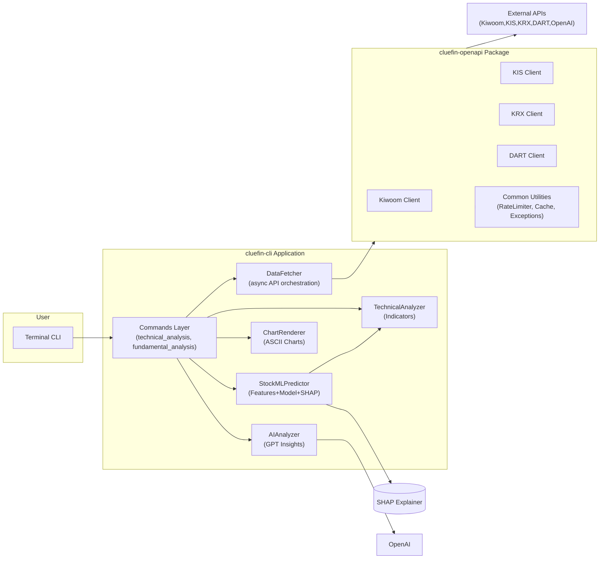
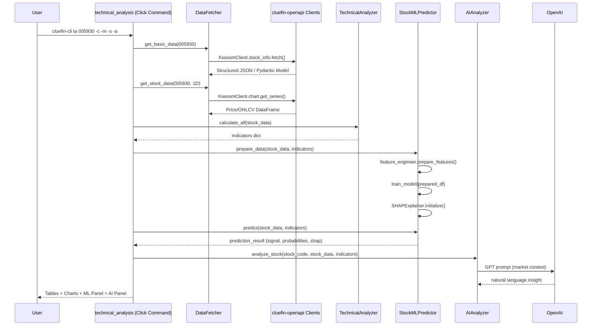
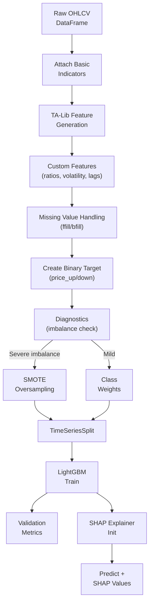
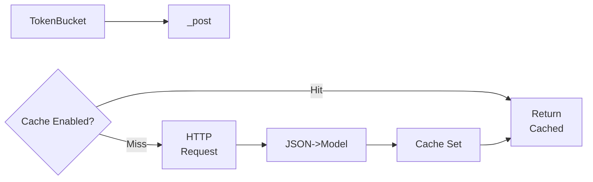
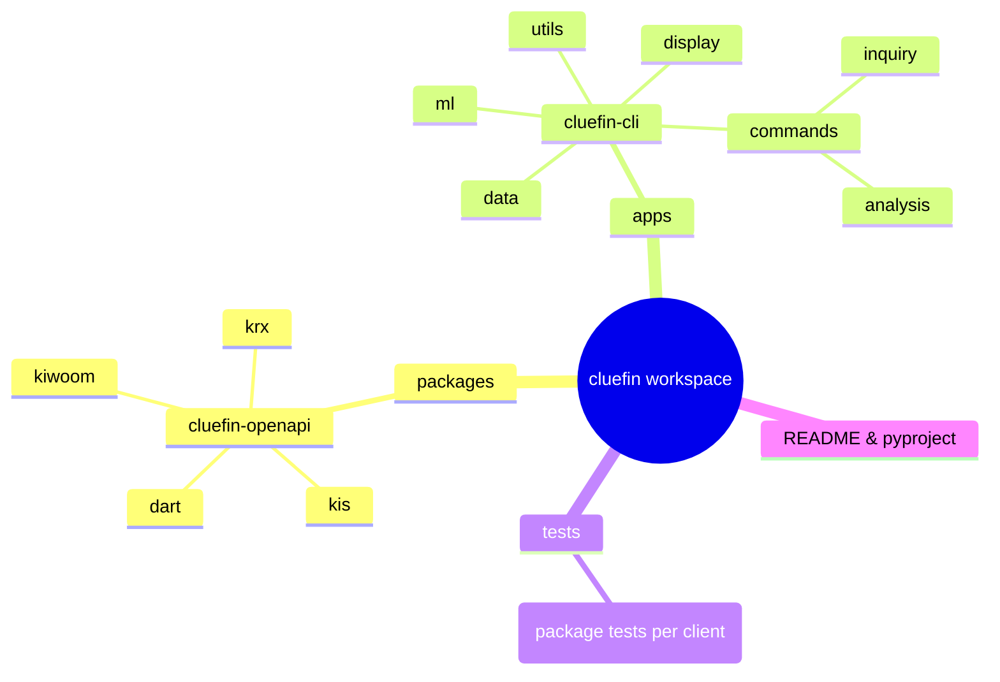
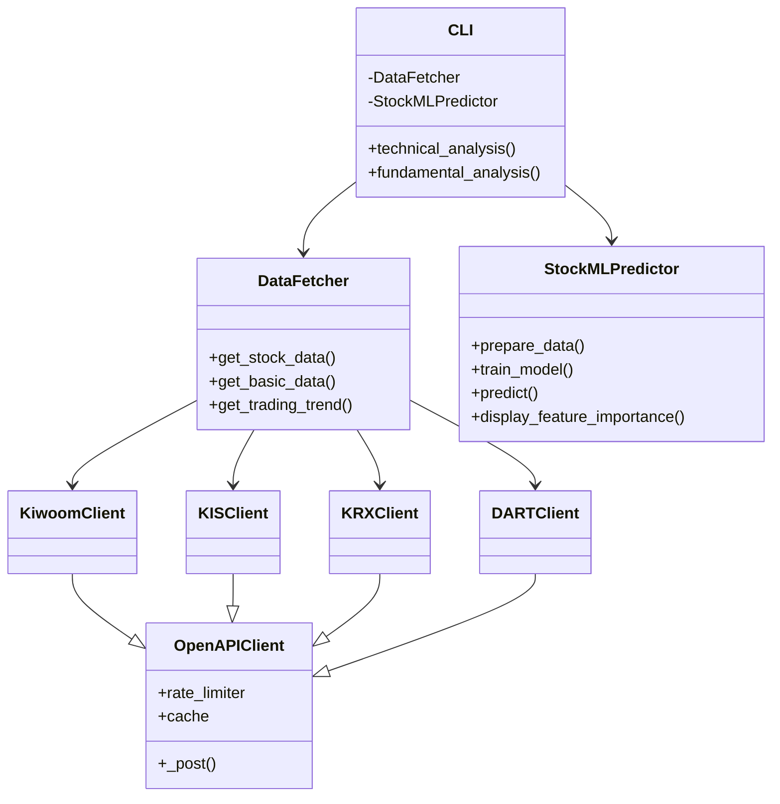

# Cluefin 종합 기술 문서 (Copilot GPT-5 Generated)

> Clearly Looking U Entered Financial Information – 한국 금융 투자 분석, 자동화, ML/AI 인사이트를 위한 **Python 기반 금융 엔지니어링 모노레포**.
>
> 본 문서는 코드 기반 심층 분석을 토대로 프로젝트 목적, 구조, 아키텍처, 설치/사용/개발 지침 및 향후 계획을 포괄적으로 제공합니다.

---
## 1. 프로젝트 개요 (Project Overview)
### 1.1 문제 정의
한국 주식/금융 시장 데이터는 다음과 같은 현실적 문제를 가집니다:
- 여러 이질적 API (Kiwoom, KIS, KRX, DART) 각각 상이한 인증/호출/응답 포맷
- 실시간/지연/공시 데이터 병합과 구조화의 난이도
- 품질 편차, 레이트 리밋, 오류 핸들링 부족
- 기술적/펀더멘털/ML 분석을 단일 워크플로우로 연결하기 어려움
- 반복적 분석/리포팅/예측 파이프라인 자동화 필요

Cluefin은 위 문제를 **표준화된 타입 안전 API 클라이언트 + 대화형 CLI + ML 예측 파이프라인**으로 통합 해결합니다.

### 1.2 프로젝트 목적
1. 한국 금융 데이터 획득을 단순화 (통합 OpenAPI 패키지)
2. 실시간/일봉/랭킹/섹터/공시 데이터를 한 지점에서 처리
3. 기술적 지표 계산과 ML 기반 단기 방향성(Up/Down) 예측 제공
4. SHAP 기반 해석가능성으로 ML 결과 설명
5. AI (GPT) 기반 자연어 시장/종목 인사이트 자동 생성
6. 모노레포/워크스페이스(uv) 구조로 확장성 높은 모듈 개발 지원

### 1.3 해결 접근 (Solution Approach)
- Workspace Monorepo + `uv` 의존성 관리로 패키지 간 일관성 유지
- `packages/cluefin-openapi`: 각 기관별 클라이언트(토큰, 레이트리밋, 캐싱, 예외 모델)
- `apps/cluefin-cli`: Rich + Click 기반 CLI, 데이터 수집 → 지표 계산 → ML 예측 → AI 인사이트
- Feature Engineering: TA-Lib + 커스텀 파생 피처 150+ 생성
- LightGBM + TimeSeriesSplit + SMOTE/Class Weight 조합으로 불균형 완화 및 시계열 유효성 확보
- SHAP TreeExplainer로 글로벌/로컬 Feature 영향 분석
- 안정성: 재시도(backoff), RateLimiter(TokenBucket), 캐시(SimpleCache), 구조화된 오류 계층

### 1.4 핵심 기능 요약
| 영역 | 기능 | 세부 설명 |
|------|------|-----------|
| 데이터 | 통합 API | Kiwoom/KIS/KRX/DART 타입 안전 클라이언트 & 인증 처리 |
| 기술 분석 | 지표/차트 | RSI, MACD, Bollinger, 이동평균, 거래량, ASCII 차트 렌더링 |
| 펀더멘털 | 공시 파싱 | Periodic Report, Major Shareholder, Sector/Theme 랭킹 |
| ML | 예측 파이프라인 | LightGBM 분류 (익일 방향), TimeSeriesSplit, SMOTE, Class Weights |
| 해석 | SHAP | Top-N 중요도, 개별 예측 설명 패널 |
| AI | 자연어 인사이트 | GPT 기반 시장/종목 서술, 리스크 및 시그널 요약 |
| CLI | 명령 기반 UX | `ta`, `fa`, (확장 가능) & 옵션 플래그 처리 |
| 품질 | 테스트/린트 | Ruff 규칙, Pytest 마커(통합/단위), 코드 커버리지 보고 |

### 1.5 대상 사용자
- 개인 투자자 / 퀀트 학습자
- 데이터 사이언티스트 (한국 주식 ML 실험)
- 핀테크 프로토타입 개발자
- 리서치 팀 (공시+실시간 시장 요약 자동화)

### 1.6 대표 사용 사례
| 시나리오 | 설명 |
|----------|------|
| 단일 종목 종합 기술 분석 | `cluefin-cli ta 005930 --chart --ai-analysis --ml-predict --shap-analysis` |
| 공시 기반 펀더멘털 조회 | `cluefin-cli fa 005930 --year 2023 --report annual` |
| ML 모델 실험 & 피처 중요도 | 모델 학습 후 SHAP/FeatureImportance 확인 |
| 새로운 API 클라이언트 추가 | `packages/cluefin-openapi` 내 새 기관 디렉토리 추가 후 테스트 작성 |
| 배치 자동화 | Cron에서 CLI 명령 실행 후 리포트 텍스트 저장 |

---
## 2. 기술 아키텍처 (Technical Architecture)
### 2.1 고수준 시스템 아키텍처


### 2.2 구성 요소 상호작용 시퀀스 (예: 기술 분석 + ML + AI)


### 2.3 데이터 흐름 (ML 파이프라인 Internal)


### 2.4 기술 스택
| Layer | Tech |
|-------|------|
| 언어 | Python 3.10+ |
| 패키지 관리 | uv workspace |
| CLI UI | Click, Rich, plotext |
| 분석 | pandas, TA-Lib |
| ML | LightGBM, numpy, scikit-learn, SHAP, imbalanced-learn (SMOTE) *(가정: feature_engineer 내 사용)* |
| API 통신 | requests, rate limiting(TokenBucket), caching(SimpleCache) |
| 모델링 구조 | Pydantic(설정 & 타입), LightGBM Wrapper |
| 품질 | pytest, requests-mock, ruff, coverage |
| AI | OpenAI API |

### 2.5 주요 종속성 및 역할
| Dependency | Role | Notes |
|------------|------|-------|
| `requests` | HTTP 통신 | 세션 재사용, timeout & retries 구현 |
| `loguru` | 로깅 | debug 모드 조건부 활성화 |
| `pandas` | 데이터 프레임 처리 | OHLCV & 지표 구조화 |
| `lightgbm` | ML 모델 | 분류, feature importance 제공 |
| `shap` | 해석가능성 | TreeExplainer 기반 |
| `ta-lib` | 기술적 지표 | 다수 표준 지표 계산 |
| `rich` | 출력 포맷 | 표, 패널, 색상 렌더링 |
| `click` | CLI 파서 | 명령/옵션 선언형 구성 |
| `uv` | 워크스페이스 의존성 | 멀티 패키지 동기화 |

### 2.6 디자인 패턴 & 적용 사례
| Pattern | 적용 위치 | 설명 |
|---------|-----------|------|
| Facade | DataFetcher | 다중 API 클라이언트 호출을 단일 인터페이스로 래핑 |
| Strategy | Feature Engineering | 다양한 지표/피처 생성 로직 확장 가능 구조 |
| Decorator (개념적) | Caching + RateLimiter | _post 호출 체인에서 부가 기능 적용 |
| Factory | krx/_factory.py | 다양한 상품/지수 객체 생성 (확장 지점) |
| Repository (유사) | fetcher.py | 데이터 읽기 추상화 (소스 교체 가능) |
| Adapter | openapi clients | 외부 API → 내부 Pydantic 모델 변환 |
| Layered Architecture | CLI → Service(Data/ML) → API Client → External API | 책임 분리 및 테스트 용이성 |

### 2.7 핵심 아키텍처 결정 (ADR 요약)
| 결정 | 이유 | 대안 비교 |
|-------|------|-----------|
| LightGBM 사용 | 탁월한 tabular + 빠른 학습, SHAP 호환 | XGBoost: 유사 성능, CatBoost: 범주형 장점 있지만 복잡성 증가 |
| TimeSeriesSplit | 누적 미래 정보 누출 방지 | Random K-Fold: 시계열 데이터 부적합 |
| SMOTE/Class Weight 혼합 | 불균형 상황 대응 (Up/Down 비율) | 단순 언더샘플링: 정보 손실 위험 |
| uv workspace | 다중 패키지 일관 관리 | pip only: 버전 충돌 처리 어려움 |
| Rich CLI | 가독성 향상, 분석정보 시각화 | 단순 print: 정보 밀도 낮음 |
| Pydantic 모델 | 필드 검증 & 직렬화 표준화 | dataclass: 타입 검증 부족 |
| TokenBucket RateLimiter | API 한도 예측 가능 | Fixed window: burst 처리 불리 |
| Caching (SimpleCache) | 동일 요청 반복 최소화 | Redis: 운영 복잡성 증가 (추후 확장 가능) |

### 2.8 오류/예외 모델링
- 세분화된 예외: `KiwoomAuthenticationError`, `KiwoomRateLimitError`, `KiwoomValidationError` 등
- 재시도 로직: HTTP 5xx & Timeout → 지수 backoff
- 429 → Retry-After 기반 대기 또는 한도 초과 에러 발생

### 2.9 성능 고려 흐름


---
## 3. 프로젝트 구조 (Project Structure)
### 3.1 디렉토리 계층 요약


### 3.2 실제 구조 설명
| 경로 | 유형 | 설명 | 비고 |
|------|------|------|------|
| `pyproject.toml` | Workspace 설정 | uv members, ruff/pytest 설정 | 공통 Dev 설정 |
| `packages/cluefin-openapi/` | 패키지 | 모든 한국 금융 API 클라이언트 | 재사용/타입 안전 |
| `packages/cluefin-openapi/src/cluefin_openapi/kiwoom/` | 서브모듈 | 계좌/차트/주문/랭킹/테마 등 객체화 | Rate limit+Cache 활용 |
| `packages/cluefin-openapi/src/cluefin_openapi/kis/` | 서브모듈 | 국내/해외 시세, 랭킹, 시장 분석 | OAuth/token 기반 |
| `packages/cluefin-openapi/src/cluefin_openapi/krx/` | 서브모듈 | 지수, 채권, 파생, ESG 데이터 | Factory 포함 |
| `packages/cluefin-openapi/src/cluefin_openapi/dart/` | 서브모듈 | 공시/주주/재무 데이터 | 보고서 타입 모델 |
| `apps/cluefin-cli/src/cluefin_cli/commands/technical_analysis.py` | CLI 명령 | `ta` 주식 기술 분석 엔트리 | 비동기 ↔ 동기 조합 |
| `apps/cluefin-cli/src/cluefin_cli/commands/analysis/` | 분석 | AI, 지표 계산 모듈 | 확장 지표 추가 지점 |
| `apps/cluefin-cli/src/cluefin_cli/commands/inquiry/` | 시장 조회 | 메뉴 기반 종목 탐색 | 인터랙티브 확장 |
| `apps/cluefin-cli/src/cluefin_cli/data/fetcher.py` | 데이터 계층 | API 호출 집약 & 통합 반환 | Facade 역할 |
| `apps/cluefin-cli/src/cluefin_cli/ml/` | ML 파이프라인 | 모델, 피처, 해석, 진단 | 학습+예측+SHAP |
| `apps/cluefin-cli/src/cluefin_cli/display/charts.py` | 시각화 | 터미널 ASCII 차트 렌더링 | plotext 사용 |
| `apps/cluefin-cli/src/cluefin_cli/utils/formatters.py` | 유틸 | 통화/숫자 포맷 한국형 | 표시 일관성 |
| `packages/cluefin-openapi/tests/` | 테스트 | 유닛 + 통합 + 케이스 JSON | API 안정성 확인 |
| `apps/cluefin-cli/tests/` | 테스트 | ML 파이프라인/커맨드 테스트 | 회귀 방지 |

### 3.3 구조 설계 근거
- API/CLI/ML 책임 분리 → 독립적 확장 & 테스트 용이
- monorepo: 버전 정합성과 공통 개발 표준 적용 간편
- 패키지 vs 앱 구분: 라이브러리 재사용성 vs 실행 애플리케이션 경계 명확
- ML 모듈 세분화: feature engineering / models / explainer / diagnostics → 유지보수성 향상

### 3.4 Mermaid 패키지 레이어 다이어그램


---
## 4. 설치 및 설정 (Installation & Setup)
### 4.1 전제 조건
| 항목 | 최소 요구 |
|------|-----------|
| OS | macOS / Linux (Windows WSL 권장) |
| Python | 3.10+ |
| 패키지 관리자 | uv 설치 |
| 시스템 라이브러리 | TA-Lib, LightGBM (C 컴파일 필요) |
| API Keys (선택적) | KIWOOM_APP_KEY / KIWOOM_SECRET_KEY / KIS_APP_KEY / KIS_SECRET_KEY / KRX_AUTH_KEY / DART_AUTH_KEY / OPENAI_API_KEY |

### 4.2 macOS 설치 단계
```bash
# 1. 필수 라이브러리 설치
brew install ta-lib lightgbm

# 2. 저장소 클론
git clone https://github.com/kgcrom/cluefin.git
cd cluefin

# 3. 가상환경 생성
uv venv --python 3.10
source .venv/bin/activate

# 4. 의존성 동기화
uv sync --all-packages

# 5. 환경 변수 구성
cp apps/cluefin-cli/.env.sample .env
# 편집: .env 파일에 키 입력

# 6. 기본 동작 테스트
cluefin-cli ta 005930 --chart
```

### 4.3 Linux (Ubuntu) 참고 설치
```bash
sudo apt update
sudo apt install -y build-essential python3.10 python3.10-venv libta-lib0 ta-lib
# LightGBM 빌드 필요 시: sudo apt install -y cmake libboost-dev
# uv 설치 (공식 문서 참조)

# 이후 macOS 단계 동일
```

### 4.4 환경 변수 (.env)
| 변수 | 용도 | 비고 |
|------|------|------|
| KIWOOM_APP_KEY | Kiwoom 인증 | dev/prod 환경 분리 |
| KIWOOM_SECRET_KEY | Kiwoom 시크릿 | 보안 유지 |
| KIWOOM_ENV | 환경 선택 | dev / prod |
| KIS_APP_KEY | KIS 인증 | 토큰 발급 |
| KIS_SECRET_KEY | KIS 시크릿 |  |
| KIS_ENV | 환경 선택 | dev / prod |
| KRX_AUTH_KEY | KRX 접근 | 간단 토큰 방식 |
| DART_AUTH_KEY | DART 공시 API |  |
| OPENAI_API_KEY | GPT 분석 | 선택적 기능 |
| ML_MODEL_PATH | 모델 저장 경로 | 기본: models/ |
| ML_CACHE_DIR | 캐시 경로 | 기본: .ml_cache/ |

### 4.5 구성 지침
- API Key는 `.env` 로컬에만 저장, VCS 커밋 금지
- prod 환경 사용 시 Rate Limit 상향 고려 (요청 분배)
- ML 캐시 디렉토리 적절한 디스크 용량 확보 (SHAP 계산 시 메모리 사용 증가)

### 4.6 일반적 문제 해결 (Troubleshooting)
| 증상 | 원인 | 해결 |
|------|------|------|
| `ImportError: libta_lib...` | TA-Lib 미설치 | macOS: `brew install ta-lib`, Linux: 패키지/소스 설치 |
| LightGBM 컴파일 오류 | Build tool 누락 | `sudo apt install build-essential cmake` 후 재설치 |
| 401 인증 실패 | 키/시크릿 오타 또는 만료 | .env 재확인, 토큰 재발급 |
| 429 RateLimit | 과도한 단시간 호출 | 재시도 대기, 요청 수 감소, 캐시 활성화 |
| SHAP 실패 로그 | 모델 또는 background data 부족 | 충분한 학습 데이터 확보(>100), 예측 전 학습 수행 |
| 빈 차트 출력 | 데이터 수집 실패 | 네트워크 로그 확인, API 키 정상 여부 점검 |

---
## 5. 사용 가이드 (Usage Guide)
### 5.1 CLI 기본 사용
```bash
# 기술적 분석 기본
cluefin-cli ta 005930
# 차트 포함
cluefin-cli ta 005930 --chart
# AI + ML + SHAP 풀분석
cluefin-cli ta 005930 --chart --ai-analysis --ml-predict --shap-analysis
# 펀더멘털 분석
cluefin-cli fa 005930 --year 2023 --report annual --max-shareholders 3
```

### 5.2 명령어 & 옵션 정리
| 명령 | 설명 | 주요 옵션 | 비고 |
|------|------|----------|------|
| `ta` | 기술적/시장/ML/AI 분석 | `--chart`, `--ai-analysis`, `--ml-predict`, `--feature-importance`, `--shap-analysis` | 종합 분석 엔트리 |
| `fa` | 펀더멘털/DART 공시 분석 | `--year`, `--report`, `--max-shareholders` | 연간/분기 보고서 |
| (예정) `inquiry` | 인터랙티브 시장 탐색 | (추가 예정) | 메뉴 기반 |

### 5.3 ML 예측 결과 해석
- Signal: BUY/SELL (분류 결과)
- Confidence: 두 클래스 확률 중 최대값
- Feature Importance: LightGBM 트리 분할 기반 가중치
- SHAP: 개별 피처가 예측에 미친 기여 양(양수=상승 기여)

### 5.4 프로그램적 사용 (OpenAPI Clients)
```python
from cluefin_openapi.kiwoom import Client as KiwoomClient

client = KiwoomClient(token="YOUR_TOKEN", env="prod", enable_caching=True, debug=False)
# 계좌 정보 가져오기
account_info = client.account.get_overview()  # (가정: 실제 메서드 예시)
# 차트 데이터
chart_df = client.chart.get_daily_series(stock_code="005930", period="1M")
# 랭킹 정보
ranking = client.rank_info.get_top_market_gainers(limit=10)
```

```python
# 예외 처리 패턴
try:
    data = client.chart.get_daily_series(stock_code="005930", period="3M")
except KiwoomRateLimitError as e:
    # 재시도 또는 대기 로직
    print("Rate limit hit, retry after:", e.retry_after)
except KiwoomAuthenticationError:
    print("Authentication failed; refresh token")
```

### 5.5 기술 지표 확장
`indicators.py` 또는 `feature_engineering.py` 내 함수 추가:
```python
def calculate_new_indicator(df):
    # 입력: OHLCV DataFrame
    # 출력: Series
    return (df['close'] - df['low']) / (df['high'] - df['low']).clip(lower=1e-6)
```
등록 후 `TechnicalAnalyzer.calculate_all` 또는 FeatureEngineer 내부에 통합.

### 5.6 구성 옵션 (ML)
| 옵션 | 위치 | 설명 |
|------|------|------|
| `n_estimators` | LightGBM params | 학습 트리 수 |
| `num_leaves` | LightGBM params | 모델 복잡도 제어 |
| `learning_rate` | LightGBM params | 수렴 속도 |
| `feature_fraction` | LightGBM params | 랜덤 피처 서브샘플 비율 |
| `class_weight` | 동적 계산 | 심한 불균형 시 자동 적용 |
| `use_smote` | `train_model` 인자 | 소수 클래스 오버샘플링 |

### 5.7 SHAP 활용 고급 기능
- Top-N 중요도 표시: `display_feature_importance(top_n=15)`
- 개별 예측 설명: 특정 인덱스 샘플에 대한 SHAP 값 표출
- 성능 주의: 매우 많은 피처/샘플 시 계산 시간 증가 → Background 세트 제한(최대 100 샘플)

### 5.8 출력 형식 개선 (Rich)
- 표(Table): 정렬/색상으로 시각 강조
- 패널(Panel): AI 인사이트/ML Summary
- 경고 스타일: yellow, 오류: red

---
## 6. 개발 지침 (Development Guidelines)
### 6.1 개발 환경 설정
```bash
git clone https://github.com/kgcrom/cluefin.git
cd cluefin
uv venv --python 3.10
source .venv/bin/activate
uv sync --all-packages
```

### 6.2 코드 스타일 & 린트
- Ruff 설정: line-length 120, 선택 규칙: E,F,W,B,Q,I,ASYNC,T20
- Ignore: F401 (미사용 import), E501 (line length 예외 일부)
- 포맷: `uv run ruff format .`
- 자동 수정: `uv run ruff check . --fix`

### 6.3 테스트 전략
| 구분 | 설명 | 명령 |
|------|------|------|
| 전체 테스트 | 모든 패키지 | `uv run pytest` |
| 단위 테스트 | 빠른 검증 | `uv run pytest -m "not integration"` |
| 통합 테스트 | 실제 API 의존(키 필요) | `uv run pytest -m "integration"` |
| 특정 경로 | 특정 모듈 | `uv run pytest packages/cluefin-openapi/tests/kiwoom -v` |

- 마커 사용: `integration`, `slow`
- ML 파이프라인 테스트: `apps/cluefin-cli/tests/unit/ml/test_ml_pipeline.py`

### 6.4 새로운 API 모듈 추가 절차
1. `packages/cluefin-openapi/src/cluefin_openapi/<new_api>/` 디렉토리 생성
2. 인증/엔드포인트 별 `_client.py`, `_model.py`, `_exceptions.py` 작성
3. 공통 예외 패턴/RateLimiter 재사용
4. Pydantic 모델로 응답 구조 정의 (한글 alias 고려 가능)
5. 유닛 테스트 (requests-mock) & 통합 테스트 추가

### 6.5 ML 기능 확장
- 추가 모델: `ml/models.py` 내 새 클래스 (예: CatBoostPredictor) 작성 후 `StockMLPredictor`에 주입 옵션 추가
- 피처 추가: `feature_engineering.py` 내 생성 함수 구현 후 `prepare_features`에 통합
- 진단 개선: `diagnostics.py` 패턴 따라 새 메트릭 추가 (예: PSI, drift 검출)

### 6.6 기여 가이드 (간략)
| 단계 | 설명 |
|------|------|
| Fork & Branch | `feat/<설명>` 브랜치 명명 |
| Issue 연계 | 기능/버그 명확화 |
| 코드 작성 | 스타일/테스트 커버리지 유지 |
| 테스트 실행 | 단위 + 필요한 통합 (API 키 분리) |
| PR 설명 | 변경 목적/방법/테스트 결과 포함 |

---
## 7. 추가 정보 (Additional Information)
### 7.1 성능 고려사항
| 항목 | 전략 | 세부 |
|------|------|------|
| HTTP 재사용 | `requests.Session()` | 커넥션 풀로 latency 감소 |
| Rate Limiting | TokenBucket | 초당 토큰 재충전, 버스트 처리 |
| Caching | SimpleCache | 반복 POST 응답 저장 (TTL 기본 300s) |
| 지표 계산 | 벡터화(pandas) | 루프 최소화 |
| SHAP | Background 샘플 제한 | 계산 시간/메모리 제어 |

### 7.2 보안 고려사항
- API Key는 절대 Git 커밋 금지 (`.env`, `.gitignore`)
- 로깅 레벨: debug 모드에서만 민감 요청 헤더 출력
- 예측/분석 결과는 투자 조언 아님 (README Disclaimer 반영)
- 외부 API 오류 시 Graceful degradation (캐시/재시도 후 사용자 경고)

### 7.3 향후 로드맵 (제안)
| 항목 | 우선순위 | 설명 |
|------|---------|------|
| 백테스트 모듈 | 높음 | 전략 성과 검증 및 리포트 자동 생성 |
| 포트폴리오 최적화 | 중간 | 샤프/변동성 기반 자산 배분 기능 |
| 웹 대시보드 | 중간 | Streamlit/FastAPI 기반 시각화 포털 |
| 모델 레지스트리 | 중간 | 버전 관리 + 메트릭 추적 |
| 실시간 WebSocket | 낮음 | 체결/호가 스트림 처리 |
| 강화학습 전략 | 연구 | 정책 기반 트레이딩 실험 |

### 7.4 라이선스 & 저작권
- MIT License (2025 Hangoo Kang)
- 사용자 책임: 교육/연구 목적 한정, 금융 손실 면책

### 7.5 용어 사전 (Glossary)
| 용어 | 정의 |
|------|------|
| OHLCV | Open/High/Low/Close/Volume 가격 구조 |
| SHAP | Shapley Values 기반 피처 기여량 해석 방법 |
| SMOTE | Synthetic Minority Oversampling Technique |
| TimeSeriesSplit | 시계열 교차검증 방식 (데이터 누출 방지) |
| Feature Importance | 모델 트리 분할 기여 기반 피처 상대적 중요도 |

---
## 8. 요약 (Summary)
Cluefin은 한국 금융 시장 데이터 통합 → 기술/펀더멘털 분석 → ML 예측 → AI 인사이트까지 단일 워크플로우를 제공하는 구조화된 모노레포입니다. 확장성과 유지보수성을 고려한 계층화, 타입 안전 클라이언트, 성능 최적화(세션/캐시/리밋), 불균형 및 시계열 특성을 반영한 ML 설계, SHAP 해석 가능성 등 현대 금융 데이터 응용에 필요한 핵심 요소를 포함하고 있습니다.

---
## 9. 빠른 실행 참고 (Quick Commands)
```bash
# 기술 분석 풀세트
cluefin-cli ta 005930 --chart --ai-analysis --ml-predict --shap-analysis
# 펀더멘털 분석
cluefin-cli fa 005930 --year 2023 --report annual
# 테스트 실행 (단위)
uv run pytest -m "not integration"
# 린트 & 포맷
uv run ruff check . --fix && uv run ruff format .
```

> 생성된 문서는 코드 베이스(2025-10-19 기준) 분석과 합리적 추론을 기반으로 작성되었습니다. 추가 세부 API 메서드는 실제 구현을 참고하여 확장 가능합니다.
