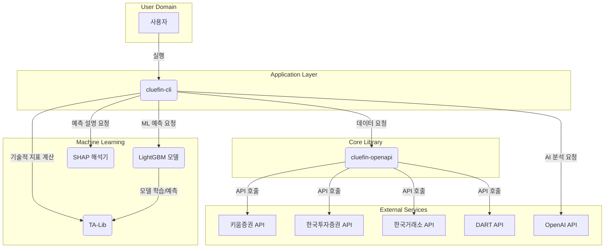
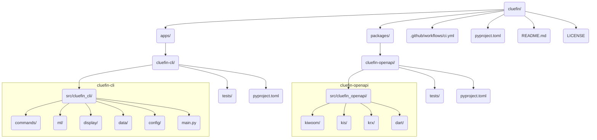

# Cluefin 프로젝트 종합 분석 보고서

**버전:** 1.0
**작성일:** 2025-10-19
**작성자:** Gemini

---

## 1. 프로젝트 개요

### 1.1. 프로젝트 목적 및 기능

**Cluefin**은 한국 주식 시장 투자자를 위한 포괄적인 Python 기반 금융 분석 툴킷입니다. "더 스마트하게 투자하세요, 어렵게 하지 말고"라는 슬로건 아래, 복잡한 금융 데이터 분석, 거래 전략 수립, 포트폴리오 관리를 자동화하고 최적화하는 것을 목표로 합니다.

이 프로젝트는 여러 금융 API(증권사, 거래소, 공시 시스템)를 하나로 통합하고, 기술적 분석, 기본적 분석, 나아가 머신러닝과 AI를 활용한 고급 분석 기능까지 제공하는 강력한 명령줄 인터페이스(CLI)를 핵심 기능으로 합니다.

### 1.2. 문제 정의 및 해결 방법

- **문제점**:
    1.  **파편화된 데이터 소스**: 한국 주식 투자자들은 실시간 시세, 기업 공시, 시장 데이터 등을 얻기 위해 여러 증권사 API, 웹사이트, HTS를 전전해야 합니다.
    2.  **복잡한 API 연동**: 각기 다른 인증 방식, 데이터 형식, 요청 제한을 가진 금융 API들을 개별적으로 연동하고 유지보수하는 것은 매우 번거롭습니다.
    3.  **고급 분석의 부재**: 단순 데이터 조회를 넘어 기술적 지표 계산, AI 기반 시장 해석, 머신러닝 예측과 같은 고급 분석을 수행하려면 상당한 개발 노력이 필요합니다.

- **해결 방법**:
    1.  **통합 API 클라이언트 (`cluefin-openapi`)**: 키움증권, 한국투자증권(KIS), 한국거래소(KRX), DART 공시 시스템 API를 단일화된 인터페이스로 제공하여 데이터 소스를 통합합니다.
    2.  **타입-안전 라이브러리**: Pydantic을 사용하여 API 응답을 모델링하고, 자동 토큰 갱신, 요청 제한 관리 등 복잡한 연동 문제를 추상화합니다.
    3.  **올인원 분석 CLI (`cluefin-cli`)**: 기술적 분석(TA-Lib), 기본적 분석(DART), AI 인사이트(OpenAI), ML 가격 예측(LightGBM + SHAP) 기능을 모두 갖춘 강력한 CLI를 제공하여 사용자가 터미널에서 즉시 고급 분석을 수행할 수 있도록 지원합니다.

### 1.3. 핵심 기능

- **통합 금융 API 클라이언트**: 키움증권, 한국투자증권, KRX, DART API를 타입-안전하게 지원합니다.
- **대화형 CLI**: `rich`와 `click`을 기반으로 한 사용자 친화적인 터미널 인터페이스를 제공합니다.
- **기술적 분석**: TA-Lib를 활용한 150개 이상의 기술적 지표 계산 및 시각화를 지원합니다.
- **기본적 분석**: DART 공시 데이터를 기반으로 재무제표, 배당, 주요 주주 정보를 조회합니다.
- **AI 기반 인사이트**: OpenAI GPT-4를 연동하여 시장 상황 및 기술적 지표에 대한 자연어 설명을 제공합니다.
- **머신러닝 가격 예측**: LightGBM 분류 모델을 사용하여 익일 주가 방향(상승/하락)을 예측합니다.
- **모델 해석 가능성**: SHAP 라이브러리를 통해 ML 모델의 예측 근거를 시각적으로 설명합니다.
- **터미널 시각화**: `plotext`를 사용하여 가격, 거래량, 보조지표 차트를 터미널에 직접 렌더링합니다.

### 1.4. 대상 사용자 및 사용 사례

- **대상 사용자**:
    - CLI 환경에 익숙한 개인 투자자
    - 금융 데이터 분석가 및 퀀트 개발자
    - 금융 AI/ML 모델을 연구하는 학생 및 연구원
    - 자동화된 투자 전략을 구축하려는 개발자

- **사용 사례**:
    - 특정 종목의 기술적/기본적 상태를 빠르게 스크리닝
    - AI를 통해 시장 뉴스나 데이터에 대한 요약 및 인사이트 얻기
    - ML 예측을 참고하여 단기 매매 타이밍 결정에 활용
    - 여러 API의 데이터를 통합하여 자신만의 투자 대시보드나 봇 개발

---

## 2. 기술 아키텍처

### 2.1. 고수준 시스템 아키텍처



### 2.2. 기술 스택 및 종속성

| 구분 | 기술/라이브러리 | 목적 |
| --- | --- | --- |
| **언어** | Python 3.10+ | 주력 개발 언어 |
| **패키지 관리** | `uv` | 빠른 패키지 설치, 가상 환경 및 워크스페이스 관리 |
| **CLI 프레임워크** | `click`, `rich` | 사용자 친화적 명령줄 인터페이스 및 미려한 터미널 UI |
| **데이터 처리** | `pandas`, `numpy` | 금융 시계열 데이터 처리 및 계산 |
| **API 클라이언트** | `requests`, `pydantic` | HTTP 요청 및 타입-안전한 데이터 모델링 |
| **머신러닝** | `scikit-learn`, `lightgbm` | 모델 학습 파이프라인 및 분류 모델 |
| **ML 해석** | `shap` | 모델 예측 결과 설명 |
| **기술적 분석** | `TA-Lib` | 150개 이상의 기술적 지표 계산 |
| **AI 통합** | `openai` | GPT-4 기반 자연어 분석 |
| **차트 시각화** | `plotext` | 터미널 기반 ASCII 차트 렌더링 |
| **테스팅** | `pytest`, `requests-mock` | 단위/통합 테스트 및 HTTP 요청 모킹 |
| **코드 품질** | `ruff` | 코드 린팅 및 포맷팅 |
| **CI/CD** | GitHub Actions | 자동화된 테스트, 빌드, 배포 |

### 2.3. 디자인 패턴 및 아키텍처 결정사항

- **Monorepo (모노레포)**: `uv workspace`를 사용하여 `cluefin-openapi`(라이브러리)와 `cluefin-cli`(애플리케이션)를 단일 저장소에서 관리합니다. 이를 통해 코드 재사용성을 높이고 의존성 관리를 단순화합니다.
- **계층형 아키텍처 (Layered Architecture)**:
    - **Presentation Layer**: `cluefin-cli`가 사용자와의 상호작용을 담당합니다.
    - **Business Logic Layer**: `cluefin-cli`의 `commands`, `ml` 모듈이 분석 로직을 처리합니다.
    - **Data Access Layer**: `cluefin-openapi`가 외부 금융 API와의 통신을 전담하여 데이터 소스를 추상화합니다.
- **Pydantic을 이용한 데이터 모델링**: 외부 API의 JSON 응답을 Pydantic 모델로 변환하여 타입 안정성을 확보하고, 데이터 유효성 검사를 자동화합니다. 필드 별칭(alias)을 사용하여 API의 필드명과 내부 모델의 필드명을 분리합니다.
- **응답 래퍼 패턴 (Response Wrapper Pattern)**: API 응답을 `headers`와 `body`로 구조화된 `KiwoomHttpResponse[T]` 같은 클래스로 감싸, 연속 조회 키 같은 메타데이터와 실제 데이터를 명확히 분리합니다.
- **의존성 주입 (Dependency Injection) 원칙**: API 클라이언트는 인증 토큰을 외부에서 주입받아 초기화됩니다. 이는 인증 로직과 클라이언트 로직을 분리하여 테스트 용이성을 높입니다.

### 2.4. 구성 요소 상호작용 및 데이터 흐름

1.  **사용자**가 `cluefin-cli ta 005930 --ml-predict` 명령을 실행합니다.
2.  `cluefin-cli`의 `main.py` (`click` 앱)가 `technical_analysis` 커맨드를 호출합니다.
3.  `data.fetcher` 모듈은 `cluefin-openapi` 라이브러리를 사용하여 KRX, 키움증권 등에서 `005930`의 과거 시계열 데이터를 가져옵니다.
4.  `ml.feature_engineering` 모듈이 `TA-Lib`를 이용해 가져온 데이터로부터 150개 이상의 기술적 지표(피처)를 생성합니다.
5.  `ml.predictor`는 사전에 훈련된 `LightGBM` 모델을 로드하고, 생성된 피처를 입력하여 익일 주가 방향을 예측합니다.
6.  `display.charts`와 `rich` 테이블이 원본 데이터, 계산된 지표, ML 예측 결과를 터미널에 시각적으로 렌더링합니다.
7.  만약 `--shap-analysis` 옵션이 주어졌다면, `ml.explainer`가 `SHAP`을 이용해 어떤 피처가 예측에 가장 큰 영향을 미쳤는지 분석하여 함께 출력합니다.

---

## 3. 프로젝트 구조

### 3.1. 프로젝트 계층 구조 다이어그램



### 3.2. 디렉토리별 설명

| 경로 | 설명 |
| --- | --- |
| `.github/workflows/` | GitHub Actions를 사용한 CI/CD 워크플로우 정의 파일 (`ci.yml`)이 위치합니다. |
| `apps/cluefin-cli/` | 사용자에게 제공되는 최종 애플리케이션인 CLI의 소스 코드, 테스트, 설정을 포함합니다. |
| `apps/cluefin-cli/src/cluefin_cli/commands/` | `ta` (기술적 분석), `fa` (기본적 분석) 등 CLI의 각 명령어를 구현한 모듈이 위치합니다. |
| `apps/cluefin-cli/src/cluefin_cli/ml/` | 가격 예측 모델, 피처 엔지니어링, SHAP 해석기 등 머신러닝 파이프라인 관련 코드가 위치합니다. |
| `packages/cluefin-openapi/` | 여러 금융 API를 통합하여 제공하는 핵심 라이브러리의 소스 코드, 테스트, 설정을 포함합니다. |
| `packages/cluefin-openapi/src/cluefin_openapi/` | 각 API(kiwoom, kis, krx, dart)별 클라이언트 구현 코드가 위치합니다. |
| `pyproject.toml` | 프로젝트의 메타데이터, 의존성, 빌드 설정, `ruff` 및 `pytest` 같은 도구 설정을 정의합니다. (루트, 각 앱/패키지 내에 존재) |
| `uv.lock` | `uv`에 의해 관리되는 정확한 의존성 버전 정보를 담고 있습니다. |

### 3.3. 파일 구성의 근거

- **모듈성 및 재사용성**: `cluefin-openapi`를 별도의 패키지로 분리하여, CLI가 아닌 다른 애플리케이션(예: 웹 백엔드, 자동매매 봇)에서도 금융 API 클라이언트를 쉽게 재사용할 수 있도록 설계되었습니다.
- **관심사 분리 (Separation of Concerns)**: `cluefin-cli` 내에서도 `commands`(비즈니스 로직), `data`(데이터 접근), `display`(표현), `ml`(머신러닝) 등으로 디렉토리를 명확히 구분하여 코드의 유지보수성을 높였습니다.
- **테스트 용이성**: 소스 코드(`src`)와 테스트 코드(`tests`)를 분리하고, 그 내부 구조를 동일하게 가져가 테스트 대상을 명확히 하고 테스트 커버리지를 관리하기 용이하게 만들었습니다.
- **중앙 집중식 설정**: `pyproject.toml`을 사용하여 프로젝트의 모든 설정을 한 곳에서 관리하며, `uv workspace`를 통해 모노레포 전체의 의존성을 효율적으로 통제합니다.

---

## 4. 설치 및 설정

### 4.1. 전제 조건 및 시스템 요구사항

- **운영체제**: macOS / Linux (Windows는 WSL2 환경 권장)
- **Python**: 3.10 이상
- **패키지 관리자**: `uv` (https://github.com/astral-sh/uv)
- **시스템 라이브러리**: `TA-Lib`, `LightGBM`
    - macOS: `brew install ta-lib lightgbm`
    - Ubuntu: `sudo apt-get install -y libta-lib0-dev lightgbm`

### 4.2. 단계별 설치 가이드

1.  **저장소 복제**:
    ```bash
    git clone https://github.com/kgcrom/cluefin.git
    cd cluefin
    ```

2.  **가상 환경 생성 및 활성화**:
    ```bash
    uv venv --python 3.10
    source .venv/bin/activate
    ```

3.  **의존성 설치**:
    ```bash
    # 워크스페이스의 모든 의존성 설치
    uv sync --all-packages
    ```

### 4.3. 구성 지침

1.  **환경 변수 파일 생성**:
    프로젝트 루트 디렉토리에서 샘플 파일을 복사하여 `.env` 파일을 생성합니다.
    ```bash
    cp apps/cluefin-cli/.env.sample .env
    ```

2.  **API 키 입력**:
    생성된 `.env` 파일을 열고, 각 금융 API 제공업체에서 발급받은 API 키를 입력합니다.
    ```dotenv
    # 키움증권 API
    KIWOOM_APP_KEY=your_app_key_here
    KIWOOM_SECRET_KEY=your_secret_key_here
    KIWOOM_ENV=prod # 운영: prod, 모의투자: dev

    # 한국투자증권 API
    KIS_APP_KEY=your_kis_app_key_here
    KIS_SECRET_KEY=your_kis_secret_key_here
    KIS_ENV=prod # 운영: prod, 모의투자: dev

    # 한국거래소(KRX) API
    KRX_AUTH_KEY=your_krx_auth_key_here

    # 금융감독원(DART) API
    DART_AUTH_KEY=your_dart_auth_key_here

    # OpenAI API (AI 분석 기능 사용 시)
    OPENAI_API_KEY=your_openai_api_key_here
    ```

### 4.4. 일반적인 문제 해결

- **`TA-Lib` 설치 오류**: 대부분 시스템에 `ta-lib` C 라이브러리가 설치되지 않아 발생합니다. 4.1의 시스템 라이브러리 설치 명령을 먼저 실행하세요.
- **`command not found: cluefin-cli`**: `uv sync`로 의존성 설치가 완료되었는지, 그리고 가상 환경이 활성화(`source .venv/bin/activate`)되었는지 확인하세요.
- **API 인증 오류**: `.env` 파일에 API 키가 정확히 입력되었는지, 오타나 불필요한 공백이 없는지 확인하세요. 또한 `KIWOOM_ENV`, `KIS_ENV`가 자신의 계정(운영/모의투자)과 일치하는지 확인하세요.

---

## 5. 사용 가이드

### 5.1. 기본 사용 예제

- **삼성전자(005930) 기술적 분석**:
    ```bash
    cluefin-cli ta 005930
    ```
- **SK하이닉스(000660) 기본적 분석 (2023년 사업보고서 기준)**:
    ```bash
    cluefin-cli fa 000660 --year 2023 --report annual
    ```

### 5.2. 고급 기능 (코드 스니펫)

- **차트와 AI 분석을 포함한 전체 기술적 분석**:
    ```bash
    cluefin-cli ta 035420 --chart --ai-analysis
    ```
- **ML 예측과 SHAP 설명을 포함한 분석 (가장 강력한 기능)**:
    ```bash
    cluefin-cli ta 207940 --ml-predict --shap-analysis
    ```
- **모든 분석 옵션을 활성화한 종합 분석**:
    ```bash
    cluefin-cli ta 373220 --chart --ai-analysis --ml-predict --shap-analysis
    ```

### 5.3. API 문서 및 CLI 참조

#### `cluefin-cli ta` (기술적 분석)

- **사용법**: `cluefin-cli ta [OPTIONS] STOCK_CODE`
- **인수**: `STOCK_CODE` (필수): 6자리 종목 코드 (예: `005930`)
- **주요 옵션**:
    - `-c, --chart`: 터미널 차트를 표시합니다.
    - `-a, --ai-analysis`: OpenAI 기반 AI 분석을 추가합니다.
    - `-m, --ml-predict`: LightGBM 기반 익일 가격 방향을 예측합니다.
    - `-s, --shap-analysis`: ML 예측의 근거를 SHAP 값으로 설명합니다. (`--ml-predict` 필요)

#### `cluefin-cli fa` (기본적 분석)

- **사용법**: `cluefin-cli fa [OPTIONS] STOCK_CODE`
- **인수**: `STOCK_CODE` (필수): 6자리 종목 코드
- **주요 옵션**:
    - `--year`: 조회할 사업연도 (기본값: 현재 연도 - 1)
    - `--report`: 보고서 종류 (`annual`, `q1`, `half`, `q3`)
    - `--max-shareholders`: 표시할 최대 주주 수 (기본값: 5)

#### `cluefin-openapi` 라이브러리 사용 예제

```python
# cluefin-openapi를 직접 사용하여 KIS API로 삼성전자 현재가 조회
import os
from pydantic import SecretStr
from cluefin_openapi.kis import Auth, Client as KISClient

# 환경 변수에서 키 로드
app_key = os.getenv("KIS_APP_KEY")
secret_key = SecretStr(os.getenv("KIS_SECRET_KEY"))

# 인증 및 클라이언트 초기화
auth = Auth(app_key=app_key, secret_key=secret_key, env="prod")
token = auth.generate()
client = KISClient(app_key=app_key, secret_key=secret_key, token=token, env="prod")

# API 호출
response = client.domestic_basic_quote.get_inquire_price(
    fid_cond_mrkt_div_code="J",
    fid_input_iscd="005930"
)

print(f"삼성전자 현재가: {response.body.stck_prpr}")
```

---

## 6. 개발 지침

### 6.1. 개발 환경 설정

1.  `4.2. 단계별 설치 가이드`를 따라 기본 설정을 완료합니다.
2.  개발 의존성까지 모두 설치되었는지 확인합니다 (`uv sync --all-packages`는 개발 의존성도 포함).
3.  코드를 수정한 후에는 `ruff`를 사용하여 코드 스타일을 검사하고 포맷팅합니다.

### 6.2. 코드 스타일 및 규칙

- **포맷터/린터**: `ruff`를 사용합니다.
- **설정**: 프로젝트 루트의 `pyproject.toml` 내 `[tool.ruff]` 섹션에 규칙이 정의되어 있습니다.
- **라인 길이**: 120자
- **실행 방법**:
    ```bash
    # 코드 포맷팅
    uv run ruff format .

    # 린트 검사 및 자동 수정
    uv run ruff check . --fix
    ```

### 6.3. 테스트 절차 및 커버리지

- **테스트 프레임워크**: `pytest`
- **테스트 종류**:
    - **단위 테스트 (Unit Test)**: 외부 API 호출 없이 로직의 정확성을 검증합니다. `requests-mock`을 사용하여 API 응답을 모킹합니다.
    - **통합 테스트 (Integration Test)**: 실제 API 키를 사용하여 외부 API와의 연동을 검증합니다. `@pytest.mark.integration` 마커로 구분됩니다.
- **실행 방법**:
    ```bash
    # 모든 테스트 실행 (통합 테스트 포함, API 키 필요)
    uv run pytest

    # 단위 테스트만 실행 (API 키 불필요)
    uv run pytest -m "not integration"

    # 통합 테스트만 실행
    uv run pytest -m "integration"

    # 커버리지 리포트 생성
    uv run coverage run -m pytest -m "not integration"
    uv run coverage xml
    ```
- **CI 연동**: `ci.yml` 워크플로우는 `push` 이벤트 발생 시 자동으로 린팅과 테스트(단위/통합)를 수행하며, `Codacy`를 통해 커버리지를 리포팅합니다.

### 6.4. 기여 가이드라인

1.  프로젝트를 Fork합니다.
2.  기능 개발을 위한 브랜치를 생성합니다 (`git checkout -b feature/my-new-feature`).
3.  코드를 작성하고, 관련된 테스트 코드를 반드시 추가합니다.
4.  `uv run ruff check . --fix`와 `uv run pytest`를 실행하여 모든 검사를 통과하는지 확인합니다.
5.  변경 사항을 커밋하고 브랜치에 푸시합니다.
6.  원본 저장소에 Pull Request를 생성합니다.

---

## 7. 추가 정보

### 7.1. 성능 고려사항

- **API 요청 최적화**: `cluefin-openapi`는 내부적으로 `requests.Session`을 사용하여 TCP 연결을 재사용함으로써 API 호출 성능을 향상시킵니다.
- **캐싱**: 자주 조회하지만 변경되지 않는 데이터(예: 종목 기본 정보)에 대해 캐싱 메커니즘을 도입하여 불필요한 API 호출을 줄일 수 있습니다. (현재 일부 구현)
- **비동기 처리**: 대량의 데이터를 여러 종목에 걸쳐 조회해야 할 경우, `asyncio`와 `aiohttp`를 도입하여 API 요청을 병렬로 처리하면 성능을 크게 향상시킬 수 있습니다. (향후 개선 계획)

### 7.2. 보안 고려사항

- **API 키 관리**: 모든 API 키와 비밀키는 `.env` 파일을 통해 환경 변수로 관리되며, 이 파일은 `.gitignore`에 등록되어 저장소에 커밋되지 않습니다.
- **의존성 보안**: `ci.yml`에 `pip-audit`을 사용한 보안 스캔 단계가 포함되어 있어, 알려진 취약점이 있는 의존성이 사용되는 것을 방지합니다.
- **XML 처리**: KRX API 응답 중 XML 형식을 처리할 때, XML 외부 엔티티 주입(XXE) 공격을 방지하기 위해 `defusedxml` 라이브러리를 사용합니다.

### 7.3. 프로젝트 로드맵 및 향후 계획

- **웹 인터페이스**: `cluefin-cli`의 기능을 웹 기반 대시보드로 확장.
- **자동매매 지원**: `cluefin-openapi`에 주문 실행 기능을 강화하고, 이를 기반으로 한 자동매매 프레임워크 연동 지원.
- **데이터 소스 확장**: 국내외 추가 증권사 및 데이터 제공업체 API 통합.
- **ML 모델 고도화**: LSTM, Transformer 등 더 발전된 시계열 모델을 도입하고, 포트폴리오 최적화 기능 추가.
- **알림 기능**: 특정 조건(예: 가격 돌파, ML 매수 신호 발생) 충족 시 사용자에게 알림(이메일, 슬랙 등)을 보내는 기능.

### 7.4. 라이선스 및 저작권

이 프로젝트는 **MIT 라이선스**에 따라 배포됩니다. 라이선스 전문은 저장소의 `LICENSE` 파일에서 확인할 수 있습니다.

- **Copyright (c) 2025 Hangoo Kang**
