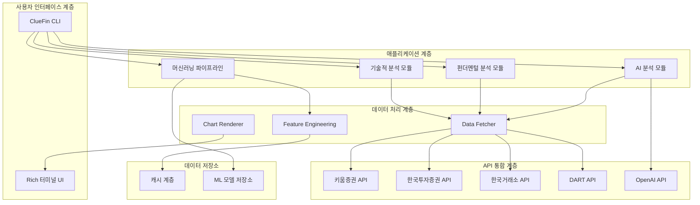
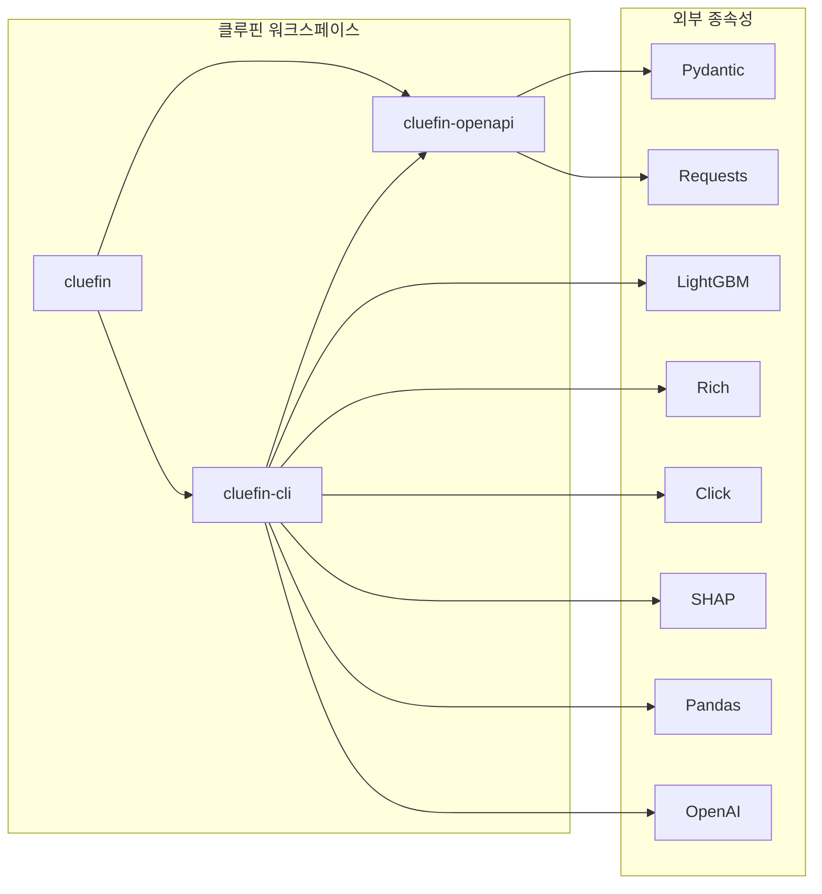
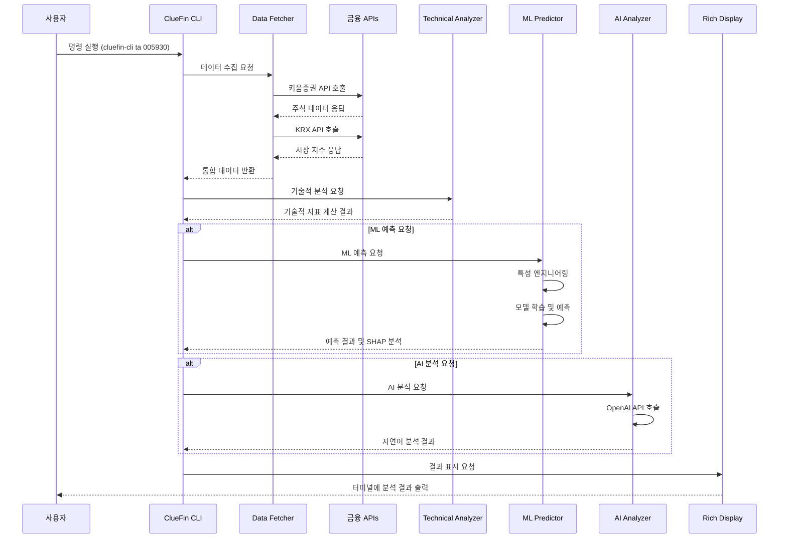
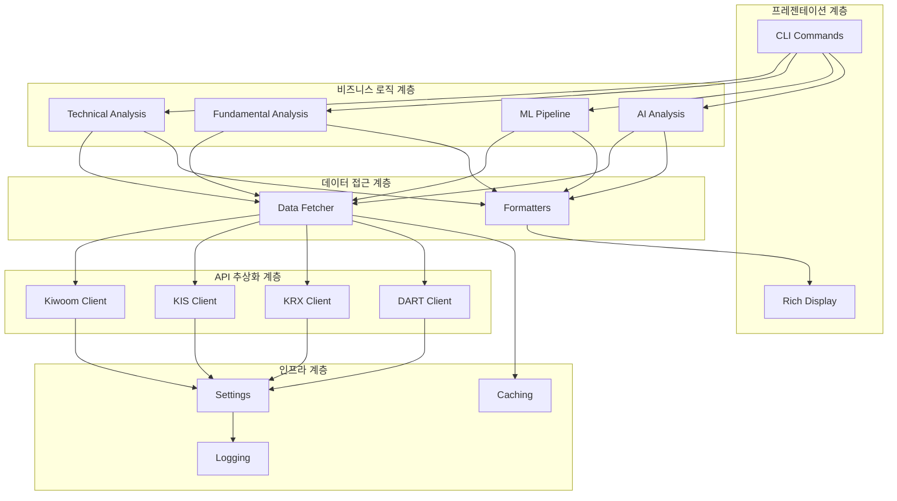
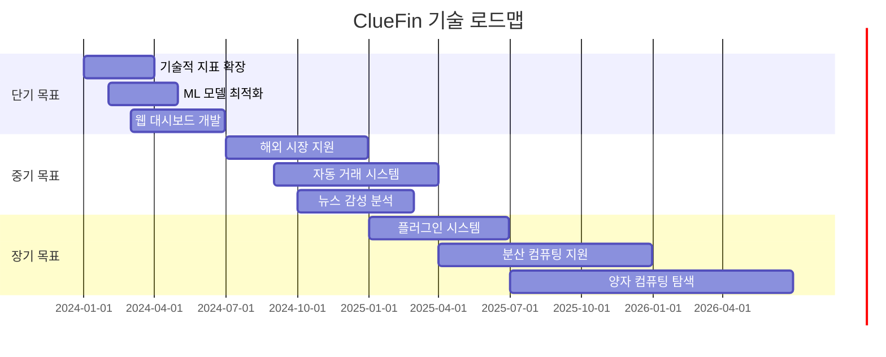

# ClueFin 프로젝트 포괄 분석 보고서

## 목차
1. [프로젝트 개요](#프로젝트-개요)
2. [기술 아키텍처](#기술-아키텍처)
3. [프로젝트 구조](#프로젝트-구조)
4. [설치 및 설정](#설치-및-설정)
5. [사용 가이드](#사용-가이드)
6. [개발 지침](#개발-지침)
7. [추가 정보](#추가-정보)

---

## 프로젝트 개요

### 프로젝트의 목적과 기능

ClueFin은 "Clearly Looking for U Entered"의 약자로, 한국 금융 투자자를 위한 포괄적인 분석 도구 툴킷입니다. 이 프로젝트는 투자자가 금융 시장을 분석, 자동화, 최적화할 수 있도록 돕는 파이썬 기반 오픈소스 플랫폼으로, 복잡한 금융 데이터 분석을 단순화하고 접근성을 높이는 것을 목표로 합니다.

### 문제 정의

한국 금융 시장은 다음과 같은 복잡성과 어려움을 가지고 있습니다:

1. **분산된 데이터 소스**: 키움증권, 한국투자증권, KRX, DART 등 여러 기관에 데이터가 분산
2. **복잡한 API 통합**: 각 금융 기관마다 다른 인증 방식과 데이터 형식
3. **기술적 분석의 복잡성**: 150개 이상의 기술적 지표와 다양한 분석 방법론
4. **데이터 처리의 어려움**: 대량의 시계열 데이터 처리와 실시간 분석 요구
5. **개인 투자자의 접근성 부족**: 전문적인 분석 도구의 높은 진입 장벽

### 해결 방법

ClueFin은 다음과 같은 방식으로 이러한 문제들을 해결합니다:

1. **통합된 API 클라이언트**: 한국 주요 금융 API(키움증권, 한국투자증권, KRX, DART)를 단일 인터페이스로 통합
2. **타입 안전성**: Pydantic 기반의 강력한 타입 검증으로 런타임 에러 방지
3. **머신러닝 기반 예측**: LightGBM과 SHAP을 활용한 주가 움직임 예측 및 해석
4. **직관적인 CLI 인터페이스**: Rich 기반의 아름다운 터미널 UI로 사용자 경험 향상
5. **AI 기반 인사이트**: OpenAI GPT-4를 활용한 자연어 시장 분석

### 핵심 기능

#### 1. 기술적 분석
- **150+ 기술적 지표**: TA-Lib 통합을 통한 포괄적인 기술적 분석 (RSI, MACD, 볼린저 밴드 등)
- **터미널 시각화**: ASCII 차트로 직관적인 데이터 표현
- **실시간 데이터**: 키움증권 API를 통한 실시간 주식 데이터 수집

#### 2. 머신러닝 예측
- **LightGBM 분류 모델**: 익일 가격 움직임 예측
- **SHAP 해석 가능성**: 예측 결과에 대한 설명 가능한 AI 분석
- **특성 중요도 분석**: 예측에 영향을 미치는 주요 요인 식별

#### 3. 펀더멘털 분석
- **DART 공시 데이터**: 기업 공시, 재무제표, 주요 주주 정보
- **재무 지표 분석**: PER, PBR, ROE 등 핵심 재무 비율
- **배당 정보**: 배당률 및 배당 내역 분석

#### 4. 시장 분석
- **시장 지수 모니터링**: KOSPI, KOSDAQ 지수 및 변동성 분석
- **외국인 거래 동향**: 외국인 매수/매도 흐름 분석
- **섹터 및 테마 분석**: 업종별 및 테마별 주식 분류

#### 5. AI 기반 인사이트
- **자연어 분석**: GPT-4를 활용한 시장 상황 분석
- **맥락적 인사이트**: 기술적 지표 기반의 거래 추천
- **위험 평가**: 시장 리스크 및 투자 권고사항

### 대상 사용자 및 사용 사례

#### 주요 사용자 그룹
1. **개인 투자자**: 체계적인 데이터 분석을 원하는 개인 투자자
2. **금융 애널리스트**: 시장 분석 및 리서치에 활용하는 전문가
3. **알고리즘 트레이더**: 자동화된 거래 전략을 개발하는 퀀트 트레이더
4. **금융 기술 개발자**: 금융 애플리케이션을 개발하는 소프트웨어 엔지니어
5. **학생 및 연구자**: 금융 데이터 분석을 학습하는 학계 인사

#### 주요 사용 사례
1. **일일 투자 분석**: 주식의 기술적 및 펀더멘털 분석을 통한 투자 결정
2. **포트폴리오 모니터링**: 보유 자산의 실시간 성과 추적 및 분석
3. **시장 리서치**: 시장 동향 및 섹터별 성과 분석
4. **알고리즘 거래 개발**: ML 모델을 활용한 거래 전략 백테스팅
5. **금융 교육**: 기술적 분석 및 머신러닝의 금융 응용 학습

---

## 기술 아키텍처

### 고수준 시스템 아키텍처



### 기술 스택

#### 핵심 프레임워크 및 라이브러리
- **Python 3.10+**: 핵심 프로그래밍 언어
- **Click**: CLI 프레임워크로 명령줄 인터페이스 구현
- **Rich**: 터미널 UI 라이브러리로 아름다운 텍스트 표현
- **Pydantic**: 데이터 검증 및 설정 관리
- **Pandas**: 데이터 처리 및 분석
- **NumPy**: 수치 계산

#### 머신러닝 및 데이터 분석
- **LightGBM**: 그래디언트 부스팅 기반 ML 모델
- **SHAP**: 모델 해석 가능성 및 특성 중요도 분석
- **Scikit-learn**: 머신러닝 유틸리티 및 평가 지표
- **TA-Lib**: 기술적 분석 지표 계산
- **Imbalanced-learn**: 클래스 불균형 처리

#### API 통합 및 네트워킹
- **Requests**: HTTP 클라이언트 라이브러리
- **DefusedXML**: 안전한 XML 파싱 (DART API용)
- **Loguru**: 구조화된 로깅

#### 개발 도구
- **uv**: Rust 기반 Python 패키지 매니저
- **Ruff**: 코드 린팅 및 포맷팅
- **pytest**: 테스트 프레임워크

### 종속성 관리

ClueFin은 uv 워크스페이스 구조를 사용하여 종속성을 관리합니다:



### 디자인 패턴

#### 1. 응답 래퍼 패턴 (Response Wrapper Pattern)
모든 API 응답을 구조화된 형태로 반환하여 일관성 있는 데이터 처리 보장:

```python
@dataclass
class KiwoomHttpResponse(Generic[T]):
    headers: KiwoomHttpHeader  # 헤더 정보 (연속조회키 등)
    body: T                    # 응답 데이터 (Pydantic 모델)
```

#### 2. 팩토리 패턴 (Factory Pattern)
다양한 금융 API 클라이언트를 통합된 인터페이스로 생성:

```python
class ClientFactory:
    @staticmethod
    def create_kiwoom_client(token: str, env: str) -> KiwoomClient:
        return KiwoomClient(token=token, env=env)
    
    @staticmethod
    def create_kis_client(app_key: str, secret_key: str, token: str) -> KISClient:
        return KISClient(app_key=app_key, secret_key=secret_key, token=token)
```

#### 3. 전략 패턴 (Strategy Pattern)
다양한 분석 방법론을 유연하게 전환:

```python
class AnalysisStrategy(ABC):
    @abstractmethod
    def analyze(self, data: pd.DataFrame) -> Dict:
        pass

class TechnicalAnalysisStrategy(AnalysisStrategy):
    def analyze(self, data: pd.DataFrame) -> Dict:
        # 기술적 분석 로직
        pass

class FundamentalAnalysisStrategy(AnalysisStrategy):
    def analyze(self, data: pd.DataFrame) -> Dict:
        # 펀더멘털 분석 로직
        pass
```

#### 4. 빌더 패턴 (Builder Pattern)
복잡한 ML 파이프라인 구성을 단순화:

```python
class MLPipelineBuilder:
    def __init__(self):
        self.pipeline = StockMLPredictor()
    
    def with_feature_engineering(self, features: List[str]) -> 'MLPipelineBuilder':
        self.pipeline.feature_engineer.add_features(features)
        return self
    
    def with_model_params(self, params: Dict) -> 'MLPipelineBuilder':
        self.pipeline.model.model_params.update(params)
        return self
    
    def build(self) -> StockMLPredictor:
        return self.pipeline
```

### 아키텍처 결정사항

#### 1. 모노레포 구조 선택
- **결정**: uv 워크스페이스 기반 모노레포 구조 채택
- **근거**: 
  - 패키지 간 종속성 관리 용이성
  - 코드 공유 및 재사용성 향상
  - 통합된 테스트 및 배포 파이프라인
  - 개발 경험의 일관성 보장

#### 2. 동기 vs 비동기 처리
- **결정**: 데이터 수집은 비동기 처리, 분석은 동기 처리 혼합
- **근거**:
  - I/O 바운드 작업(데이터 수집)의 효율성을 위한 비동기 처리
  - CPU 집약적 작업(ML 모델링)의 단순성을 위한 동기 처리
  - 사용자 경험과 성능의 균형

#### 3. 캐싱 전략
- **결정**: 메모리 기반의 단기 캐싱 전략 채택
- **근거**:
  - 금융 데이터의 실시간성 요구
  - API 호출 제한 및 비용 효율성
  - 단기간의 데이터 재사용성

#### 4. ML 모델 선택
- **결정**: LightGBM 기반의 분류 모델 채택
- **근거**:
  - 시계열 데이터에 대한 높은 예측 성능
  - 빠른 학습 및 추론 속도
  - 특성 중요도 분석의 용이성
  - 작은 데이터셋에서의 안정적인 성능

### 구성 요소 상호작용 및 데이터 흐름

#### 데이터 흐름 다이어그램


#### 컴포넌트 상호작용
1. **CLI 계층**: 사용자 명령을 파싱하고 적절한 분석 모듈 호출
2. **데이터 계층**: 다양한 금융 API에서 데이터를 수집하고 정제
3. **분석 계층**: 기술적, 펀더멘털, ML 기반 분석 수행
4. **표현 계층**: Rich 라이브러리를 통해 결과를 시각화

---

## 프로젝트 구조

### 디렉토리별 설명

ClueFin은 uv 워크스페이스 기반의 모노레포 구조를 채택하고 있습니다:

```
cluefin/
├── packages/cluefin-openapi/    # 한국 금융 API 클라이언트 패키지
│   ├── src/cluefin_openapi/
│   │   ├── kiwoom/             # 키움증권 API 클라이언트
│   │   ├── kis/                # 한국투자증권 API 클라이언트
│   │   ├── krx/                # 한국거래소 API 클라이언트
│   │   └── dart/               # DART 공시 API 클라이언트
│   └── tests/                  # 단위 및 통합 테스트
├── apps/cluefin-cli/           # CLI 애플리케이션
│   ├── src/cluefin_cli/
│   │   ├── commands/           # CLI 명령어 구현
│   │   ├── config/             # 설정 관리
│   │   ├── data/               # 데이터 처리 계층
│   │   ├── display/            # 터미널 시각화
│   │   ├── ml/                 # 머신러닝 파이프라인
│   │   └── utils/              # 유틸리티 함수
│   └── tests/                  # CLI 테스트
├── pyproject.toml              # 워크스페이스 설정
├── uv.lock                     # 종속성 잠금 파일
└── README.md                   # 프로젝트 문서
```

### 주요 디렉토리 상세 분석

#### 1. packages/cluefin-openapi/
한국 금융 API를 위한 타입 안전한 클라이언트 라이브러리 모음:

- **kiwoom/**: 키움증권 OpenAPI 클라이언트
  - OAuth2 스타일 인증 처리
  - 실시간 주식 데이터, 계좌 정보, 주문 실행
  - 속도 제한 및 오류 처리
  
- **kis/**: 한국투자증권 API 클라이언트
  - 토큰 기반 인증
  - 국내/해외 주식 시세, 계좌 조회
  - 시장 분석 및 순위 데이터
  
- **krx/**: 한국거래소 API 클라이언트
  - 간단한 인증키 기반 접근
  - 시장 데이터, 지수, 섹터 정보
  - 채권 및 파생상품 데이터
  
- **dart/**: 금융감독원 DART API 클라이언트
  - 기업 공시, 재무제표, 대량보유상황
  - 정기 보고서 및 주요 주주 정보

#### 2. apps/cluefin-cli/
사용자 상호작용을 위한 CLI 애플리케이션:

- **commands/**: CLI 명령어 구현
  - `technical_analysis.py`: 기술적 분석 명령어
  - `fundamental_analysis.py`: 펀더멘털 분석 명령어
  - `analysis/`: 분석 관련 서브모듈
  
- **data/**: 데이터 처리 계층
  - `fetcher.py`: API에서 데이터 수집
  - `fundamentals.py`: DART 데이터 처리
  
- **ml/**: 머신러닝 파이프라인
  - `predictor.py`: ML 예측 파이프라인
  - `models.py`: LightGBM 모델 구현
  - `feature_engineering.py`: 특성 엔지니어링
  - `explainer.py`: SHAP 기반 모델 해석
  
- **display/**: 시각화 모듈
  - `charts.py`: ASCII 차트 렌더링

### 파일 구성의 근거

#### 1. 모듈성 및 재사용성
- **패키지 분리**: API 클라이언트와 CLI 애플리케이션을 분리하여 독립적인 재사용 가능
- **기능별 그룹화**: 관련 기능을 디렉토리로 그룹화하여 유지보수성 향상
- **인터페이스 표준화**: 일관된 API 인터페이스로 학습 곡선 완화

#### 2. 테스트 전략
- **단위 테스트**: 각 모듈별 독립적인 테스트 코드
- **통합 테스트**: API 연동 및 실제 데이터 흐름 검증
- **목(mock) 기반 테스트**: 외부 API 의존성 제거

#### 3. 설정 관리
- **중앙화된 설정**: Pydantic 기반 설정 관리로 일관성 보장
- **환경별 설정**: 개발/운영 환경 분리 지원
- **보안**: 민감 정보(API 키)의 안전한 관리

### 프로젝트 계층 구조



---

## 설치 및 설정

### 전제 조건

#### 시스템 요구사항
- **운영체제**: macOS, Linux, Windows (WSL2 권장)
- **Python**: 3.10 이상
- **메모리**: 최소 4GB RAM (권장 8GB 이상)
- **저장 공간**: 최소 2GB 여유 공간

#### 필수 소프트웨어
- **uv**: Rust 기반 Python 패키지 매니저
- **Git**: 소스 코드 관리
- **TA-Lib**: 기술적 분석 라이브러리 (시스템 종속성)
- **LightGBM**: 머신러닝 프레임워크 (시스템 종속성)

### 단계별 설치 가이드

#### 1. 시스템 종속성 설치

**macOS:**
```bash
# Homebrew 설치 (없는 경우)
/bin/bash -c "$(curl -fsSL https://raw.githubusercontent.com/Homebrew/install/HEAD/install.sh)"

# 필수 패키지 설치
brew install ta-lib lightgbm
```

**Ubuntu/Debian:**
```bash
# 시스템 패키지 업데이트
sudo apt update

# 필수 패키지 설치
sudo apt install -y python3-dev build-essential

# TA-Lib 소스 컴파일 설치
wget http://prdownloads.sourceforge.net/ta-lib/ta-lib-0.4.0-src.tar.gz
tar -xzf ta-lib-0.4.0-src.tar.gz
cd ta-lib/
./configure --prefix=/usr
make
sudo make install
cd ..

# LightGBM 설치
sudo apt install -y liblightgbm-dev
```

**Windows (WSL2):**
```bash
# WSL2에서 Ubuntu 설치 후 위 Ubuntu 가이드 따르기
```

#### 2. uv 패키지 매니저 설치

```bash
# 공식 설치 스크립트
curl -LsSf https://astral.sh/uv/install.sh | sh

# 또는 pip를 통한 설치 (권장하지 않음)
pip install uv
```

#### 3. ClueFin 소스 코드 클론 및 설정

```bash
# 리포지토리 클론
git clone https://github.com/kgcrom/cluefin.git
cd cluefin

# Python 가상 환경 생성
uv venv --python 3.10

# 가상 환경 활성화
source .venv/bin/activate  # Linux/macOS
# 또는
.venv\Scripts\activate     # Windows

# 모든 워크스페이스 종속성 설치
uv sync --all-packages
```

#### 4. 환경 변수 설정

```bash
# 샘플 환경 파일 복사
cp apps/cluefin-cli/.env.sample .env

# 환경 파일 편집
nano .env  # 또는 선호하는 텍스트 편집기 사용
```

`.env` 파일 내용:
```env
# 키움증권 API (OAuth2-style 인증)
KIWOOM_APP_KEY=your_app_key_here
KIWOOM_SECRET_KEY=your_secret_key_here
KIWOOM_ENV=dev  # options: prod | dev(default)

# 한국투자증권 API (토큰 기반 인증)
KIS_APP_KEY=your_kis_app_key_here
KIS_SECRET_KEY=your_kis_secret_key_here
KIS_ENV=dev  # options: prod | dev(default)

# 한국거래소 API (단순 인증키)
KRX_AUTH_KEY=your_krx_auth_key_here

# 금융감독원 DART API
DART_AUTH_KEY=your_dart_auth_key_here

# OpenAI API (AI 분석 기능)
OPENAI_API_KEY=your_openai_api_key_here

# 선택적 ML 모델 설정
ML_MODEL_PATH=models/
ML_CACHE_DIR=.ml_cache/
```

### API 키 발급 방법

#### 1. 키움증권 OpenAPI
1. [키움증권 OpenAPI 포털](https://apiportal.kiwoom.com/) 방문
2. 계정 생성 및 로그인
3. API 사용 신청 및 승인 대기
4. APP_KEY 및 SECRET_KEY 발급

#### 2. 한국투자증권 OpenAPI
1. [한국투자증권 OpenAPI 포털](https://apiportal.koreainvestment.com/) 방문
2. 계정 생성 및 로그인
3. API 사용 신청 및 승인 대기
4. APP_KEY 및 SECRET_KEY 발급

#### 3. 한국거래소 OpenAPI
1. [한국거래소 OpenAPI 포털](http://openapi.krx.co.kr) 방문
2. 계정 생성 및 로그인
3. API 인증키 신청
4. 사용할 API별로 신청 및 승인 대기

#### 4. DART OpenAPI
1. [DART OpenAPI 포털](https://opendart.fss.or.kr/) 방문
2. 계정 생성 및 로그인
3. API 인증키 발급

#### 5. OpenAI API
1. [OpenAI API 페이지](https://platform.openai.com/api-keys) 방문
2. 계정 로그인
3. API 키 생성

### 일반적인 문제 해결

#### 1. TA-Lib 설치 오류

**문제**: `ta-lib` 모듈을 찾을 수 없거나 컴파일 오류 발생

**해결方案**:
```bash
# macOS에서 재설치
brew uninstall ta-lib
brew install ta-lib

# Ubuntu에서 수동 설치
sudo apt-get remove python3-ta-lib
sudo apt-get install build-essential
wget http://prdownloads.sourceforge.net/ta-lib/ta-lib-0.4.0-src.tar.gz
tar -xzf ta-lib-0.4.0-src.tar.gz
cd ta-lib/
./configure --prefix=/usr
make
sudo make install
cd ..
pip install ta-lib
```

#### 2. uv 명령어를 찾을 수 없음

**문제**: `uv: command not found` 오류 발생

**해결方案**:
```bash
# PATH에 uv 추가
echo 'export PATH="$HOME/.cargo/bin:$PATH"' >> ~/.bashrc
source ~/.bashrc

# 또는 전역 설치
curl -LsSf https://astral.sh/uv/install.sh | sh
source ~/.bashrc
```

#### 3. API 인증 오류

**문제**: `Authentication failed` 또는 `Invalid token` 오류

**해결方案**:
1. 환경 변수가 올바르게 설정되었는지 확인:
   ```bash
   printenv | grep -E "(KIWOOM|KIS|KRX|DART|OPENAI)"
   ```

2. API 키 유효성 확인:
   - 키 만료 여부 확인
   - API 사용 권한 확인
   - 환경 설정(dev/prod) 확인

#### 4. 메모리 부족 오류

**문제**: ML 모델 학습 중 메모리 부족 오류 발생

**해결方案**:
1. 시스템 메모리 확인:
   ```bash
   free -h  # Linux
   # 또는
   vm_stat | grep "Pages free"  # macOS
   ```

2. 데이터 크기 줄이기:
   ```python
   # 데이터 샘플링으로 크기 줄이기
   sample_size = min(1000, len(data))
   data = data.sample(sample_size)
   ```

#### 5. 네트워크 연결 문제

**문제**: API 호출 시 타임아웃 또는 연결 오류

**해결方案**:
1. 방화벽 설정 확인
2. 프록시 설정 확인 (기업 환경):
   ```bash
   export HTTP_PROXY=http://proxy.company.com:8080
   export HTTPS_PROXY=http://proxy.company.com:8080
   ```
3. DNS 확인:
   ```bash
   nslookup api.kiwoom.com
   nslookup openapi.koreainvestment.com
   ```

#### 6. 의존성 충돌

**문제**: 패키지 버전 충돌 또는 설치 오류

**해결方案**:
```bash
# 가상 환경 재생성
rm -rf .venv
uv venv --python 3.10
source .venv/bin/activate

# 종속성 재설치
uv sync --all-packages --refresh
```

---

## 사용 가이드

### 기본 사용 예제

ClueFin CLI는 두 가지 주요 명령어를 제공합니다: 기술적 분석(`ta`)과 펀더멘털 분석(`fa`).

#### 기술적 분석 기본 사용법

```bash
# 삼성전자 기본 분석
cluefin-cli ta 005930

# 차트 표시 포함
cluefin-cli ta 005930 --chart

# AI 분석 포함
cluefin-cli ta 005930 --ai-analysis

# 머신러닝 예측 포함
cluefin-cli ta 005930 --ml-predict

# 전체 기능 활성화
cluefin-cli ta 005930 --chart --ai-analysis --ml-predict --shap-analysis
```

#### 펀더멘털 분석 기본 사용법

```bash
# 삼성전자 기본 펀더멘털 분석
cluefin-cli fa 005930

# 특정 연도 사업보고서 분석
cluefin-cli fa 005930 --year 2023 --report annual

# 상위 3개 주요 주주만 표시
cluefin-cli fa 005930 --max-shareholders 3
```

### 코드 스니펫

#### 1. 프로그래매틱 API 사용

```python
import asyncio
from cluefin_openapi.kiwoom._auth import Auth
from cluefin_openapi.kiwoom._client import Client
from cluefin_cli.data.fetcher import DataFetcher

async def fetch_stock_data():
    # 데이터 수집기 초기화
    fetcher = DataFetcher()
    
    # 삼성전자 기본 정보 조회
    basic_data = await fetcher.get_basic_data("005930")
    print(f"회사명: {basic_data['stock_name'].iloc[0]}")
    print(f"현재가: {basic_data['current_price'].iloc[0]}")
    
    # 주식 데이터 조회
    stock_data = await fetcher.get_stock_data("005930", "1D")
    print(f"데이터 기간: {stock_data.index.min()} ~ {stock_data.index.max()}")
    
    # 시장 지수 조회
    kospi_data = await fetcher.get_kospi_index_series()
    print(f"KOSPI 지수: {kospi_data[0]['close_price']}")

# 실행
asyncio.run(fetch_stock_data())
```

#### 2. 기술적 지표 계산

```python
from cluefin_cli.commands.analysis.indicators import TechnicalAnalyzer
import pandas as pd

# 기술적 분석기 초기화
analyzer = TechnicalAnalyzer()

# 주식 데이터가 있다고 가정
# stock_data는 OHLCV 형식의 DataFrame이어야 함
# stock_data = pd.DataFrame({
#     'open': [...],
#     'high': [...],
#     'low': [...],
#     'close': [...],
#     'volume': [...]
# }, index=pd.date_range(...))

# 모든 기술적 지표 계산
indicators = analyzer.calculate_all(stock_data)

# 주요 지표 확인
print(f"RSI(14): {indicators['rsi'].iloc[-1]:.2f}")
print(f"MACD: {indicators['macd'].iloc[-1]:.4f}")
print(f"MACD Signal: {indicators['macd_signal'].iloc[-1]:.4f}")
print(f"SMA(20): {indicators['sma_20'].iloc[-1]:.2f}")
```

#### 3. 머신러닝 예측 파이프라인

```python
from cluefin_cli.ml.predictor import StockMLPredictor
from cluefin_cli.commands.analysis.indicators import TechnicalAnalyzer
import pandas as pd

async def predict_stock_movement():
    # 데이터 준비
    fetcher = DataFetcher()
    stock_code = "005930"
    
    # 주식 데이터 수집
    stock_data = await fetcher.get_stock_data(stock_code, "1D")
    
    # 기술적 지표 계산
    analyzer = TechnicalAnalyzer()
    indicators = analyzer.calculate_all(stock_data)
    
    # ML 예측기 초기화
    predictor = StockMLPredictor()
    
    # 데이터 준비
    prepared_df, feature_names = predictor.prepare_data(stock_data, indicators)
    
    # 모델 학습
    training_metrics = predictor.train_model(prepared_df)
    print(f"학습 정확도: {training_metrics['val_accuracy']:.2%}")
    
    # 예측 수행
    prediction_result = predictor.predict(stock_data, indicators)
    
    # 결과 출력
    print(f"예측 신호: {prediction_result['signal']}")
    print(f"신뢰도: {prediction_result['confidence']:.2%}")
    print(f"상승 확률: {prediction_result['probability_up']:.2%}")
    print(f"하락 확률: {prediction_result['probability_down']:.2%}")

# 실행
asyncio.run(predict_stock_movement())
```

#### 4. AI 기반 시장 분석

```python
from cluefin_cli.commands.analysis.ai_analyzer import AIAnalyzer
from cluefin_cli.data.fetcher import DataFetcher
from cluefin_cli.commands.analysis.indicators import TechnicalAnalyzer

async def get_ai_insights():
    # 데이터 수집 및 분석
    fetcher = DataFetcher()
    analyzer = TechnicalAnalyzer()
    ai_analyzer = AIAnalyzer()
    
    stock_code = "005930"
    
    # 데이터 수집
    stock_data = await fetcher.get_stock_data(stock_code, "1D")
    indicators = analyzer.calculate_all(stock_data)
    
    # AI 분석
    analysis = await ai_analyzer.analyze_stock(stock_code, stock_data, indicators)
    
    print("=== AI 시장 분석 ===")
    print(analysis)

# 실행
asyncio.run(get_ai_insights())
```

### 고급 기능

#### 1. 커스텀 기술적 지표 추가

```python
from cluefin_cli.commands.analysis.indicators import TechnicalAnalyzer
import pandas as pd
import talib

class CustomTechnicalAnalyzer(TechnicalAnalyzer):
    def calculate_custom_indicator(self, data: pd.DataFrame) -> pd.Series:
        """
        커스텀 기술적 지표 계산
        """
        # 예: 가중 이동 평균 (WMA)
        close = data['close'].values
        wma = talib.WMA(close, timeperiod=20)
        return pd.Series(wma, index=data.index)
    
    def calculate_all(self, data: pd.DataFrame) -> dict:
        # 기본 지표 계산
        indicators = super().calculate_all(data)
        
        # 커스텀 지표 추가
        indicators['custom_wma'] = self.calculate_custom_indicator(data)
        
        return indicators

# 사용 예시
custom_analyzer = CustomTechnicalAnalyzer()
indicators = custom_analyzer.calculate_all(stock_data)
print(f"Custom WMA: {indicators['custom_wma'].iloc[-1]:.2f}")
```

#### 2. 백테스팅 프레임워크

```python
import pandas as pd
from typing import Dict, List

class BacktestEngine:
    def __init__(self, initial_capital: float = 10000000):
        self.initial_capital = initial_capital
        self.capital = initial_capital
        self.position = 0
        self.trades: List[Dict] = []
    
    def execute_trade(self, signal: str, price: float, date: pd.Timestamp):
        """거래 실행"""
        if signal == "BUY" and self.position == 0:
            # 매수
            shares = int(self.capital / price)
            self.position = shares
            self.capital = 0
            self.trades.append({
                'date': date,
                'action': 'BUY',
                'price': price,
                'shares': shares,
                'capital': self.capital
            })
        elif signal == "SELL" and self.position > 0:
            # 매도
            self.capital = self.position * price
            shares = self.position
            self.position = 0
            self.trades.append({
                'date': date,
                'action': 'SELL',
                'price': price,
                'shares': shares,
                'capital': self.capital
            })
    
    def get_performance_metrics(self) -> Dict:
        """성과 지표 계산"""
        if len(self.trades) == 0:
            return {}
        
        final_capital = self.capital + (self.position * self.trades[-1]['price'] if self.position > 0 else 0)
        total_return = (final_capital - self.initial_capital) / self.initial_capital
        
        return {
            'initial_capital': self.initial_capital,
            'final_capital': final_capital,
            'total_return': total_return,
            'total_trades': len(self.trades),
            'trades': self.trades
        }

# 백테스팅 예시
def backtest_strategy():
    engine = BacktestEngine(initial_capital=10000000)
    
    # 과거 데이터에 대한 신호 생성 (예시)
    for i in range(1, len(stock_data)):
        current_price = stock_data['close'].iloc[i]
        current_date = stock_data.index[i]
        
        # 단순한 매매 신호 (예: RSI 기반)
        rsi = indicators['rsi'].iloc[i]
        
        if rsi < 30:  # 과매도 상태
            engine.execute_trade("BUY", current_price, current_date)
        elif rsi > 70:  # 과매수 상태
            engine.execute_trade("SELL", current_price, current_date)
    
    # 성과 분석
    performance = engine.get_performance_metrics()
    print(f"초기 자본: {performance['initial_capital']:,}원")
    print(f"최종 자본: {performance['final_capital']:,}원")
    print(f"총 수익률: {performance['total_return']:.2%}")
    print(f"총 거래 횟수: {performance['total_trades']}회")

# 실행
backtest_strategy()
```

#### 3. 포트폴리오 최적화

```python
import numpy as np
import pandas as pd
from scipy.optimize import minimize

class PortfolioOptimizer:
    def __init__(self, returns: pd.DataFrame):
        self.returns = returns
        self.mean_returns = returns.mean()
        self.cov_matrix = returns.cov()
    
    def calculate_portfolio_performance(self, weights: np.ndarray) -> tuple:
        """포트폴리오 성과 계산"""
        portfolio_return = np.sum(self.mean_returns * weights) * 252  # 연간 수익률
        portfolio_volatility = np.sqrt(np.dot(weights.T, np.dot(self.cov_matrix * 252, weights)))
        sharpe_ratio = portfolio_return / portfolio_volatility
        return portfolio_return, portfolio_volatility, sharpe_ratio
    
    def optimize_portfolio(self, risk_free_rate: float = 0.02) -> dict:
        """최적 포트폴리오 계산 (최대 샤프 비율)"""
        num_assets = len(self.mean_returns)
        args = (risk_free_rate)
        constraints = ({'type': 'eq', 'fun': lambda x: np.sum(x) - 1})  # 가중치 합 = 1
        bound = (0.0, 1.0)  # 각 자산 가중치는 0-1 사이
        bounds = tuple(bound for asset in range(num_assets))
        
        # 초기 가중치 (균등 분배)
        initial_weights = np.array(num_assets * [1. / num_assets])
        
        # 최적화
        result = minimize(
            lambda weights, risk_free_rate: -self.calculate_portfolio_performance(weights)[2],  # 샤프 비율 최대화
            initial_weights,
            args=args,
            method='SLSQP',
            bounds=bounds,
            constraints=constraints
        )
        
        if result.success:
            optimal_weights = result['x']
            portfolio_return, portfolio_volatility, sharpe_ratio = self.calculate_portfolio_performance(optimal_weights)
            
            return {
                'weights': dict(zip(self.returns.columns, optimal_weights)),
                'expected_return': portfolio_return,
                'volatility': portfolio_volatility,
                'sharpe_ratio': sharpe_ratio
            }
        else:
            raise ValueError("Portfolio optimization failed")

# 사용 예시
def optimize_stock_portfolio():
    # 여러 주식의 일일 수익률 데이터 (예시)
    stock_returns = pd.DataFrame({
        '005930': stock_data_005930['close'].pct_change().dropna(),  # 삼성전자
        '000660': stock_data_000660['close'].pct_change().dropna(),  # SK하이닉스
        '035420': stock_data_035420['close'].pct_change().dropna(),  # NAVER
    })
    
    # 포트폴리오 최적화
    optimizer = PortfolioOptimizer(stock_returns)
    optimal_portfolio = optimizer.optimize_portfolio()
    
    print("=== 최적 포트폴리오 ===")
    for ticker, weight in optimal_portfolio['weights'].items():
        print(f"{ticker}: {weight:.2%}")
    
    print(f"\n기대 수익률: {optimal_portfolio['expected_return']:.2%}")
    print(f"변동성: {optimal_portfolio['volatility']:.2%}")
    print(f"샤프 비율: {optimal_portfolio['sharpe_ratio']:.2f}")

# 실행
optimize_stock_portfolio()
```

### 구성 옵션

#### 1. 환경 설정

ClueFin은 다양한 환경 변수를 통해 동작을 제어할 수 있습니다:

```env
# API 설정
KIWOOM_APP_KEY=your_kiwoom_app_key
KIWOOM_SECRET_KEY=your_kiwoom_secret_key
KIWOOM_ENV=dev  # dev | prod

KIS_APP_KEY=your_kis_app_key
KIS_SECRET_KEY=your_kis_secret_key
KIS_ENV=dev  # dev | prod

KRX_AUTH_KEY=your_krx_auth_key
DART_AUTH_KEY=your_dart_auth_key
OPENAI_API_KEY=your_openai_api_key

# ML 모델 설정
ML_MODEL_PATH=models/
ML_CACHE_DIR=.ml_cache/
ML_FEATURE_COUNT=150  # 사용할 특성 수
ML_MIN_DATA_DAYS=30   # 최소 학습 데이터 기간

# 로깅 설정
LOG_LEVEL=INFO  # DEBUG | INFO | WARNING | ERROR
LOG_FILE=cluefin.log

# 캐시 설정
CACHE_ENABLED=true
CACHE_TTL=300  # 캐시 만료 시간 (초)
```

#### 2. Pydantic 설정 모델

```python
from pydantic import BaseSettings, Field
from typing import Optional

class ClueFinSettings(BaseSettings):
    # API 설정
    kiwoom_app_key: Optional[str] = None
    kiwoom_secret_key: Optional[str] = None
    kiwoom_env: str = Field(default="dev", regex="^(dev|prod)$")
    
    kis_app_key: Optional[str] = None
    kis_secret_key: Optional[str] = None
    kis_env: str = Field(default="dev", regex="^(dev|prod)$")
    
    krx_auth_key: Optional[str] = None
    dart_auth_key: Optional[str] = None
    openai_api_key: Optional[str] = None
    
    # ML 설정
    ml_model_path: str = "models/"
    ml_cache_dir: str = ".ml_cache/"
    ml_feature_count: int = 150
    ml_min_data_days: int = 30
    
    # 로깅 설정
    log_level: str = Field(default="INFO", regex="^(DEBUG|INFO|WARNING|ERROR)$")
    log_file: Optional[str] = None
    
    # 캐시 설정
    cache_enabled: bool = True
    cache_ttl: int = 300
    
    class Config:
        env_file = ".env"
        case_sensitive = False

# 설정 사용 예시
settings = ClueFinSettings()
print(f"키움 환경: {settings.kiwoom_env}")
print(f"ML 특성 수: {settings.ml_feature_count}")
```

### API 문서

#### 1. 키움증권 API 클라이언트

```python
from cluefin_openapi.kiwoom._auth import Auth
from cluefin_openapi.kiwoom._client import Client

# 인증
auth = Auth(
    app_key="your_app_key",
    secret_key="your_secret_key",
    env="dev"  # 또는 "prod"
)
token = auth.generate_token()

# 클라이언트 초기화
client = Client(token=token.get_token(), env="dev")

# 주식 정보 조회
stock_info = client.stock_info.get_stock_info("005930")
print(f"종목명: {stock_info.body.stk_nm}")
print(f"현재가: {stock_info.body.cur_prc}")

# 차트 데이터 조회
chart_data = client.chart.get_stock_daily(
    stk_cd="005930",
    base_dt="20250101",
    upd_stkpc_tp="1"
)
for item in chart_data.body.stk_dt_pole_chart_qry:
    print(f"날짜: {item.dt}, 종가: {item.cur_prc}")
```

#### 2. 한국투자증권 API 클라이언트

```python
from cluefin_openapi.kis._auth import Auth
from cluefin_openapi.kis._client import Client

# 인증
auth = Auth(
    app_key="your_app_key",
    secret_key="your_secret_key",
    env="dev"
)
token = auth.generate()

# 클라이언트 초기화
client = Client(
    app_key="your_app_key",
    secret_key="your_secret_key",
    token=token,
    env="dev"
)

# 국내 주식 현재가 조회
current_price = client.domestic_basic_quote.get_inquire_price(
    fid_cond_mrkt_div_code="J",
    fid_input_iscd="005930"
)
print(f"삼성전자 현재가: {current_price}")

# 해외 주식 현재가 조회
overseas_price = client.overseas_basic_quote.get_inquire_price(
    exch="NAS",  # 나스닥
    symb="AAPL"  # 애플
)
print(f"애플 현재가: {overseas_price}")
```

#### 3. 한국거래소 API 클라이언트

```python
from cluefin_openapi.krx._client import Client

# 클라이언트 초기화
client = Client(auth_key="your_krx_auth_key")

# KOSPI 지수 조회
kospi_data = client.index.get_kospi("20250101")
for item in kospi_data['data']:
    print(f"지수명: {item['index_name']}")
    print(f"종가: {item['close_price_index']}")

# 종목 기본 정보 조회
stock_info = client.stock.get_kospi_base_info("20250101")
for item in stock_info['data']:
    print(f"종목코드: {item['isu_cd']}")
    print(f"종목명: {item['isu_nm']}")
```

### 명령줄 인터페이스 참조

#### 1. `ta` 명령어 (기술적 분석)

```bash
cluefin-cli ta [OPTIONS] STOCK_CODE

옵션:
  -c, --chart                 터미널에서 대화형 차트 표시
  -a, --ai-analysis          AI 기반 시장 분석 포함 (OpenAI API 키 필요)
  -m, --ml-predict           ML 기반 가격 예측 포함
  -f, --feature-importance   기본 피처 중요도 표시 (--ml-predict 필요)
  -s, --shap-analysis        상세 SHAP 분석 표시 (--ml-predict 필요)
  --help                     명령어 도움말 표시

인수:
  STOCK_CODE                  한국 주식 코드 (예: 삼성전자는 '005930')
```

#### 2. `fa` 명령어 (펀더멘털 분석)

```bash
cluefin-cli fa [OPTIONS] STOCK_CODE

옵션:
  --year TEXT                 조회할 사업연도 (기본값: 전년도)
  --report [annual|q1|half|q3] 공시 보고서 구분 (기본값: annual)
  --max-shareholders INTEGER  출력할 주요 주주 수 (기본값: 5)
  --help                      명령어 도움말 표시

인수:
  STOCK_CODE                  한국 주식 코드 (예: 삼성전자는 '005930')
```

#### 3. 전역 옵션

```bash
cluefin-cli [GLOBAL_OPTIONS] COMMAND [COMMAND_OPTIONS] [ARGS]

전역 옵션:
  --version                   버전 표시
  --help                      도움말 표시
  --verbose                   상세 로깅 활성화
  --config PATH               설정 파일 경로 지정
```

---

## 개발 지침

### 개발 환경 설정 방법

#### 1. 개발 환경 준비

```bash
# 1. 리포지토리 클론
git clone https://github.com/kgcrom/cluefin.git
cd cluefin

# 2. Python 가상 환경 생성
uv venv --python 3.10
source .venv/bin/activate  # Linux/macOS
# 또는
.venv\Scripts\activate     # Windows

# 3. 개발 종속성 설치
uv sync --all-packages --dev

# 4. 사전 커밋 훅 설치 (선택사항)
pre-commit install
```

#### 2. IDE 설정

**VS Code 설정 (.vscode/settings.json):**
```json
{
    "python.defaultInterpreterPath": "./.venv/bin/python",
    "python.linting.enabled": true,
    "python.linting.ruffEnabled": true,
    "python.formatting.provider": "black",
    "python.testing.pytestEnabled": true,
    "python.testing.pytestArgs": [
        "tests"
    ],
    "editor.formatOnSave": true,
    "editor.codeActionsOnSave": {
        "source.organizeImports": true
    }
}
```

**PyCharm 설정:**
1. File → Settings → Project → Python Interpreter
2. Add → Existing Environment → .venv/bin/python 선택
3. File → Settings → Tools → External Tools → Add
   - Name: Ruff Format
   - Program: .venv/bin/ruff
   - Arguments: format .
4. File → Settings → Tools → External Tools → Add
   - Name: Ruff Check
   - Program: .venv/bin/ruff
   - Arguments: check . --fix

### 코드 스타일 및 규칙

ClueFin 프로젝트는 Ruff를 사용하여 코드 스타일과 품질을 관리합니다.

#### 1. 코드 포맷팅

```bash
# 전체 프로젝트 포맷팅
uv run ruff format .

# 특정 디렉토리만 포맷팅
uv run ruff format packages/cluefin-openapi/
uv run ruff format apps/cluefin-cli/

# 특정 파일만 포맷팅
uv run ruff format src/cluefin_cli/main.py
```

#### 2. 린팅 및 자동 수정

```bash
# 전체 프로젝트 린팅 및 자동 수정
uv run ruff check . --fix

# 특정 디렉토리만 린팅
uv run ruff check packages/cluefin-openapi/ --fix

# 린팅 규칙만 확인 (수정하지 않음)
uv run ruff check .
```

#### 3. 코드 스타일 가이드라인

**PEP 8 준수:**
- 라인 길이: 120자
- 들여쓰기: 4칸 스페이스
- 함수 및 변수명: snake_case
- 클래스명: PascalCase

**타입 힌트 사용:**
```python
from typing import Dict, List, Optional, Union
import pandas as pd

def calculate_indicators(
    data: pd.DataFrame,
    period: int = 14
) -> Dict[str, pd.Series]:
    """
    기술적 지표 계산
    
    Args:
        data: OHLCV 데이터
        period: 계산 기간
        
    Returns:
        기술적 지표 딕셔너리
    """
    # 구현
    pass
```

**문서화 문자열:**
```python
def process_stock_data(
    stock_code: str,
    start_date: str,
    end_date: str
) -> pd.DataFrame:
    """
    주식 데이터를 처리하고 정제합니다.
    
    Args:
        stock_code: 주식 코드 (예: "005930")
        start_date: 시작일 (YYYYMMDD 형식)
        end_date: 종료일 (YYYYMMDD 형식)
        
    Returns:
        처리된 주식 데이터 DataFrame
        
    Raises:
        ValueError: 날짜 형식이 잘못된 경우
        APIError: API 호출 실패 시
        
    Example:
        >>> data = process_stock_data("005930", "20230101", "20231231")
        >>> print(data.head())
    """
    # 구현
    pass
```

**에러 처리:**
```python
import logging
from typing import Optional

logger = logging.getLogger(__name__)

def fetch_data(api_client, stock_code: str) -> Optional[dict]:
    """
    API에서 데이터를 안전하게 가져옵니다.
    """
    try:
        response = api_client.get_stock_data(stock_code)
        return response.json()
    except ConnectionError as e:
        logger.error(f"네트워크 연결 오류: {e}")
        return None
    except ValueError as e:
        logger.error(f"JSON 파싱 오류: {e}")
        return None
    except Exception as e:
        logger.error(f"예상치 못한 오류: {e}")
        return None
```

### 테스트 절차 및 커버리지

#### 1. 테스트 실행

```bash
# 전체 테스트 실행
uv run pytest

# 단위 테스트만 실행 (통합 테스트 제외)
uv run pytest -m "not integration"

# 통합 테스트만 실행 (API 키 필요)
uv run pytest -m "integration"

# 특정 패키지 테스트 실행
uv run pytest packages/cluefin-openapi/tests/ -v
uv run pytest apps/cluefin-cli/tests/ -v

# 특정 테스트 파일 실행
uv run pytest apps/cluefin-cli/tests/unit/ml/test_ml_pipeline.py -v

# 커버리지 보고서 생성
uv run pytest --cov=cluefin_openapi --cov=cluefin_cli --cov-report=html
```

#### 2. 테스트 작성 가이드라인

**단위 테스트 예시:**
```python
import pytest
from unittest.mock import Mock, patch
from cluefin_cli.ml.predictor import StockMLPredictor
import pandas as pd

class TestStockMLPredictor:
    @pytest.fixture
    def sample_data(self):
        """테스트용 샘플 데이터"""
        dates = pd.date_range("2023-01-01", periods=100)
        return pd.DataFrame({
            "open": [100 + i for i in range(100)],
            "high": [105 + i for i in range(100)],
            "low": [95 + i for i in range(100)],
            "close": [100 + i for i in range(100)],
            "volume": [1000000 for _ in range(100)]
        }, index=dates)
    
    @pytest.fixture
    def predictor(self):
        """테스트용 ML 예측기"""
        return StockMLPredictor()
    
    def test_prepare_data(self, predictor, sample_data):
        """데이터 준비 기능 테스트"""
        indicators = {"rsi": pd.Series([50] * 100, index=sample_data.index)}
        
        prepared_df, feature_names = predictor.prepare_data(sample_data, indicators)
        
        assert not prepared_df.empty
        assert len(feature_names) > 0
        assert "target" in prepared_df.columns
    
    def test_train_model_insufficient_data(self, predictor, sample_data):
        """데이터 부족 시 모델 학습 테스트"""
        # 데이터가 너무 적은 경우
        small_data = sample_data.head(10)
        indicators = {"rsi": pd.Series([50] * 10, index=small_data.index)}
        
        prepared_df, _ = predictor.prepare_data(small_data, indicators)
        
        # 데이터가 부족하면 예외 발생
        with pytest.raises(ValueError, match="Not enough data"):
            predictor.train_model(prepared_df)
    
    @patch('cluefin_cli.ml.predictor.logger')
    def test_predict_without_training(self, mock_logger, predictor, sample_data):
        """학습되지 않은 모델로 예측 시도 테스트"""
        indicators = {"rsi": pd.Series([50] * 100, index=sample_data.index)}
        
        with pytest.raises(ValueError, match="Model must be trained"):
            predictor.predict(sample_data, indicators)
```

**통합 테스트 예시:**
```python
import pytest
from cluefin_cli.data.fetcher import DataFetcher

@pytest.mark.integration
class TestDataFetcherIntegration:
    @pytest.fixture
    def data_fetcher(self):
        """실제 API를 사용하는 데이터 수집기"""
        # 환경 변수에서 API 키 가져오기
        import os
        if not os.getenv("KIWOOM_APP_KEY"):
            pytest.skip("KIWOOM_APP_KEY not set")
        
        return DataFetcher()
    
    @pytest.mark.asyncio
    async def test_get_stock_data(self, data_fetcher):
        """실제 주식 데이터 수신 테스트"""
        stock_data = await data_fetcher.get_stock_data("005930", "1D")
        
        assert not stock_data.empty
        assert all(col in stock_data.columns for col in ["open", "high", "low", "close", "volume"])
        assert len(stock_data) > 0
    
    @pytest.mark.asyncio
    async def test_get_basic_data(self, data_fetcher):
        """기본 주식 정보 수신 테스트"""
        basic_data = await data_fetcher.get_basic_data("005930")
        
        assert not basic_data.empty
        assert "stock_name" in basic_data.columns
        assert basic_data["stock_name"].iloc[0] == "삼성전자"
```

#### 3. 테스트 커버리지 목표

- **전체 커버리지**: 최소 80%
- **핵심 모듈**: 최소 90%
  - `cluefin_cli.ml.predictor`
  - `cluefin_cli.data.fetcher`
  - `cluefin_openapi.kiwoom._client`
  - `cluefin_openapi.kis._client`

### 기여 가이드라인

#### 1. 기여 프로세스

1. **이슈 생성**: 버그 보고 또는 기능 요청을 위해 GitHub 이슈 생성
2. **포크 및 브랜치**: 리포지토리를 포크하고 기능 브랜치 생성
   ```bash
   git clone https://github.com/your-username/cluefin.git
   cd cluefin
   git checkout -b feature/amazing-feature
   ```
3. **개발 및 테스트**: 코드 작성 및 테스트 실행
   ```bash
   uv run ruff check . --fix
   uv run ruff format .
   uv run pytest -m "not integration"
   ```
4. **커밋 및 푸시**: 변경사항 커밋 및 원격 저장소에 푸시
   ```bash
   git commit -m "feat: add amazing feature"
   git push origin feature/amazing-feature
   ```
5. **풀 리퀘스트**: 원본 리포지토리에 풀 리퀘스트 생성

#### 2. 커밋 메시지 규칙

[Conventional Commits](https://www.conventionalcommits.org/) 규칙을 따릅니다:

```
<type>[optional scope]: <description>

[optional body]

[optional footer(s)]
```

**타입:**
- `feat`: 새로운 기능
- `fix`: 버그 수정
- `docs`: 문서 변경
- `style`: 코드 스타일 변경 (로직 변경 없음)
- `refactor`: 코드 리팩토링
- `test`: 테스트 추가 또는 수정
- `chore`: 빌드 프로세스 또는 보조 도구 변경

**예시:**
```
feat(ml): add SHAP explanation for model predictions

- Implement SHAP TreeExplainer integration
- Add feature importance visualization
- Update ML pipeline to include explanations

Closes #123
```

#### 3. 코드 리뷰 가이드라인

**리뷰어를 위한 체크리스트:**
- [ ] 코드가 프로젝트의 스타일 가이드를 따르는가?
- [ ] 테스트가 충분히 작성되었는가?
- [ ] 문서화가 적절한가?
- [ ] 변경사항이 기존 기능을 깨뜨리지 않는가?
- [ ] 성능에 부정적인 영향이 없는가?
- [ ] 보안 취약점이 없는가?

**PR 작성자를 위한 체크리스트:**
- [ ] 코드가 포맷팅되었는가? (`ruff format .`)
- [ ] 린팅 오류가 없는가? (`ruff check . --fix`)
- [ ] 모든 테스트가 통과하는가? (`pytest`)
- [ ] 커밋 메시지가 규칙을 따르는가?
- [ ] PR 설명이 명확한가?

#### 4. 릴리스 프로세스

1. **버전 번호 지정**: [Semantic Versioning](https://semver.org/) 규칙에 따라 버전 번호 지정
2. **CHANGELOG 업데이트**: 변경사항 요약 업데이트
3. **태그 생성**: Git 태그 생성
   ```bash
   git tag -a v0.2.1 -m "Release version 0.2.1"
   git push origin v0.2.1
   ```
4. **PyPI에 게시**: 패키지를 PyPI에 게시 (해당하는 경우)

---

## 추가 정보

### 성능 고려사항

#### 1. 데이터 처리 최적화

ClueFin은 대량의 금융 데이터를 처리하므로 성능 최적화가 중요합니다:

**벡터화된 연산:**
```python
# 나쁜 예시: 루프 사용
results = []
for i in range(len(data)):
    if data['close'].iloc[i] > data['close'].iloc[i-1]:
        results.append(1)
    else:
        results.append(0)

# 좋은 예시: 벡터화된 연산
results = (data['close'] > data['close'].shift(1)).astype(int)
```

**메모리 효율적인 데이터 타입:**
```python
# 나쁜 예시: 기본 데이터 타입
df = pd.DataFrame({
    'price': [100.0, 101.5, 102.3],  # float64 (8바이트)
    'volume': [1000000, 1100000, 950000]  # int64 (8바이트)
})

# 좋은 예시: 최적화된 데이터 타입
df = pd.DataFrame({
    'price': [100.0, 101.5, 102.3],  # float32 (4바이트)
    'volume': [1000000, 1100000, 950000]  # int32 (4바이트)
}).astype({
    'price': 'float32',
    'volume': 'int32'
})
```

**데이터 청킹:**
```python
# 대용량 데이터 처리 시 청킹 사용
def process_large_data(file_path, chunk_size=10000):
    results = []
    for chunk in pd.read_csv(file_path, chunksize=chunk_size):
        processed_chunk = process_chunk(chunk)
        results.append(processed_chunk)
    return pd.concat(results, ignore_index=True)
```

#### 2. API 호출 최적화

**요청 batching:**
```python
# 여러 API 호출을 한 번으로 묶기
def batch_stock_requests(stock_codes):
    requests_data = []
    for code in stock_codes:
        requests_data.append(("/stock/info", {"stk_cd": code}, {}))
    
    responses = client.batch_post(requests_data)
    return [parse_response(resp) for resp in responses]
```

**캐싱 전략:**
```python
# API 응답 캐싱으로 중복 호출 방지
from functools import lru_cache
import time

class CachedDataFetcher:
    def __init__(self, ttl=300):  # 5분 TTL
        self.ttl = ttl
        self.cache = {}
    
    def get_stock_data(self, stock_code):
        now = time.time()
        cache_key = f"stock_data_{stock_code}"
        
        # 캐시 확인
        if cache_key in self.cache:
            data, timestamp = self.cache[cache_key]
            if now - timestamp < self.ttl:
                return data
        
        # API 호출
        data = self._fetch_from_api(stock_code)
        self.cache[cache_key] = (data, now)
        return data
```

#### 3. 머신러닝 최적화

**특성 선택:**
```python
# 중요한 특성만 선택하여 모델 성능 및 속도 향상
def select_top_features(model, X, top_n=50):
    feature_importance = model.feature_importances_
    top_indices = feature_importance.argsort()[-top_n:]
    return X.iloc[:, top_indices]
```

**모델 파이프라인 최적화:**
```python
# LightGBM 파라미터 튜닝으로 성능 향상
optimized_params = {
    "objective": "binary",
    "metric": "binary_logloss",
    "boosting_type": "gbdt",
    "num_leaves": 31,
    "learning_rate": 0.05,
    "feature_fraction": 0.9,
    "bagging_fraction": 0.8,
    "bagging_freq": 5,
    "min_data_in_leaf": 20,
    "lambda_l1": 0.1,
    "lambda_l2": 0.1,
    "num_threads": 4,  # 병렬 처리
}
```

### 보안 고려사항

#### 1. API 키 관리

**환경 변수 사용:**
```python
import os
from pydantic import BaseSettings, SecretStr

class SecureSettings(BaseSettings):
    api_key: SecretStr
    
    class Config:
        env_file = ".env"

# 설정 사용
settings = SecureSettings()
# SecretStr은 로그에 노출되지 않음
safe_api_key = settings.api_key.get_secret_value()
```

**키 순환:**
```python
import time
from threading import Lock

class TokenManager:
    def __init__(self, auth_client):
        self.auth_client = auth_client
        self.token = None
        self.expires_at = 0
        self.lock = Lock()
    
    def get_token(self):
        with self.lock:
            now = time.time()
            if self.token is None or now >= self.expires_at - 60:  # 1분 전 갱신
                self._refresh_token()
            return self.token
    
    def _refresh_token(self):
        token_response = self.auth_client.generate_token()
        self.token = token_response.get_token()
        self.expires_at = time.time() + token_response.expires_in
```

#### 2. 데이터 보안

**민감 정보 마스킹:**
```python
def mask_sensitive_data(data, fields_to_mask):
    """민감 필드 마스킹"""
    masked_data = data.copy()
    for field in fields_to_mask:
        if field in masked_data:
            value = str(masked_data[field])
            if len(value) > 4:
                masked_data[field] = value[:2] + "*" * (len(value) - 4) + value[-2:]
            else:
                masked_data[field] = "*" * len(value)
    return masked_data
```

**안전한 로깅:**
```python
import logging
from functools import wraps

def secure_logging(func):
    """민감 정보를 로그에서 제거하는 데코레이터"""
    @wraps(func)
    def wrapper(*args, **kwargs):
        # 로그 레벨이 DEBUG 이상일 때만 상세 정보 기록
        if logging.getLogger().level <= logging.DEBUG:
            return func(*args, **kwargs)
        else:
            # 민정 정보 제거 후 로깅
            sanitized_args = sanitize_args(args)
            sanitized_kwargs = sanitize_kwargs(kwargs)
            return func(*sanitized_args, **sanitized_kwargs)
    return wrapper
```

#### 3. 네트워크 보안

**HTTPS 강제:**
```python
import requests
from urllib3.exceptions import InsecureRequestWarning

# HTTPS 경고 활성화
requests.packages.urllib3.disable_warnings(category=InsecureRequestWarning)

def create_secure_session():
    """보안 세션 생성"""
    session = requests.Session()
    
    # HTTPS 검증 강제
    session.verify = True
    
    # 안전한 헤더 설정
    session.headers.update({
        "User-Agent": "cluefin-openapi/1.0",
        "Accept": "application/json",
        "Accept-Encoding": "gzip, deflate",
        "Connection": "keep-alive",
    })
    
    return session
```

**타임아웃 설정:**
```python
# API 호출 시 타임아웃 설정으로 무한 대기 방지
def safe_api_call(url, timeout=30):
    try:
        response = requests.get(url, timeout=timeout)
        response.raise_for_status()
        return response.json()
    except requests.exceptions.Timeout:
        logging.error(f"API call timeout after {timeout} seconds")
        return None
    except requests.exceptions.RequestException as e:
        logging.error(f"API call failed: {e}")
        return None
```

### 프로젝트 로드맵 및 향후 계획

#### 1. 단기 목표 (3-6개월)

**기능 향상:**
- [ ] 추가 기술적 지표 구현 (스프레드 지표, 시간 필터)
- [ ] ML 모델 성능 최적화 (앙상블 모델, 딥러닝)
- [ ] 실시간 데이터 스트리밍 지원
- [ ] 포트폴리오 관리 기능 확장

**사용자 경험:**
- [ ] 웹 기반 대시보드 개발
- [ ] 모바일 애플리케이션 prototyping
- [ ] 사용자 설정 저장 및 동기화
- [ ] 다국어 지원 (영어, 일본어)

#### 2. 중기 목표 (6-12개월)

**플랫폼 확장:**
- [ ] 해외 시장 지원 (미국, 일본, 중국)
- [ ] 암호화폐 시장 지원
- [ ] 자동화된 거래 시스템 개발
- [ ] 백테스팅 프레임워크 고도화

**데이터 및 분석:**
- [ ] 뉴스 감성 분석 통합
- [ ] 소셜 미디어 데이터 분석
- [ ] 경제 지표 연동
- [ ] 고급 차트 및 시각화

#### 3. 장기 목표 (1년 이상)

**생태계 구축:**
- [ ] 플러그인 시스템 개발
- [ ] 커뮤니티 기반 전략 공유 플랫폼
- [ ] 전문가 네트워크 구축
- [ ] 교육 콘텐츠 및 튜토리얼 확장

**기술 혁신:**
- [ ] 분산 컴퓨팅 지원
- [ ] 엣지 컴퓨팅 최적화
- [ ] 블록체인 기반 데이터 무결성
- [ ] 양자 컴퓨팅 알고리즘 탐색

#### 4. 기술 로드맵 시각화



### 라이선스 및 저작권 표시

#### 라이선스 정보

ClueFin은 MIT 라이선스 하에 배포됩니다:

```
MIT License

Copyright (c) 2025 Hangoo Kang

Permission is hereby granted, free of charge, to any person obtaining a copy
of this software and associated documentation files (the "Software"), to deal
in the Software without restriction, including without limitation the rights
to use, copy, modify, merge, publish, distribute, sublicense, and/or sell
copies of the Software, and to permit persons to whom the Software is
furnished to do so, subject to the following conditions:

The above copyright notice and this permission notice shall be included in all
copies or substantial portions of the Software.

THE SOFTWARE IS PROVIDED "AS IS", WITHOUT WARRANTY OF ANY KIND, EXPRESS OR
IMPLIED, INCLUDING BUT NOT LIMITED TO THE WARRANTIES OF MERCHANTABILITY,
FITNESS FOR A PARTICULAR PURPOSE AND NONINFRINGEMENT. IN NO EVENT SHALL THE
AUTHORS OR COPYRIGHT HOLDERS BE LIABLE FOR ANY CLAIM, DAMAGES OR OTHER
LIABILITY, WHETHER IN AN ACTION OF CONTRACT, TORT OR OTHERWISE, ARISING FROM,
OUT OF OR IN CONNECTION WITH THE SOFTWARE OR THE USE OR OTHER DEALINGS IN THE
SOFTWARE.
```

#### 저작권 표시

**주요 저작권자:**
- Hangoo Kang (프로젝트 리드 및 핵심 개발자)
- 기여자 목록은 [CONTRIBUTORS.md](CONTRIBUTORS.md) 파일을 참조하세요

**서드파티 라이선스:**
ClueFin은 다음과 같은 서드파티 라이브러리를 사용합니다:

| 라이브러리 | 라이선스 | 저작권 |
|------------|----------|--------|
| Pydantic | MIT | Samuel Colvin |
| Pandas | BSD-3-Clause | Pandas Development Team |
| LightGBM | MIT | Microsoft Corporation |
| SHAP | MIT | Scott Lundberg |
| Requests | Apache 2.0 | Kenneth Reitz |
| Rich | MIT | Will McGugan |
| Click | BSD-3-Clause | Armin Ronacher |

전체 서드파티 라이선스 목록은 [LICENSES-THIRDPARTY.md](LICENSES-THIRDPARTY.md) 파일을 참조하세요.

#### 상표

- "ClueFin"은 Hangoo Kang의 상표입니다.
- "키움증권", "한국투자증권", "KRX", "DART"는 각 기관의 등록 상표입니다.
- 기타 언급된 상표는 해당 소유자의 자산입니다.

#### 투자 면책 조항

```
⚠️ 투자 주의사항

이 프로젝트는 교육 및 연구 목적으로만 제공됩니다.
실제 거래나 투자 사용을 위한 것이 아니며, 금융 자문을 구성하거나 어떤 결과를 보장하지 않습니다.
작성자와 기여자는 이 소프트웨어를 기반으로 한 금융 손실이나 결정에 대해 책임을 지지 않습니다.
투자 결정을 하기 전에 항상 자격을 갖춘 금융 고문과 상담하십시오. 과거 성과는 미래 결과를 나타내지 않습니다.

Cluefin을 사용함으로써 귀하는 자신의 책임 하에 학습이나 실험 목적으로만 사용할 것임을 인정하고 동의합니다.
```

---

## 결론

ClueFin은 한국 금융 시장을 위한 포괄적인 오픈소스 분석 도구로, 복잡한 금융 데이터 분석을 단순화하고 접근성을 높이는 것을 목표로 합니다. 통합된 API 클라이언트, 머신러닝 기반 예측, AI 기반 인사이트, 그리고 직관적인 CLI 인터페이스를 통해 개인 투자자부터 전문가까지 다양한 사용자에게 가치를 제공합니다.

프로젝트의 모듈화된 아키텍처, 타입 안전성, 그리고 광범위한 테스트 커버리지는 신뢰성 있는 금융 분석 도구의 기반을 제공합니다. 또한, 활발한 개발 커뮤니티와 명확한 로드맵을 통해 지속적인 발전과 혁신을 추구하고 있습니다.

ClueFin은 단순한 분석 도구를 넘어, 금융 데이터에 대한 접근성을 democratize하고 모든 투자자가 데이터 기반의 의사결정을 내릴 수 있도록 지원하는 플랫폼으로 성장해 나갈 것입니다.

---

*이 문서는 ClueFin 프로젝트의 현재 상태(2025년 1월 기준)를 반영하며, 프로젝트 발전에 따라 업데이트될 수 있습니다.*