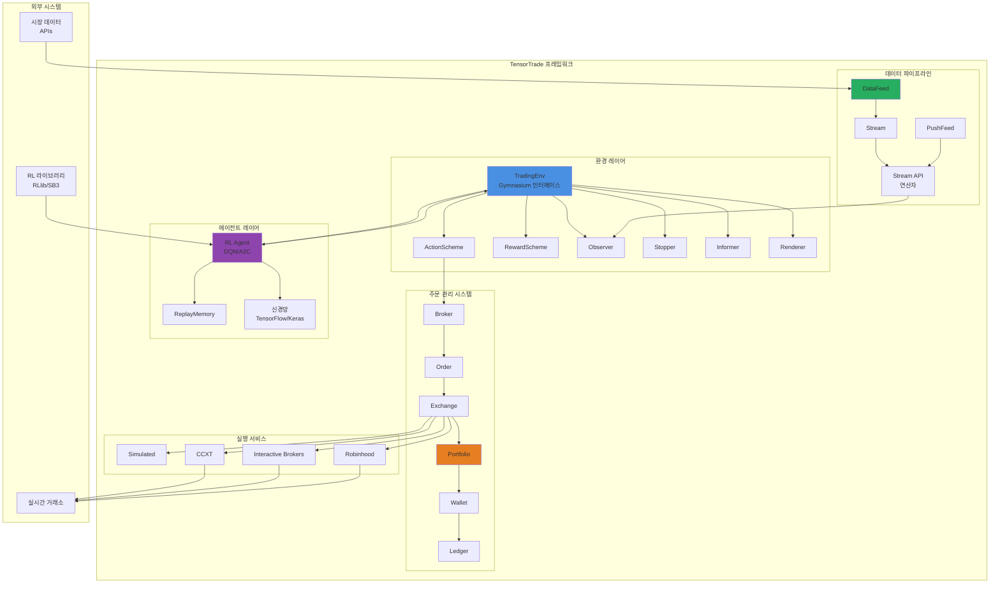
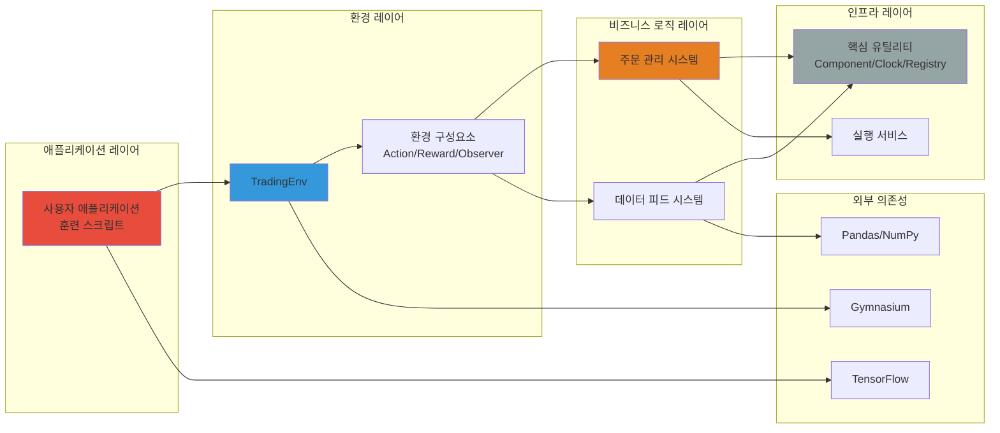
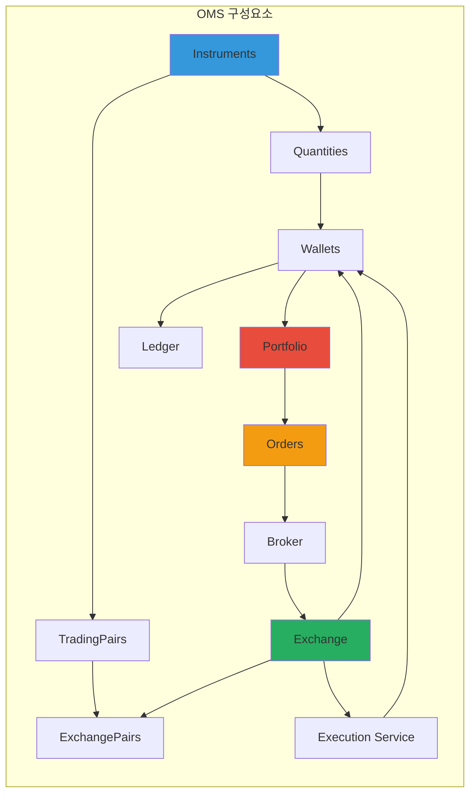
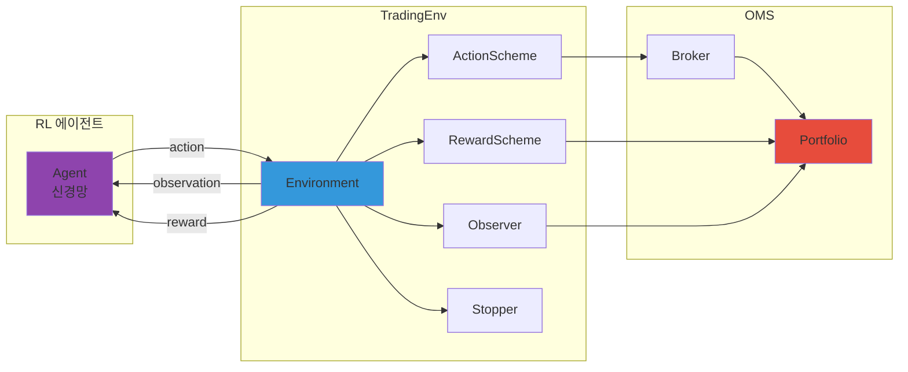

# TensorTrade: 종합 기술 분석 보고서

## 요약

**TensorTrade**는 강화학습(RL)을 사용하여 강력한 트레이딩 알고리즘을 구축, 훈련, 평가 및 배포하기 위해 설계된 오픈소스 Python 프레임워크입니다. 이 프로젝트는 모듈성, 확장성 및 프로덕션 수준의 데이터 파이프라인을 강조하면서 알고리즘 트레이딩 전략의 빠른 실험을 가능하게 합니다. 현재 베타 버전(v1.0.4-dev1)인 TensorTrade는 포괄적인 주문 관리 시스템(OMS), 커스터마이징 가능한 환경 구성요소, 그리고 TensorFlow, Keras, OpenAI Gymnasium과 같은 인기 있는 ML 라이브러리와의 통합을 제공합니다.

**주요 특징:**
- **높은 모듈성 아키텍처** - 플러그인 가능한 구성요소 (거래소, 액션, 보상, 관찰자)
- **강화학습 중심** - Gym 호환 환경 사용
- **프로덕션 지향 설계** - 시뮬레이션 및 실시간 거래 모두 지원
- **포괄적인 OMS** - 시장가, 지정가, 손절매, 이익실현 전략 지원
- **스트림 기반 데이터 파이프라인** - 효율적인 실시간 및 히스토리컬 데이터 처리
- **12,607줄의 Python 코드** - 28개 디렉토리에 걸쳐 구성

**대상 사용자:**
- 퀀트 연구자 및 알고리즘 트레이더
- 금융 분야의 RL 응용을 탐구하는 데이터 과학자
- 자동화된 거래 시스템을 연구하는 학술 연구자
- 거래 인프라를 구축하는 핀테크 개발자

---

## 목차

1. [프로젝트 개요](#프로젝트-개요)
2. [기술 아키텍처](#기술-아키텍처)
3. [프로젝트 구조](#프로젝트-구조)
4. [설치 및 설정](#설치-및-설정)
5. [사용 가이드](#사용-가이드)
6. [개발 가이드라인](#개발-가이드라인)
7. [핵심 구성요소 심층 분석](#핵심-구성요소-심층-분석)
8. [주문 관리 시스템 (OMS)](#주문-관리-시스템-oms)
9. [데이터 피드 아키텍처](#데이터-피드-아키텍처)
10. [강화학습 통합](#강화학습-통합)
11. [성능 고려사항](#성능-고려사항)
12. [보안 및 리스크 관리](#보안-및-리스크-관리)
13. [로드맵 및 향후 개발](#로드맵-및-향후-개발)
14. [라이선스 및 법적 고지](#라이선스-및-법적-고지)
15. [결론](#결론)

---

## 프로젝트 개요

### 문제 정의

강화학습을 사용한 트레이딩 알고리즘 개발에는 상당한 엔지니어링 복잡성이 수반됩니다:

1. **데이터 파이프라인 관리**: 실시간 및 히스토리컬 시장 데이터를 효율적으로 처리
2. **주문 실행 시뮬레이션**: 거래소 동작, 슬리피지, 수수료를 정확하게 모델링
3. **포트폴리오 관리**: 여러 거래소에 걸친 다중 자산 포지션 추적
4. **RL 환경 설계**: 적절한 상태/액션/보상 정의를 가진 Gym 호환 환경 생성
5. **전략 테스트**: 트레이딩 전략의 체계적인 백테스팅 및 평가
6. **프로덕션 배포**: 시뮬레이션에서 실시간 거래로의 전환

### 해결 방법

TensorTrade는 **컴포넌트 기반 아키텍처**를 통해 이러한 과제를 해결합니다:

1. **모듈형 환경 시스템**: 플러그인 가능한 구성요소(ActionScheme, RewardScheme, Observer, Stopper, Informer, Renderer)로 핵심 로직을 재작성하지 않고도 커스터마이징 가능
2. **스트림 기반 데이터 파이프라인**: 효율적인 데이터 변환을 위한 함수형 반응형 프로그래밍 접근
3. **포괄적인 OMS**: 지갑 추적, 원장 기록, 실행 서비스를 갖춘 현실적인 주문 관리
4. **Gym 통합**: 인기 있는 라이브러리(Stable-Baselines3, RLlib 등)와 호환되는 표준 RL 인터페이스
5. **실행 서비스**: 시뮬레이션 거래(백테스팅) 및 실시간 거래(CCXT, Interactive Brokers, Robinhood) 모두 지원

### 핵심 기능

#### 1. 주문 관리 시스템 (OMS)
- **종목 및 수량**: 정밀도 처리를 갖춘 타입 안전 금융 종목 표현
- **지갑 및 포트폴리오**: 잠금 메커니즘을 갖춘 다중 거래소, 다중 자산 포트폴리오 관리
- **주문 유형**: 시장가, 지정가, 손절매, 이익실현 (조건 기반 실행)
- **브로커 시스템**: 주문 큐잉, 검증, 실행 조정
- **원장**: 감사 및 분석을 위한 완전한 거래 이력 추적

#### 2. 트레이딩 환경 구성요소
- **ActionScheme**: RL 에이전트 액션을 트레이딩 주문으로 변환하는 방식 정의
  - BSH (매수/매도/보유)
  - ManagedRiskOrders
  - SimpleOrders
- **RewardScheme**: RL 훈련을 위한 보상 계산
  - SimpleProfit
  - RiskAdjustedReturns (샤프/소르티노 비율)
  - PBR (포지션 기반 수익)
- **Observer**: 포트폴리오 및 시장 데이터로부터 RL 에이전트용 관찰값 생성
- **Stopper**: 에피소드 종료 조건 결정
- **Informer**: 디버깅/로깅을 위한 추가 정보 딕셔너리 제공
- **Renderer**: 트레이딩 성과 시각화 (Plotly 차트, matplotlib)

#### 3. 데이터 피드 시스템
- **Stream API**: 데이터 변환을 위한 함수형 프로그래밍 인터페이스
- **DataFeed**: 여러 데이터 스트림을 컴파일하고 조율
- **PushFeed**: 실시간 거래를 위한 실시간 데이터 처리
- **내장 연산자**: 이동평균, 기술적 지표, 정규화

#### 4. 확률적 프로세스 생성
- **프로세스 시뮬레이션**: 테스트용 합성 가격 데이터 생성
- **다중 모델**: 기하 브라운 운동, Ornstein-Uhlenbeck, Cox-Ingersoll-Ross
- **유틸리티 함수**: 생성된 데이터의 스케일링, 검증 및 분석

#### 5. RL 에이전트 지원
- **내장 에이전트**: 리플레이 메모리를 갖춘 DQN, A2C
- **병렬 훈련**: 분산 DQN 구현
- **외부 라이브러리 지원**: RLlib, Stable-Baselines3와 호환

### 사용 사례

1. **연구 및 개발**: 새로운 트레이딩 전략을 빠르게 프로토타이핑하고 테스트
2. **학술 연구**: 금융 맥락에서 RL 알고리즘 조사
3. **백테스팅**: 현실적인 실행 시뮬레이션을 통해 히스토리컬 데이터로 전략 평가
4. **실시간 거래**: 훈련된 에이전트를 실제 거래소에 배포 (극도의 주의 필요 - 베타 소프트웨어)
5. **교육**: 강화학습 및 알고리즘 트레이딩 개념 학습

---

## 기술 아키텍처

### 고수준 시스템 아키텍처



### 기술 스택

#### 핵심 의존성
| 카테고리 | 기술 | 버전 | 목적 |
|----------|-----------|---------|---------|
| **RL 프레임워크** | OpenAI Gymnasium | ≥0.28.1 | 환경 인터페이스 표준 |
| **딥러닝** | TensorFlow | ≥2.7.0 | 신경망 훈련 |
| **데이터 처리** | NumPy | ≥1.17.0 | 수치 계산 |
| **데이터 관리** | Pandas | ≥0.25.0 | 시계열 처리 |
| **확률 모델** | stochastic | ≥0.6.0 | 가격 프로세스 생성 |
| **설정** | PyYAML | ≥5.1.2 | 설정 파일 파싱 |
| **시각화** | Plotly | ≥4.5.0 | 인터랙티브 차트 |
| **시각화** | Matplotlib | ≥3.1.1 | 정적 플롯 |
| **인터랙티브** | IPython | ≥7.12.0 | 노트북 지원 |
| **Deprecated APIs** | deprecated | ≥1.2.13 | API 폐기 경고 |

#### 선택적 의존성
- **테스팅**: pytest ≥5.1.1, ta ≥0.4.7
- **문서화**: Sphinx, nbsphinx, recommonmark
- **실시간 거래**: ccxt (암호화폐 거래소), ibapi (Interactive Brokers), robin_stocks (Robinhood)

#### Python 버전
- **필수**: Python ≥3.11.9
- **이유**: 최신 타입 힌트, 성능 개선, 최신 비동기 기능

### 디자인 패턴

#### 1. 컴포넌트 패턴
모든 주요 시스템 부분이 `Component` 기본 클래스를 상속하여 다음을 가능하게 합니다:
- `default()` 메서드를 통한 통합 설정
- 의존성 주입
- 동적 인스턴스화를 위한 컴포넌트 레지스트리

```python
class Component:
    def default(self, key, value):
        # 설정 값을 검색하거나 기본값 사용
        pass
```

#### 2. 옵저버 패턴
`Order` 클래스에서 상태 변경을 리스너(예: `OrderListener`)에게 알리는 데 사용:
- `on_execute()`: 주문 제출됨
- `on_fill()`: 주문 부분적/완전히 체결됨
- `on_complete()`: 주문 완료됨
- `on_cancel()`: 주문 취소됨

#### 3. 스트림 처리 (함수형 반응형 프로그래밍)
데이터 변환이 스트림 파이프라인으로 구성됩니다:
```python
price_stream = Stream.source(prices, dtype="float")
sma = price_stream.rolling(window=20).mean()
normalized = (price_stream - sma) / sma
```

#### 4. 전략 패턴
핵심 인터페이스의 다양한 구현:
- `ActionScheme` 구현 (BSH, SimpleOrders)
- `RewardScheme` 구현 (SimpleProfit, RiskAdjustedReturns)
- `ExecutionService` 구현 (Simulated, CCXT, IB)

#### 5. 빌더 패턴
메서드 체이닝을 통한 복잡한 객체 구성:
```python
portfolio = Portfolio(base_instrument=USD, wallets=[...])
exchange = Exchange("binance", service=execute_order) \
    .call(price_stream_btc, price_stream_eth)
```

### 아키텍처 의사결정

#### 결정 1: 레거시 Gym 대신 Gymnasium
**근거**: OpenAI Gym은 폐기됨; Gymnasium은 더 나은 API 설계를 갖춘 적극적으로 유지관리되는 포크입니다 (별도의 `terminated` 및 `truncated` 신호).

#### 결정 2: 금융 계산을 위한 Decimal 정밀도
**문제**: 부동소수점 연산은 금융 계산에서 반올림 오류를 발생시킵니다.
**해결책**: 모든 수량 및 가격 표현에 Python의 `Decimal` 타입 사용.

#### 결정 3: 스트림 기반 데이터 파이프라인
**근거**:
- 선언적 변환이 추론하기 쉬움
- 지연 평가가 최적화를 가능하게 함
- 위상 정렬이 올바른 실행 순서를 보장
- 배치(DataFeed) 및 스트리밍(PushFeed) 모드 모두 지원

#### 결정 4: 환경과 OMS의 분리
**근거**:
- OMS는 비RL 애플리케이션(규칙 기반 전략)에 재사용 가능
- 명확한 관심사 분리 (RL 로직 vs. 트레이딩 로직)
- OMS를 독립적으로 테스트 가능

#### 결정 5: 플러그인 가능한 실행 서비스
**근거**:
- 다양한 사용자가 다양한 실행 백엔드 필요 (시뮬레이션, 실시간, 다중 거래소)
- 거래소별 로직이 실행 서비스에 격리됨
- 새로운 거래소 통합 추가 용이

---

## 프로젝트 구조

### 디렉토리 레이아웃

```
tensortrade/
├── tensortrade/                    # 메인 패키지
│   ├── __init__.py                # 패키지 export
│   ├── version.py                 # 버전 문자열
│   │
│   ├── core/                      # 핵심 유틸리티
│   │   ├── base.py               # 기본 클래스 (Component, TimeIndexed)
│   │   ├── registry.py           # 컴포넌트 레지스트리
│   │   ├── clock.py              # 시간 관리
│   │   └── exceptions.py         # 커스텀 예외
│   │
│   ├── oms/                       # 주문 관리 시스템
│   │   ├── instruments/          # 금융 종목
│   │   │   ├── instrument.py     # 기본 종목 클래스
│   │   │   ├── quantity.py       # 종목이 포함된 수량
│   │   │   ├── trading_pair.py   # 기준/호가 쌍
│   │   │   └── exchange_pair.py  # 거래소 + TradingPair
│   │   │
│   │   ├── wallets/              # 포트폴리오 관리
│   │   │   ├── wallet.py         # 단일 종목 지갑
│   │   │   ├── portfolio.py      # 다중 지갑 포트폴리오
│   │   │   └── ledger.py         # 거래 로그
│   │   │
│   │   ├── orders/               # 주문 시스템
│   │   │   ├── order.py          # Order 클래스
│   │   │   ├── trade.py          # 거래 실행 기록
│   │   │   ├── broker.py         # 주문 큐 매니저
│   │   │   ├── order_spec.py     # 주문 체이닝 (손절매 등)
│   │   │   ├── criteria.py       # 주문 실행 기준
│   │   │   └── create.py         # 주문 팩토리 함수
│   │   │
│   │   ├── exchanges/            # 거래소 추상화
│   │   │   └── exchange.py       # Exchange 기본 클래스
│   │   │
│   │   └── services/             # 실행 서비스
│   │       ├── execution/
│   │       │   ├── simulated.py  # 백테스팅 실행
│   │       │   ├── ccxt.py       # 암호화폐 거래소
│   │       │   ├── interactive_brokers.py
│   │       │   └── robinhood.py
│   │       └── slippage/
│   │           ├── slippage_model.py
│   │           └── random_slippage_model.py
│   │
│   ├── env/                       # RL 환경
│   │   ├── generic/              # 제네릭 환경
│   │   │   ├── environment.py    # TradingEnv 기본 클래스
│   │   │   └── components/       # 환경 구성요소
│   │   │       ├── action_scheme.py
│   │   │       ├── reward_scheme.py
│   │   │       ├── observer.py
│   │   │       ├── stopper.py
│   │   │       ├── informer.py
│   │   │       └── renderer.py
│   │   │
│   │   └── default/              # 기본 구현
│   │       ├── actions.py        # BSH, SimpleOrders 등
│   │       ├── rewards.py        # SimpleProfit, RiskAdjusted
│   │       ├── observers.py      # TensorTradeObserver
│   │       ├── stoppers.py       # MaxLossStopper 등
│   │       ├── informers.py      # TensorTradeInformer
│   │       └── renderers.py      # PlotlyTradingChart 등
│   │
│   ├── feed/                      # 데이터 파이프라인
│   │   ├── core/                 # 핵심 스트림 시스템
│   │   │   ├── base.py           # Stream 기본 클래스
│   │   │   ├── feed.py           # DataFeed, PushFeed
│   │   │   ├── namespace.py      # 스트림 네이밍
│   │   │   └── mixins.py         # 스트림 연산
│   │   │
│   │   └── api/                  # 스트림 연산자
│   │       ├── float/            # 부동소수점 연산
│   │       ├── generic/          # 제네릭 연산
│   │       ├── boolean/          # 불린 로직
│   │       └── string/           # 문자열 연산
│   │
│   ├── agents/                    # RL 에이전트
│   │   ├── agent.py              # 기본 에이전트
│   │   ├── replay_memory.py      # 경험 리플레이
│   │   ├── dqn_agent.py          # Deep Q-Network
│   │   ├── a2c_agent.py          # Advantage Actor-Critic
│   │   └── parallel/             # 분산 훈련
│   │       └── parallel_dqn_agent.py
│   │
│   ├── stochastic/               # 가격 프로세스 생성
│   │   ├── processes/            # 확률적 프로세스
│   │   │   ├── gbm.py            # 기하 브라운 운동
│   │   │   ├── ornstein_uhlenbeck.py
│   │   │   └── cir.py            # Cox-Ingersoll-Ross
│   │   └── utils/                # 유틸리티
│   │
│   ├── data/                      # 데이터 유틸리티 (폐기됨)
│   └── contrib/                   # 커뮤니티 기여
│
├── examples/                      # Jupyter 노트북
│   ├── train_and_evaluate.ipynb
│   ├── use_lstm_rllib.ipynb
│   ├── use_attentionnet_rllib.ipynb
│   ├── setup_environment_tutorial.ipynb
│   ├── ledger_example.ipynb
│   ├── renderers_and_plotly_chart.ipynb
│   └── data/                     # 예제 데이터셋
│
├── tests/                         # 단위 테스트
├── docs/                          # Sphinx 문서
│   ├── source/
│   │   ├── oms/overview.md
│   │   ├── components/*.md
│   │   └── agents/overview.md
│   └── build/
│
├── setup.py                       # 패키지 설치
├── requirements.txt               # 의존성
├── Dockerfile                     # Docker 설정
├── Makefile                       # 빌드 자동화
├── LICENSE                        # Apache 2.0
├── README.md                      # 프로젝트 README
└── CONTRIBUTING.md               # 기여 가이드라인
```

### 파일 구성 근거

#### Core (`core/`)
모든 모듈에서 사용되는 프레임워크 독립적 유틸리티 포함:
- **Component 패턴**: 모든 설정 가능한 구성요소의 기본 클래스
- **Clock**: 동기화를 위한 중앙집중식 시간 관리
- **Registry**: 동적 컴포넌트 로딩/등록
- **Exceptions**: 도메인별 오류 타입

#### OMS (`oms/`)
RL과 독립적으로 사용 가능한 자체 포함 주문 관리 시스템:
- **instruments/**: 거래 가능한 자산의 타입 안전 표현
- **wallets/**: 잠금을 사용한 포트폴리오 상태 관리
- **orders/**: 주문 생명주기 및 실행
- **exchanges/**: 거래소 추상화 레이어
- **services/**: 실행 백엔드 (시뮬레이션/실시간)

#### Environment (`env/`)
강화학습 환경 구현:
- **generic/**: Gymnasium 인터페이스를 따르는 기본 클래스
- **default/**: 일반적인 사용 사례를 위한 사전 구축 구성요소

#### Feed (`feed/`)
데이터 파이프라인용 스트림 처리 라이브러리:
- **core/**: 스트림 추상화 및 실행 엔진
- **api/**: 타입별 연산자 (float, boolean, string)

#### Agents (`agents/`)
내장 RL 알고리즘 (선택사항 - 사용자는 외부 라이브러리 사용 가능):
- DQN 및 A2C 구현
- 리플레이 메모리 유틸리티
- 병렬 훈련 지원

### 프로젝트 계층 구조 다이어그램



---

## 설치 및 설정

### 전제 조건

#### 시스템 요구사항
- **운영 체제**: Linux, macOS, 또는 Windows (WSL 권장)
- **Python**: 3.11.9 이상
- **메모리**: 최소 4GB RAM (훈련을 위해 8GB+ 권장)
- **스토리지**: 설치를 위한 500MB, 데이터셋을 위한 추가 공간

#### 필수 소프트웨어
- Python 3.11.9+
- pip (Python 패키지 관리자)
- Git (저장소 복제용)

#### 선택적 소프트웨어
- Docker (컨테이너화된 배포용)
- Jupyter Notebook/Lab (예제 실행용)
- CUDA 지원 GPU (TensorFlow를 사용한 빠른 훈련용)

### 설치 방법

#### 방법 1: PyPI에서 설치 (사용자에게 권장)

```bash
# 최신 안정 릴리스 설치
pip install tensortrade

# 설치 확인
python -c "import tensortrade; print(tensortrade.__version__)"
```

#### 방법 2: 소스에서 설치 (최신 개발 버전)

```bash
# GitHub에서 직접 설치
pip install git+https://github.com/tensortrade-org/tensortrade.git

# 경고: 이것은 마스터 브랜치의 최신 커밋을 설치합니다
# 테스트되지 않은 코드를 포함할 수 있습니다
```

#### 방법 3: 로컬 개발 설치

```bash
# 저장소 복제
git clone https://github.com/tensortrade-org/tensortrade.git
cd tensortrade

# 기본 요구사항 설치
pip install -r requirements.txt

# 예제 요구사항 설치 (선택사항)
pip install -r examples/requirements.txt

# 개발을 위해 편집 가능 모드로 설치
pip install -e .
```

#### 방법 4: Docker 설치

```bash
# 저장소 복제
git clone https://github.com/tensortrade-org/tensortrade.git
cd tensortrade

# Docker에서 Jupyter 노트북 실행
make run-notebook
# http://127.0.0.1:8888/?token=... 에서 접속

# Docker에서 테스트 실행
make run-tests

# Docker에서 문서 빌드
make run-docs
```

### 설정

#### 환경 변수

설정을 위한 `.env` 파일 생성:

```bash
# 로깅
LOG_LEVEL=INFO

# TensorFlow
TF_CPP_MIN_LOG_LEVEL=2  # TF 경고 억제

# 실시간 거래 API 키 (실시간 실행 사용 시)
BINANCE_API_KEY=your_api_key
BINANCE_API_SECRET=your_api_secret

COINBASE_API_KEY=your_api_key
COINBASE_API_SECRET=your_api_secret
```

#### GPU 설정 (선택사항)

TensorFlow GPU 지원을 위해:

```bash
# CUDA 지원 TensorFlow 설치
pip install tensorflow-gpu

# GPU 가용성 확인
python -c "import tensorflow as tf; print(tf.config.list_physical_devices('GPU'))"
```

### 검증

설치를 확인하기 위해 이 스크립트를 실행하세요:

```python
import tensortrade as tt
from tensortrade.env.default import create
from tensortrade.feed.core import DataFeed, Stream
from tensortrade.oms.exchanges import Exchange
from tensortrade.oms.services.execution.simulated import execute_order
from tensortrade.oms.instruments import USD, BTC

# 거래소 생성
exchange = Exchange("binance", service=execute_order)(
    Stream.source([7000, 7500, 8000], dtype="float").rename("BTC/USD")
)

# 환경 생성
env = create(
    portfolio=tt.Portfolio(USD, [
        tt.Wallet(exchange, 10000 * USD),
        tt.Wallet(exchange, 0 * BTC)
    ]),
    action_scheme="managed-risk",
    reward_scheme="risk-adjusted",
    window_size=1
)

print("TensorTrade 설치가 성공적으로 확인되었습니다!")
print(f"버전: {tt.__version__}")
```

### 일반적인 문제 및 해결 방법

#### 문제 1: Python 버전 불일치
**오류**: `TensorTrade is only compatible with Python 3.`
**해결책**: Python 3.11.9+로 업그레이드
```bash
python --version
# 3.11.9 미만인 경우, 최신 Python 설치
```

#### 문제 2: TensorFlow 설치 실패
**오류**: `Could not install packages due to an EnvironmentError`
**해결책**: `--user` 플래그로 설치
```bash
pip install --user tensorflow
```

#### 문제 3: 모듈 임포트 오류
**오류**: `ModuleNotFoundError: No module named 'tensortrade'`
**해결책**: 올바른 Python 환경이 활성화되어 있는지 확인
```bash
which python
pip list | grep tensortrade
```

#### 문제 4: Decimal 정밀도 경고
**경고**: `Price quantized...would amount to 0`
**해결책**: 종목 정밀도를 높이거나 가격 스케일 조정
```python
from tensortrade.oms.instruments import Instrument

# 더 높은 정밀도의 커스텀 종목
HIGH_PRECISION_BTC = Instrument("BTC", 10, "Bitcoin")
```

#### 문제 5: Docker 권한 거부
**오류**: `docker: Got permission denied while trying to connect`
**해결책**: 사용자를 docker 그룹에 추가
```bash
sudo usermod -aG docker $USER
newgrp docker
```

---

## 사용 가이드

### 기본 예제: 간단한 트레이딩 환경

이 예제는 데이터 준비부터 환경 생성까지의 완전한 워크플로우를 보여줍니다:

```python
import numpy as np
import pandas as pd
import tensortrade as tt

from tensortrade.env.default import create
from tensortrade.feed.core import DataFeed, Stream
from tensortrade.oms.exchanges import Exchange
from tensortrade.oms.services.execution.simulated import execute_order
from tensortrade.oms.instruments import USD, BTC, ETH
from tensortrade.oms.wallets import Wallet, Portfolio

# 1. 가격 데이터 준비
prices = pd.DataFrame({
    'open': np.random.uniform(7000, 8000, 100),
    'high': np.random.uniform(8000, 9000, 100),
    'low': np.random.uniform(6000, 7000, 100),
    'close': np.random.uniform(7000, 8000, 100),
    'volume': np.random.uniform(1000, 10000, 100)
})

# 2. 가격 스트림 생성
price_stream = Stream.source(
    prices['close'].tolist(),
    dtype="float"
).rename("BTC/USD")

# 3. 가격 스트림을 사용한 거래소 생성
exchange = Exchange("binance", service=execute_order)(
    price_stream
)

# 4. 초기 자본으로 포트폴리오 생성
portfolio = Portfolio(USD, [
    Wallet(exchange, 10000 * USD),  # $10,000 초기 자본
    Wallet(exchange, 0 * BTC)       # 초기 BTC 0개
])

# 5. 트레이딩 환경 생성
env = create(
    portfolio=portfolio,
    action_scheme="managed-risk",  # 리스크 관리 주문 사용
    reward_scheme="risk-adjusted",  # 샤프 비율 보상
    window_size=20                  # 20-스텝 관찰 윈도우
)

# 6. 환경 실행
obs, info = env.reset()
done = False
total_reward = 0

while not done:
    action = env.action_space.sample()  # 랜덤 액션
    obs, reward, terminated, truncated, info = env.step(action)
    done = terminated or truncated
    total_reward += reward

print(f"에피소드 종료, 총 보상: {total_reward}")
print(f"최종 순자산: {info['net_worth']}")
```

### 고급 예제: 커스텀 액션 스킴

```python
from typing import List
from gymnasium.spaces import Discrete
from tensortrade.env.default import TensorTradeActionScheme
from tensortrade.oms.orders import Order, proportion_order

class CustomActionScheme(TensorTradeActionScheme):
    """
    커스텀 액션 스킴:
    0 = 보유
    1 = 25% 매수
    2 = 50% 매수
    3 = 100% 매수
    4 = 25% 매도
    5 = 50% 매도
    6 = 100% 매도
    """

    def __init__(self):
        super().__init__()
        self.action_space = Discrete(7)

    def get_orders(self, action: int, portfolio: Portfolio) -> List[Order]:
        action_map = {
            0: None,      # 보유
            1: 0.25,      # 25% 매수
            2: 0.50,      # 50% 매수
            3: 1.00,      # 100% 매수
            4: -0.25,     # 25% 매도
            5: -0.50,     # 50% 매도
            6: -1.00      # 100% 매도
        }

        proportion = action_map[action]
        if proportion is None or proportion == 0:
            return []

        side = TradeSide.BUY if proportion > 0 else TradeSide.SELL
        trade_pair = portfolio.exchange_pairs[0]

        order = proportion_order(
            portfolio=portfolio,
            side=side,
            exchange_pair=trade_pair,
            proportion=abs(proportion)
        )

        return [order] if order else []

# 커스텀 액션 스킴 사용
env = TradingEnv(
    action_scheme=CustomActionScheme(),
    reward_scheme=SimpleProfit(),
    observer=observer,
    stopper=stopper,
    informer=informer,
    renderer=renderer
)
```

### 커스텀 보상 스킴 예제

```python
from tensortrade.env.default import TensorTradeRewardScheme

class DrawdownPenaltyReward(TensorTradeRewardScheme):
    """
    수익에 보상하지만 최고 순자산으로부터의 손실에 페널티를 부여합니다.
    """

    def __init__(self, drawdown_penalty=2.0):
        self.drawdown_penalty = drawdown_penalty
        self.peak_net_worth = 0

    def get_reward(self, portfolio: Portfolio) -> float:
        net_worth = portfolio.net_worth

        # 최고값 업데이트
        self.peak_net_worth = max(self.peak_net_worth, net_worth)

        # 손실 계산
        drawdown = (self.peak_net_worth - net_worth) / self.peak_net_worth

        # 수익 계산
        profit = (net_worth - portfolio.initial_net_worth) / portfolio.initial_net_worth

        # 수익에 보상, 손실에 페널티
        reward = profit - self.drawdown_penalty * drawdown

        return reward

    def reset(self):
        self.peak_net_worth = 0
```

### 기술적 지표를 사용한 데이터 피드

```python
from tensortrade.feed.core import Stream, DataFeed

# 히스토리컬 데이터 로드
df = pd.read_csv("btc_usd_historical.csv")

# OHLCV 데이터용 스트림 생성
open_price = Stream.source(df['open'].tolist(), dtype="float").rename("open")
high_price = Stream.source(df['high'].tolist(), dtype="float").rename("high")
low_price = Stream.source(df['low'].tolist(), dtype="float").rename("low")
close_price = Stream.source(df['close'].tolist(), dtype="float").rename("close")
volume = Stream.source(df['volume'].tolist(), dtype="float").rename("volume")

# 기술적 지표 계산
sma_20 = close_price.rolling(window=20).mean().rename("sma_20")
sma_50 = close_price.rolling(window=50).mean().rename("sma_50")

# RSI 계산 (단순화됨)
delta = close_price.diff()
gain = delta.clamp_min(0).rolling(window=14).mean()
loss = (-delta).clamp_min(0).rolling(window=14).mean()
rs = gain / loss
rsi = (100 - (100 / (1 + rs))).rename("rsi")

# 볼린저 밴드
std = close_price.rolling(window=20).std()
bb_upper = (sma_20 + 2 * std).rename("bb_upper")
bb_lower = (sma_20 - 2 * std).rename("bb_lower")

# 데이터 피드 생성
feed = DataFeed([
    close_price,
    sma_20,
    sma_50,
    rsi,
    bb_upper,
    bb_lower,
    volume
])

# 관찰자에서 사용
from tensortrade.env.generic.components import Observer

observer = Observer(
    feed=feed,
    window_size=20,
    min_periods=50
)
```

### Stable-Baselines3를 사용한 훈련

```python
from stable_baselines3 import PPO
from stable_baselines3.common.vec_env import DummyVecEnv

# 환경 생성
env = create(
    portfolio=portfolio,
    action_scheme="managed-risk",
    reward_scheme="risk-adjusted"
)

# 벡터화된 훈련을 위해 래핑
env = DummyVecEnv([lambda: env])

# PPO 에이전트 생성
model = PPO(
    "MlpPolicy",
    env,
    verbose=1,
    learning_rate=0.0003,
    n_steps=2048,
    batch_size=64,
    n_epochs=10,
    gamma=0.99,
    tensorboard_log="./tensorboard/"
)

# 훈련
model.learn(total_timesteps=100000)

# 모델 저장
model.save("ppo_trading_agent")

# 평가
obs = env.reset()
for i in range(1000):
    action, _states = model.predict(obs, deterministic=True)
    obs, reward, done, info = env.step(action)
    if done:
        print(f"에피소드 {i} 종료")
        print(f"순자산: {info[0]['net_worth']}")
        obs = env.reset()
```

### 실시간 거래 설정 (극도의 주의 필요)

```python
from tensortrade.oms.services.execution.ccxt import CCXTExecution
import ccxt

# 경고: 이 예제는 교육 목적으로만 제공됩니다
# 실제 자금을 사용한 실시간 거래는 극도로 위험합니다
# TensorTrade는 베타 소프트웨어입니다 - 본인 책임하에 사용하세요

# 실시간 거래소 연결 생성
ccxt_exchange = ccxt.binance({
    'apiKey': 'YOUR_API_KEY',
    'secret': 'YOUR_API_SECRET',
    'enableRateLimit': True
})

# 실시간 실행을 사용한 TensorTrade 거래소 생성
exchange = Exchange(
    "binance",
    service=CCXTExecution(ccxt_exchange),
    options=ExchangeOptions(
        commission=0.001,  # 0.1% 수수료
        is_live=True
    )
)

# 실시간 데이터를 위한 PushFeed 사용
from tensortrade.feed.core import PushFeed, Placeholder

price_placeholder = Placeholder(dtype="float", name="BTC/USD")
feed = PushFeed([price_placeholder])

# 트레이딩 루프에서:
while True:
    # 거래소에서 최신 가격 가져오기
    ticker = ccxt_exchange.fetch_ticker('BTC/USDT')
    current_price = ticker['last']

    # 피드에 푸시
    data = feed.push({'BTC/USD': current_price})

    # 훈련된 에이전트로부터 액션 가져오기
    action = model.predict(observation)

    # 환경에서 실행 (실제 주문을 배치함)
    observation, reward, done, info = env.step(action)

    # 다음 반복 전 대기
    time.sleep(60)  # 1분 간격
```

---

## 개발 가이드라인

### 개발 환경 설정

#### 전제 조건
- Python 3.11.9+
- Git
- 가상 환경 도구 (venv, conda, 또는 virtualenv)

#### 설정 단계

```bash
# 1. 저장소 복제
git clone https://github.com/tensortrade-org/tensortrade.git
cd tensortrade

# 2. 가상 환경 생성
python -m venv venv
source venv/bin/activate  # Windows: venv\Scripts\activate

# 3. 개발 의존성 설치
pip install -r requirements.txt
pip install -r examples/requirements.txt

# 4. 편집 가능 모드로 설치
pip install -e .

# 5. 테스팅 의존성 설치
pip install pytest pytest-cov

# 6. 설정 확인
pytest tests/
```

### 코드 스타일 및 규칙

#### Python 스타일 가이드
TensorTrade는 일부 수정과 함께 **PEP 8**을 따릅니다:

- **줄 길이**: 100자 (79자 아님)
- **임포트**: 그룹화 및 정렬
  1. 표준 라이브러리
  2. 서드파티 라이브러리
  3. 로컬 임포트
- **Docstring**: NumPy 스타일

#### 예제 코드 스타일

```python
# Copyright 2020 The TensorTrade Authors.
#
# Licensed under the Apache License, Version 2.0 (the "License");
# ...

"""모듈의 목적을 설명하는 docstring."""

from typing import List, Optional, Union
from decimal import Decimal

import numpy as np
import pandas as pd

from tensortrade.core import Component
from tensortrade.oms.instruments import Instrument


class MyComponent(Component):
    """무언가를 수행하는 컴포넌트.

    Parameters
    ----------
    param1 : str
        param1의 설명.
    param2 : int, optional
        param2의 설명. 기본값은 10.

    Attributes
    ----------
    attribute1 : float
        attribute1의 설명.
    """

    def __init__(self, param1: str, param2: int = 10) -> None:
        super().__init__()
        self.param1 = self.default('param1', param1)
        self.param2 = self.default('param2', param2)
        self.attribute1 = 0.0

    def method1(self, arg1: str) -> List[int]:
        """arg1로 무언가를 수행합니다.

        Parameters
        ----------
        arg1 : str
            처리할 인자.

        Returns
        -------
        List[int]
            처리된 결과.

        Raises
        ------
        ValueError
            arg1이 유효하지 않은 경우.
        """
        if not arg1:
            raise ValueError("arg1은 비어있을 수 없습니다")

        # 구현
        return [1, 2, 3]
```

#### 타입 힌트
모든 함수 시그니처에 타입 힌트를 사용하세요:

```python
from typing import List, Dict, Optional, Union, Tuple

def process_data(
    data: pd.DataFrame,
    columns: Optional[List[str]] = None
) -> Dict[str, np.ndarray]:
    """데이터를 처리하고 결과를 반환합니다."""
    pass
```

### 테스팅 절차

#### 테스트 실행

```bash
# 모든 테스트 실행
pytest

# 커버리지와 함께 실행
pytest --cov=tensortrade --cov-report=html

# 특정 테스트 파일 실행
pytest tests/test_portfolio.py

# 특정 테스트 실행
pytest tests/test_portfolio.py::test_portfolio_creation

# 상세한 출력으로 실행
pytest -v

# print 문이 보이도록 실행
pytest -s
```

#### 테스트 작성

모든 테스트에 pytest를 사용하세요:

```python
# tests/test_portfolio.py
import pytest
from tensortrade.oms.wallets import Portfolio, Wallet
from tensortrade.oms.instruments import USD, BTC
from tensortrade.oms.exchanges import Exchange
from tensortrade.oms.services.execution.simulated import execute_order


@pytest.fixture
def exchange():
    """테스트 거래소 생성."""
    return Exchange("test", service=execute_order)


@pytest.fixture
def portfolio(exchange):
    """테스트 포트폴리오 생성."""
    return Portfolio(USD, [
        Wallet(exchange, 10000 * USD),
        Wallet(exchange, 0 * BTC)
    ])


def test_portfolio_creation(portfolio):
    """포트폴리오가 올바르게 생성되는지 테스트."""
    assert portfolio.base_instrument == USD
    assert len(portfolio.wallets) == 2
    assert portfolio.base_balance.size == 10000


def test_portfolio_balance(portfolio):
    """포트폴리오 잔액 계산을 테스트."""
    usd_balance = portfolio.balance(USD)
    btc_balance = portfolio.balance(BTC)

    assert usd_balance.size == 10000
    assert btc_balance.size == 0


def test_portfolio_reset(portfolio):
    """포트폴리오 리셋 기능을 테스트."""
    # 포트폴리오 상태 수정
    # ...

    # 리셋
    portfolio.reset()

    # 리셋 확인
    assert portfolio.base_balance.size == 10000
```

#### 테스트 커버리지 표준
- **최소 커버리지**: 70%
- **목표 커버리지**: 85%+
- **중요 경로**: 95%+ (OMS, 주문 실행, 포트폴리오 관리)

### 기여 가이드라인

#### 기여하기 전에

1. **기존 이슈 확인**: 관련 이슈/PR 검색
2. **주요 변경사항 논의**: 대규모 PR 전에 논의를 위한 이슈 열기
3. **CONTRIBUTING.md 읽기**: 공식 기여 가이드라인 따르기

#### Pull Request 프로세스

1. **저장소 포크**
   ```bash
   git clone https://github.com/YOUR_USERNAME/tensortrade.git
   cd tensortrade
   git remote add upstream https://github.com/tensortrade-org/tensortrade.git
   ```

2. **기능 브랜치 생성**
   ```bash
   git checkout -b feature/my-new-feature
   ```

3. **변경사항 작성**
   - 스타일 가이드라인을 따라 코드 작성
   - 새로운 기능에 대한 테스트 추가
   - 문서 업데이트

4. **로컬에서 테스트 실행**
   ```bash
   pytest
   ```

5. **변경사항 커밋**
   ```bash
   git add .
   git commit -m "feat: 새로운 기능 X 추가"
   ```

   **커밋 메시지 형식** (Conventional Commits):
   - `feat:` 새로운 기능
   - `fix:` 버그 수정
   - `docs:` 문서만
   - `style:` 코드 스타일 변경 (포매팅)
   - `refactor:` 코드 리팩토링
   - `test:` 테스트 추가
   - `chore:` 유지보수 작업

6. **포크에 푸시**
   ```bash
   git push origin feature/my-new-feature
   ```

7. **Pull Request 생성**
   - GitHub로 이동하여 PR 생성
   - PR 템플릿 작성
   - 관련 이슈 링크
   - 리뷰 요청

#### PR 체크리스트

- [ ] 코드가 프로젝트 스타일 가이드라인을 따름
- [ ] 테스트가 추가/업데이트되고 통과함
- [ ] 문서가 업데이트됨 (필요한 경우)
- [ ] 커밋 메시지가 Conventional Commits를 따름
- [ ] 병합 충돌 없음
- [ ] 변경 로그 업데이트됨 (중요한 변경사항의 경우)

---

## 핵심 구성요소 심층 분석

### 컴포넌트 시스템

`Component` 클래스는 TensorTrade 아키텍처의 기반으로, 설정 관리와 확장성을 제공합니다.

#### 컴포넌트 기본 클래스

```python
class Component:
    """설정되고 등록될 수 있는 컴포넌트."""

    registered_name = None  # 서브클래스에서 재정의

    def __init__(self):
        self._config = {}

    def default(self, key: str, value: Any) -> Any:
        """설정된 값을 가져오거나 기본값 사용.

        Parameters
        ----------
        key : str
            설정 키.
        value : Any
            설정되지 않은 경우의 기본값.

        Returns
        -------
        Any
            설정된 값 또는 기본값.
        """
        if hasattr(self, '_config') and key in self._config:
            return self._config[key]
        return value
```

### Clock 및 시간 관리

`Clock` 클래스는 컴포넌트 간의 동기화를 위한 중앙집중식 시간 관리를 제공합니다.

```python
class Clock:
    """컴포넌트 간의 시간 동기화를 위한 시계."""

    def __init__(self):
        self.step = 0

    def increment(self):
        """시간을 한 스텝 증가."""
        self.step += 1

    def reset(self):
        """시계를 0으로 리셋."""
        self.step = 0
```

모든 시간 의존적 컴포넌트(거래소, 주문, 포트폴리오)는 동일한 시계를 공유합니다:

```python
env = TradingEnv(...)
env.clock.step  # 현재 타임스텝

# 모든 컴포넌트 동기화됨
assert env.action_scheme.clock.step == env.clock.step
assert env.portfolio.clock.step == env.clock.step
```

---

## 주문 관리 시스템 (OMS)

### 아키텍처 개요



### 종목 및 수량

#### 종목 정의

```python
class Instrument:
    """거래 가능한 금융 종목.

    Parameters
    ----------
    symbol : str
        종목의 심볼 (예: 'BTC', 'USD').
    precision : int
        수량 표현을 위한 소수점 정밀도.
    name : str
        종목의 전체 이름.
    """

    def __init__(self, symbol: str, precision: int = 8, name: str = None):
        self.symbol = symbol
        self.precision = precision
        self.name = name or symbol

# 사전 정의된 일반 종목
USD = Instrument("USD", 2, "U.S. Dollar")
EUR = Instrument("EUR", 2, "Euro")
BTC = Instrument("BTC", 8, "Bitcoin")
ETH = Instrument("ETH", 8, "Ethereum")
```

#### 수량 연산

```python
class Quantity:
    """종목의 양.

    Parameters
    ----------
    instrument : Instrument
        이 수량이 표시되는 종목.
    size : Decimal 또는 float
        수량의 크기.
    """

    def __init__(self, instrument: Instrument, size: Union[Decimal, float]):
        self.instrument = instrument
        self.size = Decimal(size).quantize(Decimal(10) ** -instrument.precision)

    def __add__(self, other):
        if self.instrument != other.instrument:
            raise ValueError("다른 종목의 수량은 더할 수 없습니다")
        return Quantity(self.instrument, self.size + other.size)

    def __sub__(self, other):
        if self.instrument != other.instrument:
            raise ValueError("다른 종목의 수량은 뺄 수 없습니다")
        return Quantity(self.instrument, self.size - other.size)

    def __mul__(self, scalar):
        return Quantity(self.instrument, self.size * Decimal(scalar))

    def __truediv__(self, scalar):
        return Quantity(self.instrument, self.size / Decimal(scalar))

# 편리한 연산자 오버로딩
quantity = 10 * BTC  # Quantity(BTC, 10) 생성
total = quantity + 5 * BTC  # Quantity(BTC, 15)
```

---

## 데이터 피드 아키텍처

### 스트림 처리 모델

TensorTrade는 데이터 처리를 위해 함수형 반응형 프로그래밍(FRP) 모델을 사용합니다.

#### 스트림 기본 클래스

```python
class Stream:
    """데이터 값의 스트림."""

    def __init__(self, name=None):
        self.name = name or f"stream_{id(self)}"
        self.inputs = []
        self.value = None

    @staticmethod
    def source(iterable, dtype="float"):
        """데이터로부터 소스 스트림 생성."""
        return IterableStream(iterable, dtype)

    def forward(self):
        """다음 값을 계산 (서브클래스에서 재정의)."""
        raise NotImplementedError()

    def run(self):
        """스트림 계산 실행."""
        for input_stream in self.inputs:
            if not input_stream.has_next():
                return

        self.value = self.forward()

    def has_next(self) -> bool:
        """더 많은 값이 사용 가능한지 확인."""
        return all(s.has_next() for s in self.inputs)

    def reset(self):
        """스트림을 초기 상태로 리셋."""
        self.value = None
        for input_stream in self.inputs:
            input_stream.reset()
```

---

## 강화학습 통합

### 환경 인터페이스



### Gymnasium 통합

```python
class TradingEnv(gymnasium.Env):
    """Gymnasium 호환 트레이딩 환경."""

    def __init__(self, action_scheme, reward_scheme, observer,
                 stopper, informer, renderer, **kwargs):
        super().__init__()

        self.clock = Clock()
        self.action_scheme = action_scheme
        self.reward_scheme = reward_scheme
        self.observer = observer
        self.stopper = stopper
        self.informer = informer
        self.renderer = renderer

        # 모든 컴포넌트에 시계 설정
        for component in self.components.values():
            component.clock = self.clock

        # 공간 정의
        self.action_space = action_scheme.action_space
        self.observation_space = observer.observation_space

    def step(self, action):
        """하나의 타임스텝 실행.

        Returns
        -------
        observation : np.array
            환경의 에이전트 관찰값.
        reward : float
            액션을 취한 것에 대한 보상.
        terminated : bool
            에피소드가 끝났는지 (성공/실패).
        truncated : bool
            에피소드가 중단되었는지 (시간 제한 등).
        info : dict
            디버깅을 위한 추가 정보.
        """
        # 액션 실행
        self.action_scheme.perform(self, action)

        # 관찰값 생성
        obs = self.observer.observe(self)

        # 보상 계산
        reward = self.reward_scheme.reward(self)

        # 종료 확인
        terminated = self.stopper.stop(self)
        truncated = False

        # 정보 수집
        info = self.informer.info(self)

        # 시간 증가
        self.clock.increment()

        return obs, reward, terminated, truncated, info

    def reset(self, seed=None, options=None):
        """환경을 초기 상태로 리셋.

        Returns
        -------
        observation : np.array
            초기 관찰값.
        info : dict
            추가 정보.
        """
        # 시계 리셋
        self.clock.reset()

        # 모든 컴포넌트 리셋
        for component in self.components.values():
            component.reset()

        # 초기 관찰값 가져오기
        obs = self.observer.observe(self)
        info = self.informer.info(self)

        return obs, info

    def render(self, mode='human'):
        """환경 렌더링."""
        return self.renderer.render(self, mode)
```

---

## 성능 고려사항

### 계산 효율성

#### 스트림 처리 최적화
- **지연 평가**: 스트림은 필요할 때만 계산
- **위상 정렬**: 최소한의 중복 계산 보장
- **벡터화**: 가능한 경우 NumPy 연산 사용

```python
# 비효율적: Python 루프
prices_normalized = []
for i in range(len(prices)):
    mean = np.mean(prices[max(0, i-20):i+1])
    std = np.std(prices[max(0, i-20):i+1])
    prices_normalized.append((prices[i] - mean) / std)

# 효율적: Pandas 롤링 연산
prices_normalized = (prices - prices.rolling(20).mean()) / prices.rolling(20).std()
```

#### 메모리 관리
- **Decimal 정밀도**: 필요한 경우에만 `Decimal` 사용 (주문 실행); 관찰값에는 float 사용
- **스트림 히스토리**: 저장된 히스토리를 제한하기 위해 `min_periods` 설정
- **배치 처리**: 여러 환경을 병렬로 처리

### 확장성 전략

#### 1. 병렬 환경 훈련

```python
from stable_baselines3.common.vec_env import SubprocVecEnv

def make_env(rank):
    def _init():
        env = create(portfolio=portfolio, ...)
        return env
    return _init

# 8개의 병렬 환경 생성
num_envs = 8
envs = SubprocVecEnv([make_env(i) for i in range(num_envs)])

model = PPO("MlpPolicy", envs)
model.learn(total_timesteps=1000000)
```

#### 백테스팅 성능

#### 일반적인 성능 지표
- **백테스트 속도**: 10,000-100,000 스텝/초 (CPU)
- **메모리 사용량**: 일반적인 전략의 경우 500MB-2GB
- **훈련 시간**: 1M 스텝에 대해 1-8시간 (네트워크 복잡도에 따라)

---

## 보안 및 리스크 관리

### 실시간 거래 리스크

**경고**: TensorTrade는 베타 소프트웨어입니다. 실시간 거래에는 상당한 리스크가 수반됩니다:
1. **금전적 손실**: 버그로 인해 의도하지 않은 거래 및 자본 손실 발생 가능
2. **API 키 노출**: 부적절한 저장으로 계정 침해 발생 가능
3. **시장 리스크**: 변동성이 큰 시장은 빠른 손실을 초래할 수 있음
4. **실행 리스크**: 슬리피지 및 실패한 주문이 일반적임
5. **전략 리스크**: 백테스트된 전략이 실시간 시장에서 실패할 수 있음

### 보안 모범 사례

#### 1. API 키 관리

```python
# 나쁨: 하드코딩된 키
api_key = "my_secret_key_12345"

# 좋음: 환경 변수
import os
api_key = os.getenv("EXCHANGE_API_KEY")

# 더 좋음: 시크릿 관리 사용 (AWS Secrets Manager, HashiCorp Vault)
import boto3
client = boto3.client('secretsmanager')
response = client.get_secret_value(SecretId='trading_api_keys')
api_key = json.loads(response['SecretString'])['api_key']
```

#### 2. 주문 검증

```python
class SafetyOrderListener(OrderListener):
    """실행 전 주문을 검증합니다."""

    def __init__(self, max_order_size=1000, max_daily_trades=100):
        self.max_order_size = max_order_size
        self.max_daily_trades = max_daily_trades
        self.daily_trade_count = 0

    def on_execute(self, order):
        # 주문 크기 확인
        if order.size > self.max_order_size:
            order.cancel(f"최대 크기 초과: {self.max_order_size}")
            raise ValueError(f"주문 크기 {order.size}가 제한을 초과합니다")

        # 일일 거래 제한 확인
        if self.daily_trade_count >= self.max_daily_trades:
            order.cancel("일일 거래 제한 도달")
            raise ValueError("일일 거래 제한 도달")

        self.daily_trade_count += 1
        logging.info(f"주문 검증됨: {order}")

# 사용
portfolio.order_listener = SafetyOrderListener()
```

---

## 로드맵 및 향후 개발

### 현재 상태 (v1.0.4-dev1)

TensorTrade는 **베타** 상태입니다. 이는 다음을 의미합니다:
- 핵심 기능이 구현되고 테스트됨
- 버전 간 API가 변경될 수 있음
- 프로덕션 사용은 주의해서 접근해야 함
- 활발한 개발 및 커뮤니티 기여가 진행 중

### 계획된 기능

#### 단기 (향후 6개월)
1. **개선된 문서**
   - 더 많은 튜토리얼 및 예제
   - 비디오 워크스루
   - API 참조 개선

2. **추가 실행 서비스**
   - Alpaca 통합
   - Kraken 지원
   - TD Ameritrade 통합

3. **성능 최적화**
   - 중요 경로의 Cython 컴파일
   - 더 나은 메모리 관리
   - 더 빠른 백테스팅

4. **향상된 시각화**
   - 실시간 성과 대시보드
   - TradingView 통합
   - Jupyter 위젯 개선

#### 중기 (6-12개월)
1. **포트폴리오 분석**
   - 고급 성과 지표 (Sortino, Calmar 등)
   - 리스크 귀속 분석
   - 팩터 노출 추적

2. **다중 에이전트 지원**
   - 하나의 환경에서 여러 전략
   - 에이전트 경쟁/협력
   - 메타 학습 프레임워크

3. **데이터 관리**
   - 내장 데이터 다운로더 (Yahoo Finance, Alpha Vantage 등)
   - 데이터 캐싱 및 전처리
   - 실시간 데이터 스트리밍 개선

#### 장기 (12개월 이상)
1. **프로덕션 배포 도구**
   - 실시간 거래용 Docker 컨테이너
   - Kubernetes 오케스트레이션
   - 모니터링 및 알림 시스템

2. **고급 RL 알고리즘**
   - 모델 기반 RL (Dreamer, MuZero)
   - 다중 작업 학습
   - 전략 적응을 위한 메타 RL

---

## 라이선스 및 법적 고지

### 라이선스

TensorTrade는 **Apache License 2.0** 하에 라이선스됩니다.

```
Copyright 2021 The TensorTrade Authors.

Licensed under the Apache License, Version 2.0 (the "License");
you may not use this file except in compliance with the License.
You may obtain a copy of the License at

    http://www.apache.org/licenses/LICENSE-2.0

Unless required by applicable law or agreed to in writing, software
distributed under the License is distributed on an "AS IS" BASIS,
WITHOUT WARRANTIES OR CONDITIONS OF ANY KIND, either express or implied.
See the License for the specific language governing permissions and
limitations under the License.
```

**주요 사항**:
- **무료 사용**: 상업적 및 비상업적 목적으로 사용 가능
- **수정 허용**: 소스 코드 수정 가능
- **배포 허용**: 원본 또는 수정된 버전 배포 가능
- **특허 부여**: 기여자가 특허 권한 부여
- **무보증**: 소프트웨어는 "있는 그대로" 제공됨

### 면책 조항

**중요**: TensorTrade는 교육 및 연구 목적으로 제공됩니다. 저자 및 기여자는 다음에 대해 책임지지 않습니다:
- 이 소프트웨어 사용으로 인한 금전적 손실
- 버그, 오류 또는 잘못된 동작
- 데이터 유출 또는 보안 취약점
- 규제 준수 문제

**금융 상품 거래는 리스크를 수반합니다**: 초기 투자금보다 더 많이 잃을 수 있습니다. 잃을 수 있는 자본으로만 거래하세요.

### 서드파티 라이선스

TensorTrade는 여러 오픈소스 라이브러리에 의존하며, 각각 고유한 라이선스가 있습니다:
- **TensorFlow**: Apache 2.0
- **NumPy**: BSD License
- **Pandas**: BSD 3-Clause License
- **Gymnasium**: MIT License
- **Matplotlib**: Matplotlib License (BSD 호환)
- **Plotly**: MIT License

TensorTrade 사용 시 모든 의존성 라이선스를 준수하세요.

---

## 결론

### 요약

TensorTrade는 강화학습 기반 알고리즘 트레이딩을 위한 포괄적이고 프로덕션 지향적인 프레임워크입니다. 주요 강점은 다음과 같습니다:

1. **모듈성**: 플러그인 가능한 구성요소로 핵심 로직을 재작성하지 않고도 커스터마이징 가능
2. **현실적인 시뮬레이션**: 주문 유형, 슬리피지, 수수료를 갖춘 포괄적인 OMS
3. **확장성**: 새로운 액션 스킴, 보상 함수, 실행 서비스를 쉽게 추가 가능
4. **RL 통합**: 인기 있는 RL 라이브러리(Stable-Baselines3, RLlib)와 원활한 호환성
5. **활발한 개발**: 커뮤니티 성장 및 정기적인 업데이트

### 한계

강점에도 불구하고 TensorTrade는 몇 가지 한계가 있습니다:

1. **베타 소프트웨어**: API가 변경될 수 있음; 프로덕션 사용에는 주의 필요
2. **학습 곡선**: 복잡한 아키텍처로 이해에 시간 필요
3. **문서 격차**: 일부 고급 기능에 대한 상세한 문서 부족
4. **성능**: HFT 또는 초저지연 거래에 최적화되지 않음
5. **제한된 내장 전략**: 사용자가 자신의 트레이딩 로직을 구현해야 함

### 권장사항

#### 연구자를 위해
- TensorTrade는 **금융 도메인에서 RL 탐색**에 탁월함
- 리스크 없는 실험을 위해 시뮬레이션 실행 사용
- 발견사항을 커뮤니티에 다시 기여

#### 퀀트 트레이더를 위해
- RL 기반 전략의 **빠른 프로토타이핑**을 위해 TensorTrade 사용
- 샘플 외 데이터로 백테스트 검증
- 실제 자본을 위험에 빠뜨리기 전에 페이퍼 트레이딩으로 시작
- 전통적인 백테스팅 프레임워크(Backtrader, Zipline)로 보완 고려

#### 개발자를 위해
- 새로운 실행 서비스 구현으로 프로젝트에 기여
- 성능 중요 경로 최적화 (스트림 처리, 주문 실행)
- 문서 개선 및 튜토리얼 생성

### 시작 리소스

1. **공식 문서**: [https://www.tensortrade.org](https://www.tensortrade.org)
2. **GitHub 저장소**: [https://github.com/tensortrade-org/tensortrade](https://github.com/tensortrade-org/tensortrade)
3. **Discord 커뮤니티**: [Discord 참여](https://discord.gg/ZZ7BGWh)
4. **Gitter 채팅**: [TensorTrade Gitter](https://gitter.im/tensortrade-framework/community)
5. **예제 노트북**: 저장소의 `examples/` 디렉토리 참조

### 마지막 생각

TensorTrade는 알고리즘 트레이딩에 딥 강화학습을 적용하는 데 있어 중요한 진전을 나타냅니다. 현실적인 시장 시뮬레이션을 갖춘 모듈형, 확장 가능한 프레임워크를 제공함으로써, 연구자와 실무자가 인프라보다는 전략 개발에 집중할 수 있게 합니다.

그러나 소프트웨어의 베타 상태와 금융 시장의 고유한 리스크를 고려하여 실시간 거래에는 주의해서 접근해야 합니다. 적절한 리스크 관리와 철저한 테스트를 통해 TensorTrade는 퀀트 트레이더의 무기고에서 강력한 도구가 될 수 있습니다.

---

## 부록

### 용어집

- **Action Scheme**: RL 에이전트 액션을 트레이딩 주문으로 변환하는 구성요소
- **Broker**: 주문 큐를 관리하고 실행을 조정
- **DataFeed**: 환경 관찰을 위한 여러 데이터 스트림을 조율
- **Exchange**: 가격 데이터 및 실행 서비스를 갖춘 거래 장소의 추상화
- **Instrument**: 거래 가능한 금융 자산 (예: BTC, USD)
- **Ledger**: 모든 지갑에 걸친 완전한 거래 이력
- **Observer**: RL 에이전트용 관찰값 생성
- **주문 관리 시스템 (OMS)**: 주문 생성, 추적 및 실행을 위한 시스템
- **Portfolio**: 여러 거래소에 걸친 지갑 모음
- **Quantity**: 적절한 정밀도를 갖춘 종목의 양
- **Reward Scheme**: RL 훈련을 위한 보상 계산
- **Stopper**: 에피소드가 종료되어야 할 때 결정
- **Stream**: 피드 시스템의 데이터 파이프라인 구성요소
- **Trading Pair**: 기준 및 호가 종목 (예: BTC/USD)
- **Wallet**: 특정 거래소에서 종목의 수량을 보유

### 유용한 링크

- **프로젝트 웹사이트**: [https://www.tensortrade.org](https://www.tensortrade.org)
- **GitHub**: [https://github.com/tensortrade-org/tensortrade](https://github.com/tensortrade-org/tensortrade)
- **PyPI**: [https://pypi.org/project/tensortrade/](https://pypi.org/project/tensortrade/)
- **Discord**: [https://discord.gg/ZZ7BGWh](https://discord.gg/ZZ7BGWh)
- **Gitter**: [https://gitter.im/tensortrade-framework/community](https://gitter.im/tensortrade-framework/community)
- **Medium 기사**: [강화학습으로 더 스마트하게 거래하기](https://towardsdatascience.com/trade-smarter-w-reinforcement-learning-a5e91163f315)

---

**보고서 생성일**: 2025-10-31
**분석된 TensorTrade 버전**: 1.0.4-dev1
**분석 도구**: Claude Code (Sonnet 4.5)
**보고서 작성자**: 자동 분석 시스템

---

*이 보고서는 주요 금융/투자 도메인 오픈소스 프로젝트를 체계적으로 분석하는 investment-open-source-analysis 프로젝트의 일부입니다.*
