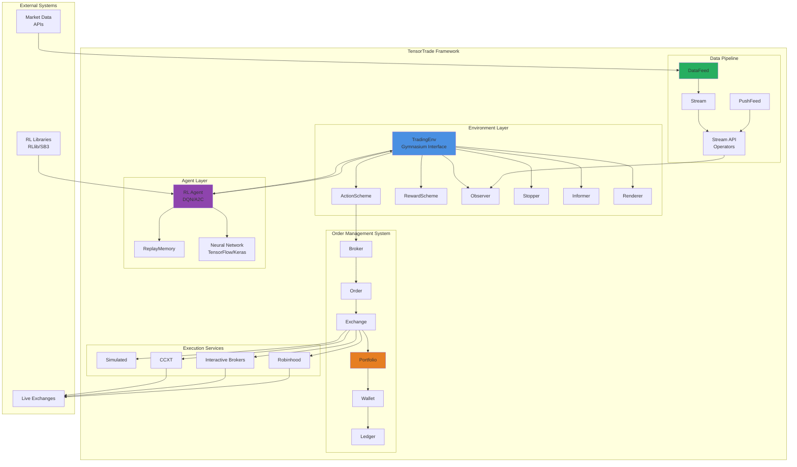
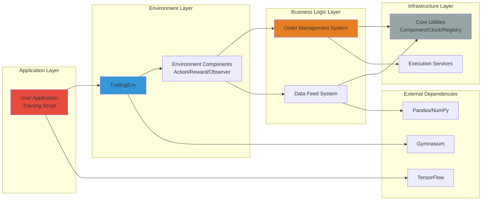
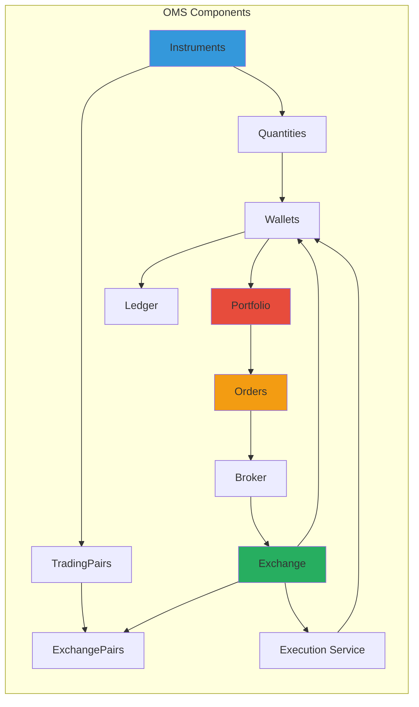
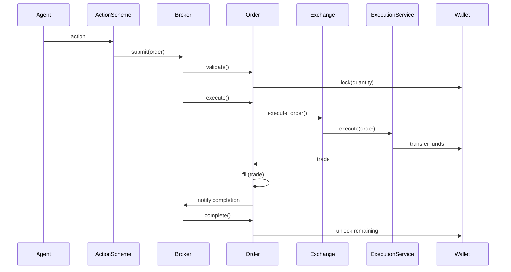
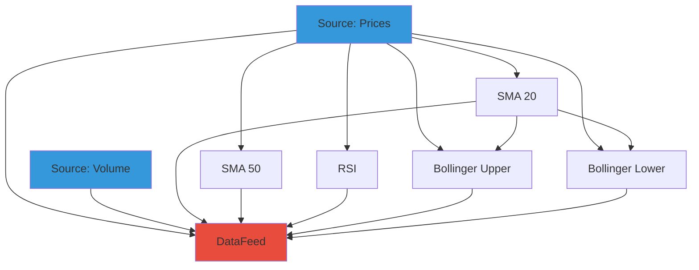
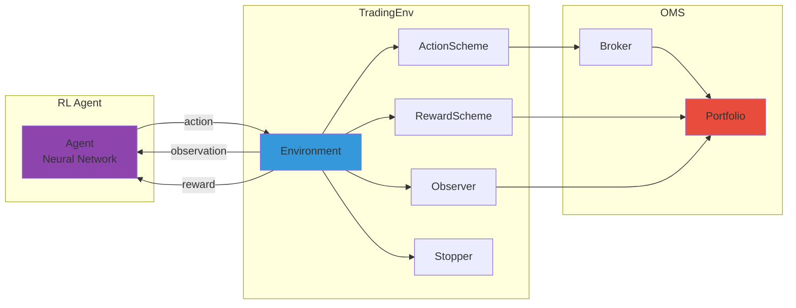
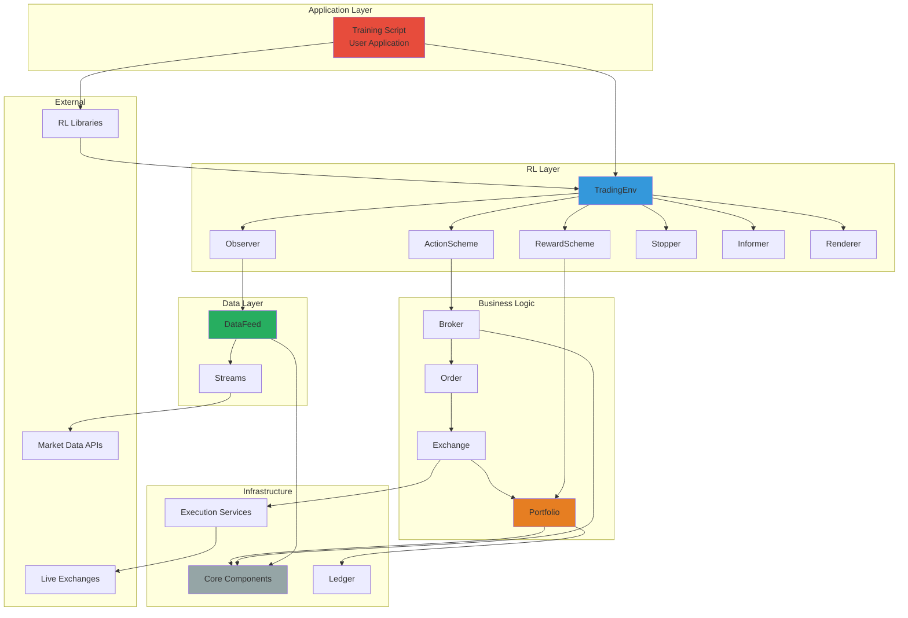

# TensorTrade: Comprehensive Technical Analysis Report

## Executive Summary

**TensorTrade** is an open-source Python framework designed for building, training, evaluating, and deploying robust trading algorithms using reinforcement learning (RL). The project emphasizes modularity, extensibility, and production-quality data pipelines while enabling fast experimentation with algorithmic trading strategies. Currently in Beta (v1.0.4-dev1), TensorTrade provides a comprehensive Order Management System (OMS), customizable environment components, and integration with popular ML libraries like TensorFlow, Keras, and OpenAI Gymnasium.

**Key Highlights:**
- **Highly modular architecture** with pluggable components (exchanges, actions, rewards, observers)
- **Reinforcement learning focus** using Gym-compatible environments
- **Production-oriented design** with support for both simulated and live trading
- **Comprehensive OMS** supporting market orders, limit orders, stop-loss, and take-profit strategies
- **Stream-based data pipeline** for efficient real-time and historical data processing
- **12,607 lines of Python code** across 28 directories

**Target Users:**
- Quantitative researchers and algorithmic traders
- Data scientists exploring RL applications in finance
- Academic researchers studying automated trading systems
- Fintech developers building trading infrastructure

---

## Table of Contents

1. [Project Overview](#project-overview)
2. [Technical Architecture](#technical-architecture)
3. [Project Structure](#project-structure)
4. [Installation & Setup](#installation--setup)
5. [Usage Guide](#usage-guide)
6. [Development Guidelines](#development-guidelines)
7. [Core Components Deep Dive](#core-components-deep-dive)
8. [Order Management System (OMS)](#order-management-system-oms)
9. [Data Feed Architecture](#data-feed-architecture)
10. [Reinforcement Learning Integration](#reinforcement-learning-integration)
11. [Performance Considerations](#performance-considerations)
12. [Security & Risk Management](#security--risk-management)
13. [Roadmap & Future Development](#roadmap--future-development)
14. [License & Legal](#license--legal)
15. [Conclusion](#conclusion)

---

## Project Overview

### Problem Definition

Developing trading algorithms with reinforcement learning involves significant engineering complexity:
1. **Data Pipeline Management**: Handling real-time and historical market data efficiently
2. **Order Execution Simulation**: Accurately modeling exchange behavior, slippage, and commissions
3. **Portfolio Management**: Tracking multi-asset positions across multiple exchanges
4. **RL Environment Design**: Creating Gym-compatible environments with proper state/action/reward definitions
5. **Strategy Testing**: Backtesting and evaluating trading strategies systematically
6. **Production Deployment**: Transitioning from simulation to live trading

### Solution Approach

TensorTrade addresses these challenges through a **component-based architecture** that separates concerns:

1. **Modular Environment System**: Pluggable components (ActionScheme, RewardScheme, Observer, Stopper, Informer, Renderer) allow customization without rewriting core logic
2. **Stream-Based Data Pipeline**: Functional reactive programming approach for efficient data transformations
3. **Comprehensive OMS**: Realistic order management with wallet tracking, ledger recording, and execution services
4. **Gym Integration**: Standard RL interface compatible with popular libraries (Stable-Baselines3, RLlib, etc.)
5. **Execution Services**: Support for both simulated trading (backtesting) and live trading (CCXT, Interactive Brokers, Robinhood)

### Core Features

#### 1. Order Management System (OMS)
- **Instruments & Quantities**: Type-safe financial instrument representation with precision handling
- **Wallets & Portfolio**: Multi-exchange, multi-asset portfolio management with locking mechanisms
- **Order Types**: Market, Limit, Stop-Loss, Take-Profit with criteria-based execution
- **Broker System**: Order queuing, validation, and execution coordination
- **Ledger**: Complete transaction history tracking for auditing and analysis

#### 2. Trading Environment Components
- **ActionScheme**: Defines how RL agent actions translate to trading orders
  - BSH (Buy/Sell/Hold)
  - ManagedRiskOrders
  - SimpleOrders
- **RewardScheme**: Calculates rewards for RL training
  - SimpleProfit
  - RiskAdjustedReturns (Sharpe/Sortino)
  - PBR (Position-Based Return)
- **Observer**: Generates observations for the RL agent from portfolio and market data
- **Stopper**: Determines episode termination conditions
- **Informer**: Provides additional info dictionary for debugging/logging
- **Renderer**: Visualizes trading performance (Plotly charts, matplotlib)

#### 3. Data Feed System
- **Stream API**: Functional programming interface for data transformations
- **DataFeed**: Compiles and orchestrates multiple data streams
- **PushFeed**: Real-time data handling for live trading
- **Built-in Operators**: Moving averages, technical indicators, normalization

#### 4. Stochastic Process Generation
- **Process Simulation**: Generate synthetic price data for testing
- **Multiple Models**: Geometric Brownian Motion, Ornstein-Uhlenbeck, Cox-Ingersoll-Ross
- **Utility Functions**: Scale, validate, and analyze generated data

#### 5. RL Agent Support
- **Built-in Agents**: DQN, A2C with replay memory
- **Parallel Training**: Distributed DQN implementation
- **External Library Support**: Compatible with RLlib, Stable-Baselines3

### Use Cases

1. **Research & Development**: Rapidly prototype and test new trading strategies
2. **Academic Studies**: Investigate RL algorithms in financial contexts
3. **Backtesting**: Evaluate strategies on historical data with realistic execution simulation
4. **Live Trading**: Deploy trained agents to real exchanges (use with extreme caution - Beta software)
5. **Education**: Learn reinforcement learning and algorithmic trading concepts

---

## Technical Architecture

### High-Level System Architecture



### Technology Stack

#### Core Dependencies
| Category | Technology | Version | Purpose |
|----------|-----------|---------|---------|
| **RL Framework** | OpenAI Gymnasium | ≥0.28.1 | Environment interface standard |
| **Deep Learning** | TensorFlow | ≥2.7.0 | Neural network training |
| **Data Processing** | NumPy | ≥1.17.0 | Numerical computations |
| **Data Management** | Pandas | ≥0.25.0 | Time series handling |
| **Stochastic Models** | stochastic | ≥0.6.0 | Price process generation |
| **Configuration** | PyYAML | ≥5.1.2 | Config file parsing |
| **Visualization** | Plotly | ≥4.5.0 | Interactive charts |
| **Visualization** | Matplotlib | ≥3.1.1 | Static plots |
| **Interactive** | IPython | ≥7.12.0 | Notebook support |
| **Deprecated APIs** | deprecated | ≥1.2.13 | API deprecation warnings |

#### Optional Dependencies
- **Testing**: pytest ≥5.1.1, ta ≥0.4.7
- **Documentation**: Sphinx, nbsphinx, recommonmark
- **Live Trading**: ccxt (for cryptocurrency exchanges), ibapi (Interactive Brokers), robin_stocks (Robinhood)

#### Python Version
- **Required**: Python ≥3.11.9
- **Reason**: Modern type hints, performance improvements, newer async features

### Design Patterns

#### 1. Component Pattern
All major system parts inherit from `Component` base class, enabling:
- Unified configuration via `default()` method
- Dependency injection
- Component registry for dynamic instantiation

```python
class Component:
    def default(self, key, value):
        # Retrieves config value or uses default
        pass
```

#### 2. Observable Pattern
Used in `Order` class to notify listeners (e.g., `OrderListener`) of state changes:
- `on_execute()`: Order submitted
- `on_fill()`: Order partially/fully filled
- `on_complete()`: Order completed
- `on_cancel()`: Order cancelled

#### 3. Stream Processing (Functional Reactive Programming)
Data transformations are composed as stream pipelines:
```python
price_stream = Stream.source(prices, dtype="float")
sma = price_stream.rolling(window=20).mean()
normalized = (price_stream - sma) / sma
```

#### 4. Strategy Pattern
Different implementations of core interfaces:
- `ActionScheme` implementations (BSH, SimpleOrders)
- `RewardScheme` implementations (SimpleProfit, RiskAdjustedReturns)
- `ExecutionService` implementations (Simulated, CCXT, IB)

#### 5. Builder Pattern
Complex object construction via method chaining:
```python
portfolio = Portfolio(base_instrument=USD, wallets=[...])
exchange = Exchange("binance", service=execute_order) \
    .call(price_stream_btc, price_stream_eth)
```

### Architectural Decisions

#### Decision 1: Gymnasium over Legacy Gym
**Rationale**: OpenAI Gym is deprecated; Gymnasium is the actively maintained fork with better API design (separate `terminated` and `truncated` signals).

#### Decision 2: Decimal Precision for Financial Calculations
**Problem**: Floating-point arithmetic causes rounding errors in financial calculations.
**Solution**: Use Python's `Decimal` type for all quantity and price representations.

#### Decision 3: Stream-Based Data Pipeline
**Rationale**:
- Declarative transformations are easier to reason about
- Lazy evaluation enables optimization
- Topological sorting ensures correct execution order
- Supports both batch (DataFeed) and streaming (PushFeed) modes

#### Decision 4: Separation of Environment and OMS
**Rationale**:
- OMS is reusable for non-RL applications (rule-based strategies)
- Clear separation of concerns (RL logic vs. trading logic)
- OMS can be tested independently

#### Decision 5: Pluggable Execution Services
**Rationale**:
- Different users need different execution backends (simulated, live, multiple exchanges)
- Exchange-specific logic is isolated in execution services
- Easy to add new exchange integrations

---

## Project Structure

### Directory Layout

```
tensortrade/
├── tensortrade/                    # Main package
│   ├── __init__.py                # Package exports
│   ├── version.py                 # Version string
│   │
│   ├── core/                      # Core utilities
│   │   ├── base.py               # Base classes (Component, TimeIndexed)
│   │   ├── registry.py           # Component registry
│   │   ├── clock.py              # Time management
│   │   └── exceptions.py         # Custom exceptions
│   │
│   ├── oms/                       # Order Management System
│   │   ├── instruments/          # Financial instruments
│   │   │   ├── instrument.py     # Base instrument class
│   │   │   ├── quantity.py       # Quantity with instrument
│   │   │   ├── trading_pair.py   # Base/Quote pair
│   │   │   └── exchange_pair.py  # Exchange + TradingPair
│   │   │
│   │   ├── wallets/              # Portfolio management
│   │   │   ├── wallet.py         # Single instrument wallet
│   │   │   ├── portfolio.py      # Multi-wallet portfolio
│   │   │   └── ledger.py         # Transaction log
│   │   │
│   │   ├── orders/               # Order system
│   │   │   ├── order.py          # Order class
│   │   │   ├── trade.py          # Trade execution record
│   │   │   ├── broker.py         # Order queue manager
│   │   │   ├── order_spec.py     # Order chaining (stop-loss, etc.)
│   │   │   ├── criteria.py       # Order execution criteria
│   │   │   └── create.py         # Order factory functions
│   │   │
│   │   ├── exchanges/            # Exchange abstraction
│   │   │   └── exchange.py       # Exchange base class
│   │   │
│   │   └── services/             # Execution services
│   │       ├── execution/
│   │       │   ├── simulated.py  # Backtesting execution
│   │       │   ├── ccxt.py       # Cryptocurrency exchanges
│   │       │   ├── interactive_brokers.py
│   │       │   └── robinhood.py
│   │       └── slippage/
│   │           ├── slippage_model.py
│   │           └── random_slippage_model.py
│   │
│   ├── env/                       # RL environments
│   │   ├── generic/              # Generic environment
│   │   │   ├── environment.py    # TradingEnv base class
│   │   │   └── components/       # Environment components
│   │   │       ├── action_scheme.py
│   │   │       ├── reward_scheme.py
│   │   │       ├── observer.py
│   │   │       ├── stopper.py
│   │   │       ├── informer.py
│   │   │       └── renderer.py
│   │   │
│   │   └── default/              # Default implementations
│   │       ├── actions.py        # BSH, SimpleOrders, etc.
│   │       ├── rewards.py        # SimpleProfit, RiskAdjusted
│   │       ├── observers.py      # TensorTradeObserver
│   │       ├── stoppers.py       # MaxLossStopper, etc.
│   │       ├── informers.py      # TensorTradeInformer
│   │       └── renderers.py      # PlotlyTradingChart, etc.
│   │
│   ├── feed/                      # Data pipeline
│   │   ├── core/                 # Core stream system
│   │   │   ├── base.py           # Stream base class
│   │   │   ├── feed.py           # DataFeed, PushFeed
│   │   │   ├── namespace.py      # Stream naming
│   │   │   └── mixins.py         # Stream operations
│   │   │
│   │   └── api/                  # Stream operators
│   │       ├── float/            # Floating-point ops
│   │       ├── generic/          # Generic ops
│   │       ├── boolean/          # Boolean logic
│   │       └── string/           # String ops
│   │
│   ├── agents/                    # RL agents
│   │   ├── agent.py              # Base agent
│   │   ├── replay_memory.py      # Experience replay
│   │   ├── dqn_agent.py          # Deep Q-Network
│   │   ├── a2c_agent.py          # Advantage Actor-Critic
│   │   └── parallel/             # Distributed training
│   │       └── parallel_dqn_agent.py
│   │
│   ├── stochastic/               # Price process generation
│   │   ├── processes/            # Stochastic processes
│   │   │   ├── gbm.py            # Geometric Brownian Motion
│   │   │   ├── ornstein_uhlenbeck.py
│   │   │   └── cir.py            # Cox-Ingersoll-Ross
│   │   └── utils/                # Utilities
│   │
│   ├── data/                      # Data utilities (Deprecated)
│   └── contrib/                   # Community contributions
│
├── examples/                      # Jupyter notebooks
│   ├── train_and_evaluate.ipynb
│   ├── use_lstm_rllib.ipynb
│   ├── use_attentionnet_rllib.ipynb
│   ├── setup_environment_tutorial.ipynb
│   ├── ledger_example.ipynb
│   ├── renderers_and_plotly_chart.ipynb
│   └── data/                     # Example datasets
│
├── tests/                         # Unit tests
├── docs/                          # Sphinx documentation
│   ├── source/
│   │   ├── oms/overview.md
│   │   ├── components/*.md
│   │   └── agents/overview.md
│   └── build/
│
├── setup.py                       # Package installation
├── requirements.txt               # Dependencies
├── Dockerfile                     # Docker setup
├── Makefile                       # Build automation
├── LICENSE                        # Apache 2.0
├── README.md                      # Project README
└── CONTRIBUTING.md               # Contribution guidelines
```

### File Organization Rationale

#### Core (`core/`)
Contains framework-agnostic utilities used across all modules:
- **Component pattern**: Base class for all configurable components
- **Clock**: Centralized time management for synchronization
- **Registry**: Dynamic component loading/registration
- **Exceptions**: Domain-specific error types

#### OMS (`oms/`)
Self-contained order management system that can be used independently of RL:
- **instruments/**: Type-safe representation of tradable assets
- **wallets/**: Portfolio state management with locking
- **orders/**: Order lifecycle and execution
- **exchanges/**: Exchange abstraction layer
- **services/**: Execution backends (simulated/live)

#### Environment (`env/`)
Reinforcement learning environment implementation:
- **generic/**: Base classes following Gymnasium interface
- **default/**: Pre-built components for common use cases

#### Feed (`feed/`)
Stream processing library for data pipelines:
- **core/**: Stream abstraction and execution engine
- **api/**: Type-specific operators (float, boolean, string)

#### Agents (`agents/`)
Built-in RL algorithms (optional - users can use external libraries):
- DQN and A2C implementations
- Replay memory utilities
- Parallel training support

### Project Hierarchy Diagram



---

## Installation & Setup

### Prerequisites

#### System Requirements
- **Operating System**: Linux, macOS, or Windows (WSL recommended)
- **Python**: 3.11.9 or higher
- **Memory**: 4GB RAM minimum (8GB+ recommended for training)
- **Storage**: 500MB for installation, additional space for datasets

#### Required Software
- Python 3.11.9+
- pip (Python package manager)
- Git (for cloning repository)

#### Optional Software
- Docker (for containerized deployment)
- Jupyter Notebook/Lab (for running examples)
- CUDA-capable GPU (for faster training with TensorFlow)

### Installation Methods

#### Method 1: Install from PyPI (Recommended for Users)

```bash
# Install latest stable release
pip install tensortrade

# Verify installation
python -c "import tensortrade; print(tensortrade.__version__)"
```

#### Method 2: Install from Source (Latest Development Version)

```bash
# Install directly from GitHub
pip install git+https://github.com/tensortrade-org/tensortrade.git

# Warning: This installs the latest commit from master branch
# which may contain untested code
```

#### Method 3: Local Development Installation

```bash
# Clone repository
git clone https://github.com/tensortrade-org/tensortrade.git
cd tensortrade

# Install base requirements
pip install -r requirements.txt

# Install example requirements (optional)
pip install -r examples/requirements.txt

# Install in editable mode for development
pip install -e .
```

#### Method 4: Docker Installation

```bash
# Clone repository
git clone https://github.com/tensortrade-org/tensortrade.git
cd tensortrade

# Run Jupyter notebook in Docker
make run-notebook
# Access at http://127.0.0.1:8888/?token=...

# Run tests in Docker
make run-tests

# Build documentation in Docker
make run-docs
```

### Configuration

#### Environment Variables

Create a `.env` file for configuration:

```bash
# Logging
LOG_LEVEL=INFO

# TensorFlow
TF_CPP_MIN_LOG_LEVEL=2  # Suppress TF warnings

# Live trading API keys (if using live execution)
BINANCE_API_KEY=your_api_key
BINANCE_API_SECRET=your_api_secret

COINBASE_API_KEY=your_api_key
COINBASE_API_SECRET=your_api_secret
```

#### GPU Setup (Optional)

For TensorFlow GPU support:

```bash
# Install CUDA-enabled TensorFlow
pip install tensorflow-gpu

# Verify GPU availability
python -c "import tensorflow as tf; print(tf.config.list_physical_devices('GPU'))"
```

### Verification

Run this script to verify installation:

```python
import tensortrade as tt
from tensortrade.env.default import create
from tensortrade.feed.core import DataFeed, Stream
from tensortrade.oms.exchanges import Exchange
from tensortrade.oms.services.execution.simulated import execute_order
from tensortrade.oms.instruments import USD, BTC

# Create exchange
exchange = Exchange("binance", service=execute_order)(
    Stream.source([7000, 7500, 8000], dtype="float").rename("BTC/USD")
)

# Create environment
env = create(
    portfolio=tt.Portfolio(USD, [
        tt.Wallet(exchange, 10000 * USD),
        tt.Wallet(exchange, 0 * BTC)
    ]),
    action_scheme="managed-risk",
    reward_scheme="risk-adjusted",
    window_size=1
)

print("TensorTrade installation verified successfully!")
print(f"Version: {tt.__version__}")
```

### Common Issues and Troubleshooting

#### Issue 1: Python Version Mismatch
**Error**: `TensorTrade is only compatible with Python 3.`
**Solution**: Upgrade to Python 3.11.9+
```bash
python --version
# If below 3.11.9, install newer Python
```

#### Issue 2: TensorFlow Installation Fails
**Error**: `Could not install packages due to an EnvironmentError`
**Solution**: Install with `--user` flag
```bash
pip install --user tensorflow
```

#### Issue 3: Module Import Errors
**Error**: `ModuleNotFoundError: No module named 'tensortrade'`
**Solution**: Ensure correct Python environment is activated
```bash
which python
pip list | grep tensortrade
```

#### Issue 4: Decimal Precision Warnings
**Warning**: `Price quantized...would amount to 0`
**Solution**: Increase instrument precision or adjust price scale
```python
from tensortrade.oms.instruments import Instrument

# Custom instrument with higher precision
HIGH_PRECISION_BTC = Instrument("BTC", 10, "Bitcoin")
```

#### Issue 5: Docker Permission Denied
**Error**: `docker: Got permission denied while trying to connect`
**Solution**: Add user to docker group
```bash
sudo usermod -aG docker $USER
newgrp docker
```

---

## Usage Guide

### Basic Example: Simple Trading Environment

This example demonstrates a complete workflow from data preparation to environment creation:

```python
import numpy as np
import pandas as pd
import tensortrade as tt

from tensortrade.env.default import create
from tensortrade.feed.core import DataFeed, Stream
from tensortrade.oms.exchanges import Exchange
from tensortrade.oms.services.execution.simulated import execute_order
from tensortrade.oms.instruments import USD, BTC, ETH
from tensortrade.oms.wallets import Wallet, Portfolio

# 1. Prepare price data
prices = pd.DataFrame({
    'open': np.random.uniform(7000, 8000, 100),
    'high': np.random.uniform(8000, 9000, 100),
    'low': np.random.uniform(6000, 7000, 100),
    'close': np.random.uniform(7000, 8000, 100),
    'volume': np.random.uniform(1000, 10000, 100)
})

# 2. Create price streams
price_stream = Stream.source(
    prices['close'].tolist(),
    dtype="float"
).rename("BTC/USD")

# 3. Create exchange with price stream
exchange = Exchange("binance", service=execute_order)(
    price_stream
)

# 4. Create portfolio with initial capital
portfolio = Portfolio(USD, [
    Wallet(exchange, 10000 * USD),  # $10,000 initial capital
    Wallet(exchange, 0 * BTC)       # 0 BTC initially
])

# 5. Create trading environment
env = create(
    portfolio=portfolio,
    action_scheme="managed-risk",  # Use risk-managed orders
    reward_scheme="risk-adjusted",  # Sharpe ratio rewards
    window_size=20                  # 20-step observation window
)

# 6. Run environment
obs, info = env.reset()
done = False
total_reward = 0

while not done:
    action = env.action_space.sample()  # Random action
    obs, reward, terminated, truncated, info = env.step(action)
    done = terminated or truncated
    total_reward += reward

print(f"Episode finished with total reward: {total_reward}")
print(f"Final net worth: {info['net_worth']}")
```

### Advanced Example: Custom Action Scheme

```python
from typing import List
from gymnasium.spaces import Discrete
from tensortrade.env.default import TensorTradeActionScheme
from tensortrade.oms.orders import Order, proportion_order

class CustomActionScheme(TensorTradeActionScheme):
    """
    Custom action scheme:
    0 = Hold
    1 = Buy 25%
    2 = Buy 50%
    3 = Buy 100%
    4 = Sell 25%
    5 = Sell 50%
    6 = Sell 100%
    """

    def __init__(self):
        super().__init__()
        self.action_space = Discrete(7)

    def get_orders(self, action: int, portfolio: Portfolio) -> List[Order]:
        action_map = {
            0: None,      # Hold
            1: 0.25,      # Buy 25%
            2: 0.50,      # Buy 50%
            3: 1.00,      # Buy 100%
            4: -0.25,     # Sell 25%
            5: -0.50,     # Sell 50%
            6: -1.00      # Sell 100%
        }

        proportion = action_map[action]
        if proportion is None or proportion == 0:
            return []

        side = TradeSide.BUY if proportion > 0 else TradeSide.SELL
        trade_pair = portfolio.exchange_pairs[0]

        order = proportion_order(
            portfolio=portfolio,
            side=side,
            exchange_pair=trade_pair,
            proportion=abs(proportion)
        )

        return [order] if order else []

# Use custom action scheme
env = TradingEnv(
    action_scheme=CustomActionScheme(),
    reward_scheme=SimpleProfit(),
    observer=observer,
    stopper=stopper,
    informer=informer,
    renderer=renderer
)
```

### Custom Reward Scheme Example

```python
from tensortrade.env.default import TensorTradeRewardScheme

class DrawdownPenaltyReward(TensorTradeRewardScheme):
    """
    Rewards profit but penalizes drawdown from peak net worth.
    """

    def __init__(self, drawdown_penalty=2.0):
        self.drawdown_penalty = drawdown_penalty
        self.peak_net_worth = 0

    def get_reward(self, portfolio: Portfolio) -> float:
        net_worth = portfolio.net_worth

        # Update peak
        self.peak_net_worth = max(self.peak_net_worth, net_worth)

        # Calculate drawdown
        drawdown = (self.peak_net_worth - net_worth) / self.peak_net_worth

        # Calculate profit
        profit = (net_worth - portfolio.initial_net_worth) / portfolio.initial_net_worth

        # Reward profit, penalize drawdown
        reward = profit - self.drawdown_penalty * drawdown

        return reward

    def reset(self):
        self.peak_net_worth = 0
```

### Data Feed with Technical Indicators

```python
from tensortrade.feed.core import Stream, DataFeed

# Load historical data
df = pd.read_csv("btc_usd_historical.csv")

# Create streams for OHLCV data
open_price = Stream.source(df['open'].tolist(), dtype="float").rename("open")
high_price = Stream.source(df['high'].tolist(), dtype="float").rename("high")
low_price = Stream.source(df['low'].tolist(), dtype="float").rename("low")
close_price = Stream.source(df['close'].tolist(), dtype="float").rename("close")
volume = Stream.source(df['volume'].tolist(), dtype="float").rename("volume")

# Calculate technical indicators
sma_20 = close_price.rolling(window=20).mean().rename("sma_20")
sma_50 = close_price.rolling(window=50).mean().rename("sma_50")

# RSI calculation (simplified)
delta = close_price.diff()
gain = delta.clamp_min(0).rolling(window=14).mean()
loss = (-delta).clamp_min(0).rolling(window=14).mean()
rs = gain / loss
rsi = (100 - (100 / (1 + rs))).rename("rsi")

# Bollinger Bands
std = close_price.rolling(window=20).std()
bb_upper = (sma_20 + 2 * std).rename("bb_upper")
bb_lower = (sma_20 - 2 * std).rename("bb_lower")

# Create data feed
feed = DataFeed([
    close_price,
    sma_20,
    sma_50,
    rsi,
    bb_upper,
    bb_lower,
    volume
])

# Use in observer
from tensortrade.env.generic.components import Observer

observer = Observer(
    feed=feed,
    window_size=20,
    min_periods=50
)
```

### Training with Stable-Baselines3

```python
from stable_baselines3 import PPO
from stable_baselines3.common.vec_env import DummyVecEnv

# Create environment
env = create(
    portfolio=portfolio,
    action_scheme="managed-risk",
    reward_scheme="risk-adjusted"
)

# Wrap for vectorized training
env = DummyVecEnv([lambda: env])

# Create PPO agent
model = PPO(
    "MlpPolicy",
    env,
    verbose=1,
    learning_rate=0.0003,
    n_steps=2048,
    batch_size=64,
    n_epochs=10,
    gamma=0.99,
    tensorboard_log="./tensorboard/"
)

# Train
model.learn(total_timesteps=100000)

# Save model
model.save("ppo_trading_agent")

# Evaluate
obs = env.reset()
for i in range(1000):
    action, _states = model.predict(obs, deterministic=True)
    obs, reward, done, info = env.step(action)
    if done:
        print(f"Episode {i} finished")
        print(f"Net worth: {info[0]['net_worth']}")
        obs = env.reset()
```

### Live Trading Setup (Use with Extreme Caution)

```python
from tensortrade.oms.services.execution.ccxt import CCXTExecution
import ccxt

# WARNING: This example is for educational purposes only
# Live trading with real money is extremely risky
# TensorTrade is Beta software - use at your own risk

# Create live exchange connection
ccxt_exchange = ccxt.binance({
    'apiKey': 'YOUR_API_KEY',
    'secret': 'YOUR_API_SECRET',
    'enableRateLimit': True
})

# Create TensorTrade exchange with live execution
exchange = Exchange(
    "binance",
    service=CCXTExecution(ccxt_exchange),
    options=ExchangeOptions(
        commission=0.001,  # 0.1% commission
        is_live=True
    )
)

# Use PushFeed for real-time data
from tensortrade.feed.core import PushFeed, Placeholder

price_placeholder = Placeholder(dtype="float", name="BTC/USD")
feed = PushFeed([price_placeholder])

# In your trading loop:
while True:
    # Fetch latest price from exchange
    ticker = ccxt_exchange.fetch_ticker('BTC/USDT')
    current_price = ticker['last']

    # Push to feed
    data = feed.push({'BTC/USD': current_price})

    # Get action from trained agent
    action = model.predict(observation)

    # Execute in environment (which places real orders)
    observation, reward, done, info = env.step(action)

    # Wait before next iteration
    time.sleep(60)  # 1-minute intervals
```

### Command-Line Interface (Future Feature)

Currently, TensorTrade does not have a CLI, but a typical usage pattern would be:

```bash
# Future CLI (not yet implemented)
tensortrade train --config config.yaml --output models/
tensortrade backtest --model models/best_model.zip --data data/historical.csv
tensortrade live --model models/best_model.zip --exchange binance
```

---

## Development Guidelines

### Development Environment Setup

#### Prerequisites
- Python 3.11.9+
- Git
- Virtual environment tool (venv, conda, or virtualenv)

#### Setup Steps

```bash
# 1. Clone repository
git clone https://github.com/tensortrade-org/tensortrade.git
cd tensortrade

# 2. Create virtual environment
python -m venv venv
source venv/bin/activate  # On Windows: venv\Scripts\activate

# 3. Install development dependencies
pip install -r requirements.txt
pip install -r examples/requirements.txt

# 4. Install in editable mode
pip install -e .

# 5. Install testing dependencies
pip install pytest pytest-cov

# 6. Verify setup
pytest tests/
```

### Code Style and Conventions

#### Python Style Guide
TensorTrade follows **PEP 8** with some modifications:

- **Line length**: 100 characters (not 79)
- **Imports**: Grouped and sorted
  1. Standard library
  2. Third-party libraries
  3. Local imports
- **Docstrings**: NumPy style

#### Example Code Style

```python
# Copyright 2020 The TensorTrade Authors.
#
# Licensed under the Apache License, Version 2.0 (the "License");
# ...

"""Module docstring explaining purpose."""

from typing import List, Optional, Union
from decimal import Decimal

import numpy as np
import pandas as pd

from tensortrade.core import Component
from tensortrade.oms.instruments import Instrument


class MyComponent(Component):
    """A component that does something.

    Parameters
    ----------
    param1 : str
        Description of param1.
    param2 : int, optional
        Description of param2. Default is 10.

    Attributes
    ----------
    attribute1 : float
        Description of attribute1.
    """

    def __init__(self, param1: str, param2: int = 10) -> None:
        super().__init__()
        self.param1 = self.default('param1', param1)
        self.param2 = self.default('param2', param2)
        self.attribute1 = 0.0

    def method1(self, arg1: str) -> List[int]:
        """Do something with arg1.

        Parameters
        ----------
        arg1 : str
            The argument to process.

        Returns
        -------
        List[int]
            The processed results.

        Raises
        ------
        ValueError
            If arg1 is invalid.
        """
        if not arg1:
            raise ValueError("arg1 cannot be empty")

        # Implementation
        return [1, 2, 3]
```

#### Type Hints
Use type hints for all function signatures:

```python
from typing import List, Dict, Optional, Union, Tuple

def process_data(
    data: pd.DataFrame,
    columns: Optional[List[str]] = None
) -> Dict[str, np.ndarray]:
    """Process data and return results."""
    pass
```

### Testing Procedures

#### Running Tests

```bash
# Run all tests
pytest

# Run with coverage
pytest --cov=tensortrade --cov-report=html

# Run specific test file
pytest tests/test_portfolio.py

# Run specific test
pytest tests/test_portfolio.py::test_portfolio_creation

# Run with verbose output
pytest -v

# Run with print statements visible
pytest -s
```

#### Writing Tests

Use pytest for all tests:

```python
# tests/test_portfolio.py
import pytest
from tensortrade.oms.wallets import Portfolio, Wallet
from tensortrade.oms.instruments import USD, BTC
from tensortrade.oms.exchanges import Exchange
from tensortrade.oms.services.execution.simulated import execute_order


@pytest.fixture
def exchange():
    """Create a test exchange."""
    return Exchange("test", service=execute_order)


@pytest.fixture
def portfolio(exchange):
    """Create a test portfolio."""
    return Portfolio(USD, [
        Wallet(exchange, 10000 * USD),
        Wallet(exchange, 0 * BTC)
    ])


def test_portfolio_creation(portfolio):
    """Test that portfolio is created correctly."""
    assert portfolio.base_instrument == USD
    assert len(portfolio.wallets) == 2
    assert portfolio.base_balance.size == 10000


def test_portfolio_balance(portfolio):
    """Test portfolio balance calculation."""
    usd_balance = portfolio.balance(USD)
    btc_balance = portfolio.balance(BTC)

    assert usd_balance.size == 10000
    assert btc_balance.size == 0


def test_portfolio_reset(portfolio):
    """Test portfolio reset functionality."""
    # Modify portfolio state
    # ...

    # Reset
    portfolio.reset()

    # Verify reset
    assert portfolio.base_balance.size == 10000
```

#### Test Coverage Standards
- **Minimum coverage**: 70%
- **Target coverage**: 85%+
- **Critical paths**: 95%+ (OMS, Order execution, Portfolio management)

### Contributing Guidelines

#### Before Contributing

1. **Check existing issues**: Search for related issues/PRs
2. **Discuss major changes**: Open an issue for discussion before large PRs
3. **Read CONTRIBUTING.md**: Follow official contribution guidelines

#### Pull Request Process

1. **Fork the repository**
   ```bash
   git clone https://github.com/YOUR_USERNAME/tensortrade.git
   cd tensortrade
   git remote add upstream https://github.com/tensortrade-org/tensortrade.git
   ```

2. **Create a feature branch**
   ```bash
   git checkout -b feature/my-new-feature
   ```

3. **Make changes**
   - Write code following style guidelines
   - Add tests for new functionality
   - Update documentation

4. **Run tests locally**
   ```bash
   pytest
   ```

5. **Commit changes**
   ```bash
   git add .
   git commit -m "feat: add new feature X"
   ```

   **Commit message format** (Conventional Commits):
   - `feat:` New feature
   - `fix:` Bug fix
   - `docs:` Documentation only
   - `style:` Code style changes (formatting)
   - `refactor:` Code refactoring
   - `test:` Adding tests
   - `chore:` Maintenance tasks

6. **Push to your fork**
   ```bash
   git push origin feature/my-new-feature
   ```

7. **Create Pull Request**
   - Go to GitHub and create PR
   - Fill out PR template
   - Link related issues
   - Request review

#### PR Checklist

- [ ] Code follows project style guidelines
- [ ] Tests added/updated and passing
- [ ] Documentation updated (if needed)
- [ ] Commit messages follow Conventional Commits
- [ ] No merge conflicts
- [ ] Changelog updated (for significant changes)

#### Code Review Process

- Maintainers will review within 1-2 weeks
- Address feedback by pushing additional commits
- Once approved, maintainer will merge

#### Community Guidelines

- Be respectful and constructive
- Help others in issues and discussions
- Use Discord/Gitter for questions
- Report bugs with minimal reproducible examples

---

## Core Components Deep Dive

### Component System

The `Component` class is the foundation of TensorTrade's architecture, providing configuration management and extensibility.

#### Component Base Class

```python
class Component:
    """A component that can be configured and registered."""

    registered_name = None  # Override in subclasses

    def __init__(self):
        self._config = {}

    def default(self, key: str, value: Any) -> Any:
        """Get configured value or use default.

        Parameters
        ----------
        key : str
            Configuration key.
        value : Any
            Default value if not configured.

        Returns
        -------
        Any
            Configured value or default.
        """
        if hasattr(self, '_config') and key in self._config:
            return self._config[key]
        return value
```

#### Usage Pattern

```python
class MyRewardScheme(RewardScheme):
    def __init__(self, window_size: int = 10, risk_penalty: float = 0.1):
        super().__init__()
        # These can be overridden via config
        self.window_size = self.default('window_size', window_size)
        self.risk_penalty = self.default('risk_penalty', risk_penalty)

# Usage
reward_scheme = MyRewardScheme(window_size=20)
# Or configure globally
tensortrade.configure(window_size=20)
```

### Clock and Time Management

The `Clock` class provides centralized time management for synchronization across components.

```python
class Clock:
    """A clock for synchronizing time across components."""

    def __init__(self):
        self.step = 0

    def increment(self):
        """Increment time by one step."""
        self.step += 1

    def reset(self):
        """Reset clock to zero."""
        self.step = 0
```

All time-dependent components (exchanges, orders, portfolios) share the same clock:

```python
env = TradingEnv(...)
env.clock.step  # Current timestep

# All components synchronized
assert env.action_scheme.clock.step == env.clock.step
assert env.portfolio.clock.step == env.clock.step
```

### Observable Pattern Implementation

The `Observable` class enables event-driven programming:

```python
class Observable:
    """An observable object that can notify listeners."""

    def __init__(self):
        self.listeners = []

    def attach(self, listener):
        """Attach a listener."""
        self.listeners.append(listener)

    def detach(self, listener):
        """Detach a listener."""
        self.listeners.remove(listener)


class OrderListener:
    """Listener for order events."""

    def on_execute(self, order):
        """Called when order is executed."""
        print(f"Order {order.id} executed")

    def on_fill(self, order, trade):
        """Called when order is filled."""
        print(f"Order {order.id} filled: {trade}")

    def on_complete(self, order):
        """Called when order is completed."""
        print(f"Order {order.id} completed")

    def on_cancel(self, order):
        """Called when order is cancelled."""
        print(f"Order {order.id} cancelled")
```

---

## Order Management System (OMS)

### Architecture Overview



### Instruments and Quantities

#### Instrument Definition

```python
class Instrument:
    """A tradable financial instrument.

    Parameters
    ----------
    symbol : str
        The symbol of the instrument (e.g., 'BTC', 'USD').
    precision : int
        The decimal precision for quantity representation.
    name : str
        The full name of the instrument.
    """

    def __init__(self, symbol: str, precision: int = 8, name: str = None):
        self.symbol = symbol
        self.precision = precision
        self.name = name or symbol

# Pre-defined common instruments
USD = Instrument("USD", 2, "U.S. Dollar")
EUR = Instrument("EUR", 2, "Euro")
BTC = Instrument("BTC", 8, "Bitcoin")
ETH = Instrument("ETH", 8, "Ethereum")
```

#### Quantity Operations

```python
class Quantity:
    """An amount of an instrument.

    Parameters
    ----------
    instrument : Instrument
        The instrument this quantity is denominated in.
    size : Decimal or float
        The size of the quantity.
    """

    def __init__(self, instrument: Instrument, size: Union[Decimal, float]):
        self.instrument = instrument
        self.size = Decimal(size).quantize(Decimal(10) ** -instrument.precision)

    def __add__(self, other):
        if self.instrument != other.instrument:
            raise ValueError("Cannot add quantities of different instruments")
        return Quantity(self.instrument, self.size + other.size)

    def __sub__(self, other):
        if self.instrument != other.instrument:
            raise ValueError("Cannot subtract quantities of different instruments")
        return Quantity(self.instrument, self.size - other.size)

    def __mul__(self, scalar):
        return Quantity(self.instrument, self.size * Decimal(scalar))

    def __truediv__(self, scalar):
        return Quantity(self.instrument, self.size / Decimal(scalar))

# Convenient operator overloading
quantity = 10 * BTC  # Creates Quantity(BTC, 10)
total = quantity + 5 * BTC  # Quantity(BTC, 15)
```

#### Trading Pairs

```python
class TradingPair:
    """A pair of instruments for trading.

    Parameters
    ----------
    base : Instrument
        The base instrument (e.g., BTC in BTC/USD).
    quote : Instrument
        The quote instrument (e.g., USD in BTC/USD).
    """

    def __init__(self, base: Instrument, quote: Instrument):
        self.base = base
        self.quote = quote

    def __truediv__(self, other: Instrument):
        """Convenient syntax: BTC / USD creates TradingPair."""
        return TradingPair(self, other)

    def __str__(self):
        return f"{self.base.symbol}/{self.quote.symbol}"

# Usage
pair = BTC / USD  # Creates TradingPair(BTC, USD)
```

### Wallets and Portfolio

#### Wallet Implementation

```python
class Wallet:
    """A wallet holding a quantity of an instrument on an exchange.

    Parameters
    ----------
    exchange : Exchange
        The exchange this wallet belongs to.
    balance : Quantity
        Initial balance in the wallet.
    """

    ledger = Ledger()  # Shared ledger across all wallets

    def __init__(self, exchange: Exchange, balance: Quantity):
        self.exchange = exchange
        self.instrument = balance.instrument
        self._balance = balance
        self.locked = {}  # path_id -> Quantity (locked in orders)

    @property
    def balance(self) -> Quantity:
        """Available (unlocked) balance."""
        return self._balance

    @property
    def locked_balance(self) -> Quantity:
        """Total locked balance."""
        return sum(self.locked.values(), Quantity(self.instrument, 0))

    @property
    def total_balance(self) -> Quantity:
        """Total balance (available + locked)."""
        return self.balance + self.locked_balance

    def lock(self, quantity: Quantity, order: Order, reason: str) -> Quantity:
        """Lock quantity for an order."""
        if quantity.size > self.balance.size:
            raise InsufficientFunds(f"Cannot lock {quantity}, only {self.balance} available")

        self._balance -= quantity
        self.locked[order.path_id] = quantity

        self.ledger.record(
            action="lock",
            wallet=self,
            quantity=quantity,
            reason=reason
        )

        return quantity

    def unlock(self, quantity: Quantity, reason: str):
        """Unlock quantity."""
        self._balance += quantity

        self.ledger.record(
            action="unlock",
            wallet=self,
            quantity=quantity,
            reason=reason
        )

    def transfer(self, quantity: Quantity, target: 'Wallet', reason: str):
        """Transfer quantity to another wallet."""
        if quantity.size > self.balance.size:
            raise InsufficientFunds(f"Cannot transfer {quantity}, only {self.balance} available")

        self._balance -= quantity
        target._balance += quantity

        self.ledger.record(
            action="transfer",
            source=self,
            target=target,
            quantity=quantity,
            reason=reason
        )
```

#### Portfolio Management

```python
class Portfolio:
    """A portfolio managing multiple wallets."""

    def __init__(self, base_instrument: Instrument, wallets: List[Wallet]):
        self.base_instrument = base_instrument
        self._wallets = {}

        for wallet in wallets:
            self._wallets[(wallet.exchange.id, wallet.instrument.symbol)] = wallet

        self._initial_balance = self.base_balance
        self._net_worth = None
        self._performance = None

    @property
    def net_worth(self) -> float:
        """Total portfolio value in base instrument."""
        total = Quantity(self.base_instrument, 0)

        for wallet in self.wallets:
            if wallet.instrument == self.base_instrument:
                total += wallet.total_balance
            else:
                # Convert to base instrument using exchange price
                pair = wallet.instrument / self.base_instrument
                exchange_pair = ExchangePair(wallet.exchange, pair)
                price = wallet.exchange.quote_price(pair)
                value = wallet.total_balance.size * price
                total += Quantity(self.base_instrument, value)

        return float(total.size)
```

### Order System

#### Order Lifecycle



#### Order Implementation

```python
class Order:
    """An order to trade an instrument.

    Parameters
    ----------
    step : int
        The timestep when order was created.
    side : TradeSide
        BUY or SELL.
    trade_type : TradeType
        MARKET or LIMIT.
    exchange_pair : ExchangePair
        The exchange and pair to trade.
    quantity : Quantity
        The quantity to trade.
    portfolio : Portfolio
        The portfolio placing the order.
    price : float
        The limit price (for limit orders).
    criteria : Callable, optional
        Execution criteria function.
    path_id : str, optional
        Order chain identifier.
    """

    def __init__(self, step, side, trade_type, exchange_pair, quantity,
                 portfolio, price, criteria=None, path_id=None, start=None, end=None):
        self.step = step
        self.side = side  # TradeSide.BUY or TradeSide.SELL
        self.type = trade_type  # TradeType.MARKET or TradeType.LIMIT
        self.exchange_pair = exchange_pair
        self.price = price
        self.quantity = quantity
        self.portfolio = portfolio
        self.criteria = criteria
        self.path_id = path_id or str(uuid.uuid4())
        self.start = start or step
        self.end = end
        self.status = OrderStatus.PENDING
        self.trades = []
        self.remaining = quantity

        # Lock funds in wallet
        wallet = portfolio.get_wallet(
            exchange_pair.exchange.id,
            side.instrument(exchange_pair.pair)
        )
        self.quantity = wallet.lock(quantity, self, "LOCK FOR ORDER")

    @property
    def is_executable(self) -> bool:
        """Check if order can be executed."""
        is_satisfied = self.criteria is None or self.criteria(self, self.exchange_pair.exchange)
        clock = self.exchange_pair.exchange.clock
        return is_satisfied and clock.step >= self.start

    def execute(self):
        """Execute the order."""
        self.status = OrderStatus.OPEN

        for listener in self.listeners:
            listener.on_execute(self)

        self.exchange_pair.exchange.execute_order(self, self.portfolio)

    def fill(self, trade: Trade):
        """Fill the order with a trade."""
        self.status = OrderStatus.PARTIALLY_FILLED
        filled = trade.quantity + trade.commission
        self.remaining -= filled
        self.trades.append(trade)

        for listener in self.listeners:
            listener.on_fill(self, trade)

    def complete(self):
        """Complete the order."""
        self.status = OrderStatus.FILLED

        for listener in self.listeners:
            listener.on_complete(self)

        self.release("COMPLETED")

    def cancel(self, reason="CANCELLED"):
        """Cancel the order."""
        self.status = OrderStatus.CANCELLED

        for listener in self.listeners:
            listener.on_cancel(self)

        self.release(reason)

    def release(self, reason="RELEASE"):
        """Release all locked funds."""
        for wallet in self.portfolio.wallets:
            if self.path_id in wallet.locked:
                quantity = wallet.locked[self.path_id]
                wallet.unlock(quantity, reason)
                del wallet.locked[self.path_id]
```

#### Broker System

```python
class Broker:
    """Manages order queue and execution."""

    def __init__(self):
        self._unexecuted = []  # Pending orders
        self._executed = []    # Completed orders
        self.clock = None

    def submit(self, order: Order):
        """Submit an order for execution."""
        self._unexecuted.append(order)

    def update(self):
        """Process all pending orders."""
        executed_orders = []

        for order in self._unexecuted:
            if order.is_expired:
                order.cancel("EXPIRED")
                executed_orders.append(order)
            elif order.is_executable:
                order.execute()
                executed_orders.append(order)

            if order.is_complete:
                next_order = order.complete()
                if next_order and next_order != order:
                    self.submit(next_order)

        # Remove executed orders from queue
        self._unexecuted = [o for o in self._unexecuted if o not in executed_orders]
        self._executed.extend(executed_orders)
```

### Execution Services

#### Simulated Execution

```python
def execute_order(order: Order,
                  base_wallet: Wallet,
                  quote_wallet: Wallet,
                  current_price: Decimal,
                  options: ExchangeOptions,
                  clock: Clock) -> Trade:
    """Simulated order execution for backtesting.

    Parameters
    ----------
    order : Order
        The order to execute.
    base_wallet : Wallet
        Wallet holding the base instrument.
    quote_wallet : Wallet
        Wallet holding the quote instrument.
    current_price : Decimal
        Current market price.
    options : ExchangeOptions
        Exchange configuration (commission, limits, etc.).
    clock : Clock
        Current time reference.

    Returns
    -------
    Trade
        The executed trade.
    """
    if order.is_buy:
        # Buy base with quote
        price = current_price
        size = order.remaining.size
        commission_size = size * options.commission
        cost = size * price + commission_size * price

        if cost > quote_wallet.balance.size:
            # Adjust size to affordable amount
            size = quote_wallet.balance.size / (price * (1 + options.commission))

        quantity = Quantity(order.pair.base, size)
        commission = Quantity(order.pair.base, commission_size)
        cost_quantity = Quantity(order.pair.quote, cost)

        # Transfer funds
        quote_wallet.transfer(cost_quantity, quote_wallet, f"BUY {quantity}")
        base_wallet._balance += quantity

    else:  # SELL
        price = current_price
        size = order.remaining.size
        commission_size = size * options.commission
        revenue = size * price - commission_size * price

        quantity = Quantity(order.pair.base, size)
        commission = Quantity(order.pair.base, commission_size)
        revenue_quantity = Quantity(order.pair.quote, revenue)

        # Transfer funds
        base_wallet.transfer(quantity, base_wallet, f"SELL {quantity}")
        quote_wallet._balance += revenue_quantity

    return Trade(
        order_id=order.id,
        step=clock.step,
        exchange_pair=order.exchange_pair,
        side=order.side,
        trade_type=order.type,
        quantity=quantity,
        price=float(price),
        commission=commission
    )
```

#### CCXT Live Execution (Simplified)

```python
class CCXTExecution:
    """Live order execution via CCXT library."""

    def __init__(self, ccxt_exchange):
        self.exchange = ccxt_exchange

    def __call__(self, order, base_wallet, quote_wallet, current_price, options, clock):
        """Execute order on live exchange."""
        # Create CCXT order
        symbol = f"{order.pair.base.symbol}/{order.pair.quote.symbol}"
        side = "buy" if order.is_buy else "sell"
        order_type = "market" if order.is_market_order else "limit"
        amount = float(order.remaining.size)
        price = float(order.price) if order.is_limit_order else None

        try:
            # Submit to exchange
            ccxt_order = self.exchange.create_order(
                symbol=symbol,
                type=order_type,
                side=side,
                amount=amount,
                price=price
            )

            # Wait for fill
            while ccxt_order['status'] != 'closed':
                time.sleep(1)
                ccxt_order = self.exchange.fetch_order(ccxt_order['id'], symbol)

            # Create trade from result
            filled_amount = ccxt_order['filled']
            avg_price = ccxt_order['average']
            fee = ccxt_order['fee']['cost']

            quantity = Quantity(order.pair.base, filled_amount)
            commission = Quantity(order.pair.quote, fee)

            return Trade(
                order_id=order.id,
                step=clock.step,
                exchange_pair=order.exchange_pair,
                side=order.side,
                trade_type=order.type,
                quantity=quantity,
                price=avg_price,
                commission=commission
            )

        except Exception as e:
            logging.error(f"Order execution failed: {e}")
            return None
```

---

## Data Feed Architecture

### Stream Processing Model

TensorTrade uses a functional reactive programming (FRP) model for data processing.

#### Stream Base Class

```python
class Stream:
    """A stream of data values."""

    def __init__(self, name=None):
        self.name = name or f"stream_{id(self)}"
        self.inputs = []
        self.value = None

    @staticmethod
    def source(iterable, dtype="float"):
        """Create a source stream from data."""
        return IterableStream(iterable, dtype)

    def forward(self):
        """Compute the next value (override in subclasses)."""
        raise NotImplementedError()

    def run(self):
        """Execute the stream computation."""
        for input_stream in self.inputs:
            if not input_stream.has_next():
                return

        self.value = self.forward()

    def has_next(self) -> bool:
        """Check if more values available."""
        return all(s.has_next() for s in self.inputs)

    def reset(self):
        """Reset stream to initial state."""
        self.value = None
        for input_stream in self.inputs:
            input_stream.reset()
```

#### Stream Operators

```python
# Arithmetic operations
class Add(Stream):
    def forward(self):
        return self.inputs[0].value + self.inputs[1].value

class Multiply(Stream):
    def forward(self):
        return self.inputs[0].value * self.inputs[1].value

# Statistical operations
class RollingMean(Stream):
    def __init__(self, window_size):
        super().__init__()
        self.window = []
        self.window_size = window_size

    def forward(self):
        self.window.append(self.inputs[0].value)
        if len(self.window) > self.window_size:
            self.window.pop(0)
        return sum(self.window) / len(self.window)

# Operator overloading for convenience
Stream.__add__ = lambda self, other: Add().attach(self, other)
Stream.__mul__ = lambda self, other: Multiply().attach(self, other)

# Usage
price = Stream.source([100, 105, 103, 108], dtype="float")
sma = price.rolling(20).mean()
normalized = (price - sma) / sma
```

### DataFeed Compilation



#### DataFeed Implementation

```python
class DataFeed(Stream):
    """Orchestrates multiple streams."""

    def __init__(self, streams: List[Stream]):
        super().__init__()
        self.process = None
        self.compiled = False

        if streams:
            self(*streams)

    def compile(self):
        """Topologically sort streams for execution."""
        edges = self.gather()  # Get dependency graph
        self.process = self.toposort(edges)  # Topological sort
        self.compiled = True
        self.reset()

    def toposort(self, edges):
        """Kahn's algorithm for topological sorting."""
        # Build adjacency list and in-degree
        graph = {}
        in_degree = {}

        for source, target in edges:
            if source not in graph:
                graph[source] = []
            graph[source].append(target)

            in_degree.setdefault(source, 0)
            in_degree[target] = in_degree.get(target, 0) + 1

        # Find all nodes with in-degree 0
        queue = [node for node, degree in in_degree.items() if degree == 0]
        result = []

        while queue:
            node = queue.pop(0)
            result.append(node)

            for neighbor in graph.get(node, []):
                in_degree[neighbor] -= 1
                if in_degree[neighbor] == 0:
                    queue.append(neighbor)

        return result

    def run(self):
        """Execute all streams in topological order."""
        if not self.compiled:
            self.compile()

        for stream in self.process:
            stream.run()

        super().run()

    def forward(self):
        """Collect all stream values into dict."""
        return {s.name: s.value for s in self.inputs}

    def next(self):
        """Get next data point."""
        self.run()
        return self.value
```

---

## Reinforcement Learning Integration

### Environment Interface



### Gymnasium Integration

```python
class TradingEnv(gymnasium.Env):
    """Gymnasium-compatible trading environment."""

    def __init__(self, action_scheme, reward_scheme, observer,
                 stopper, informer, renderer, **kwargs):
        super().__init__()

        self.clock = Clock()
        self.action_scheme = action_scheme
        self.reward_scheme = reward_scheme
        self.observer = observer
        self.stopper = stopper
        self.informer = informer
        self.renderer = renderer

        # Set clock for all components
        for component in self.components.values():
            component.clock = self.clock

        # Define spaces
        self.action_space = action_scheme.action_space
        self.observation_space = observer.observation_space

    def step(self, action):
        """Execute one timestep.

        Returns
        -------
        observation : np.array
            Agent observation of environment.
        reward : float
            Reward for taking action.
        terminated : bool
            Whether episode has ended (success/failure).
        truncated : bool
            Whether episode was cut off (time limit, etc.).
        info : dict
            Additional information for debugging.
        """
        # Execute action
        self.action_scheme.perform(self, action)

        # Generate observation
        obs = self.observer.observe(self)

        # Calculate reward
        reward = self.reward_scheme.reward(self)

        # Check if done
        terminated = self.stopper.stop(self)
        truncated = False

        # Gather info
        info = self.informer.info(self)

        # Increment time
        self.clock.increment()

        return obs, reward, terminated, truncated, info

    def reset(self, seed=None, options=None):
        """Reset environment to initial state.

        Returns
        -------
        observation : np.array
            Initial observation.
        info : dict
            Additional information.
        """
        # Reset clock
        self.clock.reset()

        # Reset all components
        for component in self.components.values():
            component.reset()

        # Get initial observation
        obs = self.observer.observe(self)
        info = self.informer.info(self)

        return obs, info

    def render(self, mode='human'):
        """Render the environment."""
        return self.renderer.render(self, mode)
```

### Training with RLlib Example

```python
import ray
from ray import tune
from ray.rllib.algorithms.ppo import PPOConfig

# Initialize Ray
ray.init()

# Define environment creator
def env_creator(env_config):
    return create(
        portfolio=portfolio,
        action_scheme="managed-risk",
        reward_scheme="risk-adjusted"
    )

# Register environment
tune.register_env("TradingEnv", env_creator)

# Configure PPO
config = (
    PPOConfig()
    .environment("TradingEnv")
    .framework("tf2")
    .training(
        lr=0.0003,
        train_batch_size=4000,
        sgd_minibatch_size=128,
        num_sgd_iter=30,
        gamma=0.99,
        lambda_=0.95
    )
    .resources(num_gpus=1)
    .rollouts(num_rollout_workers=4)
)

# Train
tuner = tune.Tuner(
    "PPO",
    param_space=config.to_dict(),
    run_config=tune.RunConfig(
        stop={"training_iteration": 100},
        checkpoint_config=tune.CheckpointConfig(
            checkpoint_frequency=10,
            checkpoint_at_end=True
        )
    )
)

results = tuner.fit()
```

---

## Performance Considerations

### Computational Efficiency

#### Stream Processing Optimization
- **Lazy Evaluation**: Streams only compute when needed
- **Topological Sorting**: Ensures minimal redundant computation
- **Vectorization**: Use NumPy operations where possible

```python
# Inefficient: Python loops
prices_normalized = []
for i in range(len(prices)):
    mean = np.mean(prices[max(0, i-20):i+1])
    std = np.std(prices[max(0, i-20):i+1])
    prices_normalized.append((prices[i] - mean) / std)

# Efficient: Pandas rolling operations
prices_normalized = (prices - prices.rolling(20).mean()) / prices.rolling(20).std()
```

#### Memory Management
- **Decimal Precision**: Use `Decimal` only when necessary (order execution); use float for observations
- **Stream History**: Configure `min_periods` to limit stored history
- **Batch Processing**: Process multiple environments in parallel

### Scalability Strategies

#### 1. Parallel Environment Training

```python
from stable_baselines3.common.vec_env import SubprocVecEnv

def make_env(rank):
    def _init():
        env = create(portfolio=portfolio, ...)
        return env
    return _init

# Create 8 parallel environments
num_envs = 8
envs = SubprocVecEnv([make_env(i) for i in range(num_envs)])

model = PPO("MlpPolicy", envs)
model.learn(total_timesteps=1000000)
```

#### 2. Distributed Training with Ray

```python
# RLlib automatically distributes across multiple workers
config = PPOConfig() \
    .rollouts(num_rollout_workers=16) \
    .resources(num_gpus=4)
```

#### 3. Data Pipeline Optimization

```python
# Use DataFeed compilation to optimize execution order
feed = DataFeed([
    close_price,
    sma_20,
    sma_50,
    rsi,
    volume
])
feed.compile()  # Topologically sorts streams

# Reuse compiled feed across episodes
for episode in range(100):
    feed.reset()
    # Use feed...
```

### Backtesting Performance

#### Typical Performance Metrics
- **Backtest Speed**: 10,000-100,000 steps/second (CPU)
- **Memory Usage**: 500MB-2GB for typical strategies
- **Training Time**: 1-8 hours for 1M steps (depending on network complexity)

#### Profiling Example

```python
import cProfile
import pstats

# Profile environment execution
profiler = cProfile.Profile()
profiler.enable()

for i in range(1000):
    action = env.action_space.sample()
    obs, reward, done, info = env.step(action)
    if done:
        env.reset()

profiler.disable()
stats = pstats.Stats(profiler)
stats.sort_stats('cumtime')
stats.print_stats(20)  # Top 20 slowest functions
```

---

## Security & Risk Management

### Live Trading Risks

**WARNING**: TensorTrade is Beta software. Live trading involves significant risks:
1. **Financial Loss**: Bugs can result in unintended trades and capital loss
2. **API Key Exposure**: Improper storage can lead to account compromise
3. **Market Risk**: Volatile markets can cause rapid losses
4. **Execution Risk**: Slippage and failed orders are common
5. **Strategy Risk**: Backtested strategies may fail in live markets

### Security Best Practices

#### 1. API Key Management

```python
# BAD: Hardcoded keys
api_key = "my_secret_key_12345"

# GOOD: Environment variables
import os
api_key = os.getenv("EXCHANGE_API_KEY")

# BETTER: Use secrets management (AWS Secrets Manager, HashiCorp Vault)
import boto3
client = boto3.client('secretsmanager')
response = client.get_secret_value(SecretId='trading_api_keys')
api_key = json.loads(response['SecretString'])['api_key']
```

#### 2. Order Validation

```python
class SafetyOrderListener(OrderListener):
    """Validates orders before execution."""

    def __init__(self, max_order_size=1000, max_daily_trades=100):
        self.max_order_size = max_order_size
        self.max_daily_trades = max_daily_trades
        self.daily_trade_count = 0

    def on_execute(self, order):
        # Check order size
        if order.size > self.max_order_size:
            order.cancel(f"Exceeds max size: {self.max_order_size}")
            raise ValueError(f"Order size {order.size} exceeds limit")

        # Check daily trade limit
        if self.daily_trade_count >= self.max_daily_trades:
            order.cancel("Daily trade limit reached")
            raise ValueError("Daily trade limit reached")

        self.daily_trade_count += 1
        logging.info(f"Order validated: {order}")

# Usage
portfolio.order_listener = SafetyOrderListener()
```

#### 3. Position Limits

```python
class PositionLimiter:
    """Enforces maximum position sizes."""

    def __init__(self, portfolio, max_positions):
        self.portfolio = portfolio
        self.max_positions = max_positions  # e.g., {"BTC": 1.0, "ETH": 10.0}

    def validate_order(self, order):
        instrument = order.pair.base if order.is_buy else order.pair.quote
        current_position = self.portfolio.balance(instrument).size

        if order.is_buy:
            new_position = current_position + order.size
        else:
            new_position = current_position - order.size

        max_allowed = self.max_positions.get(instrument.symbol, float('inf'))

        if new_position > max_allowed:
            raise ValueError(f"Position limit exceeded for {instrument}")
```

### Risk Management Features

#### Stop-Loss Orders

```python
from tensortrade.oms.orders import OrderSpec, TradeSide, TradeType

# Create buy order with stop-loss
buy_order = Order(
    step=env.clock.step,
    side=TradeSide.BUY,
    trade_type=TradeType.MARKET,
    exchange_pair=exchange_pair,
    quantity=1 * BTC,
    portfolio=portfolio,
    price=0  # Market order
)

# Attach stop-loss at 5% below entry
stop_loss_spec = OrderSpec(
    side=TradeSide.SELL,
    trade_type=TradeType.MARKET,
    criteria=lambda order, exchange: exchange.quote_price(order.pair) < order.price * 0.95
)

buy_order.add_order_spec(stop_loss_spec)
```

#### Drawdown Monitoring

```python
class DrawdownStopper(Stopper):
    """Stop episode if drawdown exceeds threshold."""

    def __init__(self, max_drawdown=0.20):
        self.max_drawdown = max_drawdown
        self.peak_net_worth = 0

    def stop(self, env):
        portfolio = env.action_scheme.portfolio
        net_worth = portfolio.net_worth

        self.peak_net_worth = max(self.peak_net_worth, net_worth)

        drawdown = (self.peak_net_worth - net_worth) / self.peak_net_worth

        if drawdown > self.max_drawdown:
            logging.warning(f"Drawdown {drawdown:.2%} exceeds limit")
            return True

        return False

    def reset(self):
        self.peak_net_worth = 0
```

---

## Roadmap & Future Development

### Current Status (v1.0.4-dev1)

TensorTrade is in **Beta**, meaning:
- Core functionality is implemented and tested
- API may change between versions
- Production use should be approached with caution
- Active development and community contributions ongoing

### Planned Features

#### Short-Term (Next 6 Months)
1. **Improved Documentation**
   - More tutorials and examples
   - Video walkthroughs
   - API reference improvements

2. **Additional Execution Services**
   - Alpaca integration
   - Kraken support
   - TD Ameritrade integration

3. **Performance Optimizations**
   - Cython compilation for critical paths
   - Better memory management
   - Faster backtesting

4. **Enhanced Visualization**
   - Real-time performance dashboards
   - TradingView integration
   - Jupyter widget improvements

#### Medium-Term (6-12 Months)
1. **Portfolio Analytics**
   - Advanced performance metrics (Sortino, Calmar, etc.)
   - Risk attribution analysis
   - Factor exposure tracking

2. **Multi-Agent Support**
   - Multiple strategies in one environment
   - Agent competition/cooperation
   - Meta-learning frameworks

3. **Data Management**
   - Built-in data downloaders (Yahoo Finance, Alpha Vantage, etc.)
   - Data caching and preprocessing
   - Real-time data streaming improvements

4. **Strategy Library**
   - Pre-built trading strategies
   - Strategy templates
   - Community strategy sharing

#### Long-Term (12+ Months)
1. **Production Deployment Tools**
   - Docker containers for live trading
   - Kubernetes orchestration
   - Monitoring and alerting systems

2. **Advanced RL Algorithms**
   - Model-based RL (Dreamer, MuZero)
   - Multi-task learning
   - Meta-RL for strategy adaptation

3. **Regulatory Compliance**
   - Transaction reporting
   - Tax calculation assistance
   - Audit trail generation

### Community Contributions Welcome

TensorTrade is open-source and welcomes contributions in:
- Bug fixes and testing
- New execution services
- Reward scheme implementations
- Documentation improvements
- Example notebooks
- Performance optimizations

See [CONTRIBUTING.md](https://github.com/tensortrade-org/tensortrade/blob/master/CONTRIBUTING.md) for guidelines.

---

## License & Legal

### License

TensorTrade is licensed under the **Apache License 2.0**.

```
Copyright 2021 The TensorTrade Authors.

Licensed under the Apache License, Version 2.0 (the "License");
you may not use this file except in compliance with the License.
You may obtain a copy of the License at

    http://www.apache.org/licenses/LICENSE-2.0

Unless required by applicable law or agreed to in writing, software
distributed under the License is distributed on an "AS IS" BASIS,
WITHOUT WARRANTIES OR CONDITIONS OF ANY KIND, either express or implied.
See the License for the specific language governing permissions and
limitations under the License.
```

**Key Points**:
- **Free to use**: For commercial and non-commercial purposes
- **Modification allowed**: You can modify the source code
- **Distribution allowed**: You can distribute original or modified versions
- **Patent grant**: Contributors grant patent rights
- **No warranty**: Software provided "as is"

### Disclaimer

**IMPORTANT**: TensorTrade is provided for educational and research purposes. The authors and contributors are not responsible for:
- Financial losses incurred through use of this software
- Bugs, errors, or incorrect behavior
- Data breaches or security vulnerabilities
- Regulatory compliance issues

**Trading Financial Instruments Carries Risk**: You can lose more than your initial investment. Only trade with capital you can afford to lose.

### Third-Party Licenses

TensorTrade depends on several open-source libraries, each with their own licenses:
- **TensorFlow**: Apache 2.0
- **NumPy**: BSD License
- **Pandas**: BSD 3-Clause License
- **Gymnasium**: MIT License
- **Matplotlib**: Matplotlib License (BSD-compatible)
- **Plotly**: MIT License

Ensure compliance with all dependency licenses when using TensorTrade.

---

## Conclusion

### Summary

TensorTrade is a comprehensive, production-oriented framework for reinforcement learning-based algorithmic trading. Its key strengths include:

1. **Modularity**: Pluggable components allow customization without rewriting core logic
2. **Realistic Simulation**: Comprehensive OMS with order types, slippage, and commissions
3. **Extensibility**: Easy to add new action schemes, reward functions, and execution services
4. **RL Integration**: Seamless compatibility with popular RL libraries (Stable-Baselines3, RLlib)
5. **Active Development**: Growing community and regular updates

### Limitations

Despite its strengths, TensorTrade has some limitations:

1. **Beta Software**: API may change; production use requires caution
2. **Learning Curve**: Complex architecture requires time to understand
3. **Documentation Gaps**: Some advanced features lack detailed documentation
4. **Performance**: Not optimized for HFT or ultra-low latency trading
5. **Limited Built-in Strategies**: Users must implement their own trading logic

### Recommendations

#### For Researchers
- TensorTrade is excellent for **exploring RL in financial domains**
- Use simulated execution for risk-free experimentation
- Contribute findings back to the community

#### For Quantitative Traders
- Use TensorTrade for **rapid prototyping** of RL-based strategies
- Validate backtests with out-of-sample data
- Start with paper trading before risking real capital
- Consider complementing with traditional backtesting frameworks (Backtrader, Zipline)

#### For Developers
- Contribute to the project by implementing new execution services
- Optimize performance-critical paths (stream processing, order execution)
- Improve documentation and create tutorials

### Getting Started Resources

1. **Official Documentation**: [https://www.tensortrade.org](https://www.tensortrade.org)
2. **GitHub Repository**: [https://github.com/tensortrade-org/tensortrade](https://github.com/tensortrade-org/tensortrade)
3. **Discord Community**: [Join Discord](https://discord.gg/ZZ7BGWh)
4. **Gitter Chat**: [TensorTrade Gitter](https://gitter.im/tensortrade-framework/community)
5. **Example Notebooks**: See `examples/` directory in repository

### Final Thoughts

TensorTrade represents a significant step forward in applying deep reinforcement learning to algorithmic trading. By providing a modular, extensible framework with realistic market simulation, it enables researchers and practitioners to focus on strategy development rather than infrastructure.

However, users should approach live trading with caution, given the software's Beta status and the inherent risks of financial markets. With proper risk management and thorough testing, TensorTrade can be a powerful tool in the quantitative trader's arsenal.

---

## Appendix

### Glossary

- **Action Scheme**: Component that translates RL agent actions into trading orders
- **Broker**: Manages order queue and coordinates execution
- **DataFeed**: Orchestrates multiple data streams for environment observations
- **Exchange**: Abstraction of a trading venue with price data and execution service
- **Instrument**: A tradable financial asset (e.g., BTC, USD)
- **Ledger**: Complete transaction history across all wallets
- **Observer**: Generates observations for the RL agent
- **Order Management System (OMS)**: System for creating, tracking, and executing orders
- **Portfolio**: Collection of wallets across multiple exchanges
- **Quantity**: An amount of an instrument with proper precision
- **Reward Scheme**: Calculates rewards for RL training
- **Stopper**: Determines when an episode should end
- **Stream**: A data pipeline component in the feed system
- **Trading Pair**: A base and quote instrument (e.g., BTC/USD)
- **Wallet**: Holds a quantity of an instrument on a specific exchange

### Reference Architecture Diagram



### Useful Links

- **Project Website**: [https://www.tensortrade.org](https://www.tensortrade.org)
- **GitHub**: [https://github.com/tensortrade-org/tensortrade](https://github.com/tensortrade-org/tensortrade)
- **PyPI**: [https://pypi.org/project/tensortrade/](https://pypi.org/project/tensortrade/)
- **Discord**: [https://discord.gg/ZZ7BGWh](https://discord.gg/ZZ7BGWh)
- **Gitter**: [https://gitter.im/tensortrade-framework/community](https://gitter.im/tensortrade-framework/community)
- **Medium Article**: [Trade Smarter with Reinforcement Learning](https://towardsdatascience.com/trade-smarter-w-reinforcement-learning-a5e91163f315)

---

**Report Generated**: 2025-10-31
**TensorTrade Version Analyzed**: 1.0.4-dev1
**Analysis Tool**: Claude Code (Sonnet 4.5)
**Report Author**: Automated Analysis System

---

*This report is part of the investment-open-source-analysis project, systematically analyzing major financial/investment domain open-source projects.*
