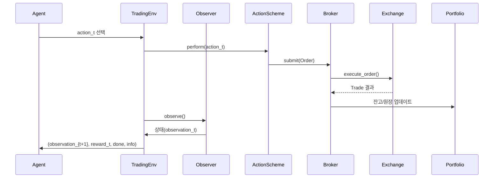
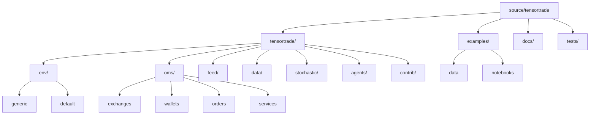

# TensorTrade 프로젝트 종합 분석 (Codex)

## 프로젝트 개요
TensorTrade는 강화학습(RL)을 활용해 알고리즘 트레이딩 전략을 설계·학습·배포할 수 있도록 돕는 오픈 소스 파이썬 프레임워크입니다. `gymnasium` 호환 환경, 주문 관리 시스템(OMS), 데이터 피드 추상화, 예시 에이전트와 시뮬레이션 도구를 제공해 연구·프로토타이핑부터 운영 자동화까지 빠르게 실험할 수 있도록 설계되었습니다. 프로젝트는 현재 **1.0.4-dev1** 베타 단계로, 프로덕션 도입 시 충분한 검증이 요구됩니다.

- **문제 정의**: 시장 데이터 전처리, 주문 체결 로직, 강화학습 환경 설계가 분리돼 있어 실험 속도가 느리고 재사용성이 떨어지는 문제를 해결합니다.
- **해결 방법**: 모듈화된 컴포넌트(환경, OMS, 데이터 피드, 보상/행동 스킴, 렌더러)를 조합하여 재사용 가능한 트레이딩 시뮬레이션 파이프라인을 구축합니다.
- **핵심 기능**
  - `TradingEnv`: `gymnasium.Env`를 확장한 기본 환경과 커스텀 구성 요소
  - OMS: 포트폴리오, 지갑, 주문, 거래, 슬리피지/실행 서비스, 원장 관리
  - `DataFeed`: 스트림 지향 데이터 파이프라인과 실시간(`PushFeed`) 처리 지원
  - 강화학습용 기본 행동/보상 스킴(`BSH`, `RiskAdjustedReturns`, `PBR` 등)
  - 합성 시장을 위한 확률 과정(`GBM`, `Heston`, `Ornstein-Uhlenbeck` 등)
  - 실무 연동을 위한 CCXT·Interactive Brokers·Robinhood 실행 어댑터
  - 예제 노트북과 Sphinx 기반 문서, Docker 빌드 환경
- **대상 사용자**
  - 퀀트 연구원/트레이더: 전략 실험 및 백테스트 자동화
  - 머신러닝 엔지니어: RL 기반 투자 모델 연구
  - 교육자/학생: 금융 데이터로 RL 이론 실습
  - 프로덕트/데이터 팀: 시뮬레이션 기반 리스크 검증
- **대표 사용 시나리오**
  - 시계열 인디케이터와 사용자 정의 보상을 포함하는 RL 에이전트 학습
  - 합성 데이터(GBM 등)로 루틴 검증 후 실거래소(CCXT) 주문 실행 테스트
  - Plotly/Matplotlib 렌더러를 활용한 전략 성과 시각화 및 리포트 자동 생성

## 기술 아키텍처

### 상위 수준 시스템 구성
```mermaid
flowchart LR
    Agent[RL Agent] -->|action| TradingEnv[TradingEnv (gymnasium)]
    TradingEnv --> ActionScheme[ActionScheme<br/>TensorTradeActionScheme]
    TradingEnv --> RewardScheme[RewardScheme]
    TradingEnv --> Observer[Observer<br/>TensorTradeObserver]
    TradingEnv --> Informer[Informer]
    TradingEnv --> Stopper[Stopper]
    TradingEnv --> Renderer[Renderer]
    Observer --> DataFeed[DataFeed / PushFeed]
    DataFeed --> MarketData[Streams & Connectors]
    ActionScheme --> Broker[Broker]
    Broker --> Orders[Orders & OrderSpecs]
    Orders --> OMS[Portfolio · Wallets · Ledger]
    OMS --> Exchanges[Exchanges & Execution Services]
    Exchanges --> MarketData
    Renderer --> Reports[Plots · Logs · Notebook Widgets]
```

### 기술 스택 요약
| 계층 | 기술 | 역할 |
| --- | --- | --- |
| 언어 및 런타임 | Python ≥ 3.11.9 | 핵심 프레임워크 및 스크립팅 |
| 강화학습 인터페이스 | `gymnasium` 0.28+ | 환경 표준화, 관측/행동 공간 제공 |
| 수치/시계열 처리 | `numpy`, `pandas` | 데이터 전처리, 벡터화 연산 |
| 딥러닝 백엔드 | `tensorflow` ≥ 2.7.0 | 예시 에이전트 및 모델 학습 |
| 시각화 | `matplotlib`, `plotly`, `ipywidgets` | 환경 렌더링, 대시보드, 노트북 UI |
| 데이터 스트림 | 커스텀 `Stream`/`DataFeed` | 유향 그래프 기반 데이터 파이프 |
| 거래 연동 | 커스텀 OMS + `ccxt`, IB, Robinhood 어댑터 | 주문 실행, 슬리피지, 원장 |
| 문서화 | Sphinx, `docs` | API 문서, 튜토리얼 |
| 컨테이너 | Docker(`tensorflow/tensorflow:2.7.0-gpu`) | GPU 지원 실행 환경 템플릿 |

### 주요 종속성
| 패키지 | 최소 버전 | 용도 |
| --- | --- | --- |
| numpy | 1.17.0 | 수치 연산, 배열 처리 |
| pandas | 0.25.0 | 시계열 데이터 프레임 |
| gymnasium | 0.28.1 | 강화학습 환경 표준화 |
| tensorflow | 2.7.0 | 딥러닝 백엔드 및 모델 구현 |
| pyyaml | 5.1.2 | 설정 파일 파싱 |
| stochastic | 0.6.0 | 확률 과정 샘플링 |
| ipython | 7.12.0 | 대화형 환경 및 노트북 |
| matplotlib / plotly | 3.1.1 / 4.5.0 | 시각화 및 렌더링 |
| ipywidgets | 7.0.0 | 인터랙티브 위젯(렌더러) |
| deprecated | 1.2.13 | 사용 중단 API 경고(에이전트) |
| pytest / ta | 5.1.1 / 0.4.7 (tests extra) | 테스트 실행, 기술적 지표 |
| sphinx 계열 | 최신 | 문서 생성 |

### 설계 패턴 및 아키텍처 결정 사항
- **컴포넌트 레지스트리**: `Component` 클래스와 `InitContextMeta`로 구성 요소를 컨텍스트 기반으로 등록·생성하여 재사용성과 설정 주입을 단순화합니다.
- **시간 동기화**: `Clock`과 `TimeIndexed` 믹스인으로 환경, OMS, 피드를 동일한 스텝 단위로 정렬합니다.
- **데이터 그래프**: `Stream`/`DataFeed`는 토폴로지 정렬을 통해 의존 관계를 해결하고 배치 처리와 실시간 처리를 모두 지원합니다.
- **OMS 추상화**: `Portfolio`-`Wallet`-`Order`-`Trade` 계층과 `ExchangeOptions`로 실제/시뮬레이션 거래를 동일한 인터페이스로 다룹니다.
- **전략 캡슐화**: `ActionScheme`, `RewardScheme`, `Stopper`, `Informer` 등을 독립 모듈로 정의해 강화학습 전략을 조합형으로 구성합니다.
- **서비스 어댑터**: `oms.services.execution` 모듈이 거래소 API와의 연결을 캡슐화하며, 슬리피지는 별도 전략으로 분리됩니다.
- **문서·예제 우선**: Sphinx 문서와 Jupyter 노트북 예제를 통해 학습 곡선을 낮추고, Docker/Makefile로 환경 구성을 자동화합니다.

### 컴포넌트 상호작용 및 데이터 흐름

`DataFeed`는 내부/외부 스트림을 컴파일해 관측치와 렌더링 데이터를 동시에 제공하며, `Stopper`는 손실 한도 또는 데이터 종료 시 에피소드를 중단합니다. `Informer`는 거래일, 수익률 요약 등 메타 정보를 `info` 딕셔너리로 노출합니다.

## 프로젝트 구조

| 경로 | 설명 |
| --- | --- |
| `tensortrade/` | 핵심 파이썬 패키지. 환경(`env`), OMS(`oms`), 데이터 피드(`feed`), 에이전트(`agents`), 합성 데이터(`stochastic`), 유틸 등이 위치합니다. |
| `tensortrade/env` | `generic` 환경 추상화와 `default` 빌드 도우미(`create`)를 포함합니다. 행동/보상/관측/중지/렌더러 구현이 제공됩니다. |
| `tensortrade/oms` | 거래소(`exchanges`), 인스트루먼트, 지갑/포트폴리오, 주문/거래, 실행/슬리피지 서비스. 실거래 및 시뮬레이션을 지원합니다. |
| `tensortrade/feed` | `Stream`, `DataFeed`, `PushFeed` 등 그래프 기반 데이터 파이프라인과 `api` 유틸리티 연산. |
| `tensortrade/stochastic` | GBM, Heston, OU 등 시계열 생성 프로세스와 파라미터 유틸. |
| `tensortrade/data` | `CryptoDataDownload` 등 외부 데이터 수집 헬퍼. |
| `tensortrade/agents` | A2C, DQN, 병렬 DQN 예제(사용 중단 예정). |
| `examples/` | 학습/평가, 렌더링, Ledger 활용, Ray 통합 등 Jupyter 노트북과 샘플 데이터. |
| `docs/` | Sphinx 소스, API 레퍼런스, 튜토리얼, 리소스. |
| `tests/` | 제한적 단위 테스트 및 테스트 유틸리티. |
| `Makefile`, `Dockerfile`, `setup.py` | 빌드/테스트 자동화, 컨테이너 이미지, 패키징 메타데이터. |

### 디렉터리 계층 다이어그램


### 폴더 구성 의도
- **모듈 경계 명확화**: 환경(`env`), OMS(`oms`), 데이터 피드(`feed`)를 분리해 각 레이어의 책임을 명확히 했습니다.
- **컨텍스트 기반 확장성**: `core` 모듈이 공통 컨텍스트·ID·레지스트리를 제공하여 커스텀 컴포넌트를 쉽게 추가할 수 있습니다.
- **실무 연동 대비**: `services` 하위 모듈로 시뮬레이션과 실거래 어댑터를 분리, 보안 민감 정보와 실행 전략을 모듈화합니다.
- **문서/예제 우선**: 풍부한 노트북과 Sphinx 문서를 별도 관리하여 온보딩을 단순화합니다.

## 설치 및 환경 구성

### 전제 조건
- Python 3.11.9 이상
- pip 또는 `pipenv`/`poetry` 등 패키지 관리자
- (선택) NVIDIA GPU 및 CUDA/cuDNN (TensorFlow GPU 사용 시)
- (선택) `ta-lib` 라이브러리: Dockerfile에서 자동 설치되며, 로컬 설치 시 소스 컴파일 필요

### 권장 시스템 요구사항
- CPU: 4코어 이상
- 메모리: 8GB 이상 (대규모 데이터/병렬 학습 시 16GB 권장)
- 저장공간: 최소 2GB (예제 데이터, 캐시 포함)
- 운영체제: Linux, macOS, WSL2 환경에서 검증 (Windows 네이티브 사용 시 WSL 권장)

### 설치 경로별 가이드
1. **PyPI 패키지 사용**
   ```bash
   pip install tensortrade
   ```
2. **최신 개발 버전 (Git)**
   ```bash
   pip install git+https://github.com/tensortrade-org/tensortrade.git
   ```
3. **로컬 소스 설치 (이 리포지터리 구조)**
   ```bash
   cd source/tensortrade
   pip install -r requirements.txt
   pip install -r examples/requirements.txt    # 예제 노트북 실행 시
   pip install -e ".[tests,docs]"              # 개발/문서/테스트
   ```
4. **Docker 기반 실행**
   ```bash
   make build-cpu        # 또는 make build-gpu
   make run-notebook     # Jupyter (포트 8888)
   make run-tests
   make run-docs
   ```
   - Docker 이미지는 `tensorflow/tensorflow:2.7.0-gpu` 기반이며 `ta-lib`을 포함합니다.
5. **Taskfile**(필요 시) 또는 `Makefile`을 이용해 반복 작업을 자동화하세요.

### 구성 지침
- 기본 환경 빌더 `tensortrade.env.default.create`의 주요 인자는 아래와 같습니다.

| 인자 | 타입 | 설명 | 기본값/비고 |
| --- | --- | --- | --- |
| `portfolio` | `Portfolio` | 거래에 사용되는 지갑/인스트루먼트 묶음 | 필수 |
| `action_scheme` | `TensorTradeActionScheme` 또는 `str` | 행동 생성 로직 (`"bsh"`, `"managed-risk"` 등) | 필수 |
| `reward_scheme` | `TensorTradeRewardScheme` 또는 `str` | 보상 계산 로직 (`"simple"`, `"pbr"`, `"risk-adjusted"` 등) | 필수 |
| `feed` | `DataFeed` | 관측에 사용될 데이터 스트림 | 필수 |
| `window_size` | `int` | 관측 윈도 크기 | 1 |
| `min_periods` | `int` | 피드 워밍업 스텝 수 | 없음 |
| `random_start_pct` | `float` | 에피소드 시작 시 랜덤 오프셋 비율 | 0.0 |
| `renderer` | `Renderer` 또는 리스트 | 로그/Plotly/Matplotlib 렌더러 조합 | `EmptyRenderer` |
| `stopper` | `Stopper` | 손실 제한 등 종료 조건 | `MaxLossStopper(max_allowed_loss=0.5)` |
| `informer` | `Informer` | 에피소드 메타데이터 공유 | `TensorTradeInformer` |

- 실거래 연동 시 `oms.services.execution`의 CCXT/IB/Robinhood 서비스를 지정하고 필요한 인증 정보를 환경변수로 주입하세요.
- `DataFeed`는 `Stream.group`, `Stream.sensor`, `Stream.reduce` 등을 활용해 내부/외부 지표를 결합합니다. 실시간 데이터는 `PushFeed`로 처리합니다.

### 일반적인 문제 해결
- **TensorFlow/CUDA 오류**: 최소 요구 버전 미만이거나 CUDA 드라이버가 맞지 않는 경우 발생. `tensorflow==2.7.0`에 맞는 CUDA 11.x 조합을 사용하세요.
- **`ta-lib` 빌드 실패**: macOS는 `brew install ta-lib`, Linux는 Dockerfile 절차를 참고해 소스 컴파일 후 `pip install Ta-Lib`.
- **`gymnasium` 불일치**: 이전 Gym 패키지와 혼용 시 오류 발생. `pip uninstall gym` 후 `gymnasium`만 유지하세요.
- **Plotly 렌더러 빈 화면**: `ipywidgets`가 활성화되지 않으면 렌더링이 되지 않습니다. Jupyter에서 `jupyter nbextension enable --py widgetsnbextension` 실행.
- **예제 데이터 경로**: 노트북 실행 시 `examples/data/` 경로를 기준으로 상대 경로를 맞추세요.

## 사용 가이드

### 기본 워크플로우 예제
```python
import pandas as pd
from tensortrade.feed.core import Stream, DataFeed
from tensortrade.oms.exchanges import Exchange, ExchangeOptions
from tensortrade.oms.services.execution import simulated
from tensortrade.oms.wallets import Wallet, Portfolio
from tensortrade.oms.instruments import BTC, USDT
from tensortrade.env.default import create
from tensortrade.env.default.actions import BSH
from tensortrade.env.default.rewards import SimpleProfit

# 1. 시세 데이터 준비
df = pd.read_csv("examples/data/Coinbase_BTCUSD_1h.csv").head(500)
price_stream = Stream.source(list(df["Close"]), dtype="float").rename("BTC/USD")

# 2. 거래소/포트폴리오 초기화
exchange = Exchange("simulated", service=simulated.execute_order, options=ExchangeOptions(commission=0.001))
exchange(price_stream)  # 스트림 등록

cash = Wallet(exchange, 10_000 * USDT)
asset = Wallet(exchange, 1 * BTC)
portfolio = Portfolio(base_instrument=USDT, wallets=[cash, asset])

# 3. 데이터 피드 및 환경 생성
feed = DataFeed([price_stream])
env = create(
    portfolio=portfolio,
    action_scheme=BSH(cash=cash, asset=asset),
    reward_scheme=SimpleProfit(window_size=10),
    feed=feed,
    window_size=20,
    random_start_pct=0.05,
    renderer=["screen_logger"]  # 필요 시 Plotly/Matplotlib 렌더러 지정
)

state, info = env.reset()
done = False
while not done:
    action = env.action_space.sample()
    state, reward, done, truncated, info = env.step(action)
```

### 고급 기능 활용
- **실시간 데이터**: `PushFeed`와 `Placeholder` 스트림으로 외부 웹소켓/REST 데이터를 주입할 수 있습니다.
- **맞춤 보상/행동**: `TensorTradeRewardScheme`, `TensorTradeActionScheme`을 상속하고 `get_reward`, `get_orders`를 구현해 전략을 정의합니다.
- **Position-Based Returns (PBR)**: 가격 스트림과 포지션 스트림을 곱해 수익을 계산하는 보상 스킴(`pbr`)을 활용할 수 있습니다.
- **리스크 관리 주문**: `risk_managed_order`, `proportion_order` 등 OMS 헬퍼와 `OrderSpec` 기준을 조합해 복합 주문 경로를 구성합니다.
- **합성 데이터**: `tensortrade.stochastic.processes`의 GBM/Heston 등으로 데이터셋을 생성한 뒤 `Stream.source`에 연결합니다.
- **렌더링 옵션**: `ScreenLogger`, `FileLogger`, `MatplotlibChart`, `PlotlyTradingChart` 등 리스너를 조합해 모니터링합니다.

### 구성 옵션 및 튜닝 포인트
- **슬리피지/수수료**: `ExchangeOptions`에서 `commission`, 최소/최대 주문 크기, 가격 범위를 설정합니다.
- **랜덤 스타트**: `random_start_pct`로 학습 데이터 편향을 줄이고 일반화를 돕습니다.
- **포트폴리오 초기화**: `Portfolio`는 `Wallet` 리스트를 받아 기본 자산과 암호/주식 등 다중 자산 구성을 지원합니다.
- **Informer**: `informers.TensorTradeInformer` 기본 구현은 순자산, 손익률, 시각 정보를 제공합니다. 커스텀 인포머를 작성해 로그를 확장할 수 있습니다.

### API 문서 안내
- Sphinx 기반 HTML 문서는 `docs/build/html/index.html` 또는 [tensortrade.org](https://tensortrade.org)에서 확인할 수 있으며, 주요 모듈별 API 레퍼런스(`tensortrade.env.generic`, `tensortrade.oms`, `tensortrade.feed`)가 제공됩니다.
- `docs/source/overview/getting_started.md`는 설치·첫 예제를 설명하고, `docs/source/examples/`는 노트북 기반 워크플로우를 정리합니다.

### CLI 및 자동화 참고
| 명령 | 설명 |
| --- | --- |
| `make test` | 로컬 PyTest 실행 (`tests/`) |
| `make doctest` | 모듈 도큐테스트 실행 |
| `make docs-build` / `make docs-serve` | Sphinx HTML 문서 빌드 및 로컬 서버 |
| `make run-notebook` | Docker 기반 Jupyter 노트북 서버 실행 |
| `make package` | Wheel/SDist 패키징 |
| `python -m tensortrade` | (미제공) 직접 실행 엔트리포인트 없음 – 스크립트에서 직접 임포트 |

## 개발 지침

### 개발 환경 설정
```bash
cd source/tensortrade
pip install -e ".[tests,docs]"
pre-commit install  # 필요 시 커스텀 훅 구성
```
- 예제 노트북 실행용 의존성은 `examples/requirements.txt`에서 별도 설치합니다.
- GPU 사용 시 CUDA/CuDNN 버전을 TensorFlow 2.7 요구사항에 맞춥니다.

### 코드 스타일 및 규칙
- PEP8을 기본으로 하되, 과도한 줄바꿈 제한은 적용하지 않습니다 (`CONTRIBUTING.md` 참고).
- Docstring은 마크다운 스타일로 `Arguments`, `Returns`, `Raises` 섹션을 포함해야 합니다.
- 신규 기능은 디자인 문서와 이슈를 선행하여 리뷰 프로세스를 용이하게 합니다.
- `Component` 파생 클래스는 `registered_name`을 정의하고, `TradingContext`를 통해 설정을 주입받도록 구현합니다.

### 테스트 전략 및 커버리지
- 테스트는 PyTest 기반(`make test` 또는 `pytest tests/`). 현재 저장소에는 최소한의 유틸 테스트만 존재하므로, 신규 기능 추가 시 단위/통합 테스트를 필수 작성하는 것이 좋습니다.
- `pytest --workers auto`로 병렬 테스트가 가능하며, `pytest --doctest-modules tensortrade/`로 문서화 코드 검증이 가능합니다.
- 예제 노트북은 자동화 테스트에 포함되지 않으므로, 주요 워크플로우에 대한 스크립트형 예제나 전처리 함수를 별도 작성해 회귀를 방지하세요.

### 기여 가이드라인
- 버그 리포트는 OS/TF 버전, GPU 여부, 재현 가능한 코드(Gist 권장)를 포함해야 합니다.
- 기능 제안 시 API 설계 의도, 사용 시나리오, 코드 스니펫을 포함하고, 다수 사용자에게 유용한지 고려합니다.
- PR 제출 전: 테스트 통과, 커버리지 향상, 문서/Docstring 업데이트, 명확한 커밋 메시지 작성이 요구됩니다.
- 코드 스타일 위반은 `autopep8`, `pytest --pep8`(옵션)을 활용해 사전에 해결하십시오.

## 추가 정보

### 성능 고려사항
- `DataFeed.compile()`은 스트림 그래프를 토폴로지 정렬하여 반복 실행 비용을 낮춥니다. 복잡한 파이프라인은 사전 컴파일 후 재사용하세요.
- `ParallelDQNAgent`는 `multiprocessing`으로 병렬 환경을 실행하지만 사용 중단 예정입니다. Ray 등 외부 프레임워크와 연동 시 더 높은 확장성을 확보할 수 있습니다.
- TensorFlow 2.x Eager Execution을 사용하므로 GPU 가속 환경에서 Batch 크기와 윈도우 크기를 조정해 성능을 최적화해야 합니다.
- `ExchangeOptions`의 `commission`은 최소 단위 정밀도보다 작을 경우 자동 보정되어 수수료 누락을 방지합니다.

### 보안 고려사항
- 실거래 어댑터(CCXT, Interactive Brokers 등)를 사용할 때 API 키·시크릿은 환경 변수나 비밀 관리 서비스에서 주입하고, 소스 코드에 하드코딩하지 마세요.
- 주문 실행 서비스는 실제 자금에 영향을 줄 수 있으므로 시뮬레이션 모드(`options.is_live=False`)에서 충분히 검증한 후 점진적으로 라이브 모드를 활성화해야 합니다.
- 거래 로그와 렌더링 결과는 민감 정보를 포함할 수 있으므로 접근 권한을 제한하고, 필요 시 마스킹 처리하세요.

### 로드맵 및 향후 계획 (합리적 추론)
- README와 코드 주석에 따라 프로젝트는 베타 단계이며, 내부 에이전트를 외부 구현(Ray 등)으로 대체하는 방향이 명시돼 있습니다.
- `gym`에서 `gymnasium`으로 전환된 만큼 향후 강화학습 커뮤니티 표준을 지속적으로 따라갈 것으로 예상됩니다.
- `contrib` 네임스페이스가 비어 있어, 커뮤니티 기반 전략/커넥터 추가가 예정돼 있거나 권장되는 구조입니다.
- 테스트 커버리지 보강과 문서/예제 최신화가 필요하며, 실시간 데이터 파이프라인(`PushFeed`)의 고도화와 대규모 분산 학습 통합이 차기 과제로 추론됩니다.

### 라이선스 및 저작권
- 프로젝트 라이선스는 **Apache License 2.0**( `LICENSE` )으로, 상업적 이용 및 수정/배포가 허용되지만 저작권 고지 및 변경 사항 명시가 필요합니다.
- `CODE_OF_CONDUCT.md`와 `CONTRIBUTING.md`를 통해 커뮤니티 행동 강령과 기여 절차가 정의돼 있습니다.

---
본 문서는 `source/tensortrade` 디렉터리의 소스 코드, 설정 파일, 문서 구조를 기반으로 작성되었으며, 기술·비기술 이해 관계자 모두가 TensorTrade 프레임워크를 평가·도입·확장하는 데 필요한 핵심 정보를 포괄적으로 담도록 구성했습니다.
