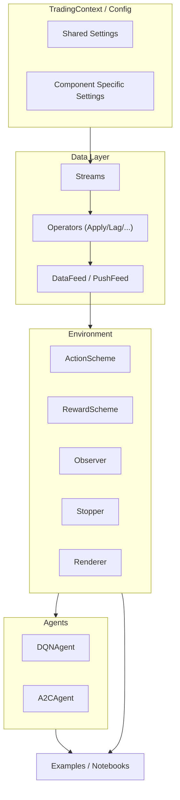
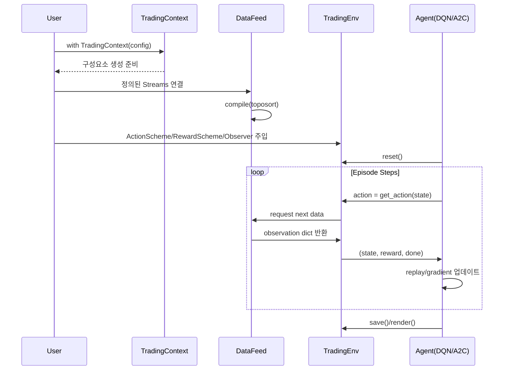
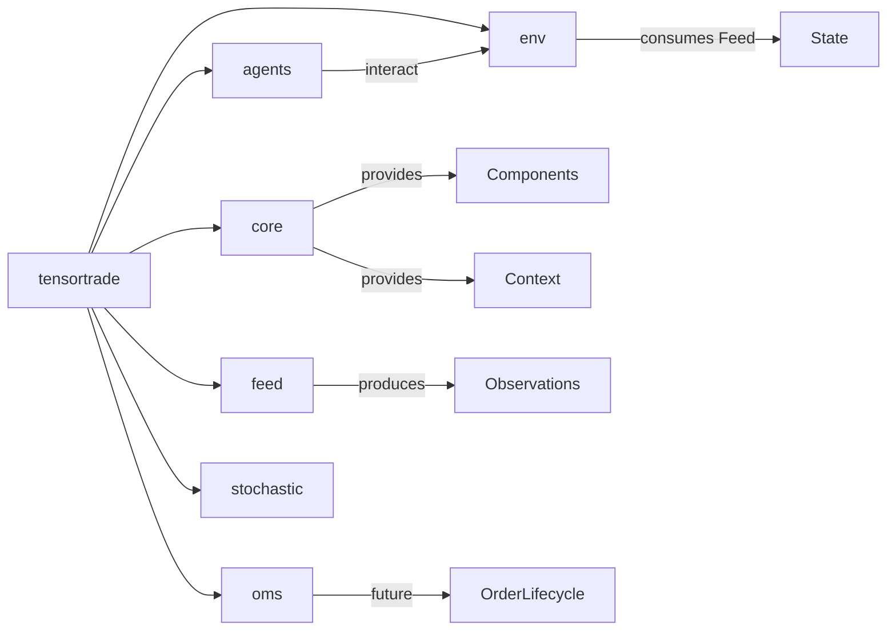

# TensorTrade 종합 기술 및 아키텍처 보고서 (copilot-gpt5)

## 1. 프로젝트 개요

TensorTrade는 강화학습(Reinforcement Learning, RL)을 활용하여 알고리즘 트레이딩(Algorithmic Trading) 에이전트를 구성, 학습, 평가, 배포할 수 있도록 하는 고도로 모듈화된 오픈소스 파이썬 프레임워크입니다. 목표는 빠른 실험(rapid experimentation)과 생산 환경 수준의 데이터/컴포넌트 파이프라인을 동시에 지원하는 것입니다.

### 1.1 목적 (Problem & Goal)
- 다양한 금융 자산(암호화폐, 주식, 선물 등)에 대해 강화학습 기반 트레이딩 전략을 빠르게 구성하고 테스트.
- 학습 데이터 피드, 환경 구성, 행동/보상 설계, 에이전트 학습 루프를 표준화하여 재사용성 증대.
- 연구용 프로토타입에서 생산환경(HPC 분산 실행)까지 확장 가능한 구조 제공.

### 1.2 해결하려는 문제 정의
기존 RL 트레이딩 연구는 다음과 같은 문제를 반복적으로 해결해야 했습니다:
1. 비표준화된 데이터 수집/전처리 파이프라인 → 실험 복제 어려움.
2. 환경/행동/보상 설계가 프레임워크화 되어 있지 않아 재사용성 낮음.
3. 여러 알고리즘(DQN, A2C 등) 실험 시 학습 루프 중복 코드 다수.
4. 라이브 데이터(온라인)와 백테스트(오프라인) 흐름을 통합하기 어려움.
TensorTrade는 이를 컴포넌트 기반 추상화로 해결하여 설정 비용을 낮추고 실험 속도를 높입니다.

### 1.3 핵심 가치 및 해결 방법(Approach)
- Component & Context 기반 의존성 주입: `TradingContext`를 통해 공통 설정(shared config)을 자동 주입.
- Stream 기반 데이터 피드(`DataFeed`): 선언적으로 데이터 흐름을 구성, toposort로 실행 순서 결정.
- 강화학습 친화적 환경(`TradingEnv`): ActionScheme, RewardScheme, Observer, Stopper 등 교체형 플러그인.
- 에이전트 추상화(Agent/DQN/A2C): 학습 루프, 정책/가치 네트워크 구조 예시 제공 (Deprecated 예정 안내 포함).

### 1.4 주요 기능 (Key Features)
| 기능 | 설명 | 대표 모듈 |
|------|------|-----------|
| 컴포넌트 레지스트리 | 환경에서 사용하는 구성요소 자동 등록/생성 | `tensortrade.core.component`, `registry` |
| 컨텍스트 주입 | `with TradingContext(config)` 블록으로 구성요소 초기화 | `tensortrade.core.context` |
| 데이터 스트림 | 다단 변환, 지연(Lag), 그룹화, 적용(Apply) 오퍼레이터 | `tensortrade.feed.core.*` |
| DataFeed 컴파일 | Directed graph 정렬(toposort) 후 실행 순서 확정 | `tensortrade.feed.core.feed` |
| 온라인 PushFeed | 플레이스홀더에 값 push 후 동기 실행 | `tensortrade.feed.core.feed` |
| Action/Reward Scheme | 행동공간 정의 및 보상 계산 모듈화 | `tensortrade.env.generic.components` |
| 다양한 Agent 예시 | DQN, A2C 등 신경망/학습 로직 구현 | `tensortrade.agents.*` |
| 설치/배포 | PyPI 패키지, git 최신 버전 설치, Docker 지원 | `setup.py`, `Makefile`, `Dockerfile` |
| 테스트/문서 | pytest, sphinx 기반 문서화 | `tests/`, `docs/` |

### 1.5 대상 사용자 (Target Users)
- 연구자/퀀트(Quant) 개발자: 새로운 보상함수/액션 정책 실험.
- 머신러닝 엔지니어: RL 파이프라인을 금융 데이터에 적용.
- 트레이더/스타트업 프로토타입 팀: 전략 신속 검증.
- 교육 목적: 강화학습을 금융 도메인에 적용하는 학습 자료.

### 1.6 대표 사용 사례 (Use Cases)
1. 백테스트용 히스토릭 가격 데이터에 대해 DQN 에이전트 학습 및 수익률 비교.
2. 커스텀 지표(예: 기술적 분석, 온체인 지표)를 Stream으로 합성해 보상함수에 반영.
3. 멀티 에셋 포트폴리오 관리 환경 구성 후 A2C 학습.
4. 온라인 데이터(실시간 가격 feed)를 PushFeed로 연결하여 시뮬레이션.
5. 새로운 보상 스킴(Sharpe ratio, 최대 낙폭 패널티 등) 모듈 개발.

---

## 2. 기술 아키텍처

### 2.1 고수준 시스템 아키텍처 (Mermaid)


### 2.2 기술 스택
| 영역 | 사용 기술 | 비고 |
|------|-----------|------|
| 언어 | Python 3.11+ | `setup.py` 명시 |
| ML/RL | TensorFlow, (Gymnasium API) | 정책/가치망, env 인터페이스 |
| 데이터 | numpy, pandas | 벡터/시계열 처리 |
| 시뮬레이션 | gymnasium | action/observation space 표준화 |
| 시각화 | matplotlib, plotly, ipywidgets | Jupyter 렌더링 지원 |
| 기타 | pyyaml, deprecated, stochastic | 설정/경고/확률 프로세스 |
| 문서화 | sphinx, nbsphinx | docs 빌드 |
| 테스트 | pytest | 단위/통합 테스트 |

### 2.3 종속성 관리
- 기본 의존성: `requirements.txt`, `setup.py -> install_requires` 동기.
- 선택적 extras: `tests`, `docs` 등 `setup.py`의 `extras_require`.
- 예제 실행 추가 의존성: `examples/requirements.txt`.

### 2.4 디자인 패턴
| 패턴 | 적용 위치 | 설명 |
|------|-----------|------|
| 추상 팩토리/DI | `InitContextMeta`, `TradingContext` | 컨텍스트 기반 인스턴스 생성시 설정 주입 |
| 전략(Strategy) | ActionScheme, RewardScheme | 교체 가능한 행동/보상 로직 |
| 옵저버(Observer) | Stream Observable | 데이터 값 변경 시 리스너 알림 |
| 템플릿 메서드 | Agent.train() | 학습 루프 골격 유지, 내부 정책만 교체 |
| 컴포지트 | DataFeed(Streams Graph) | Stream 그래프 구성/위상 정렬 |
| 데코레이터 | `deprecated` 어노테이션 | 레거시 API 경고 |

### 2.5 주요 아키텍처 결정사항 (ADR 형식 요약)
| 항목 | 결정 | 근거 |
|------|------|------|
| Python 3.11 이상 | 최신 언어 기능 및 라이브러리 호환 | `python_requires` 제약 |
| TensorFlow 채택 | 초기 커뮤니티 친화성, 예제 다수 | 고성능 활용 및 풍부한 레퍼런스 |
| Gymnasium API | RL 벤치마크 표준 준수 | interoperability 확보 |
| Context 기반 구성 | 실험 설정 재사용성 극대화 | 복잡한 환경 구성 단순화 |
| Stream 추상화 | 선언적 데이터 파이프라인 | 재조합 용이성, 지연변환 지원 |
| 내장 에이전트 Deprecation | 외부 고도화된 프레임워크(Ray 등)로 이전 유도 | 유지보수 비용 절감 |

### 2.6 구성 요소 상호작용 & 데이터 흐름


### 2.7 데이터 피드 그래프 예시
```mermaid
graph TD
  Price[Stream: price] --> Lag1[Lag(price,1)]
  Price --> SMA[Apply(SMA_14)]
  Lag1 --> Ret[Apply(Return)]
  SMA --> FeatGroup[Group Features]
  Ret --> FeatGroup
  FeatGroup --> DF[DataFeed]
```

---

## 3. 프로젝트 구조

### 3.1 디렉토리 개요
| 경로 | 설명 |
|------|------|
| `tensortrade/agents/` | DQN, A2C 등 예시 에이전트 구현 (deprecated 예정) |
| `tensortrade/core/` | 컴포넌트/컨텍스트/레지스트리 기반 추상화 핵심 |
| `tensortrade/env/` | 환경 기본/제네릭 구현 및 구성요소(ActionScheme 등) |
| `tensortrade/feed/` | Stream, DataFeed, Operators, Namespace 등 데이터 흐름 |
| `tensortrade/oms/` | 주문관리(OMS) 관련 확장 포인트 (현재 최소 구현) |
| `tensortrade/stochastic/` | 확률적 프로세스(예: 가격 시뮬레이션) 지원 |
| `examples/` | 실습/튜토리얼 예제 노트북 및 스크립트 |
| `docs/` | Sphinx 문서 소스 |
| `tests/` | 테스트 패키지 (현재 기본구조) |
| `setup.py`, `requirements.txt` | 패키징/설치 스크립트 및 종속성 |
| `Dockerfile`, `Makefile` | 컨테이너 및 실행 편의 명령 |

### 3.2 계층 구조 다이어그램


### 3.3 파일 구성 근거
- `core`: 모든 컴포넌트가 일관된 생명주기(생성, 컨텍스트 주입)를 갖도록 메타클래스 패턴 적용.
- `feed`: 데이터 변환을 선언적으로 정의하여 연구자가 빠르게 특징 엔지니어링 가능.
- `env`: RL 학습 루프에서 요구되는 action_space, reward 계산, 종료 조건, 관측(observation) 변형을 모듈로 분리.
- `agents`: 기본 예제 제공으로 사용자 온보딩 단순화, 단 외부 고급 프레임워크로 이전을 권장.
- `oms`: 거래 체결 및 주문 흐름을 추후 세밀하게 관리할 확장 공간.

### 3.4 핵심 클래스 요약
| 클래스 | 역할 | 핵심 메서드 |
|--------|------|-------------|
| `TradingContext` | 설정 컨테이너 & DI | `__enter__`, `get_context` |
| `Component` | 컨텍스트 주입 가능한 베이스 | `__init_subclass__`, `default` |
| `Stream` | 데이터 원천/연산 노드 | `forward`, `run`, `has_next` |
| `DataFeed` | Stream 실행 순서 관리 | `compile`, `run`, `reset` |
| `ActionScheme` | 행동 공간 정의 | `action_space`, `perform` |
| `RewardScheme` | 보상 계산 | `reward` |
| `Agent` | 학습 루프 추상화 | `train`, `get_action` |

---

## 4. 설치 및 설정

### 4.1 전제 조건
| 항목 | 최소 요구 |
|------|-----------|
| Python | 3.11.9 이상 |
| OS | Linux / macOS / Windows (x86_64) |
| 메모리 | 모델/배치 크기에 따라 4GB 이상 권장 |
| GPU (선택) | CUDA 호환 NVIDIA GPU (TensorFlow 가속 시) |

### 4.2 기본 설치
```bash
pip install tensortrade
```

### 4.3 최신(master) 버전 설치 (위험 / 실험용)
```bash
pip install git+https://github.com/tensortrade-org/tensortrade.git
```

### 4.4 수동 설치 (클론 후)
```bash
git clone https://github.com/tensortrade-org/tensortrade.git
cd tensortrade
pip install -r requirements.txt
# 예제 추가 기능
pip install -r examples/requirements.txt
```

### 4.5 Docker 활용
```bash
git clone https://github.com/tensortrade-org/tensortrade.git
cd tensortrade
docker build -t tensortrade:latest .
# 노트북 실행
make run-notebook
```

### 4.6 구성(TradingContext)
```python
from tensortrade.core.context import TradingContext
from tensortrade.env.generic.components import ActionScheme, RewardScheme

config = {
    'shared': {'base_instrument': 'USD', 'commission': 0.001},
    'actions': {'type': 'discrete'},
    'rewards': {'strategy': 'risk_adjusted'}
}

with TradingContext(config) as context:
    # context 하에서 생성되는 Component 들은 자동으로 설정 주입
    pass
```

### 4.7 일반적인 문제 해결 (Troubleshooting)
| 문제 | 원인 | 해결 |
|------|------|------|
| TensorFlow 버전 충돌 | 로컬 환경 기존 TF 설치 | 가상환경 생성 후 재설치 (`python -m venv .venv`) |
| Gymnasium space mismatch | ActionScheme/Env 불일치 | ActionScheme 구현의 `action_space` 재검증 |
| Stream None 값 발생 | 초기 지연(Lag) 또는 데이터 부족 | `Lag` 초기 몇 step은 `np.nan` 허용/전처리 |
| PushFeed push 전에 next 호출 | 플레이스홀더 값 미로딩 | `push(data)` 호출 후 `next()` |
| DeprecationWarning (agents) | 내장 에이전트 사용 | 외부 RL 라이브러리(Ray RLlib 등) 이전 고려 |

---

## 5. 사용 가이드

### 5.1 기본 예제 (단순 피드 + 환경)
```python
from tensortrade.feed.core import DataFeed
from tensortrade.feed.core.operators import Lag, Apply
from tensortrade.feed.core.base import Stream

# 가격 시계열을 가정한 간단한 예시
class PriceStream(Stream[float]):
    def __init__(self, prices):
        super().__init__(name='price')
        self.prices = prices
        self.i = 0
    def forward(self):
        v = self.prices[self.i]
        self.i += 1
        return v
    def has_next(self):
        return self.i < len(self.prices)
    def reset(self):
        self.i = 0

prices = [100,101,102,101,99,100]
price_stream = PriceStream(prices)
ret_stream = Apply(lambda x: x/100.0, dtype='float')(price_stream)
lag_stream = Lag(lag=1)(price_stream)
feed = DataFeed([price_stream, ret_stream, lag_stream])
feed.compile()
print(feed.next())
```

### 5.2 에이전트 학습 루프 (DQN 예시)
```python
from tensortrade.agents.dqn_agent import DQNAgent
# 가정: env = SomeTradingEnv(...)
agent = DQNAgent(env)
mean_reward = agent.train(n_steps=500, n_episodes=5, batch_size=64)
print('Mean Reward:', mean_reward)
```

### 5.3 커스텀 RewardScheme
```python
from tensortrade.env.generic.components.reward_scheme import RewardScheme

class DrawdownPenaltyReward(RewardScheme):
    def reward(self, env):
        profit = env.portfolio.performance['profit']
        max_drawdown = env.portfolio.performance['max_drawdown']
        return profit - 0.5 * max_drawdown
```

### 5.4 커스텀 ActionScheme
```python
from tensortrade.env.generic.components.action_scheme import ActionScheme
from gymnasium.spaces import Discrete

class SimpleActionScheme(ActionScheme):
    @property
    def action_space(self):
        return Discrete(3)  # 0:Hold,1:Buy,2:Sell
    def perform(self, env, action):
        if action == 1:
            env.buy()
        elif action == 2:
            env.sell()
```

### 5.5 구성 옵션 요약
| 구성 영역 | 예시 키 | 설명 |
|-----------|---------|------|
| shared | base_instrument | 기준 통화/자산 |
| actions | type | discrete/continuous 구분 |
| rewards | strategy | 수익/위험 조정 방식 선택 |
| feed | lag, apply ops | 지표 계산 파라미터 |

### 5.6 CLI/Makefile 편의 명령
| 명령 | 기능 |
|------|------|
| `make run-notebook` | Jupyter Notebook 실행 |
| `make run-docs` | Sphinx 문서 빌드 |
| `make run-tests` | 테스트 실행 |

### 5.7 API 문서 (개요)
주요 추상화 별 핵심 시그니처:
```python
class Component: 
    def default(self, key: str, value: Any, kwargs: dict = None) -> Any

class Stream(Generic[T]):
    def forward(self) -> T
    def has_next(self) -> bool
    def run(self) -> None

class DataFeed(Stream[dict]):
    def compile(self) -> None
    def next(self) -> dict

class ActionScheme(Component, TimeIndexed):
    @property
    def action_space(self) -> Space
    def perform(self, env: 'TradingEnv', action: Any) -> None

class RewardScheme(Component, TimeIndexed):
    def reward(self, env: 'TradingEnv') -> float
```

### 5.8 고급 기능
- 지연(Lag)/누적(Accumulator)/함수 적용(Apply)으로 복합 특징 생성.
- PushFeed로 실시간 데이터 스트림 연동.
- 외부 RL 프레임워크(Ray, Stable-Baselines 등)와 Env 인터페이스 결합.
- Context를 YAML/JSON에서 로드하여 환경 재현.

---

## 6. 개발 지침

### 6.1 개발 환경 설정 권장
```bash
python -m venv .venv
source .venv/bin/activate
pip install -r requirements.txt
pip install -r examples/requirements.txt  # 필요시
```

### 6.2 코드 스타일 & 규칙
- PEP8 준수, 타입 힌트 활용 (`mypy` 도입 고려).
- 모듈/클래스 docstring: 역할, 파라미터, 반환 명시.
- Deprecated 어노테이션은 제거 계획 버전 명시.

### 6.3 테스트 전략
| 범주 | 설명 |
|------|------|
| 단위(Unit) | Stream forward / Reward 함수 정확성 |
| 통합(Integration) | DataFeed compile 후 전체 next 흐름 |
| 회귀(Reg.) | 주요 성능 지표(수익률, drawdown) 변동 감시 |
| 성능(Perf) | 대량 데이터 feed 처리 시간 측정 |

간단 예시 (pytest):
```python
def test_lag_operator():
    from tensortrade.feed.core.operators import Lag
    from tensortrade.feed.core.base import Stream
    class Const(Stream[int]):
        def __init__(self):
            super().__init__('c'); self.v=0
        def forward(self): self.v+=1; return self.v
        def has_next(self): return self.v < 5
        def reset(self): self.v=0
    const = Const()
    lag1 = Lag(lag=1)(const)
    const.run(); lag1.run()
    assert lag1.value == np.nan  # 첫 step lag
```

### 6.4 커버리지 & 품질
- 최소 핵심 모듈(Streams, DataFeed, Action/Reward Scheme) 커버리지 80% 목표.
- CI에서 `pytest -q` + 커버리지 리포트(`coverage.py`) 실행 권장.

### 6.5 기여 가이드라인 요약
1. Issue 등록 → 재현 시나리오 포함.
2. Fork & Branch: `feat/`, `fix/`, `docs/` prefix 사용.
3. 테스트 추가 후 PR 생성 (변경 영향 영역 중심 최소 1개 이상).
4. 문서(README 또는 docs) 변경 반영.
5. Reviewer 피드백 수용, Squash 또는 Rebase 정리.

### 6.6 릴리즈 프로세스 (제안)
| 단계 | 설명 |
|------|------|
| 태그 지정 | `version.py` 업데이트 후 git tag |
| 배포 테스트 | TestPyPI 업로드 후 설치 검증 |
| 프로덕션 배포 | PyPI 업로드 (`twine upload`) |
| 문서 갱신 | sphinx 빌드 & 웹 배포 |

---

## 7. 추가 정보

### 7.1 성능 고려사항
| 항목 | 전략 |
|------|------|
| 데이터 변환 | Stream 그래프 최소화, 불필요 연산 제거 |
| 메모리 사용 | Lag/Accumulator history 관리 최적화 |
| GPU 활용 | TensorFlow 모델 레이어 병렬화, mixed precision 고려 |
| 배치 처리 | replay memory 샘플링 최적화 |

### 7.2 보안 고려사항
| 영역 | 잠재 리스크 | 완화 |
|------|-------------|------|
| 외부 데이터 | 손상된 피드 / 변조 | 입력 검증, 예외 처리 |
| 모델 저장 | 민감 파라미터 노출 | 접근권한 제한, 암호화(필요 시) |
| 온라인 트레이딩 | 실거래 API 키 노출 | .env / secret manager 사용 |

### 7.3 로드맵 & 향후 계획 (추론 기반 제안)
| 단계 | 제안 기능 |
|------|-----------|
| 단기 | Stable-Baselines3/Ray 통합 어댑터, 더 많은 RewardScheme 예제 |
| 중기 | OMS 확장(주문/슬리피지/체결 시뮬레이션), 실시간 데이터 커넥터 |
| 장기 | 멀티자산 포트폴리오 최적화, Hierarchical RL, 분산 학습 지원 |

### 7.4 라이선스 & 저작권
- 라이선스: Apache License 2.0 (`LICENSE` 파일 참조)
- 기여자: 프로젝트 README 내 Contributors 이미지 및 목록 참조
- 저작권: Copyright TensorTrade Authors

### 7.5 주요 리스크 및 주의사항
- Beta 상태(README 명시): 프로덕션 사용 시 세심한 검증 필요.
- 내장 에이전트 Deprecation 예정: 외부 프레임워크로 전환 계획 고려.
- Python 3.11 의존성: 하위 버전 환경 호환성 이슈 가능.

---

## 8. 결론
TensorTrade는 강화학습 기반 알고리즘 트레이딩 실험을 구조화하고 재사용 가능하게 만드는 강력한 추상화 세트를 제공합니다. 컴포넌트/스트림/컨텍스트/에이전트 구조를 통해 연구자의 반복 작업을 줄이고, 새로운 아이디어(보상/행동/특징) 구현에 집중할 수 있는 생산성을 제공합니다. 향후 외부 RL 프레임워크 통합 및 OMS 고도화를 통해 실거래 시뮬레이션 정밀도가 더욱 향상될 것으로 기대됩니다.

---

_이 보고서는 TensorTrade 1.0.4-dev1 코드베이스를 기준으로 작성되었습니다._
