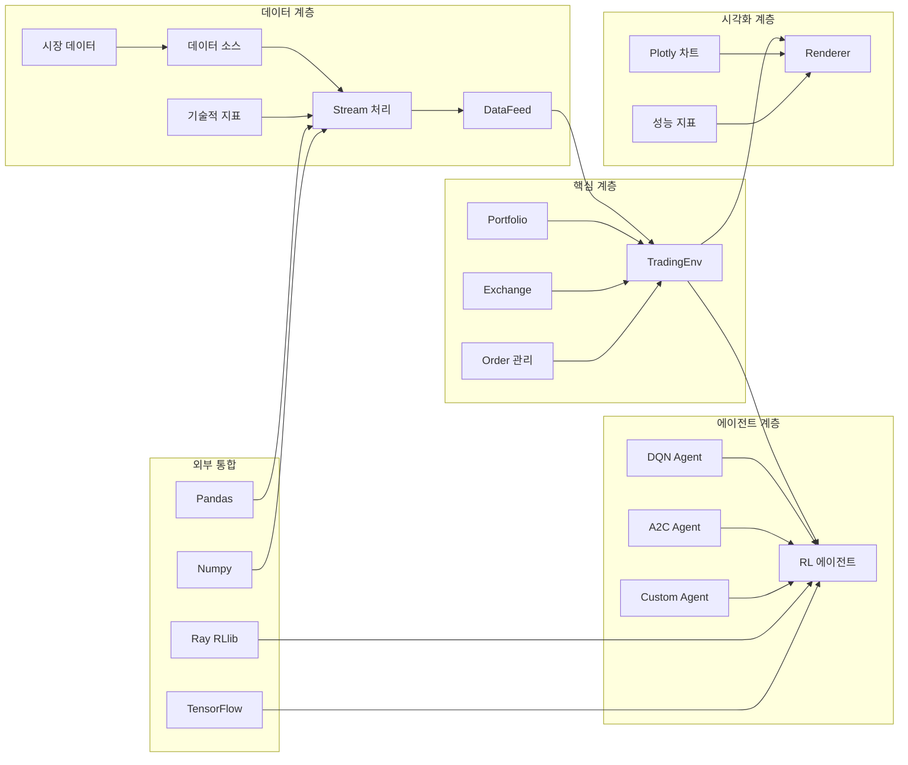
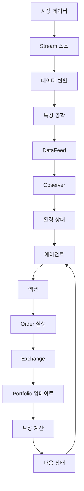
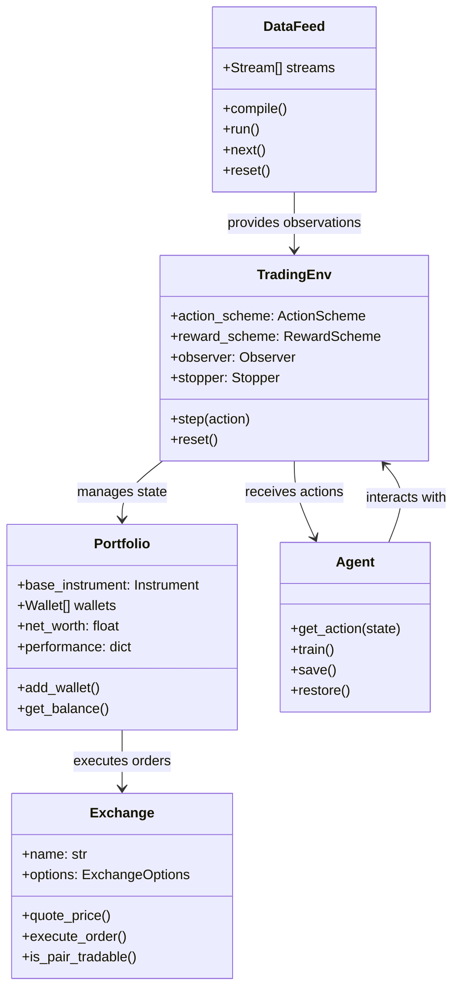
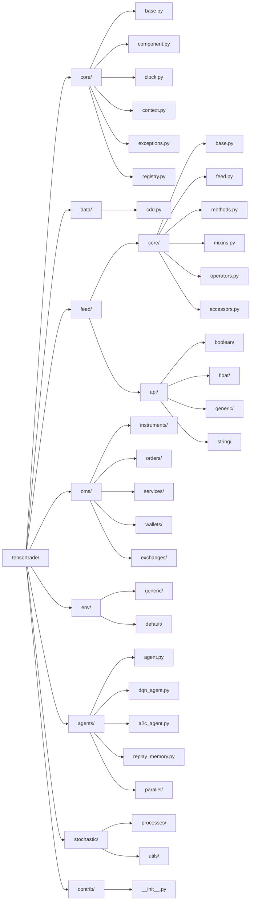

# TensorTrade 포괄적 분석 보고서

## 프로젝트 개요

### 소개

TensorTrade는 강화 학습(Reinforcement Learning)을 사용하여 견고한 거래 알고리즘을 구축, 훈련, 평가 및 배포하기 위한 오픈 소스 Python 프레임워크입니다. 이 프레임워크는 높은 구성 가능성(composability)과 확장성(extensibility)에 중점을 두어 단일 CPU에서의 간단한 거래 전략부터 HPC 머신 분산에서 실행되는 복잡한 투자 전략까지 시스템이 확장될 수 있도록 설계되었습니다.

### 문제 정의

전통적인 알고리즘 거래 시스템은 다음과 같은 문제에 직면합니다:

1. **복잡한 데이터 파이프라인**: 금융 데이터 전처리, 특성 공학, 기술적 지표 계산이 복잡하고 비효율적
2. **환경 설정의 어려움**: 다양한 거래 환경(암호화폐, 주식, 외환 등)을 통합적으로 테스트하기 어려움
3. **전략 평가의 비효율성**: 다양한 시장 조건에서 거래 전략의 성능을 체계적으로 평가하기 어려움
4. **확장성 부족**: 새로운 거래 전략이나 시장 데이터 소스를 쉽게 통합하기 어려움

### 해결 방법

TensorTrade는 이러한 문제를 다음과 같은 방식으로 해결합니다:

1. **모듈형 아키텍처**: 모든 구성요소를 독립적인 모듈로 설계하여 재사용성과 조합 가능성 극대화
2. **표준화된 데이터 피드**: Stream 기반의 데이터 처리 파이프라인으로 일관된 데이터 처리 방식 제공
3. **유연한 환경 설정**: 다양한 거래소, 지표, 보상 체계를 쉽게 교체할 수 있는 인터페이스 제공
4. **강화 학습 통합**: Gym 호환 환경을 통해 다양한 RL 알고리즘과 쉽게 통합

### 핵심 기능

1. **데이터 피드 시스템**: 실시간 및 역사적 데이터 처리를 위한 Stream 기반 아키텍처
2. **주문 관리 시스템**: 다양한 주문 유형(시장가, 지정가, 조건부 등) 지원
3. **포트폴리오 관리**: 여러 거래소와 자산 클래스에 대한 통합 자산 관리
4. **환경 구성**: Action Scheme, Reward Scheme, Observer, Renderer 등을 통한 유연한 환경 설정
5. **에이전트 통합**: DQN, A2C 등 다양한 강화 학습 알고리즘 지원
6. **시각화 도구**: Plotly를 통한 실시간 거래 시각화 및 성능 분석

### 대상 사용자 및 사용 사례

#### 대상 사용자

1. **금융 연구원**: 알고리즘 거래 전략 연구 및 개발
2. **퀀트 펀드 매니저**: 시스템적 거래 전략 구현 및 백테스팅
3. **개인 투자자**: 자동화된 거래 시스템 구축
4. **금융 교육자**: 강화 학습 및 알고리즘 거래 교육
5. **FinTech 기업**: 거래 시스템 개발 및 상용화

#### 사용 사례

1. **암호화폐 거래 봇**: Bitcoin, Ethereum 등 암호화폐 자동 거래
2. **주식 포트폴리오 최적화**: 다자산 포트폴리오의 리밸런싱 및 리스크 관리
3. **고빈도 거래 전략**: HFT(High-Frequency Trading) 알고리즘 개발
4. **시장 중립 전략**: 다양한 시장 조건에서 안정적인 수익률 목표
5. **백테스팅 플랫폼**: 역사적 데이터를 이용한 전략 검증

## 기술 아키텍처

### 고수준 아키텍처

TensorTrade는 계층적 아키텍처 패턴을 따르며, 각 계층은 특정 책임을 가집니다:



### 상세 아키텍처

#### 1. 데이터 흐름 아키텍처



#### 2. 컴포넌트 상호작용



### 기술 스택

#### 핵심 의존성

1. **데이터 처리**
   - `pandas>=0.25.0`: 데이터 조작 및 분석
   - `numpy>=1.17.0`: 수치 계산 및 배열 연산
   - `stochastic>=0.6.0`: 확률 과정 모델링

2. **머신러닝**
   - `tensorflow>=2.7.0`: 딥러닝 프레임워크
   - `gymnasium>=0.28.1`: 강화 학습 환경

3. **시각화**
   - `matplotlib>=3.1.1`: 기본 시각화
   - `plotly>=4.5.0`: 인터랙티브 차트
   - `ipython>=7.12.0`: 노트북 통합

4. **금융 분석**
   - `ta>=0.4.7`: 기술적 지표 (테스트용)
   - `pyyaml>=5.1.2`: 설정 파일 관리

#### 디자인 패턴

1. **스트림 패턴**: 데이터 파이프라인 구축을 위한 함수형 프로그래밍 패턴
2. **컴포넌트 패턴**: 재사용 가능한 독립 컴포넌트 설계
3. **옵저버 패턴**: 상태 변화에 대한 이벤트 기반 알림 시스템
4. **전략 패턴**: 교체 가능한 알고리즘 및 정책 구현
5. **팩토리 패턴**: 다양한 유형의 에이전트 및 컴포넌트 생성

#### 아키텍처 결정사항

1. **모듈성**: 각 컴포넌트는 독립적으로 동작하며 쉽게 교체 가능
2. **확장성**: 새로운 데이터 소스, 거래소, 에이전트를 쉽게 추가 가능
3. **유연성**: 런타임에 동적으로 환경 구성 가능
4. **성능**: 스트림 기반의 효율적인 데이터 처리 파이프라인
5. **테스트 용이성**: 모듈화된 설계로 단위 테스트 용이

## 프로젝트 구조

### 디렉토리 구조



### 주요 모듈 설명

#### 1. core 모듈
프레임워크의 기본 구성요소를 정의합니다.

- **base.py**: `Identifiable`, `TimeIndexed`, `TimedIdentifiable`, `Observable` 등 기본 클래스
- **component.py**: 컴포넌트의 기본 인터페이스 및 레지스트리 시스템
- **clock.py**: 글로벌 시간 관리 및 동기화
- **context.py**: 실행 컨텍스트 관리
- **exceptions.py**: 커스텀 예외 클래스 정의
- **registry.py**: 컴포넌트 등록 및 검색 시스템

#### 2. data 모듈
데이터 수집 및 처리 기능을 제공합니다.

- **cdd.py**: CryptoDataDownload 클래스를 통한 암호화폐 데이터 수집

#### 3. feed 모듈
스트림 기반의 데이터 처리 파이프라인을 구현합니다.

- **core/**: 스트림의 핵심 구현 (`Stream`, `DataFeed`, `Group` 등)
- **api/**: 다양한 데이터 타입을 위한 연산 및 변환 기능
  - **boolean/**: 부울 연산
  - **float/**: 부동소수점 연산, 누적, 윈도우 함수
  - **generic/**: 일반 연산 및 리듀스
  - **string/**: 문자열 연산

#### 4. oms (Order Management System) 모듈
거래 실행 및 자산 관리 시스템을 구현합니다.

- **instruments/**: 금융 상품 정의 (`Instrument`, `TradingPair`, `Quantity`)
- **orders/**: 주문 관리 (`Order`, `Trade`, `OrderSpec`, `Criteria`)
- **services/**: 거래 실행 서비스 (`execution`, `slippage`)
- **wallets/**: 지갑 및 포트폴리오 관리 (`Wallet`, `Portfolio`, `Ledger`)
- **exchanges/**: 거래소 구현 (`Exchange`, `ExchangeOptions`)

#### 5. env 모듈
강화 학습 환경을 구현합니다.

- **generic/**: 일반적인 거래 환경 구현 (`TradingEnv`)
- **default/**: 기본 구성요소 구현 (actions, rewards, observers, stoppers, informers, renderers)

#### 6. agents 모듈
강화 학습 에이전트를 구현합니다.

- **agent.py**: 에이전트 기본 인터페이스
- **dqn_agent.py**: Deep Q-Network 에이전트 구현
- **a2c_agent.py**: Advantage Actor-Critic 에이전트 구현
- **replay_memory.py**: 경험 재생 메모리
- **parallel/**: 병렬 처리 에이전트

#### 7. stochastic 모듈
확률 과정 모델링을 위한 유틸리티를 제공합니다.

- **processes/**: 다양한 확률 과정 (Brownian Motion, GBM, Heston 등)
- **utils/**: 확률 과정 관련 유틸리티 함수

## 설치 및 설정

### 전제 조건

- **Python**: 3.11.9 이상
- **운영체제**: Windows, macOS, Linux
- **메모리**: 최소 4GB RAM (권장 8GB 이상)
- **저장 공간**: 최소 1GB 여유 공간

### 시스템 요구사항

#### 필수 라이브러리
```
numpy>=1.17.0
pandas>=0.25.0
gymnasium>=0.28.1
pyyaml>=5.1.2
stochastic>=0.6.0
tensorflow>=2.7.0
ipython>=7.12.0
matplotlib>=3.1.1
plotly>=4.5.0
deprecated>=1.2.13
```

#### 선택적 라이브러리 (테스트용)
```
pytest>=5.1.1
ta>=0.4.7
```

### 단계별 설치 가이드

#### 1. pip를 통한 설치 (권장)

```bash
# 기본 설치
pip install tensortrade

# 최신 개발 버전 설치
pip install git+https://github.com/tensortrade-org/tensortrade.git
```

#### 2. 소스에서 직접 설치

```bash
# 리포지토리 클론
git clone https://github.com/tensortrade-org/tensortrade.git
cd tensortrade

# 의존성 설치
pip install -r requirements.txt
pip install -r examples/requirements.txt  # 예제 실행용

# 패키지 설치
pip install -e .
```

#### 3. Docker를 통한 설치

```bash
# 이미지 빌드
docker build -t tensortrade .

# 컨테이너 실행
docker run -it tensortrade
```

### 구성 지침

#### 1. 기본 환경 설정

```python
import tensortrade.env.default as default
from tensortrade.oms.instruments import USD, BTC
from tensortrade.oms.wallets import Wallet, Portfolio
from tensortrade.oms.exchanges import Exchange
from tensortrade.feed.core import DataFeed, Stream

# 포트폴리오 설정
portfolio = Portfolio(USD, [
    Wallet(exchange, 10000 * USD),
    Wallet(exchange, 0 * BTC)
])

# 데이터 피드 설정
price_stream = Stream.source([100, 200, 150], dtype="float").rename("USD-BTC")
feed = DataFeed([price_stream])

# 환경 생성
env = default.create(
    portfolio=portfolio,
    action_scheme="managed-risk",
    reward_scheme="simple",
    feed=feed
)
```

#### 2. YAML 설정 파일

```yaml
# configuration.yaml
exchange:
  name: "bitstamp"
  commission: 0.001
  
portfolio:
  base_instrument: "USD"
  initial_balance: 10000
  
environment:
  window_size: 30
  min_periods: 10
  
features:
  - name: "price"
    source: "close"
  - name: "volume"
    source: "volume"
```

```python
import yaml
with open("configuration.yaml", "r") as f:
    config = yaml.safe_load(f)
    
# 설정을 통한 환경 생성
env = create_from_config(config)
```

### 일반적인 문제 해결 방법

#### 1. 설치 문제

**문제**: ImportError: No module named 'tensortrade'
**해결**: 
```bash
# 설치 경로 확인
python -c "import sys; print(sys.path)"

# pip 업그레이드
pip install --upgrade tensortrade

# 개발 모드 설치 확인
pip install -e .
```

**문제**: TensorFlow 호환성 오류
**해결**:
```bash
# 특정 버전 설치
pip install tensorflow==2.7.0

# GPU 지원 버전 설치
pip install tensorflow-gpu==2.7.0
```

#### 2. 런타임 오류

**문제**: Stream 실행 오류
**해결**:
```python
# 스트림 컴파일 확인
feed.compile()

# 데이터 유효성 검사
assert all(stream.has_next() for stream in feed.streams)

# 디버깅 모드 활성화
import logging
logging.basicConfig(level=logging.DEBUG)
```

**문제**: 메모리 부족
**해결**:
```python
# 배치 사이즈 조절
batch_size = 32  # 기본값 대신 줄이기

# 데이터 청크 사용
feed.reset(random_start=1000)  # 데이터의 일부만 사용

# 메모리 최적화
import gc
gc.collect()  # 가비지 컬렉션
```

#### 3. 성능 문제

**문제**: 느린 훈련 속도
**해결**:
```python
# 병렬 처리 활성화
from tensortrade.agents.parallel import ParallelDQNAgent
agent = ParallelDQNAgent(env)

# 데이터 프리페칭
feed.compile()  # 미리 컴파일하여 런타임 오버헤드 감소

# GPU 가속화
import tensorflow as tf
# GPU 사용 가능 확인
print(tf.config.list_physical_devices('GPU'))
```

## 사용 가이드

### 기본 사용 예제

#### 1. 간단한 거래 환경 설정

```python
import tensortrade.env.default as default
from tensortrade.oms.instruments import USD, BTC
from tensortrade.oms.wallets import Wallet, Portfolio
from tensortrade.oms.exchanges import Exchange
from tensortrade.feed.core import DataFeed, Stream
from tensortrade.oms.services.execution.simulated import execute_order

# 거래소 설정
exchange = Exchange("bitstamp", service=execute_order)(
    Stream.source([100, 200, 150, 180, 220], dtype="float").rename("USD-BTC")
)

# 포트폴리오 설정
portfolio = Portfolio(USD, [
    Wallet(exchange, 10000 * USD),
    Wallet(exchange, 0 * BTC)
])

# 데이터 피드 설정
feed = DataFeed([
    Stream.source([100, 200, 150, 180, 220], dtype="float").rename("price"),
    Stream.source([1000, 1500, 800, 1200, 2000], dtype="float").rename("volume")
])

# 환경 생성
env = default.create(
    portfolio=portfolio,
    action_scheme="managed-risk",
    reward_scheme="simple",
    feed=feed,
    window_size=10
)

# 환경 실행
done = False
while not done:
    action = agent.get_action(env.observer.feed.next())
    done, reward = env.step(action)
    print(f"Action: {action}, Reward: {reward}")
```

#### 2. 기술적 지표를 활용한 거래

```python
import ta
import pandas as pd
from tensortrade.data.cdd import CryptoDataDownload

# 데이터 수집 및 지표 계산
data = CryptoDataDownload().fetch("Bitfinex", "USD", "BTC", "1h")

# RSI 지표 추가
data['rsi'] = ta.momentum.rsi(data['close'], length=14)

# 이동 평균 추가
data['sma_20'] = ta.trend.sma(data['close'], length=20)
data['sma_50'] = ta.trend.sma(data['close'], length=50)

# 볼린저 밴드 추가
data['bb_upper'], data['bb_middle'], data['bb_lower'] = ta.volatility.bbands(
    data['close'], length=20, std=2
)

# 스트림 생성
price_stream = Stream.source(list(data['close']), dtype="float").rename("USD-BTC")
rsi_stream = Stream.source(list(data['rsi']), dtype="float").rename("rsi")
sma_stream = Stream.source(list(data['sma_20']), dtype="float").rename("sma_20")

feed = DataFeed([price_stream, rsi_stream, sma_stream])
```

#### 3. 커스텀 보상 체계

```python
from tensortrade.env.default.rewards import TensorTradeRewardScheme

class RiskAdjustedReturn(TensorTradeRewardScheme):
    """리스크 조정 수익률 기반 보상 체계"""
    
    def __init__(self, risk_free_rate=0.02, window_size=30):
        self.risk_free_rate = risk_free_rate
        self.window_size = window_size
        
    def get_reward(self, portfolio):
        performance = pd.DataFrame.from_dict(portfolio.performance).T
        returns = performance['net_worth'].pct_change()
        
        if len(returns) < 2:
            return 0.0
            
        # 샤프 비율 계산
        excess_returns = returns - self.risk_free_rate / 252  # 일일 기준
        
        # 하방 변동성만 고려
        downside_returns = returns.copy()
        downside_returns[downside_returns > 0] = 0
        
        downside_volatility = downside_returns.std()
        
        if downside_volatility == 0:
            return 0.0
            
        # 샤프 비율 계산
        sharpe_ratio = excess_returns.mean() / downside_volatility
        
        return sharpe_ratio * self.window_size
```

### 고급 기능

#### 1. 다중 거래소 지원

```python
from tensortrade.oms.instruments import USD, BTC, ETH
from tensortrade.oms.exchanges import Exchange

# 여러 거래소 설정
bitfinex = Exchange("bitfinex", service=execute_order)(
    Stream.source(bitfinex_btc_price, dtype="float").rename("USD-BTC"),
    Stream.source(bitfinex_eth_price, dtype="float").rename("USD-ETH")
)

bitstamp = Exchange("bitstamp", service=execute_order)(
    Stream.source(bitstamp_btc_price, dtype="float").rename("USD-BTC"),
    Stream.source(bitstamp_ltc_price, dtype="float").rename("USD-LTC")
)

# 다중 거래소 포트폴리오
portfolio = Portfolio(USD, [
    Wallet(bitfinex, 5000 * USD),
    Wallet(bitfinex, 2 * BTC),
    Wallet(bitfinex, 10 * ETH),
    Wallet(bitstamp, 3000 * USD),
    Wallet(bitstamp, 1 * BTC),
    Wallet(bitstamp, 5 * LTC)
])
```

#### 2. 커스텀 액션 스킴

```python
from tensortrade.env.default.actions import TensorTradeActionScheme

class MomentumActionScheme(TensorTradeActionScheme):
    """모멘텀 기반 액션 스킴"""
    
    def __init__(self, momentum_period=20, threshold=0.02):
        self.momentum_period = momentum_period
        self.threshold = threshold
        
    def get_action(self, state, portfolio):
        # 모멘텀 계산
        prices = [s.value for s in self.price_streams]
        if len(prices) < self.momentum_period:
            return self.hold_action
            
        momentum = (prices[-1] - prices[-self.momentum_period]) / prices[-self.momentum_period]
        
        if momentum > self.threshold:
            return self.buy_action
        elif momentum < -self.threshold:
            return self.sell_action
        else:
            return self.hold_action
```

#### 3. 실시간 데이터 처리

```python
from tensortrade.feed.core import PushFeed, Stream, Placeholder

# 실시간 데이터 피드 설정
price_placeholder = Stream.placeholder("float").rename("price")
volume_placeholder = Stream.placeholder("float").rename("volume")

live_feed = PushFeed([
    price_placeholder,
    volume_placeholder
])

# 실시간 데이터 처리 루프
while True:
    # 실시간 데이터 수신 (예: WebSocket API)
    live_data = get_market_data()  # 사용자 정의 함수
    
    # 데이터 피드에 푸시
    observations = live_feed.push({
        "price": live_data['price'],
        "volume": live_data['volume']
    })
    
    # 에이전트 액션 및 환경 스텝
    action = agent.get_action(observations)
    done, reward = env.step(action)
    
    # 결과 처리
    handle_result(done, reward)
```

### 구성 옵션

#### 1. 환경 설정

```python
env = default.create(
    portfolio=portfolio,
    action_scheme=action_scheme,
    reward_scheme=reward_scheme,
    feed=feed,
    window_size=30,           # 관찰 윈도우 크기
    min_periods=10,           # 최소 웜업 기간
    max_allowed_loss=0.5,     # 최대 허용 손실
    random_start_pct=0.1,     # 랜덤 시작 위치
    renderer="plotly",         # 시각화 도구
    stopper="max_loss",       # 중단 조건
    informer="tensorrade"      # 정보 제공자
)
```

#### 2. 거래소 옵션

```python
from tensortrade.oms.exchanges import ExchangeOptions

options = ExchangeOptions(
    commission=0.001,        # 수수료율
    min_trade_size=1e-6,      # 최소 거래 크기
    max_trade_size=1e6,       # 최대 거래 크기
    min_trade_price=1e-8,     # 최소 거래 가격
    max_trade_price=1e8,      # 최대 거래 가격
    is_live=False              # 라이브 거래 여부
)

exchange = Exchange("bitstamp", service=execute_order, options=options)
```

### API 문서

#### 핵심 클래스

##### DataFeed

```python
class DataFeed(Stream[dict]):
    """스트림을 컴파일하고 조직된 방식으로 실행하는 데이터 피드"""
    
    def __init__(self, streams: List[Stream]):
        """스트림 목록으로부터 데이터 피드 초기화"""
        
    def compile(self) -> None:
        """모든 스트림을 컴파일하고 실행 순서 정리"""
        
    def run(self) -> None:
        """실행 순서대로 모든 스트림 실행"""
        
    def next(self) -> dict:
        """다음 데이터 포인트 반환"""
        
    def reset(self, random_start=0) -> None:
        """모든 스트림 리셋"""
```

##### Portfolio

```python
class Portfolio(Component, TimedIdentifiable):
    """거래소 지갑 모음"""
    
    def __init__(self, base_instrument, wallets=None):
        """기준 통화와 지갑 목록으로 포트폴리오 초기화"""
        
    @property
    def net_worth(self) -> float:
        """총 순자산 계산"""
        
    @property
    def performance(self) -> OrderedDict:
        """성능 지표 반환"""
        
    def balance(self, instrument) -> Quantity:
        """특정 상품 잔고 조회"""
```

##### Exchange

```python
class Exchange(Component, TimedIdentifiable):
    """거래 실행을 위한 추상 거래소"""
    
    def __init__(self, name, service, options=None):
        """거래소 이름, 실행 서비스, 옵션으로 초기화"""
        
    def quote_price(self, trading_pair) -> Decimal:
        """거래 쌍의 호가 가격 조회"""
        
    def execute_order(self, order, portfolio) -> None:
        """포트폴리오를 사용하여 주문 실행"""
        
    def is_pair_tradable(self, trading_pair) -> bool:
        """거래 쌍이 거래 가능한지 확인"""
```

### 명령줄 인터페이스 참조

TensorTrade는 현재 직접적인 CLI를 제공하지 않지만, 스크립트를 통해 실행할 수 있습니다:

#### 1. 예제 실행

```bash
# 예제 디렉토리로 이동
cd examples

# Jupyter 노트북 실행
jupyter notebook train_and_evaluate.ipynb

# Python 스크립트 실행
python setup_environment_tutorial.py
```

#### 2. 테스트 실행

```bash
# 전체 테스트 스위트 실행
pytest tests/

# 특정 모듈 테스트
pytest tests/tensortrade/unit/core/

# 커버리지 확인
pytest --cov=tensortrade tests/

# PEP8 스타일 확인
pytest --pep8 tests/
```

## 개발 지침

### 개발 환경 설정 방법

#### 1. 개발 환경 구축

```bash
# 리포지토리 클론
git clone https://github.com/tensortrade-org/tensortrade.git
cd tensortrade

# 가상 환경 생성
python -m venv tensortrade-dev
source tensortrade-dev/bin/activate  # Linux/macOS
# tensortrade-dev\Scripts\activate  # Windows

# 개발 의존성 설치
pip install -r requirements.txt
pip install -r examples/requirements.txt
pip install -e .  # 개발 모드 설치

# 테스트 도구 설치
pip install pytest pytest-cov pytest-pep8
```

#### 2. IDE 설정

**VS Code 설정**:
```json
// .vscode/settings.json
{
    "python.defaultInterpreterPath": "./tensortrade-dev/bin/python",
    "python.linting.enabled": true,
    "python.linting.pylintEnabled": true,
    "python.formatting.provider": "black"
}
```

**PyCharm 설정**:
- Python Interpreter를 가상 환경으로 설정
- Code Style을 PEP8로 설정
- Test Runner를 pytest로 설정

### 코드 스타일 및 규칙

#### 1. PEP8 준수

```python
# 좋은 예
class MyComponent:
    def __init__(self, parameter1, parameter2):
        self.parameter1 = parameter1
        self.parameter2 = parameter2
        
    def process_data(self, data):
        result = self.parameter1 + self.parameter2
        return result

# 나쁜 예
class mycomponent:
    def __init__(self, p1, p2):
        self.p1=p1;self.p2=p2  # 세미콜론 사용
    def process_data(self,data):  # 공백 부족
        r=self.p1+self.p2
        return r
```

#### 2. 명명 규칙

```python
# 클래스: PascalCase
class DataFeed:
    pass

# 함수: snake_case
def process_data_stream():
    pass

# 상수: UPPER_CASE
MAX_WINDOW_SIZE = 100

# 변수: snake_case
current_price = 100.0
```

#### 3. 문서화 규칙

```python
def calculate_moving_average(prices, window_size):
    """이동 평균을 계산합니다.
    
    Parameters
    ----------
    prices : List[float]
        가격 데이터 목록
    window_size : int
        이동 평균 윈도우 크기
        
    Returns
    -------
    float
        계산된 이동 평균값
        
    Raises
    ------
    ValueError
        window_size가 prices 길이보다 큰 경우
    """
    if window_size > len(prices):
        raise ValueError("Window size cannot be greater than data length")
        
    return sum(prices[-window_size:]) / window_size
```

### 테스트 절차 및 커버리지

#### 1. 단위 테스트 작성

```python
import pytest
from tensortrade.feed.core import Stream

class TestStream:
    def test_stream_creation(self):
        """스트림 생성 테스트"""
        stream = Stream.source([1, 2, 3], dtype="float")
        assert stream.dtype == "float"
        assert stream.has_next() == True
        
    def test_stream_forward(self):
        """스트림 전진 테스트"""
        stream = Stream.source([1, 2, 3], dtype="float")
        assert stream.forward() == 1
        assert stream.forward() == 2
        
    def test_stream_reset(self):
        """스트림 리셋 테스트"""
        stream = Stream.source([1, 2, 3], dtype="float")
        stream.forward()  # 첫 번째 값 소비
        stream.reset()
        assert stream.forward() == 1  # 다시 시작
```

#### 2. 통합 테스트 작성

```python
import pytest
from tensortrade.env.default import create
from tensortrade.oms.wallets import Portfolio, Wallet

class TestTradingEnv:
    def test_environment_creation(self):
        """환경 생성 테스트"""
        portfolio = Portfolio(USD, [Wallet(exchange, 1000 * USD)])
        feed = create_test_feed()
        
        env = create(
            portfolio=portfolio,
            action_scheme="simple",
            reward_scheme="simple",
            feed=feed
        )
        
        assert env.portfolio == portfolio
        assert env.action_scheme is not None
        assert env.reward_scheme is not None
        
    def test_environment_step(self):
        """환경 스텝 테스트"""
        # 테스트 환경 설정
        env = create_test_environment()
        
        # 초기 상태 확인
        initial_worth = env.portfolio.net_worth
        
        # 액션 실행
        action = env.action_scheme.get_action(env.observer.feed.next())
        done, reward = env.step(action)
        
        # 상태 변화 확인
        assert not done
        assert isinstance(reward, (int, float))
```

#### 3. 커버리지 확인

```bash
# 전체 커버리지 확인
pytest --cov=tensortrade --cov-report=html tests/

# 특정 모듈 커버리지 확인
pytest --cov=tensortrade.feed --cov-report=html tests/tensortrade/unit/feed/

# 커버리지 기준 설정
pytest --cov-fail-under=90 tests/

# 커버리지 리포트 생성
coverage html
```

### 기여 가이드라인

#### 1. 이슈 보고

```bash
# 버그 리포트
1. 기존 이슈 검색: https://github.com/tensortrade-org/tensortrade/issues
2. 새 이슈 생성 시 템플릿 사용
3. 재현 가능한 최소 예제 포함
4. 환경 정보 상세히 기술 (OS, Python 버전, 의존성 버전)
```

#### 2. 풀 리퀘스트 제출

```bash
# 1. Fork 리포지토리
git fork https://github.com/tensortrade-org/tensortrade

# 2. 기능 브랜치 생성
git checkout -b feature/new-feature

# 3. 변경 사항 커밋
git add .
git commit -m "Add new feature implementation"

# 4. 원격 리포지토리에 푸시
git push origin feature/new-feature

# 5. Pull Request 생성
# GitHub에서 PR 생성 및 상세한 설명 작성
```

#### 3. 코드 리뷰 가이드라인

```python
# 리뷰 체크리스트
- [ ] 코드가 PEP8을 준수하는가?
- [ ] 문서화가 충분한가?
- [ ] 단위 테스트가 작성되었는가?
- [ ] 통합 테스트가 통과하는가?
- [ ] 성능 저하가 없는가?
- [ ] 보안 취약점이 없는가?
```

## 추가 정보

### 성능 고려사항

#### 1. 메모리 최적화

```python
# 배치 처리를 통한 메모리 사용량 감소
def process_large_dataset(data, batch_size=1000):
    for i in range(0, len(data), batch_size):
        batch = data[i:i+batch_size]
        yield process_batch(batch)
        
# 스트림 컴파일로 런타임 오버헤드 감소
feed.compile()

# 가비지 컬렉션 명시적 호출
import gc
gc.collect()

# 메모리 효율적인 데이터 구조
# 나쁜 예: 많은 양의 중첩 리스트
data = [[item for item in large_dataset]]

# 좋은 예: 제너레이터를 통한 지연 평가
def data_generator(dataset):
    for item in dataset:
        yield item
```

#### 2. 계산 최적화

```python
# NumPy 벡터화 연산 사용
# 나쁜 예: 루프를 통한 요소별 계산
result = []
for i in range(len(data)):
    result.append(data[i] * 2)

# 좋은 예: 벡터화 연산
import numpy as np
data_array = np.array(data)
result = data_array * 2
```

#### 3. 병렬 처리

```python
from multiprocessing import Pool
import numpy as np

def parallel_feature_calculation(data_chunks, n_processes=4):
    with Pool(n_processes) as pool:
        results = pool.map(calculate_features, data_chunks)
    return np.concatenate(results)
```

### 보안 고려사항

#### 1. 데이터 검증

```python
def validate_price_data(prices):
    """가격 데이터 유효성 검증"""
    if len(prices) == 0:
        raise ValueError("Empty price data")
        
    if any(p <= 0 for p in prices):
        raise ValueError("Non-positive prices detected")
        
    if any(np.isnan(p) for p in prices):
        raise ValueError("NaN prices detected")
        
    return True

def validate_order_quantity(quantity):
    """주문 수량 유효성 검증"""
    if quantity <= 0:
        raise ValueError("Order quantity must be positive")
        
    if quantity > MAX_ORDER_SIZE:
        raise ValueError(f"Order size exceeds maximum: {MAX_ORDER_SIZE}")
        
    return True
```

#### 2. 입력 검증

```python
class SecureExchange(Exchange):
    def execute_order(self, order, portfolio):
        # 주문 유효성 검증
        if not self.validate_order(order):
            raise InvalidOrderError("Order validation failed")
            
        # 포트폴리오 잔고 확인
        if not self.check_sufficient_balance(order, portfolio):
            raise InsufficientBalanceError("Insufficient balance")
            
        # 주문 실행
        return super().execute_order(order, portfolio)
```

#### 3. 예외 처리

```python
import logging

class TradingError(Exception):
    """거래 관련 오류의 기본 클래스"""
    pass

class InsufficientBalanceError(TradingError):
    """잔고 부족 오류"""
    pass

def safe_execute_order(order, portfolio):
    try:
        result = execute_order(order, portfolio)
        return result, None
    except TradingError as e:
        logging.error(f"Order execution failed: {e}")
        return None, e
```

### 프로젝트 로드맵 및 향후 계획

#### 현재 개발 로드맵

1. **v1.1.0**: 안정화 릴리스
   - 기본 거래 환경 구현
   - DQN 및 A2C 에이전트 지원

2. **v1.0.4-dev1**: 현재 개발 버전
   - Stream 기반 데이터 파이프라인 개선
   - 병렬 에이전트 지원
   - 확장성 향상

#### 향후 계획

1. **v1.1.0**: 안정화 릴리스
   - 실시간 거래 지원
   - 고급 주문 유형 (OCO, Iceberg 등)
   - 리스크 관리 도구 강화

2. **v1.2.0**: 확장성 릴리스
   - 플러그인 아키텍처 도입
   - 커뮤니티 기반 확장
   - 클라우드 배포 도구

3. **v2.0.0**: 차세대 릴리스
   - 분산 거래 지원
   - 고급 시각화 도구
   - 자동 하이퍼파라미터 튜닝
   - 프로덕션 준비

### 라이선스 및 저작권 표시

#### 라이선스

TensorTrade는 Apache License 2.0 하에 배포됩니다.

```
Copyright 2021 The TensorTrade Authors.

Licensed under the Apache License, Version 2.0 (the "License");
you may not use this file except in compliance with the License.
You may obtain a copy of the License at

    http://www.apache.org/licenses/LICENSE-2.0

Unless required by applicable law or agreed to in writing, software
distributed under the License is distributed on an "AS IS" BASIS,
WITHOUT WARRANTIES OR CONDITIONS OF ANY KIND, either express or implied.
See the License for the specific language governing permissions and
limitations under the License.
```

#### 저작권

- **주요 개발자**: Adam King, Matthew Brulhardt, Carlo Grisetti
- **기여자**: GitHub 컨트리뷰터 전체
- **라이선스**: Apache License 2.0
- **상표**: 등록된 상표는 해당 소유자에게 귀속

#### 사용 조건

1. **상업적 사용**: 자유롭게 사용 가능
2. **수정 권한**: 소스 코드 수정 및 재배포 가능
3. **특허**: 특허 라이선스 하에서 사용 가능
4. **보증 부책**: 소프트웨어가 있는 그대로 제공됨
5. **책임 제한**: 저작권자는 어떠한 책임도 지지 않음

---

이 보고서는 TensorTrade 프레임워크의 포괄적인 분석을 제공합니다. TensorTrade는 강화 학습 기반의 알고리즘 거래 시스템 개발을 위한 강력하고 유연한 도구로, 금융 연구원과 퀀트 펀드 매니저 모두에게 유용한 솔루션을 제공합니다.